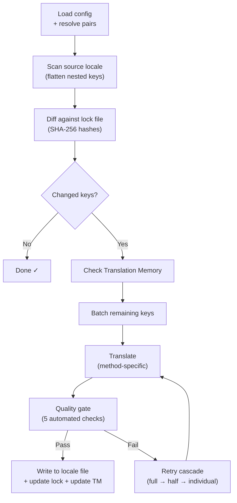

# Como o champollion Funciona

champollion traduz os arquivos de locale do seu app com um único comando. Aqui está o que acontece nos bastidores.

## O Pipeline

Quando você executa `npx champollion sync`, champollion executa um pipeline de seis estágios:



**Decisões de design principais:**

- **Detecção de mudanças via hashes SHA-256.** Champollion rastreia cada valor de origem com um hash em `.champollion.lock`. Quando você atualiza uma string em inglês, apenas essa chave é retraduzida. É por isso que `sync` é rápido em execuções repetidas — ele faz o mínimo de trabalho.

- **Cache de Memória de Tradução.** Antes de fazer qualquer chamada de API, champollion verifica `.champollion/tm.json` para traduções em cache (indexadas por texto de origem + locale + método). Em uma ressincronização típica após alterar uma chave, 142 chaves vêm do cache e 1 chave acessa a API.

- **Portão de qualidade antes da escrita.** Cada tradução passa por cinco verificações automatizadas (vazio, eco de origem, loop de alucinação, inflação de comprimento, conformidade de script) antes de tocar seus arquivos. Falhas são registradas, nunca aceitas silenciosamente.

- **Cascata de retry em caso de falha.** Se um lote falhar (erro de parse JSON, timeout de API), champollion tenta novamente com lotes progressivamente menores: completo → metade → individual. Isso isola a chave problemática sem bloquear o resto.

## Métodos de Tradução

O Champollion suporta vários métodos de tradução, cada um adequado para diferentes cenários. Os principais são:

| Método | Como funciona | Melhor para |
|--------|-------------|----------|
| **`llm`** | Prompt estruturado para qualquer modelo OpenRouter | Idiomas bem-recursos |
| **`llm-coached`** | Mesmo prompt + regras gramaticais, dicionário e notas de estilo | Idiomas onde LLMs cometem erros previsíveis |
| **`google-translate`** | Requisição em lote da API Google Cloud Translation | Idiomas de alto-recurso com bom suporte de GT |
| **`api`** | HTTP POST para seu próprio endpoint | Pipelines customizados, modelos controlados pela comunidade |

Os métodos são configurados por par de idiomas. Você pode usar `google-translate` para francês mas `llm-coached` para Plains Cree — cada par recebe o método que funciona melhor para ele.

## Dados de Coaching

Para pares `llm-coached`, dados de coaching fornecem ao LLM conhecimento linguístico explícito: regras gramaticais, terminologia forçada e preferências de estilo. Isso é injetado em cada prompt como contexto estruturado.

```json title="coaching/crk.json"
{
  "grammar_rules": ["Animate nouns take different plural forms than inanimate nouns"],
  "dictionary": {"welcome": "ᑕᓂᓯ", "settings": "ᐃᑕᐢᑌᐘᐃᓇ"},
  "style_notes": "Use Standard Roman Orthography (SRO) unless explicitly configured otherwise."
}
```

Dados de coaching são o mecanismo principal para melhorar a qualidade da tradução sem fazer fine-tuning de um modelo. Altere as regras → execute a sincronização novamente → veja se ajuda. A iteração é instantânea.

## Plugins

Plugins são receitas de tradução pré-empacotadas para pares de idiomas específicos. São manifestos JSON — não código — que dizem ao champollion qual método usar, com quais configurações e qual qualidade foi benchmarkada.

```bash
champollion plugin install ./crk-coached-v3/
champollion sync   # uses the installed plugin for en→crk
```

Plugins preenchem a lacuna entre pesquisa e produção: um método que pontua bem na [Network](/arena) pode ser empacotado como um plugin e implantado aqui.

## O Quadro Geral

champollion é uma metade de um ecossistema de duas partes:

- **[the Network](/arena)** — onde métodos de tradução são **desenvolvidos e comprovados** com benchmarking reproduzível
- **champollion** — onde métodos comprovados são **implantados** para traduzir conteúdo real

A [Eval Harness Bridge](/docs/guides/bridge) conecta os dois. Um método que se prova na Network é implantado aqui. Feedback de falantes da produção melhora a próxima versão.

---

## Aprofunde-se

- [How Sync Works](/docs/concepts/how-sync-works) — passo a passo detalhado do pipeline
- [Quality Gate](/docs/concepts/quality-gate) — as cinco verificações automatizadas
- [Translation Memory](/docs/concepts/translation-memory) — cache e economia de custos
- [Translation Methods](/docs/guides/translation-methods) — comparação detalhada de métodos
- [Architecture](/docs/concepts/architecture) — visão geral do design do sistema
