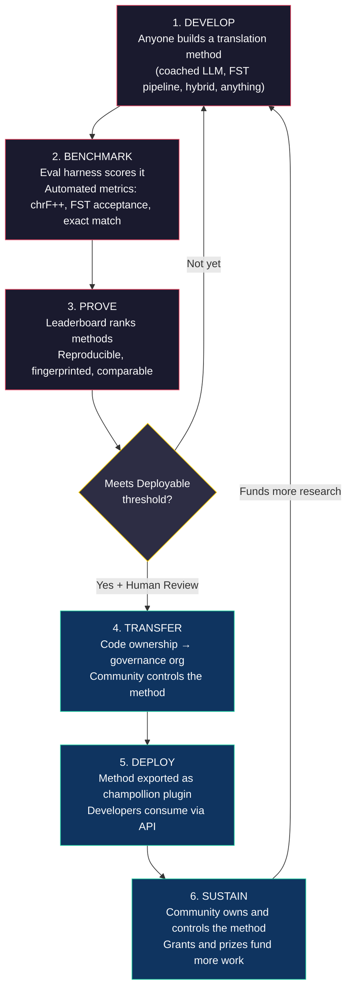
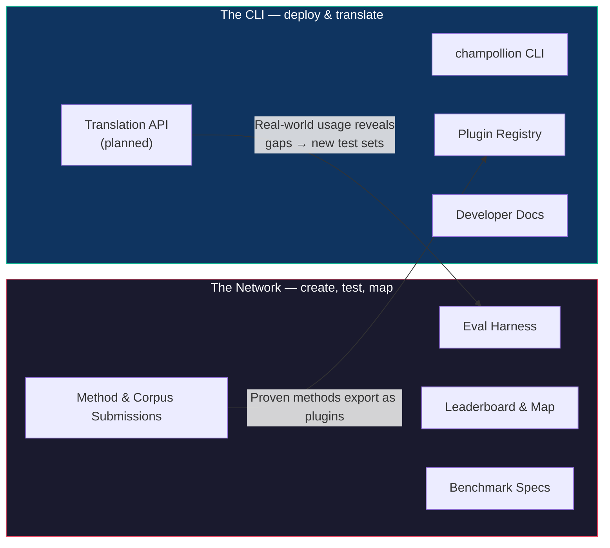
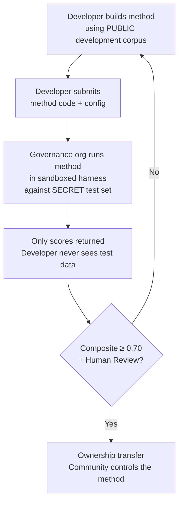

# Como a Rede Funciona: Construir, Testar, Desenvolver, Implantar

> **Resumo Executivo.** A tradução automática para as línguas sub-representadas do mundo não é um problema de treinamento de modelo — é um problema de *infraestrutura*. Nenhum modelo, laboratório ou empresa individual resolverá isso. Este documento descreve uma arquitetura de plataforma que transforma a comunidade global de engenheiros de ML, linguistas e falantes de línguas em um laboratório de pesquisa distribuído: qualquer pessoa constrói um método de tradução, a rede testa se ele funciona — inclusive contra dados de avaliação mantidos pela comunidade que a plataforma nunca vê — e os métodos que funcionam se tornam ativos de propriedade das comunidades cujas línguas eles atendem. O mecanismo é o desenvolvimento de métodos aberto e colaborativo, combinado com termos flexíveis definidos pelos administradores (stewards) — uma combinação ainda rara na prática, e a que acreditamos que este problema exige.

---

> [!IMPORTANT]
> **Escopo.** Esta plataforma avalia a **tradução de textos escritos formais** — documentos, materiais educacionais, comunicações oficiais, strings de interface de usuário (UI). Não é um chatbot, intérprete em tempo real ou sistema conversacional de domínio irrestrito. O leaderboard classifica os métodos de tradução em relação a corpora paralelos curados em domínios de texto específicos (consulte a [Especificação de Benchmark §2.7](/docs/network/specifications/benchmark#27-domain) para a taxonomia de domínio). A tradução automática (MT) é uma infraestrutura para a revitalização de línguas, não um substituto para ela. As crianças aprendem a língua com pessoas, não com máquinas.

### Cobertura Atual de Domínios

O painel está **ativo e sendo preenchido** — as execuções são publicadas nele continuamente, e qualquer pessoa pode adicionar mais. A tabela abaixo mostra quais corpora de referência públicos são *suportados* por domínio; o [leaderboard](/leaderboard) tem as classificações ao vivo.
Os corpora são buscados da fonte em tempo de execução, nunca hospedados aqui.

| Domínio | Corpus de referência | Status | Notas |
|--------|------------------|--------|-------|
| Notícias / jornalismo | Global Voices (OPUS) | Suportado — aberto para submissões | 493 pares de idiomas, CC BY 3.0 |
| Cotidiano / misto (escrito) | Tatoeba | Suportado — aberto para submissões | 874 pares de idiomas, CC BY 2.0 |
| Educacional / livros didáticos | EdTeKLA (Plains Cree) | Apenas pesquisa — **não classificado**; avaliação remota de API de modelo restrita por consentimento | CC BY-NC-SA modificada do EdTeKLA (escopo de soberania, não comercial); excluído do leaderboard, prêmios e rotas de API/comerciais |
| Narrativa / literário | — | Planejado | Nenhum corpus executável conectado ainda |
| Religioso / escrituras | FLORES+ (Domínio bíblico) | Conectado, apenas relativo | Corpus executável; ALTA contaminação, portanto, apenas relativo — nunca usado para pontuação oficial |
| Falado / tempo real | — | Fora do escopo | Este sistema avalia texto escrito, não fala |
| Técnico / científico | — | Futuro | Requer validação de terminologia específica do domínio |

## Para Que Serve a Rede

Antes da mecânica, a missão. A Rede Champollion baseia-se em quatro compromissos:

1. **Criar e confiar em conjuntos de testes de tradução.** Para a maioria das línguas, o recurso escasso e valioso não é mais um modelo — é um conjunto de testes *confiável*: de autoria humana, honesto quanto ao domínio e com versão fixada. A Rede existe para criar esses conjuntos de testes e torná-los confiáveis.
2. **Tornar o campo navegável.** Quem pode traduzir o quê, quão bom é cada método em cada tipo de texto e onde estão as lacunas — apresentados como um mapa público, não enterrados em artigos e PDFs dispersos.
3. **Todo método é bem-vindo — humano e máquina.** Somos pragmáticos com um viés para soluções. Um tradutor profissional, um sistema baseado em regras, um LLM orientado, um modelo com fine-tuning — todos são de primeira classe. Nos importamos em ter as línguas traduzidas, não em qual ferramenta vence.
4. **Construído *com* as comunidades, nunca extraído (scraped) — e a soberania é inegociável.** Dados linguísticos são biodados; as pessoas que fornecem um corpus detêm as chaves para ele e para qualquer coisa medida em relação a ele.

Tudo o que está abaixo — o ciclo, o harness de avaliação, o leaderboard, a ponte de implantação — está a serviço desses quatro compromissos.

---

## 1. O Problema: Tradução Automática ≠ Machine Learning

A tradução automática para línguas de poucos recursos (LRLs) é comumente enquadrada como um problema de machine learning: coletar dados, treinar um modelo, implantar. Esse enquadramento está errado, e o erro tem consequências — ele direciona financiamento, talentos e infraestrutura para uma abordagem que estruturalmente não pode funcionar para a maioria das línguas do mundo.

### 1.1 Por Que o Enquadramento de ML Falha

O pipeline padrão de ML para tradução automática (MT) exige três coisas: grandes corpora paralelos, benchmarks de avaliação validados e um caminho de implantação. Para os 194 idiomas na lista do Google Cloud Translation e os 200 cobertos pelo NLLB-200, os três existem. Para as ~1.200 línguas na cauda longa do OMT-1600 — nossa aritmética: as 1.600 que ele cobre menos as mais de 400 que seus autores relatam que os modelos "entendem suficientemente bem" — existem dados de avaliação, mas a qualidade está em grande parte abaixo dos limites utilizáveis, os pesos do modelo não estão disponíveis publicamente e não há pipeline de implantação. Para as ~5.400+ restantes, nenhum deles existe.

| Requisito | Línguas de Altos Recursos | Cauda Longa do OMT-1600 (~1.200 LRLs) | ~5.400 Línguas Restantes |
|-------------|------------------------|-------------------------------|---------------------------|
| **Corpora paralelos** | Milhões de pares de frases (Europarl, UN Corpus, OpenSubtitles) | Textos paralelos de domínio bíblico, extrações da web (scrapes), retrotradução sintética. Sem dados curados pela comunidade. | Centenas a poucos milhares, se houver |
| **Benchmarks de avaliação** | WMT, FLORES, NTREX — padronizados, reprodutíveis | BOUQuET (domínio bíblico), met-BOUQuET. Sem validação morfológica. Sem avaliação independente. | Sem benchmarks padrão; avaliação ad hoc |
| **Caminho de implantação** | Google Translate, DeepL, Azure — APIs comerciais | Pesos do modelo não lançados. Sem CLI, sem sistema de plugins, sem API implantável pela comunidade. | Nada. Sem API, sem produto, sem mercado. |

A abordagem de ML funciona quando existem dados para treinar e existe um mercado para implantar. O OMT-1600 expandiu a primeira condição significativamente — mas a expansão sem verificação de qualidade independente, validação morfológica ou governança da comunidade é uma expansão sem confiança. O problema não é apenas "precisamos de um modelo melhor" — é "precisamos de infraestrutura que prove que o modelo funciona, em termos que a comunidade controla".

### 1.2 O Que a MT para LRLs Realmente Exige

A tradução para línguas sub-representadas não é principalmente um problema de treinamento. É um problema de **engenharia de métodos** — o desafio de reunir os recursos disponíveis (LLMs, ferramentas morfológicas, conhecimento da comunidade, regras linguísticas) em pipelines de tradução funcionais e, em seguida, provar que funcionam com uma avaliação rigorosa.

A distinção é importante:

| Dimensão | Abordagem de ML | Abordagem de Engenharia de Métodos |
|-----------|------------|---------------------------|
| **Atividade principal** | Treinar um modelo com dados | Combinar ferramentas, prompts e conhecimento linguístico em um pipeline |
| **Gargalo** | Volume de dados paralelos | Criatividade de engenharia + infraestrutura de avaliação |
| **Quem pode contribuir** | Equipes com clusters de GPU e conjuntos de dados | Qualquer pessoa com uma chave de API, um dicionário e uma ideia |
| **Avaliação** | BLEU/chrF em conjuntos de testes separados (held-out) | Validação morfológica + revisão humana + métricas automatizadas |
| **Implantação** | Servir o modelo | Empacotar o método como um plugin |

Os LLMs modernos já contêm conhecimento latente de muitas línguas de poucos recursos — o suficiente para produzir resultados que *parecem* plausíveis. O problema é que esse resultado costuma ser morfologicamente inválido (o modelo alucina formas de palavras que não existem na língua). O desafio de engenharia é: como você extrai o que o LLM sabe, valida isso em relação à realidade linguística e empacota o resultado para uso em produção?

É por isso que fazemos benchmark de **métodos**, não de modelos. Um método é a receita completa: seleção de modelo + engenharia de prompt + uso de ferramentas + pré/pós-processamento + dados de orientação (coaching) + estratégias de repetição (retry). Duas equipes usando o mesmo modelo com métodos diferentes obterão pontuações diferentes. Esse é o ponto.

### 1.3 Por Que as Línguas Polissintéticas Quebram Tudo

Muitas das línguas mais sub-representadas do mundo são **polissintéticas** — elas codificam frases inteiras em palavras únicas por meio de processos morfológicos produtivos. Considere a palavra em Plains Cree:

> **ê-kî-nitawi-kîskinwahamâkosiyân**
> *"quando eu tinha ido para a escola"*

Uma palavra. Ela codifica o tempo (passado), a direção (indo para), a raiz (aprender), a voz (passiva/reflexiva) e a pessoa (primeira do singular). O inglês precisa de seis palavras para o que o Cree expressa em uma.

Isso quebra a MT padrão em todos os níveis:

- **Tokenização** — BPE e SentencePiece trituram palavras polissintéticas em fragmentos sem sentido, porque foram projetados para morfologia concatenativa.
- **Alucinação** — LLMs produzem strings de aparência plausível que não são palavras válidas. Um não falante não consegue perceber a diferença. Sem validação morfológica, as alucinações são invisíveis.
- **Avaliação** — Métricas em nível de palavra (BLEU) penalizam a variação flexional natural que é fundamental para o funcionamento dessas línguas. Métricas em nível de caractere (chrF++) são melhores, mas ainda insuficientes sem validação estrutural.

A solução não é um modelo maior ou mais dados de treinamento. É uma **infraestrutura que captura alucinações antes que elas cheguem aos usuários** — analisadores morfológicos (FSTs) que podem dizer definitivamente "esta não é uma palavra nesta língua".

---

## 2. Por Que as Abordagens Existentes Não Funcionam

### 2.1 MT Comercial

Os serviços de tradução comercial historicamente otimizaram para o volume de mercado. O OMT-1600 da Meta (março de 2026) representa uma mudança significativa — 1.600 idiomas em um único sistema. Mas para os ~1.200 em sua cauda longa (nossa aritmética: 1.600 menos os mais de 400 que seus autores relatam que os modelos "entendem suficientemente bem"), a qualidade está abaixo dos limites utilizáveis, os pesos do modelo não estão disponíveis e não há pipeline de implantação. O problema de incentivo estrutural evoluiu: as Big Techs agora podem construir modelos para LRLs, mas sem avaliação independente, validação morfológica ou governança da comunidade, a cobertura por si só não resolve o problema.

### 2.2 Pesquisa Acadêmica

A pesquisa acadêmica em MT concentra-se esmagadoramente em pares de línguas de altos recursos porque é lá que estão os dados de treinamento, as tarefas compartilhadas e os locais de publicação. Pesquisadores que trabalham com pares de poucos recursos lutam para publicar, lutam para financiar computação e lutam para implantar — porque a infraestrutura de implantação para LRLs não existe.

### 2.3 Competições Pontuais

Você poderia realizar uma competição no Kaggle: "Inglês→Plains Cree, o melhor chrF++ ganha US$ 10.000." Eis o que acontece:

1. Alguém vence, envia um notebook, recebe o prêmio, vai para casa.
2. O notebook apodrece no arquivo do Kaggle. Ninguém o implanta. Ninguém o mantém.
3. O conjunto de testes acaba sendo publicado — contaminado para sempre.
4. A organização de governança fez o upload de seus dados linguísticos para a infraestrutura do Google sob os termos de serviço do Google, sem controle real sobre o ciclo de vida.
5. Nenhuma ponte de implantação. Um notebook vencedor não é uma API funcional.

Uma recompensa única atrai caçadores de recompensas. Um leaderboard contínuo com governança da comunidade cria um engajamento sustentado.

### 2.4 Fine-Tuning

Fazer o fine-tuning de um modelo aberto em textos paralelos é a abordagem óbvia de ML. Mas para a maioria das LRLs, o corpus paralelo necessário para o fine-tuning é exatamente o dado que não existe — e criá-lo requer os mesmos falantes bilíngues e o engajamento da comunidade que o fine-tuning pretende substituir. Você não pode resolver um problema de escassez de dados usando uma técnica que exige dados.

---

## 3. A Solução: Desenvolvimento Colaborativo de Métodos com Avaliação Soberana

A plataforma inverte a abordagem tradicional: em vez de uma equipe construindo um modelo, **a comunidade global constrói e testa métodos de tradução em conjunto**, a rede verifica o que funciona, e os métodos que funcionam são implantados em produção com a comunidade linguística mantendo a propriedade e o controle.

### 3.1 O Ciclo Completo

Cada estágio tem uma função específica:

| Estágio | O Que Acontece | Quem se Beneficia |
|-------|-------------|--------------|
| **Desenvolver** | Um pesquisador, estudante ou entusiasta constrói um método de tradução usando as ferramentas que desejar — prompts de LLM, pipelines de FST, dicionários, modelos com fine-tuning, sistemas baseados em regras ou híbridos | O contribuidor aprende, experimenta, publica |
| **Benchmark** | O harness de avaliação pontua o método em relação a um corpus padronizado com métricas reprodutíveis. Cada execução produz um [cartão de execução](/docs/network/specifications/benchmark#3-run-card-schema) — um registro completo do que foi testado e como foi o desempenho | Os pesquisadores obtêm resultados reprodutíveis e comparáveis |
| **Provar** | Os resultados aparecem no leaderboard público. Os métodos são classificados, comparados e examinados. A comunidade vê o que funciona e o que não funciona | Todos ganham visibilidade sobre o estado da arte |
| **Transferir** | Para línguas indígenas, os métodos que atingem o limite de Implantação (composto ≥ 0,70) E passam pela validação humana têm a propriedade de seu código transferida para a organização de governança da comunidade linguística | A comunidade possui o método integralmente — código, pesos e decisões de implantação |
| **Implantar** | O método é exportado como um plugin do [champollion](https://github.com/gamedaysuits/Champollion) que a comunidade pode executar em sua própria infraestrutura. Os desenvolvedores consomem traduções sem precisar entender o método subjacente | Os desenvolvedores obtêm tradução para idiomas que as APIs comerciais não atendem |
| **Sustentar** | Financiamento de subsídios e prêmios patrocinados — que o projeto busca ativamente; hoje é autofinanciado — pagam por mais corpora, validação de falantes e pesquisa. O Champollion não é comercial e não recebe nenhuma parte de nada que uma comunidade ganhe com um ativo que possui | O trabalho remunerado em corpora e os métodos de propriedade da comunidade sobrevivem a qualquer subsídio individual |

### 3.2 Por Que a Colaboração Aberta Funciona

A participação aberta não é acidental — ela é o mecanismo. Eis o porquê:

**Diversidade de abordagens.** O melhor método para Inglês→Plains Cree pode ser um LLM orientado e filtrado por FST. O melhor para Inglês→Quechua pode ser um pipeline aumentado por dicionário. O melhor para Inglês→Inuktitut pode ser um modelo com fine-tuning inicializado a partir do corpus Nunavut Hansard. Nenhuma equipe ou abordagem única dominará em todas as línguas. O leaderboard revela quais *tipos* de abordagens funcionam para quais *tipos* de línguas — um meta-resultado que é, por si só, uma contribuição de pesquisa.

**Engajamento sustentado.** Um leaderboard nunca está terminado. Sempre há um método melhor para construir. Cada submissão doa computação e esforço intelectual para o problema. Ao contrário de um subsídio único, o processo aberto e contínuo gera um investimento sustentado em pesquisa por parte da comunidade global.

**Baixa barreira de entrada.** Você precisa de uma chave de API, um dicionário e uma ideia. O harness de avaliação é de código aberto. O formato do corpus é um JSON simples. Um estudante de linguística pode se igualar a um laboratório com muitos recursos — e às vezes se sair melhor, porque o conhecimento do domínio (entender a língua) pode superar os recursos computacionais.

**Ponte de implantação.** O mesmo método que pontua bem no harness é implantado em produção com uma alteração de configuração. "Prove aqui, implante lá." Essa é a lacuna que o Kaggle, as tarefas compartilhadas do WMT e as publicações acadêmicas não preenchem.

### 3.3 A Arquitetura da Plataforma

champollion.dev é **um hub com duas faces**. O mesmo site hospeda a Rede — onde conjuntos de testes são criados, métodos são avaliados e resultados são mapeados — e a CLI, onde métodos comprovados são implantados em projetos reais. Eles compartilham um domínio, um conjunto de documentação e uma camada de dados; os rótulos abaixo descrevem dois *papéis*, não dois sites.

**A [Rede](/docs/network/)** é o campo de provas. Seu público são tradutores, linguistas, comunidades e pesquisadores. Tudo aqui é sobre criar conjuntos de testes, avaliar métodos em relação a eles — humanos ou máquinas — e mapear onde estão as lacunas.

**A [CLI](https://champollion.dev)** é o lado da implantação. Seu público são desenvolvedores que precisam de tradução para seus aplicativos. Eles não precisam entender como um método funciona — eles apenas o chamam.

A ponte entre as duas faces é o **método**: criado e confiável na Rede, empacotado para implantação por meio da CLI e — para línguas da comunidade — de propriedade da comunidade.

---

## 4. Avaliação Soberana: Por Que a Infraestrutura Importa

A infraestrutura de avaliação não é um detalhe técnico — é o núcleo do modelo de soberania. A avaliação padrão (fazer upload do seu conjunto de testes para uma plataforma compartilhada) não funciona para línguas indígenas porque abre mão do controle sobre os dados linguísticos.

### 4.1 O Mecanismo de Soberania

O desenvolvedor nunca vê os dados de avaliação padrão-ouro. Eles desenvolvem em relação a um corpus de desenvolvimento público e, em seguida, enviam o código do método para a organização de governança, que o executa em uma sandbox contra o conjunto de testes secreto. Apenas as pontuações retornam. Isso não é apenas segurança — foi construído em direção aos **princípios indígenas de soberania de dados**: propriedade e controle comunitários dos dados linguísticos. Se atende a eles ou não, não cabe a nós decidir: a determinação pertence às comunidades envolvidas.

### 4.2 Por Que Isso Não Pode Rodar na Plataforma de Outra Pessoa

No Kaggle, a organização de governança faz o upload de seus dados linguísticos para a infraestrutura do Google sob os termos de serviço do Google. Eles não podem revogar o acesso em seu próprio cronograma. Eles não podem anexar termos legais personalizados (como transferência de propriedade) às submissões. Eles não têm garantia criptográfica de que os dados não serão usados para outros fins. Soberania de dados significa que a comunidade controla o endpoint de avaliação, detém as chaves e pode desligá-lo.

---

## 5. Filosofia de Avaliação: Microavaliação e LYSS

As métricas padrão de MT (BLEU, chrF++, COMET) são projetadas para generalizar entre idiomas. Essa generalidade é sua força — e seu ponto cego. Para línguas polissintéticas, uma palavra morfologicamente inválida que compartilha n-gramas de caracteres com a referência pontua bem no chrF++, mas seria reconhecida como jargão sem sentido por qualquer falante.

O **desenvolvimento de microavaliação (microeval)** significa construir métricas de avaliação adaptadas a línguas específicas usando as melhores ferramentas linguísticas disponíveis. O framework é chamado **LYSS** (Linguistically-informed Yield & Structural Scoring):

| Componente | O que mede | Ferramenta | Status |
|-----------|-----------------|------|--------|
| **LYSS-fst** | Validade morfológica | Transdutor de estados finitos | ✅ Implementado (Plains Cree) |
| **LYSS-eq** | Equivalência linguística | Regras de variantes curadas por linguistas | ✅ Implementado (Plains Cree) |
| **LYSS-sem** | Preservação semântica | Modelos semânticos específicos do idioma | ✅ Implementado (Plains Cree) |

As métricas universais (chrF++, BLEU) servem como linhas de base e como os sinais primários para línguas sem ferramentas LYSS. Onde quer que existam ferramentas específicas do idioma, os componentes LYSS carregam o peso da pontuação — porque as coisas que mais importam para cada língua são as coisas que apenas ferramentas específicas do idioma podem medir.

Para a especificação completa do LYSS e a lógica de pontuação composta, consulte [SCORING_SPEC.md §4](/docs/network/specifications/scoring#4-composite-score).

> [!WARNING]
> **Comparabilidade entre execuções.** Ao comparar execuções com diferentes disponibilidades de métricas (por exemplo, uma execução tem pontuações FST, outra não), as pontuações compostas não são diretamente comparáveis. O composto normaliza para as métricas disponíveis, mas uma execução avaliada em 5 métricas carrega mais informações do que uma avaliada em 2. O leaderboard indica a cobertura de métricas para cada entrada.

---

## 6. A Quem Isso Serve

### Para Engenheiros de ML e Pesquisadores

Um leaderboard aberto com benchmarks padronizados para pares de idiomas que nenhuma tarefa compartilhada cobre. Reproduza qualquer resultado com o harness de avaliação. Publique seu método. Supere a pontuação máxima. Cada submissão recebe uma impressão digital (fingerprint) para uma configuração específica e versão de conjunto de dados — sem ambiguidade sobre o que foi testado.

### Para Comunidades Linguísticas

Propriedade e controle sobre a tecnologia de tradução construída para o seu idioma. A dinâmica competitiva significa que várias equipes estão trabalhando no seu idioma simultaneamente — você se beneficia de todas elas e é dono do resultado. O benefício flui por meio de propriedade, atribuição, capacidade e termos de dados que a comunidade governa — nunca uma divisão de receita: o Champollion não é comercial e não recebe nenhuma parte de nada que uma comunidade ganhe com um ativo que possui.

### Para Financiadores e Revisores de Subsídios

Métricas transparent e reprodutíveis para avaliar propostas de pesquisa em tradução. Resultados mensuráveis além das publicações: métricas de qualidade ao longo do tempo, cobertura de idiomas, corpora construídos e registrados sob o controle de administradores (stewards), horas pagas de falantes entregues às comunidades. Um método bem-sucedido torna-se um ativo de propriedade da comunidade executado em uma infraestrutura de avaliação aberta — o impacto do subsídio se multiplica por meio de métodos reutilizáveis e benchmarks públicos, em vez de terminar quando o financiamento acaba.

### Para Desenvolvedores

Tradução para idiomas que nenhuma API comercial atende. Um comando da CLI (`npx champollion sync`) traduz seus arquivos de localidade (locale) usando métodos comprovados pela comunidade. Use o Google Translate para francês, um LLM orientado para Plains Cree e uma API da comunidade para Quechua — tudo no mesmo projeto, tudo com a mesma interface.

### Para Estudantes

Um desafio aberto com impacto no mundo real. Construa um método de tradução para uma língua sub-representada, faça o benchmark e publique seus resultados. A infraestrutura é gratuita, os conjuntos de dados são abertos e o leaderboard não se importa se você está em uma das 10 melhores universidades ou trabalhando em um terminal de biblioteca.

---

## 7. Contexto Social e Técnico

### 7.1 A Revitalização de Línguas Está Acelerando

Os esforços de revitalização de línguas estão crescendo em todo o mundo. Escolas de imersão, ninhos de línguas comunitários e projetos de arquivamento digital estão se expandindo em comunidades indígenas no Canadá, Estados Unidos, Austrália, Nova Zelândia e Norte da Europa. Esses esforços precisam de tecnologia — especificamente, tecnologia de tradução que respeite a soberania da comunidade sobre os dados linguísticos.

### 7.2 Os LLMs Mudaram a Linha de Base

Antes de 2023, construir qualquer capacidade de MT para uma língua polissintética exigia experiência significativa em PNL (NLP), treinamento de modelo personalizado e grandes orçamentos de computação. Os LLMs modernos mudaram a linha de base: um prompt bem elaborado com dados de orientação e validação morfológica pode produzir traduções utilizáveis para alguns pares de idiomas — sem necessidade de treinamento. Isso reduz drasticamente a barreira de entrada para o desenvolvimento de métodos. O problema mudou de "como construímos um modelo?" para "como construímos um pipeline que valida e corrige o que o modelo produz?"

### 7.3 Medição Aberta e Reprodutível

A avaliação pública e compartilhada reformulou a forma como o campo aprende o que funciona. O Chatbot Arena, o LMSYS e o Hugging Face Open LLM Leaderboard mostraram que a medição aberta e reprodutível — qualquer um pode executá-la, qualquer um pode verificá-la — revela o progresso real mais rapidamente do que alegações fechadas e autorrelatadas. Pegamos essa lição, não a cultura de torneio, e a direcionamos para a tradução das milhares de línguas onde a MT comercial não existe ou não foi verificada de forma independente. O objetivo é um mapa compartilhado e verificável do que funciona para quais línguas e quais tipos de texto — não um ranking de quem venceu quem.

### 7.4 A Soberania de Dados Indígenas é Inegociável

Os princípios indígenas de soberania de dados — propriedade e controle comunitários dos dados linguísticos —, os princípios CARE (Benefício Coletivo, Autoridade para Controlar, Responsabilidade, Ética) e frameworks como Te Mana Raraunga (Soberania de Dados Māori) não são complementos opcionais — são requisitos estruturais para qualquer tecnologia que toque em recursos linguísticos indígenas. Nossa infraestrutura de avaliação é construída para se alinhar a esses princípios arquitetonicamente, não apenas em declarações de política — e se ela os atende é uma determinação que pertence às comunidades, não a nós.

---

## 8. Tensões e Limitações {#8-tensions-and-limitations}

Este projeto usa um mecanismo ocidental — benchmarking competitivo — para servir a sistemas de conhecimento que costumam ser comunitários, relacionais e guiados por Anciãos. Essa tensão é real e deve ser nomeada, não resolvida por afirmação.

**Benchmarking vs. conhecimento comunitário.** Os leaderboards classificam indivíduos e otimizam pontuações numéricas. As tradições de conhecimento indígena enfatizam a autoridade relacional, a correção comunitária e a legitimidade baseada em relacionamentos. Não podemos afirmar que servimos a esses sistemas de conhecimento enquanto construímos uma plataforma cujo mecanismo central é a otimização competitiva individual. A arquitetura de soberania (§4) — onde as comunidades possuem métodos, controlam a avaliação e decidem o que é implantado — é nossa resposta estrutural, mas não dissolve a tensão. Um leaderboard ainda é um leaderboard.

**O que estamos fazendo a respeito.** A plataforma suporta submissões de equipes e comunidades juntamente com as individuais. O leaderboard enquadra os resultados como "estado da arte atual" em vez de "quem está ganhando". A organização de governança — não a pontuação do leaderboard — determina o que é implantado. Nenhuma pontuação automatizada dá direito a nada a um desenvolvedor; a comunidade decide. E mantemos um ciclo de feedback consultivo contínuo com as comunidades parceiras sobre se o enquadramento e a estrutura de incentivos da plataforma as atendem. Se não atender, nós mudamos.

**MT não é revitalização.** A tradução converte texto entre idiomas. A revitalização cria novos falantes. Um sistema de MT perfeito não resolve o problema de transmissão, o problema de prestígio ou o problema pedagógico. Pode até criar a ilusão de que "o computador pode falar a língua", minando a urgência da transmissão humana. Construímos a MT como infraestrutura — rascunho de tradução para pós-edição, ferramentas morfológicas para aplicativos de aprendizado de idiomas, alavancagem política para comunidades que exigem serviços em seu idioma — não como um substituto para a transmissão intergeracional. A comunidade controla se, quando e como a tecnologia é implantada.

Esta seção existe porque essas tensões foram identificadas em uma crítica convidada (maio de 2026) e nos comprometemos a nomeá-las publicamente em vez de enterrá-las em documentos internos.

> [!NOTE]
> **As pontuações do leaderboard são proxies automatizados.** Todas as pontuações exibidas no leaderboard são medições automatizadas calculadas pelo harness de avaliação sob condições controladas. Elas indicam o desempenho relativo do método, mas não constituem garantias de qualidade. Os métodos validados pela comunidade são marcados separadamente. Nenhuma pontuação automatizada dá direito à implantação a um desenvolvedor — a organização de governança toma essa decisão.

---

## 9. Estado Atual

### O Que Existe Hoje

- **champollion** — a ferramenta CLI. Vários métodos de tradução, configuração por par, portões de qualidade (quality gates) e suporte para os formatos comuns de arquivo de localidade.
- **MT Eval Harness** — Framework de avaliação funcional. Métricas chrF++, aceitação de FST e correspondência exata implementadas. Esquema do cartão de execução (run card) finalizado. Impressão digital (fingerprinting) e verificação de integridade funcionando.
- **EDTeKLA Dev v1** — Corpus de avaliação em Plains Cree (CC BY-NC-SA modificada do EdTeKLA — escopo de soberania, não comercial), proveniente do grupo de pesquisa EdTeKLA da Universidade de Alberta. Excluído do leaderboard, prêmios e da rota de API/comercial (licença não comercial); as contagens de entradas são declaradas uma vez na [página de Conjuntos de Dados de Avaliação](/docs/network/leaderboard/datasets#edtekla-development-set-v1).
- **FLORES+ Devtest** — 1.012 frases × 870 pares de idiomas catalogados (CC BY-SA 4.0).
- **Site da Rede** — Site de documentação baseado em Docusaurus com leaderboard, especificações, tutoriais e framework de soberania.
- **Especificação de Benchmark** — [Especificação canônica](/docs/network/specifications/benchmark) que define o esquema do corpus, o formato do cartão de execução e o protocolo de avaliação. Para definições de métricas, pesos compostos e níveis de qualidade, consulte [SCORING_SPEC.md](/docs/network/specifications/scoring).

### O Que Vem a Seguir

| Fase | O Que | Status |
|-------|------|--------|
| Varredura de linha de base | 12 modelos × 3 temperaturas × 2 configurações de orientação no EDTeKLA | ⏸ Restrito por consentimento — aguarda a permissão registrada do detentor dos direitos para avaliação remota de API de modelo |
| Pontuação composta | Implementação de métrica ponderada no harness | ✅ Concluído |
| Pontuação semântica | Pontuação ponderada por veredito do CrkSemanticMetric (padrão de avaliação) | ✅ Concluído |
| Precisão morfológica | Pontuação por morfema em relação à análise padrão-ouro | 🔲 Planejado |
| Correspondência equivalente | Correspondência de classe de variante via CrkLinterMetric (padrão de avaliação) | ✅ Concluído |
| API do Champollion | API para métodos de propriedade da comunidade | 🔲 Planejado |
| Segundo idioma | Expandir para um segundo par de idiomas (Inuktitut, Quechua ou Sámi) | 🔲 Planejado |

---

## 10. Primeiros Passos

**Construa um método:** Clone o [harness de avaliação](https://github.com/gamedaysuits/Champollion), execute um experimento de linha de base e veja onde você se classifica no leaderboard.

**Contribua com um corpus:** Se você fala uma língua sub-representada, até mesmo 50 pares de tradução curados são suficientes para abrir uma nova trilha no leaderboard. Consulte [Para Comunidades Linguísticas](/docs/network/community/for-language-communities).

**Implante traduções:** Instale o [champollion](https://github.com/gamedaysuits/Champollion) e traduza seu aplicativo com `npx champollion sync`.

**Financie o esforço:** Consulte [O Modelo Econômico](/docs/network/sovereignty/economic-model) para estruturas de custos e projeções de sustentabilidade.

---

## Veja Também

- **[Especificação de Benchmark](/docs/network/specifications/benchmark)** — formato do corpus, esquema do cartão de execução, protocolo de avaliação, soberania
- **[Especificação de Pontuação](/docs/network/specifications/scoring)** — métricas, pesos compostos, níveis de qualidade, fórmulas de custo/velocidade
- **[a Rede](/arena)** — o campo de provas de P&D
- **[champollion](https://github.com/gamedaysuits/Champollion)** — a plataforma de implantação
- **[Apoie uma Língua de Poucos Recursos](/docs/network/community/low-resource-languages)** — mergulho profundo nos desafios e abordagens de MT polissintética

---

*Este documento é o ponto de entrada para qualquer pessoa que encontre o projeto pela primeira vez. Para a especificação técnica completa, consulte [BENCHMARK_SPEC.md](/docs/network/specifications/benchmark) (protocolo) e [SCORING_SPEC.md](/docs/network/specifications/scoring) (métricas).*
