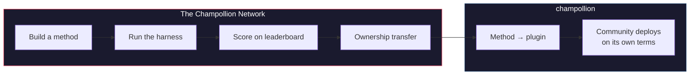

# A Rede Champollion

> **Resumo Executivo.** A Rede Champollion é uma infraestrutura aberta para *criar e confiar* em conjuntos de testes de tradução para o maior número possível de pares de idiomas — construída *com* profissionais e comunidades, nunca extraída deles — e para tornar todo o campo navegável: quem pode traduzir o quê, quão bom é cada método em cada tipo de texto e onde estão as lacunas. Todo método é bem-vindo, humano e de máquina. Você também pode construir e enviar um método e ver como ele pontua em relação a corpora reais. Para os idiomas cujos dados as comunidades fornecem, a soberania é inegociável: as pessoas que fornecem um corpus detêm as chaves dele e de qualquer coisa medida em relação a ele.

Esta seção é a página inicial do mapa. As páginas abaixo dela explicam como a
rede de pares medidos é construída ([Como a Rede
Funciona](/docs/network/how-it-works)), por que a fila de trabalho pública classifica o que ela
classifica ([Por que a Fila](/docs/network/perspectives/why-the-queue) e a
[Especificação de Construção da Fila](/docs/network/specifications/queue-construction)),
e como a força de uma conexão é calculada
([Força da Conexão](/docs/network/specifications/connection-strength)).
Se você está decidindo se deve ou não confiar no projeto, comece com
[Limitações Honestas](/docs/network/honest-limitations); se você já sabe
o que deseja construir, as portas estão em
[O que é o Champollion](/docs/what-is-champollion).

**Ela funciona com dois tipos de benchmark.** Os *benchmarks públicos* usam conjuntos de dados abertos para mapear e classificar cada método de forma barata e aberta — a camada base de dados abertos/extraídos, com o risco de contaminação observado. Os *benchmarks soberanos* são o padrão-ouro: conjuntos de testes secretos que as comunidades linguísticas criam, possuem e controlam, e que o Champollion **nunca vê** — avaliados às cegas, e apenas quando a comunidade autoriza. A infraestrutura em si tem código-fonte disponível e é administrada de forma única; o que pertence a uma comunidade são os conjuntos de testes para o seu idioma e os métodos construídos para ele.

:::info[Fase de lançamento/semente]
A Rede é jovem, mas está no ar: o placar de líderes (leaderboard) contém execuções reais publicadas
e está aberto para envios de qualquer pessoa. Para saber exatamente o que nós afirmamos e o que ainda não
afirmamos — verificação, validação da comunidade, avaliação retida (held-out) — veja
**[Limitações Honestas](/docs/network/honest-limitations)**.
:::

---

## O Problema

O serviço Cloud Translation do Google lista 194 idiomas ([lista publicada pelo Google](https://docs.cloud.google.com/translate/docs/languages)). O NLLB-200 da Meta cobre 200, e o OMT-1600 (março de 2026) afirma cobrir 1.600. Existem mais de 7.000 falados na Terra. Para os ~1.200 idiomas na cauda longa do OMT-1600 — nossa aritmética: os 1.600 que ele cobre menos os mais de 400 que seus autores relatam que os modelos "entendem suficientemente bem" — os pesos do modelo não estão disponíveis, a qualidade está abaixo dos limites utilizáveis e a avaliação usou textos do domínio da Bíblia com métricas de máquina padrão — sem validação morfológica, sem testes independentes, sem governança da comunidade. Para os ~5.400 idiomas restantes, nenhum modelo pré-treinado produz qualquer saída.

As Big Techs agora estão investindo na cobertura de LRL (idiomas com poucos recursos) — mas cobertura sem verificação de qualidade independente, validação morfológica ou governança da comunidade é cobertura sem confiança. Os falantes que mais precisam de ferramentas de tradução são as mesmas comunidades com menor probabilidade de tê-las construídas.

**A Rede existe para mudar isso.** Ela fornece a infraestrutura para criar conjuntos de testes, avaliar qualquer método em relação a eles — humano ou de máquina — e mapear os resultados, para qualquer idioma, com pontuação reprodutível, envio aberto e governança da comunidade sobre quem controla os dados e os resultados.

Dados de idioma são *biodados*. Assim como dados genéticos ou de saúde, um idioma carrega a identidade e as relações das pessoas que o falam, e não pode ser anonimizado de forma significativa — portanto, as pessoas que fornecem um corpus detêm as chaves dele e de qualquer coisa medida em relação a ele. A soberania não é um recurso adicionado aqui; é a base sobre a qual o resto é construído.

---

## Como Funciona

1. **Você constrói um método de tradução** — LLM treinado, modelo com fine-tuning, pipeline com FST (Transdutores de Estado Finito) ou qualquer outra coisa que produza traduções.
2. **O harness (ambiente de teste) faz o benchmark** — métricas padronizadas (chrF++, correspondência exata, aceitação FST), com impressão digital (fingerprint) para um commit específico do Git.
3. **Os resultados aparecem no placar de líderes** — ao vivo e aberto para envios; cada execução publicada é reprodutível e comparável.
4. **Quando um método funciona, a propriedade é transferida** — para idiomas indígenas, o código do método é transferido para a organização de governança da comunidade.
5. **A comunidade o implanta — se e como escolherem.** O método é exportado como um plugin do [champollion](https://champollion.dev) e pode ser executado inteiramente na infraestrutura da comunidade. O Champollion não fica com nenhuma parte do que ele arrecadar lá.

**Construa aqui. Implante lá.**

:::tip[Decifre um idioma, vença, devolva-o]
Esta é uma operação de benchmarking de ML de propósito — a competição é como pares difíceis
são resolvidos. Convidamos pesquisadores de ML e qualquer construtor capaz a construir o melhor
método para um par difícil específico, **ganhar uma recompensa quando houver uma aberta**, *e* entregar o
método resultante para a organização de soberania que possui aquele idioma. A
energia competitiva é real; ela é direcionada à missão, não a subir em um
placar de líderes por si só. Veja a [Especificação de Prêmios](/docs/network/specifications/prizes).
:::

---

## Para Quem É Isso

| Você é... | A rede lhe oferece... |
|---|---|
| **Engenheiro / pesquisador de ML** | Benchmarks padronizados, pontuação reprodutível, um corpus compartilhado para testar |
| **Linguista** | Um framework para transformar regras gramaticais e dicionários em métodos testáveis |
| **Tradutor profissional / humano** | Um lugar para registrar seus serviços e ser encontrado — a tradução humana é um método de primeira classe aqui, listado e avaliado ao lado das máquinas, não um pensamento tardio |
| **Membro da comunidade linguística** | Governança sobre como os métodos do seu idioma são desenvolvidos e implantados |
| **Financiador / revisor de subsídios** | Métricas transparentes e reprodutíveis para avaliar propostas de pesquisa em tradução |
| **Estudante** | Um convite aberto com impacto real — construa um método, contribua com seus resultados |

---

## Corpora de referência suportados

**O painel está no ar e ainda no início** — as primeiras varreduras (sweeps) estão publicadas e
mais chegam à medida que os contribuidores executam itens da fila. O que se segue não é um
placar de líderes; é o conjunto de corpora de referência públicos contra os quais um envio pode ser
pontuado hoje. Os corpora nunca são hospedados aqui: o harness busca referências da
fonte original (upstream) em tempo de execução e pontua em relação aos dados recém-buscados.

### Global Voices (OPUS) — domínio de notícias
- **Cobertura:** 493 pares de idiomas catalogados e executáveis (ex. `eval-amh-fra-globalvoices-test-v1`, Amárico → Francês)
- **Licença:** CC BY 3.0
- **Fonte:** [Global Voices via OPUS](https://opus.nlpl.eu/)

### Tatoeba — domínio conversacional / misto
- **Cobertura:** 874 pares de idiomas catalogados e executáveis (ex. `eval-afr-eng-tatoeba-dev-v1`, Africâner → Inglês)
- **Licença:** CC BY 2.0
- **Fonte:** [Comunidade Tatoeba](https://tatoeba.org)

:::note[EdTeKLA é apenas para pesquisa — não é um benchmark de classificação]
O corpus EdTeKLA Plains Cree (*Cree: Language of the Plains*) possui a
[CC BY-NC-SA **modificada** do EdTeKLA](https://github.com/EdTeKLA/IndigenousLanguages_Corpora)
— termos não comerciais com escopo de soberania (o livro didático raiz em si é CC
BY-NC-ND 4.0). Ele está **excluído de todas as classificações** — não se qualifica para
o placar de líderes, nenhum prêmio ou as vias de API/comerciais — e a avaliação remota
por API de modelo é **controlada por consentimento**: o harness se recusa a enviar
seu texto para APIs de modelos de terceiros, a menos que a permissão explícita do detentor dos direitos
seja registrada (a avaliação local continua sendo possível).

O FLORES+ **está** conectado e executável aqui (870 pares catalogados, ex.
`eval-flores-devtest-v1-amh-fra`), mas é de **ALTA contaminação** — dados de avaliação públicos,
extraídos da web, que os modelos de fronteira muito provavelmente já viram.
Portanto, é **apenas relativo**: utilizável para comparar métodos frente a frente, mas
**nunca relatado como um benchmark de qualidade absoluta**, e é **apenas para teste /
ilustração**. Um resultado do FLORES+ nunca é classificado como uma pontuação de qualidade e
nunca é usado como uma aresta de cadeia no [mapa de tradução](https://champollion.dev).
Veja [Limitações Honestas](/docs/network/honest-limitations) para saber exatamente o que
nós afirmamos e o que não afirmamos.
:::

---

## A Única Regra

:::danger[Não treine com dados de avaliação]
Métodos expostos ao conjunto de dados de benchmark — como dados de treinamento, exemplos few-shot, entradas de dicionário ou material de prompt — serão **desqualificados**. Faça fine-tuning no que você quiser. Apenas não no conjunto de testes.
:::

---

## Próximos Passos

- **[Enviar um Método](/docs/network/getting-started/submit-a-method)** — como enviar sua primeira execução de benchmark
- **[Especificação de Benchmark](/docs/network/specifications/benchmark)** — o protocolo completo do experimento
- **[Regras do Placar de Líderes](/docs/network/leaderboard/rules)** — critérios de envio e políticas contra manipulação (anti-gaming)
- **[Gestão de Dados](/docs/network/sovereignty/data-sovereignty)** — os corpora permanecem com seus administradores; todas as licenças são respeitadas
- **[Como o Trabalho é Financiado](/docs/network/sovereignty/economic-model)** — não comercial e atualmente autofinanciado; procuram-se financiadores, e o destino de cada dólar é publicado

**[→ Ver o Placar de Líderes](https://champollion.dev/leaderboard)**
