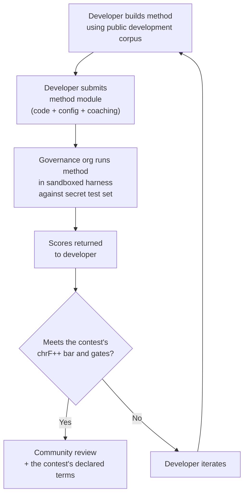

# Especificação de Benchmark

> **Sumário executivo.** Este documento define o protocolo de avaliação para o ecossistema de avaliação de TA do Champollion: formato de corpus (§2), esquema do run card (§3), protocolo de benchmark (§6), requisitos de validação humana (§7), mecanismos de soberania (§8), modelo de leaderboard e submissão (§9), framework de custos (§10) e extensibilidade para novos idiomas (§11). Para saber como as execuções são pontuadas (a métrica principal chrF++, as métricas padrão ao lado dela e os diagnósticos) e para fórmulas de métricas de custo/velocidade, consulte `SCORING_SPEC.md` — a fonte única da verdade para toda a lógica de pontuação. Este documento faz referência ao SCORING_SPEC para esses detalhes em vez de duplicá-los.


---

## 1. Princípios

### 1.1 Idiomas São Biodados

Um idioma não é material de teste neutro. Como dados genéticos ou de saúde, dados de idioma são **biodados**: carregam a identidade, parentesco e relacionamentos das pessoas que o falam, e não podem ser significativamente anonimizados — remova os metadados e o idioma ainda codifica quem são seus falantes. A consequência para esta especificação é concreta: as pessoas que fornecem um corpus controlam as chaves dele, e de tudo que é medido contra ele. Soberania (§8) portanto não é um complemento do protocolo; é uma precondição dele, e todos os outros princípios abaixo operam dentro dela.

### 1.2 Métricas Automatizadas São Proxies

Toda métrica definida neste documento é computada por máquina. chrF++, aceitação FST, acurácia morfológica, similaridade semântica — todas elas são proxies automatizados para qualidade de tradução. Eles são úteis para iteração rápida, comparação sistemática e detecção de regressões. Eles **não são substitutos para julgamento humano**.

A hierarquia de avaliação:

```
Automated metrics (run cards, benchmarks)
    ↓ proxy for
Human review (bilingual speakers validate output)
    ↓ proxy for
Actual utility (does this help a language community?)
```

Nenhuma pontuação automatizada, por mais alta que seja, pode substituir um falante fluente que leia a saída e confirme que ela está correta, natural e culturalmente apropriada. É por isso que nenhuma pontuação automática traz um rótulo de qualidade (§5): métricas automáticas são úteis para acompanhar o progresso, mas nunca suficientes por si sós.

### 1.3 Métodos, Não Modelos

Nós avaliamos **métodos**, não modelos. Um modelo é um componente. Um método é a receita completa: seleção de modelo, design de prompt, uso de ferramentas, pré/pós-processamento, dados de coaching, estratégias de retry, tudo. Dois times usando o mesmo modelo com métodos diferentes obterão pontuações diferentes. Esse é o ponto.

### 1.4 Reprodutibilidade

Todo resultado de benchmark deve ser reproduzível. O run card (§3) captura a configuração completa de um experimento. A fingerprint (§3.5) identifica a configuração experimental. O hash do run card (§3.6) verifica a integridade do resultado. Qualquer pessoa com o mesmo método, corpus e configuração deve alcançar pontuações dentro de ±2% (contabilizando não-determinismo de amostragem de LLM em temperatura > 0).

### 1.5 Sem Dados de Avaliação Sintéticos

**Este projeto não gera, usa ou endossa dados de avaliação sintéticos.** Todos os corpora devem ser originários de texto genuinamente escrito por humanos — traduções publicadas, livros didáticos, documentos bilíngues ou traduções eliciadas de falantes fluentes.

LLMs podem auxiliar com:
- Alinhamento de sentenças (encontrar passagens paralelas em textos bilíngues existentes)
- Conversão de formato (converter materiais publicados no esquema de corpus)
- Enriquecimento de metadados (sugerir tiers de dificuldade, rótulos de registro)
- Propor sentenças-fonte para tradução humana (§11.3 — o passo de tradução é sempre humano)

LLMs **nunca** devem gerar traduções de referência ou pares de avaliação.

**Somos neutros em desenvolvimento em relação a dados de treinamento.** Se um desenvolvedor de método usa dados de treinamento sintéticos, retrotradução ou aumento de dados em seu método, essa é sua escolha — avaliamos o resultado, não o processo de treinamento. O OMT-1600 da Meta usa aproximadamente 270 milhões de sentenças paralelas sintéticas geradas via retrotradução. Não temos objeção a métodos treinados dessa forma. Testamos apenas em curação humana.

> **Por que não texto da Bíblia para avaliação?** OMT-1600 avalia 1.560 de 1.600 idiomas em texto de domínio Bíblico (Meta AI, *Omnilingual MT*, arXiv:2603.16309, 2026). Traduções bíblicas têm registro arcaico, vocabulário litúrgico e estrutura de sentença formulaica. Nossos corpora de avaliação são originários de texto curado pela comunidade, diverso em domínio — saúde, legal, educacional, governamental, conversacional e domínios técnicos (ver §2.7). Esta é uma escolha de design deliberada. Comunidades precisam de tradução para os domínios onde realmente vivem e trabalham, não um único registro religioso. Um método que pontua bem em Gênesis 1:1 diz quase nada sobre seu desempenho em uma agenda de conselho de banda ou um formulário de admissão de clínica.

---

## 2. Esquema de Corpus

Um corpus é um conjunto curado de pares de texto paralelo com metadados estruturados. É a verdade fundamental contra a qual todos os métodos são medidos.

### 2.1 Envelope do Dataset

A estrutura de nível superior de um arquivo de corpus:

```json
{
  "dataset": {
    "id": "edtekla-dev-v1",
    "version": "1.0",
    "language_pair": "EN→CRK",
    "source_language": "en",
    "target_language": "crk",
    "created": "2026-05-01",
    "license": "LicenseRef-EdTeKLA-Modified-CC-BY-NC-SA-4.0",
    "provenance": ["gold_standard", "textbook"]
  },
  "entries": [ ... ]
}
```

| Campo | Tipo | Obrigatório | Descrição |
|-------|------|-----------|-----------|
| `id` | string | ✅ | Identificador único do dataset, usado em run cards e leaderboard |
| `version` | string | ✅ | Versão semântica. Incrementar invalida comparações de run card anteriores |
| `language_pair` | string | ✅ | Rótulo de exibição (ex: `EN→CRK`) |
| `source_language` | string | ✅ | Código de idioma de origem BCP 47 |
| `target_language` | string | ✅ | Código de idioma de destino BCP 47 |
| `created` | string | ✅ | Data de criação ISO 8601 |
| `license` | string | ✅ | Identificador de licença SPDX |
| `provenance` | string[] | ✅ | Lista de tags de proveniência usadas em todas as entradas |

### 2.2 Esquema de Entrada

Cada entrada no corpus representa um desafio de tradução:

```json
{
  "id": 42,
  "source": "I see the dog",
  "reference": "niwâpamâw atim",
  "segment": "gold_standard",
  "difficulty": 2,
  "provenance": "gold_standard",
  "register": "conversational",
  "context": "declaration",
  "morphological_analysis": "ni-wâpam-âw atim | 1sg-see.TA-3sg.DIR dog.AN",
  "notes": "Animate noun (atim); direct form because speaker is proximate",
  "variant_class": "simple-ta-direct"
}
```

| Campo | Tipo | Obrigatório | Descrição |
|-------|------|-------------|-----------|
| `id` | integer | ✅ | Identificador exclusivo dentro do corpus |
| `source` | string | ✅ | Texto de origem no idioma de origem |
| `reference` | string | ✅ | Tradução de referência padrão-ouro no idioma de destino |
| `segment` | string | 📎 | Partição do corpus: `gold_standard`, `held_out`, `development` ou `diagnostic` |
| `difficulty` | integer | 📎 | Classificação de dificuldade de 1 a 5 (consulte o §2.4) |
| `provenance` | string | 📎 | Origem desta entrada (consulte o §2.5) |
| `register` | string | 📎 | Registro/nível de formalidade (consulte o §2.6) |
| `context` | string | 📎 | Função comunicativa (consulte o §2.6) |
| `domain` | string | 📎 | Domínio do caso de uso da taxonomia de 16 códigos (consulte o §2.7). Deve ser um dos seguintes: `conv`, `ecommerce`, `edu`, `financial`, `gov`, `legal`, `literary`, `marketing`, `medical`, `news`, `religious`, `scientific`, `subtitles`, `support`, `tech`, `ui`. Validado no momento da construção. |
| `morphological_analysis` | string | ❌ | Decomposição morfológica padrão-ouro |
| `notes` | string | ❌ | Notas do tradutor, variantes dialetais, sinalizadores de ambiguidade |
| `variant_class` | string | ❌ | Rótulo de classe que agrupa variantes de tradução aceitáveis |

> **📎 = RECOMENDADO.** O harness lida com campos opcionais ausentes de forma transparente por meio de valores padrão. Corpora de terceiros precisam fornecer apenas `id`, `source` e `reference` por entrada.


### 2.3 Segmentos de Corpus

O corpus é dividido em segmentos com diferentes níveis de acesso:

| Segmento | Propósito | Acesso | Tamanho Mínimo |
|----------|-----------|--------|----------------|
| `development` | Desenvolvimento e iteração de método. Desenvolvedores usam livremente. | **Público** | 30 entradas |
| `diagnostic` | Testes direcionados para fenômenos linguísticos específicos. | **Público** | 10 entradas |
| `gold_standard` | Avaliação oficial de benchmark. Pontuações de leaderboard vêm daqui. | **Secreto** — mantido por org de governança | 50 entradas |
| `held_out` | Reservado para avaliação futura. Nunca usado até ser ativado. | **Secreto** — mantido por org de governança | 10 entradas |

> **Estado atual:** Apenas o segmento `development` existe em datasets enviados. Os segmentos `diagnostic`, `gold_standard` e `held_out` são definidos para uso futuro conforme corpora crescem.

Os segmentos `gold_standard` e `held_out` são totalmente secretos. Tanto as sentenças-fonte quanto as traduções de referência são mantidas em infraestrutura controlada por governança. Desenvolvedores de método nunca veem as perguntas ou as respostas. Ver §8 para o mecanismo de soberania.

### 2.4 Tiers de Dificuldade

| Tier | Descrição | Exemplos |
|------|-----------|----------|
| 1 — Vocabulário básico | Palavras únicas, saudações comuns, números | "hello" → "tânisi", "dog" → "atim" |
| 2 — Sentenças simples | Sujeito-verbo ou SVO, tempo presente | "I see the dog" → "niwâpamâw atim" |
| 3 — Complexidade moderada | Tempo passado/futuro, possessivos, animacidade | "I saw his dog yesterday" |
| 4 — Morfologia complexa | Obviation, voz passiva, ordem conjunta, orações relativas | "the woman whose son went to the store" |
| 5 — Avançado | Multi-cláusula, registro formal, cerimonial, idiomático | Parágrafo completo com tom apropriado ao registro |

Um corpus bem construído deve incluir entradas em todos os cinco tiers de dificuldade, ponderados em direção aos tiers 2–4 onde caem a maioria dos desafios de tradução do mundo real.

### 2.5 Tags de Proveniência

Toda entrada deve indicar sua origem:

| Tag | Significado |
|-----|-------------|
| `gold_standard` | Verificado por falantes fluentes |
| `textbook` | De materiais educacionais publicados |
| `elicited` | Produzido através de sessões de elicitação estruturada |
| `corpus` | Extraído de um corpus paralelo |

> **Nota:** Na prática, valores de proveniência são strings de forma livre. As tags acima são convenções, não um enum validado — datasets podem usar outras strings de proveniência descritivas.

### 2.6 Registro e Contexto

**Registro** descreve a formalidade e contexto social:

| Registro | Descrição |
|----------|-----------|
| `conversational` | Fala cotidiana entre iguais |
| `formal` | Linguagem oficial ou institucional |
| `technical` | Vocabulário específico de domínio |
| `ceremonial` | Uso de linguagem tradicional ou sagrada |
| `educational` | Materiais de ensino de idioma |

**Contexto** descreve a função comunicativa:

> 🔲 **Planejado.** O campo `context` é definido no esquema mas ainda não preenchido em datasets atuais. É reservado para enriquecimento futuro de corpus.

| Contexto | Descrição |
|----------|-----------|
| `greeting` | Saudação social ou despedida |
| `declaration` | Declaração de fato |
| `question` | Interrogativa |
| `instruction` | Comando ou diretiva |
| `narrative` | Narrativa ou descrição |
| `label` | Rótulo de UI, texto de botão ou cabeçalho |
| `error` | Mensagem de erro ou aviso |

### 2.7 Domínio {#27-domain}

**Domínio** descreve o caso de uso do mundo real — o tipo de conteúdo sendo traduzido. Isto é ortogonal a registro e contexto:

- **Registro** responde: *Quão formal é isto?*
- **Contexto** responde: *O que esta sentença está fazendo?*
- **Domínio** responde: *Para qual indústria/caso de uso isto é?*

Um contrato legal (domínio: `legal`) pode ser formal (registro: `formal`) e conter uma declaração (contexto: `declaration`). Uma transcrição de chatbot legal (domínio: `legal`) pode ser conversacional (registro: `conversational`) e conter perguntas (contexto: `question`). Mesmo domínio, registro e contexto diferentes.

| Código de Domínio | Descrição | Consumidores Típicos |
|-------------------|-----------|-------------------|
| `ui` | Strings de interface de software | Desenvolvedores de app, times de localização |
| `legal` | Contratos, estatutos, petições judiciais, documentos de imigração | Escritórios de advocacia, tribunais, times de compliance, advogados de PI |
| `medical` | Notas clínicas, rótulos de drogas, comunicações de paciente, protocolos de ensaio | Hospitais, pharma, ensaios clínicos, portais de paciente |
| `financial` | Bancário, seguros, arquivos regulatórios, relatórios de auditoria | Bancos, seguradoras, reguladores, auditores |
| `edu` | Livros didáticos, currículos, planos de aula, materiais acadêmicos | Escolas, universidades, editoras de livros didáticos |
| `ecommerce` | Descrições de produto, avaliações, listagens de marketplace | Varejistas online, vendedores de marketplace |
| `marketing` | Copy de anúncio, mensagens de marca, campanhas, slogans | Agências de publicidade, times de marca |
| `gov` | Documentos de política, regulações, avisos públicos, legislação | Agências governamentais, times de compliance |
| `scientific` | Artigos de pesquisa, abstratos, metodologia, propostas de bolsa | Pesquisadores, periódicos, agências de bolsa |
| `religious` | Escritura, textos litúrgicos, comentário teológico | Comunidades de fé, editoras litúrgicas |
| `support` | FAQs, mensagens de erro, guias de solução de problemas, scripts de chatbot | Empresas SaaS, help desks |
| `subtitles` | Filme, TV, streaming e diálogo de jogos | Plataformas de streaming, estúdios, empresas de jogos |
| `news` | Jornalismo, relatórios de agência, editorial, comunicados de imprensa | Organizações de mídia, agências de notícias |
| `literary` | Ficção, poesia, narrativa, textos culturais | Editoras, orgs de preservação cultural |
| `conv` | Conversa informal, mídia social, mensagens | Apps de consumidor, plataformas sociais |
| `tech` | Docs de API, manuais, especificações de engenharia, guias técnicos | Times de documentação, orgs de engenharia |

> **Benchmarks específicos de domínio.** O benchmark geral avalia um método em todos os domínios. Mas a Network também suporta **benchmarks filtrados por domínio** — onde pontuações são computadas apenas em entradas marcadas com um domínio específico. Isto permite aos usuários responder: "Qual método é melhor para traduzir documentos legais para francês?" vs. "Qual método tem a melhor pontuação geral de francês?"
>
> Rankings de leaderboard filtrados por domínio permitem aos usuários comparar métodos dentro de um único caso de uso. Diferentes métodos têm desempenho diferente em domínios — um método fine-tuned em terminologia legal pode pontuar muito mais alto em texto legal do que em texto conversacional. A Network ajuda usuários a encontrar o método que funciona melhor para seu caso de uso específico.

> **Futuro: Assistente de Network.** Um assistente conversacional que ajuda usuários a descrever seu caso de uso de MT (domínio, par de idiomas, requisitos de qualidade) e superfícies métodos validados pela comunidade relevantes do leaderboard — por exemplo, "qual método pontua mais alto em benchmarks de domínio médico EN→JA?" — é um auxílio de navegabilidade que estamos considerando, condicionado a dados de avaliação suficientes marcados por domínio e diversidade de método.

---

## 3. Esquema de Run Card {#3-run-card-schema}

O run card é a unidade atômica de avaliação. É um documento JSON auto-contido que registra a configuração completa e resultados de uma única execução de avaliação: um método, um modelo, uma configuração, um dataset.

Todo run card captura três dimensões:
- **Qualidade** — quão boas são as traduções?
- **Custo** — quanto custou produzi-las?
- **Velocidade** — quanto tempo levou?

### 3.1 Campos de Nível Superior

| Campo | Tipo | Descrição |
|-------|------|-----------|
| `run_id` | string | UUID v4 gerado no início da execução |
| `harness_version` | string | Versão semântica do harness (ex.: `2.0`) |
| `timestamp` | string | Carimbo de data/hora ISO 8601 UTC de quando a execução começou |
| `elapsed_seconds` | number | Duração de tempo real (wall-clock) de toda a execução |
| `score_caveats` | array | Presente apenas quando algo qualifica as pontuações: uma lista de objetos `{kind, source, severity, message, …}`, por exemplo, um conjunto de testes cujas linhas têm cópias quase idênticas nos dados de treinamento, saídas muito mais longas ou muito mais curtas do que suas referências, saídas que copiam a origem ou uma mesma saída gerada para várias origens diferentes. Informativo: nunca altera uma pontuação e é exibido ao lado da métrica principal chrF++ onde quer que as pontuações estejam. Consulte a [Especificação do Run Card](/docs/network/specifications/run-card#score_caveats) |

### 3.2 Configuração de Método

Estes campos definem a configuração experimental — o que foi testado e como.

| Campo | Tipo | Obrigatório | Descrição |
|-------|------|-----------|-----------|
| `model_slug` | string | ✅ | Identificador de modelo (ex: `google/gemini-2.5-flash`) |
| `model_id` | string | ❌ | Identificador de modelo resolvido retornado pela API |
| `condition` | string | ✅ | Rótulo de experimento (ex: `baseline`, `coached-v3`, `few-shot`) |
| `temperature` | number | ✅ | Temperatura de amostragem |
| `system_prompt_sha256` | string | ✅ | Hash SHA-256 do prompt de sistema completo |
| `system_prompt_used` | string | ✅ | Texto do prompt de sistema completo |
| `coaching_data_sha256` | string | ❌ | Hash SHA-256 do arquivo de dados de coaching, se usado |
| `fst_version` | string | ❌ | Versão do analisador FST, se usado |
| `tools_enabled` | string[] | ❌ | Lista de ferramentas disponíveis para o método |
| `batch_size` | number | ❌ | Entradas por lote de API concorrente |
| `max_retries` | number | ❌ | Máximo de retries para rejeição FST, se aplicável |

:::info[Run Cards publicados incluem method_config]
Quando um run card é publicado no leaderboard (via `mt-eval publish`), ele também inclui um bloco `method_config` contendo o MethodConfig canônico de 8 campos (`model`, `temperature`, `batchSize`, `register`, `coachingFile`, `coachingPrompt`, `promptContext`, `qualityTier` — todos em camelCase; `qualityTier` é sempre nulo em um novo card, já que os níveis de qualidade foram descontinuados). Isso possibilita a importação com reconstrução zero: o `champollion leaderboard --install` lê o `method_config` diretamente e o grava como um manifesto de plugin. Os campos de telemetria acima (§3.2) registram o que o harness observou; o `method_config` registra o que o desenvolvedor planejou.
:::

### 3.3 Referência de Dataset

| Campo | Tipo | Descrição |
|-------|------|-----------|
| `dataset.id` | string | Identificador de dataset |
| `dataset.version` | string | Versão de dataset |
| `dataset.language_pair` | string | Rótulo de exibição |
| `dataset.sha256` | string | Hash SHA-256 do conteúdo do arquivo de dataset |
| `dataset.entry_count` | number | Número de entradas avaliadas |

O SHA-256 do dataset fixa o resultado a uma versão específica dos dados. Se o dataset mudar, run cards antigos não são comparáveis.

### 3.4 Pontuações (Qualidade)

Métricas agregadas para toda a execução. Todas as métricas de qualidade são **automatizadas** — ver §1.2.

| Campo | Tipo | Descrição |
|-------|------|-----------|
| `scores.total` | number | Total de entradas avaliadas |
| `scores.exact_matches` | number | Entradas em que a saída correspondeu exatamente à referência |
| `scores.exact_match_rate` | number | 0.0–1.0 |
| `scores.equivalent_matches` | number | Entradas que correspondem a uma variante aceitável |
| `scores.equivalent_match_rate` | number | 0.0–1.0 |
| `scores.fst_accepted` | number | Palavras de saída aceitas pelo analisador FST, somadas em todas as entradas (uma contagem de palavras, não uma contagem de entradas) |
| `scores.fst_acceptance_rate` | number | 0.0–1.0, a média das taxas de aceitação por entrada (palavras aceitas de cada entrada ÷ total de palavras dela); `null` se nenhum FST estiver configurado |
| `scores.morphological_accuracy` | number | 0.0–1.0, derivado de FST (correspondência de lema), `null` se não houver FST / nenhuma palavra com lema correspondente. Consultivo até ser ativado — consulte Scoring Spec §2.2 |
| `scores.morph_coverage` | number | 0.0–1.0, fração de palavras previstas analisáveis com lema correspondente à referência (revela quão esparso é o `morphological_accuracy`) |
| `scores.chrf_plus_plus` | number | **A métrica principal e de classificação:** chrF++ no nível do corpus (0–100). Seu IC de bootstrap de 95% é `scores.confidence_intervals.corpus_chrf` e sua assinatura sacreBLEU é `scores.sacrebleu_signatures.chrf` |
| `scores.scoring_standard` | string | `"standard/1"` em todo card novo. Ausente em cards publicados antes do padrão, que são lidos como `legacy-composite` |
| `scores.primary_metric` | string | `"chrf_plus_plus"` |
| `scores.spbleu` | number | spBLEU (SentencePiece do FLORES-200), exibido ao lado do chrF++ |
| `scores.sacrebleu_signatures` | object | Assinatura de cada métrica sacreBLEU calculada (`chrf`, `chrf_plain`, `bleu`, `spbleu`, `ter`) |
| `scores.semantic_score` | number | Similaridade semântica baseada em embeddings (0.0–1.0) |
| `scores.ter` | number | Translation Edit Rate (0–∞, menor é melhor) |
| `scores.length_ratio` | number | avg(len(predicted)/len(reference)), ideal = 1.0 |
| `scores.code_switching_rate` | number | 0.0–1.0, fração de entradas com vazamento do idioma de origem |
| `scores.hallucination_rate` | number | 0.0–1.0, fração de entradas com conteúdo alucinado |
| `scores.terminology_adherence` | number | 0.0–1.0, aderência a termos do glossário (`null` se não houver glossário) |
| `scores.tokens_per_second` | number | total_tokens / elapsed_seconds |
| `scores.entries_per_minute` | number | entradas traduzidas por minuto |
| `scores.composite` | number \| null | **Descontinuado.** `null` em todo card novo; um card legado mantém sua pontuação composta armazenada, exibida como "composto legado (descontinuado)". Consulte SCORING_SPEC §4 |
| `scores.quality_tier` | string \| null | **Descontinuado.** `null` em todo card novo. Consulte SCORING_SPEC §5 |
| `scores.cost_adjusted` | number \| null | **Descontinuado** com o composto; `null` em todo card novo |
| `scores.errors` | number | Entradas que falharam (erro de API, tempo limite esgotado, etc.) |
| `scores.by_difficulty` | object | Pontuações detalhadas por nível de dificuldade |
| `scores.by_provenance` | object | Pontuações detalhadas por tag de procedência |
| `scores.by_domain` | object | ✅ Implementado — Pontuações detalhadas por domínio (§2.7). Permite classificação no leaderboard filtrada por domínio. Calculado por tester.py e repassado por publish.py. |

### 3.5 Totais (Custo)

| Campo | Tipo | Descrição |
|-------|------|-----------|
| `totals.prompt_tokens` | number | Total de tokens de entrada em todas as chamadas de API |
| `totals.completion_tokens` | number | Total de tokens de saída |
| `totals.reasoning_tokens` | number | Tokens usados para chain-of-thought (0 para a maioria dos modelos) |
| `totals.cached_tokens` | number | Tokens servidos do cache de prompt do provedor |
| `totals.total_cost_usd` | number | Custo total em USD |
| `totals.cost_per_entry_usd` | number | `total_cost_usd / entry_count` |
| `totals.cost_per_source_char` | number | USD por caractere-fonte — comparável entre idiomas |

### 3.6 Timing (Velocidade)

| Campo | Tipo | Descrição |
|-------|------|-----------|
| `elapsed_seconds` | number | Duração de wall-clock de toda a execução (nível superior) |
| `scores.avg_latency_seconds` | number | Tempo de resposta médio por entrada |
| `scores.median_latency_seconds` | number | Tempo de resposta mediano por entrada |
| `scores.p95_latency_seconds` | number | Tempo de resposta do 95º percentil por entrada |

### 3.7 Resultados Por-Entrada

Cada entrada no array `results[]` registra uma tradução. Dados por-entrada são persistidos na tabela `run_card_entries` (migração 005) com verdicts LYSS desnormalizados (migração 006).

| Campo | Tipo | Descrição |
|-------|------|-----------|
| `entry_id` | string | Corresponde a `entries[].id` no corpus |
| `source` | string | Texto-fonte que foi traduzido |
| `expected` | string | Tradução de referência padrão-ouro |
| `raw_predicted` | string \| null | Saída bruta do modelo antes do pós-processamento |
| `predicted` | string | Saída real do método (pós-processada) |
| `segment` | string | Identificador de segmento (ex: índice de sentença) |
| `difficulty` | string \| null | Tier de dificuldade do corpus |
| `domain` | string | Tag de domínio do corpus (§2.7) |
| `exact_match` | boolean | Se saída correspondeu exatamente à referência |
| `chrf_score` | number \| null | chrF++ de nível de sentença (0–100) |
| `bleu_score` | number \| null | BLEU de nível de sentença (0–100) |
| `latency_s` | number \| null | Tempo de resposta em segundos |
| `cost_usd` | number \| null | Custo em USD para esta entrada |
| `tool_call_count` | integer | Número de chamadas de ferramenta usadas (0 se nenhuma) |
| `error` | string \| null | Mensagem de erro se esta entrada falhou |
| `plugin_metrics` | object | Saída de plugin completa por-entrada (JSONB) |
| `fst_valid` | boolean \| null | FST GiellaLT aceitou a predição (LYSS-fst desnormalizado) |
| `equivalent_match` | boolean \| null | Linter CRK confirmou equivalência estrutural (LYSS-eq desnormalizado) |
| `semantic_verdict` | string \| null | Verdict LYSS-sem: `VALID`, `MISMATCH`, `UNKNOWN`, `ERROR` |
| `code_switching_detected` | boolean \| null | Tokens de idioma-fonte detectados na saída |
| `hallucination_detected` | boolean \| null | Conteúdo fabricado detectado na saída |


### 3.8 Fingerprint

Um identificador de reprodutibilidade. Duas execuções com fingerprints idênticos usaram a mesma configuração experimental.

O fingerprint é o hash SHA-256 do JSON canônico (chaves ordenadas) de:
- `dataset.sha256`
- `model_slug`
- `condition`
- `system_prompt_sha256`
- `temperature`
- `harness_version`
- `batch_size`
- `tools_enabled`

> **Por que 8 componentes?** Tamanho de lote e tool-calling afetam materialmente a qualidade de saída e devem ser incluídos na identidade. Duas execuções com tamanhos de lote diferentes ou ferramentas diferentes habilitadas são configurações experimentais diferentes, mesmo que todos os outros parâmetros correspondam.

**A Versão 2 (harness 0.2.0 e posterior)** adiciona cinco componentes:
- `api_provider`: o canal pelo qual o texto passou (OpenRouter, a API própria de um fornecedor, um endpoint local; o ID de um mecanismo de TA; para um plugin de método, `local` em `--attest-local-transport`, caso contrário `method-plugin`). Logs de execução de plugins e mecanismos gravados antes dessa correção indicam `openrouter`, um padrão pelo qual nunca foram enviados; a publicação também registra o valor corrigido para eles, o que altera sua identidade de versão 2 — deliberadamente, já que o valor antigo era falso
- `endpoint_host_sha256`: o SHA-256 do host do endpoint, nunca a URL bruta, que pode conter nomes de host internos ou credenciais
- `max_tokens`
- `method_version`: a versão do method card, caso contrário a versão declarada no `method.json` de um plugin de método
- `method_sha256`: o hash do pacote executado, para um método executado por um nó de concurso, caso contrário o hash sobre os arquivos de um plugin de método (`method.json` e seus arquivos `.py`)

Uma execução de **plugin de método** (`mt-eval run --method <plugin dir>`) adiciona mais dois:
- `method_model`: o modelo passado para o plugin com `-m/--model` (o plugin o lê como `config.method_model`), ou `null` quando nenhum foi fornecido
- `method_dependencies_sha256`: o SHA-256 da lista `dependencies` declarada pelo `method.json` do plugin (JSON canônico), ou `null` quando nenhum for declarado

Sem isso, o mesmo plugin executado em dois modelos diferentes compartilhava uma única identidade. O harness 0.2.0 adiciona esses componentes antes de seu lançamento, portanto a identidade de execução de um plugin muda uma única vez, aqui; nenhum outro tipo de execução é afetado.

Uma execução de um mecanismo de TA que executa um modelo **fornecido a ele** (`mt-eval run --method local-model -m <model>`) também adiciona dois:
- `method_model`: o modelo carregado — seu ID do Hugging Face ou o nome do diretório do modelo
- `method_model_sha256`: para um diretório, o SHA-256 sobre uma lista no estilo `sha256sum` de seus arquivos (uma linha `<sha256>  <relative path>` por arquivo, ordenada por caminho, diretórios iniciados por ponto omitidos); para um ID do Hugging Face, a revisão carregada

Dois modelos usando o mesmo mecanismo são dois experimentos diferentes. Um log de execução do `local-model` que não nomeia nenhum modelo (versões anteriores do 0.2.0 não passavam `-m` para o mecanismo, que então executava um modelo de fallback, `Helsinki-NLP/opus-mt-en-es`) não pode indicar o que produziu seus números: o `mt-eval publish` o recusa e o `contest qualify` não emitirá um comprovante a partir dele.

Na versão 1, o mesmo modelo chamado por dois canais diferentes compartilhava uma única identidade e, como um card publicado é imutável, o segundo deles era recusado como duplicata. O run card registra `fingerprint.version`. Um log de execução de um harness anterior mantém a versão 1, de modo que republicá-lo reproduz sua identidade original.

Duas execuções com fingerprints idênticas devem produzir resultados comparáveis. Diferenças são devidas a não-determinismo de API (temperatura > 0) ou atualizações de modelo do lado do provedor.

### 3.9 Hash de Run Card

O hash SHA-256 de todo o JSON do run card (com o campo `run_card_hash` em si definido como `""` durante hashing). Este é o selo de detecção de adulteração. Se qualquer campo mudar, o hash quebra.

---

## 4. Métricas Automatizadas

Todas as métricas nesta seção são computadas por máquina. Ver §1.2.

### 4.1 Definições de Métrica

| Métrica | Status | O que mede | Intervalo |
|---------|--------|------------|-----------|
| **chrF++** | ✅ Implementado | F-score de n-gramas de caracteres. Opera no nível de caractere, o que o torna mais robusto que métricas no nível de palavra (BLEU) para idiomas morfologicamente ricos, onde as palavras são longas e altamente flexionadas. Calculado pelo sacrebleu. | 0–100 (escala nativa). **A métrica principal e de classificação**, publicada com seu IC de 95% e assinatura sacreBLEU. |
| **Taxa de aceitação FST** | ✅ Implementado (diagnóstico) | Fração de palavras previstas aceitas pelo analisador morfológico (GiellaLT HFST) como formas válidas no idioma de destino. Uma palavra aceita pelo FST é uma palavra real e estruturalmente válida — não uma alucinação. | 0.0–1.0 |
| **Correspondência exata** | ✅ Implementado (diagnóstico) | Fração de previsões que correspondem exatamente à referência após normalização Unicode. Rigorosa, mas inequívoca — útil como verificação de teto. | 0.0–1.0 |
| **Acurácia morfológica** | ✅ Implementado (diagnóstico) | Derivada de FST e com correspondência de lema: para cada palavra prevista cuja raiz aparece na referência, verifica se sua flexão coincide. Mais granular do que a aceitação FST — uma palavra pode ser válida pelo FST, mas ter a flexão errada (raiz certa, tempo verbal errado). Requer um analisador FST, não um aceitador de verificação ortográfica; consulte SCORING_SPEC §2.2. | 0.0–1.0 |
| **Correspondência equivalente** | ⚡ Parcial (diagnóstico) | Fração correspondente a uma variante aceitável da referência — considerando ordem das palavras, diferenças dialetais e convenções ortográficas. Atualmente implementado para CRK por meio de `CrkLinterMetric` do padrão de avaliação CRK (em `eval_standards/crk/`); carregado automaticamente pela declaração `evalMetrics` do language card de CRK. A implementação genérica requer `variants[]` por entrada no corpus. | 0.0–1.0 |
| **Pontuação semântica** | ⚡ Parcial (diagnóstico) | Preservação de significado independentemente da forma superficial. Atualmente implementado para CRK por meio de `CrkSemanticMetric` do padrão de avaliação CRK (em `eval_standards/crk/`, proxy ponderado por veredito). A similaridade de cosseno universal baseada em embeddings está planejada — consulte SCORING_SPEC §2.3. | 0.0–1.0 |

### 4.2 A métrica principal e o padrão ao lado dela

As execuções são pontuadas de acordo com o padrão de pontuação `standard/1`, da mesma forma que o WMT, o FLORES-200 e as tarefas compartilhadas da AmericasNLP relatam a avaliação de TA:

- **Uma métrica principal e de classificação:** chrF++ no nível do corpus com seu intervalo de confiança bootstrap de 95% e assinatura sacreBLEU, escrito como `chrF++ 47.5 [45.9, 49.0]`.
- **As outras métricas padrão ao lado, nunca combinadas:** BLEU, spBLEU, TER e COMET quando calculado (com seu ID de modelo).
- **Diagnósticos relatados separadamente:** correspondência exata, aceitação FST, acurácia morfológica, correspondência equivalente, pontuação semântica, alternância de código (code-switching), alucinação, terminologia, estilo de escrita e todas as ressalvas de pontuação (score caveats). Eles explicam uma pontuação; nunca constituem uma.
- **O "melhor" é determinado por um teste de significância pareado** no chrF++ ([Significância](/docs/network/specifications/significance)), não pela simples comparação de dois números.

**A definição completa está em `SCORING_SPEC.md`** ([Como as execuções são pontuadas](/docs/network/specifications/scoring#how-runs-are-scored)). O código do harness a reproduz em `mt_eval_harness/scoring.py`.

> **Por que não o BLEU como métrica principal?** O BLEU opera no nível da palavra e penaliza a variação morfológica. Para línguas polissintéticas, uma única palavra pode equivaler a uma oração inteira — o BLEU trataria pequenas diferenças flexionais como erros totais. O chrF++ lida melhor com isso ao operar no nível do caractere. O BLEU é relatado ao lado dele. Consulte o Apêndice A do SCORING_SPEC.

### 4.3 O composto descontinuado

Antes do padrão, as execuções eram classificadas por uma pontuação composta ponderada de chrF++, correspondência exata, aceitação FST, acurácia morfológica e métricas comportamentais. Ela foi **descontinuada**: novos cards publicam `composite: null` e `cost_adjusted: null`. Ela podia ser burlada — um modelo não treinado repetindo uma frase válida em sami setentrional para cada entrada obteve pontuação de 0,6244 com chrF++ de 5,5 — e uma mistura de sinais com significados diferentes para idiomas diferentes não pode ser interpretada de maneira consistente. Cards legados mantêm sua pontuação composta armazenada e continuam verificáveis; consulte [SCORING_SPEC §4](/docs/network/specifications/scoring#4-composite-score).

---

## 5. Níveis de qualidade (descontinuados) {#5-quality-tiers}

**Nenhuma pontuação automática traz um rótulo de qualidade.** Os níveis de qualidade (Baseline, Emerging, Functional, Deployable, Fluent) que eram extraídos do composto foram descontinuados juntamente com ele: novos cards publicam `quality_tier: null`, e nenhuma saída exibe um nível. Um rótulo como "funcional" em uma pontuação automática afirma algo que somente falantes podem confirmar — e os níveis descontinuados chamavam de "funcional" um sistema que repetia uma mesma frase para todas as entradas. A qualidade é certificada por validação humana (§7). Cards legados ainda armazenam um nível; o [SCORING_SPEC §5](/docs/network/specifications/scoring#5-quality-tiers) mantém os limites antigos apenas para que esses cards possam ser lidos.

---

## 6. Protocolo de Benchmark

Um **benchmark** é a produção sistemática de run cards em um espaço de parâmetro declarado em um dataset dado. Não é uma única execução — é uma exploração estruturada de como diferentes configurações se desempenham.

### 6.1 O Que um Benchmark Produz

Um benchmark produz uma **matriz de run cards** — um para cada combinação de valores de parâmetro. A matriz permite comparação multifacetada em:

- **Qualidade** — chrF++ com seu IC, as outras métricas padrão e os diagnósticos
- **Custo** — custo total e por entrada para cada configuração
- **Velocidade** — tempo real (wall-clock) e latência por entrada

Não existe uma única "pontuação de benchmark". O benchmark é a matriz completa. Diferentes partes interessadas se importarão com aspectos distintos: um pesquisador busca uma melhoria significativa no chrF++, um engenheiro de implantação otimiza o custo por entrada, uma comunidade avalia a qualidade.

### 6.2 Espaço de Parâmetro

Um benchmark declara quais parâmetros são permutados:

| Eixo | Valores Típicos | Propósito |
|------|-----------------|----------|
| `model` | 4–12 modelos (frontier + mid-tier + budget) | Quanto a capacidade do modelo importa? |
| `temperature` | 0.0, 0.3, 0.7 | A aleatoriedade de amostragem ajuda ou prejudica? |
| `prompt_version` | 2–3 estratégias de prompt | Quão sensível é o método ao design de prompt? |
| `coaching_config` | com/sem dados de coaching | Injetar conhecimento linguístico melhora a saída? |
| `tool_config` | com/sem FST, com/sem dicionário | Ferramentas linguísticas melhoram a saída? |

O espaço de permutação completo:
```
runs = |models| × |temperatures| × |prompts| × |coaching| × |tools|
```

Um benchmark inicial típico: 12 modelos × 3 temperaturas × 2 prompts × 2 coaching = 144 execuções.

### 6.3 Avaliação de Baseline vs. Método

Um benchmark serve dois propósitos distintos:

**Baselining** — mapeando a paisagem com abordagens ingênuas. "O que modelos existentes podem fazer para este idioma sem nenhuma engenharia específica de idioma?" Isto estabelece a barra. A matriz de baseline diz: quais modelos alucinam menos, quais temperaturas produzem saída mais consistente, se dados de coaching ajudam em tudo, onde todos os modelos falham uniformemente (que revela problemas linguísticos difíceis).

**Avaliação de método** — testando um método específico engenheirado. "Meu pipeline coached com gate FST bate os baselines?" O run card do método é comparado contra a matriz de baseline. Um método é interessante quando supera o melhor baseline — quando engenharia adiciona valor sobre chamadas de modelo ingênuas.

Ambas as atividades produzem run cards com o mesmo esquema. A distinção está na intenção e no espaço de parâmetro: baselines permutam entre modelos e configs; avaliação de método testa um método contra as melhores configurações.

### 6.4 Avaliação Dev vs. Padrão-Ouro

Desenvolvedores de método iteram livremente contra segmentos de corpus `development` e `diagnostic`. Isto é informal — sem limites, sem submissões, sem envolvimento de governança. O desenvolvedor está aprendendo o que funciona.

Pontuações oficiais de leaderboard vêm apenas de avaliação `gold_standard`. Isto é formal:
1. Desenvolvedor submete seu método completo e executável (código + config + dados de coaching)
2. Org de governança o executa em um harness sandboxed contra o conjunto de teste secreto
3. Apenas pontuações voltam

Ver §8 para o mecanismo completo de soberania.

---

## 7. Validação Humana {#7-human-validation}

Métricas automatizadas são proxies. Validação humana é a verdade fundamental.

### 7.1 O Que Revisão Humana Captura Que Métricas Perdem

- **Morfologicamente válido mas semanticamente errado** — o FST aceita a palavra, chrF++ é alto, mas a tradução significa algo diferente
- **Culturalmente inapropriado** — a tradução é tecnicamente correta mas usa registro ou enquadramento que uma comunidade rejeitaria
- **Plausibilidade alucinada** — a saída parece o idioma de destino para um não-falante mas é gibberish para um falante fluente
- **Variação aceitável mas não marcada** — a saída está correta mas as métricas automatizadas a marcam errada porque usa uma variante dialetal não na referência

### 7.2 O Gate de Validação

Nenhum método pode ser chamado de utilizável sem a validação humana confirmando que falantes bilíngues concordam que a saída é utilizável. Isso não é uma formalidade — é o objetivo central. As métricas automatizadas existem para reduzir o volume de saídas que requerem revisão humana. Elas não podem substituí-la.

### 7.3 Protocolo de Revisão Comunitária

> 🔲 **Planejado**: A interface de revisão comunitária ainda não está ativa. Esta seção descreve o processo pretendido.

1. Um método é submetido para revisão — pelo seu desenvolvedor ou porque atingiu os limites automáticos de um concurso (uma meta de chrF++ e quaisquer critérios de diagnóstico declarados pelo concurso)
2. Uma amostra das saídas (estratificada por nível de dificuldade) é apresentada a falantes bilíngues
3. Os falantes avaliam cada tradução em uma escala: **rejeitar** (reject), **essência** (gist — o significado é claro, mas a formulação está errada), **aceitável** (acceptable — correta com problemas menores), **excelente** (excellent — indistinguível de uma tradução humana)
4. A organização de governança revisa as avaliações agregadas
5. Se a comunidade aceitar o método, ele prossegue para o que os termos de premiação declarados no concurso especificarem (§8.3) e para a implantação

A revisão tem uma forma mínima antes de poder conferir o nível **Community Validated**
(§9.4): a amostra estratificada cobre **pelo menos 30 entradas**, **pelo menos 2
revisores** — ambos qualificados sob o protocolo próprio da comunidade — e **pelo
menos 70%** das entradas devem atender ao critério de aceitação da comunidade. O nível é
conferido apenas testando as execuções da comunidade em si, a seu critério, e
a degradação é simétrica: a mesma execução de protocolo usada como auditoria pontual remove o nível
tão publicamente quanto foi concedido.

---

## 8. Soberania

Datasets de avaliação contêm conhecimento linguístico curado que pertence à comunidade de idioma. Esta seção define o framework técnico e legal para proteger esses dados.

### 8.1 O Problema

Benchmarks convencionais publicam conjuntos de teste abertamente. Uma vez publicados, os dados não podem ser des-publicados. Para comunidades de idiomas Indígenas e minoritários, isto cria uma dinâmica extrativista — dados linguísticos são usados sem consentimento contínuo. Seguindo a visão pragmática de Dhein de soberania de biodados, tratamos dados linguísticos como um "recurso mercurial com potencial desconhecido" requerendo governança dinâmica e relacional.

### 8.2 Execução Sandboxed

O mecanismo de enforcement primário: o desenvolvedor entrega seu módulo de método, a org de governança o executa contra o conjunto de teste totalmente secreto em sua própria infraestrutura, e apenas pontuações são retornadas. O desenvolvedor nunca vê as sentenças-fonte ou as traduções de referência.



O fluxo:
1. **O corpus de desenvolvimento é público.** Nenhuma restrição para os segmentos `development` e `diagnostic`.
2. **O conjunto de testes padrão-ouro é totalmente secreto.** Tanto as frases de origem quanto as traduções de referência residem em infraestrutura controlada pela governança.
3. **Para obter uma pontuação oficial, você entrega seu método.** A organização de governança o executa em um sandbox. Apenas as pontuações retornam.
4. **A organização de governança já tem o método.** A submissão É o modelo ou o método; a posse é o que torna uma pontuação soberana viável. O que acontece com ele depois é determinado pelos termos de premiação declarados no concurso (§8.3).
5. **A submissão exige concordância com os termos.** Os termos de submissão de método sempre e — quando o concurso declara termos de premiação — uma aceitação explícita deles, por hash (§8.3).
6. **A organização de governança controla o acesso por completo.** Ela pode recusar ou revogar a avaliação a qualquer momento. Consentimento dinâmico.
7. **A criptografia em repouso é defesa em profundidade.** A aplicação principal é arquitetural.

### 8.3 O que acontece com um método depois {#8-3-method-transfer}

Uma coisa é estrutural e inegociável: uma avaliação soberana significa que a organização de governança tem a **posse física do que executou** — o modelo ou o método chegou ao seu nó para poder ser pontuado. Tudo além da posse é regido pelos **termos de premiação declarados no concurso**, escolhidos pelo anfitrião e publicados antes de qualquer pessoa se inscrever.

Esse termo é um de três, declarados por concurso: `pass_to_holders` (o método é transferido aos detentores do benchmark soberano, que o pontuam e o mantêm independentemente), `retain_ip` (o desenvolvedor mantém a propriedade; o anfitrião mantém no máximo uma cópia selada para auditoria) ou `release_open` (o desenvolvedor mantém a propriedade, mas deve publicar o método sob uma licença aberta, sendo essa disponibilização a condição para o prêmio). O que cada opção significa em detalhes — o que é retido, se os direitos são transferidos, para que o anfitrião pode utilizá-lo, quando a disponibilização deve ocorrer — é derivado da opção, e como cada uma é verificada antes do pagamento está na [Especificação de Prêmios §1.3](/docs/network/specifications/prizes#1-3-declared-terms). Um concurso que não declara termos de premiação não tem prêmio, e nada relativo à submissão é transferido.

**Em todos os casos, o desenvolvedor mantém:**
- Atribuição e crédito (o nome permanece no leaderboard)
- Direito de publicar sobre o método
- Direito de usar o método para outros pares de idiomas

**O que a organização de governança ganha** é exatamente o que seus próprios termos declarados dizem — variando de "nada; o artefato foi excluído após a pontuação" até uma cessão completa com o direito de usar, modificar, distribuir, monetizar e sublicenciar o método para seu idioma. Atingir os limites declarados pelo concurso (uma meta de chrF++ e quaisquer critérios de diagnóstico) na avaliação padrão-ouro e passar pela validação humana (§7) é o que torna um método *elegível ao prêmio*; isso não transfere nenhum direito por si só.

### 8.4 Requisitos de Organização de Governança

Para servir como custodiante de chave para um benchmark de idioma:

1. **Representar a comunidade linguística** — relação demonstrável com falantes e autoridades culturais
2. **Capacidade de gerenciamento de chaves** — habilidade técnica para gerenciar chaves criptográficas
3. **Compromisso com a disponibilidade de avaliação** — o benchmark deve permanecer disponível para avaliação
4. **Publicar termos de participação** — documentação clara do que os desenvolvedores aceitam
5. **Operar sob princípios reconhecidos de soberania de dados** — propriedade e controle comunitários dos dados linguísticos, princípios CARE ou equivalente

### 8.5 Atendimento aos princípios de soberania de dados e CARE

**O que a comunidade detém.** Os dados linguísticos pertencem à comunidade, e a
organização de governança opera a infraestrutura de avaliação na qual eles são medidos. Essa organização
decide quem pode submeter e sob quais termos, e a execução em sandbox é como essa
decisão é *aplicada na prática*, e não apenas declarada. A comunidade tem
acesso irrestrito aos seus próprios dados, aos resultados e aos métodos
desenvolvidos a partir deles. O conjunto de testes selado nunca sai da infraestrutura
da própria organização de governança; a criptografia em repouso é a segunda linha de defesa além disso.

**Princípios CARE.**

| Princípio | Implementação |
|-----------|---------------|
| **Benefício Coletivo (Collective Benefit)** | O anfitrião define os termos de premiação, de modo que uma comunidade que deseje que as submissões a beneficiem possa exigir exatamente isso — e fica com o método e tudo o que ele gerar; a plataforma não cobra nenhuma porcentagem em caso algum. |
| **Autoridade para Controlar (Authority to Control)** | A execução em sandbox é a implementação técnica. |
| **Responsabilidade (Responsibility)** | Os desenvolvedores assumem a responsabilidade por meio dos termos de participação. |
| **Ética (Ethics)** | Direitos da comunidade acima da conveniência do pesquisador. |

### 8.6 Classes de Dependência e a Política de Rede Sandbox

Execução sandboxed (§8.2) e transferência de propriedade (§8.3) ambas dependem de saber exatamente o que um método precisa em tempo de execução. A [especificação de Interface de Método](/docs/network/specifications/methods#method-validity-and-dependency-classes) define cinco **classes de dependência** — S (auto-contido), O (aberto externo), A1 (inferência de LLM substituível), A2 (API externa não-substituível), X (fechado) — e o manifesto de dependência que todo método deve declarar. Esta subseção registra como a política de rede sandbox os enforce.

**Egress padrão-deny.** A especificação sandbox requer que containers de método não tenham acesso de rede por padrão. Isto não é uma regra de firewall — a especificação remove a rede do ambiente de execução, então uma dependência de rede não-declarada falha na camada de arquitetura, não na camada de política. Métodos de classe S e O executam inteiramente de artefatos vendored na submissão (artefatos de classe O são pinned e espelhados em tempo de submissão).

**O gateway de LLM (🔲 planejado).** A maioria dos métodos chama LLMs, então a especificação sandbox define exatamente uma exceção de egress: um **gateway de LLM** operado pela infraestrutura de avaliação. O gateway:

- atua como proxy para requisições de inferência para uma **lista de permissões explícita de modelos fixados** — os identificadores de modelo registrados no manifesto e no run card do método;
- **registra todas as requisições e respostas** no log de auditoria append-only encadeado por hash, permitindo revisar o tráfego do gateway em busca de tentativas de exfiltração de dados antes que as pontuações sejam liberadas;
- é o *único* caminho de rede — não há saída geral para a internet (egress), nem DNS, nem outros endpoints.

Isto é o que torna métodos de classe A1 avaliáveis sem abandonar as garantias de verificabilidade de §8.2 — mas é um trade-off real, e a especificação o nomeia claramente: traduzir uma sentença-fonte secreta através de um modelo externo **divulga essa sentença-fonte ao provedor do modelo**. Traduções de referência nunca deixam (elas são mantidas pelo harness, fora do container; ver §8.2), e o método em si ainda não pode exfiltrar nada além do que as chamadas de inferência logged, allowlisted contêm. Se essa divulgação limitada é aceitável para um corpus dado é uma decisão de steward: autorizar uma avaliação de classe A1 significa autorizá-la conscientemente, por execução, como todo outro uso dos dados.

**Status.** O **sandbox** com isolamento de rede para execução de métodos **está implementado** para concursos administrados por organizadores (lançado em 08/07/2026; consulte [Limitações Transparentes](/docs/network/honest-limitations) para saber exatamente o que foi e o que não foi construído). O **gateway de LLM está especificado, mas ainda não foi construído.** Até que o gateway esteja operacional, apenas métodos de Classe S e O podem produzir pontuações padrão-ouro; métodos de Classe A1 continuam elegíveis a prêmios em princípio (consulte [Especificação de Prêmios §1.6](/docs/network/specifications/prizes)), mas ainda não podem ser avaliados em segmentos secretos. Dependências de Classe A2 não podem entrar no sandbox de forma alguma até que o detentor dos direitos conceda permissão — o artefato precisa ter autorização para *existir* no sandbox antes que qualquer questão de rede entre em jogo.

---

## 9. Leaderboard & Submissão

### 9.1 Requisitos de Submissão

Uma submissão válida para o **leaderboard** é um run card completo (§3) com todos
os campos obrigatórios e uma referência de conjunto de dados que possa ser resolvida. Isso é tudo
o que o `mt-eval publish` envia, e seu código continua sendo seu.

Uma submissão **soberana** (`gold_standard`) é algo diferente — trata-se do modelo
ou do método em si, e deve incluir:

1. O código do método — totalmente executável, com instruções de instalação — ou o
   modelo, como pesos declarativos
2. Todas as dependências integradas (vendored) — dados de treinamento/coaching, dicionários, binários FST, prompts
3. Um relatório de custos
4. Uma descrição da abordagem do método e de suas limitações

Consulte o §9.5 e o [guia de concursos soberanos](/docs/network/sovereignty/run-a-sovereign-contest).

### 9.2 Critérios de Legitimidade

1. **Sem treinamento em dados de avaliação.** Métodos não devem ter sido expostos a entradas `gold_standard` ou `held_out`. (Arquiteturalmente enforced — você não pode treinar em dados que nunca viu.)
2. **Declarar uso de dados de desenvolvimento.** Usar entradas `development` para prompting few-shot é permitido mas deve ser declarado.
3. **Reprodutibilidade.** Org de governança deve ser capaz de re-executar e alcançar pontuações dentro de ±2%.
4. **Generalização.** Métodos devem funcionar em entradas não-vistas, não apenas exemplos memorizados.

### 9.3 Anti-Gaming

1. **Linting de classe-variante** — desempenho suspeitosamente perfeito em entradas com variantes conhecidas é sinalizado
2. **Rotação de corpus** — org de governança pode rotar entradas entre segmentos sem aviso
3. **Revisão comunitária** — o gate de validação humana (§7) captura métodos que gamificam métricas mas produzem saída ruim

### 9.4 Tiers de Verificação

Os níveis de verificação descrevem **quem validou o resultado**. (Eles não têm relação com os níveis de qualidade descontinuados, §5.)

| Nível | Significado | Como é obtido |
|-------|-------------|---------------|
| **Autoavaliado (Self-benchmarked)** | O desenvolvedor executou o harness e enviou o run card | `mt-eval publish` contra o segmento `development` |
| **Verificado pelo Champollion** | O projeto pontuou novamente as saídas enviadas por você contra o corpus de referência fixado por SHA e reproduziu sua pontuação | Publique um run card; o lote de repontuação dos mantenedores o promove quando reproduz o resultado. Re*executar* o método é uma camada separada que ainda não foi construída |
| **Validado pela Comunidade** | Falantes bilíngues do idioma de destino, qualificados de acordo com o protocolo da própria comunidade, revisaram uma amostra estratificada da saída (≥30 entradas, ≥2 revisores) e ≥70% atingiram o critério da comunidade. Concedido apenas pelos testes da própria comunidade; o rebaixamento por auditoria pontual é simétrico | Envie o código do método para a organização de governança (§8.2); eles o executam contra `gold_standard` e a saída é aprovada na validação humana (§7) |


### 9.5 Modelo de Submissão em Camadas

O mecanismo de submissão depende de qual segmento de corpus você está avaliando:

| Segmento | Caminho de submissão | Verificação | Código do método obrigatório? |
|---------|---------------------|-------------|-------------------------------|
| `development` | Autosserviço: execute o harness, publique o run card com `mt-eval publish` | Autoavaliado (Self-benchmarked) | Não — você mantém seu código |
| `development` | O lote de repontuação dos mantenedores recalcula sua pontuação a partir das saídas enviadas contra o corpus fixado por SHA | Verificado pelo Champollion | Não — as saídas são repontuadas, o método não é reexecutado |
| `gold_standard` | Entregue o modelo ou método à organização de governança; o nó dela o executa | Verificado pelo Champollion (o nó pontuou). **Validado pela Comunidade** apenas se a comunidade realizar sua própria revisão posteriormente (§7) — nenhuma revisão desse tipo foi executada ainda | Sim — a submissão é enviada e retida para a execução |

O caminho de autosserviço (segmento de desenvolvimento) não tem restrições. O caminho soberano (segmento padrão-ouro) exige o envio completo do método porque o desenvolvedor nunca tem acesso ao conjunto de testes: a única forma de obter uma pontuação é permitir que o nó da própria organização de governança execute o método. O que a organização poderá fazer com ele posteriormente é determinado pelos termos de premiação declarados no concurso (§8.3).

### 9.6 Classes de Método

Métodos são classificados por tipo. O enum canônico é definido no código do harness (`VALID_METHOD_CLASSES` em `config.py`):

| Classe | Descrição |
|--------|-----------|
| `raw-llm` | Chamada direta de LLM sem engenharia específica de idioma |
| `coached-llm` | LLM com dados de coaching (exemplos, notas de gramática, entradas de dicionário) |
| `pipeline` | Pipeline multi-passo (ex: traduzir → validar FST → retry) |
| `custom-plugin` | Plugin `TranslationMethod` customizado |
| `api` | API de tradução externa (Google Translate, DeepL, etc.) |
| `human` | Baseline de tradutor humano |

### 9.7 Campos de Leaderboard

| Campo | Descrição |
|-------|-----------|
| Posição (Rank) | Posição por chrF++ naquele conjunto de avaliação |
| Nome do método | Identificador escolhido pelo desenvolvedor |
| chrF++ | Métrica principal: chrF++ no nível do corpus (0–100) com seu IC de 95% e assinatura sacreBLEU (§4.2) |
| BLEU / spBLEU / TER / COMET | Métricas padrão ao lado da métrica principal (COMET quando calculado, com seu ID de modelo) |
| Aceitação FST | Diagnóstico: taxa de validade morfológica (0.0–1.0) |
| Correspondência exata | Diagnóstico: taxa de correspondência estrita (0.0–1.0) |
| Pontuação semântica | Diagnóstico: preservação de significado (0.0–1.0) — 🔲 quando disponível |
| Ressalvas de pontuação | Exibidas ao lado da métrica principal se alguma tiver sido acionada |
| Custo por entrada | USD por entrada do corpus |
| Velocidade | Latência média por entrada (segundos) |
| Classe do método | Da enumeração do §9.6 |
| Modelo | LLM/mecanismo utilizado |
| Nível de verificação | Quem validou (§9.4) |
| Data | Quando foi avaliado |

> [!NOTE]
> **Todas as pontuações exibidas no leaderboard são medições de proxy automatizadas.** Elas indicam desempenho relativo de método sob condições controladas mas não constituem garantias de qualidade. Métodos validados pela comunidade são marcados separadamente via coluna de tier de Verificação. Para detalhes de metodologia, ver [SCORING_SPEC.md](/docs/network/specifications/scoring).

---

## 10. Framework de Custos {#10-cost-framework}

### 10.1 Custo Por-Execução

```
run_cost = entries × api_calls_per_entry × cost_per_api_call
```

Custos típicos por-execução para um corpus de 150 entradas:

| Método | Modelo | Custo Estimado |
|--------|--------|----------------|
| LLM Ingênuo | Gemini 2.5 Flash | $0.15–0.30 |
| LLM Coached | Gemini 2.5 Flash | $0.30–0.60 |
| FST-gated (3 retries) | Gemini 2.5 Flash | $0.45–1.20 |
| LLM Ingênuo | Claude Sonnet 4 | $0.45–0.90 |
| LLM Coached | GPT-4.1 | $0.60–1.50 |

### 10.2 Custo de Benchmark (Sweep)

```
sweep_cost = Σ run_cost(i)   for each parameter combination i
```

Sweep típico: 12 modelos × 3 temps × 2 prompts × 2 coaching = 144 execuções em ~$0.50 avg = **~$72 por sweep**.

### 10.3 Estabelecimento Por-Idioma

| Componente | Intervalo de Custo | Notas |
|-----------|------------------|-------|
| Compensação de falante (corpus) | $2,500–6,000 | 50–150 entradas em $50–65/hr |
| Compensação de falante (revisão) | $500–1,500 | Revisando saída de método |
| Compute (benchmark sweeps) | $100–500 | Múltiplos sweeps durante desenvolvimento |
| Compute (leaderboard contínuo) | $50–200/ano | Executando métodos submetidos |
| Infraestrutura (sandbox) | $200–500/ano | Infraestrutura de avaliação da org de governança |
| **Total de estabelecimento** | **$3,350–8,500** | |

### 10.4 Escala de Programa

| Escala | Custo Anual | Notas |
|--------|-----------|-------|
| 1 idioma (manutenção) | $1,000–3,000 | Após estabelecimento |
| 5 idiomas (estabelecimento + manutenção) | $25,000–65,000 | Primeiro ano |
| 10 idiomas (estado estável) | $15,000–40,000 | Por ano após estabelecimento |

---

## 11. Estendendo para Novos Idiomas {#11-extending-to-new-languages}

### 11.1 Requisitos Mínimos

1. **50+ entradas** no segmento `gold_standard`
2. **30+ entradas** no segmento `development`
3. **10+ entradas** no segmento `diagnostic` direcionadas a fenômenos linguísticos específicos
4. **Proveniência** para cada entrada
5. **Distribuição de dificuldade** — pelo menos 3 de 5 tiers
6. **Distribuição de registro** — pelo menos 2 registros
7. **Consentimento comunitário** — acordo documentado da comunidade de idioma

### 11.2 Opcional mas Valioso

- **Analisador morfológico FST** — viabiliza a métrica mais poderosa para línguas polissintéticas
- **Dicionário bilíngue** — viabiliza métodos baseados em dicionário, reduz alucinações
- **Análise morfológica padrão-ouro** — viabiliza a métrica de acurácia morfológica
- **Classes de variantes** — viabiliza a métrica de correspondência equivalente e a verificação (linting) contra manipulações
- **Organização de governança** — viabiliza a soberania criptográfica e é quem declara os termos de premiação

### 11.3 O Caminho Assistido por Agente

> 🔲 **Planejado**: Criação de corpus assistida por agente é uma capacidade futura.

Para idiomas sem recursos extensos existentes:

1. Um agente gera sentenças-fonte candidatas em tiers de dificuldade e registros
2. Um falante bilíngue as traduz (este passo é sempre humano)
3. O agente propõe análise morfológica (validada por FST se disponível, caso contrário por falante)
4. O agente formata tudo no esquema de corpus
5. Um linguista ou falante revisa o corpus final

Isto reduz tempo de falante de ~80 horas para ~30–40 horas por idioma.

---

*Esta especificação é um documento vivo. Conforme estabelecemos benchmarks para mais idiomas, aprenderemos o que funciona e refinaremos de acordo. O objetivo é rigoroso o suficiente para ser credível, flexível o suficiente para ser útil, e aberto o suficiente para que qualquer um possa participar — nos termos da comunidade.*
