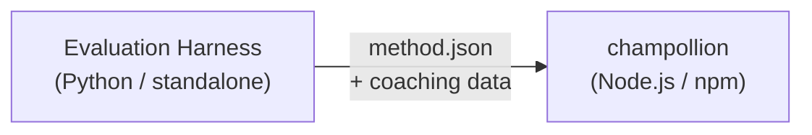

# Especificação de Plugin de Método

> **Versão**: 1.1  
> **Público**: Desenvolvedores de plugins  
> **Schema Canônico**: [`shared/schemas/champollion-plugin.schema.json`](https://github.com/gamedaysuits/Champollion/blob/main/cli/shared/schemas/champollion-plugin.schema.json)

## Visão Geral

champollion usa um **sistema de métodos plugável**. Cada par de idiomas pode usar um método de tradução diferente (LLM, coached, script-converter, etc.). Os métodos são registrados em `lib/translate.js` e resolvidos por par via `lib/pairs.js`.

O trabalho do harness de avaliação é **desenvolver, testar e exportar** métodos de tradução. O trabalho do champollion é **consumir e executar** eles. O plugin é **apenas dados** — configuração, conteúdo de coaching e resultados de benchmark. Sem código Python, sem dependências do harness.

### Fluxo de Dados



O harness desenvolve e testa métodos em Python. Quando um método está pronto para implantação, o harness exporta um manifesto `method.json` e arquivos de dados de coaching opcionais. Champollion instala e executa o método usando suas próprias implementações de método integradas.

---

## Formato de Plugin de Método

Um plugin de método é um único arquivo JSON (`method.json`) com arquivos de dados de coaching opcionais.

### `method.json` — Obrigatório

```json
{
  "name": "french-formal-v1",
  "type": "llm-coached",
  "version": "1.0.0",
  "description": "Formally-tuned French with terminology enforcement and grammar coaching",
  "author": "Plugin Author",

  "config": {
    "model": "google/gemini-3.5-flash",
    "temperature": 0.2,
    "batchSize": 80,
    "register": "formal",
    "coachingFile": null,
    "coachingPrompt": null,
    "promptContext": null,
    "qualityTier": null
  },

  "locales": ["fr"],

  "benchmarks": {
    "fr": {
      "date": "2026-05-11T00:00:00Z",
      "corpus_size": 500,
      "exact_match_rate": 0.42,
      "corpus_chrf": 72.3,
      "corpus_bleu": 45.1,
      "model": "google/gemini-3.5-flash",
      "harness_version": "1.0.0"
    }
  },

  "provenance": {
    "resources": [],
    "commercialReady": false,
    "flags": ["license-unclear"]
  },

  "coaching": {
    "dir": "coaching"
  }
}
```

### Referência de Campos

| Campo | Tipo | Obrigatório | Descrição |
|-------|------|----------|-------------|
| `name` | string | ✅ | Identificador único do método (kebab-case) |
| `type` | string | ✅ | Tipo de método Champollion: `llm`, `llm-coached`, `api`, `google-translate`, `deepl`, `microsoft-translator`, `libretranslate`, `openai`, `anthropic`, `gemini` |
| `version` | string | ✅ | Versão Semver (ex: `1.0.0`) |
| `locales` | string[] | ✅ | Quais códigos de locale este método atende (mínimo 1) |
| `description` | string | — | Descrição legível por humanos |
| `author` | string | — | Quem desenvolveu/testou este método |
| `config.model` | string | — | Identificador de modelo OpenRouter |
| `config.temperature` | number | — | Temperatura do LLM (0.0–2.0, padrão: 0.3) |
| `config.batchSize` | number | — | Chaves por lote de API (1–200, padrão: 80) |
| `config.register` | string \| null | — | Registro/tom de idioma alvo (chave predefinida ou texto livre) |
| `config.coachingFile` | string \| null | — | Caminho para arquivo de prompt de coaching em texto livre (relativo à raiz do projeto) |
| `config.coachingPrompt` | string \| null | — | Texto de prompt de coaching resolvido (lido de `coachingFile` em tempo de execução) |
| `config.promptContext` | string \| null | — | Contexto da aplicação injetado no prompt do sistema (ex: "Descrições de produtos de e-commerce") |
| `config.qualityTier` | string \| null | — | Nível de qualidade da avaliação de benchmark (`standard`, `high`, `research`, `verified`) |
| `benchmarks` | object | — | Resultados de benchmark por locale do harness de avaliação |
| `provenance` | object | — | Licenciamento e dependências de recursos |
| `coaching.dir` | string | — | Caminho relativo para diretório de dados de coaching |

:::info[Forma Canônica de MethodConfig]
O bloco `config` usa o **schema MethodConfig canônico** — os mesmos 8 campos usados em `champollion.config.json`, cartões de execução do harness, `mt-eval export-config` e publicação/instalação de leaderboard. Todos os campos estão sempre presentes; valores não utilizados são `null`. Isso garante round-tripping sem atrito entre avaliação e produção.
:::

### Objeto de Benchmark (por locale)

| Campo | Tipo | Obrigatório | Descrição |
|-------|------|----------|-------------|
| `date` | string | ✅ | Timestamp ISO 8601 da execução do benchmark |
| `corpus_size` | number | ✅ | Número de entradas avaliadas |
| `exact_match_rate` | number | ✅ | 0.0–1.0, proporção de correspondências exatas |
| `corpus_chrf` | number | — | Pontuação chrF++ (0–100) |
| `corpus_bleu` | number | — | Pontuação BLEU (0–100) |
| `model` | string | ✅ | Modelo usado durante a avaliação |
| `harness_version` | string | ✅ | Versão do harness de avaliação usado |

:::info[Quais métricas são exibidas?]
O comando `champollion status` exibe **chrF++** e **taxa de correspondência exata** do bloco de benchmark. `corpus_bleu` é aceito no manifesto, mas não é atualmente exibido ou usado por nenhum comando do champollion. O [Leaderboard de Métodos](/leaderboard) rastreia chrF++, correspondência exata e taxa de aceitação FST.
:::

---

### Objeto de Proveniência

O bloco de proveniência comunica o status de licenciamento dos recursos agrupados do plugin.

| Campo | Tipo | Padrão | Descrição |
|-------|------|---------|-------------|
| `resources` | object[] | `[]` | Lista de recursos agrupados com `name`, `license` e `type` |
| `commercialReady` | boolean | `false` | Se o plugin está autorizado para distribuição comercial |
| `flags` | string[] | `["license-unclear"]` | Sinalizadores de status legíveis por máquina |

**Estado padrão** — plugins exportados são enviados com `commercialReady: false` e `flags: ["license-unclear"]`.

**Estado autorizado** — quando o licenciamento foi verificado: defina `commercialReady: true` e limpe os sinalizadores.

---

## Formato de Dados de Coaching

Se `type` for `llm-coached`, o plugin deve incluir arquivos de dados de coaching no subdiretório `coaching/`.

### `coaching/<locale>.json`

```json
{
  "grammar_rules": [
    "French adjectives agree in gender and number with the noun they modify",
    "Use 'vous' for formal contexts, 'tu' for informal"
  ],
  "dictionary": {
    "dashboard": "tableau de bord",
    "deployment": "déploiement",
    "settings": "paramètres"
  },
  "style_notes": "Prefer active voice. Avoid anglicisms where a native French term exists."
}
```

| Campo | Tipo | Obrigatório | Descrição |
|-------|------|----------|-------------|
| `grammar_rules` | string[] | — | Regras injetadas em cada prompt de LLM para este locale |
| `dictionary` | object | — | Mapa termo → tradução. Termos correspondentes são injetados como terminologia obrigatória. |
| `style_notes` | string | — | Instruções de estilo em texto livre anexadas ao prompt |

---

## Estrutura de Diretório

```
french-formal-v1/
  method.json                 # Method manifest with benchmarks
  coaching/
    fr.json                   # Coaching data for French
```

Para métodos multi-locale:

```
european-formal-v2/
  method.json                 # locales: ["fr", "de", "es", "it"]
  coaching/
    fr.json
    de.json
    es.json
    it.json
```

---

## Como Champollion Consome Plugins

### Instalação

```bash
champollion plugin install ./french-formal-v1/
```

Salva em `.champollion/methods/french-formal-v1/`.

### Configuração

```json title="champollion.config.json"
{
  "pairs": {
    "en:fr": {
      "methodPlugin": "french-formal-v1"
    }
  }
}
```

:::info[Semântica de mesclagem]
O plugin define *qual* método usar (`type`). A configuração do par ajusta *como* executá-lo (`model`, `register`, `batchSize`). Se o par definir `model`, ele substitui o padrão do plugin.
:::

### Tempo de Execução

1. Champollion lê `method.json` de `.champollion/methods/french-formal-v1/`
2. O campo `type` do plugin define o método de tradução (ex: `llm-coached`)
3. Carrega dados de coaching do diretório `coaching/` do plugin
4. Usa o bloco `config` para preencher lacunas em modelo/registro/temperatura
5. O bloco `benchmarks` é exibido na saída `champollion status`
6. O bloco `provenance` é verificado por `champollion provenance` para sinalizadores de licenciamento

---

## Validação de Schema

Manifestos de plugin são validados no momento da instalação contra [`shared/schemas/champollion-plugin.schema.json`](https://github.com/gamedaysuits/Champollion/blob/main/cli/shared/schemas/champollion-plugin.schema.json).

Referencie o schema em seu `method.json` para autocompletar do IDE:

```json
{
  "$schema": "./node_modules/champollion/shared/schemas/champollion-plugin.schema.json",
  "name": "my-method-v1"
}
```

---

## O Que NÃO Incluir

- ❌ Sem código Python ou dependências do harness
- ❌ Sem dados de corpus brutos ou logs de execução
- ❌ Sem chaves de API ou credenciais
- ❌ Sem configuração do harness
- ❌ Sem templates de prompt internos (esses ficam nas implementações de método do champollion)

O plugin é **apenas dados**: configuração, conteúdo de coaching e resultados de benchmark.

---

## Veja Também

- [Métodos de Tradução](/docs/guides/translation-methods) — como cada método integrado funciona
- [Configuração](/docs/getting-started/configuration) — configuração por par e por idioma
- [Servindo um Método via API](/docs/guides/serving-a-method) — hospedando métodos como serviços HTTP
- [Cookbook: Pipeline com Gate FST](/docs/network/tutorials/fst-gated-pipeline) — construindo e empacotando um pipeline
- [Avaliação de MT](/docs/network/leaderboard/rules) — benchmarking de métodos para submissão em leaderboard
- [Suporte a Idioma de Baixo Recurso](/docs/network/community/low-resource-languages) — o caso de uso para plugins da comunidade
