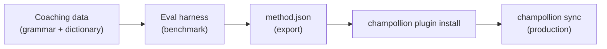

# Tutorial: Construir um Plugin de Tradução

Construa um método de tradução personalizado do zero, faça benchmark dele e implante-o como um plugin do champollion. Este é o fluxo de trabalho completo para adicionar um novo par de idiomas que nenhuma API pronta para uso suporta.

**O que você vai construir:** Um plugin de tradução orientado para francês formal com terminologia obrigatória, regras gramaticais e pontuações de benchmark.

**Tempo:** 30–45 minutos

**Pré-requisitos:**
- champollion instalado (`npm install --save-dev champollion`)
- Uma chave de API OpenRouter (`OPENROUTER_API_KEY`)
- Python 3.10+ (para o harness de avaliação)

---

## Passo 1: Identifique o Problema

Você está traduzindo um painel SaaS para francês. O método padrão `llm` produz traduções corretas, mas inconsistentes:

- Às vezes "dashboard" vira "tableau de bord," outras vezes "panneau de contrôle"
- O tom alterna entre formas `tu` e `vous`
- Termos técnicos ficam anglicizados de forma inconsistente

Você precisa de **aplicação de terminologia** e **controle de registro** que o prompt genérico do LLM não fornece.

## Passo 2: Crie Dados de Orientação

Crie um arquivo de orientação que codifique seus requisitos linguísticos:

```bash
mkdir -p .champollion/coaching
```

```json title=".champollion/coaching/fr.json"
{
  "grammar_rules": [
    "Always use the 'vous' form for formal register",
    "French adjectives agree in gender and number with their noun",
    "Use the present tense for UI instructions, not the imperative",
    "Preserve sentence-final punctuation style from the source"
  ],
  "dictionary": {
    "dashboard": "tableau de bord",
    "deployment": "déploiement",
    "settings": "paramètres",
    "environment variable": "variable d'environnement",
    "webhook": "webhook",
    "API key": "clé API",
    "sign in": "se connecter",
    "sign out": "se déconnecter",
    "repository": "dépôt",
    "pull request": "demande de tirage"
  },
  "style_notes": "Formal technical French. Prefer native French terms over anglicisms where established equivalents exist. Keep UI labels concise — 3 words maximum where possible."
}
```

**O que cada campo faz:**
- **`grammar_rules`** — Injetado no prompt do sistema do LLM como restrições explícitas
- **`dictionary`** — Correspondido contra chaves de origem; quando um termo do dicionário aparece, é injetado como "terminologia obrigatória" no prompt
- **`style_notes`** — Anexado ao prompt do sistema como orientação de estilo geral

## Passo 3: Configure o Par

Diga ao champollion para usar `llm-coached` para francês:

```json title="champollion.config.json"
{
  "version": 3,
  "inputLocale": "en",
  "localesDir": "./locales",
  "pairs": {
    "en:fr": {
      "method": "llm-coached",
      "model": "google/gemini-3.5-flash",
      "temperature": 0.2
    }
  },
  "languages": {
    "fr": {
      "register": "Formal technical French (vous-form)",
      "name": "French"
    }
  }
}
```

## Passo 4: Teste

```bash
npx champollion sync --dry
```

Revise a saída da execução seca. Verifique que:
- ✅ Termos do dicionário são usados consistentemente ("tableau de bord," não "panneau de contrôle")
- ✅ A forma `vous` é usada em todo lugar
- ✅ Termos técnicos correspondem ao seu dicionário

Depois execute a sincronização real:

```bash
npx champollion sync
```

## Passo 5: Faça Benchmark com o Harness de Avaliação (Opcional)

Se você quer pontuações de qualidade — e você quer, porque plugins são enviados com dados de benchmark — use o harness de avaliação complementar.

### Instale o Harness

```bash
pip install mt-eval-harness
```

### Crie um Corpus de Referência

Crie um arquivo com strings de origem e traduções conhecidas como boas:

```json title="corpus/french-formal.json"
[
  {
    "source": "Dashboard",
    "reference": "Tableau de bord"
  },
  {
    "source": "Sign in to your account",
    "reference": "Connectez-vous à votre compte"
  },
  {
    "source": "Your deployment is ready",
    "reference": "Votre déploiement est prêt"
  },
  {
    "source": "Environment variables",
    "reference": "Variables d'environnement"
  }
]
```

### Execute o Benchmark

```bash
mt-eval test \
  --corpus corpus/french-formal.json \
  --source en \
  --target fr \
  --model google/gemini-3.5-flash \
  --temperature 0.2 \
  --champollion-config champollion.config.json
```

O harness produz:
- **chrF++** — Pontuação F em nível de caractere (0–100). Acima de 70 é forte.
- **BLEU** — Sobreposição de n-gramas (0–100). Acima de 40 é sólido para tradução orientada.
- **Taxa de correspondência exata** — Proporção de traduções que correspondem exatamente à referência.
- **COMET** — Métrica de qualidade neural (se instalada via `mt-eval setup --comet`).

:::tip[Teste o Que Você Envia]
Usar `--champollion-config` importa seu modelo de produção, registro, temperatura e dados de orientação diretamente do seu `champollion.config.json`. Isso garante que você está fazendo benchmark do método exato que vai implantar.
:::

### Exporte o Plugin

Quando estiver satisfeito com as pontuações:

```bash
mt-eval export \
  --name french-formal-v1 \
  --report eval/logs/harness/run_report.json \
  --output ./french-formal-v1/
```

Isso cria:

```
french-formal-v1/
├── method.json          # Manifest with config + benchmarks
└── coaching/
    └── fr.json          # Your coaching data
```

## Passo 6: Instale o Plugin no Champollion

```bash
npx champollion plugin install ./french-formal-v1/
```

Isso copia o plugin para `.champollion/methods/french-formal-v1/`.

Atualize sua configuração para usá-lo:

```json title="champollion.config.json"
{
  "pairs": {
    "en:fr": {
      "methodPlugin": "french-formal-v1"
    }
  }
}
```

## Passo 7: Verifique

```bash
# Check plugin is installed and shows benchmark scores
npx champollion status

# Run a sync with the plugin
npx champollion sync

# Audit licensing status
npx champollion provenance
```

A saída `status` mostrará:

```
en → fr
  Method:    french-formal-v1 (llm-coached)
  Model:     google/gemini-3.5-flash
  Quality:   high
  chrF++:    74.2
  BLEU:      46.8
  Exact:     42%
```

## O Que Você Construiu



Você agora tem:
1. **Dados de orientação** — Regras gramaticais e terminologia que aplicam consistência
2. **Pontuações de benchmark** — Qualidade quantificada que é enviada com o plugin
3. **Um plugin portátil** — `method.json` + dados de orientação, instalável em qualquer máquina
4. **Implantação em produção** — Integrada ao seu pipeline de sincronização

## Próximos Passos

- **[Especificação de Plugin](/docs/reference/plugin-spec)** — Referência completa do formato de manifesto
- **[Métodos de Tradução](/docs/guides/translation-methods)** — Compare todos os quatro métodos
- **[Idiomas de Baixos Recursos](/docs/network/community/low-resource-languages)** — Aplique este padrão a idiomas sem cobertura de API
- **[Traduza 30 Idiomas](/docs/tutorials/translate-30-languages)** — Dimensione seu projeto para um público global
