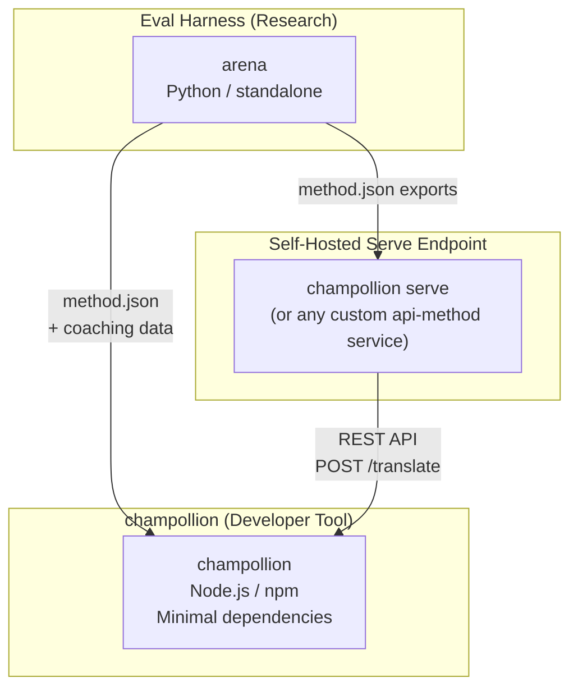
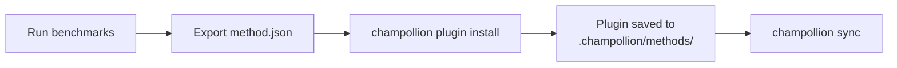
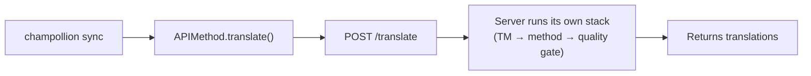
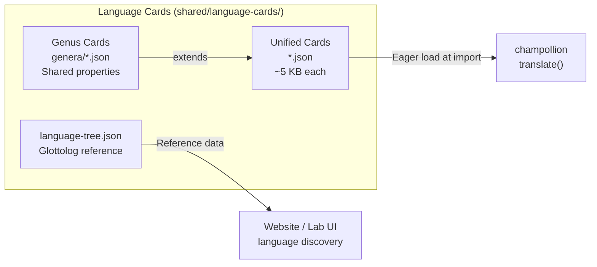

# สถาปัตยกรรม

ระบบนิเวศการแปลของ Champollion ประกอบด้วยเครื่องมือสามชิ้นที่เป็นอิสระจากกัน และทำงานร่วมกันผ่านสัญญาที่กำหนดไว้อย่างชัดเจน ไม่มีชิ้นใดพึ่งพาชิ้นอื่นในเวลา build เครื่องมือเหล่านี้สื่อสารกันผ่าน **รูปแบบ method plugin** ที่ใช้ร่วมกัน และ **สัญญา REST API**

## สามส่วนประกอบ



### champollion (โปรเจกต์นี้)

เครื่องมือสำหรับนักพัฒนาแบบ source-available (ใช้งานฟรีสำหรับวัตถุประสงค์ที่ไม่ใช่เชิงพาณิชย์) แปลไฟล์ locale โดยใช้วิธีการแบบปลั๊กอิน (pluggable methods) มี dependency น้อยมาก ไม่จำเป็นต้องตั้งค่า (config-optional) และพร้อมใช้งานได้ทันที

**Method ที่มีในตัว:**
- `llm` → OpenRouter / LLM ใดก็ได้ (200+ โมเดล)
- `llm-coached` → LLM + การช่วยเหลือด้านไวยากรณ์/พจนานุกรม
- `openai` → OpenAI API โดยตรง (GPT-4o, GPT-4o-mini)
- `anthropic` → Anthropic API โดยตรง (Claude Sonnet, Haiku, Opus)
- `gemini` → Google Gemini API โดยตรง (Flash, Pro — มี free tier)
- `google-translate` → Google Cloud Translation API v2
- `deepl` → DeepL API พร้อมรองรับ glossary
- `microsoft-translator` → Azure Cognitive Services Translator
- `libretranslate` → LibreTranslate แบบ self-hosted (AGPL, ฟรี)
- `api` → ท่อส่งข้อมูลบางๆ ไปยัง REST endpoint ระยะไกลใดก็ได้

### Eval Harness (โปรเจกต์เสริม)

เครื่องมือวิจัยสำหรับพัฒนา ทดสอบ และวัดประสิทธิภาพ translation method เมื่อ method มีคุณภาพถึงเกณฑ์ที่ยอมรับได้ harness จะส่งออก **method plugin** — ไฟล์ manifest `method.json` และไฟล์ข้อมูล coaching เสริม (ถ้ามี)

Harness ไม่เคยทำงานภายใน champollion เป็นเครื่องมือแยกต่างหากที่ผลิต output แบบ static (ไฟล์ JSON) Champollion เพียงแค่อ่านไฟล์เหล่านั้น

[→ Eval Harness บน GitHub](https://github.com/gamedaysuits/Champollion)

### Serve endpoint แบบโฮสต์ด้วยตัวเอง (`champollion serve`)

โปรเจกต์ champollion ใดๆ สามารถให้บริการ translation stack ที่ตั้งค่าไว้ของตัวเองผ่าน HTTP ได้ด้วยคำสั่งเดียว — [`champollion serve`](/docs/guides/serving-a-method#the-zero-code-path-champollion-serve) — และโปรเจกต์อื่นๆ สามารถเรียกใช้งานผ่าน method `api` ได้ ข้อมูล prompt, coaching data, Translation Memory และคีย์ของผู้ให้บริการ (provider keys) จะยังคงอยู่บนโครงสร้างพื้นฐานของเจ้าของ ผู้ใช้งาน (consumers) จะส่งเพียงแค่สตริงต้นทางและรับคำแปลกลับไปเท่านั้น Pipeline ที่อยู่นอก champollion โดยสิ้นเชิง (เช่น FST chain, ระบบงานวิจัย) สามารถนำ contract เดียวกันนี้ไปใช้งานในฐานะ [บริการแบบกำหนดเอง (custom service)](/docs/guides/serving-a-method) ได้ ไม่มีบริการ Champollion แบบโฮสต์ให้ — การให้บริการ (serving) จะเป็นแบบโฮสต์ด้วยตัวเอง (self-hosted) เสมอตามการออกแบบ

## การเชื่อมต่อระหว่างส่วนประกอบ

### Eval Harness → champollion (ส่งออกทางเดียว)



**สัญญา**: [Plugin Specification](/docs/reference/plugin-spec)

### Serve endpoint → champollion (API ขณะรันไทม์)



`APIMethod` ของ Champollion เป็น **ท่อส่งข้อมูลแบบง่าย** ส่ง key ออกไปและรับคำแปลกลับมา ไม่มี translation logic และไม่มีเนื้อหา proprietary ใดๆ ทั้งสิ้น

## สิ่งที่แต่ละส่วนรู้เกี่ยวกับส่วนอื่น

| เครื่องมือ | รู้จัก champollion หรือไม่? | รู้จัก serve endpoint หรือไม่? | รู้จัก harness หรือไม่? |
|------|---------------------|-------------------------------|---------------------|
| **champollion** | *(คือ champollion)* | รู้จัก — method `api` เป็นตัวเรียกใช้งาน | ไม่รู้จัก — แค่อ่านค่าที่ปลั๊กอิน export ออกมา |
| **Serve endpoint** | รู้จัก — ให้บริการตามคำขอ | *(คือ serve endpoint)* | ไม่รู้จัก — ติดตั้ง method ที่ export ออกมาเหมือนโปรเจกต์ทั่วไป |
| **Eval Harness** | รู้จัก — export รูปแบบปลั๊กอิน | ไม่รู้จัก — method ถูก deploy แยกต่างหาก | *(คือ harness)* |

## สถานการณ์การใช้งาน

### สถานการณ์ที่ 1: ฟรี ไม่ต้องตั้งค่า (ผู้ใช้ส่วนใหญ่)

```bash
export OPENROUTER_API_KEY=sk-...
npx champollion sync
```

ใช้ method `llm` ที่มีมาให้ในตัว ไม่มีปลั๊กอิน ไม่มีเซิร์ฟเวอร์ ไม่มี harness

### สถานการณ์ที่ 2: Google Translate เป็นพื้นฐาน

```bash
export GOOGLE_TRANSLATE_API_KEY=AIza...
npx champollion sync
```

ใช้ method `google-translate` ที่มีในตัว ไม่ต้องใช้ plugin

### สถานการณ์ที่ 3: Open plugin พร้อม coaching ที่รวมมาด้วย

```bash
champollion plugin install ./french-formal-v1/
champollion sync
```

Plugin มี `type: "llm-coached"` → champollion ใช้ OpenRouter key ของผู้ใช้เอง ข้อมูล coaching อยู่ในเครื่อง (ไม่มีการเรียกเซิร์ฟเวอร์)

### สถานการณ์ที่ 4: DIY coaching (ไม่มี plugin ไม่มี harness)

```json title="champollion.config.json"
{
  "pairs": {
    "en:fr": { "method": "llm-coached" }
  }
}
```

ผู้ใช้ดูแลกฎไวยากรณ์และพจนานุกรมของตนเองใน `.champollion/coaching/fr.json`

### สถานการณ์ที่ 5: เรียกใช้งาน served stack ของโปรเจกต์อื่น

```bash
champollion plugin install ./their-project-serve/   # manifest from `champollion serve --emit-manifest`
CHAMPOLLION_API_KEY=<their bearer token> champollion sync
```

Method `api` ของคู่ภาษาจะทำการ POST สตริงต้นทางไปยัง endpoint [`champollion serve`](/docs/guides/serving-a-method#the-zero-code-path-champollion-serve) แบบโฮสต์ด้วยตัวเองของพวกเขา จากนั้น stack ของพวกเขา (coaching, TM, quality gate) จะทำหน้าที่แปลภาษา

## Language Cards

แต่ละภาษาใน champollion ถูกกำหนดค่าผ่าน **Language Card** — ไฟล์ JSON แบบรวมศูนย์ที่ประกอบด้วย register preset, กฎความเป็นทางการ, flag รองรับ method, รูปแบบการพิมพ์, การจำแนกตระกูลภาษา และข้อมูลอ้างอิงทางภาษาศาสตร์



Card จะถูกโหลดทันทีเมื่อ import แต่ละ card มี metadata ทั้งหมดที่ translation engine และเอกสารสำหรับนักพัฒนาต้องการ — ไม่มีชั้นข้อมูลอ้างอิงแยกต่างหาก Card ถูกสร้างจากแหล่งข้อมูลที่เชื่อถือได้ (IANA, CLDR, [Glottolog](https://glottolog.org), [WALS](https://wals.info)) โดยใช้ `scripts/generate-language-card.mjs` และ `scripts/build-language-tree.mjs` จากนั้นผ่านการตรวจสอบโดยมนุษย์เพื่อความถูกต้องทางภาษาศาสตร์

## หลักการออกแบบ

1. **ไม่มี Circular dependencies** สะพานเชื่อมต่อเป็นแบบทางเดียว
2. **Champollion เป็นแกนหลักที่มีน้ำหนักเบา** มี dependency น้อยมาก ไม่จำเป็นต้องตั้งค่า (config-optional) ปลั๊กอินและ API เป็นส่วนเสริม
3. **การปกป้องทรัพย์สินทางปัญญา (IP) อยู่ในระดับสถาปัตยกรรม** เทคนิคที่เป็นกรรมสิทธิ์จะอยู่ฝั่งผู้ให้บริการ (serving side) — ใครก็ตามที่รัน endpoint จะเป็นผู้เก็บรักษาข้อมูล prompt, coaching และคีย์ของตนเอง แพ็กเกจ npm จะไม่มีการส่งมอบสิ่งที่เป็นกรรมสิทธิ์ใดๆ
4. **รูปแบบปลั๊กอินคือ contract** ทุกอย่างจะไหลผ่าน `method.json`
5. **แต่ละเครื่องมือมีหน้าที่เดียว** Harness → พัฒนา method. `champollion serve` → โฮสต์ method. Champollion → แปลไฟล์.

---

## ดูเพิ่มเติม

- [Translation Methods](/docs/guides/translation-methods) — วิธีการทำงานของแต่ละ built-in method
- [Plugin Specification](/docs/reference/plugin-spec) — รูปแบบ manifest ของ method.json
- [Eval Harness](/docs/network/specifications/harness) — เครื่องมือวิจัยเสริม
- [Serving a Method via API](/docs/guides/serving-a-method) — การโฮสต์ translation pipeline แบบกำหนดเอง
- [Support a Low-Resource Language](/docs/network/community/low-resource-languages) — กรณีการใช้งานที่เป็นแรงบันดาลใจให้กับสถาปัตยกรรมนี้
