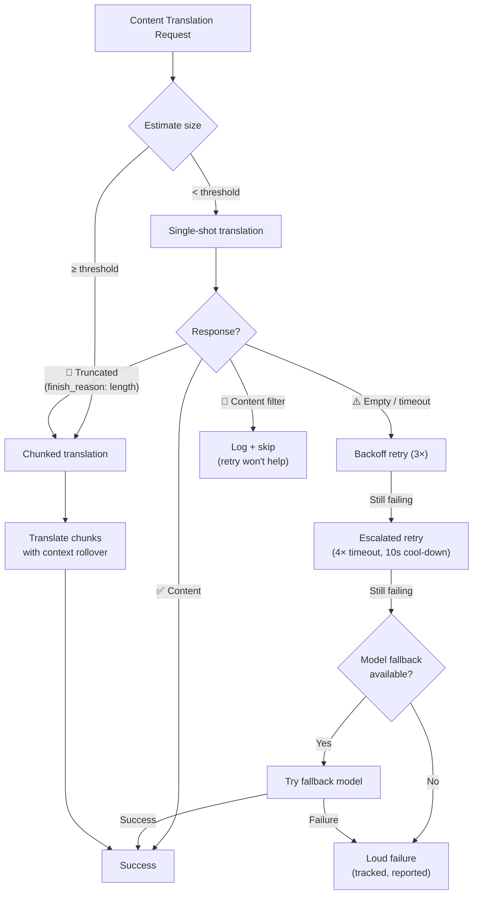

# ความยืดหยุ่นในการแปลเนื้อหา

ไปป์ไลน์การแปลเนื้อหาของ Champollion (เอกสาร Markdown/MDX) ใช้ระบบความยืดหยุ่นหลายชั้นเพื่อรับมือกับความล้มเหลวอย่างมีประสิทธิภาพ ต่างจากการแปลแบบ key-value ที่แต่ละ batch มีขนาดเล็กและการลองใหม่มีต้นทุนต่ำ — การแปลเนื้อหาเกี่ยวข้องกับ prompt ขนาดใหญ่และ output ที่ยาว ซึ่งอาจล้มเหลวด้วยเหตุผลเชิงโครงสร้าง ไม่ใช่แค่ความผิดพลาดชั่วคราว

## ปัญหา

การแปลเนื้อหามีรูปแบบความล้มเหลวที่แตกต่างจากการแปลแบบ key-value อย่างมีนัยสำคัญ:

| รูปแบบความล้มเหลว | Key-Value | เนื้อหา |
|---|---|---|
| Rate limit (429) | พบบ่อย, ชั่วคราว | พบบ่อย, ชั่วคราว |
| Timeout | พบน้อย (batch เล็ก) | พบบ่อย (output ยาว) |
| Response ว่างเปล่า | พบน้อย | พบบ่อย (ข้อจำกัด output, ตัวกรอง) |
| Output ถูกตัดทอน | ไม่มี (ตรวจสอบด้วย JSON) | เกิดขึ้นโดยไม่มีสัญญาณเตือน |
| ตัวกรองเนื้อหา | พบน้อยมาก | อาจเกิดขึ้น (เอกสาร CLI, เอกสารด้านความปลอดภัย) |
| ข้อจำกัดของโมเดล | ลองใหม่แก้ได้ | ลองใหม่ไม่ช่วย |

ข้อสังเกตสำคัญ: **การลองซ้ำ request เดิมที่ล้มเหลวไม่ใช่ความซ้ำซ้อนที่มีประโยชน์ แต่คือความดื้อรั้น** ระบบความยืดหยุ่นที่ดีต้องระบุ *สาเหตุ* ของความล้มเหลวและเปลี่ยนแนวทางให้เหมาะสม

## ภาพรวมสถาปัตยกรรม



## ชั้นที่ 1: การลองใหม่แบบวินิจฉัยก่อน

ก่อนตัดสินใจว่าจะลองใหม่ *อย่างไร* ระบบจะตรวจสอบ API response เพื่อทำความเข้าใจว่า *อะไร* ล้มเหลว

### การวิเคราะห์ Finish Reason

LLM API ทุกตัวจะส่งคืน `finish_reason` พร้อมกับข้อความที่สร้างขึ้น Champollion ใช้ข้อมูลนี้เพื่อตัดสินใจลองใหม่อย่างชาญฉลาด:

| `finish_reason` | ความหมาย | การดำเนินการ |
|---|---|---|
| `stop` + มีเนื้อหา | โมเดลทำงานเสร็จสมบูรณ์ | ✅ ยอมรับผลลัพธ์ |
| `stop` + ว่างเปล่า | โมเดลไม่สร้าง output | ⚠️ ลองใหม่ request เดิม (ชั่วคราว) |
| `length` | Output ถึงขีดจำกัด token | 🔶 แบ่งเอกสารเป็น chunk อัตโนมัติ |
| `content_filter` | ตัวกรองความปลอดภัยบล็อก output | 🔴 บันทึกและข้ามไป (ลองใหม่ไม่ช่วย) |
| `null` / ไม่มีค่า | Response มีรูปแบบผิดพลาด | ⚠️ ลองใหม่ request เดิม (ชั่วคราว) |

วิธีนี้แทนที่แนวทางเดิมที่ปฏิบัติต่อความล้มเหลวทุกประเภทเหมือนกันด้วยการลองใหม่แบบ backoff

### งบประมาณการลองใหม่

งบประมาณการลองใหม่มาตรฐานสำหรับความล้มเหลวชั่วคราว:

| รอบ | จำนวนครั้ง | Timeout | Backoff |
|---|---|---|---|
| มาตรฐาน | 4 (0→3) | 60s | 1s → 2s → 4s |
| ยกระดับ | 4 (0→3) | 120s | 1s → 2s → 4s |
| **รวม** | **8** | — | **~3.5 นาที กรณีเลวร้ายที่สุด** |

ระหว่างรอบ จะมีช่วงพัก 10 วินาทีเพื่อให้ปัญหาชั่วคราวคลี่คลาย

## ชั้นที่ 2: การแบ่งเนื้อหาเป็น Chunk

เมื่อเอกสารมีขนาดเกินเกณฑ์ที่กำหนด — หรือเมื่อชั้นที่ 1 ตรวจพบการตัดทอน output — ระบบจะแบ่งเอกสารออกเป็น chunk ขนาดเหมาะสมสำหรับการแปล

ดู [Context Rollover](/docs/concepts/context-rollover#content-chunking) สำหรับการกำหนดค่า chunking โดยละเอียด ประเด็นสำคัญ:

### กลยุทธ์การแบ่ง

1. **ขอบเขต Heading** — `##` และ `###` เป็นขอบเขตหน่วยการแปลที่เป็นธรรมชาติ แต่ละส่วนมีความสมบูรณ์ในตัวเองเพียงพอสำหรับการแปลอิสระ
2. **Fallback ที่ย่อหน้า** — หากส่วน heading เดียวมีขนาดเกิน chunk size ให้แบ่งที่บรรทัดว่างสองบรรทัด
3. **การแบ่งแบบ Hard split** — ทางเลือกสุดท้ายสำหรับย่อหน้าที่ยาวมาก (เช่น ตาราง) โดยแบ่งที่ขอบเขตประโยค

### บริบทระหว่าง Chunk

แต่ละ chunk จะได้รับ 2-3 ย่อหน้าสุดท้ายของการแปล *chunk ก่อนหน้า* เป็นบริบท เพื่อป้องกัน:
- **การเบี่ยงเบนของคำศัพท์** — โมเดลเห็นว่าตัวเองใช้คำว่า "tableau de bord" ใน chunk ก่อนหน้า
- **การอ้างอิง pronoun** — antecedent จากส่วนก่อนหน้าถูกส่งต่อมา
- **ความสม่ำเสมอของ register** — โทนที่กำหนดใน chunk 1 คงอยู่ตลอดจนถึง chunk N

### ตัวกระตุ้น Auto-Chunking

| ตัวกระตุ้น | พฤติกรรม |
|---|---|
| `contentChunkSize` ตั้งค่าใน config | แบ่ง chunk เอกสารที่เกินขนาดนั้นเสมอ |
| `finish_reason: "length"` ถูกส่งคืน | Auto-chunk เป็น fallback (แม้ไม่มีการตั้งค่า) |
| Input > ~12KB (ตรวจจับอัตโนมัติ) | บันทึกคำแนะนำ แต่ไม่บังคับ |

## ชั้นที่ 3: ห่วงโซ่ Model Fallback

เมื่อโมเดลที่กำหนดค่าไว้ล้มเหลวอย่างต่อเนื่อง — ไม่ใช่ชั่วคราว แต่เชิงโครงสร้าง — ระบบจะลองใช้โมเดลทางเลือก โมเดลต่างกันมี context window, ขีดจำกัด output, ตัวกรองความปลอดภัย และความสามารถด้านหลายภาษาที่แตกต่างกัน

### ห่วงโซ่ Fallback เริ่มต้น

```json title="champollion.config.json"
{
  "contentFallbackChain": [
    "google/gemini-2.5-flash",
    "anthropic/claude-sonnet-4"
  ]
}
```

โมเดลที่กำหนดค่าไว้จะถูกลองก่อนเสมอ โมเดล fallback จะถูกใช้เฉพาะหลังจากรอบการลองใหม่ทั้งหมด (มาตรฐาน + ยกระดับ) หมดแล้ว

### เหตุผลที่ต้องใช้หลายสถาปัตยกรรม

| สถานการณ์ | โมเดลหลักล้มเหลว | โมเดล Fallback สำเร็จ |
|---|---|---|
| เอกสาร CLI ภาษาเวียดนาม | Gemini ส่งคืนค่าว่าง | Claude จัดการได้ปกติ |
| เนื้อหาที่ถูกตัวกรอง | OpenAI บล็อก | Gemini มีเกณฑ์ตัวกรองต่างกัน |
| ตารางโครงสร้างยาว | โมเดล A ตัดทอน | โมเดล B มี output window ใหญ่กว่า |

คุณค่าของ fallback คือความหลากหลายทางสถาปัตยกรรม — โมเดลต่างตระกูลมีรูปแบบความล้มเหลวต่างกัน ความล้มเหลวที่เป็นเชิงโครงสร้างสำหรับโมเดลหนึ่งอาจเป็นเรื่องเล็กน้อยสำหรับอีกโมเดลหนึ่ง

### ขอบเขต

> Model fallback ใช้กับ **เนื้อหาเท่านั้น** Key-value batch มีขนาดเล็กและแทบไม่เคยล้มเหลวเชิงโครงสร้าง การเพิ่มความซับซ้อนของ fallback ในส่วนนั้นจะเป็นการ over-engineering

## ชั้นที่ 4: การบัญชีความล้มเหลว

เมื่อเกิดความล้มเหลว ระบบจะติดตามและรายงานอย่างถูกต้องแทนที่จะดำเนินการต่อโดยเงียบ

### ระหว่าง Sync

- รายการที่ล้มเหลวจะแสดง `[FAIL]` ใน progress output
- ความล้มเหลวแต่ละรายการบันทึกสาเหตุเฉพาะ (timeout, response ว่างเปล่า, ตัวกรองเนื้อหา, การตัดทอน)
- รายการที่เสร็จสมบูรณ์จะถูกบันทึกลง manifest ทันที (incremental persistence)

### หลัง Sync

สรุปความล้มเหลวจะแสดงเมื่อสิ้นสุด:

```
  ┌─ Content Translation Failures ─────────────────────────────────────┐
  │                                                                     │
  │  2 of 24 content translations failed:                              │
  │                                                                     │
  │  ✗ docs/reference/cli.md → vi                                      │
  │    Reason: empty response after 8 attempts + 1 fallback model      │
  │    Models tried: google/gemini-3.1-pro-preview, gemini-2.5-flash   │
  │                                                                     │
  │  ✗ docs/guides/troubleshooting.md → ar                             │
  │    Reason: content_filter (no retry — blocked by safety filter)    │
  │                                                                     │
  │  Re-run: npx champollion@latest sync                              │
  │  (22 completed translations are cached and won't re-run)           │
  └─────────────────────────────────────────────────────────────────────┘
```

### Retry Manifest

ไฟล์ที่ล้มเหลวจะถูกเขียนลงใน `.champollion-retry.json`:

```json
{
  "failedAt": "2026-05-27T21:45:00Z",
  "files": [
    {
      "source": "docs/reference/cli.md",
      "locale": "vi",
      "reason": "empty_response",
      "attempts": 8,
      "modelsTried": ["google/gemini-3.1-pro-preview", "google/gemini-2.5-flash"]
    }
  ]
}
```

ในการรัน `sync` ครั้งถัดไป จะประมวลผลเฉพาะไฟล์เหล่านี้เท่านั้น ไฟล์ที่เสร็จสมบูรณ์แล้วจะถูกเก็บรักษาผ่าน content hash manifest (`.champollion-content.lock`)

### Exit Code

| Code | ความหมาย |
|---|---|
| 0 | การแปลทั้งหมดสำเร็จ |
| 1 | ข้อผิดพลาดในการกำหนดค่า, API key หายไป, ฯลฯ |
| 2 | ความล้มเหลวบางส่วน — การแปลเนื้อหาบางรายการล้มเหลว |

## การกำหนดค่า

```json title="champollion.config.json"
{
  "contentChunkSize": 4000,
  "contentOverlap": 200,
  "contentFallbackChain": [
    "google/gemini-2.5-flash",
    "anthropic/claude-sonnet-4"
  ]
}
```

| Field | Type | Default | คำอธิบาย |
|---|---|---|---|
| `contentChunkSize` | `number \| null` | `null` | จำนวน token สูงสุดต่อ content chunk `null` = ไม่แบ่ง chunk (auto-chunk เฉพาะเมื่อถูกตัดทอน) |
| `contentOverlap` | `number` | `200` | Token ที่ซ้อนทับกันระหว่าง content chunk เพื่อความต่อเนื่องของบริบท |
| `contentFallbackChain` | `string[]` | `[]` | โมเดล fallback ที่จะลองเมื่อโมเดลที่กำหนดค่าไว้ล้มเหลวเชิงโครงสร้าง |

## สถานะการพัฒนา

| ฟีเจอร์ | สถานะ |
|---|---|
| การลองใหม่แบบวินิจฉัยก่อน (การแยกวิเคราะห์ finish_reason) | 🔲 วางแผนไว้ |
| การแบ่งเนื้อหาเป็น chunk (แบ่งที่ heading/paragraph) | 🔲 วางแผนไว้ |
| Context rollover ระหว่าง chunk | 🔲 วางแผนไว้ |
| ห่วงโซ่ model fallback | 🔲 วางแผนไว้ |
| รายงานสรุปความล้มเหลว | 🔲 วางแผนไว้ |
| Retry manifest (.champollion-retry.json) | 🔲 วางแผนไว้ |
| Exit code 2 สำหรับความล้มเหลวบางส่วน | 🔲 วางแผนไว้ |
| การลองใหม่แบบยกระดับ (extended timeout) | ✅ พัฒนาแล้ว (v3.3.3) |
| ข้อความลองใหม่พร้อมหมายเลขครั้ง | ✅ พัฒนาแล้ว (v3.3.3) |
| การแจ้งความล้มเหลวอย่างชัดเจนสำหรับข้อผิดพลาดเนื้อหา | ✅ พัฒนาแล้ว (v3.3.3) |

## ดูเพิ่มเติม

- [Context Rollover](/docs/concepts/context-rollover) — ความสม่ำเสมอของ batch และการกำหนดค่า content chunking
- [วิธีการทำงานของ Sync](/docs/concepts/how-sync-works) — ไปป์ไลน์ sync ทั้งหมด
- [วิธีการแปล](/docs/guides/translation-methods) — วิธีการที่มีให้ใช้และลักษณะเฉพาะของแต่ละวิธี
