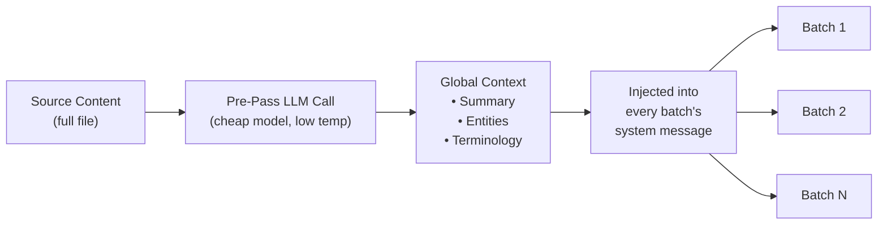

# การแบ่งกลุ่มงานแบบ Context Rollover

Context rollover เป็นฟีเจอร์ความสอดคล้องของการแปลในระดับเอกสาร ที่นำหน้าต่างของการแปลก่อนหน้ามาส่งต่อไปยังกลุ่มงานถัดไป เพื่อให้ LLM มี "หน่วยความจำระยะสั้น" ข้ามขอบเขตของกลุ่มงาน

## เหตุผลที่มีฟีเจอร์นี้

เมื่อแปลไฟล์ขนาดใหญ่ (100+ คีย์ หรือเอกสาร Markdown ที่ยาว) champollion จะแบ่งงานออกเป็นกลุ่มๆ หากไม่มี rollover แต่ละกลุ่มจะถูกแปลอย่างอิสระ — LLM จะไม่มีความทรงจำเกี่ยวกับสิ่งที่แปลไปในกลุ่มก่อนหน้า ซึ่งก่อให้เกิดปัญหาดังนี้:

- **การเบี่ยงเบนของคำศัพท์**: คำภาษาอังกฤษเดียวกันถูกแปลต่างกันในแต่ละกลุ่ม (เช่น "dashboard" → "tableau de bord" ในกลุ่มที่ 1, "panneau" ในกลุ่มที่ 3)
- **ความล้มเหลวของการอ้างอิง**: สรรพนามและการอ้างอิงที่ข้ามขอบเขตกลุ่มสูญเสียบริบทที่อ้างถึง
- **ความไม่สอดคล้องของน้ำเสียง**: โทนการเขียนอาจเปลี่ยนแปลงระหว่างกลุ่ม (เป็นทางการ → ไม่เป็นทางการ → เป็นทางการ)

ปัญหานี้ได้รับการบันทึกไว้อย่างดีในวรรณกรรมด้าน MT แนวทาง sliding window ได้รับการยืนยันจากงานวิจัยด้านการแปลด้วยเครื่องในระดับเอกสาร (ACL, WMT workshops)

## วิธีการทำงาน

### Sliding Window

เมื่อเปิดใช้งาน `contextRollover` pipeline การแปลจะรักษาหน้าต่างของคู่คีย์-ค่าที่แปลล่าสุดไว้ หลังจากแต่ละกลุ่มเสร็จสิ้น ส่วนหนึ่งของผลลัพธ์ (ค่าเริ่มต้น: 20% ของ `batchSize`) จะถูกนำไปใส่ใน prompt ของกลุ่มถัดไปในฐานะ "การแปลอ้างอิง"

```
Batch 1: Translate keys 1-80         → LLM sees: system prompt + keys 1-80
Batch 2: Translate keys 81-160       → LLM sees: system prompt + [16 reference translations from batch 1] + keys 81-160
Batch 3: Translate keys 161-240      → LLM sees: system prompt + [16 reference translations from batch 2] + keys 161-240
```

การแปลอ้างอิงจะถูกแทรกเข้าไปในข้อความของผู้ใช้พร้อมป้ายกำกับที่ชัดเจน:

```
--- Previous translations for context (do NOT re-translate these) ---
"nav.dashboard": "Tableau de bord"
"nav.settings": "Paramètres"
"header.welcome": "Bienvenue sur la plateforme"
---

{
  "content.main_heading": "Getting Started with Your Dashboard",
  ...
}
```

### กลยุทธ์การเลือก

สองโหมดสำหรับการเลือกว่าจะนำการแปลใดส่งต่อไป:

| กลยุทธ์ | พฤติกรรม | เหมาะสำหรับ |
|----------|----------|----------|
| `tail` (ค่าเริ่มต้น) | การแปล N รายการล่าสุดจากกลุ่มก่อนหน้า | เอกสารแบบลำดับ, เนื้อหา Markdown |
| `diverse` | เลือกรายการที่ครอบคลุมประเภทคีย์ที่แตกต่างกัน (ปุ่ม, หัวข้อ, คำอธิบาย) | ไฟล์ JSON ขนาดใหญ่ที่มีองค์ประกอบ UI หลายประเภท |

### งบประมาณ Token

หน้าต่าง rollover ใช้ input token Champollion คำนวณต้นทุน token โดยประมาณและแจ้งเตือนหากหน้าต่างเกิน 15% ของ context window โดยประมาณของโมเดล การแจ้งเตือนจะรวมคำแนะนำในการลดขนาด:

```
[WARN] Rollover window is ~2400 tokens (18% of model context).
       Consider reducing rolloverSize to 0.15 or lowering batchSize.
```

## Global Context Pre-Pass

การเรียก LLM แบบ first-pass ที่เป็นตัวเลือกเสริม ซึ่งทำงาน**ก่อน**การแปลเริ่มต้น LLM จะวิเคราะห์เนื้อหาต้นฉบับทั้งหมดและสร้างผลลัพธ์ดังนี้:

1. **สรุปเอกสาร** — คำอธิบาย 2-3 ประโยคเกี่ยวกับสิ่งที่กำลังแปล
2. **Named Entities** — ชื่อผลิตภัณฑ์, คำศัพท์ทางเทคนิค, และคำนามเฉพาะพร้อมคำแนะนำการจัดการ
3. **รายการความสอดคล้องของคำศัพท์** — คำสำคัญที่ LLM ระบุว่าต้องการการแปลที่สอดคล้องกัน

บริบทส่วนกลางนี้จะถูกแทรกเข้าไปใน**ข้อความระบบ**ของทุกกลุ่ม ทำให้แต่ละกลุ่มรับรู้เอกสารทั้งหมดแม้จะเห็นเพียงส่วนหนึ่ง



### โมเดลสำหรับ Pre-Pass

การดึง global context ใช้การเรียก LLM แยกต่างหากที่มีราคาถูก (ค่าเริ่มต้น: `google/gemini-3.5-flash` ที่ temperature 0.1) โดยไม่คำนึงถึงโมเดลการแปลที่ผู้ใช้กำหนดค่าไว้ นี่คืองานดึงข้อมูล metadata ไม่ใช่งานแปล — ความเร็วและต้นทุนสำคัญกว่าผลลัพธ์เชิงสร้างสรรค์

## การแบ่งเนื้อหาเป็นส่วนๆ {#content-chunking}

สำหรับเอกสาร Markdown ที่ยาว (การแปลเนื้อหา) เนื้อหาอาจเกิน context window ที่มีประสิทธิภาพของ LLM หรือโมเดลอาจตัดทอนผลลัพธ์ การแบ่งเนื้อหาจะแยกเอกสารออกเป็นส่วนที่ทับซ้อนกัน โดยแต่ละส่วนจะถูกแปลอย่างอิสระแล้วนำมาประกอบกันใหม่

### กลยุทธ์การแบ่ง

การแบ่งเนื้อหาเป็นส่วนๆ ใช้ลำดับความสำคัญแบบ cascade — โดยลองจุดแบ่งที่มีความหมายเชิงความหมายมากที่สุดก่อน:

1. **ขอบเขตหัวข้อ** — เครื่องหมาย `##` และ `###` สร้างหน่วยการแปลที่เป็นธรรมชาติ แต่ละส่วนมีความสมบูรณ์ในตัวเองเพียงพอสำหรับการแปลอิสระ และหัวข้อให้บริบทเชิงโครงสร้างแก่ LLM เกี่ยวกับสิ่งที่กำลังแปล
2. **ขอบเขตย่อหน้า** — หากส่วนหัวข้อเดียวเกินขนาด chunk ให้แบ่งที่บรรทัดว่างสองบรรทัด (`\n\n`) ย่อหน้าเป็นขอบเขตที่ดีที่สุดรองลงมาเพราะแสดงถึงความคิดที่สมบูรณ์
3. **ขอบเขตประโยค** — ทางเลือกสุดท้ายสำหรับย่อหน้าที่ยาวมาก (เช่น ตารางขนาดใหญ่, ข้อความหนาแน่น) แบ่งที่ขอบเขตจุด-เว้นวรรคโดยเคารพคำย่อ

บล็อกที่ได้รับการป้องกัน (code fences, shortcodes — ดู [วิธีการทำงานของ Sync](/docs/concepts/how-sync-works)) จะไม่ถูกแบ่งข้ามส่วน หากบล็อกที่ได้รับการป้องกันจะถูกตัด จุดแบ่งจะเลื่อนไปก่อนหรือหลังบล็อกนั้น

### ตัวกระตุ้น Auto-Chunking

การแบ่งเนื้อหาเปิดใช้งานได้สองวิธี:

| ตัวกระตุ้น | พฤติกรรม |
|---------|----------|
| `contentChunkSize` ที่กำหนดในการตั้งค่า | แบ่งเนื้อหาเอกสารทั้งหมดที่เกินจำนวน token นั้นล่วงหน้า |
| โมเดลส่งคืน `finish_reason: "length"` | แบ่งเนื้อหาอัตโนมัติเป็น fallback แม้ไม่มีการตั้งค่า |

ตัวกระตุ้น fallback หมายความว่าการแบ่งเนื้อหาทำงานเป็นตาข่ายนิรภัยแม้คุณไม่ได้กำหนดค่าไว้ — หากโมเดลตัดทอน champollion จะลองใหม่อัตโนมัติด้วยการแบ่งเนื้อหา

### การกำหนดค่า

- **`contentChunkSize`**: จำนวน token สูงสุดต่อส่วน (ค่าเริ่มต้น: null = ส่งเนื้อหาทั้งหมด; กำหนดเป็น 4000 สำหรับเอกสารที่ยาว)
- **`contentOverlap`**: Token ที่ทับซ้อนกันระหว่างส่วน (ค่าเริ่มต้น: 200) การทับซ้อนช่วยให้การเปลี่ยนผ่านที่ขอบเขตของส่วนราบรื่น

เมื่อการแบ่งเนื้อหาทำงาน context rollover จะถูกนำไปใช้โดยอัตโนมัติระหว่างส่วน — ผลลัพธ์ที่แปลแล้วของย่อหน้าสุดท้ายของส่วนก่อนหน้าจะถูกเพิ่มไว้ที่ต้น prompt ของส่วนถัดไป

```json title="champollion.config.json"
{
  "contentChunkSize": 4000,
  "contentOverlap": 200
}
```

> สำหรับระบบความยืดหยุ่นในการแปลเนื้อหาทั้งหมด (การลองใหม่แบบ diagnostic, model fallback, การบัญชีความล้มเหลว) ดู [Content Resilience](/docs/concepts/content-resilience)

## การกำหนดค่า

### เริ่มต้นอย่างรวดเร็ว

```json title="champollion.config.json"
{
  "contextRollover": true,
  "globalContext": true,
  "contentChunkSize": 4000,
  "contentOverlap": 200
}
```

### ตัวเลือกทั้งหมด

```json title="champollion.config.json (advanced)"
{
  "contextRollover": {
    "size": 0.2,
    "strategy": "tail",
    "maxTokens": null
  },
  "globalContext": {
    "model": "google/gemini-3.5-flash",
    "maxEntities": 20,
    "temperature": 0.1
  },
  "contentChunkSize": 4000,
  "contentOverlap": 200,
  "contentFallbackChain": [
    "google/gemini-2.5-flash",
    "anthropic/claude-sonnet-4"
  ]
}
```

| ฟิลด์ | ประเภท | ค่าเริ่มต้น | คำอธิบาย |
|-------|------|---------|-------------|
| `contextRollover` | `boolean \| object` | `false` | เปิดใช้งาน sliding window rollover |
| `contextRollover.size` | `number` | `0.2` | สัดส่วนของ `batchSize` ที่จะส่งต่อ (0.0–1.0) |
| `contextRollover.strategy` | `string` | `"tail"` | กลยุทธ์การเลือก: `"tail"` หรือ `"diverse"` |
| `contextRollover.maxTokens` | `number \| null` | `null` | ขีดจำกัดสูงสุดของงบประมาณ token สำหรับ rollover |
| `globalContext` | `boolean \| object` | `false` | เปิดใช้งาน global context pre-pass |
| `globalContext.model` | `string` | `"google/gemini-3.5-flash"` | โมเดลสำหรับการเรียก pre-pass |
| `globalContext.maxEntities` | `number` | `20` | จำนวน named entities สูงสุดที่จะดึงออกมา |
| `globalContext.temperature` | `number` | `0.1` | Temperature สำหรับการเรียก pre-pass |
| `contentChunkSize` | `number \| null` | `null` | Token สูงสุดต่อส่วนเนื้อหา (null = ไม่แบ่งส่วน) |
| `contentOverlap` | `number` | `200` | Token ที่ทับซ้อนกันระหว่างส่วนเนื้อหา |
| `contentFallbackChain` | `string[]` | `[]` | โมเดล fallback สำหรับการแปลเนื้อหาเมื่อโมเดลที่กำหนดค่าไว้ล้มเหลวเชิงโครงสร้าง |

## เมื่อใดควรใช้

| สถานการณ์ | คำแนะนำ |
|----------|---------------|
| ไฟล์ JSON ขนาดเล็ก (< 50 คีย์) | ไม่จำเป็น — กลุ่มเดียว ไม่มีปัญหาขอบเขต |
| ไฟล์ JSON ขนาดใหญ่ (100+ คีย์) | เปิดใช้งาน `contextRollover` เพื่อความสอดคล้องของคำศัพท์ |
| เอกสาร Markdown ที่ยาว | เปิดใช้งาน `contextRollover` + `contentChunkSize` + `globalContext` |
| เอกสารทางเทคนิค | เปิดใช้งาน `globalContext` เพื่อดึง entity |
| UI strings ที่มีน้ำเสียงหลายแบบ | ใช้ `contextRollover` กับ `strategy: "diverse"` |

## สถานะการพัฒนา

| ฟีเจอร์ | สถานะ |
|---------|--------|
| Sliding window rollover (key-value) | 🔲 วางแผนไว้ |
| Sliding window rollover (content) | 🔲 วางแผนไว้ |
| Global context pre-pass | 🔲 วางแผนไว้ |
| Content chunking | 🔲 วางแผนไว้ |
| Auto-chunking เมื่อมีการตัดทอน | 🔲 วางแผนไว้ |
| กลยุทธ์การเลือก `diverse` | 🔲 วางแผนไว้ |

## วรรณกรรมอ้างอิง

ฟีเจอร์นี้มีพื้นฐานจากงานวิจัยที่ตีพิมพ์เกี่ยวกับการแปลด้วยเครื่องในระดับเอกสาร:

- **แนวทาง Sliding window**: ได้รับการยืนยันว่าช่วยปรับปรุงคะแนน BLEU, chrF, และ COMET เมื่อใช้ LLM สำหรับการแปล (ACL 2023–2025 workshops on document-level MT)
- **Multi-knowledge fusion**: การแทรกสรุปเอกสารและรายการ entity เป็น global context ช่วยปรับปรุงความสอดคล้องของคำศัพท์ในเอกสารที่ยาว
- **Context-Aware Prompting (CAP)**: การเลือกบริบทที่เกี่ยวข้องผ่าน attention scores หรือความคล้ายคลึงเชิงความหมายสำหรับ in-context learning

## ดูเพิ่มเติม

- [Content Resilience](/docs/concepts/content-resilience) — การลองใหม่แบบ diagnostic, model fallback, และการบัญชีความล้มเหลว
- [วิธีการทำงานของ Sync](/docs/concepts/how-sync-works) — batch pipeline ที่ rollover เสริมประสิทธิภาพ
- [Coaching Data](/docs/concepts/coaching-data) — ฟีเจอร์เสริมสำหรับการแทรกไวยากรณ์/พจนานุกรม
- [Translation Memory](/docs/concepts/translation-memory) — แคช TM ที่ทำงานร่วมกับ rollover
