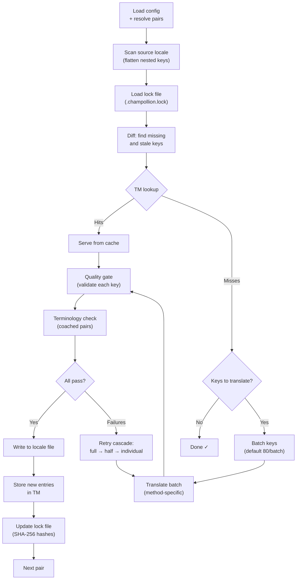

# วิธีการทำงานของ Sync

คำสั่ง `sync` คือการดำเนินการหลักของ champollion นี่คือสิ่งที่เกิดขึ้นเมื่อคุณรัน `npx champollion sync`

## ภาพรวมของ Pipeline



## ขั้นตอนโดยละเอียด

### 1. การโหลด Config

Champollion โหลด `champollion.config.json` (หรือตรวจจับการตั้งค่าอัตโนมัติ) โดยจะแก้ไข:
- โลแคลต้นทางและโลแคลเป้าหมาย
- กราฟคู่ (ว่าจะประมวลผลการรวมกันของ source→target ใดบ้าง)
- method, model และการตั้งค่าคุณภาพสำหรับแต่ละคู่

ก่อนสแกนไฟล์ champollion จะแสดง startup header:

```
champollion v0.1.0

[INFO] Detected format: json (auto)
[INFO] Detected framework: Hugo
```

- **Version banner**: แสดงเวอร์ชันที่ติดตั้งสำหรับการดีบักและรายงานปัญหา
- **Format detection**: รายงานรูปแบบไฟล์และระบุว่าถูกตรวจจับอัตโนมัติ `(auto)` หรือกำหนดค่าไว้อย่างชัดเจน `(config)` รองรับ `json`, `toml` และ `yaml`
- **Framework detection**: เมื่อตั้งค่า `contentDir` จะระบุ framework (`Hugo`) เพื่อยืนยันว่า content sync ทำงานอยู่

### 2. การสแกนต้นทาง

ไฟล์โลแคลต้นทางถูกโหลดและแปลงเป็น map แบบ key→value:

```json
// Input (nested)
{ "hero": { "title": "Welcome", "subtitle": "Build" } }

// Flattened
{ "hero.title": "Welcome", "hero.subtitle": "Build" }
```

### 3. การตรวจจับการเปลี่ยนแปลง

Champollion อ่าน `.champollion.lock` ซึ่งเก็บ SHA-256 hash ของค่าต้นทางที่แปลไปก่อนหน้านี้ สำหรับแต่ละ key จะตรวจสอบ:

| เงื่อนไข | การดำเนินการ |
|-----------|--------|
| Key ไม่มีในเป้าหมาย | **แปล** |
| Source hash เปลี่ยนแปลงนับตั้งแต่ sync ครั้งล่าสุด | **แปลใหม่** (ล้าสมัย) |
| ค่าเป้าหมายขึ้นต้นด้วย `[EN]` | **แปลใหม่** (legacy fallback marker) |
| Source hash ไม่เปลี่ยนแปลง, key มีอยู่แล้ว | **ข้าม** |

นี่คือเหตุผลที่ champollion แปลเฉพาะสิ่งที่เปลี่ยนแปลง — ไม่ได้แปลไฟล์ทั้งหมดใหม่ทุกครั้งที่ sync

### 4. การแบ่ง Batch

Key จะถูกจัดกลุ่มเป็น batch (ค่าเริ่มต้น: 80 key/batch สำหรับ LLM, 128 สำหรับ Google Translate) การแบ่ง batch ช่วยลดการเรียก API ในแต่ละรอบ ขณะที่ยังคง prompt ให้จัดการได้

ระหว่างการแปล champollion จะแสดง progress bar แบบ inline ที่อัปเดตหลังจากแต่ละ batch เสร็จสิ้น:

```
[INFO] fr.json — 2,847 missing
     ████████████████░░░░░░░░░░░░░░░░ 1,440/2,847 keys
```

Bar แสดงผลโดยใช้ `\r` carriage return สำหรับการอัปเดตในตำแหน่งเดิม — ไม่มีการเลื่อนหน้าจอ ถูกปิดใช้งานในโหมด `--quiet` และ `--json`

### 4b. Translation Memory

ก่อนการแบ่ง batch champollion จะตรวจสอบ Translation Memory cache (`.champollion/tm.json`) Key ที่มี source text + locale + method ตรงกับการแปลก่อนหน้าจะได้รับผลลัพธ์จาก cache ทันที — ไม่ต้องเรียก API

```
  [TM] 142 key(s) served from cache
  Translating 3 key(s) to French (llm)... [OK]
```

TM คือกลไกหลักในการประหยัดต้นทุน การรัน sync ใหม่หลังจากเปลี่ยนแปลง key เดียวจะแปลเฉพาะ key นั้น ไม่ใช่ทั้งไฟล์ ดูรายละเอียดได้ที่ [Translation Memory](/docs/concepts/translation-memory)

หากต้องการข้าม cache สำหรับการรันครั้งเดียว: `champollion sync --no-tm`

### 5. การแปล

แต่ละ batch จะถูกส่งไปยัง translation method ที่กำหนดค่าไว้:

- **`llm`**: Structured prompt ไปยัง OpenRouter พร้อมคำแนะนำ register และ gender guidance
- **`llm-coached`**: เหมือนกัน แต่มีการฉีด grammar rules, dictionary และ style notes เพิ่มเติม
- **`google-translate`**: Google Cloud Translation API v2 batch request
- **`api`**: HTTP POST ไปยัง remote endpoint

System message (register, gender guidance, rules) จะเหมือนกันในทุก batch สำหรับโลแคลที่กำหนด ทำให้เกิด **prompt caching** — provider อย่าง Anthropic และ Google จะ cache system message ที่ซ้ำกัน ช่วยลดต้นทุน token

### 6. Quality Gate

การแปลทุกรายการจะถูกตรวจสอบก่อนเขียนลงดิสก์ มีการตรวจสอบ 5 รายการ:

| การตรวจสอบ | สิ่งที่ตรวจจับ | ตัวอย่าง |
|-------|----------------|---------|
| **Empty/blank** | Model ไม่ส่งคืนผลลัพธ์ | `""` |
| **Source echo** | Model ส่งคืน input ภาษาอังกฤษ | `"Welcome"` สำหรับภาษาญี่ปุ่น |
| **Hallucination loop** | Trigram ที่ซ้ำกัน | `"Qo' Qo' Qo' Qo'"` |
| **Length inflation** | Output ยาวกว่า source 4 เท่าขึ้นไป | source 10 ตัวอักษร → output 50 ตัวอักษร |
| **Script compliance** | Script ไม่ถูกต้องสำหรับโลแคล | ข้อความ Latin สำหรับโลแคล Arabic |

ความล้มเหลวจะถูกบันทึกด้วย prefix `[GATE]` ไม่มี silent fallback

ดูรายละเอียดได้ที่ [Quality Gate](/docs/concepts/quality-gate)

### 6b. การตรวจสอบ Terminology

สำหรับคู่ที่มีการ coach พร้อม dictionary champollion จะตรวจสอบว่า LLM ใช้ terminology ที่กำหนดจริงหลังการแปล การละเมิดจะถูกบันทึกเป็นคำเตือน `[TERM]`:

```
[TERM] en→fr: 2 term violation(s)
  • "dashboard" → expected "tableau de bord" but got "panneau"
```

นี่คือคำเตือน ไม่ใช่ข้อผิดพลาดที่บล็อกการทำงาน — การแปลยังคงถูกเขียนลงไฟล์

### 7. Retry Cascade

เมื่อ JSON parse ล้มเหลวหรือเกิดข้อผิดพลาดระดับ batch champollion จะลองใหม่ด้วย batch ที่เล็กลงเรื่อยๆ:

```
Full batch (80 keys) → Failed
  └→ Half batch (40 keys) → 1 failure
      └→ Individual keys (1 each) → Isolates the problem key
```

งบประมาณการลองใหม่ถูกจำกัดโดย `maxRetries` (ค่าเริ่มต้น: 3) เพื่อป้องกันการใช้ token เกินควบคุม

### 8. การเขียนและ Lock

การแปลที่ผ่านการตรวจสอบจะถูกเขียนลงไฟล์โลแคลเป้าหมาย โดยรักษาโครงสร้าง nesting เดิมไว้ lock file จะถูกอัปเดตด้วย SHA-256 hash ใหม่

### 9. การตรวจสอบ

หลังจากประมวลผลทุกคู่แล้ว champollion จะอ่านไฟล์โลแคลที่เขียนไว้จากดิสก์อีกครั้งและรัน verification pass (เว้นแต่จะตั้งค่า `--no-verify`) ซึ่งช่วยตรวจจับช่องว่างระหว่างที่ sync รายงานว่าสำเร็จกับ key ที่ผิดพลาดจริงๆ:

- **Key parity** — source key ทั้งหมดมีอยู่ในแต่ละเป้าหมาย
- **`[EN]` fallback markers** — legacy marker จากการรันก่อนหน้า
- **Empty translations** — ค่าว่างที่หลุดผ่านมา
- **Script compliance** — โลแคลที่ไม่ใช่ Latin ที่มีการแปลเป็น ASCII เท่านั้น
- **Placeholder preservation** — ICU placeholder ตรงกับต้นทาง
- **Encoding issues** — BOM marker, invisible character

ฟีเจอร์นี้ยังมีให้ใช้เป็นคำสั่ง `champollion verify` แบบ standalone สำหรับ CI gate

## การแปลเนื้อหา (Phase 2)

สำหรับโปรเจกต์ Docusaurus และ Hugo `sync` จะรัน phase ที่สองหลังจากการแปล JSON key phase นี้จะแปลไฟล์ Markdown และ MDX (docs, blog post, tutorial) โดยใช้ method และ quality gate เดียวกัน

### วิธีการทำงาน

1. Champollion ค้นหาไฟล์เนื้อหาต้นทางทั้งหมด (`.md`, `.mdx`) โดยการ walk ผ่าน content/docs directory
2. สำหรับแต่ละคู่ไฟล์ × โลแคล จะตรวจสอบ content lock file แยกต่างหาก (`.champollion-content.lock`) สำหรับการเปลี่ยนแปลง SHA-256 hash
3. ไฟล์ที่เปลี่ยนแปลงหรือหายไปจะถูกรวบรวมเป็น work-item pool แบบ flat
4. Pool จะถูกประมวลผลด้วย **parallel concurrency** (ค่าเริ่มต้น: 12 API call พร้อมกัน)

```
Phase 2: content (79 translations to process, 341 skipped, concurrency: 48)

    [1/79] (1%)  docs/concepts/security.md → ja [RE-TRANSLATE] (~3328s left)
    [2/79] (3%)  docs/concepts/security.md → th [RE-TRANSLATE] (~1821s left)
    ...
    [79/79] (100%) blog/v3-2-quality.md → de [OK]

  [OK] Created 79 content file(s), 341 unchanged
```

### Parallelism

ทั้ง Phase 1 (JSON key) และ Phase 2 (เนื้อหา) ทำงานแบบ parallel:

- **Phase 1**: การแปลทุกโลแคลทำงานพร้อมกัน (ค่าเริ่มต้น: 50 โลแคลพร้อมกัน) ภายในแต่ละโลแคล API batch ก็ทำงานแบบ parallel ด้วย (4 batch พร้อมกัน) การ sync 12 โลแคลที่มี 120 key เสร็จสิ้นใน ~1 นาที แทนที่จะเป็น ~15 นาที
- **Phase 2**: การรวมกันของไฟล์ × โลแคลทั้งหมดจะถูกแปลเป็น flat pool (ค่าเริ่มต้น: 12 API call พร้อมกัน) ไฟล์ต่างๆ และโลแคลต่างๆ จะถูกแปลพร้อมกัน

ควบคุม parallelism ด้วย `--json-concurrency`, `--content-concurrency` หรือ `--concurrency` (ตั้งค่าทั้งคู่):

```bash
# Faster JSON sync (more parallel locale translations)
npx champollion sync --json-concurrency 30

# Faster content sync (more parallel API calls)
npx champollion sync --content-concurrency 20

# Slower (gentler on rate limits)
npx champollion sync --concurrency 4
```

### การป้องกันเนื้อหา

ระหว่างการแปล champollion จะป้องกันเนื้อหาที่ไม่ควรแปล:

- **Code block** (แบบ fenced และ indented) จะถูกแทนที่ด้วย placeholder
- ฟิลด์ **Frontmatter** ที่ไม่อยู่ในรายการ `translatableFields` จะถูกเก็บไว้ตามเดิม
- **Link**, image path และ HTML tag จะถูกป้องกัน
- **Shortcode** และตัวแปร interpolation (เช่น `{count}`, `{{.Params.title}}`) จะถูกป้องกัน

หลังการแปล placeholder ทั้งหมดจะถูกกู้คืนและตรวจสอบ หากมีรายการที่หายไปหรือเสียหาย การแปลจะถูกปฏิเสธและลองใหม่

## ความสำเร็จบางส่วน

batch ที่ล้มเหลวหนึ่งรายการไม่ได้บล็อก batch ที่เหลือ หาก 9 จาก 10 batch สำเร็จ ทั้ง 9 รายการจะถูกเขียนลงไฟล์ batch ที่ล้มเหลวจะถูกบันทึก และคุณสามารถรัน `sync` ใหม่เพื่อลองอีกครั้ง

## Dry Run

ดูตัวอย่างสิ่งที่จะเปลี่ยนแปลงโดยไม่เขียนไฟล์ใดๆ:

```bash
npx champollion sync --dry-run
```

## การบังคับแปลใหม่

บังคับให้ key ที่ระบุถูกแปลใหม่แม้ว่าจะไม่มีการเปลี่ยนแปลง:

```bash
npx champollion sync --force-keys "hero.title,nav.about"
```

## การประมาณต้นทุน

ก่อนการแปล champollion จะสร้าง **pre-sync cost report** ที่แสดงต้นทุนโดยประมาณต่อคู่ ซึ่งจะรันอัตโนมัติในทุกครั้งที่ `sync` — คุณจะเห็นก่อนที่จะมีการเรียก API ใดๆ

```
╔══════════════════════════════════════════════════════════╗
║  Cost Estimate                                          ║
╠════════════╦═══════╦════════════╦════════════════════════╣
║ Pair       ║ Keys  ║ Est. Cost  ║ Method                 ║
╠════════════╬═══════╬════════════╬════════════════════════╣
║ en → fr    ║   142 ║ $0.07      ║ google-translate       ║
║ en → ja    ║    38 ║   —        ║ llm (model-dependent)  ║
║ en → crk   ║    38 ║   —        ║ llm-coached            ║
╚════════════╩═══════╩════════════╩════════════════════════╝
```

### สิ่งที่ถูกประมาณ

แต่ละ translation method มีการประมาณต้นทุนของตัวเอง:

| Method | พื้นฐานต้นทุน | ความแม่นยำ |
|--------|-----------|-----------|
| `google-translate` | อัตราที่ Google เผยแพร่ ($20/ล้านตัวอักษร) | แม่นยำ |
| `llm` | แตกต่างตาม OpenRouter model | ขึ้นอยู่กับ model — ตรวจสอบ [ราคา OpenRouter](https://openrouter.ai/models) |
| `llm-coached` | เหมือนกับ `llm` บวก coaching context token | ขึ้นอยู่กับ model |
| `api` | กำหนดโดย server | ไม่ทราบ — ไม่สามารถประมาณได้โดยไม่ query endpoint |

เมื่อ method ไม่สามารถระบุต้นทุนได้ (LLM method, remote API) champollion จะรายงาน `—` แทนการเดา ใช้ `--dry` เพื่อดูการประมาณต้นทุนโดยไม่ต้องแปลจริง

---

## ดูเพิ่มเติม

- [CLI Reference — sync](/docs/reference/cli#sync) — flag และ option ของคำสั่ง
- [Translation Memory](/docs/concepts/translation-memory) — การ cache และการประหยัดต้นทุน
- [Quality Gate](/docs/concepts/quality-gate) — วิธีการตรวจสอบการแปล
- [Translation Methods](/docs/guides/translation-methods) — วิธีการทำงานของแต่ละ method
- [การทำงานร่วมกับนักแปลมืออาชีพ](/docs/guides/professional-translators) — XLIFF workflow
- [Configuration](/docs/getting-started/configuration) — เอกสารอ้างอิง config
- [CI/CD Guide](/docs/guides/ci-cd) — การทำ sync อัตโนมัติใน pipeline ของคุณ
