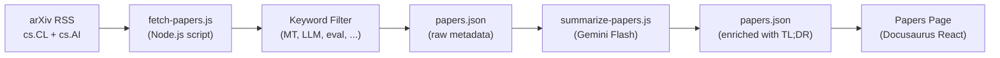

# ฟีดบทความวิจัย

Champollion ดูแลฟีดบทความวิจัยด้านการแปลด้วยเครื่องและ NLP จาก arXiv ที่ผ่านการคัดกรองและสรุปสำหรับผู้ปฏิบัติงาน ฟีดนี้ทำงานแบบกึ่งอัตโนมัติ: บทความจะถูกดึงข้อมูลและกรองทุกวัน สรุปด้วย AI และเผยแพร่ขึ้นเว็บไซต์

## เหตุผลที่มีอยู่

pipeline การแปลของ champollion สร้างขึ้นบนเทคนิคจากงานวิจัยที่ตีพิมพ์ ได้แก่ register-steered prompting, coaching data injection, context rollover และ quality gates ฟีด Papers มีวัตถุประสงค์สามประการ:

1. **ความโปร่งใส**: ผู้ใช้สามารถดูงานวิจัยที่รองรับแต่ละฟีเจอร์ได้
2. **การค้นพบ**: เทคนิคใหม่ที่ตีพิมพ์บน arXiv อาจนำไปสู่ฟีเจอร์ในอนาคตหรือการกำหนดค่าของผู้ใช้
3. **ชุมชน**: วางตำแหน่ง champollion ในฐานะเครื่องมือที่อิงงานวิจัย ไม่ใช่เพียง API wrapper อีกตัวหนึ่ง

## สถาปัตยกรรม



### ขั้นตอน Pipeline

#### 1. ดึงข้อมูล (รายวัน)

`scripts/fetch-papers.js` สืบค้น arXiv Atom API สำหรับบทความล่าสุดใน:
- `cs.CL` (Computation and Language)
- `cs.AI` (Artificial Intelligence)

ผลลัพธ์ที่ได้: ชื่อเรื่อง, ผู้แต่ง, บทคัดย่อ, arXiv ID, ลิงก์ PDF, วันที่เผยแพร่, หมวดหมู่

#### 2. กรอง

บทความจะถูกกรองตามความเกี่ยวข้องของคำสำคัญ บทความต้องตรงกับคำสำคัญหลักอย่างน้อยหนึ่งคำ:

**คำสำคัญหลัก** (ต้องตรง ≥1 คำ):
- `machine translation`, `neural machine translation`, `NMT`
- `LLM`, `large language model`
- `multilingual`, `cross-lingual`
- `document-level translation`
- `low-resource language`, `endangered language`
- `translation evaluation`, `BLEU`, `COMET`, `chrF`
- `tokenization`, `morphology`, `polysynthetic`
- `context window`, `sliding window`
- `prompt engineering` (ในบริบทการแปล)

**คำสำคัญเสริม** (เพิ่มคะแนนความเกี่ยวข้อง):
- `i18n`, `internationalization`, `localization`
- `few-shot`, `in-context learning`
- `terminology`, `glossary`, `consistency`
- `quality estimation`, `hallucination`

#### 3. สรุป (ด้วยความช่วยเหลือของ AI)

`scripts/summarize-papers.js` ประมวลผลบทความใหม่ (ที่ยังไม่ได้สรุป):

สำหรับแต่ละบทความ จะส่งบทคัดย่อไปยัง Gemini 3.5 Flash พร้อมกับ:
```
Read this ML research abstract and produce:
1. A 2-sentence TL;DR accessible to a software developer (not a researcher)
2. A single bullet: "Why this matters for MT" — how could this technique
   improve machine translation quality, cost, or speed in production?

Abstract: {abstract}
```

ผลลัพธ์จะถูกเก็บกลับใน `papers.json` ควบคู่กับ metadata ดิบ

#### 4. เผยแพร่

หน้า Papers ของ Docusaurus (`website/src/pages/papers.js`) แสดงผล `papers.json` เป็นตารางการ์ดที่กรองและแบ่งหน้าได้

แต่ละการ์ดแสดง:
- **ชื่อเรื่อง** (ลิงก์ไปยัง arXiv)
- **ผู้แต่ง** (3 คนแรก + "et al.")
- **วันที่** (วันที่เผยแพร่หรืออัปเดตล่าสุด)
- **TL;DR** (สร้างโดย AI)
- **เหตุผลที่สำคัญ** (สร้างโดย AI)
- **หมวดหมู่** (แท็ก arXiv)
- **ลิงก์ PDF**

### ระบบอัตโนมัติ

GitHub Actions workflow รัน pipeline ทุกวัน:

```yaml title=".github/workflows/fetch-papers.yml"
name: Fetch MT Research Papers
on:
  schedule:
    - cron: '0 6 * * *'  # 06:00 UTC daily
  workflow_dispatch: {}   # Manual trigger

jobs:
  fetch:
    runs-on: ubuntu-latest
    steps:
      - uses: actions/checkout@v4
      - uses: actions/setup-node@v4
        with:
          node-version: 20
      - run: node scripts/fetch-papers.js
      - run: node scripts/summarize-papers.js
        env:
          GEMINI_API_KEY: ${{ secrets.GEMINI_API_KEY }}
      - name: Commit if changed
        run: |
          git config user.name "github-actions[bot]"
          git config user.email "github-actions[bot]@users.noreply.github.com"
          git add website/src/data/papers.json
          git diff --cached --quiet || git commit -m "chore: update research papers feed"
          git push
```

## Schema ข้อมูล

```typescript
interface Paper {
  id: string;           // arXiv ID (e.g., "2406.12345")
  title: string;
  authors: string[];
  abstract: string;
  published: string;    // ISO date
  updated: string;      // ISO date
  pdfUrl: string;
  categories: string[];
  primaryCategory: string;

  // Computed by filter
  relevanceScore: number;
  matchedKeywords: string[];

  // Computed by summarizer (null until processed)
  tldr: string | null;
  whyItMatters: string | null;
  summarizedAt: string | null;
}
```

## ตำแหน่งไฟล์

| ไฟล์ | วัตถุประสงค์ |
|------|---------|
| `scripts/fetch-papers.js` | ตัวดึงข้อมูล arXiv RSS และตัวกรองคำสำคัญ |
| `scripts/summarize-papers.js` | การสรุปด้วย AI ผ่าน Gemini |
| `website/src/data/papers.json` | ข้อมูลบทความ (commit ลงใน repo) |
| `website/src/pages/papers.js` | คอมโพเนนต์หน้า Docusaurus |
| `website/src/pages/papers.module.css` | สไตล์ของหน้า |
| `.github/workflows/fetch-papers.yml` | ระบบอัตโนมัติรายวัน |

## สถานะการพัฒนา

| ฟีเจอร์ | สถานะ |
|---------|--------|
| `fetch-papers.js` (arXiv fetch + filter) | 🔲 วางแผนไว้ |
| `summarize-papers.js` (AI summary) | 🔲 วางแผนไว้ |
| หน้า Papers (React component) | 🔲 วางแผนไว้ |
| GitHub Actions workflow | 🔲 วางแผนไว้ |
| การกรองตามหมวดหมู่/คำสำคัญบนหน้า | 🔲 วางแผนไว้ |
| การแบ่งหน้า | 🔲 วางแผนไว้ |

## ดูเพิ่มเติม

- [สถาปัตยกรรม](/docs/concepts/architecture) — ความสัมพันธ์ระหว่างคอมโพเนนต์ต่าง ๆ ของ champollion
- [Context Rollover](/docs/concepts/context-rollover) — ฟีเจอร์ที่ได้รับแรงบันดาลใจโดยตรงจากฟีดวิจัยนี้
