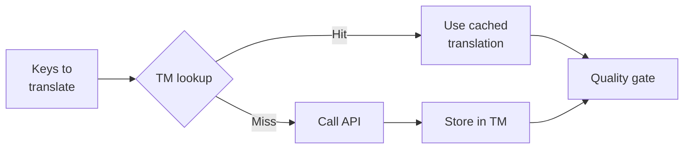

# Translation Memory

Translation Memory (TM) คือเลเยอร์แคชที่ติดมากับ champollion โดยค่าเริ่มต้น ระบบจะจัดเก็บการแปลทุกรายการโดยใช้ข้อความต้นฉบับ + locale + วิธีการแปลเป็น key ดังนั้นการรัน `sync` ซ้ำจะเรียก API เฉพาะ key ที่มีการเปลี่ยนแปลงจริงเท่านั้น

## เหตุผลที่มี TM

หากไม่มี TM ทุกครั้งที่รัน `sync` จะแปล key ที่ถูกแก้ไขทุกรายการใหม่ทั้งหมด — แม้ว่าคุณจะเคยแปลข้อความภาษาอังกฤษเดิมนั้นสำหรับ locale เดียวกันในการรันครั้งก่อนแล้วก็ตาม สถานการณ์ทั่วไปที่ทำให้สิ้นเปลืองค่าใช้จ่ายโดยไม่จำเป็น:

| สถานการณ์ | ไม่มี TM | มี TM |
|----------|-----------|---------|
| รัน sync ซ้ำหลังเปลี่ยน 1 key (500 keys × 10 locales) | 5,000 API calls | 10 API calls |
| ย้อนกลับ key ไปยังค่าภาษาอังกฤษก่อนหน้า | เรียก API เต็มรูปแบบ | ดึงจากแคชได้ทันที |
| วลีเดียวกันปรากฏใน 3 locale files | 3 × API calls | 1 API call + 2 cache hits |
| Dry-run → sync จริง | เรียก API เต็มรูปแบบทั้งสองครั้ง | รันแรกแคชไว้ รันที่สองนำมาใช้ซ้ำ |

TM **เปิดใช้งานโดยค่าเริ่มต้น** และไม่ต้องกำหนดค่าใดๆ เพิ่มเติม การแปลจะถูกแคชโดยอัตโนมัติในทุกครั้งที่รัน `sync` และนำมาใช้ในการรันครั้งถัดไป

## วิธีการทำงาน

### Cache Key

แต่ละรายการใน TM ใช้ SHA-256 hash ของค่าสามอย่างเป็น key:

```
SHA-256( sourceValue + '\x00' + locale + '\x00' + method )
```

| องค์ประกอบ | เหตุผลที่รวมอยู่ใน key |
|-----------|-------------------|
| `sourceValue` | ข้อความภาษาอังกฤษต่างกัน → การแปลต่างกัน |
| `locale` | "Hello" แปลเป็นภาษาฝรั่งเศสกับภาษาญี่ปุ่นได้ต่างกัน |
| `method` | ผลลัพธ์จาก Google Translate ≠ ผลลัพธ์จาก GPT-4o |

ตัวคั่น null byte (`\x00`) ป้องกันการชนกันระหว่าง `"ab" + "c"` และ `"a" + "bc"`

### ระหว่างการ Sync



1. ก่อนเรียก translation API champollion จะแบ่ง key ออกเป็น **TM hits** และ **TM misses**
2. Hits จะถูกดึงจากแคชทันที — ไม่มีการเรียก API ไม่มี latency ไม่มีค่าใช้จ่าย
3. Misses จะผ่านกระบวนการแปลตามปกติ
4. การแปลใหม่จาก API จะถูกจัดเก็บใน TM สำหรับการรันครั้งต่อไป
5. การแปลทั้งหมด (จากแคชและใหม่) จะผ่าน quality gate

### การจัดเก็บ

TM ถูกจัดเก็บที่ `.champollion/tm.json` ในไดเรกทอรีรากของโปรเจกต์ ไฟล์ใช้ JSON แบบกระชับ (ไม่มีการจัดรูปแบบ) เพื่อควบคุมขนาดไฟล์ แต่ละรายการจัดเก็บ:

| ฟิลด์ | คำอธิบาย |
|-------|-------------|
| `t` | ข้อความที่แปลแล้ว |
| `ts` | timestamp รูปแบบ ISO-8601 ของเวลาที่แคชไว้ |
| `l` | รหัส locale เป้าหมาย (สำหรับสถิติ/การกรอง) |
| `m` | ชื่อวิธีการแปล (สำหรับสถิติ/การกรอง) |

ที่ 50 ภาษา × 500 keys = 25,000 รายการ ขนาดไฟล์ควรอยู่ที่ประมาณ 2-3 MB

## การจัดการแคช

### ดูสถิติ

```bash
champollion tm stats
```

แสดงจำนวนรายการ ขนาดไฟล์ และรายละเอียดแยกตาม locale:

```
  Translation Memory — .champollion/tm.json

  Entries:      2,847
  File size:    1.2 MB
  Created:      2026-05-20
  Last entry:   2026-05-24

  By locale:
    fr       482 entries  (llm: 380, llm-coached: 102)
    de       471 entries  (llm: 471)
    ja       465 entries  (llm: 465)
```

### ล้างแคช

```bash
# Clear everything (with confirmation prompt)
champollion tm clear

# Clear without prompt (CI environments)
champollion tm clear --yes

# Clear only one locale
champollion tm clear --locale fr
```

### ข้าม TM สำหรับการรันครั้งเดียว

```bash
# Force fresh API calls for all keys (useful when switching providers)
champollion sync --no-tm
```

การดำเนินการนี้ไม่ได้ลบแคช — เพียงแต่ไม่นำแคชมาใช้ในการรันครั้งนี้ และไม่จัดเก็บผลลัพธ์ใหม่

## เมื่อ TM ไม่ช่วยอะไร

TM จะไม่พบ cache hit เมื่อ:

- **ข้อความต้นฉบับเปลี่ยนแปลง** — hash เปลี่ยน จึงเป็น miss
- **วิธีการแปลเปลี่ยน** — การสลับจาก `llm` ไปเป็น `google-translate` หมายความว่า cache key ต่างกัน
- **การรันครั้งแรก** — cold start ยังไม่มีรายการในแคช
- **flag `--no-tm`** — ข้ามแคชโดยตรง

## ควร commit `.champollion/tm.json` หรือไม่?

**โดยทั่วไปไม่ควร** TM เป็นการปรับแต่งสำหรับนักพัฒนาในเครื่องท้องถิ่น ระบบจะสร้างขึ้นโดยอัตโนมัติระหว่างการ sync และมีประโยชน์เฉพาะเมื่อรัน sync ซ้ำบนเครื่องเดิม อย่างไรก็ตาม คุณอาจพิจารณา commit ไว้หากต้องการ:

- ทีมของคุณใช้ CI runner เดียวร่วมกันสำหรับ sync การแปล
- ต้องการ build ที่ได้ผลลัพธ์เหมือนเดิมโดยไม่ต้องเรียก API
- กำลังเก็บถาวรการแปลเพื่อวัตถุประสงค์ด้านการปฏิบัติตามข้อกำหนด

เพิ่ม `.champollion/tm.json` ลงใน `.gitignore` สำหรับการใช้งานทั่วไป

---

## ดูเพิ่มเติม

- [วิธีการทำงานของ Sync](/docs/concepts/how-sync-works) — ตำแหน่งของ TM ในกระบวนการ pipeline
- [CLI Reference — tm](/docs/reference/cli#tm) — เอกสารอ้างอิงคำสั่ง
- [CLI Reference — sync --no-tm](/docs/reference/cli#sync) — การข้าม TM
