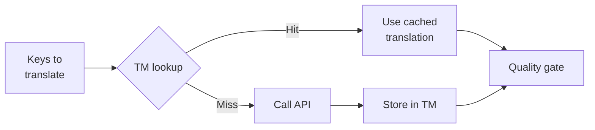

# Translation Memory

Translation Memory (TM) คือเลเยอร์แคชที่ติดมากับ champollion โดยค่าเริ่มต้น ระบบจะจัดเก็บการแปลทุกรายการโดยใช้ข้อความต้นฉบับ + locale + วิธีการแปลเป็น key ดังนั้นการรัน `sync` ซ้ำจะเรียก API เฉพาะ key ที่มีการเปลี่ยนแปลงจริงเท่านั้น

## เหตุผลที่มี TM

หากไม่มี TM ทุกครั้งที่รัน `sync` จะแปล key ที่ถูกแก้ไขทุกรายการใหม่ทั้งหมด — แม้ว่าคุณจะเคยแปลข้อความภาษาอังกฤษเดิมนั้นสำหรับ locale เดียวกันในการรันครั้งก่อนแล้วก็ตาม สถานการณ์ทั่วไปที่ทำให้สิ้นเปลืองค่าใช้จ่ายโดยไม่จำเป็น:

| สถานการณ์ | ไม่มี TM | มี TM |
|----------|-----------|---------|
| รัน sync ซ้ำหลังเปลี่ยน 1 key (500 keys × 10 locales) | 5,000 API calls | 10 API calls |
| ย้อนกลับ key ไปยังค่าภาษาอังกฤษก่อนหน้า | เรียก API เต็มรูปแบบ | ดึงจากแคชได้ทันที |
| วลีเดียวกันปรากฏใน 3 locale files | 3 × API calls | 1 API call + 2 cache hits |
| Dry-run → sync จริง | เรียก API เต็มรูปแบบทั้งสองครั้ง | รันแรกแคชไว้ รันที่สองนำมาใช้ซ้ำ |

TM **เปิดใช้งานโดยค่าเริ่มต้น** และไม่ต้องกำหนดค่าใดๆ เพิ่มเติม การแปลจะถูกแคชโดยอัตโนมัติในทุกครั้งที่รัน `sync` และนำมาใช้ในการรันครั้งถัดไป

## วิธีการทำงาน

### Cache Key

แต่ละรายการใน TM ใช้ SHA-256 hash ของค่าสามอย่างเป็น key:

```
SHA-256( sourceValue + '\x00' + locale + '\x00' + method )
```

| องค์ประกอบ | เหตุผลที่รวมอยู่ใน key |
|-----------|-------------------|
| `sourceValue` | ข้อความภาษาอังกฤษต่างกัน → การแปลต่างกัน |
| `locale` | "Hello" แปลเป็นภาษาฝรั่งเศสกับภาษาญี่ปุ่นได้ต่างกัน |
| `method` | ผลลัพธ์จาก Google Translate ≠ ผลลัพธ์จาก GPT-4o |

ตัวคั่น null byte (`\x00`) ป้องกันการชนกันระหว่าง `"ab" + "c"` และ `"a" + "bc"`

`sourceValue` คือข้อความที่คีย์นั้นถูกแปลมา พร้อมกับข้อมูลอื่นๆ ที่ใช้แยกข้อความที่เหมือนกันสองข้อความออกจากกันรวมอยู่ด้วย:

- **gettext context** รายการที่มี `msgctxt` จะถูกแคชไว้พร้อมกับบริบท (context): "Open" ที่เป็นคำกริยาและ "Open" ที่เป็นคำคุณศัพท์จะถูกแยกเป็นสองรายการ
- **รูปแบบพหูพจน์ที่ต้นทางไม่มี** i18next จะจัดเก็บพหูพจน์เป็นคีย์ที่มีคำต่อท้าย (suffix) และภาษาเป้าหมายอาจมีรูปแบบที่ภาษาต้นทางไม่มี: ภาษาฝรั่งเศสและสเปนเพิ่ม `count_many` ซึ่งแปลมาจากข้อความ `count_other` ของภาษาอังกฤษ คีย์ทั้งสองส่งข้อความเดียวกัน แต่โมเดลจะได้รับการร้องขอรูปแบบที่ต่างกัน (`"2 recettes"` และ `"1 000 000 de recettes"`) ดังนั้นแต่ละคีย์จึงได้รายการของตัวเอง: `count_other` จะเก็บแบบทั่วไป และ `count_many` จะถูกแคชไว้ใต้ข้อความบวกกับรูปแบบของมัน หลักการเดียวกันนี้ใช้กับทุกรูปแบบที่แปลจากข้อความของหมวดหมู่อื่น (ภาษาอาหรับ `_zero`, `_two`, `_few`, `_many`; ภาษารัสเซีย `_few`, `_many`; รูปแบบลำดับที่)
- **gettext `msgid_plural` และพหูพจน์แบบ ARB / ICU** เป็นข้อความเดียวต่อหนึ่งคีย์ (รวมทุกรูปแบบไว้ในค่าเดียว) ดังนั้นจึงนับเป็นหนึ่งรายการเช่นเดิม

ก่อนเวอร์ชัน 0.4.0 รูปแบบที่ยืมมา (borrowed form) จะใช้รายการร่วมกับรูปแบบที่มันแปลมา และรายการนั้นจะเก็บคำตอบใดก็ตามที่ถูกบันทึกล่าสุด ดังนั้น `--redo all` อาจเขียนรูปแบบเดียวลงในทั้งสองคีย์ แคชจากช่วงเวลานั้นจะได้รับการซ่อมแซมขณะใช้งาน เมื่อรายการที่ใช้ร่วมกันเก็บข้อความของรูปแบบที่ยืมมา มันจะถูกย้ายไปยังรายการของรูปแบบนั้นเอง และอีกรูปแบบจะถูกแปลใหม่อีกครั้งในครั้งต่อไปที่เข้าคิว มิฉะนั้น รายการจะยังคงอยู่กับรูปแบบที่มันยืมมา และรูปแบบที่ยืมมาจะถูกส่งไปยังโมเดลหนึ่งครั้งในครั้งแรกที่เข้าคิว (การรันจะแจ้งให้ทราบ) `champollion verify` จะเตือนเมื่อรูปแบบที่ยืมมามีข้อความเหมือนกับรูปแบบที่มันยืมมาทุกประการ และแคชไม่ได้แสดงว่าโมเดลเป็นผู้เขียนเช่นนั้น บางภาษาอาจเขียนทั้งสองรูปแบบเหมือนกันจริงๆ ดังนั้นนี่จึงเป็นเพียงคำเตือน `--redo keys:<key>` จะส่งคำขอถามอีกครั้ง

### ระหว่างการ Sync


```mermaid
flowchart LR
    A["Keys to\ntranslate"] --> B{"TM lookup"}
    B -->|Hit| C["Use cached\ntranslation"]
    B -->|Miss| D["Call API"]
    D --> E["Store in TM"]
    C --> F["Quality gate"]
    E --> F
```

1. ก่อนเรียก translation API champollion จะแบ่ง key ออกเป็น **TM hits** และ **TM misses**
2. Hits จะถูกดึงจากแคชทันที — ไม่มีการเรียก API ไม่มี latency ไม่มีค่าใช้จ่าย
3. Misses จะผ่านกระบวนการแปลตามปกติ
4. การแปลใหม่จาก API จะถูกจัดเก็บใน TM สำหรับการรันครั้งต่อไป
5. การแปลทั้งหมด (จากแคชและใหม่) จะผ่าน quality gate

### การจัดเก็บ

TM ถูกจัดเก็บที่ `.champollion/tm.json` ในไดเรกทอรีรากของโปรเจกต์ ไฟล์ใช้ JSON แบบกระชับ (ไม่มีการจัดรูปแบบ) เพื่อควบคุมขนาดไฟล์ แต่ละรายการจัดเก็บ:

| ฟิลด์ | คำอธิบาย |
|-------|-------------|
| `t` | ข้อความที่แปลแล้ว |
| `ts` | timestamp รูปแบบ ISO-8601 ของเวลาที่แคชไว้ |
| `l` | รหัส locale เป้าหมาย (สำหรับสถิติ/การกรอง) |
| `m` | ชื่อวิธีการแปล (สำหรับสถิติ/การกรอง) |

ที่ 50 ภาษา × 500 keys = 25,000 รายการ ขนาดไฟล์ควรอยู่ที่ประมาณ 2-3 MB

## การจัดการแคช

### ดูสถิติ

```bash
champollion tm stats
```

แสดงจำนวนรายการ ขนาดไฟล์ และรายละเอียดแยกตาม locale:

```
  Translation Memory — .champollion/tm.json

  Entries:      2,847
  File size:    1.2 MB
  Created:      2026-05-20 09:14 MDT
  Last entry:   2026-05-24 17:52 MDT

  By locale:
    fr       482 entries
               380  llm · model google/gemini-3.8-flash · register formal-vous
               102  llm-coached · model google/gemini-3.8-flash · register formal-vous · coaching 3f2a9c1b
    de       471 entries
               471  llm · model google/gemini-3.8-flash · register formal-Sie
    ja       465 entries
               465  llm · model google/gemini-3.8-flash · register polite
```

วันที่ระบุเป็นเวลาท้องถิ่นของเครื่องนี้ พร้อมระบุชื่อไทม์โซน (`--json`
ยังเก็บการประทับเวลา UTC เป็น `createdAt` และ `lastEntryAt` ด้วย)
แต่ละบรรทัดภายใต้ภาษาท้องถิ่น (locale) คือสิ่งที่สร้างรายการเหล่านั้นขึ้นมา: เมธอด โมเดล และ
ระดับภาษา (register) (รวมถึงลายนิ้วมือดิจิทัลของข้อความโค้ชชิ่ง สำหรับทุกเมธอดที่
พรอมต์มีข้อความดังกล่าว: `llm`, `local`, `openai`, `anthropic`, `gemini`,
`llm-coached`; โดยจะอ่าน `coachingFile` ของคู่ภาษา ของภาษา หรือของ fallback สำหรับสิ่งนี้
และจะนับจากเนื้อหาข้อความ ไม่ใช่เส้นทางไฟล์) การมีสอง
โมเดลภายใต้ภาษาท้องถิ่นเดียวมักหมายถึงมีการเปลี่ยนโมเดล โดย `champollion status`
จะระบุว่าไฟล์ภาษาท้องถิ่นเหล่านั้นมีการผสมข้อความจากทั้งสองโมเดลอยู่ในขณะนี้หรือไม่

### ล้างแคช

```bash
# Clear everything (with confirmation prompt)
champollion tm clear

# Clear without prompt (CI environments)
champollion tm clear --yes

# Clear only one locale
champollion tm clear --locale fr
```

### ข้าม TM สำหรับการรันครั้งเดียว

```bash
# Fresh API calls for everything queued (useful when debugging quality)
champollion sync --redo all --fresh     # --fresh = --no-tm
```

การดำเนินการนี้จะไม่ลบแคชและจะไม่อ่านแคชในการรันครั้งนี้ — แต่สิ่งที่การรันแปล (และมีค่าใช้จ่าย) จะยังคงถูกจัดเก็บไว้ ดังนั้นการรันครั้งถัดไปจะใช้แคชได้อีกครั้ง

## การสลับโมเดล

**วิธีสลับโมเดล** โมเดลเป็นการตั้งค่าใน `champollion.config.json`: แก้ไข `"model"` (และ `"defaultMethod"` เมื่อมีการเปลี่ยนเมธอดด้วย) หรือ `"model"` เฉพาะของคู่ภาษาใน `"pairs"` การรัน `champollion sync` ครั้งต่อไปจะนำไปใช้

`sync --model <name>` (และ `--method <name>`) เป็นการระบุโมเดลสำหรับ**การรันเพียงครั้งเดียว**: ไฟล์การตั้งค่าจะไม่ถูกเปลี่ยนแปลง คำสั่ง sync จะแจ้งเตือนสิ่งนี้ และคำสั่ง `sync` แบบปกติครั้งถัดไปจะกลับไปใช้โมเดลที่กำหนดค่าไว้ตามเดิม สิ่งที่การรันครั้งนั้นแปลไว้จะยังคงอยู่ในไฟล์ หลังจากนั้นการรัน sync ตามปกติจะระบุว่าคำแปลใดบ้างที่เขียนโดยอีกโมเดลหนึ่ง พร้อมเสนอทางเลือกสองทาง: เก็บคำแปลเหล่านั้นไว้โดยตั้งค่าให้โมเดลนั้นเป็นโมเดลที่กำหนดค่าไว้ (ตั้งค่า `"model"` เป็นโมเดลนั้น — ไม่มีการส่งคำขอแปลใดๆ) หรือให้โมเดลที่กำหนดค่าไว้แปลคำแปลเหล่านั้นใหม่ (คำสั่ง redo ที่แสดงออกมาพร้อมราคาประเมิน) `champollion status` ก็จะแสดงข้อความเดียวกันนี้ คุณไม่จำเป็นต้องรัน `champollion init` ซ้ำเพื่อสลับโมเดล เพราะ `init --force` จะเขียนทับเฉพาะสิ่งที่แฟล็กระบุ และคงการตั้งค่าอื่นๆ ทั้งหมดไว้ ([CLI Reference](/docs/reference/cli#init))

การเปลี่ยนโมเดลจะไม่ทิ้งแคชของคุณ เมื่อสตริงไม่มีรายการภายใต้โมเดลใหม่ คำสั่ง sync จะนำคำแปลที่สร้างขึ้นภายใต้โมเดลก่อนหน้ามาใช้ซ้ำ ตราบใดที่เมธอด ระดับภาษา และโค้ชชิ่งยังคงเหมือนเดิม รายการที่นำมาใช้ซ้ำจะผ่านการตรวจสอบคุณภาพเช่นเดียวกับการดึงข้อมูลจากแคช (cache hit) ทั่วไป ก่อนแสดงการประเมินค่าใช้จ่าย sync จะแจ้งจำนวนคำแปลที่จะนำมาใช้ซ้ำและโมเดลที่แปลข้อความเหล่านั้น — การรันแบบ dry run ก็เช่นกัน และหลังจากสลับโมเดลเสร็จสมบูรณ์แล้ว: สตริงที่ถูกย้อนกลับไปเป็นข้อความที่มีเฉพาะโมเดลก่อนหน้าเคยแปลไว้ ก็จะได้รับคำแปลของโมเดลนั้น และการรันจะแจ้งให้ทราบก่อนการประเมินค่าใช้จ่าย

หากต้องการให้โมเดลใหม่เป็นผู้แปลแทน (ระบบจะส่งคีย์ที่โมเดลก่อนหน้าเคยแปลไปให้แปลใหม่ ส่วนสิ่งที่โมเดลใหม่เคยแปลไว้แล้วจะยังคงดึงมาจากแคช):

```bash
champollion sync --redo all --fresh-on-model-change
```

โดยตัวมันเองแล้ว `--fresh-on-model-change` จะส่งผลเฉพาะกับคีย์ที่การรันต้องแปลอยู่แล้ว (คีย์ใหม่หรือคีย์ที่มีการเปลี่ยนแปลง) หลังจากการแปลใหม่ทั้งหมดเสร็จสิ้น sync จะหยุดแจ้งเตือนการเปลี่ยนโมเดลสำหรับภาษานั้น คีย์ที่คำตอบจากโมเดลใหม่ไม่ผ่านการตรวจสอบจะถูกบันทึกเป็น **pending** (รอดำเนินการ) ใน `.champollion.lock`: การรัน `champollion sync` ครั้งถัดไปจะส่งคำขอไปยังโมเดลใหม่อีกครั้งสำหรับคีย์เหล่านั้น (ไม่ดึงจากแคช) และการสลับโมเดลจะเสร็จสมบูรณ์เมื่อคีย์เหล่านั้นแปลเสร็จ `champollion status` จะแสดงรายการคีย์ที่รอดำเนินการ และแจ้งเตือนเมื่อไฟล์มีข้อความจากโมเดลก่อนหน้า — ไม่ว่าจะปะปนกับโมเดลปัจจุบัน หรือเป็นข้อความจากโมเดลก่อนหน้าทั้งหมด ([Quality Gate](/docs/concepts/quality-gate#a-redo-that-could-not-finish))
ระบบทราบว่าโมเดลใดเป็นผู้เขียนแต่ละค่าเนื่องจาก sync บันทึกไว้ใน `.champollion.lock` (โมเดลที่ตอบกลับ หรือโมเดลที่ดึงคำแปลจากแคชมาใช้) สำหรับค่าที่เขียนขึ้นก่อนเวอร์ชัน 0.4.0 ระบบจะตรวจสอบย้อนกลับไปยังแคช และระบุว่า "model unknown" เมื่อมีสองโมเดลแคชข้อความเดียวกันไว้ การรัน `champollion sync` ปกติโดยไม่มีอะไรให้แปลจะแจ้งหนึ่งบรรทัดต่อหนึ่งภาษาเมื่อไฟล์ถูกเขียนโดยโมเดลอื่นที่ไม่ใช่โมเดลที่กำหนดค่าไว้ พร้อมแสดงคำสั่งด้านบน
การสั่ง redo จำนวนมาก (bulk redo) จะไม่แทนที่คำแปลที่มีบุคคลแก้ไขในไฟล์โดยตรงเด็ดขาด ([Editing translations](/docs/guides/professional-translators#editing-key-value-files))

การเปลี่ยนเมธอด ระดับภาษา หรือโค้ชชิ่ง จะยังคงสร้างคำแปลใหม่เสมอ เนื่องจากความเปลี่ยนแปลงเหล่านี้มีไว้เพื่อให้ได้ข้อความที่แตกต่างออกไป เมื่อคีย์ถูกส่งไปยังโมเดลแม้ว่าแคชจะมีคำแปลของข้อความเดียวกันที่สร้างขึ้นด้วยวิธีอื่นอยู่แล้ว (เช่น หลังจากการสลับ `local` → `llm`) sync จะแจ้งเตือนหนึ่งครั้งต่อภาษา โดยระบุสิ่งที่สร้างคำแปลเหล่านั้นขึ้นมา — นั่นคือเหตุผลที่การรันแสดงว่าไม่มีสิ่งใดที่ดึงมาจากแคช

การเปลี่ยนเมธอด ระดับภาษา หรือโค้ชชิ่ง จะไม่แปลสิ่งใดใหม่โดยอัตโนมัติ: การรัน sync ปกติ (หรือ dry run) ที่ไม่มีเนื้อหาใหม่ให้แปลจะคงไฟล์ไว้เช่นเดิม และจะแจ้งข้อมูลแยกตามภาษา: มีจำนวนกี่ค่าที่เขียนขึ้นด้วยเมธอดอื่น คำสั่ง redo ที่ใช้แทนที่ค่าเหล่านั้น (`champollion sync --pair en:fr --redo all`) และค่าใช้จ่ายโดยประมาณ

## เมื่อ TM ไม่ช่วยอะไร

TM จะไม่พบ cache hit เมื่อ:

- **ข้อความต้นทางเปลี่ยนไป** — ค่าแฮชเปลี่ยนไป จึงไม่พบในแคช (miss)
- **เมธอดเปลี่ยนไป** — การสลับจาก `llm` ไปเป็น `google-translate` ส่งผลให้คีย์ของแคชต่างกัน
- **ระดับภาษาหรือโค้ชชิ่งเปลี่ยนไป** — คีย์ของแคชจะรวมข้อมูลเหล่านี้ด้วย (การเปลี่ยนโมเดลเพียงอย่างเดียวยังสามารถนำมาใช้ซ้ำได้ ดูรายละเอียดด้านบน) fallback ของคู่ภาษามีคีย์ของตัวเอง (เมธอด, โมเดล, ระดับภาษา, โค้ชชิ่ง): หลังจากเปลี่ยนแปลง `sync` และ `status` จะระบุค่าที่การตั้งค่าก่อนหน้านี้เขียนไว้และคำสั่ง redo (`--redo all` หรือ `--fresh-on-model-change` สำหรับการเปลี่ยนเฉพาะโมเดล) แคชที่เขียนขึ้นก่อนเวอร์ชัน 0.4.0 จะรวมโค้ชชิ่งไว้ในคีย์เฉพาะสำหรับ `llm-coached` เท่านั้น ในการรันครั้งแรก รายการที่สร้างด้วยโค้ชชิ่งที่คู่ภาษามีในขณะนั้นจะยังคงถูกเก็บไว้
- **ไม่ได้เป็นส่วนหนึ่งของคีย์:** อภิธานศัพท์ (glossary) รวมถึงกฎไวยากรณ์และบันทึกรูปแบบภาษา (style notes) ของ `llm-coached` — การแก้ไขสิ่งเหล่านี้จะไม่แปลสิ่งที่แคชไว้ใหม่ (`--redo keys:… --fresh` จะส่งคำขอถามใหม่อีกครั้ง)
- **`--retranslate <glob>`** — ไฟล์เนื้อหาที่ระบุจะถูกแปลใหม่ทั้งหมดโดยเจตนา
- **การรันครั้งแรก** — เริ่มต้นใหม่ตั้งแต่ต้น (cold start) ยังไม่มีรายการใดๆ
- **`--no-tm` / `--fresh`** — ข้ามการใช้งานแคชโดยชัดแจ้ง
- **คีย์ที่รอดำเนินการ (pending key)** — คีย์ที่คำสั่ง redo ไม่สามารถทำจนเสร็จสิ้นได้จะถูกส่งไปถามโมเดลใหม่อีกครั้ง โดยไม่ดึงมาจากแคช

แคชไม่เคยเป็นตัวตัดสินว่าคีย์จะถูก *เข้าคิว* (queued) หรือไม่: คีย์ที่ไม่มีการเปลี่ยนแปลงและมีคำแปลอยู่ในไฟล์แล้วจะถูกข้ามไปก่อนที่จะมีการค้นหาในแคช (และจะไม่นับเป็นการพบในแคชหรือ cache hit) และคีย์ที่ quality gate ปฏิเสธจากโมเดลจะไม่ถูกส่งไปยังโมเดลนั้นซ้ำอีกในการ sync ปกติ — เพราะจะเสียค่าใช้จ่ายสำหรับคำตอบเดิม ([ถูกระงับไว้](/docs/concepts/quality-gate#refused-keys-are-held-back)); แต่ยังคงมีการอ่านแคชสำหรับคีย์ดังกล่าว

## ควร commit `.champollion/tm.json` หรือไม่?

**โดยทั่วไปไม่ควร** TM เป็นการปรับแต่งสำหรับนักพัฒนาในเครื่องท้องถิ่น ระบบจะสร้างขึ้นโดยอัตโนมัติระหว่างการ sync และมีประโยชน์เฉพาะเมื่อรัน sync ซ้ำบนเครื่องเดิม อย่างไรก็ตาม คุณอาจพิจารณา commit ไว้หากต้องการ:

- ทีมของคุณใช้ CI runner เดียวร่วมกันสำหรับ sync การแปล
- ต้องการ build ที่ได้ผลลัพธ์เหมือนเดิมโดยไม่ต้องเรียก API
- กำลังเก็บถาวรการแปลเพื่อวัตถุประสงค์ด้านการปฏิบัติตามข้อกำหนด

เพิ่ม `.champollion/tm.json` ลงใน `.gitignore` สำหรับการใช้งานทั่วไป

---

## ดูเพิ่มเติม

- [วิธีการทำงานของ Sync](/docs/concepts/how-sync-works) — ตำแหน่งของ TM ในกระบวนการ pipeline
- [CLI Reference — tm](/docs/reference/cli#tm) — เอกสารอ้างอิงคำสั่ง
- [CLI Reference — sync --no-tm](/docs/reference/cli#sync) — การข้าม TM
