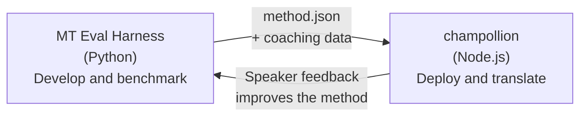

# สะพานเชื่อม Eval Harness

champollion และ MT Eval Harness เป็นเครื่องมือสองชิ้นที่แยกจากกัน แต่ก่อตัวเป็นระบบนิเวศเดียวกัน Harness คือที่ที่วิธีการแปล**ได้รับการพิสูจน์** Champollion คือที่ที่วิธีการที่พิสูจน์แล้ว**ถูกนำไปใช้งานจริง** ทั้งสองเชื่อมต่อกันผ่านรูปแบบ plugin ที่ใช้ร่วมกัน



## กระบวนการ: งานวิจัย → การใช้งานจริง

### 1. สร้างวิธีการใน Harness

Python class ใดก็ตามที่ implement `async translate(entries, config) → [{id, predicted}]` สามารถเชื่อมต่อกับ harness ได้ Harness ไม่สนใจว่าภายในจะทำงานอย่างไร — ไม่ว่าจะเป็น LLM แบบ prompted, โมเดลที่ฝึกเอง, กฎแบบ deterministic หรืออะไรก็ตาม

### 2. ทำ Benchmark

Harness จะให้คะแนนวิธีการของคุณเทียบกับ corpus มาตรฐานด้วย metrics ที่ทำซ้ำได้: chrF++, FST acceptance (สำหรับภาษาที่มีโครงสร้างทางสัณฐานวิทยาซับซ้อน), ความถูกต้องทางสัณฐานวิทยา และการให้คะแนนเชิงความหมาย

### 3. Export เป็น Plugin

เมื่อวิธีการของคุณถึงระดับคุณภาพที่ยอมรับได้ ให้แพ็กเกจเป็น champollion plugin — manifest แบบ `method.json` พร้อม coaching data เสริม

:::info[มีแผนเพิ่ม Export CLI]
ปัจจุบัน คุณต้องสร้างไฟล์ manifest method.json ด้วยตนเอง คำสั่ง `mt-eval export` จะช่วยทำให้กระบวนการนี้เป็นอัตโนมัติ ดูรายละเอียดรูปแบบ plugin แบบเต็มได้ที่ [Method Interface](/docs/network/specifications/methods)
:::

### 4. ติดตั้งใน Champollion

```bash
champollion plugin install ./my-method-plugin/
```

### 5. แปลเนื้อหาจริง

```bash
champollion sync
```

ขณะนี้ method ที่ผ่านการทดสอบแล้วของคุณกำลังสร้างการแปลจริงในสภาพแวดล้อมการใช้งานจริง

## กระบวนการ: การใช้งานจริง → งานวิจัย

การแปลที่ deploy แล้วจะได้รับการตรวจสอบโดยผู้พูดสองภาษา ข้อเสนอแนะของพวกเขาช่วยระบุข้อผิดพลาดที่เกิดขึ้นอย่างเป็นระบบ (รูปแบบกาลที่ผิด, คำศัพท์ที่ขาดหาย, การใช้ภาษาที่ไม่เป็นธรรมชาติ) นักวิจัยจะอัปเดตวิธีการใน harness, ทำ benchmark ใหม่, export ใหม่ และ deploy ใหม่ ระบบเรียนรู้จากการใช้งาน

## รูปแบบ Plugin

manifest `method.json` คือสัญญาระหว่างเครื่องมือทั้งสอง:

```json
{
  "name": "crk-coached-v3",
  "type": "llm-coached",
  "version": "3.0.0",
  "description": "Coached LLM translation for Plains Cree",
  "locales": ["crk"],
  "config": {
    "model": "google/gemini-3.5-flash",
    "temperature": 0.3
  },
  "benchmarks": {
    "crk": {
      "composite_score": 0.67,
      "fst_acceptance": 0.82,
      "corpus_size": 150
    }
  }
}
```

ดู [Plugin Specification](/docs/reference/plugin-spec) สำหรับรูปแบบแบบเต็ม

## สิ่งที่สร้างแล้ว vs. ที่วางแผนไว้

| Component | สถานะ |
|-----------|--------|
| TranslationMethod protocol | ✅ สร้างแล้ว |
| Harness benchmark runner | ✅ สร้างแล้ว |
| method.json plugin format | ✅ สร้างแล้ว |
| `champollion plugin install/remove/list` | ✅ สร้างแล้ว |
| Coaching data loading | ✅ สร้างแล้ว |
| `mt-eval export` CLI | 🔲 วางแผนไว้ |
| Community review interface | 🔲 วางแผนไว้ |
| Cryptographic test set evaluation | 🔲 วางแผนไว้ |

## อ่านเพิ่มเติม

- [วิธีการแปล](/docs/guides/translation-methods) — วิธีการทั้งหมดที่มีให้ใช้งานและหลักการทำงาน
- [ข้อกำหนดของปลั๊กอิน](/docs/reference/plugin-spec) — รูปแบบไฟล์ method.json
- [การให้บริการ Method ผ่าน API](/docs/guides/serving-a-method) — การโฮสต์ method บนฝั่งเซิร์ฟเวอร์
- [อธิปไตยของข้อมูล](/docs/network/sovereignty/data-sovereignty) — หลักการอธิปไตยทางข้อมูล, CARE และการปกป้องด้วยการเข้ารหัส
- [สำหรับนักวิจัยด้าน MT](/docs/network/leaderboard/rules) — เอกสารประกอบของ eval harness
