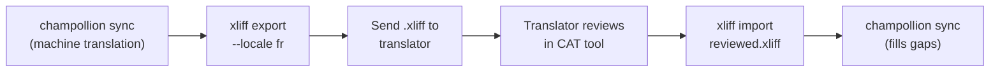

# การทำงานร่วมกับนักแปลมืออาชีพ

Champollion สร้างการแปลด้วยเครื่อง แต่บางโปรเจกต์ต้องการการตรวจสอบโดยมนุษย์ — เนื้อหาด้านกฎระเบียบ สำเนาที่เกี่ยวข้องกับแบรนด์ หรือ UI ที่มีความสำคัญสูง เวิร์กโฟลว์ XLIFF ช่วยให้คุณส่งออกการแปลเพื่อให้ผู้เชี่ยวชาญตรวจสอบ และนำเข้ากลับมาได้อย่างราบรื่น

## XLIFF คืออะไร?

XLIFF (XML Localization Interchange File Format) คือรูปแบบการแลกเปลี่ยนมาตรฐานอุตสาหกรรมสำหรับเครื่องมือแปล เครื่องมือ CAT (Computer-Assisted Translation) ระดับมืออาชีพทุกตัวรองรับรูปแบบนี้:

- **memoQ** — นำเข้า XLIFF ตรวจสอบในบริบท ส่งออกไฟล์ที่ตรวจสอบแล้ว
- **SDL Trados Studio** — รองรับ XLIFF แบบ native
- **Phrase (Memsource)** — อัปโหลดงาน XLIFF สำหรับทีมนักแปล
- **Smartling** — ไปป์ไลน์รับข้อมูล XLIFF
- **OmegaT** — เครื่องมือ CAT แบบฟรี/โอเพนซอร์สที่รองรับ XLIFF

Champollion สร้าง XLIFF 1.2 (เวอร์ชันที่รองรับอย่างสากล) แทนที่จะเป็น 2.0+ เพื่อให้เข้ากันได้กับเครื่องมือได้สูงสุด

## เวิร์กโฟลว์



### ขั้นตอนที่ 1: สร้างการแปลด้วยเครื่อง

รัน `sync` ก่อนเพื่อให้ได้การแปลพื้นฐานด้วยเครื่อง:

```bash
champollion sync
```

### ขั้นตอนที่ 2: ส่งออก XLIFF

ส่งออกคู่ต้นฉบับ + เป้าหมายเป็น XLIFF:

```bash
champollion xliff export --locale fr
```

คำสั่งนี้จะเขียน `.champollion/xliff/fr.xliff` ซึ่งประกอบด้วย:
- ทุก source key พร้อมค่าภาษาอังกฤษ
- การแปลด้วยเครื่องปัจจุบัน (ถ้ามี) ในฐานะ `<target>`
- คีย์ที่ไม่มีการแปลถูกทำเครื่องหมายเป็น `state="new"`

```xml
<trans-unit id="hero.title" xml:space="preserve">
  <source>Welcome to our platform</source>
  <target state="translated">Bienvenue sur notre plateforme</target>
</trans-unit>
```

### ขั้นตอนที่ 3: ส่งให้นักแปล

ส่งไฟล์ `.xliff` ให้นักแปลของคุณหรืออัปโหลดไปยังแพลตฟอร์ม CAT ของคุณ นักแปลจะเห็นต้นฉบับและเป้าหมายแบบเคียงข้างกัน และสามารถ:

- แก้ไขการแปลด้วยเครื่อง
- เติมการแปลที่ขาดหายไป
- ตั้งค่าสถานะปัญหาด้านคุณภาพ
- ใช้หน่วยความจำการแปลและฐานคำศัพท์ของตนเอง

### ขั้นตอนที่ 4: นำเข้าไฟล์ที่ตรวจสอบแล้ว

เมื่อนักแปลส่งคืน `.xliff` ที่ตรวจสอบแล้ว ให้นำเข้า:

```bash
# Preview what will change
champollion xliff import .champollion/xliff/fr.xliff --dry

# Apply changes
champollion xliff import .champollion/xliff/fr.xliff
```

ผลลัพธ์:
```
  ✓ Imported 142 translations for fr
    Updated:    23 (changed from existing)
    Added:      0 (new keys)
    Unchanged:  119
    Written to: locales/fr.json
```

### ขั้นตอนที่ 5: เติมส่วนที่ขาดหายไป

หากมีการเพิ่มคีย์ใหม่หลังจากส่งออก XLIFF แล้ว ให้รัน `sync` เพื่อแปลคีย์เหล่านั้น:

```bash
champollion sync
```

Champollion จะแปลเฉพาะคีย์ที่ยังขาดหายไปเท่านั้น — การแปลที่ตรวจสอบแล้วจากการนำเข้า XLIFF จะถูกเก็บรักษาไว้

## เคล็ดลับ

### ส่งออกพาธที่กำหนดเอง

```bash
# Export to a specific directory
champollion xliff export --locale ja --out ./for-review/

# Export with a specific filename
champollion xliff export --locale de --out ./review/german.xliff
```

### หลาย Locale

ส่งออกแต่ละ locale แยกกัน:

```bash
for locale in fr de ja ko; do
  champollion xliff export --locale $locale
done
```

### การควบคุมเวอร์ชัน

เพิ่ม `.champollion/xliff/` ลงใน `.gitignore` — ไฟล์ XLIFF เป็น artifact ชั่วคราว ไม่ใช่ source ของโปรเจกต์:

```gitignore
.champollion/xliff/
```

### เมื่อใดควรใช้ XLIFF เทียบกับแค่ `sync`

| สถานการณ์ | คำแนะนำ |
|----------|---------------|
| แอปภายใน ยอมรับคุณภาพ 90%+ ได้ | ใช้แค่ `sync` — การแปลด้วยเครื่องก็เพียงพอ |
| สำเนาการตลาดที่ผู้ใช้เห็น | ส่งออก XLIFF เพื่อให้มนุษย์ตรวจสอบ |
| เนื้อหาด้านกฎหมาย/กฎระเบียบ | ส่งออก XLIFF — ต้องให้มนุษย์ตรวจสอบ |
| มากกว่า 50 locale กำหนดเวลาเร่งด่วน | `sync` ก่อน ส่งออก XLIFF เฉพาะ 5 locale หลักเท่านั้น |
| นักแปลใช้เครื่องมือ CAT อยู่แล้ว | XLIFF คือรูปแบบส่งมอบงานที่เป็นธรรมชาติ |

---

## ดูเพิ่มเติม

- [CLI Reference — xliff](/docs/reference/cli#xliff) — เอกสารอ้างอิงคำสั่ง
- [Translation Memory](/docs/concepts/translation-memory) — การแคชการแปลที่ตรวจสอบแล้ว
- [Translation Methods](/docs/guides/translation-methods) — ตัวเลือกการแปลด้วยเครื่อง
