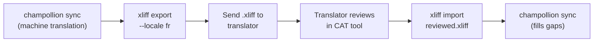

# การทำงานร่วมกับนักแปลมืออาชีพ

Champollion สร้างการแปลด้วยเครื่อง แต่บางโปรเจกต์ต้องการการตรวจสอบโดยมนุษย์ — เนื้อหาด้านกฎระเบียบ สำเนาที่เกี่ยวข้องกับแบรนด์ หรือ UI ที่มีความสำคัญสูง เวิร์กโฟลว์ XLIFF ช่วยให้คุณส่งออกการแปลเพื่อให้ผู้เชี่ยวชาญตรวจสอบ และนำเข้ากลับมาได้อย่างราบรื่น

XLIFF ครอบคลุม**ไฟล์สตริง**ของแอปคุณ (คีย์และค่าต่างๆ) ส่วน **Markdown** ที่แปลแล้ว (จดหมายข่าว, โพสต์บล็อก, หน้าเอกสาร) จะได้รับการตรวจสอบต่างออกไป: ผู้ตรวจทานจะแก้ไขไฟล์ `.md` ที่แปลแล้วโดยตรง และการซิงค์จะเก็บการแก้ไขเหล่านั้นไว้ ดู [การตรวจทาน Markdown ที่แปลแล้ว](#reviewing-translated-markdown) ด้านล่าง

## XLIFF คืออะไร?

XLIFF (XML Localization Interchange File Format) คือรูปแบบการแลกเปลี่ยนมาตรฐานอุตสาหกรรมสำหรับเครื่องมือแปล เครื่องมือ CAT (Computer-Assisted Translation) ระดับมืออาชีพทุกตัวรองรับรูปแบบนี้:

- **memoQ** — นำเข้า XLIFF ตรวจสอบในบริบท ส่งออกไฟล์ที่ตรวจสอบแล้ว
- **SDL Trados Studio** — รองรับ XLIFF แบบ native
- **Phrase (Memsource)** — อัปโหลดงาน XLIFF สำหรับทีมนักแปล
- **Smartling** — ไปป์ไลน์รับข้อมูล XLIFF
- **OmegaT** — เครื่องมือ CAT แบบฟรี/โอเพนซอร์สที่รองรับ XLIFF

Champollion สร้าง XLIFF 1.2 (เวอร์ชันที่รองรับอย่างสากล) แทนที่จะเป็น 2.0+ เพื่อให้เข้ากันได้กับเครื่องมือได้สูงสุด

## เวิร์กโฟลว์


```mermaid
flowchart LR
    A["champollion sync\n(machine translation)"] --> B["xliff export\n--locale fr"]
    B --> C["Send .xliff to\ntranslator"]
    C --> D["Translator reviews\nin CAT tool"]
    D --> E["xliff import\nreviewed.xliff"]
    E --> F["champollion sync\n(fills gaps)"]
```

### ขั้นตอนที่ 1: สร้างการแปลด้วยเครื่อง

รัน `sync` ก่อนเพื่อให้ได้การแปลพื้นฐานด้วยเครื่อง:

```bash
champollion sync
```

### ขั้นตอนที่ 2: ส่งออก XLIFF

ส่งออกคู่ต้นฉบับ + เป้าหมายเป็น XLIFF:

```bash
champollion xliff export --locale fr
```

คำสั่งนี้จะเขียน `.champollion/xliff/fr.xliff` ซึ่งประกอบด้วย:
- ทุก source key พร้อมค่าภาษาอังกฤษ
- การแปลด้วยเครื่องปัจจุบัน (ถ้ามี) ในฐานะ `<target>`
- คีย์ที่ไม่มีการแปลถูกทำเครื่องหมายเป็น `state="new"`

```xml
<trans-unit id="hero.title" xml:space="preserve">
  <source>Welcome to our platform</source>
  <target state="translated">Bienvenue sur notre plateforme</target>
</trans-unit>
```

### ขั้นตอนที่ 3: ส่งให้นักแปล

ส่งไฟล์ `.xliff` ให้นักแปลของคุณหรืออัปโหลดไปยังแพลตฟอร์ม CAT ของคุณ นักแปลจะเห็นต้นฉบับและเป้าหมายแบบเคียงข้างกัน และสามารถ:

- แก้ไขการแปลด้วยเครื่อง
- เติมการแปลที่ขาดหายไป
- ตั้งค่าสถานะปัญหาด้านคุณภาพ
- ใช้หน่วยความจำการแปลและฐานคำศัพท์ของตนเอง

### ขั้นตอนที่ 4: นำเข้าไฟล์ที่ตรวจสอบแล้ว

เมื่อนักแปลส่งคืน `.xliff` ที่ตรวจสอบแล้ว ให้นำเข้า:

```bash
# Preview what will change
champollion xliff import .champollion/xliff/fr.xliff --dry

# Apply changes
champollion xliff import .champollion/xliff/fr.xliff
```

ผลลัพธ์:
```
  ✓ Imported 142 translations for fr
    Updated:    23 (changed from existing)
    Added:      0 (new keys)
    Unchanged:  119
    Written to: locales/fr.json
```

### ขั้นตอนที่ 5: เติมส่วนที่ขาดหายไป

หากมีการเพิ่มคีย์ใหม่หลังจากส่งออก XLIFF แล้ว ให้รัน `sync` เพื่อแปลคีย์เหล่านั้น:

```bash
champollion sync
```

Champollion จะแปลเฉพาะคีย์ที่ยังขาดหายไปเท่านั้น — การแปลที่ตรวจสอบแล้วจากการนำเข้า XLIFF จะถูกเก็บรักษาไว้

## เคล็ดลับ

### ส่งออกพาธที่กำหนดเอง

```bash
# Export to a specific directory
champollion xliff export --locale ja --out ./for-review/

# Export with a specific filename
champollion xliff export --locale de --out ./review/german.xliff
```

### หลาย Locale

ส่งออกแต่ละ locale แยกกัน:

```bash
for locale in fr de ja ko; do
  champollion xliff export --locale $locale
done
```

### การควบคุมเวอร์ชัน

เพิ่ม `.champollion/xliff/` ลงใน `.gitignore` — ไฟล์ XLIFF เป็น artifact ชั่วคราว ไม่ใช่ source ของโปรเจกต์:

```gitignore
.champollion/xliff/
```

### เมื่อใดควรใช้ XLIFF เทียบกับแค่ `sync`

| สถานการณ์ | คำแนะนำ |
|----------|---------------|
| แอปภายใน ยอมรับคุณภาพ 90%+ ได้ | ใช้แค่ `sync` — การแปลด้วยเครื่องก็เพียงพอ |
| สำเนาการตลาดที่ผู้ใช้เห็น | ส่งออก XLIFF เพื่อให้มนุษย์ตรวจสอบ |
| เนื้อหาด้านกฎหมาย/กฎระเบียบ | ส่งออก XLIFF — ต้องให้มนุษย์ตรวจสอบ |
| มากกว่า 50 locale กำหนดเวลาเร่งด่วน | `sync` ก่อน ส่งออก XLIFF เฉพาะ 5 locale หลักเท่านั้น |
| นักแปลใช้เครื่องมือ CAT อยู่แล้ว | XLIFF คือรูปแบบส่งมอบงานที่เป็นธรรมชาติ |

## การแก้ไขคำแปลในไฟล์โลแคล {#editing-key-value-files}

ผู้ตรวจทานยังสามารถแก้ไขคำแปลได้โดยตรงในไฟล์โลแคล (`messages/fr.json`, `locale/fr/LC_MESSAGES/django.po`, `app_fr.arb`, …) แล้วคอมมิตไฟล์นั้น Champollion จะบันทึกลายนิ้วมือ (fingerprint) ของทุกค่าที่เขียนลงใน `.champollion.lock` ค่าที่ไม่ตรงกันอีกต่อไปแสดงว่าถูกแก้ไขโดยมนุษย์ และการซิงค์จะถือว่าเป็นผลงานของพวกเขา:

| คำสั่งที่ทำงาน | สิ่งที่เกิดขึ้นกับค่าที่ได้รับการแก้ไข |
|-----------|----------------------------------|
| คำสั่ง `sync` ปกติ โดยที่ภาษาอังกฤษไม่เปลี่ยนแปลง | ไม่มีการแตะต้อง (เหมือนเดิม) |
| `sync --redo all` / `--force`, การสลับโมเดล (`--redo all --fresh-on-model-change`) หรือการลองแปลคีย์ใหม่ที่คำสั่งทำซ้ำ (redo) พักค้างไว้ | **คงไว้** การทำงานจะแจ้งจำนวนและรายการที่คงไว้ รวมถึงวิธีแทนที่ค่าดังกล่าว: `--redo keys:<key>` |
| `sync --redo keys:<key>` พร้อมระบุชื่อคีย์ | ถูกแทนที่ — เนื่องจากคุณระบุคีย์นั้นโดยตรง ข้อความที่ได้รับการแก้ไขจะแสดงขึ้นมาก่อน |
| **ต้นฉบับภาษาอังกฤษของคีย์นั้นมีการเปลี่ยนแปลง** | แปลใหม่อีกครั้ง (การแก้ไขเดิมมีไว้สำหรับข้อความเก่า) ข้อความที่แก้ไขไว้จะแสดงขึ้นมาเพื่อให้สามารถนำกลับมาใช้อีกครั้งได้ และจะถูกเพิ่มต่อท้ายใน `.champollion-replaced-edits.jsonl` ที่รูทของโปรเจกต์ |

`.champollion-replaced-edits.jsonl` เป็นไฟล์ที่ถูกติดตาม (tracked file) ซึ่งอยู่ข้างๆ ไฟล์ lock (ส่วนโฟลเดอร์แคช `.champollion/` จะแยกตามแต่ละเครื่องและถูกละเว้นโดย git): ประกอบด้วย JSON หนึ่งบรรทัดต่อการแก้ไขที่ถูกแทนที่หนึ่งรายการ พร้อมระบุโลแคล, ไฟล์, คีย์, ข้อความที่แก้ไข, เหตุผลที่ถูกแทนที่ และข้อความต้นฉบับใหม่ ให้คอมมิตไฟล์นี้พร้อมกับไฟล์ lock — ไฟล์นี้เป็นสำเนาเดียวของข้อความดังกล่าว คำสั่ง `champollion status` จะแสดงจำนวนรายการที่เก็บไว้

ค่าที่ถูกเขียนก่อนที่จะมีบันทึกนี้ หรือเขียนโดยเครื่องมืออื่น จะไม่มีลายนิ้วมือ ค่าดังกล่าวจะถือว่าเป็นของ Champollion ก็ต่อเมื่อแคชการแปลมีข้อความที่ตรงกันทุกประการสำหรับคีย์นั้น มิฉะนั้นจะถือว่าเป็นงานของมนุษย์และถูกคงไว้เมื่อมีการทำซ้ำแบบเป็นกลุ่ม (การทำงานจะระบุว่าเป็นค่าที่ไม่มีบันทึกว่าเขียนไว้) ค่าที่นำเข้าด้วย `champollion xliff import` ถือเป็นผลงานของมนุษย์และจะถูกคงไว้ในลักษณะเดียวกัน

## การตรวจทาน Markdown ที่แปลแล้ว {#reviewing-translated-markdown}

ไฟล์เนื้อหาจาก `contentDir` (ตัวอย่างเช่น `newsletters/2026-10.md` → `newsletters/2026-10.crk.md`) จะไม่มีการส่งออกเป็น XLIFF ผู้ตรวจทานจะทำงานในไฟล์ที่แปลแล้วโดยตรง:

1. รัน `champollion sync` และคอมมิตคำแปลพร้อมกับ `.champollion-content.lock`
2. ผู้ตรวจทานแก้ไขไฟล์ที่แปลแล้ว ไม่ว่าจะเป็นย่อหน้าหรือฟิลด์ front-matter ที่แปลแล้ว เช่น `title` แล้วทำการคอมมิต
3. ในการซิงค์ครั้งต่อๆ ไป การแก้ไขจะถูกคงไว้ หากต้นฉบับภาษาอังกฤษในย่อหน้าอื่นเปลี่ยนแปลง ย่อหน้าของผู้ตรวจทานจะยังคงอยู่ตรงตามคำเดิมทุกประการ และจะมีการแปลเฉพาะย่อหน้าที่เปลี่ยนแปลงเท่านั้น การทำงานจะแสดงข้อความ `kept the edits made by hand to …`

มีข้อยกเว้นสองประการ และการซิงค์จะแจ้งเตือนทั้งสองกรณี หากย่อหน้าภาษาอังกฤษที่ผู้ตรวจทานแก้ไขมีการเปลี่ยนแปลงด้วย ย่อหน้านั้นจะถูกแปลใหม่อีกครั้ง และข้อความของผู้ตรวจทานจะแสดงขึ้นมาเพื่อให้สามารถนำกลับมาใช้ใหม่ได้ หากผู้ตรวจทานเพิ่มหรือลบย่อหน้าและต่อมาต้นฉบับมีการเปลี่ยนแปลง ไฟล์จะถูกคงไว้ตามเดิมและแสดงรายการในการซิงค์ทุกครั้ง จนกว่าจะมีคนเข้ามาอัปเดตด้วยตนเอง

หากต้องการยกเลิกการแก้ไขทั้งหมดและกลับไปใช้การแปลด้วยเครื่อง ให้ระบุชื่อไฟล์: `champollion sync --redo files:2026-10.md` กฎเกณฑ์ฉบับเต็มสามารถดูได้ใน [การแปลเนื้อหา](/docs/guides/content-translation#reviewing-and-editing-translations)

---

## ดูเพิ่มเติม

- [ข้อมูลอ้างอิง CLI — xliff](/docs/reference/cli#xliff) — เอกสารอ้างอิงคำสั่ง
- [หน่วยความจำการแปล (Translation Memory)](/docs/concepts/translation-memory) — การแคชคำแปลที่ผ่านการตรวจทานแล้ว
- [วิธีการแปล](/docs/guides/translation-methods) — ตัวเลือกสำหรับการแปลด้วยเครื่อง
- [การแปลเนื้อหา](/docs/guides/content-translation) — การแปล Markdown และวิธีคงการแก้ไขของผู้ตรวจทานไว้
- [เกณฑ์ตรวจสอบคุณภาพ (Quality Gate)](/docs/concepts/quality-gate#refused-keys-are-held-back) — คีย์ที่เกณฑ์ไม่ผ่าน และคีย์ที่การทำซ้ำ (redo) พักค้างไว้
