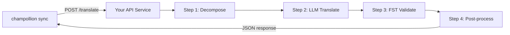

# การให้บริการ Custom Method ในรูปแบบ API

**`api` method** ของ champollion ช่วยให้คุณชี้คู่ภาษาใดก็ได้ไปยัง HTTP endpoint ภายนอก นี่คือวิธีที่คุณสามารถผสานรวม pipeline ที่ซับซ้อนเกินกว่าจะใช้ LLM prompt เดียว ไม่ว่าจะเป็น morphological analyzer, finite-state transducer (FST), multi-step LLM chain หรือ custom research method ที่คุณสร้างขึ้นเอง

มีสองวิธีในการตั้งค่า endpoint ดังกล่าว:

1. **`champollion serve`** — คำสั่งเดียวที่ให้บริการสแต็กที่กำหนดค่าไว้ของโปรเจกต์ champollion ที่มีอยู่ของคุณ (method, registers, coaching, Translation Memory, quality gate) ภายใต้ contract นี้ โดยไม่ต้องเขียนโค้ดเซิร์ฟเวอร์ ดู [เส้นทางแบบไม่ต้องเขียนโค้ด](#the-zero-code-path-champollion-serve)
2. **บริการแบบกำหนดเอง (A custom service)** — เขียน HTTP เซิร์ฟเวอร์ของคุณเองที่ใช้งาน contract นี้ สำหรับไปป์ไลน์ที่อยู่นอก champollion โดยสิ้นเชิง

## เหตุใดจึงต้องใช้ API Service?

translation pipeline บางประเภทไม่สามารถทำงานภายในวงจร prompt-response แบบง่ายได้:

| ขั้นตอนใน Pipeline | ตัวอย่าง |
|---|---|
| **Morphological decomposition** | แยกคำ polysynthetic ออกเป็น morpheme ก่อนแปล |
| **FST validation** | ปฏิเสธผลลัพธ์ที่ละเมิดกฎ phonological หรือ morphological |
| **Multi-step LLM chains** | วงจร Generate → verify → correct โดยใช้โมเดลต่างกัน |
| **Dictionary lookup** | อ้างอิงพจนานุกรมสองภาษาที่คัดสรรแล้วระหว่าง pipeline |
| **Human-in-the-loop** | จัดคิวการแปลที่ไม่แน่ใจเพื่อให้ผู้เชี่ยวชาญตรวจสอบ |

`api` method จะมอง pipeline ของคุณเป็น black box — champollion ส่ง source string มา แล้ว service ของคุณส่งคืนการแปล สิ่งที่เกิดขึ้นภายในขึ้นอยู่กับคุณทั้งหมด

## สถาปัตยกรรม



## เส้นทางแบบไม่ต้องเขียนโค้ด: `champollion serve`

หากไปป์ไลน์ของคุณเป็นโปรเจกต์ champollion อยู่แล้ว — มีการกำหนดค่า method (LLM, coached หรือ engine), registers, ไฟล์ coaching, Translation Memory และ quality gate แบบกำหนดได้ (deterministic) — คุณไม่จำเป็นต้องเขียนเซิร์ฟเวอร์เลย `champollion serve` จะตั้งค่า **สแต็กที่คุณกำหนดค่าไว้เอง** ภายใต้ contract ที่อธิบายไว้ด้านล่างนี้อย่างแม่นยำ:

```bash
# Owner side — run from the project whose champollion.config.json defines the stack
CHAMPOLLION_SERVE_TOKEN=$(openssl rand -hex 24) npx champollion serve
# [OK] champollion serve listening on http://127.0.0.1:1822/translate
```

ทุกคำขอจะทำงานผ่านไปป์ไลน์เดียวกันกับที่ `champollion sync` ใช้:

- **Translation Memory** — สตริงที่ TM มีอยู่แล้วจะถูกให้บริการจากแคชฟรี โดยไม่ต้องเรียกใช้งานผู้ให้บริการต้นทาง (upstream provider) ของคุณ ผลลัพธ์ API ที่ผ่านการตรวจสอบจาก gate จะถูกแคชไว้สำหรับคำขอถัดไป
- **Quality gate** — ทุกการตอบกลับจะถูกตรวจสอบอย่างกำหนดได้ (การซ้ำซ้อน, อัตราส่วนความยาว, ความสอดคล้องของสคริปต์, การสะท้อนกลับของต้นฉบับ) ความล้มเหลวจะส่งกลับมาเป็นข้อผิดพลาดแบบมีโครงสร้างต่อคีย์ (HTTP 207/422) — จะไม่มีการส่งออกผลลัพธ์ที่ด้อยคุณภาพอย่างเงียบๆ เด็ดขาด
- **Cost guard** — `--max-cost-per-request` และ `--max-session-cost` จะปฏิเสธคำขอที่ต้นทุนต้นทางที่ *ประเมินไว้* เกินขีดจำกัดของคุณ ก่อนที่จะมีการเรียกใช้งานผู้ให้บริการใดๆ Method ที่ไม่ทราบราคาจะถูกปฏิเสธภายใต้ขีดจำกัดเช่นกัน: การไม่ทราบราคาไม่ได้แปลว่าฟรี คำขอที่ครอบคลุมโดย TM จะมีราคาเป็น $0 ที่ทราบแน่ชัดและจะผ่านเสมอ

เซิร์ฟเวอร์จะผูกกับ `127.0.0.1` ตามค่าเริ่มต้น: ใครก็ตามที่สามารถเข้าถึงพอร์ตนี้ได้จะสามารถใช้จ่ายงบประมาณ API ต้นทางของคุณได้ ดังนั้นการเปิดเผยพอร์ตนี้จึงเป็นการตัดสินใจที่ต้องทำอย่างชัดเจน — `--bind 0.0.0.0` พร้อมกับ bearer token ที่รัดกุม `--no-auth` จะได้รับการยอมรับก็ต่อเมื่อใช้ร่วมกับการผูกแบบ loopback เท่านั้น การจำกัดอัตราต่อ IP และขีดจำกัดขนาดคำขอจะเปิดใช้งานตามค่าเริ่มต้น; ดู `champollion serve --help`

### ชี้ Consumer มาที่นี่

สร้าง plugin manifest ที่ consumer จะติดตั้ง (หนึ่งคำสั่งในแต่ละฝั่ง):

```bash
# Owner side
champollion serve --emit-manifest --endpoint https://translate.example.org
# [OK] Wrote ./my-project-serve/method.json
```

```bash
# Consumer side
champollion plugin install ./my-project-serve
```

```json title="champollion.config.json (consumer)"
{
  "pairs": {
    "en:crk": { "methodPlugin": "my-project-serve" }
  }
}
```

```bash
CHAMPOLLION_API_KEY=<the server's bearer token> champollion sync
```

Method `api` ของ consumer จะ POST สตริงต้นฉบับไปยังเซิร์ฟเวอร์ของคุณ; สแต็กของคุณจะทำการแปล, ตรวจสอบผ่าน gate และแคช; `qualityTier` ของ manifest จะส่งผ่านคู่ภาษาที่คุณกำหนดค่าไว้อย่างตรงไปตรงมา (ระดับที่ระมัดระวังที่สุดเมื่อมีความแตกต่างกัน) พรอมต์, ข้อมูล coaching และคีย์ผู้ให้บริการของคุณจะไม่มีวันออกจากเครื่องของคุณ

ส่วนที่เหลือของคู่มือนี้จะครอบคลุมการเขียนบริการ **แบบกำหนดเอง (custom)** — ซึ่งมีประโยชน์เมื่อไปป์ไลน์ของคุณไม่ใช่โปรเจกต์ champollion (เช่น Python FST chain, ระบบวิจัยที่สร้างขึ้นเฉพาะ) wire contract จะเหมือนกันในทั้งสองกรณี

## การตั้งค่า Service ของคุณ

API service ของคุณต้องมี endpoint เดียวที่รับและส่งคืน JSON:

### รูปแบบ Request

Champollion ส่ง JSON body นี้ไปยัง endpoint ของคุณ (ดู [api.js](https://github.com/gamedaysuits/Champollion/blob/main/cli/lib/methods/api.js)):

```json
POST /translate
Content-Type: application/json
Authorization: Bearer <CHAMPOLLION_API_KEY>

{
  "source_locale": "en",
  "target_locale": "crk",
  "method": "crk-coached-v1",
  "keys": {
    "greeting": "Hello, welcome to our app",
    "farewell": "Goodbye and thanks"
  }
}
```

| Field | Type | คำอธิบาย |
|-------|------|-------------|
| `source_locale` | string | รหัสภาษาต้นทาง BCP 47 |
| `target_locale` | string | รหัสภาษาปลายทาง BCP 47 |
| `method` | string | ชื่อ Plugin หรือ `"default"` |
| `keys` | object | Map ของ key → source string ที่ต้องการแปล |
```

### Response Format

Your service must return a `translations` object. An optional `meta` object can include cost and diagnostic info:

```json
{
  "translations": {
    "greeting": "tânisi, pê-kîwêw ôta",
    "farewell": "ekosi mâka, kinanâskomitin"
  },
  "meta": {
    "model": "my-custom-pipeline/v1",
    "cost_usd": 0.0042,
    "method": "decompose-translate-validate"
  }
}
```

| Field | Type | Required | Description |
|-------|------|----------|-------------|
| `translations` | object | ✅ | Map of key → translated string |
| `meta` | object | — | Optional metadata |
| `meta.cost_usd` | number | — | If present, displayed in champollion's output |
| `errors` | object | — | For partial success (HTTP 207): map of key → `{ message }` |

### Minimal Express Server

```javascript
import express from 'express';

const app = express();
app.use(express.json());

/**
 * champollion API contract:
 *
 * Request:  { source_locale, target_locale, method, keys: { "key": "source" } }
 * Response: { translations: { "key": "translated" }, meta: { ... } }
 */
app.post('/translate', async (req, res) => {
  const { source_locale, target_locale, method, keys } = req.body;

  const translations = {};

  for (const [key, source] of Object.entries(keys)) {
    // --- Pipeline ของคุณอยู่ที่นี่ ---
    // ขั้นตอนที่ 1: Morphological decomposition
    const morphemes = await decompose(source, source_locale);

    // ขั้นตอนที่ 2: LLM translation พร้อม context
    const draft = await llmTranslate(morphemes, target_locale);

    // ขั้นตอนที่ 3: FST validation
    const validated = await fstValidate(draft, target_locale);

    // ขั้นตอนที่ 4: Post-processing (การทำให้ orthography เป็นมาตรฐาน ฯลฯ)
    translations[key] = await postProcess(validated);
  }

  res.json({
    translations,
    meta: {
      model: 'my-custom-pipeline/v1',
      method: 'decompose-translate-validate',
    },
  });
});

app.listen(3001, () => {
  console.log('Translation API running on http://localhost:3001');
});
```

## Configuring champollion

Point a translation pair at your running service in `champollion.config.json`:

```json
{
  "inputLocale": "en",
  "pairs": {
    "en:crk": {
      "method": "api",
      "endpoint": "http://localhost:3001/translate",
      "register": "Formal Plains Cree. Use SRO orthography."
    }
  }
}
```

Then run sync as usual:

```bash
npx champollion sync
```

champollion will POST your source strings to the endpoint and write the returned translations to `crk.json`.

## Case Study: Plains Cree Pipeline

:::info[Under Development]
The Plains Cree pipeline described below is **under active development** and is not yet running in production. Details here reflect the current design direction and may change as the project evolves.
:::

The **arena** project demonstrates this pattern. Its Plains Cree pipeline uses:

1. **Morphological decomposition** — Break polysynthetic Cree words into translatable morpheme chains
2. **LLM translation** — Context-enriched GPT-4o translation with coaching data (SRO orthography rules, register instructions)
3. **FST validation** — Finite-state transducer checks that outputs conform to Cree phonological rules
4. **Confidence scoring** — Each translation gets a confidence score based on FST pass rate and dictionary coverage

The entire pipeline runs as a single HTTP endpoint that champollion calls via the `api` method.

### Running Evaluations

After translating, you can evaluate output quality using the harness directly:

```bash
# Clone the harness
git clone https://github.com/gamedaysuits/Champollion.git
cd Champollion/arena
pip install -e .

# Run the evaluation against a real, non-bundled corpus
mt-eval run --corpus eval-amh-fra-globalvoices-test-v1 --model gemini-pro --yes
```

This produces structured evaluation records with chrF++, BLEU, and exact match scores that can be used as regression baselines.

## Authentication

If your API requires authentication, set the `apiKey` field or use an environment variable:

```json
{
  "pairs": {
    "en:crk": {
      "method": "api",
      "endpoint": "https://my-mt-service.example.com/translate",
      "apiKey": "${CRK_API_KEY}"
    }
  }
}
```

## Data Sovereignty

The `api` method is particularly important for **Indigenous language communities**. By self-hosting the translation pipeline, a community keeps full control over:

- **Proprietary coaching data** — register instructions, orthography rules, and domain glossaries never leave community infrastructure.
- **Linguistic resources** — curated dictionaries, FST grammars, and elder-verified translations remain under community ownership.
- **Access policies** — the community decides who can call the endpoint and under what terms.

This design follows the direction of [Indigenous data-sovereignty principles](/docs/network/community/low-resource-languages#data-sovereignty-principles) — community ownership and control of language data: sensitive language data stays governed by the community rather than a third-party platform.

:::tip
Combine the `api` method with a private deployment (e.g., a community-hosted VM or on-prem server) for the strongest data-sovereignty posture. `champollion serve` gives a community exactly this self-hosting posture without writing any server code — coaching data, provider keys, and the Translation Memory all stay on community infrastructure. See [Support a Low-Resource Language](/docs/network/community/low-resource-languages) for a full walkthrough.
:::

## Cost Estimation

The `api` method returns `null` for cost estimation by default — your service controls pricing. If you want to provide cost transparency, have your API return a `cost` field in the metadata:

```json
{
  "translations": { "...": "..." },
  "metadata": {
    "cost": {
      "estimatedCost": 0.0042,
      "currency": "USD",
      "source": "my-service-pricing"
    }
  }
}
```

## แนวทางปฏิบัติที่ดีที่สุด

1. **ส่งคืน empty string เมื่อเกิดข้อผิดพลาด** — อย่าส่งคืน source string เป็น "การแปล" ให้ส่งคืน `""` แล้ว quality gate ของ champollion จะตรวจจับได้ key นั้นจะถูกข้ามและลองใหม่ใน sync ครั้งถัดไป
2. **ใส่ confidence score** — หาก pipeline ของคุณสามารถประเมินคุณภาพได้ ให้ส่งคืนค่านั้นใน metadata ซึ่งช่วยในการตรวจสอบคุณภาพ
3. **ติดตั้ง health check** — เพิ่ม endpoint `GET /health` เพื่อให้ champollion ตรวจสอบการเชื่อมต่อก่อนเริ่ม sync ขนาดใหญ่
4. **จัดการ rate limit อย่างเหมาะสม** — หาก pipeline ของคุณมีข้อจำกัดด้าน throughput ให้ส่งคืน status code `429` ระบบ batch ของ champollion จะลดความเร็วลงเอง
5. **บันทึก log ทุกอย่าง** — pipeline หลายขั้นตอนอาจล้มเหลวโดยไม่แสดงข้อผิดพลาด ให้บันทึก input/output ของแต่ละขั้นตอนเพื่อการ debug

## การอนุญาตสิทธิ์

รูปแบบ `api` method เป็น open อย่างสมบูรณ์ — ไม่มีข้อจำกัดด้านการอนุญาตสิทธิ์ในการห่อ translation pipeline ของคุณเองเป็น HTTP service ส่วน `arena` eval harness ได้รับอนุญาตภายใต้ AGPL-3.0-or-later (พร้อม §7 eval-standard-plugin exception) คุณสามารถศึกษาและต่อยอดได้ภายใต้เงื่อนไขดังกล่าว

## ดูเพิ่มเติม

- [Translation Methods](/docs/guides/translation-methods) — ภาพรวมของ method ที่มีมาให้ในตัวทั้งหมด (`openai`, `google`, `api` ฯลฯ)
- [Plugin Specification](/docs/reference/plugin-spec) — สคีมาแบบเต็มสำหรับ `champollion.config.json` รวมถึงฟิลด์ method `api`
- [Support a Low-Resource Language](/docs/network/community/low-resource-languages) — คู่มือแบบ end-to-end สำหรับภาษาที่มีทรัพยากรน้อย รวมถึงหลักการอธิปไตยทางข้อมูล
- [Architecture](/docs/concepts/architecture) — วิธีการทำงานของ sync loop, การจัดกลุ่ม (batching) และการเรียกใช้ method (method dispatch) ของ champollion
- [MT Evaluation](/docs/network/leaderboard/rules) — ระเบียบวิธีในการประเมิน, เมตริก และกระบวนการส่งผลขึ้น leaderboard
- [Method Leaderboard](/leaderboard) — การจัดอันดับคุณภาพแบบเรียลไทม์ในทุก method และคู่ภาษา
