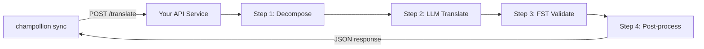

# การให้บริการ Custom Method ในรูปแบบ API

**`api` method** ของ champollion ช่วยให้คุณชี้คู่ภาษาใดก็ได้ไปยัง HTTP endpoint ภายนอก นี่คือวิธีที่คุณสามารถผสานรวม pipeline ที่ซับซ้อนเกินกว่าจะใช้ LLM prompt เดียว ไม่ว่าจะเป็น morphological analyzer, finite-state transducer (FST), multi-step LLM chain หรือ custom research method ที่คุณสร้างขึ้นเอง

มีสองวิธีในการเปิดให้บริการ endpoint ดังกล่าว:

1. **`champollion serve`** — คำสั่งเดียวที่ให้บริการสแตกที่กำหนดค่าไว้ของโปรเจกต์ champollion เดิมของคุณ (method, registers, coaching, Translation Memory, quality gate) ภายใต้ contract นี้ โดยไม่ต้องเขียนโค้ดเซิร์ฟเวอร์ ดูรายละเอียดได้ที่ [แนวทางแบบไม่ต้องเขียนโค้ด](#the-zero-code-path-champollion-serve)
2. **บริการที่กำหนดเอง** — เขียน HTTP เซิร์ฟเวอร์ของคุณเองที่รองรับ contract นี้ สำหรับไปป์ไลน์ที่ทำงานอยู่นอก champollion โดยสิ้นเชิง

## เหตุใดจึงต้องใช้ API Service?

translation pipeline บางประเภทไม่สามารถทำงานภายในวงจร prompt-response แบบง่ายได้:

| ขั้นตอนใน Pipeline | ตัวอย่าง |
|---|---|
| **Morphological decomposition** | แยกคำ polysynthetic ออกเป็น morpheme ก่อนแปล |
| **FST validation** | ปฏิเสธผลลัพธ์ที่ละเมิดกฎ phonological หรือ morphological |
| **Multi-step LLM chains** | วงจร Generate → verify → correct โดยใช้โมเดลต่างกัน |
| **Dictionary lookup** | อ้างอิงพจนานุกรมสองภาษาที่คัดสรรแล้วระหว่าง pipeline |
| **Human-in-the-loop** | จัดคิวการแปลที่ไม่แน่ใจเพื่อให้ผู้เชี่ยวชาญตรวจสอบ |

`api` method จะมอง pipeline ของคุณเป็น black box — champollion ส่ง source string มา แล้ว service ของคุณส่งคืนการแปล สิ่งที่เกิดขึ้นภายในขึ้นอยู่กับคุณทั้งหมด

## สถาปัตยกรรม


```mermaid
graph LR
    A[champollion sync] -->|POST /translate| B[Your API Service]
    B --> C[Step 1: Decompose]
    C --> D[Step 2: LLM Translate]
    D --> E[Step 3: FST Validate]
    E --> F[Step 4: Post-process]
    F -->|JSON response| A
```

## แนวทางแบบไม่ต้องเขียนโค้ด: `champollion serve`

หากไปป์ไลน์ของคุณเป็นโปรเจกต์ champollion อยู่แล้ว — มี method ที่กำหนดค่าไว้แล้ว (LLM, coached หรือ engine), registers, ไฟล์ coaching, Translation Memory และ deterministic quality gate — คุณไม่จำเป็นต้องเขียนเซิร์ฟเวอร์เลย `champollion serve` จะเปิดให้บริการ **สแตกที่คุณกำหนดค่าไว้เอง** ภายใต้ contract เดียวกันกับที่อธิบายไว้ด้านล่างนี้:

```bash
# Owner side — run from the project whose champollion.config.json defines the stack
CHAMPOLLION_SERVE_TOKEN=$(openssl rand -hex 24) npx champollion serve
# [OK] champollion serve listening on http://127.0.0.1:1822/translate
```

ทุกคำขอจะทำงานผ่านไปป์ไลน์เดียวกันกับที่ `champollion sync` ใช้งาน:

- **Translation Memory** — ข้อความที่ TM มีอยู่แล้วจะถูกส่งจากแคชโดยไม่มีค่าใช้จ่าย และไม่ส่งคำขอไปยังผู้ให้บริการต้นทางเลย ผลลัพธ์ API ที่ผ่านการตรวจสอบความถูกต้องจาก gate แล้วจะถูกแคชไว้สำหรับคำขอถัดไป
- **Quality gate** — ทุกคำตอบจะได้รับการตรวจสอบความถูกต้องแบบดีเทอร์มินิสติก (การซ้ำคำ, อัตราส่วนความยาว, ความสอดคล้องของระบบการเขียน, การสะท้อนข้อความต้นฉบับ) ข้อผิดพลาดจะถูกส่งกลับมาเป็น structured error แยกตามแต่ละคีย์ (HTTP 207/422) — จะไม่มีการส่งเอาต์พุตที่มีคุณภาพลดลงเงียบ ๆ ออกมาอย่างเด็ดขาด
- **Cost guard** — `--max-cost-per-request` และ `--max-session-cost` จะปฏิเสธคำขอที่ค่าใช้จ่ายต้นทางที่*ประเมิน*ไว้เกินขีดจำกัดที่คุณกำหนด ก่อนที่จะมีการเรียกใช้บริการของผู้ให้บริการใด ๆ นอกจากนี้ methods ที่ไม่ทราบราคาจะถูกปฏิเสธภายใต้ขีดจำกัดนี้เช่นกัน: การไม่ทราบราคาไม่ได้แปลว่าฟรี ส่วนคำขอที่ครอบคลุมโดย TM จะทราบราคาแน่นอนคือ $0 และผ่านเสมอ

โดยค่าเริ่มต้น เซิร์ฟเวอร์จะผูก (bind) กับ `127.0.0.1`: ใครก็ตามที่สามารถเข้าถึงพอร์ตนี้ได้จะสามารถใช้จ่ายงบประมาณ API ต้นทางของคุณได้ ดังนั้นการเปิดเผยพอร์ตสู่ภายนอกจึงต้องเป็นการตัดสินใจที่ชัดเจน — นั่นคือ `--bind 0.0.0.0` ร่วมกับ bearer token ที่รัดกุม `--no-auth` จะยอมรับได้ก็ต่อเมื่อใช้ร่วมกับการ bind แบบ loopback เท่านั้น ทั้งนี้การจำกัดอัตราคำขอต่อ IP และการจำกัดขนาดของคำขอจะเปิดใช้งานเป็นค่าเริ่มต้น ดูรายละเอียดได้ที่ `champollion serve --help`

### กำหนดค่าให้ Consumer ชี้มาที่นี่

สร้างไฟล์ plugin manifest ที่ consumer จะติดตั้ง (คำสั่งเดียวในแต่ละฝั่ง):

```bash
# Owner side
champollion serve --emit-manifest --endpoint https://translate.example.org
# [OK] Wrote ./my-project-serve/method.json
```

```bash
# Consumer side
champollion plugin install ./my-project-serve
```

```json title="champollion.config.json (consumer)"
{
  "pairs": {
    "en:crk": { "methodPlugin": "my-project-serve" }
  }
}
```

```bash
CHAMPOLLION_API_KEY=<the server's bearer token> champollion sync
```

method `api` ของ consumer จะส่งคำขอแบบ POST พร้อมข้อความต้นทางมายังเซิร์ฟเวอร์ของคุณ จากนั้นสแตกของคุณจะแปล ตรวจสอบผ่าน gate และแคชผลลัพธ์ ส่วน `qualityTier` ของ manifest จะส่งต่อคู่ภาษาที่คุณกำหนดค่าไว้อย่างตรงไปตรงมา (เป็นระดับที่รัดกุมที่สุดเมื่อมีความแตกต่างกัน) ทั้งนี้ prompt, ข้อมูล coaching และคีย์ผู้ให้บริการของคุณจะไม่มีวันหลุดออกไปจากเครื่องของคุณ

เนื้อหาส่วนที่เหลือของคู่มือนี้จะครอบคลุมถึงการเขียนบริการ**ที่กำหนดเอง** — ซึ่งมีประโยชน์เมื่อไปป์ไลน์ของคุณไม่ใช่โปรเจกต์ champollion (เช่น เชน Python FST หรือระบบวิจัยที่สร้างขึ้นมาโดยเฉพาะ) ข้อกำหนดการเชื่อมต่อ (wire contract) นั้นเหมือนกันทุกประการไม่ว่าจะใช้วิธีใด

## การตั้งค่า Service ของคุณ

API service ของคุณต้องมี endpoint เดียวที่รับและส่งคืน JSON:

### รูปแบบ Request

Champollion ส่ง JSON body นี้ไปยัง endpoint ของคุณ (ดู [api.js](https://github.com/gamedaysuits/Champollion/blob/main/cli/lib/methods/api.js)):

```json
POST /translate
Content-Type: application/json
Authorization: Bearer <CHAMPOLLION_API_KEY>

{
  "source_locale": "en",
  "target_locale": "crk",
  "method": "my-project-serve",
  "keys": {
    "greeting": "Hello, welcome to our app",
    "farewell": "Goodbye and thanks"
  }
}
```

| ฟิลด์ | ชนิดข้อมูล | คำอธิบาย |
|-------|------|-------------|
| `source_locale` | string | รหัสภาษาต้นทางตาม BCP 47 |
| `target_locale` | string | รหัสภาษาปลายทางตาม BCP 47 |
| `method` | string | ชื่อปลั๊กอินหรือ `"default"` |
| `keys` | object | แมปของ key → ข้อความต้นทางที่จะแปล |
| `instructions` | object | เฉพาะเมื่อ endpoint ประกาศ `"acceptsInstructions": true`: key → หมายเหตุของแต่ละคีย์ (รูปแบบพหูพจน์ที่ข้อความต้องการ, ฟีดแบ็กจากการลองใหม่ของ quality-gate) |
| `text_format` | string | `"markdown"` สำหรับข้อความเอกสาร Markdown (ดูด้านล่าง); ละเว้นสำหรับข้อความในแอป |

### รูปแบบการตอบกลับ

บริการของคุณต้องส่งคืนออบเจกต์ `translations` โดยสามารถเลือกใส่ออบเจกต์ `meta` เพื่อรวมข้อมูลค่าใช้จ่ายและการวินิจฉัยปัญหาได้:

```json
{
  "translations": {
    "greeting": "<the greeting, translated>",
    "farewell": "<the farewell, translated>"
  },
  "meta": {
    "model": "my-custom-pipeline/v1",
    "cost_usd": 0.0042,
    "method": "decompose-translate-validate"
  }
}
```

| ฟิลด์ | ชนิดข้อมูล | จำเป็นต้องมี | คำอธิบาย |
|-------|------|----------|-------------|
| `translations` | object | ✅ | แมปของ key → ข้อความที่แปลแล้ว |
| `meta` | object | — | เมทาดาทาเพิ่มเติม (ไม่บังคับ) |
| `meta.cost_usd` | number | — | หากมี จะแสดงในเอาต์พุตของ champollion |
| `errors` | object | — | สำหรับกรณีสำเร็จบางส่วน (HTTP 207): แมปของ key → `{ message }` |

### เซิร์ฟเวอร์ Express แบบพื้นฐาน

```javascript
import express from 'express';

const app = express();
app.use(express.json());

/**
 * champollion API contract:
 *
 * Request:  { source_locale, target_locale, method, keys: { "key": "source" } }
 * Response: { translations: { "key": "translated" }, meta: { ... } }
 */
app.post('/translate', async (req, res) => {
  const { source_locale, target_locale, method, keys } = req.body;

  const translations = {};

  for (const [key, source] of Object.entries(keys)) {
    // --- Your pipeline goes here ---
    // Step 1: Morphological decomposition
    const morphemes = await decompose(source, source_locale);

    // Step 2: LLM translation with context
    const draft = await llmTranslate(morphemes, target_locale);

    // Step 3: FST validation
    const validated = await fstValidate(draft, target_locale);

    // Step 4: Post-processing (orthography normalization, etc.)
    translations[key] = await postProcess(validated);
  }

  res.json({
    translations,
    meta: {
      model: 'my-custom-pipeline/v1',
      method: 'decompose-translate-validate',
    },
  });
});

app.listen(3001, () => {
  console.log('Translation API running on http://localhost:3001');
});
```

## การกำหนดค่า champollion

ชี้คู่ภาษาแปลไปยังบริการที่กำลังทำงานอยู่ของคุณใน `champollion.config.json`:

```json
{
  "inputLocale": "en",
  "pairs": {
    "en:crk": {
      "method": "api",
      "endpoint": "http://localhost:3001/translate",
      "register": "Formal Plains Cree. Use SRO orthography."
    }
  }
}
```

จากนั้นรันการซิงค์ตามปกติ:

```bash
npx champollion sync
```

champollion จะส่งคำขอ POST พร้อมข้อความต้นทางของคุณไปยัง endpoint และเขียนคำแปลที่ได้รับกลับมาลงใน `crk.json`

### Endpoint ของคุณปฏิบัติตามคำสั่งหรือไม่?

ระบุได้โดยใช้ `"acceptsInstructions"` ในคู่ภาษา (หรือที่ระดับบนสุดของ `method.json` ของปลั๊กอิน):

- **`false`** — โมเดล NMT ที่ผ่านการเทรนมา เช่น โมเดลที่ให้บริการโดย `nmt-forge serve` จะแปลข้อความเท่านั้นและไม่ทำอย่างอื่น หากถามซ้ำสองครั้งก็จะตอบเหมือนเดิม เมื่อ quality gate ปฏิเสธคำตอบใดคำตอบหนึ่ง champollion จะ**ไม่**ถามซ้ำอีก (เพราะจะทำให้เสียการเรียก API ไปโดยเปล่าประโยชน์) โดยจะตัดสินคำตอบแรกเหมือนกับการตัดสินคำตอบครั้งที่สอง (ชื่อเฉพาะที่คงรูปเดิมไว้จะได้รับการยอมรับ) และส่งส่วนที่เหลือไปยัง `fallback` ของคู่ภาษานั้น
- **`true`** — LLM ที่อยู่เบื้องหลัง endpoint ของคุณสามารถใช้หมายเหตุเฉพาะของแต่ละคีย์ได้: คำขอจะมีออบเจกต์ `instructions` แนบไปด้วย และคีย์ที่ถูกปฏิเสธจะถูกถามซ้ำอีกครั้งพร้อมกับฟีดแบ็กจาก gate
- **ไม่ได้ตั้งค่า** — champollion จะไม่สามารถระบุได้ คีย์ที่ถูกปฏิเสธจะถูกถามซ้ำอีกครั้งหนึ่งโดยไม่มีฟีดแบ็ก และรายงานการทำงานจะระบุว่า endpoint อาจละเว้นข้อมูลนี้

```json
{
  "pairs": {
    "en:crk": {
      "method": "api",
      "endpoint": "http://127.0.0.1:8378/translate",
      "acceptsInstructions": false,
      "fallback": { "method": "llm-coached" }
    }
  }
}
```

fallback ในที่นี้คือโมเดลแบบโฮสต์ หากต้องการให้ทุกอย่างอยู่บนเครื่องนี้ ให้ใช้ `"fallback": { "method": "local", "model": "<your local model>" }` แทน (ดูที่ [Fallback method](/docs/getting-started/configuration#fallback) สำหรับคำแนะนำในการเลือกใช้งาน)

## กรณีศึกษา: ไปป์ไลน์ภาษา Plains Cree

:::info[อยู่ระหว่างการพัฒนา]
ไปป์ไลน์ภาษา Plains Cree ที่อธิบายไว้ด้านล่างนี้**อยู่ระหว่างการพัฒนาอย่างจริงจัง** และยังไม่ได้เปิดใช้งานจริงในระบบโปรดักชัน รายละเอียดในส่วนนี้สะท้อนถึงทิศทางการออกแบบในปัจจุบันและอาจมีการเปลี่ยนแปลงตามการพัฒนาของโปรเจกต์
:::

โปรเจกต์ **arena** สาธิตรูปแบบการทำงานนี้ โดยไปป์ไลน์ภาษา Plains Cree ใช้:

1. **การแยกหน่วยคำ (Morphological decomposition)** — แยกคำภาษากรี (Cree) ที่เป็นภาษาแบบหลายหน่วยคำประสาน (polysynthetic) ออกเป็นสายโซ่ของหน่วยคำที่สามารถแปลได้
2. **การแปลด้วย LLM** — แปลด้วย GPT-4o พร้อมบริบทและข้อมูล coaching (กฎอักขรวิธี SRO, คำแนะนำเกี่ยวกับระดับภาษา)
3. **การตรวจสอบความถูกต้องด้วย FST** — ตัวแปรสถานะจำกัด (Finite-state transducer) ตรวจสอบว่าเอาต์พุตเป็นไปตามกฎสัทวิทยาของภาษากรี
4. **การให้คะแนนความเชื่อมั่น** — คำแปลแต่ละรายการจะได้รับคะแนนความเชื่อมั่นโดยพิจารณาจากอัตราการผ่าน FST และความครอบคลุมของพจนานุกรม

ทั้งไปป์ไลน์ทำงานเป็น HTTP endpoint เดียวที่ champollion เรียกใช้ผ่าน method `api`

### การรันการประเมินผล

หลังจากแปลเสร็จแล้ว คุณสามารถประเมินคุณภาพของเอาต์พุตได้โดยตรงโดยใช้ harness:

```bash
# Clone the harness
git clone https://github.com/gamedaysuits/Champollion.git
cd Champollion/arena
python3 -m pip install -e .

# Run the evaluation against a real, non-bundled corpus
mt-eval run --corpus eval-amh-fra-globalvoices-test-v1 --model google/gemini-3.1-pro-preview --yes
```

ขั้นตอนนี้จะสร้างเรกคอร์ดการประเมินผลแบบมีโครงสร้างพร้อมคะแนน chrF++, BLEU และ exact match ซึ่งสามารถนำมาใช้เป็นเกณฑ์มาตรฐานสำหรับการทดสอบ regression ได้

## การยืนยันตัวตน

หาก API ของคุณต้องมีการยืนยันตัวตน ให้ระบุชื่อตัวแปรสภาพแวดล้อมที่เก็บ
โทเค็นของ API นั้นไว้ในส่วนของคู่ภาษา (`"${VAR}"` ซึ่งอ่านจากตัวแปรสภาพแวดล้อมหรือ `.env.local`)
หรือตั้งค่า `CHAMPOLLION_API_KEY` โดย Champollion จะส่งเฉพาะโทเค็นนั้นไปยัง
endpoint เท่านั้น — และไม่มีวันส่งคีย์ของผู้ให้บริการอื่นเลย ส่วน endpoint บน loopback (`nmt-forge
serve`, `champollion serve`) ไม่จำเป็นต้องใช้โทเค็นใด ๆ

```json
{
  "pairs": {
    "en:crk": {
      "method": "api",
      "endpoint": "https://my-mt-service.example.com/translate",
      "apiKey": "${CRK_API_KEY}"
    }
  }
}
```

เนื้อหา (ส่วนเนื้อหาของ Markdown) จะส่งผ่าน contract เดียวกันนี้: โดยแต่ละบล็อกจะเป็นคีย์
(`segment.<N>` หรือ `body` สำหรับทั้งหน้า) และคำขอจะส่ง
`"text_format": "markdown"` ไปด้วย เพื่อให้เซิร์ฟเวอร์สามารถแยกแยะข้อความเอกสารออกจากข้อความ
ในแอปได้ เซิร์ฟเวอร์ที่ไม่รู้จักฟิลด์นี้สามารถละเว้นได้

## อธิปไตยเหนือข้อมูล

method `api` มีความสำคัญเป็นพิเศษสำหรับ**ชุมชนภาษาชนพื้นเมือง** การโฮสต์ไปป์ไลน์การแปลด้วยตนเอง ทำให้ชุมชนสามารถรักษาการควบคุมได้อย่างเต็มที่ในด้าน:

- **ข้อมูล coaching ที่เป็นกรรมสิทธิ์** — คำแนะนำเกี่ยวกับระดับภาษา กฎอักขรวิธี และอภิธานศัพท์เฉพาะด้านจะไม่มีวันหลุดออกไปจากโครงสร้างพื้นฐานของชุมชน
- **ทรัพยากรทางภาษา** — พจนานุกรมที่คัดสรรแล้ว ไวยากรณ์ FST และคำแปลที่ได้รับการตรวจสอบโดยผู้อาวุโส จะยังคงอยู่ภายใต้กรรมสิทธิ์ของชุมชน
- **นโยบายการเข้าถึง** — ชุมชนเป็นผู้ตัดสินใจว่าใครสามารถเรียกใช้ endpoint ได้และภายใต้เงื่อนไขใด

การออกแบบนี้เป็นไปตามทิศทางของ [หลักการอธิปไตยเหนือข้อมูลของชนพื้นเมือง](/docs/network/community/low-resource-languages#data-sovereignty-principles) — ความเป็นเจ้าของและการควบคุมข้อมูลภาษาโดยชุมชน: ข้อมูลภาษาที่มีความละเอียดอ่อนจะอยู่ภายใต้การกำกับดูแลของชุมชน แทนที่จะเป็นแพลตฟอร์มของบุคคลที่สาม

:::tip
รวม method `api` เข้ากับการปรับใช้แบบส่วนตัว (เช่น VM ที่โฮสต์โดยชุมชน หรือเซิร์ฟเวอร์แบบ on-premises) เพื่อแนวทางการรักษาอธิปไตยเหนือข้อมูลที่รัดกุมที่สุด โดย `champollion serve` จะช่วยให้ชุมชนสามารถโฮสต์ระบบได้เองในลักษณะนี้โดยไม่ต้องเขียนโค้ดเซิร์ฟเวอร์เลย — ข้อมูล coaching, คีย์ผู้ให้บริการ และ Translation Memory ทั้งหมดจะคงอยู่บนโครงสร้างพื้นฐานของชุมชน ดูคำแนะนำฉบับสมบูรณ์ได้ที่ [สนับสนุนภาษาที่มีทรัพยากรน้อย](/docs/network/community/low-resource-languages)
:::

## การประมาณต้นทุน

โดยค่าเริ่มต้น method `api` จะส่งคืน `null` สำหรับการประเมินค่าใช้จ่าย — บริการของคุณเป็นผู้ควบคุมการกำหนดราคา หากคุณต้องการให้มีความโปร่งใสเรื่องค่าใช้จ่าย ให้กำหนดให้ API ของคุณส่งคืนฟิลด์ `cost` ในเมทาดาทา:

```json
{
  "translations": { "...": "..." },
  "metadata": {
    "cost": {
      "estimatedCost": 0.0042,
      "currency": "USD",
      "source": "my-service-pricing"
    }
  }
}
```

## แนวทางปฏิบัติที่ดีที่สุด

1. **ไม่ส่งคืนคำแปลเมื่อเกิดข้อผิดพลาด** — อย่าส่งคืนข้อความต้นทางเป็น "คำแปล" ให้ละเว้นคีย์นั้นออกจาก `translations` (หรือรายงานไว้ใต้ `errors` พร้อม HTTP 207): คีย์ดังกล่าวจะถูกข้ามและจะถูกถามอีกครั้งในการซิงค์รอบถัดไป คำตอบที่ quality gate ปฏิเสธ — เช่น สตริงว่างเปล่า หรือการสะท้อนข้อความต้นฉบับ — จะถูกจดจำไว้ และการซิงค์แบบปกติจะไม่ส่งคีย์นั้นไปยัง endpoint ของคุณอีก จนกว่าจะมีผู้ระบุคีย์นั้นด้วย `--redo keys:` (เพราะไม่เช่นนั้นจะคิดค่าบริการกับคำตอบเดิมซ้ำ)
2. **ระบุคะแนนความเชื่อมั่น** — หากไปป์ไลน์ของคุณสามารถประเมินคุณภาพได้ ให้ส่งคืนคะแนนนั้นในเมทาดาทา ซึ่งจะช่วยในการตรวจสอบคุณภาพ
3. **สร้างระบบตรวจสอบสถานะ** — เพิ่ม endpoint `GET /health` เพื่อให้ champollion สามารถตรวจสอบการเชื่อมต่อได้ก่อนที่จะเริ่มการซิงค์ขนาดใหญ่
4. **จัดการขีดจำกัดอัตราคำขออย่างเหมาะสม** — หากไปป์ไลน์ของคุณมีขีดจำกัดด้านปริมาณงาน ให้ส่งคืนรหัสสถานะ `429` ระบบประมวลผลแบบกลุ่มของ champollion จะชะลอการส่งคำขอ
5. **บันทึก log ทุกอย่าง** — ไปป์ไลน์ที่มีหลายขั้นตอนอาจล้มเหลวโดยไม่แจ้งเตือน ให้บันทึก input/output ของแต่ละขั้นตอนไว้เพื่อการดีบัก

## การอนุญาตสิทธิ์

รูปแบบ `api` method เป็น open อย่างสมบูรณ์ — ไม่มีข้อจำกัดด้านการอนุญาตสิทธิ์ในการห่อ translation pipeline ของคุณเองเป็น HTTP service ส่วน `arena` eval harness ได้รับอนุญาตภายใต้ AGPL-3.0-or-later (พร้อม §7 eval-standard-plugin exception) คุณสามารถศึกษาและต่อยอดได้ภายใต้เงื่อนไขดังกล่าว

## ดูเพิ่มเติม

- [Methods สำหรับการแปล](/docs/guides/translation-methods) — ภาพรวมของทุก method ในตัว (`openai`, `google`, `api` ฯลฯ)
- [ข้อกำหนดปลั๊กอิน](/docs/reference/plugin-spec) — สกีมาฉบับสมบูรณ์สำหรับ `champollion.config.json` รวมถึงฟิลด์ของ method `api`
- [สนับสนุนภาษาที่มีทรัพยากรน้อย](/docs/network/community/low-resource-languages) — คู่มือแบบครบวงจรสำหรับภาษาที่มีทรัพยากรจำกัด รวมถึงหลักการอธิปไตยเหนือข้อมูล
- [สถาปัตยกรรม](/docs/concepts/architecture) — การทำงานของ sync loop, ระบบ batching และการ dispatch method ของ champollion
- [การประเมินผล MT](/docs/network/leaderboard/rules) — ระเบียบวิธีการประเมินผล เมตริก และขั้นตอนการส่งผลงานไปยังลีดเดอร์บอร์ด
- [ลีดเดอร์บอร์ด Method](/leaderboard) — อันดับคุณภาพแบบสดระหว่าง methods และคู่ภาษาต่าง ๆ
