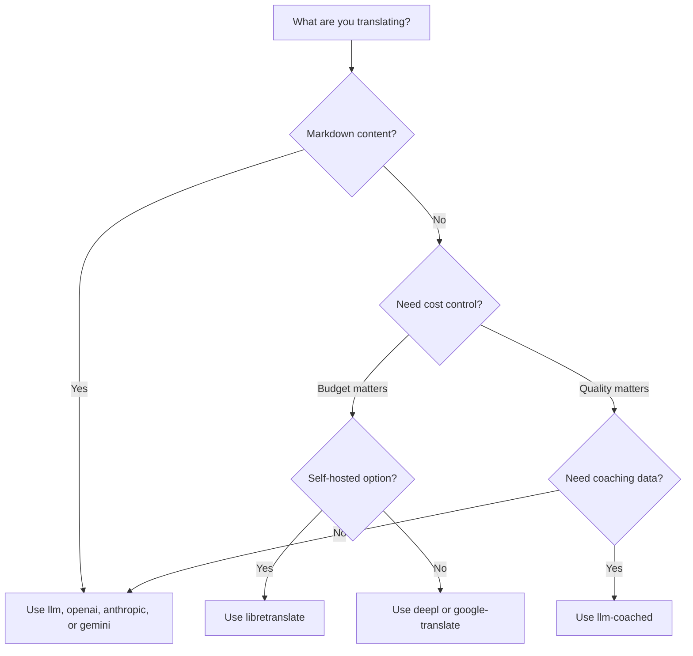

# วิธีการแปล

Champollion รองรับวิธีการแปลหลายรูปแบบ แต่ละคู่ภาษาสามารถใช้วิธีการที่แตกต่างกันได้ — คุณไม่จำเป็นต้องยึดติดกับแนวทางเดียวสำหรับทั้งโปรเจกต์ของคุณ

## การเปรียบเทียบวิธีการ

### ผู้ให้บริการ LLM

เน้นคุณภาพ รองรับ Markdown และการ coaching เหมาะที่สุดสำหรับโปรเจกต์ที่มีเนื้อหาจำนวนมาก

| วิธีการ | Key | สิ่งที่ทำ |
|--------|-----|-------------|
| `llm` (ค่าเริ่มต้น) | `OPENROUTER_API_KEY` | LLM ผ่าน OpenRouter — รองรับ 200+ โมเดล พร้อม auto-routing |
| `llm-coached` | `OPENROUTER_API_KEY` | LLM + กฎไวยากรณ์ พจนานุกรม และหมายเหตุสไตล์ |
| `openai` | `OPENAI_API_KEY` | OpenAI API โดยตรง (gpt-4o, gpt-4o-mini) |
| `anthropic` | `ANTHROPIC_API_KEY` | Anthropic API โดยตรง (Claude Sonnet, Haiku, Opus) |
| `gemini` | `GEMINI_API_KEY` | Google Gemini API โดยตรง (Flash, Pro) — มี free tier |

### MT แบบดั้งเดิม

เน้นความเร็วและต้นทุน เหมาะที่สุดสำหรับคู่ key-value ปริมาณสูง

| วิธีการ | คีย์ | การทำงาน |
|--------|-----|-------------|
| `google-translate` | `GOOGLE_TRANSLATE_API_KEY` | Google Cloud Translation API v2 (194 ภาษา) |
| `deepl` | `DEEPL_API_KEY` | DeepL API พร้อมการรองรับอภิธานศัพท์ (33 ภาษา) |
| `microsoft-translator` | `MICROSOFT_TRANSLATOR_API_KEY` | Azure Cognitive Services Translator (135 ภาษา) |
| `libretranslate` | *(โฮสต์เอง)* | LibreTranslate แบบโฮสต์เอง (AGPL, ฟรี) |
| `tilde` | `TILDE_API_KEY` | Tilde MT — เอนจินที่พัฒนาโดย EU โดดเด่นในกลุ่มภาษาบอลติกและยุโรป |
| `translated` | `LARA_ACCESS_KEY_ID` + `LARA_ACCESS_KEY_SECRET` | Translated's Lara — MT แบบปรับตัวได้ระดับมืออาชีพ (200 ภาษา) |

### โครงสร้างพื้นฐาน

| วิธีการ | Key | สิ่งที่ทำ |
|--------|-----|-------------|
| `api` | *(ตามผู้ให้บริการ)* | HTTP client แบบบางสำหรับ REST endpoint การแปลใดก็ได้ |

## แผนผังการตัดสินใจ



---

## `llm` — การแปลด้วย LLM (ค่าเริ่มต้น)

แปลผ่าน LLM ใดก็ได้บน [OpenRouter](https://openrouter.ai) นี่คือวิธีการเริ่มต้นและมีความยืดหยุ่นสูงที่สุด

**วิธีการทำงาน:**
1. จัดกลุ่ม key (ค่าเริ่มต้น 80 key/กลุ่ม) พร้อมคำสั่ง register และ context
2. ส่งไปยัง OpenRouter เป็น structured prompt
3. แยกวิเคราะห์ JSON response
4. ตรวจสอบการแปลแต่ละรายการผ่าน [quality gate](/docs/concepts/quality-gate)
5. บันทึกการแปลที่ผ่าน ลองใหม่หรือปฏิเสธรายการที่ล้มเหลว

**เมื่อใดควรใช้:** เหมาะสำหรับโปรเจกต์ส่วนใหญ่ โดยเฉพาะเว็บไซต์ที่มีเนื้อหา Markdown จำนวนมาก ซึ่ง code block และ shortcode จำเป็นต้องได้รับการป้องกัน

**การกำหนดค่า:**

```json
{
  "defaultMethod": "llm",
  "model": "google/gemini-3.5-flash"
}
```

## `llm-coached` — การแปลด้วย LLM แบบ Coached

เหมือนกับ `llm` แต่มีการฉีดกฎไวยากรณ์ พจนานุกรมคำศัพท์ และหมายเหตุสไตล์เข้าไปใน prompt ทุกครั้ง

**วิธีการทำงาน:**
1. โหลดข้อมูล coaching จาก `.champollion/coaching/<locale>.json` หรือไดเรกทอรี `coaching/` ของ plugin
2. ฉีดกฎไวยากรณ์ คำศัพท์จากพจนานุกรม และหมายเหตุสไตล์เข้าไปใน system prompt
3. คำศัพท์จากพจนานุกรมที่ตรงกับ source key จะถูกรวมเป็นคำศัพท์บังคับ
4. การแปลดำเนินการเหมือนกับ `llm` โดยข้อมูล coaching ช่วยเพิ่มความแม่นยำ

**เมื่อใดควรใช้:** ภาษาที่มีทรัพยากรน้อย คำศัพท์เฉพาะทาง (กฎหมาย การแพทย์) ภาษาทางการ หรือกรณีที่ผลลัพธ์จาก LLM ทั่วไปไม่แม่นยำเพียงพอ

**รูปแบบข้อมูล coaching:**

```json title=".champollion/coaching/fr.json"
{
  "grammar_rules": [
    "French adjectives agree in gender and number with the noun they modify",
    "Use 'vous' for formal contexts, 'tu' for informal"
  ],
  "dictionary": {
    "dashboard": "tableau de bord",
    "deployment": "déploiement",
    "settings": "paramètres"
  },
  "style_notes": "Prefer active voice. Avoid anglicisms where a native French term exists."
}
```

ดูเพิ่มเติม: [คู่มือภาษาที่มีทรัพยากรน้อย](/docs/network/community/low-resource-languages)

---

## `openai` — OpenAI API โดยตรง

แปลโดยตรงผ่าน OpenAI Chat Completions API โดยไม่ผ่าน OpenRouter — ใช้ key ของคุณเอง บัญชีของคุณเอง และ dashboard การใช้งานของคุณเอง

**โมเดล:** `gpt-4o` (ค่าเริ่มต้น), `gpt-4o-mini`

**คุณสมบัติ:**
- ✅ รองรับ Markdown (การแปลเนื้อหา)
- ✅ รองรับ coaching (กฎไวยากรณ์ การแทนที่คำจากพจนานุกรม หมายเหตุสไตล์)
- ✅ JSON mode สำหรับ output แบบ key-value ที่มีโครงสร้าง
- ✅ Exponential backoff พร้อม retry

**การกำหนดค่า:**

```json
{
  "pairs": {
    "en:fr": { "method": "openai", "model": "gpt-4o-mini" }
  }
}
```

```bash
export OPENAI_API_KEY=sk-proj-...
```

รับ key ของคุณได้ที่ [platform.openai.com/api-keys](https://platform.openai.com/api-keys)

## `anthropic` — Anthropic API โดยตรง

แปลโดยตรงผ่าน Anthropic Messages API ใช้พารามิเตอร์ `system` สำหรับข้อมูล coaching เพื่อเปิดใช้งาน prompt caching ของ Anthropic

**โมเดล:** `claude-sonnet-4-6` (ค่าเริ่มต้น), `claude-haiku-4-5`, `claude-opus-4-7`

**คุณสมบัติ:**
- ✅ รองรับ Markdown (การแปลเนื้อหา)
- ✅ รองรับ coaching (กฎไวยากรณ์ การแทนที่คำจากพจนานุกรม หมายเหตุสไตล์)
- ✅ System prompt caching (กระจายต้นทุน coaching ข้ามหลาย batch)
- ✅ Exponential backoff พร้อม retry

**การกำหนดค่า:**

```json
{
  "pairs": {
    "en:ja": { "method": "anthropic", "model": "claude-haiku-4-5" }
  }
}
```

```bash
export ANTHROPIC_API_KEY=sk-ant-...
```

รับ key ของคุณได้ที่ [console.anthropic.com](https://console.anthropic.com/settings/keys)

## `gemini` — Google Gemini API โดยตรง

แปลโดยตรงผ่าน Google Gemini `generateContent` API **มี free tier** — จุดเริ่มต้นที่ดีที่สุดสำหรับการใช้งานโดยไม่มีค่าใช้จ่าย

**โมเดล:** `gemini-2.5-flash` (ค่าเริ่มต้น), `gemini-2.5-pro`

**คุณสมบัติ:**
- ✅ รองรับ Markdown (การแปลเนื้อหา)
- ✅ รองรับ coaching (กฎไวยากรณ์ การแทนที่คำจากพจนานุกรม หมายเหตุสไตล์)
- ✅ JSON response mode ผ่าน `responseMimeType`
- ✅ Free tier (โควต้ารายวันที่ใจกว้าง)
- ✅ Exponential backoff พร้อม retry

**การกำหนดค่า:**

```json
{
  "pairs": {
    "en:ko": { "method": "gemini", "model": "gemini-2.5-pro" }
  }
}
```

```bash
export GEMINI_API_KEY=AI...
```

รับ key ของคุณได้ที่ [aistudio.google.com/apikey](https://aistudio.google.com/apikey)

### การตรวจสอบโมเดล {#model-validation}

ผู้ให้บริการ LLM โดยตรง (`openai`, `anthropic`, `gemini`) จะตรวจสอบ string โมเดลของคุณในการใช้งานครั้งแรก ซึ่งช่วยตรวจจับข้อผิดพลาดสามประเภท:

**รูปแบบวิธีการไม่ถูกต้อง** — การใช้ path โมเดลแบบ OpenRouter กับผู้ให้บริการโดยตรง:

```
[WARN] OpenAI: model "google/gemini-3.5-flash" looks like an OpenRouter path.
       Direct providers use bare model names (e.g., "gpt-4o").
       To use OpenRouter models, set method to 'llm' instead.
```

**ผู้ให้บริการไม่ถูกต้อง** — การใช้โมเดลจากผู้ให้บริการอื่น:

```
[WARN] Gemini: model "claude-sonnet-4-6" is an Anthropic model.
       This provider (gemini) cannot serve Anthropic models.
       Use --method anthropic or set "method": "anthropic" in config.
```

**โมเดลที่เลิกใช้แล้วหรือสะกดผิด** — เมื่อเรียก API ครั้งแรก champollion จะดึงรายการโมเดลล่าสุดจากผู้ให้บริการและตรวจสอบโมเดลของคุณกับรายการนั้น:

```
[WARN] Gemini: model "gemini-1.5-flash" not found in available models.
       Similar models: gemini-2.0-flash, gemini-2.5-flash, gemini-2.5-pro
       The API call will proceed — the provider will give the final verdict.
```

:::note[นี่คือคำเตือน ไม่ใช่ข้อผิดพลาด]
การตรวจสอบ model จะบันทึกคำเตือนแต่ไม่บล็อกการเรียก API ผู้ให้บริการ API เป็นผู้ตัดสินขั้นสุดท้าย — ชื่อ model ในอนาคตอาจตรงกับรูปแบบที่แตกต่างออกไป และเราไม่ต้องการให้ heuristics เป็นตัวกำหนดเงื่อนไข
:::

---

## `google-translate` — Google Cloud Translation API

การผสานรวมโดยตรงกับ Google Cloud Translation API v2 ใช้ REST API — ไม่ต้องใช้ SDK หรือ service account เพียงแค่ API key

**เมื่อใดที่ควรใช้:** คู่สตริงแบบ key-value จำนวนมากที่ความเร็วและต้นทุนมีความสำคัญมากกว่าความละเอียดอ่อนของภาษา รองรับ 194 ภาษาตั้งแต่เริ่มต้น ([รายชื่อที่เผยแพร่โดย Google](https://docs.cloud.google.com/translate/docs/languages))

**ข้อจำกัด:**
- ⚠️ **ไม่รองรับ Markdown** จะทำให้ code block, shortcode และตัวแปร interpolation เสียหาย
- ไม่มีการควบคุม register/tone
- ไม่มี coaching หรือการบังคับใช้คำศัพท์

```bash
npx champollion sync --method google-translate
```

:::tip[การตรวจจับอัตโนมัติ]
หากตั้งค่าเฉพาะ `GOOGLE_TRANSLATE_API_KEY` (ไม่มี OpenRouter key) champollion จะสลับไปใช้ Google Translate โดยอัตโนมัติ ไม่จำเป็นต้องเปลี่ยนการตั้งค่าใดๆ
:::

## `deepl` — DeepL API

การผสานรวมโดยตรงกับ DeepL translation API รองรับ glossary สำหรับคำศัพท์ที่สอดคล้องกัน

**เมื่อใดควรใช้:** ภาษายุโรปที่ DeepL เชี่ยวชาญ (เยอรมัน ฝรั่งเศส สเปน ดัตช์ โปแลนด์ ฯลฯ) การรองรับ glossary ช่วยบังคับใช้คำศัพท์ที่สอดคล้องกันโดยไม่ต้องใช้ข้อมูล coaching

**คุณสมบัติ:**
- ✅ ตรวจจับ endpoint แบบ free/pro โดยอัตโนมัติ (suffix `:fx` บน free key)
- ✅ การสร้างและจัดการ glossary
- ✅ การควบคุมระดับความเป็นทางการ
- ⚠️ **ไม่รองรับ Markdown** — เฉพาะคู่ key-value เท่านั้น

**การกำหนดค่า:**

```json
{
  "pairs": {
    "en:de": { "method": "deepl" }
  }
}
```

```bash
export DEEPL_API_KEY=your-key-here
```

รับ key ของคุณได้ที่ [deepl.com/pro-api](https://www.deepl.com/pro-api)

## `microsoft-translator` — Azure Cognitive Services

การผสานรวมโดยตรงกับ Microsoft Translator Text API v3

**เมื่อใดที่ควรใช้:** สภาพแวดล้อมระดับองค์กรที่มีโครงสร้างพื้นฐานของ Azure อยู่แล้ว รองรับ 135 ภาษา รวมถึงบางภาษาที่ Google Translate ไม่ครอบคลุม (ภาษาทิเบต, ภาษาแฟโร, ภาษาอินุกติตุต และอื่นๆ)

**คุณสมบัติ:**
- ✅ รองรับสูงสุด 100 segment ต่อ request (throughput สูง)
- ✅ พารามิเตอร์ region แบบเลือกได้สำหรับการปรับ latency
- ⚠️ **ไม่รองรับ Markdown** — เฉพาะคู่ key-value เท่านั้น
- ⚠️ **ไม่รองรับการแปลเนื้อหา** — เฉพาะคู่ key-value เท่านั้น

**การกำหนดค่า:**

```json
{
  "pairs": {
    "en:ar": { "method": "microsoft-translator" }
  }
}
```

```bash
export MICROSOFT_TRANSLATOR_API_KEY=your-key
export MICROSOFT_TRANSLATOR_REGION=global  # optional
```

รับ key ของคุณได้จาก [Azure Portal](https://portal.azure.com) → Cognitive Services → Translator

## `libretranslate` — การแปลแบบ Self-Hosted

การแปลแบบ open-source ที่ host เอง โดยใช้ LibreTranslate รันในเครื่องหรือบนโครงสร้างพื้นฐานของคุณเอง — ไม่มีค่าใช้จ่าย API และข้อมูลอยู่ในความควบคุมของคุณอย่างสมบูรณ์

**เมื่อใดควรใช้:** โปรเจกต์ที่ต้องการการแปลแบบออฟไลน์ การปฏิบัติตามข้อกำหนดความเป็นส่วนตัวของข้อมูล (GDPR) หรือการดำเนินงานโดยไม่มีค่าใช้จ่าย มีประโยชน์อย่างยิ่งสำหรับ CI pipeline ที่ไม่ควรพึ่งพา API ภายนอก

**คุณสมบัติ:**
- ✅ Self-hosted — ไม่มีการเรียก API ภายนอก
- ✅ ฟรีและ open source (AGPL-3.0)
- ✅ รองรับการ deploy ด้วย Docker
- ⚠️ **ไม่รองรับ Markdown** — เฉพาะคู่ key-value เท่านั้น
- ⚠️ **ไม่รองรับการแปลเนื้อหา** — เฉพาะคู่ key-value เท่านั้น
- ⚠️ คุณภาพแตกต่างกันตามคู่ภาษา

**การตั้งค่า:**

```bash
# Run LibreTranslate locally with Docker
docker run -d -p 5000:5000 libretranslate/libretranslate

# Configure (optional — defaults to localhost:5000)
export LIBRETRANSLATE_API_URL=http://localhost:5000/translate
```

```json
{
  "pairs": {
    "en:es": { "method": "libretranslate" }
  }
}
```

---

## `api` — Remote Translation API

HTTP client แบบบางสำหรับ endpoint การแปลที่ host โดยชุมชนหรือที่ได้รับการคุ้มครองทรัพย์สินทางปัญญา Champollion ส่ง key ออกไปและรับการแปลกลับมา — ไม่มี logic การแปลอยู่ภายใน

**เมื่อใดควรใช้:** เมื่อวิธีการแปลถูก host ฝั่ง server (เช่น ข้อมูล coaching ที่เป็นกรรมสิทธิ์ โมเดลที่ fine-tune แล้ว หรือ FST pipeline ที่ไม่สามารถแจกจ่ายได้)

```json
{
  "pairs": {
    "en:crk": {
      "method": "api",
      "endpoint": "https://api.example.com/v1/translate",
      "apiKey": "your-key"
    }
  }
}
```

:::note[การแปลที่ควบคุมโดยชุมชน (มุ่งสู่อธิปไตยทางข้อมูล)]
วิธีการ `api` เป็นสะพานเชื่อมไปสู่ **การแปลที่โฮสต์โดยชุมชนภายใต้การควบคุมของชุมชน (มุ่งสู่อธิปไตยทางข้อมูล)** ชุมชนชนพื้นเมืองและชุมชนภาษาชนกลุ่มน้อยสามารถโฮสต์เอ็นด์พอยต์การแปลของตนเองได้ — โดยเก็บรักษาข้อมูลการฝึกสอน โมเดลที่ปรับแต่งอย่างละเอียด และทรัพย์สินทางปัญญาด้านภาษาไว้ภายใต้การควบคุมของชุมชน — ในขณะที่ Champollion จะเชื่อมต่อกับระบบเหล่านี้ในฐานะ thin client

ดู [การสนับสนุนภาษาที่มีทรัพยากรน้อย](/docs/network/community/low-resource-languages) สำหรับคำแนะนำการ host โดยชุมชนฉบับสมบูรณ์ และ [การให้บริการวิธีการผ่าน API](/docs/guides/serving-a-method) สำหรับข้อกำหนด endpoint
:::

---

## การกำหนดค่าแบบรายคู่

พลังที่แท้จริงอยู่ที่การผสมวิธีการตามคู่ภาษา:

```json title="champollion.config.json"
{
  "version": 3,
  "pairs": {
    "en:fr": { "method": "deepl" },
    "en:ja": { "method": "openai", "model": "gpt-4o" },
    "en:ko": { "method": "gemini" },
    "en:ar": { "method": "microsoft-translator" },
    "en:crk": { "methodPlugin": "crk-coached-v1" }
  }
}
```

การกำหนดค่านี้แปลภาษาฝรั่งเศสผ่าน DeepL (รองรับ glossary) ญี่ปุ่นผ่าน OpenAI (คุณภาพ) เกาหลีผ่าน Gemini (free tier) อาหรับผ่าน Microsoft Translator (ครอบคลุม) และ Plains Cree ผ่าน plugin แบบ coached (เฉพาะทาง)

## Plugins

Plugin คือสูตรการแปลที่บรรจุไว้ล่วงหน้าสำหรับคู่ภาษาเฉพาะ เป็น JSON manifest — ไม่ใช่โค้ด — ที่บอก champollion ว่าจะใช้วิธีการใด ด้วยการตั้งค่าอะไร และคุณภาพที่ผ่านการ benchmark มาแล้ว

:::tip[จาก eval harness สู่ production ด้วยคำสั่งเดียว]
Plugin ที่พัฒนาและพิสูจน์แล้วใน [eval harness](/docs/network/specifications/harness) สามารถติดตั้งได้โดยตรง — method ที่คุณตรวจสอบที่นั่นสามารถ deploy ได้ที่นี่ด้วยคำสั่ง `plugin install` เพียงคำสั่งเดียว ดู [MT Evaluation](/docs/network/leaderboard/rules) สำหรับขั้นตอนการประเมินผลแบบครบถ้วน
:::

```bash
champollion plugin install ./french-formal-v1/
champollion plugin list
champollion plugin remove french-formal-v1
```

ดู [Plugin Specification](/docs/reference/plugin-spec) สำหรับรูปแบบ manifest ฉบับสมบูรณ์

---

## การสลับผู้ให้บริการ

ต้องการย้ายระหว่างวิธีการ? รูปแบบโมเดลและ env var จะเปลี่ยน — นี่คือแผนที่:

### OpenRouter → ผู้ให้บริการโดยตรง

```diff title="champollion.config.json"
 {
   "pairs": {
     "en:fr": {
-      "method": "llm",
-      "model": "openai/gpt-4o"
+      "method": "openai",
+      "model": "gpt-4o"
     }
   }
 }
```

```diff title="Environment variables"
- export OPENROUTER_API_KEY=sk-or-v1-...
+ export OPENAI_API_KEY=sk-proj-...
```

**ความแตกต่างหลัก:**
- OpenRouter ใช้รูปแบบ `provider/model` (เช่น `openai/gpt-4o`) ผู้ให้บริการโดยตรงใช้ชื่อโมเดลแบบเรียบ (เช่น `gpt-4o`)
- ผู้ให้บริการโดยตรงแต่ละรายมี env var ของตนเอง (`OPENAI_API_KEY`, `ANTHROPIC_API_KEY`, `GEMINI_API_KEY`)
- หากคุณใช้รูปแบบโมเดลที่ไม่ถูกต้อง champollion จะแจ้งเตือนคุณ — ดู [การตรวจสอบโมเดล](#model-validation)

### ผู้ให้บริการโดยตรง → OpenRouter

```diff title="champollion.config.json"
 {
   "pairs": {
     "en:ja": {
-      "method": "anthropic",
-      "model": "claude-sonnet-4-6"
+      "method": "llm",
+      "model": "anthropic/claude-sonnet-4-6"
     }
   }
 }
```

:::tip[เมื่อใดควรใช้ OpenRouter และเมื่อใดควรใช้ Direct]
**ใช้ OpenRouter** เมื่อต้องการสลับระหว่าง model โดยไม่ต้องเปลี่ยน env vars หรือเมื่อต้องการเข้าถึง model กว่า 200 รายการจาก key เดียว **ใช้ผู้ให้บริการโดยตรง** เมื่อต้องการการเรียกเก็บเงินที่เรียบง่ายกว่า, latency ที่ต่ำกว่า (ไม่มีตัวกลาง) หรือต้องการเข้าถึงฟีเจอร์เฉพาะของผู้ให้บริการ เช่น prompt caching ของ Anthropic
:::

---

## การเปรียบเทียบต้นทุน

ต้นทุนโดยประมาณต่อ 1,000 key ที่แปล (สมมติ ~10 token ต่อ key, 80 key ต่อ batch):

| วิธีการ | ต้นทุน / 1K Key | ความเร็ว | คุณภาพ | เหมาะสำหรับ |
|--------|----------------|-------|---------|----------|
| `gemini` (Flash) | **ฟรี** (ภายใน tier) | เร็ว | ดี | เริ่มต้นใช้งาน โปรเจกต์ส่วนตัว |
| `google-translate` | ~$0.02 | เร็วที่สุด | พอใช้ | ปริมาณสูง ภาษายุโรป |
| `deepl` | ~$0.02 | เร็ว | ดี | ภาษายุโรป คำศัพท์เฉพาะ |
| `microsoft-translator` | ~$0.01 | เร็ว | พอใช้ | สภาพแวดล้อม Azure ครอบคลุมภาษาหลากหลาย |
| `libretranslate` | **ฟรี** (self-hosted) | แตกต่างกัน | พอใช้ | Air-gapped, GDPR, CI pipeline |
| `gemini` (Pro) | ~$0.07 | ปานกลาง | ดีมาก | เน้นคุณภาพ มีโควต้าฟรี |
| `openai` (GPT-4o-mini) | ~$0.01 | เร็ว | ดี | LLM ประหยัดงบ |
| `openai` (GPT-4o) | ~$0.10 | ปานกลาง | ดีมาก | เน้นคุณภาพ |
| `anthropic` (Haiku) | ~$0.01 | เร็ว | ดี | LLM ประหยัดงบ |
| `anthropic` (Sonnet) | ~$0.10 | ปานกลาง | ดีมาก | เน้นคุณภาพ |
| `anthropic` (Opus) | ~$0.50 | ช้า | ยอดเยี่ยม | คุณภาพสูงสุด |
| `llm` (OpenRouter) | แตกต่างตามโมเดล | แตกต่างกัน | แตกต่างกัน | เปรียบเทียบโมเดล ทดลองใช้งาน |

:::note[นี่คือการประมาณการเท่านั้น]
ค่าใช้จ่ายจริงขึ้นอยู่กับความยาวของข้อความต้นฉบับ, ขนาด batch และการเปลี่ยนแปลงราคาของผู้ให้บริการ โปรดตรวจสอบหน้าราคาปัจจุบันของผู้ให้บริการแต่ละรายเพื่อดูอัตราที่แน่นอน
:::

---

## ดูเพิ่มเติม

- [ภาษาที่รองรับ](/docs/reference/supported-languages)
- [ข้อมูล Coaching](/docs/concepts/coaching-data)
- [การสนับสนุนภาษาที่มีทรัพยากรน้อย](/docs/network/community/low-resource-languages)
- [Plugin Specification](/docs/reference/plugin-spec)
- [การให้บริการวิธีการผ่าน API](/docs/guides/serving-a-method)
- [Quality Gate](/docs/concepts/quality-gate)
- [สถาปัตยกรรม](/docs/concepts/architecture)
- [การแก้ไขปัญหา](/docs/guides/troubleshooting) — ข้อผิดพลาดโมเดล ปัญหา API
