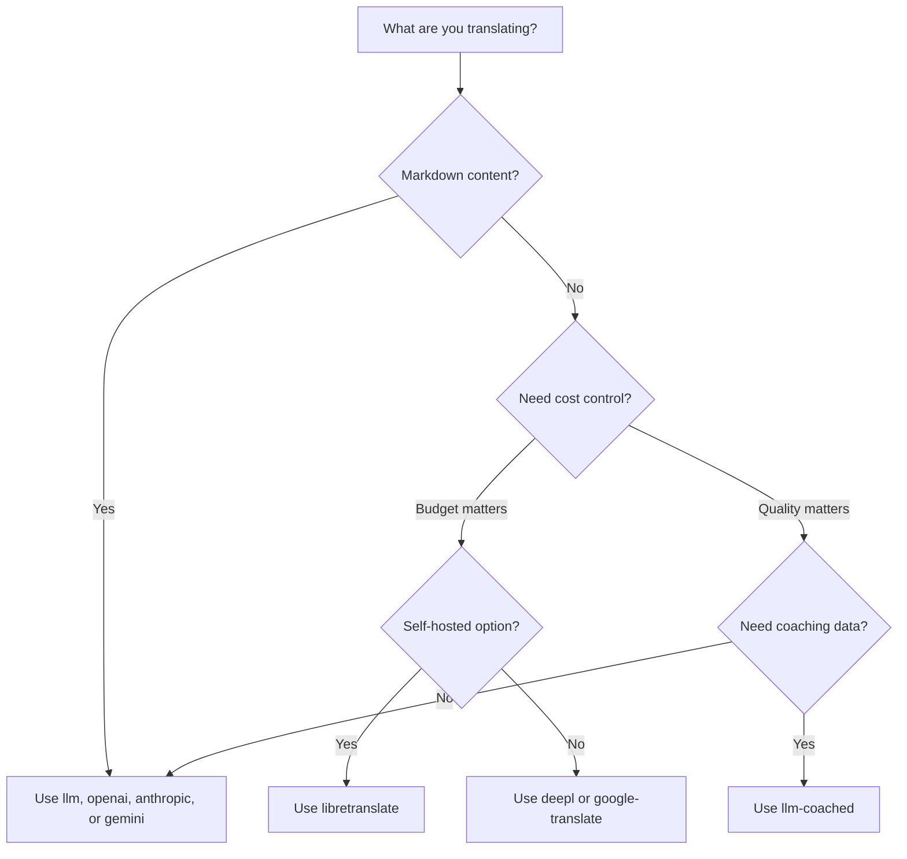

# วิธีการแปล

Champollion รองรับวิธีการแปลหลายวิธี แต่ละคู่ภาษาสามารถใช้วิธีการที่แตกต่างกันได้ คุณจึงไม่ถูกจำกัดอยู่กับแนวทางเดียวสำหรับทั้งโปรเจกต์ของคุณ

## การเปรียบเทียบวิธีการ

### ผู้ให้บริการ LLM

เน้นคุณภาพ รองรับ Markdown และการ coaching เหมาะที่สุดสำหรับโปรเจกต์ที่มีเนื้อหาจำนวนมาก

| วิธีการ | คีย์ | การทำงาน |
|--------|-----|-------------|
| `llm` (ค่าเริ่มต้น) | `OPENROUTER_API_KEY` | LLM ผ่าน OpenRouter — กว่า 200+ โมเดล พร้อมระบบกำหนดเส้นทางอัตโนมัติ (auto-routing) |
| `llm-coached` | `OPENROUTER_API_KEY` | LLM + กฎไวยากรณ์ พจนานุกรม และหมายเหตุด้านสไตล์ |
| `openai` | `OPENAI_API_KEY` | OpenAI API โดยตรง (gpt-4o, gpt-4o-mini) |
| `anthropic` | `ANTHROPIC_API_KEY` | Anthropic API โดยตรง (Claude Sonnet, Haiku, Opus) |
| `gemini` | `GEMINI_API_KEY` | Google Gemini API โดยตรง (Flash, Pro) — แพ็กเกจฟรี (free tier) |
| `local` | *(ไม่มี)* | โมเดลบนเครื่องหรือเซิร์ฟเวอร์ของคุณเอง: Ollama, vLLM, LM Studio, llama.cpp หรือโมเดลที่คุณเทรนด้วย `nmt-forge` ข้อความจะไม่หลุดออกจากโครงสร้างพื้นฐานของคุณ |

### MT แบบดั้งเดิม

เน้นความเร็วและต้นทุน เหมาะที่สุดสำหรับคู่ key-value ปริมาณสูง

| วิธีการ | คีย์ | การทำงาน |
|--------|-----|-------------|
| `google-translate` | `GOOGLE_TRANSLATE_API_KEY` | Google Cloud Translation API v2 (194 ภาษา) |
| `deepl` | `DEEPL_API_KEY` | DeepL API พร้อมการรองรับคลังคำศัพท์ (glossary) (33 ภาษา) |
| `microsoft-translator` | `MICROSOFT_TRANSLATOR_API_KEY` | Azure Cognitive Services Translator (135 ภาษา) |
| `libretranslate` | *(โฮสต์เอง)* | LibreTranslate โฮสต์เอง (AGPL, ฟรี) |
| `tilde` | `TILDE_API_KEY` | Tilde MT — เอนจินที่พัฒนาในสหภาพยุโรป เชี่ยวชาญภาษาในกลุ่มบอลติกและยุโรป |
| `translated` | `LARA_ACCESS_KEY_ID` + `LARA_ACCESS_KEY_SECRET` | Lara จาก Translated — adaptive MT ระดับมืออาชีพ (200 ภาษา) |

### โครงสร้างพื้นฐาน

| วิธีการ | Key | สิ่งที่ทำ |
|--------|-----|-------------|
| `api` | *(ตามผู้ให้บริการ)* | HTTP client แบบบางสำหรับ REST endpoint การแปลใดก็ได้ |

## แผนผังการตัดสินใจ


```mermaid
flowchart TD
    A["What are you translating?"] --> B{"Markdown content?"}
    B -->|Yes| C["Use llm, openai, anthropic, or gemini"]
    B -->|No| D{"Need cost control?"}
    D -->|Budget matters| E{"Self-hosted option?"}
    D -->|Quality matters| F{"Need coaching data?"}
    E -->|Yes| G["Use libretranslate"]
    E -->|No| H["Use deepl or google-translate"]
    F -->|Yes| I["Use llm-coached"]
    F -->|No| C
```

---

## `llm` — การแปลด้วย LLM (ค่าเริ่มต้น)

แปลผ่าน LLM ใดก็ได้บน [OpenRouter](https://openrouter.ai) นี่คือวิธีการเริ่มต้นและมีความยืดหยุ่นสูงที่สุด

**วิธีการทำงาน:**
1. จัดกลุ่ม key (ค่าเริ่มต้น 80 key/กลุ่ม) พร้อมคำสั่ง register และ context
2. ส่งไปยัง OpenRouter เป็น structured prompt
3. แยกวิเคราะห์ JSON response
4. ตรวจสอบการแปลแต่ละรายการผ่าน [quality gate](/docs/concepts/quality-gate)
5. บันทึกการแปลที่ผ่าน ลองใหม่หรือปฏิเสธรายการที่ล้มเหลว

**เมื่อใดควรใช้:** เหมาะสำหรับโปรเจกต์ส่วนใหญ่ โดยเฉพาะเว็บไซต์ที่มีเนื้อหา Markdown จำนวนมาก ซึ่ง code block และ shortcode จำเป็นต้องได้รับการป้องกัน

**การกำหนดค่า:**

```json
{
  "defaultMethod": "llm",
  "model": "google/gemini-3.8-flash"
}
```

## `llm-coached` — การแปลด้วย LLM แบบ Coached

เหมือนกับ `llm` แต่มีการฉีดกฎไวยากรณ์ พจนานุกรมคำศัพท์ และหมายเหตุสไตล์เข้าไปใน prompt ทุกครั้ง

**วิธีการทำงาน:**
1. โหลดข้อมูล coaching จาก `.champollion/coaching/<locale>.json` หรือไดเรกทอรี `coaching/` ของ plugin
2. ฉีดกฎไวยากรณ์ คำศัพท์จากพจนานุกรม และหมายเหตุสไตล์เข้าไปใน system prompt
3. คำศัพท์จากพจนานุกรมที่ตรงกับ source key จะถูกรวมเป็นคำศัพท์บังคับ
4. การแปลดำเนินการเหมือนกับ `llm` โดยข้อมูล coaching ช่วยเพิ่มความแม่นยำ

**เมื่อใดควรใช้:** ภาษาที่มีทรัพยากรน้อย คำศัพท์เฉพาะทาง (กฎหมาย การแพทย์) ภาษาทางการ หรือกรณีที่ผลลัพธ์จาก LLM ทั่วไปไม่แม่นยำเพียงพอ

**รูปแบบข้อมูล coaching:**

```json title=".champollion/coaching/fr.json"
{
  "grammar_rules": [
    "French adjectives agree in gender and number with the noun they modify",
    "Use 'vous' for formal contexts, 'tu' for informal"
  ],
  "dictionary": {
    "dashboard": "tableau de bord",
    "deployment": "déploiement",
    "settings": "paramètres"
  },
  "style_notes": "Prefer active voice. Avoid anglicisms where a native French term exists."
}
```

ดูเพิ่มเติม: [คู่มือภาษาที่มีทรัพยากรน้อย](/docs/network/community/low-resource-languages)

---

## `openai` — OpenAI API โดยตรง

แปลโดยตรงผ่าน OpenAI Chat Completions API โดยไม่ผ่าน OpenRouter — ใช้ key ของคุณเอง บัญชีของคุณเอง และ dashboard การใช้งานของคุณเอง

**โมเดล:** `gpt-5.4-mini-2026-03-17` (ค่าเริ่มต้น — สแนปช็อตตามวันที่) หรือ model id แบบระบุเจาะจงใด ๆ ที่ OpenAI ระบุไว้

**ฟีเจอร์:**
- ✅ รองรับโครงสร้าง Markdown (สำหรับการแปลเนื้อหา)
- ✅ พรอมต์เดียวกับ `llm` — ระดับภาษา (register), คำแนะนำเรื่องเพศ, บริบทของพรอมต์, ข้อความที่ได้รับการปกป้อง (protected terms), คำแนะนำ `coachingFile` และคำศัพท์จากคลังศัพท์ของแต่ละชุดข้อมูล ([ดูด้านล่าง](#one-prompt-every-llm-method))
- ✅ โหมด JSON สำหรับผลลัพธ์แบบ key-value ที่มีโครงสร้าง
- ✅ Exponential backoff พร้อมการลองใหม่ (retry)

**การกำหนดค่า:**

```json
{
  "pairs": {
    "en:fr": { "method": "openai", "model": "gpt-4o-mini" }
  }
}
```

```bash
export OPENAI_API_KEY=sk-proj-...
```

รับ key ของคุณได้ที่ [platform.openai.com/api-keys](https://platform.openai.com/api-keys)

## `local` — โมเดลของคุณเอง (Ollama, vLLM, LM Studio, โมเดลที่เทรนเอง)

แปลภาษาด้วยโมเดลใดก็ได้ที่อยู่เบื้องหลังเอนด์พอยต์แบบ **OpenAI-compatible** ที่คุณรันอยู่:
Ollama, vLLM, LM Studio, เซิร์ฟเวอร์ของ llama.cpp หรือโมเดลที่คุณเทรนด้วย
`nmt-forge` ไม่จำเป็นต้องใช้คีย์ API และไม่มีข้อความใดถูกส่งไปยังบุคคลที่สาม นี่คือ
วิธีการที่ควรใช้สำหรับข้อความที่มีความละเอียดอ่อน และเป็นวิธีในการปรับใช้โมเดลที่คุณ
สร้างขึ้นเอง

```json
{ "defaultMethod": "local", "model": "llama3.1" }
```

```bash
# Optional: only if your server is not at Ollama's default address
export LOCAL_API_BASE=http://localhost:11434/v1
npx champollion sync --method local
```

ระบบจะอ่านเอนด์พอยต์ตามลำดับดังนี้: `LOCAL_API_BASE`, `OPENAI_API_BASE`,
`OPENAI_BASE_URL` แล้วตามด้วยค่าเริ่มต้นของ Ollama คือ `http://localhost:11434/v1` เมื่อ
เอนด์พอยต์อยู่บนเครื่องนี้ (`localhost`, `127.0.0.1`, `::1`) ค่าใช้จ่ายจะ
แสดงเป็น **$0 API cost (runs on this machine)** — ไม่มีการเรียกเก็บเงินค่า API โดย
ฮาร์ดแวร์และพลังงานไฟฟ้าของคุณเองจะไม่ถูกนำมาคิดคำนวณ — และ `--max-cost` จะอนุญาตให้
การทำงานดำเนินต่อไป สำหรับเอนด์พอยต์อื่น ๆ ทั้งหมด (Groq, Together, เซิร์ฟเวอร์บนเครือข่ายของคุณ) จะถูก
รายงานเป็น **unknown** ไม่ใช่ $0 เนื่องจากเครื่องมือไม่สามารถทราบอัตราค่าบริการ
ได้ ดังนั้น `--max-cost` จึงปฏิเสธแทนที่จะคาดเดาเอาเอง ใน `--json` แถว
การประเมินราคาจะแสดง `"estimatedCost": 0, "local": true` สำหรับกรณีแรก
และ `"estimatedCost": null` สำหรับกรณีที่สอง (พร็อกซีบนเครื่องนี้ที่
ส่งต่อคำขอไปยัง API แบบชำระเงิน — เช่น LiteLLM หรือเกตเวย์ — จะถูกเรียกเก็บเงินที่ต้นทาง ซึ่ง
Champollion ไม่สามารถมองเห็นได้: โปรดจัดสรรงบประมาณส่วนนั้นไว้ที่นั่น)

ก่อนเริ่มการแปล คำสั่ง sync จะตรวจสอบว่ามีเซิร์ฟเวอร์ตอบรับที่เอนด์พอยต์หรือไม่ หาก
ไม่มีการตอบรับ การรันที่จะต้องส่งข้อมูลจะหยุดทำงานก่อนที่จะส่งสิ่งใดไป
(exit `1`) พร้อมระบุแอดเดรส ส่วนการรันที่ไม่ต้องส่งข้อมูลใด ๆ เลย — เช่น ไม่มีงาน
ในคิว หรือทุกคีย์ในคิวดึงมาจากแคช เช่น การทำซ้ำข้อความที่
เคยแปลไปแล้ว — จะแจ้งเตือนว่าเซิร์ฟเวอร์ไม่พร้อมใช้งานแล้วดำเนินการต่อ บนตัวรัน CI
(เมื่อมีการตั้งค่า `CI` หรือ `GITHUB_ACTIONS`) เซิร์ฟเวอร์ที่ไม่ตอบสนองจะหยุดการรันทุกครั้ง แม้กระทั่งการรันที่
ไม่มีสิ่งใดในคิว เพื่อให้เวิร์กโฟลว์ที่ยังคงใช้ `local` ล้มเหลวตั้งแต่การ
พุชครั้งแรก แทนที่จะไปล้มเหลวตอนที่มีการแก้ไขสตริง ([คู่มือ CI](/docs/guides/ci-cd))

วิธีการ `openai` รองรับการแทนที่ค่า `OPENAI_API_BASE` / `OPENAI_BASE_URL`
แบบเดียวกันเพื่อเชื่อมต่อไปยังผู้ให้บริการที่รองรับ OpenAI ใด ๆ (Groq, Together, …) โดยใช้
คีย์

## `anthropic` — Anthropic API โดยตรง

แปลภาษาโดยตรงผ่าน Anthropic Messages API โดยจะส่งคำสั่งต่าง ๆ ไปในพารามิเตอร์ `system` ซึ่งช่วยเปิดใช้งาน prompt caching ของ Anthropic

**โมเดล:** `claude-sonnet-4-6` (ค่าเริ่มต้น), `claude-haiku-4-5`, `claude-opus-4-7`

**ฟีเจอร์:**
- ✅ รองรับโครงสร้าง Markdown (สำหรับการแปลเนื้อหา)
- ✅ พรอมต์เดียวกับ `llm` — ระดับภาษา (register), คำแนะนำเรื่องเพศ, บริบทของพรอมต์, ข้อความที่ได้รับการปกป้อง (protected terms), คำแนะนำ `coachingFile` และคำศัพท์จากคลังศัพท์ของแต่ละชุดข้อมูล ([ดูด้านล่าง](#one-prompt-every-llm-method))
- ✅ แคชระบบพรอมต์ (System prompt caching) (เฉลี่ยค่าใช้จ่ายของคำสั่งครอบคลุมหลายชุดข้อมูล)
- ✅ Exponential backoff พร้อมการลองใหม่ (retry)

**การกำหนดค่า:**

```json
{
  "pairs": {
    "en:ja": { "method": "anthropic", "model": "claude-haiku-4-5" }
  }
}
```

```bash
export ANTHROPIC_API_KEY=sk-ant-...
```

รับ key ของคุณได้ที่ [console.anthropic.com](https://console.anthropic.com/settings/keys)

## `gemini` — Google Gemini API โดยตรง

แปลโดยตรงผ่าน Google Gemini `generateContent` API **มี free tier** — จุดเริ่มต้นที่ดีที่สุดสำหรับการใช้งานโดยไม่มีค่าใช้จ่าย

**โมเดล:** `gemini-3.8-flash` (ค่าเริ่มต้น) หรือ model id แบบระบุเจาะจงใด ๆ ที่ Google ระบุไว้

**ฟีเจอร์:**
- ✅ รองรับโครงสร้าง Markdown (สำหรับการแปลเนื้อหา)
- ✅ พรอมต์เดียวกับ `llm` — ระดับภาษา (register), คำแนะนำเรื่องเพศ, บริบทของพรอมต์, ข้อความที่ได้รับการปกป้อง (protected terms), คำแนะนำ `coachingFile` และคำศัพท์จากคลังศัพท์ของแต่ละชุดข้อมูล ([ดูด้านล่าง](#one-prompt-every-llm-method))
- ✅ โหมดการตอบกลับแบบ JSON ผ่าน `responseMimeType`
- ✅ แพ็กเกจฟรี (free tier) (โควตารายวันขนาดใหญ่)
- ✅ Exponential backoff พร้อมการลองใหม่ (retry)

**การกำหนดค่า:**

```json
{
  "pairs": {
    "en:ko": { "method": "gemini", "model": "gemini-2.5-pro" }
  }
}
```

```bash
export GEMINI_API_KEY=AI...
```

รับ key ของคุณได้ที่ [aistudio.google.com/apikey](https://aistudio.google.com/apikey)

### พรอมต์เดียว สำหรับทุกวิธีการแบบ LLM {#one-prompt-every-llm-method}

`llm`, `openai`, `anthropic`, `gemini` และ `local` ส่งคำสั่งชุดเดียวกัน
สำหรับโปรเจกต์เดียวกัน แตกต่างกันเพียงปลายทางที่ส่งคำขอไปเท่านั้น ข้อความระบบ (system message)
จะประกอบด้วยระดับภาษา, คำแนะนำเรื่องเพศของภาษานั้น ๆ, `promptContext` ของคุณ,
`protectedTerms` ของคุณ และข้อความ `coachingFile` ของคุณ ส่วนข้อความของแต่ละชุดข้อมูล (batch)
จะระบุคำศัพท์จากคลังศัพท์ที่ปรากฏอยู่ในชุดนั้น (`dictionary` ใน
`.champollion/coaching/<locale>.json`), คำสั่งเฉพาะของแต่ละคีย์ (รูปพหูพจน์,
gettext context, คำอธิบาย) และสตริงต่าง ๆ คุณสามารถตรวจสอบได้ด้วยตนเองโดย
จะไม่มีการส่งข้อมูลใด ๆ ออกไป:

```bash
npx champollion sync --dry --method local --show-prompt
```

กฎไวยากรณ์และหมายเหตุด้านสไตล์ในไฟล์ coaching จะถูกอ่านโดย `llm-coached`
ไม่ว่าจะใช้ผู้ให้บริการรายใด: `{ "method": "llm-coached", "provider": "openai" }`

### ชื่อโมเดล {#model-names}

ผู้ให้บริการโดยตรงจะได้รับชื่อโมเดลตามรูปแบบของตนเอง id ในรูปแบบของ OpenRouter
จะถูกจับคู่เมื่อผู้ให้บริการมีโมเดลนั้น: `openai/gpt-5.5` → `gpt-5.5` บน `openai`,
`anthropic/claude-haiku-4.5` → `claude-haiku-4-5` บน `anthropic`,
`google/gemini-3.8-flash` → `gemini-3.8-flash` บน `gemini` หากเป็น id ที่ผู้ให้บริการ
ไม่มีโมเดลดังกล่าว การรันจะหยุดลงก่อนที่จะมีการส่งสิ่งใดออกไป:

```
[ERR] sync failed: en:fr: model "google/gemini-3.8-flash" (from the top-level "model") is an OpenRouter model id
      — openai calls OpenAI directly, which has no model by that name. Use an OpenAI model (e.g. --model gpt-4o),
      --method gemini (its name for it: "gemini-3.8-flash") or --method llm to run it through OpenRouter.
```

`local` และ `openai` ที่ชี้ไปยังเซิร์ฟเวอร์อื่นด้วย `OPENAI_API_BASE` จะส่ง
ชื่อตามที่คุณเขียนไว้ทุกประการ — เซิร์ฟเวอร์ดังกล่าวจะเป็นผู้กำหนดความหมายของชื่อนั้นเอง

### สลัก (Slug) ที่ระบุเจาะจงเท่านั้น {#exact-slugs}

ทุกโมเดลจะต้องระบุด้วยสลัก (slug) ที่แน่นอนในทุกวิธีการ: `google/gemini-3.8-flash`
บน OpenRouter, ชื่อที่เจาะจงของผู้ให้บริการโดยตรงเอง (`gpt-5.5`) บน `openai` ระบบจะไม่แปลง
ชื่อย่อใด ๆ ไปเป็นโมเดล และจะปฏิเสธ id แบบลอยตัว (เช่น router id แบบ `~vendor/…`
ของ OpenRouter หรือชื่อใด ๆ ที่ลงท้ายด้วย `…-latest` หรือ `:latest`) เช่นกัน: เพราะชื่อเหล่านี้จะหมายถึง
โมเดลใดก็ตามที่ผู้ให้บริการชี้ไป ณ วันนั้น ทำให้การรันไม่สามารถระบุได้แน่ชัดว่า
โมเดลใดเป็นผู้แปล ข้อผิดพลาดอย่างใดอย่างหนึ่งนี้จะหยุดการรันก่อนที่จะมีการส่งข้อมูลใด ๆ ออกไป:

```
[ERR] sync failed: "gemini-flash" (from --model) is not a model id — Champollion takes exact model slugs only,
      no aliases. Did you mean google/gemini-3.8-flash (what "gemini-flash" used to stand for)? List models:
      https://openrouter.ai/models (OpenRouter slugs), or champollion models --method <gemini|openai|anthropic>
      (a direct provider's own names).
```

### การตรวจสอบโมเดล {#model-validation}

ผู้ให้บริการ LLM โดยตรง (`openai`, `anthropic`, `gemini`) จะตรวจสอบชื่อโมเดลของคุณเมื่อใช้งานครั้งแรกด้วย (ยกเว้นกรณีที่สื่อสารกับเซิร์ฟเวอร์อื่นผ่าน `OPENAI_API_BASE`) ซึ่งจะช่วยตรวจจับข้อผิดพลาดได้สองประเภท:

**ผู้ให้บริการไม่ถูกต้อง** — การใช้โมเดลจากผู้ให้บริการอื่น:

```
[WARN] Gemini: model "claude-sonnet-4-6" is an Anthropic model.
       This provider (gemini) cannot serve Anthropic models.
       Use --method anthropic or set "method": "anthropic" in config.
```

**โมเดลที่เลิกใช้แล้วหรือสะกดผิด** — เมื่อเรียก API ครั้งแรก champollion จะดึงรายการโมเดลล่าสุดจากผู้ให้บริการและตรวจสอบโมเดลของคุณกับรายการนั้น:

```
[WARN] Gemini: model "gemini-1.5-flash" not found in available models.
       Similar models: gemini-2.0-flash, gemini-2.5-flash, gemini-2.5-pro
       The API call will proceed — the provider will give the final verdict.
```

:::note[นี่คือคำเตือน ไม่ใช่ข้อผิดพลาด]
การตรวจสอบ model จะบันทึกคำเตือนแต่ไม่บล็อกการเรียก API ผู้ให้บริการ API เป็นผู้ตัดสินขั้นสุดท้าย — ชื่อ model ในอนาคตอาจตรงกับรูปแบบที่แตกต่างออกไป และเราไม่ต้องการให้ heuristics เป็นตัวกำหนดเงื่อนไข
:::

---

## `google-translate` — Google Cloud Translation API

การผสานรวมโดยตรงกับ Google Cloud Translation API v2 ใช้ REST API — ไม่ต้องใช้ SDK หรือ service account เพียงแค่ API key

**เหมาะสำหรับใช้เมื่อ:** คู่สตริงแบบ key-value ปริมาณมากที่ความเร็วและค่าใช้จ่ายมีความสำคัญมากกว่าความละเอียดอ่อนของภาษา รองรับ 194 ภาษาได้ทันทีโดยไม่ต้องตั้งค่าเพิ่มเติม ([รายการภาษาที่เผยแพร่โดย Google](https://docs.cloud.google.com/translate/docs/languages))

**ข้อจำกัด:**
- ⚠️ **ไม่รองรับ Markdown** จะทำให้ code block, shortcode และตัวแปร interpolation เสียหาย
- ไม่มีการควบคุม register/tone
- ไม่มี coaching หรือการบังคับใช้คำศัพท์

```bash
npx champollion sync --method google-translate
```

:::tip[การตรวจจับอัตโนมัติ]
หากตั้งค่าเฉพาะ `GOOGLE_TRANSLATE_API_KEY` (ไม่มี OpenRouter key) champollion จะสลับไปใช้ Google Translate โดยอัตโนมัติ ไม่จำเป็นต้องเปลี่ยนการตั้งค่าใดๆ
:::

## `deepl` — DeepL API

การผสานรวมโดยตรงกับ DeepL translation API รองรับ glossary สำหรับคำศัพท์ที่สอดคล้องกัน

**เมื่อใดควรใช้:** ภาษายุโรปที่ DeepL เชี่ยวชาญ (เยอรมัน ฝรั่งเศส สเปน ดัตช์ โปแลนด์ ฯลฯ) การรองรับ glossary ช่วยบังคับใช้คำศัพท์ที่สอดคล้องกันโดยไม่ต้องใช้ข้อมูล coaching

**คุณสมบัติ:**
- ✅ ตรวจจับ endpoint แบบ free/pro โดยอัตโนมัติ (suffix `:fx` บน free key)
- ✅ การสร้างและจัดการ glossary
- ✅ การควบคุมระดับความเป็นทางการ
- ⚠️ **ไม่รองรับ Markdown** — เฉพาะคู่ key-value เท่านั้น

**การกำหนดค่า:**

```json
{
  "pairs": {
    "en:de": { "method": "deepl" }
  }
}
```

```bash
export DEEPL_API_KEY=your-key-here
```

รับ key ของคุณได้ที่ [deepl.com/pro-api](https://www.deepl.com/pro-api)

## `microsoft-translator` — Azure Cognitive Services

การผสานรวมโดยตรงกับ Microsoft Translator Text API v3

**เหมาะสำหรับใช้เมื่อ:** สภาพแวดล้อมระดับองค์กรที่มีโครงสร้างพื้นฐาน Azure อยู่เดิม รองรับ 135 ภาษา รวมถึงบางภาษาที่ Google Translate ไม่ครอบคลุม (เช่น ภาษาทิเบต, ฟาโรส์, อินุกติตุต และอื่น ๆ)

**คุณสมบัติ:**
- ✅ รองรับสูงสุด 100 segment ต่อ request (throughput สูง)
- ✅ พารามิเตอร์ region แบบเลือกได้สำหรับการปรับ latency
- ⚠️ **ไม่รองรับ Markdown** — เฉพาะคู่ key-value เท่านั้น
- ⚠️ **ไม่รองรับการแปลเนื้อหา** — เฉพาะคู่ key-value เท่านั้น

**การกำหนดค่า:**

```json
{
  "pairs": {
    "en:ar": { "method": "microsoft-translator" }
  }
}
```

```bash
export MICROSOFT_TRANSLATOR_API_KEY=your-key
export MICROSOFT_TRANSLATOR_REGION=global  # optional
```

รับ key ของคุณได้จาก [Azure Portal](https://portal.azure.com) → Cognitive Services → Translator

## `libretranslate` — การแปลแบบ Self-Hosted

การแปลแบบ open-source ที่ host เอง โดยใช้ LibreTranslate รันในเครื่องหรือบนโครงสร้างพื้นฐานของคุณเอง — ไม่มีค่าใช้จ่าย API และข้อมูลอยู่ในความควบคุมของคุณอย่างสมบูรณ์

**เมื่อใดควรใช้:** โปรเจกต์ที่ต้องการการแปลแบบออฟไลน์ การปฏิบัติตามข้อกำหนดความเป็นส่วนตัวของข้อมูล (GDPR) หรือการดำเนินงานโดยไม่มีค่าใช้จ่าย มีประโยชน์อย่างยิ่งสำหรับ CI pipeline ที่ไม่ควรพึ่งพา API ภายนอก

**คุณสมบัติ:**
- ✅ Self-hosted — ไม่มีการเรียก API ภายนอก
- ✅ ฟรีและ open source (AGPL-3.0)
- ✅ รองรับการ deploy ด้วย Docker
- ⚠️ **ไม่รองรับ Markdown** — เฉพาะคู่ key-value เท่านั้น
- ⚠️ **ไม่รองรับการแปลเนื้อหา** — เฉพาะคู่ key-value เท่านั้น
- ⚠️ คุณภาพแตกต่างกันตามคู่ภาษา

**การตั้งค่า:**

```bash
# Run LibreTranslate locally with Docker
docker run -d -p 5000:5000 libretranslate/libretranslate

# Configure (optional — defaults to localhost:5000)
export LIBRETRANSLATE_API_URL=http://localhost:5000/translate
```

```json
{
  "pairs": {
    "en:es": { "method": "libretranslate" }
  }
}
```

---

## `api` — Remote Translation API

HTTP client แบบบางสำหรับ endpoint การแปลที่ host โดยชุมชนหรือที่ได้รับการคุ้มครองทรัพย์สินทางปัญญา Champollion ส่ง key ออกไปและรับการแปลกลับมา — ไม่มี logic การแปลอยู่ภายใน

**เมื่อใดควรใช้:** เมื่อวิธีการแปลถูก host ฝั่ง server (เช่น ข้อมูล coaching ที่เป็นกรรมสิทธิ์ โมเดลที่ fine-tune แล้ว หรือ FST pipeline ที่ไม่สามารถแจกจ่ายได้)

```json
{
  "pairs": {
    "en:crk": {
      "method": "api",
      "endpoint": "https://api.example.com/v1/translate",
      "apiKey": "your-key"
    }
  }
}
```

:::note[การแปลที่ควบคุมโดยชุมชน (มุ่งสู่การมีอำนาจอธิปไตยเหนือข้อมูล)]
วิธีการ `api` เป็นสะพานเชื่อมไปสู่ **การแปลที่โฮสต์โดยชุมชนและอยู่ภายใต้การควบคุมของชุมชน (มุ่งสู่การมีอำนาจอธิปไตยเหนือข้อมูล)** ชุมชนชนพื้นเมืองและภาษาชนกลุ่มน้อยสามารถโฮสต์เอนด์พอยต์การแปลของตนเองได้ — โดยเก็บข้อมูล coaching, โมเดลที่ผ่านการ fine-tune และทรัพย์สินทางปัญญาทางภาษาไว้ภายใต้การควบคุมของชุมชน — ในขณะที่ Champollion เชื่อมต่อไปยังเอนด์พอยต์เหล่านั้นในฐานะ thin client

ดู [การสนับสนุนภาษาที่มีทรัพยากรน้อย](/docs/network/community/low-resource-languages) สำหรับคำแนะนำการ host โดยชุมชนฉบับสมบูรณ์ และ [การให้บริการวิธีการผ่าน API](/docs/guides/serving-a-method) สำหรับข้อกำหนด endpoint
:::

---

## การกำหนดค่าแบบรายคู่

พลังที่แท้จริงอยู่ที่การผสมวิธีการตามคู่ภาษา:

```json title="champollion.config.json"
{
  "version": 3,
  "pairs": {
    "en:fr": { "method": "deepl" },
    "en:ja": { "method": "openai", "model": "gpt-4o" },
    "en:ko": { "method": "gemini" },
    "en:ar": { "method": "microsoft-translator" },
    "en:crk": { "method": "llm-coached" }
  }
}
```

การกำหนดค่านี้จะแปลภาษาฝรั่งเศสผ่าน DeepL (รองรับคลังศัพท์), ภาษาญี่ปุ่นผ่าน OpenAI (คุณภาพ), ภาษาเกาหลีผ่าน Gemini (แพ็กเกจฟรี), ภาษาอาหรับผ่าน Microsoft Translator (ความครอบคลุมของภาษา) และภาษาครีที่ราบ (Plains Cree) ผ่านวิธีการ coached LLM พร้อมด้วยข้อสังเกตทางไวยากรณ์และพจนานุกรมที่คุณจัดเตรียมไว้

## การสำรอง (Fallback) — วิธีการที่สองสำหรับคู่ภาษาเดียวกัน {#fallback}

วิธีการเดียวแทบจะไม่สามารถรองรับได้ทุกอย่าง โมเดลขนาดเล็กที่คุณเทรนเองอาจแปลประโยคส่วนใหญ่ได้ดี แต่ก็อาจทำตัวแทนที่ (placeholder) `{name}` ตกหล่น, แปลรูปพหูพจน์ผิดเพี้ยน หรือแปลงคำว่า "Home" ให้กลายเป็นประโยคได้ ดังนั้นควรกำหนด `fallback` ให้กับคู่ภาษานั้น:

```json title="champollion.config.json"
{
  "pairs": {
    "en:crk": {
      "method": "api",
      "endpoint": "http://127.0.0.1:8378/translate",
      "fallback": { "method": "llm-coached", "model": "google/gemini-3.8-flash" }
    }
  }
}
```

เมื่อไม่อนุญาตให้ข้อมูลใดหลุดออกจากเครื่องของคุณ ให้ใช้โมเดลที่คุณรันด้วยตนเองเป็นวิธีสำรองแทน: `"fallback": { "method": "local", "model": "<your local model>" }` (เซิร์ฟเวอร์ที่รองรับ OpenAI บนเครื่องนี้; [`local`](#local--your-own-model-ollama-vllm-lm-studio-a-trained-model)) โดยทั่วไปแล้วโมเดลที่โฮสต์บนคลาวด์มักจะเป็นตัวเลือกสำรองที่แม่นยำกว่าและคิดค่าบริการตามคำขอ แต่ `local` จะเก็บรักษาข้อความไว้ภายในเครื่องด้วยค่าบริการ API ที่ $0

โมเดลของคุณจะทำการแปลก่อนเป็นอันดับแรก คีย์ที่ quality gate ปฏิเสธ รวมถึงบล็อก Markdown ที่ตกหล่นหรือเสียหาย จะถูกส่งต่อไปยังวิธีสำรองหนึ่งครั้งและผ่าน quality gate เดียวกัน สิ่งใดก็ตามที่ทั้งสองวิธีไม่สามารถแปลได้จะยังคงไม่ถูกแปล เช่นเดียวกับกรณีที่ไม่มีวิธีสำรอง `sync` จะพิมพ์บรรทัด `[FALLBACK]` สำหรับแต่ละคู่ภาษาเพื่อแจ้งว่ามีจำนวนกี่รายการที่ถูกส่งไปยังวิธีสำรองและแก้ไขได้สำเร็จกี่รายการ แฟล็ก `--method` และ `--model` จะเปลี่ยนเฉพาะวิธีการหลักของคู่ภาษานั้น และไม่เปลี่ยนวิธีสำรอง เมื่อใช้ `--max-cost` แต่ละชุดข้อมูลสำรองจะถูกประเมินราคาก่อนรัน และจะถูกข้ามไปหากมีค่าใช้จ่ายเกินเพดานที่กำหนด รายละเอียด: [วิธีการสำรอง (Fallback method)](/docs/getting-started/configuration#fallback)

## Plugins

Plugin คือสูตรการแปลที่บรรจุไว้ล่วงหน้าสำหรับคู่ภาษาเฉพาะ เป็น JSON manifest — ไม่ใช่โค้ด — ที่บอก champollion ว่าจะใช้วิธีการใด ด้วยการตั้งค่าอะไร และคุณภาพที่ผ่านการ benchmark มาแล้ว

:::tip[จาก eval harness สู่ production ด้วยคำสั่งเดียว]
Plugin ที่พัฒนาและพิสูจน์แล้วใน [eval harness](/docs/network/specifications/harness) สามารถติดตั้งได้โดยตรง — method ที่คุณตรวจสอบที่นั่นสามารถ deploy ได้ที่นี่ด้วยคำสั่ง `plugin install` เพียงคำสั่งเดียว ดู [MT Evaluation](/docs/network/leaderboard/rules) สำหรับขั้นตอนการประเมินผลแบบครบถ้วน
:::

```bash
champollion plugin install ./french-formal-v1/
champollion plugin list
champollion plugin remove french-formal-v1
```

ดู [Plugin Specification](/docs/reference/plugin-spec) สำหรับรูปแบบ manifest ฉบับสมบูรณ์

---

## การสลับผู้ให้บริการ

ต้องการย้ายระหว่างวิธีการ? รูปแบบโมเดลและ env var จะเปลี่ยน — นี่คือแผนที่:

### OpenRouter → ผู้ให้บริการโดยตรง

```diff title="champollion.config.json"
 {
   "pairs": {
     "en:fr": {
-      "method": "llm",
-      "model": "openai/gpt-4o"
+      "method": "openai",
+      "model": "gpt-4o"
     }
   }
 }
```

```diff title="Environment variables"
- export OPENROUTER_API_KEY=sk-or-v1-...
+ export OPENAI_API_KEY=sk-proj-...
```

**ความแตกต่างหลัก:**
- OpenRouter ใช้รูปแบบ `provider/model` (เช่น `openai/gpt-4o`) ผู้ให้บริการโดยตรงใช้ชื่อโมเดลแบบเรียบ (เช่น `gpt-4o`)
- ผู้ให้บริการโดยตรงแต่ละรายมี env var ของตนเอง (`OPENAI_API_KEY`, `ANTHROPIC_API_KEY`, `GEMINI_API_KEY`)
- หากคุณใช้รูปแบบโมเดลที่ไม่ถูกต้อง champollion จะแจ้งเตือนคุณ — ดู [การตรวจสอบโมเดล](#model-validation)

### ผู้ให้บริการโดยตรง → OpenRouter

```diff title="champollion.config.json"
 {
   "pairs": {
     "en:ja": {
-      "method": "anthropic",
-      "model": "claude-sonnet-4-6"
+      "method": "llm",
+      "model": "anthropic/claude-sonnet-4.6"
     }
   }
 }
```

:::tip[เมื่อใดควรใช้ OpenRouter และเมื่อใดควรใช้ Direct]
**ใช้ OpenRouter** เมื่อต้องการสลับระหว่าง model โดยไม่ต้องเปลี่ยน env vars หรือเมื่อต้องการเข้าถึง model กว่า 200 รายการจาก key เดียว **ใช้ผู้ให้บริการโดยตรง** เมื่อต้องการการเรียกเก็บเงินที่เรียบง่ายกว่า, latency ที่ต่ำกว่า (ไม่มีตัวกลาง) หรือต้องการเข้าถึงฟีเจอร์เฉพาะของผู้ให้บริการ เช่น prompt caching ของ Anthropic
:::

---

## การเปรียบเทียบต้นทุน

ต้นทุนโดยประมาณต่อ 1,000 key ที่แปล (สมมติ ~10 token ต่อ key, 80 key ต่อ batch):

| วิธีการ | ต้นทุน / 1K Key | ความเร็ว | คุณภาพ | เหมาะสำหรับ |
|--------|----------------|-------|---------|----------|
| `gemini` (Flash) | **ฟรี** (ภายใน tier) | เร็ว | ดี | เริ่มต้นใช้งาน โปรเจกต์ส่วนตัว |
| `google-translate` | ~$0.02 | เร็วที่สุด | พอใช้ | ปริมาณสูง ภาษายุโรป |
| `deepl` | ~$0.02 | เร็ว | ดี | ภาษายุโรป คำศัพท์เฉพาะ |
| `microsoft-translator` | ~$0.01 | เร็ว | พอใช้ | สภาพแวดล้อม Azure ครอบคลุมภาษาหลากหลาย |
| `libretranslate` | **ฟรี** (self-hosted) | แตกต่างกัน | พอใช้ | Air-gapped, GDPR, CI pipeline |
| `gemini` (Pro) | ~$0.07 | ปานกลาง | ดีมาก | เน้นคุณภาพ มีโควต้าฟรี |
| `openai` (GPT-4o-mini) | ~$0.01 | เร็ว | ดี | LLM ประหยัดงบ |
| `openai` (GPT-4o) | ~$0.10 | ปานกลาง | ดีมาก | เน้นคุณภาพ |
| `anthropic` (Haiku) | ~$0.01 | เร็ว | ดี | LLM ประหยัดงบ |
| `anthropic` (Sonnet) | ~$0.10 | ปานกลาง | ดีมาก | เน้นคุณภาพ |
| `anthropic` (Opus) | ~$0.50 | ช้า | ยอดเยี่ยม | คุณภาพสูงสุด |
| `llm` (OpenRouter) | แตกต่างตามโมเดล | แตกต่างกัน | แตกต่างกัน | เปรียบเทียบโมเดล ทดลองใช้งาน |

:::note[นี่คือการประมาณการเท่านั้น]
ค่าใช้จ่ายจริงขึ้นอยู่กับความยาวของข้อความต้นฉบับ, ขนาด batch และการเปลี่ยนแปลงราคาของผู้ให้บริการ โปรดตรวจสอบหน้าราคาปัจจุบันของผู้ให้บริการแต่ละรายเพื่อดูอัตราที่แน่นอน
:::

---

## ดูเพิ่มเติม

- [ภาษาที่รองรับ](/docs/reference/supported-languages)
- [ข้อมูล Coaching](/docs/concepts/coaching-data)
- [การสนับสนุนภาษาที่มีทรัพยากรน้อย](/docs/network/community/low-resource-languages)
- [Plugin Specification](/docs/reference/plugin-spec)
- [การให้บริการวิธีการผ่าน API](/docs/guides/serving-a-method)
- [Quality Gate](/docs/concepts/quality-gate)
- [สถาปัตยกรรม](/docs/concepts/architecture)
- [การแก้ไขปัญหา](/docs/guides/troubleshooting) — ข้อผิดพลาดโมเดล ปัญหา API
