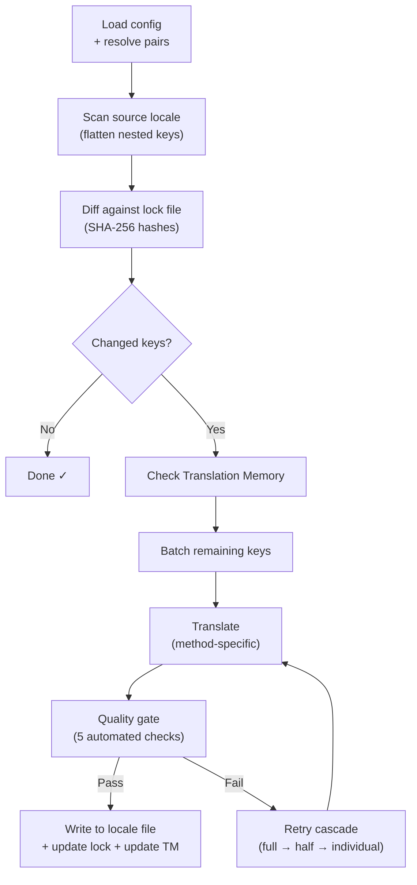

# วิธีที่ champollion ทำงาน

champollion แปลไฟล์ locale ของแอปคุณด้วยคำสั่งเดียว นี่คือสิ่งที่เกิดขึ้นเบื้องหลัง

## Pipeline

เมื่อคุณรัน `npx champollion sync` champollion จะดำเนินการ pipeline หกขั้นตอน:



**การตัดสินใจออกแบบที่สำคัญ:**

- **การตรวจจับการเปลี่ยนแปลงด้วย SHA-256 hash.** Champollion ติดตามค่า source ทุกค่าด้วย hash ใน `.champollion.lock` เมื่อคุณอัปเดต string ภาษาอังกฤษ เฉพาะ key นั้นเท่านั้นที่จะถูกแปลใหม่ นี่คือเหตุผลที่ `sync` ทำงานได้รวดเร็วในการรันครั้งถัดไป — เพราะทำงานน้อยที่สุดเท่าที่จำเป็น

- **การแคชด้วย Translation Memory.** ก่อนที่จะเรียก API ใดๆ champollion จะตรวจสอบ `.champollion/tm.json` เพื่อหาการแปลที่แคชไว้ (จัดเก็บโดยใช้ข้อความต้นฉบับ + locale + method เป็น key) ในการ re-sync ทั่วไปหลังจากเปลี่ยน key เดียว 142 key มาจาก cache และ 1 key เรียก API

- **Quality gate ก่อนเขียนไฟล์.** การแปลทุกรายการผ่านการตรวจสอบอัตโนมัติห้ารายการ (ว่างเปล่า, echo ต้นฉบับ, hallucination loop, การขยายความยาว, การตรวจสอบ script) ก่อนที่จะบันทึกลงไฟล์ ความล้มเหลวจะถูกบันทึก log ไว้ ไม่มีการยอมรับโดยไม่แจ้งเตือน

- **Retry cascade เมื่อเกิดความล้มเหลว.** หาก batch ล้มเหลว (JSON parse error, API timeout) champollion จะลองใหม่ด้วย batch ที่เล็กลงเรื่อยๆ: เต็ม → ครึ่ง → รายบุคคล วิธีนี้ช่วยแยก key ที่มีปัญหาออกโดยไม่บล็อกส่วนที่เหลือ

## วิธีการแปล

Champollion รองรับวิธีการแปลหลายวิธี ซึ่งแต่ละวิธีมีความเหมาะสมกับสถานการณ์ที่แตกต่างกัน วิธีการหลักมีดังนี้:

| วิธีการ | วิธีทำงาน | เหมาะสำหรับ |
|--------|-------------|----------|
| **`llm`** | Structured prompt ไปยัง OpenRouter model ใดก็ได้ | ภาษาที่มีทรัพยากรสนับสนุนดี |
| **`llm-coached`** | Prompt เดิม + กฎไวยากรณ์, พจนานุกรม และหมายเหตุสไตล์ | ภาษาที่ LLM มักเกิดข้อผิดพลาดที่คาดเดาได้ |
| **`google-translate`** | Google Cloud Translation API batch request | ภาษาที่มีทรัพยากรสูงและรองรับ GT ได้ดี |
| **`api`** | HTTP POST ไปยัง endpoint ของคุณเอง | Pipeline แบบกำหนดเอง, model ที่ควบคุมโดยชุมชน |

วิธีการถูกกำหนดค่าต่อคู่ภาษา คุณอาจใช้ `google-translate` สำหรับภาษาฝรั่งเศส แต่ใช้ `llm-coached` สำหรับ Plains Cree — แต่ละคู่ได้รับวิธีการที่เหมาะสมที่สุด

## Coaching Data

สำหรับคู่ `llm-coached` coaching data มอบความรู้ทางภาษาศาสตร์อย่างชัดเจนให้กับ LLM ได้แก่ กฎไวยากรณ์ คำศัพท์ที่กำหนดไว้ และความต้องการด้านสไตล์ ข้อมูลนี้จะถูกแทรกเข้าไปในทุก prompt ในรูปแบบ context ที่มีโครงสร้าง

```json title="coaching/crk.json"
{
  "grammar_rules": ["Animate nouns take different plural forms than inanimate nouns"],
  "dictionary": {"welcome": "ᑕᓂᓯ", "settings": "ᐃᑕᐢᑌᐘᐃᓇ"},
  "style_notes": "Use Standard Roman Orthography (SRO) unless explicitly configured otherwise."
}
```

Coaching data คือกลไกหลักในการปรับปรุงคุณภาพการแปลโดยไม่ต้อง fine-tune model เปลี่ยนกฎ → รัน sync ใหม่ → ดูว่าช่วยได้หรือไม่ การทำซ้ำเกิดขึ้นทันที

## Plugins

Plugin คือสูตรการแปลที่บรรจุไว้ล่วงหน้าสำหรับคู่ภาษาเฉพาะ เป็น JSON manifest — ไม่ใช่โค้ด — ที่บอก champollion ว่าจะใช้วิธีการใด ด้วยการตั้งค่าอะไร และคุณภาพที่ผ่านการ benchmark มาแล้ว

```bash
champollion plugin install ./crk-coached-v3/
champollion sync   # uses the installed plugin for en→crk
```

Plugin เชื่อมช่องว่างระหว่างการวิจัยและการใช้งานจริง: วิธีการที่ได้คะแนนดีใน [Network](/arena) สามารถบรรจุเป็น plugin และนำไปใช้งานที่นี่ได้

## ภาพรวมที่กว้างขึ้น

champollion คือครึ่งหนึ่งของระบบนิเวศสองส่วน:

- **[the Network](/arena)** — ที่ซึ่งวิธีการแปลถูก**พัฒนาและพิสูจน์**ด้วยการ benchmark ที่ทำซ้ำได้
- **champollion** — ที่ซึ่งวิธีการที่พิสูจน์แล้วถูก**นำไปใช้**เพื่อแปลเนื้อหาจริง

[Eval Harness Bridge](/docs/guides/bridge) เชื่อมต่อทั้งสองส่วน วิธีการที่พิสูจน์ตัวเองใน Network จะถูก deploy ที่นี่ ข้อเสนอแนะจากผู้ใช้งานจริงช่วยปรับปรุงเวอร์ชันถัดไป

---

## เจาะลึกเพิ่มเติม

- [วิธีที่ Sync ทำงาน](/docs/concepts/how-sync-works) — การอธิบาย pipeline ทีละขั้นตอนอย่างละเอียด
- [Quality Gate](/docs/concepts/quality-gate) — การตรวจสอบอัตโนมัติห้ารายการ
- [Translation Memory](/docs/concepts/translation-memory) — การแคชและการประหยัดต้นทุน
- [วิธีการแปล](/docs/guides/translation-methods) — การเปรียบเทียบวิธีการอย่างละเอียด
- [สถาปัตยกรรม](/docs/concepts/architecture) — ภาพรวมการออกแบบระบบ
