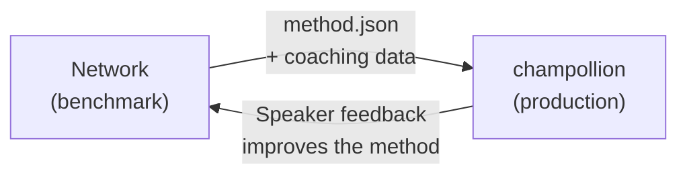

# นำไปใช้งานจริง

คุณพิสูจน์แล้วว่ามันทำงานได้ใน Network ตอนนี้ถึงเวลานำไปใช้งานจริง

Network มีไว้สำหรับ R&D — สร้าง, ทดสอบประสิทธิภาพ, และเปรียบเทียบวิธีการแปล **การนำไปใช้งานจริง** เกิดขึ้นผ่าน [champollion](https://champollion.dev) ซึ่งเป็น CLI สำหรับนักพัฒนา ทั้งสองเชื่อมต่อกันผ่านรูปแบบ plugin ที่ใช้ร่วมกัน


```mermaid
graph LR
    A["Network\n(benchmark)"] -->|"method.json\n+ coaching data"| B["champollion\n(production)"]
    B -->|"Speaker feedback\nimproves the method"| A
```

---

## เส้นทางการนำไปใช้งาน

### 1. ส่งออก Method ของคุณในรูปแบบ Plugin

สร้าง manifest `method.json` ที่รวบรวมผลการทดสอบประสิทธิภาพของคุณ:

```json
{
  "name": "french-formal-v1",
  "type": "llm-coached",
  "version": "1.0.0",
  "description": "Formal-register French (example manifest; the benchmark values are illustrative)",
  "locales": ["fr"],
  "config": {
    "model": "google/gemini-2.5-flash",
    "temperature": 0.3
  },
  "benchmarks": {
    "fr": {
      "corpus_chrf": 72.3,
      "exact_match_rate": 0.42,
      "corpus_size": 500
    }
  }
}
```

รวม coaching data (กฎไวยากรณ์, พจนานุกรม) ไว้พร้อมกับ manifest ด้วย

### 2. ติดตั้งใน Champollion

```bash
champollion plugin install ./french-formal-v1/
```

### 3. กำหนดค่าคู่ภาษาของคุณ

```json title="champollion.config.json"
{
  "pairs": {
    "en:fr": { "methodPlugin": "french-formal-v1" }
  }
}
```

### 4. แปลเนื้อหาจริง

```bash
npx champollion sync
```

ขณะนี้ method ที่ผ่านการทดสอบแล้วของคุณกำลังสร้างการแปลจริงในสภาพแวดล้อมการใช้งานจริง

---

## สำหรับภาษาของชนพื้นเมือง

วิธีการที่นำมาใช้กับชุมชนภาษาชนพื้นเมืองจำเป็นต้องได้รับ**ความยินยอมจากชุมชน**ก่อนนำไปปรับใช้จริงบน Production หลักการอธิปไตยเหนือข้อมูลของชนพื้นเมือง — การที่ชุมชนเป็นเจ้าของและควบคุมข้อมูลภาษา — เป็นตัวกำหนดแนวทางการพัฒนา การประเมินผล และการนำวิธีการแปลไปปรับใช้

ไม่มีคะแนนใดที่ทำให้วิธีการหนึ่งพร้อมนำไปปรับใช้ — ไม่ว่าจะเป็นคะแนน chrF++ ในระดับสูง หรือเกณฑ์คะแนนระดับรางวัลก็ตาม วิธีการดังกล่าวจะได้รับการนำไปปรับใช้**หากและเมื่อ**องค์กรกำกับดูแลของชุมชนภาษานั้นให้ความยินยอม หลังจากที่ผู้พูดภาษานั้นได้ประเมินผลลัพธ์ที่ได้แล้ว

ดู [Data Sovereignty](/docs/network/sovereignty/data-sovereignty) และ [Ownership Transfer](/docs/network/sovereignty/ownership-transfer) สำหรับกรอบการกำกับดูแลฉบับสมบูรณ์

---

## ดูเพิ่มเติม

- [The Eval Harness Bridge](https://champollion.dev/docs/guides/bridge) — คำแนะนำโดยละเอียดเกี่ยวกับ pipeline จาก Network ไปยัง champollion
- [Plugin Specification](https://champollion.dev/docs/reference/plugin-spec) — รูปแบบ manifest ของ method.json
- [champollion Agent Guide](https://champollion.dev/docs/guides/agent-guide) — วิธีใช้ champollion สำหรับการแปล
