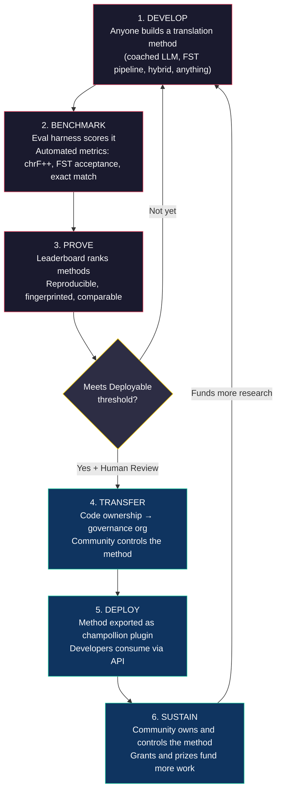
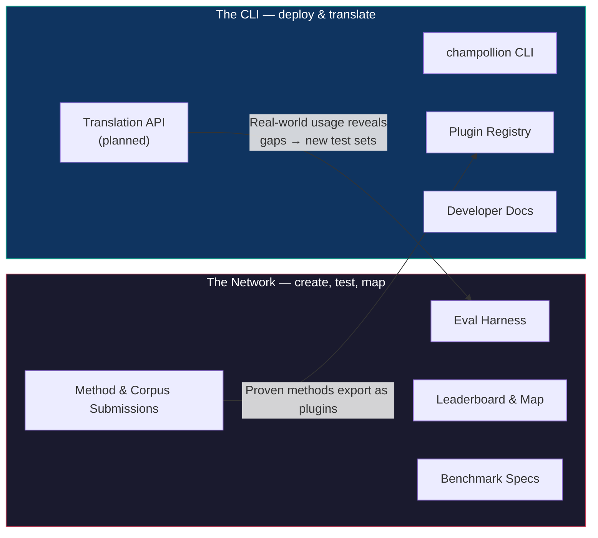
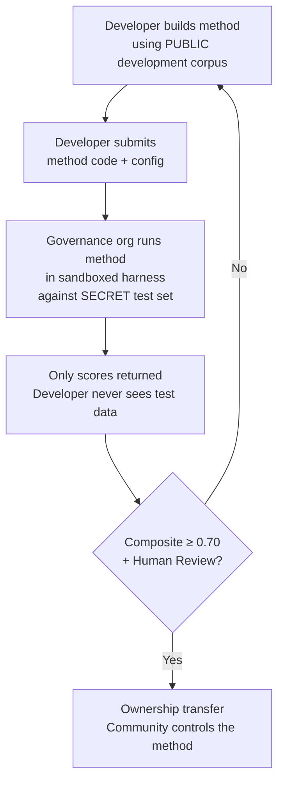

# วิธีการทำงานของเครือข่าย: สร้าง, ทดสอบ, พัฒนา, นำไปใช้งาน

> **บทสรุปผู้บริหาร** การแปลด้วยเครื่อง (Machine translation) สำหรับภาษาที่ขาดแคลนทรัพยากรในโลกไม่ใช่ปัญหาเรื่องการฝึกอบรมโมเดล — แต่มันคือปัญหาด้าน *โครงสร้างพื้นฐาน* (infrastructure) ไม่มีโมเดล ห้องปฏิบัติการ หรือบริษัทใดเพียงแห่งเดียวที่จะแก้ปัญหานี้ได้ เอกสารนี้อธิบายถึงสถาปัตยกรรมแพลตฟอร์มที่เปลี่ยนชุมชนวิศวกร ML, นักภาษาศาสตร์, และผู้ใช้ภาษาทั่วโลกให้กลายเป็นห้องปฏิบัติการวิจัยแบบกระจายศูนย์: ใครก็ตามสามารถสร้างวิธีการแปลขึ้นมา เครือข่ายจะทดสอบว่ามันใช้งานได้หรือไม่ — รวมถึงการทดสอบกับข้อมูลการประเมินที่ชุมชนถือครองซึ่งแพลตฟอร์มจะไม่มีวันได้เห็น — และวิธีการที่ใช้งานได้จะกลายเป็นทรัพย์สินของชุมชนเจ้าของภาษานั้นๆ กลไกนี้คือการพัฒนาวิธีการแบบเปิดกว้างและทำงานร่วมกัน ควบคู่ไปกับเงื่อนไขที่ยืดหยุ่นซึ่งกำหนดโดยผู้ดูแล — เป็นการผสมผสานที่ยังหาได้ยากในทางปฏิบัติ และเป็นสิ่งที่เราคิดว่าปัญหานี้ต้องการ

---

> [!IMPORTANT]
> **ขอบเขต** แพลตฟอร์มนี้ประเมิน **การแปลข้อความที่เป็นลายลักษณ์อักษรอย่างเป็นทางการ** — เอกสาร, สื่อการเรียนการสอน, การสื่อสารอย่างเป็นทางการ, ข้อความใน UI แพลตฟอร์มนี้ไม่ใช่แชทบอท, ล่ามแปลภาษาแบบเรียลไทม์, หรือระบบสนทนาแบบไม่จำกัดโดเมน กระดานผู้นำ (leaderboard) จะจัดอันดับวิธีการแปลโดยเทียบกับคลังข้อความคู่ขนานที่ได้รับการคัดสรรในโดเมนข้อความเฉพาะ (ดู [Benchmark Specification §2.7](/docs/network/specifications/benchmark#27-domain) สำหรับการจัดหมวดหมู่โดเมน) MT เป็นโครงสร้างพื้นฐานสำหรับการฟื้นฟูภาษา ไม่ใช่สิ่งทดแทน เด็กๆ เรียนรู้ภาษาจากผู้คน ไม่ใช่จากเครื่องจักร

### ความครอบคลุมของโดเมนในปัจจุบัน

กระดานนี้ **เปิดใช้งานจริงและกำลังรวบรวมข้อมูล** — การรันต่างๆ จะถูกเผยแพร่ลงในกระดานอย่างต่อเนื่อง และ
ทุกคนสามารถเพิ่มข้อมูลได้ ตารางด้านล่างแสดงให้เห็นว่าคลังข้อความอ้างอิงสาธารณะใดบ้าง
ที่ *รองรับ* ในแต่ละโดเมน; [leaderboard](/leaderboard) จะมีการจัดอันดับแบบเรียลไทม์
คลังข้อความจะถูกดึงมาจากแหล่งที่มาในขณะรันไทม์ และจะไม่มีการโฮสต์ไว้ที่นี่

| โดเมน | คลังข้อความอ้างอิง | สถานะ | หมายเหตุ |
|--------|------------------|--------|-------|
| ข่าว / วารสารศาสตร์ | Global Voices (OPUS) | รองรับแล้ว — เปิดรับการส่งข้อมูล | 493 คู่ภาษา, CC BY 3.0 |
| ทั่วไป / ผสม (ลายลักษณ์อักษร) | Tatoeba | รองรับแล้ว — เปิดรับการส่งข้อมูล | 874 คู่ภาษา, CC BY 2.0 |
| การศึกษา / ตำราเรียน | EdTeKLA (Plains Cree) | สำหรับการวิจัยเท่านั้น — **ไม่จัดอันดับ**; การประเมินผ่าน model-API ระยะไกลต้องได้รับการยินยอม | สัญญาอนุญาต CC BY-NC-SA ฉบับดัดแปลงของ EdTeKLA (ขอบเขตตามอธิปไตย, ไม่ใช่เชิงพาณิชย์); ถูกแยกออกจาก leaderboard, รางวัล, และเส้นทาง API/เชิงพาณิชย์ |
| เรื่องเล่า / วรรณกรรม | — | มีแผนดำเนินการ | ยังไม่มีคลังข้อความที่รันได้เชื่อมต่ออยู่ |
| ศาสนา / คัมภีร์ | FLORES+ (โดเมนคัมภีร์ไบเบิล) | เชื่อมต่อแล้ว, สำหรับเปรียบเทียบสัมพัทธ์เท่านั้น | คลังข้อความที่รันได้; มีการปนเปื้อนสูง จึงใช้สำหรับเปรียบเทียบสัมพัทธ์เท่านั้น — ไม่เคยใช้สำหรับการให้คะแนนอย่างเป็นทางการ |
| ภาษาพูด / เรียลไทม์ | — | อยู่นอกขอบเขต | ระบบนี้ประเมินข้อความที่เป็นลายลักษณ์อักษร ไม่ใช่เสียงพูด |
| เทคนิค / วิทยาศาสตร์ | — | ในอนาคต | ต้องมีการตรวจสอบคำศัพท์เฉพาะโดเมน |

## จุดประสงค์ของเครือข่าย

ก่อนที่จะพูดถึงกลไกการทำงาน เรามาดูพันธกิจกันก่อน Champollion Network ตั้งอยู่บนความมุ่งมั่น 4 ประการ:

1. **สร้างและเชื่อถือชุดทดสอบการแปล** สำหรับภาษาส่วนใหญ่ สิ่งที่หายากและมีค่าไม่ใช่โมเดลใหม่ — แต่มันคือชุดทดสอบที่ *เชื่อถือได้*: เขียนโดยมนุษย์, ตรงตามโดเมน, และระบุเวอร์ชันชัดเจน Network มีอยู่เพื่อสร้างชุดทดสอบเหล่านั้นและทำให้มันเชื่อถือได้
2. **ทำให้วงการนี้สามารถสำรวจได้** ใครสามารถแปลอะไรได้บ้าง, วิธีการแต่ละแบบดีแค่ไหนในข้อความแต่ละประเภท, และช่องโหว่อยู่ตรงไหน — สิ่งเหล่านี้จะถูกนำเสนอในรูปแบบแผนที่สาธารณะ ไม่ใช่ถูกฝังอยู่ในเปเปอร์และไฟล์ PDF ที่กระจัดกระจาย
3. **ยินดีต้อนรับทุกวิธีการ — ทั้งมนุษย์และเครื่องจักร** เราเป็นนักปฏิบัตินิยมที่เน้นการแก้ปัญหา นักแปลมืออาชีพ, ระบบที่ใช้กฎเกณฑ์ (rule-based), LLM ที่ได้รับการโค้ช, โมเดลที่ผ่านการ fine-tune — ทั้งหมดนี้ล้วนมีความสำคัญระดับเฟิร์สคลาส เราใส่ใจเรื่องการทำให้ภาษาได้รับการแปล ไม่ใช่เรื่องที่ว่าเครื่องมือไหนจะเป็นผู้ชนะ
4. **สร้าง *ร่วมกับ* ชุมชน, ไม่เคยใช้วิธีดึงข้อมูล (scraped) — และอธิปไตยเป็นสิ่งที่ต่อรองไม่ได้** ข้อมูลภาษาคือข้อมูลทางชีวภาพ (biodata); ผู้ที่ให้คลังข้อความคือกุญแจสำคัญของข้อมูลนั้น และของทุกสิ่งที่ถูกวัดผลเทียบกับมัน

ทุกสิ่งที่อยู่ด้านล่างนี้ — ลูปการทำงาน, ชุดทดสอบ (harness), leaderboard, และสะพานเชื่อมสู่การนำไปใช้งาน (deployment bridge) — ล้วนสร้างขึ้นเพื่อตอบสนองความมุ่งมั่นทั้ง 4 ประการนี้

---

## 1. ปัญหา: Machine Translation ≠ Machine Learning

การแปลด้วยเครื่องสำหรับภาษาที่มีทรัพยากรน้อย (low-resource languages หรือ LRLs) มักถูกตีกรอบว่าเป็นปัญหาด้าน machine learning: รวบรวมข้อมูล, ฝึกอบรมโมเดล, นำไปใช้งาน การตีกรอบแบบนี้เป็นสิ่งที่ผิด และข้อผิดพลาดนี้ส่งผลกระทบตามมา — มันชี้นำเงินทุน, บุคลากรที่มีความสามารถ, และโครงสร้างพื้นฐานไปสู่แนวทางที่ไม่สามารถใช้ได้จริงในเชิงโครงสร้างสำหรับภาษาส่วนใหญ่ในโลก

### 1.1 ทำไมกรอบแนวคิดแบบ ML ถึงล้มเหลว

ไปป์ไลน์ ML มาตรฐานสำหรับ MT ต้องการสามสิ่ง: คลังข้อความคู่ขนานขนาดใหญ่, เกณฑ์มาตรฐานการประเมินที่ผ่านการตรวจสอบแล้ว, และเส้นทางสำหรับการนำไปใช้งาน สำหรับ 194 ภาษาในรายการ Cloud Translation ของ Google และ 200 ภาษาที่ครอบคลุมโดย NLLB-200 ทั้งสามสิ่งนี้มีอยู่ครบถ้วน สำหรับภาษาในกลุ่ม long tail ประมาณ 1,200 ภาษาของ OMT-1600 — ตามการคำนวณของเรา: 1,600 ภาษาที่ครอบคลุม ลบด้วย 400+ ภาษาที่ผู้เขียนรายงานว่าโมเดล "เข้าใจดีพอ" — ข้อมูลการประเมินมีอยู่แต่คุณภาพส่วนใหญ่ต่ำกว่าเกณฑ์ที่ใช้งานได้, น้ำหนักของโมเดล (model weights) ไม่เปิดเผยต่อสาธารณะ, และไม่มีไปป์ไลน์สำหรับการนำไปใช้งาน สำหรับภาษาที่เหลืออีกประมาณ 5,400+ ภาษา ไม่มีสิ่งเหล่านี้อยู่เลย

| ข้อกำหนด | ภาษาที่มีทรัพยากรสูง | กลุ่ม Long Tail ของ OMT-1600 (~1,200 LRLs) | ภาษาที่เหลืออีก ~5,400 ภาษา |
|-------------|------------------------|-------------------------------|---------------------------|
| **คลังข้อความคู่ขนาน** | ประโยคคู่ขนานหลายล้านประโยค (Europarl, UN Corpus, OpenSubtitles) | ข้อความคู่ขนานในโดเมนคัมภีร์ไบเบิล, ข้อมูลที่ดึงจากเว็บ, การแปลกลับแบบสังเคราะห์ (synthetic backtranslation) ไม่มีข้อมูลที่คัดสรรโดยชุมชน | หลักร้อยถึงหลักพันต้นๆ (ถ้ามี) |
| **เกณฑ์มาตรฐานการประเมิน** | WMT, FLORES, NTREX — เป็นมาตรฐาน, ทำซ้ำได้ | BOUQuET (โดเมนคัมภีร์ไบเบิล), met-BOUQuET ไม่มีการตรวจสอบความถูกต้องทางสัณฐานวิทยา ไม่มีการประเมินโดยอิสระ | ไม่มีเกณฑ์มาตรฐาน; การประเมินแบบเฉพาะกิจ |
| **เส้นทางการนำไปใช้งาน** | Google Translate, DeepL, Azure — API เชิงพาณิชย์ | ไม่มีการปล่อยน้ำหนักโมเดล ไม่มี CLI, ไม่มีระบบปลั๊กอิน, ไม่มี API ที่ชุมชนนำไปใช้งานได้ | ไม่มีอะไรเลย ไม่มี API, ไม่มีผลิตภัณฑ์, ไม่มีตลาด |

แนวทางแบบ ML จะได้ผลก็ต่อเมื่อมีข้อมูลสำหรับฝึกอบรมและมีตลาดสำหรับนำไปใช้งาน OMT-1600 ได้ขยายเงื่อนไขแรกอย่างมีนัยสำคัญ — แต่การขยายตัวโดยปราศจากการตรวจสอบคุณภาพโดยอิสระ, การตรวจสอบความถูกต้องทางสัณฐานวิทยา, หรือการกำกับดูแลโดยชุมชน ถือเป็นการขยายตัวที่ปราศจากความไว้วางใจ ปัญหาไม่ใช่แค่ "เราต้องการโมเดลที่ดีกว่า" — แต่มันคือ "เราต้องการโครงสร้างพื้นฐานที่พิสูจน์ได้ว่าโมเดลทำงานได้จริง ภายใต้เงื่อนไขที่ชุมชนเป็นผู้ควบคุม"

### 1.2 สิ่งที่ MT สำหรับ LRLs ต้องการอย่างแท้จริง

การแปลสำหรับภาษาที่ขาดแคลนทรัพยากรไม่ใช่ปัญหาเรื่องการฝึกอบรมเป็นหลัก แต่มันคือปัญหาด้าน **วิศวกรรมวิธีการ (method engineering)** — ความท้าทายในการรวบรวมทรัพยากรที่มีอยู่ (LLM, เครื่องมือทางสัณฐานวิทยา, ความรู้ของชุมชน, กฎทางภาษาศาสตร์) ให้กลายเป็นไปป์ไลน์การแปลที่ใช้งานได้ จากนั้นพิสูจน์ว่ามันทำงานได้จริงด้วยการประเมินที่เข้มงวด

ความแตกต่างนี้มีความสำคัญ:

| มิติ | แนวทางแบบ ML | แนวทางแบบวิศวกรรมวิธีการ |
|-----------|------------|---------------------------|
| **กิจกรรมหลัก** | ฝึกอบรมโมเดลด้วยข้อมูล | รวมเครื่องมือ, พรอมต์, และความรู้ทางภาษาศาสตร์เข้าเป็นไปป์ไลน์ |
| **คอขวด** | ปริมาณข้อมูลคู่ขนาน | ความคิดสร้างสรรค์ทางวิศวกรรม + โครงสร้างพื้นฐานการประเมิน |
| **ใครสามารถมีส่วนร่วมได้** | ทีมที่มีคลัสเตอร์ GPU และชุดข้อมูล | ใครก็ตามที่มี API key, พจนานุกรม, และไอเดีย |
| **การประเมิน** | BLEU/chrF บนชุดทดสอบที่แยกไว้ (held-out test sets) | การตรวจสอบความถูกต้องทางสัณฐานวิทยา + การตรวจสอบโดยมนุษย์ + ตัวชี้วัดอัตโนมัติ |
| **การนำไปใช้งาน** | ให้บริการโมเดล (Serve the model) | แพ็กเกจวิธีการในรูปแบบปลั๊กอิน |

LLM สมัยใหม่มีความรู้แฝงเกี่ยวกับภาษาที่มีทรัพยากรน้อยหลายภาษาอยู่แล้ว — มากพอที่จะสร้างผลลัพธ์ที่ *ดูเหมือน* จะสมเหตุสมผล ปัญหาคือผลลัพธ์นี้มักจะไม่ถูกต้องตามหลักสัณฐานวิทยา (โมเดลสร้างคำหลอนที่ไม่มีอยู่จริงในภาษานั้น) ความท้าทายทางวิศวกรรมคือ: คุณจะดึงสิ่งที่ LLM รู้ออกมา ตรวจสอบความถูกต้องกับความเป็นจริงทางภาษาศาสตร์ และแพ็กเกจผลลัพธ์เพื่อนำไปใช้งานจริงได้อย่างไร?

นี่คือเหตุผลที่เราทำการวัดผล (benchmark) **วิธีการ (methods)** ไม่ใช่โมเดล วิธีการคือสูตรสำเร็จทั้งหมด: การเลือกโมเดล + วิศวกรรมพรอมต์ + การใช้เครื่องมือ + การประมวลผลก่อน/หลัง + ข้อมูลการโค้ช + กลยุทธ์การลองใหม่ (retry) สองทีมที่ใช้โมเดลเดียวกันแต่ใช้วิธีการต่างกันจะได้คะแนนต่างกัน นั่นคือประเด็นสำคัญ

### 1.3 ทำไมภาษาแบบ Polysynthetic ถึงทำลายทุกกฎเกณฑ์

ภาษาที่ขาดแคลนทรัพยากรมากที่สุดในโลกหลายภาษาเป็นภาษาแบบ **polysynthetic (ภาษาที่มีการผสานหน่วยคำจำนวนมาก)** — ภาษาเหล่านี้เข้ารหัสประโยคทั้งประโยคให้กลายเป็นคำเพียงคำเดียวผ่านกระบวนการทางสัณฐานวิทยาที่สร้างสรรค์ ลองพิจารณาคำในภาษา Plains Cree:

> **ê-kî-nitawi-kîskinwahamâkosiyân**
> *"เมื่อฉันได้ไปโรงเรียน"*

เพียงคำเดียว แต่มันเข้ารหัสทั้งกาล (อดีต), ทิศทาง (กำลังไป), รากศัพท์ (เรียนรู้), วาจก (ถูกกระทำ/สะท้อนกลับ), และบุรุษ (บุรุษที่หนึ่งเอกพจน์) ภาษาอังกฤษต้องใช้ถึงหกคำในสิ่งที่ภาษา Plains Cree สามารถสื่อสารได้ในคำเดียว

สิ่งนี้ทำให้ MT มาตรฐานใช้งานไม่ได้ในทุกระดับ:

- **Tokenization** — BPE และ SentencePiece จะฉีกคำแบบ polysynthetic ออกเป็นชิ้นส่วนที่ไม่มีความหมาย เพราะมันถูกออกแบบมาสำหรับสัณฐานวิทยาแบบเชื่อมต่อ (concatenative morphology)
- **Hallucination** — LLM สร้างสตริงที่ดูสมเหตุสมผลแต่ไม่ใช่คำที่ถูกต้อง ผู้ที่ไม่ใช่เจ้าของภาษาจะไม่สามารถบอกความแตกต่างได้ หากไม่มีการตรวจสอบความถูกต้องทางสัณฐานวิทยา อาการประสาทหลอนเหล่านี้จะมองไม่เห็น
- **Evaluation** — ตัวชี้วัดระดับคำ (BLEU) จะลงโทษความผันแปรของการผันคำ (inflectional variation) ตามธรรมชาติ ซึ่งเป็นพื้นฐานของวิธีการทำงานของภาษาเหล่านี้ ตัวชี้วัดระดับตัวอักษร (chrF++) ดีกว่าแต่ก็ยังไม่เพียงพอหากไม่มีการตรวจสอบโครงสร้าง

ทางแก้ไม่ใช่โมเดลที่ใหญ่ขึ้นหรือข้อมูลการฝึกอบรมที่มากขึ้น แต่มันคือ **โครงสร้างพื้นฐานที่สามารถดักจับอาการประสาทหลอน (hallucinations) ก่อนที่จะไปถึงผู้ใช้** — เครื่องมือวิเคราะห์ทางสัณฐานวิทยา (FSTs) ที่สามารถบอกได้อย่างชัดเจนว่า "นี่ไม่ใช่คำในภาษานี้"

---

## 2. ทำไมแนวทางที่มีอยู่ถึงไม่ได้ผล

### 2.1 MT เชิงพาณิชย์

บริการแปลภาษาเชิงพาณิชย์ในอดีตมักปรับให้เหมาะสมกับปริมาณความต้องการของตลาด OMT-1600 ของ Meta (มีนาคม 2026) แสดงให้เห็นถึงการเปลี่ยนแปลงครั้งสำคัญ — 1,600 ภาษาในระบบเดียว แต่สำหรับภาษาในกลุ่ม long tail ประมาณ 1,200 ภาษา (ตามการคำนวณของเรา: 1,600 ลบด้วย 400+ ภาษาที่ผู้เขียนรายงานว่าโมเดล "เข้าใจดีพอ") คุณภาพยังต่ำกว่าเกณฑ์ที่ใช้งานได้, น้ำหนักของโมเดลไม่เปิดเผย, และไม่มีไปป์ไลน์สำหรับการนำไปใช้งาน ปัญหาแรงจูงใจเชิงโครงสร้างได้พัฒนาไปแล้ว: ตอนนี้ Big Tech สามารถสร้างโมเดลสำหรับ LRLs ได้ แต่หากปราศจากการประเมินโดยอิสระ, การตรวจสอบความถูกต้องทางสัณฐานวิทยา, หรือการกำกับดูแลโดยชุมชน ความครอบคลุมเพียงอย่างเดียวก็ไม่สามารถแก้ปัญหาได้

### 2.2 การวิจัยทางวิชาการ

การวิจัย MT ทางวิชาการมุ่งเน้นไปที่คู่ภาษาที่มีทรัพยากรสูงอย่างท่วมท้น เพราะนั่นคือที่ที่มีข้อมูลการฝึกอบรม, shared tasks, และช่องทางสำหรับการตีพิมพ์ นักวิจัยที่ทำงานกับคู่ภาษาที่มีทรัพยากรน้อยต้องดิ้นรนเพื่อตีพิมพ์, ดิ้นรนเพื่อหาทุนสำหรับประมวลผล, และดิ้นรนเพื่อนำไปใช้งาน — เพราะโครงสร้างพื้นฐานการนำไปใช้งานสำหรับ LRLs ไม่มีอยู่จริง

### 2.3 การแข่งขันแบบครั้งเดียวจบ

คุณอาจจัดการแข่งขันบน Kaggle ว่า: "English→Plains Cree, คะแนน chrF++ สูงสุดรับเงินรางวัล $10,000" และนี่คือสิ่งที่จะเกิดขึ้น:

1. มีคนชนะ, ส่ง notebook, รับเงินรางวัล, แล้วกลับบ้าน
2. notebook ถูกทิ้งให้เน่าเปื่อยในคลังข้อมูลของ Kaggle ไม่มีใครนำไปใช้งาน ไม่มีใครดูแลรักษา
3. ในที่สุดชุดทดสอบก็ถูกเผยแพร่ — ปนเปื้อนไปตลอดกาล
4. องค์กรกำกับดูแลอัปโหลดข้อมูลทางภาษาของตนไปยังโครงสร้างพื้นฐานของ Google ภายใต้เงื่อนไขการให้บริการของ Google โดยไม่มีอำนาจควบคุมวงจรชีวิตของข้อมูลอย่างแท้จริง
5. ไม่มีสะพานเชื่อมสู่การนำไปใช้งาน notebook ที่ชนะไม่ใช่ API ที่ใช้งานได้จริง

เงินรางวัลแบบครั้งเดียวจบจะดึงดูดแค่นักล่าเงินรางวัล แต่ leaderboard ที่ดำเนินการอย่างต่อเนื่องพร้อมการกำกับดูแลโดยชุมชนจะสร้างการมีส่วนร่วมอย่างยั่งยืน

### 2.4 การ Fine-Tuning

การ Fine-tune โมเดลแบบเปิดด้วยข้อความคู่ขนานเป็นแนวทาง ML ที่เห็นได้ชัด แต่สำหรับ LRLs ส่วนใหญ่ คลังข้อความคู่ขนานที่จำเป็นสำหรับการ fine-tune คือข้อมูลที่ไม่มีอยู่จริง — และการสร้างมันขึ้นมาต้องอาศัยผู้พูดสองภาษาและการมีส่วนร่วมของชุมชน ซึ่งเป็นสิ่งที่การ fine-tune ตั้งใจจะเข้ามาแทนที่ คุณไม่สามารถแก้ปัญหาความขาดแคลนข้อมูลด้วยเทคนิคที่ต้องใช้ข้อมูลได้

---

## 3. ทางออก: การพัฒนาวิธีการร่วมกันพร้อมการประเมินภายใต้อำนาจอธิปไตย

แพลตฟอร์มนี้พลิกกลับแนวทางแบบดั้งเดิม: แทนที่จะให้ทีมเดียวสร้างโมเดลเดียว **ชุมชนทั่วโลกจะร่วมกันสร้างและทดสอบวิธีการแปล**, เครือข่ายจะตรวจสอบว่าอะไรใช้งานได้, และวิธีการที่ใช้งานได้จะถูกนำไปใช้งานจริง (deploy) โดยที่ชุมชนเจ้าของภาษายังคงรักษาสิทธิ์ความเป็นเจ้าของและการควบคุมไว้

### 3.1 ลูปการทำงานแบบเต็มรูปแบบ

แต่ละขั้นตอนมีหน้าที่เฉพาะเจาะจง:

| ขั้นตอน | สิ่งที่เกิดขึ้น | ใครได้ประโยชน์ |
|-------|-------------|--------------|
| **พัฒนา (Develop)** | นักวิจัย, นักศึกษา, หรือผู้ที่สนใจ สร้างวิธีการแปลโดยใช้เครื่องมือใดก็ได้ที่ต้องการ — การเขียนพรอมต์ LLM, ไปป์ไลน์ FST, พจนานุกรม, โมเดลที่ผ่านการ fine-tune, ระบบที่ใช้กฎเกณฑ์, หรือแบบผสมผสาน | ผู้ร่วมสมทบได้เรียนรู้, ทดลอง, ตีพิมพ์ผลงาน |
| **วัดผล (Benchmark)** | ชุดทดสอบ (eval harness) จะให้คะแนนวิธีการโดยเทียบกับคลังข้อความมาตรฐานด้วยตัวชี้วัดที่ทำซ้ำได้ ทุกการรันจะสร้าง [run card](/docs/network/specifications/benchmark#3-run-card-schema) — บันทึกที่สมบูรณ์ว่ามีการทดสอบอะไรและมีประสิทธิภาพอย่างไร | นักวิจัยได้ผลลัพธ์ที่ทำซ้ำได้และเปรียบเทียบได้ |
| **พิสูจน์ (Prove)** | ผลลัพธ์จะปรากฏบน leaderboard สาธารณะ วิธีการต่างๆ จะถูกจัดอันดับ, เปรียบเทียบ, และตรวจสอบ ชุมชนจะเห็นว่าอะไรใช้งานได้และอะไรไม่ได้ | ทุกคนมองเห็นสถานะล่าสุดของเทคโนโลยี (state of the art) |
| **ถ่ายโอน (Transfer)** | สำหรับภาษาพื้นเมือง วิธีการที่ถึงเกณฑ์ที่สามารถนำไปใช้งานได้ (Deployable threshold) (คะแนนรวม ≥ 0.70) และผ่านการตรวจสอบโดยมนุษย์ จะถูกถ่ายโอนความเป็นเจ้าของโค้ดไปยังองค์กรกำกับดูแลของชุมชนเจ้าของภาษา | ชุมชนเป็นเจ้าของวิธีการอย่างสมบูรณ์ — ทั้งโค้ด, น้ำหนักโมเดล, และการตัดสินใจในการนำไปใช้งาน |
| **นำไปใช้งาน (Deploy)** | วิธีการจะถูกส่งออกเป็นปลั๊กอิน [champollion](https://github.com/gamedaysuits/Champollion) ที่ชุมชนสามารถรันบนโครงสร้างพื้นฐานของตนเองได้ นักพัฒนาสามารถใช้การแปลโดยไม่จำเป็นต้องเข้าใจวิธีการที่อยู่เบื้องหลัง | นักพัฒนาได้รับการแปลสำหรับภาษาที่ API เชิงพาณิชย์ไม่มีให้บริการ |
| **ยั่งยืน (Sustain)** | เงินทุนสนับสนุนและรางวัลที่ได้รับการสนับสนุน — ซึ่งโปรเจกต์กำลังดำเนินการหาทุนอย่างแข็งขัน; ปัจจุบันใช้ทุนส่วนตัว — จะจ่ายสำหรับคลังข้อความเพิ่มเติม, การตรวจสอบโดยผู้พูด, และการวิจัย Champollion ไม่ใช่เชิงพาณิชย์และไม่หักส่วนแบ่งใดๆ จากรายได้ที่ชุมชนได้รับจากทรัพย์สินที่ตนเป็นเจ้าของ | งานคลังข้อความที่ได้รับค่าตอบแทนและวิธีการที่ชุมชนเป็นเจ้าของจะคงอยู่ยาวนานกว่าเงินทุนสนับสนุนใดๆ |

### 3.2 ทำไมการทำงานร่วมกันแบบเปิดกว้างถึงได้ผล

การมีส่วนร่วมแบบเปิดกว้างไม่ใช่เรื่องบังเอิญ — แต่มันคือกลไกสำคัญ และนี่คือเหตุผล:

**ความหลากหลายของแนวทาง** วิธีการที่ดีที่สุดสำหรับ English→Plains Cree อาจเป็น LLM ที่ได้รับการโค้ชและควบคุมด้วย FST วิธีการที่ดีที่สุดสำหรับ English→Quechua อาจเป็นไปป์ไลน์ที่เสริมด้วยพจนานุกรม วิธีการที่ดีที่สุดสำหรับ English→Inuktitut อาจเป็นโมเดลที่ผ่านการ fine-tune ซึ่งเริ่มต้นจากคลังข้อความ Nunavut Hansard ไม่มีทีมใดหรือแนวทางใดเพียงแนวทางเดียวที่จะครอบงำได้ในทุกภาษา leaderboard จะเปิดเผยว่าแนวทาง *ประเภทใด* ใช้ได้ผลกับภาษา *ประเภทใด* — ซึ่งผลลัพธ์ระดับเมตานี้ถือเป็นผลงานวิจัยในตัวมันเอง

**การมีส่วนร่วมอย่างยั่งยืน** leaderboard ไม่มีวันสิ้นสุด มักจะมีวิธีการที่ดีกว่าให้สร้างเสมอ ทุกการส่งผลงานคือการบริจาคพลังประมวลผลและความพยายามทางปัญญาให้กับปัญหานี้ แตกต่างจากเงินทุนสนับสนุนแบบครั้งเดียวจบ กระบวนการที่เปิดกว้างและต่อเนื่องนี้สร้างการลงทุนด้านการวิจัยอย่างยั่งยืนจากชุมชนทั่วโลก

**อุปสรรคในการเริ่มต้นต่ำ** คุณต้องการเพียง API key, พจนานุกรม, และไอเดีย ชุดทดสอบ (eval harness) เป็นโอเพนซอร์ส รูปแบบคลังข้อความเป็น JSON ธรรมดา นักศึกษาภาษาศาสตร์สามารถเทียบชั้นกับห้องปฏิบัติการที่มีทรัพยากรพร้อม — และบางครั้งก็ทำได้ดีกว่า เพราะความรู้เฉพาะโดเมน (ความเข้าใจในภาษา) สามารถมีน้ำหนักมากกว่าทรัพยากรการประมวลผล

**สะพานเชื่อมสู่การนำไปใช้งาน** วิธีการเดียวกันกับที่ได้คะแนนดีในชุดทดสอบสามารถนำไปใช้งานจริงได้ด้วยการเปลี่ยนการตั้งค่าเพียงครั้งเดียว "พิสูจน์ที่นี่, นำไปใช้งานที่นั่น" นี่คือช่องว่างที่ Kaggle, WMT shared tasks, และสิ่งพิมพ์ทางวิชาการไม่สามารถเชื่อมต่อได้

### 3.3 สถาปัตยกรรมของแพลตฟอร์ม

champollion.dev คือ **ศูนย์กลางเดียวที่มีสองบทบาท** เว็บไซต์เดียวกันนี้โฮสต์ทั้ง Network — ซึ่งเป็นที่สร้างชุดทดสอบ, ประเมินวิธีการ, และทำแผนที่ผลลัพธ์ — และ CLI ซึ่งเป็นที่ที่วิธีการที่ได้รับการพิสูจน์แล้วจะถูกนำไปใช้งานในโปรเจกต์จริง ทั้งสองส่วนใช้โดเมนเดียวกัน, ชุดเอกสารเดียวกัน, และชั้นข้อมูลเดียวกัน; ป้ายกำกับด้านล่างอธิบายถึงสอง *บทบาท* ไม่ใช่สองเว็บไซต์

**[Network](/docs/network/)** คือสนามทดสอบ กลุ่มเป้าหมายคือนักแปล, นักภาษาศาสตร์, ชุมชน, และนักวิจัย ทุกสิ่งในที่นี้เกี่ยวกับการสร้างชุดทดสอบ, การประเมินวิธีการเทียบกับชุดทดสอบเหล่านั้น — ไม่ว่าจะเป็นมนุษย์หรือเครื่องจักร — และการทำแผนที่ว่าช่องโหว่อยู่ตรงไหน

**[CLI](https://champollion.dev)** คือฝั่งของการนำไปใช้งาน กลุ่มเป้าหมายคือนักพัฒนาที่ต้องการการแปลสำหรับแอปของตน พวกเขาไม่จำเป็นต้องเข้าใจว่าวิธีการทำงานอย่างไร — พวกเขาแค่เรียกใช้งานมัน

สะพานเชื่อมระหว่างสองบทบาทนี้คือ **วิธีการ (method)**: ถูกสร้างและได้รับความไว้วางใจบน Network, ถูกแพ็กเกจเพื่อนำไปใช้งานผ่าน CLI, และ — สำหรับภาษาของชุมชน — ชุมชนจะเป็นเจ้าของ

---

## 4. การประเมินภายใต้อำนาจอธิปไตย: ทำไมโครงสร้างพื้นฐานถึงสำคัญ

โครงสร้างพื้นฐานการประเมินไม่ใช่แค่รายละเอียดทางเทคนิค — แต่มันคือแกนหลักของโมเดลอธิปไตย การประเมินมาตรฐาน (อัปโหลดชุดทดสอบของคุณไปยังแพลตฟอร์มที่ใช้ร่วมกัน) ไม่สามารถใช้ได้กับภาษาพื้นเมือง เพราะมันเป็นการยอมสละการควบคุมข้อมูลทางภาษา

### 4.1 กลไกด้านอธิปไตย

นักพัฒนาจะไม่มีวันได้เห็นข้อมูลการประเมินระดับมาตรฐานทองคำ (gold-standard) พวกเขาพัฒนาโดยใช้คลังข้อความสำหรับการพัฒนาสาธารณะ จากนั้นส่งโค้ดวิธีการของตนไปยังองค์กรกำกับดูแล ซึ่งจะรันโค้ดนั้นใน sandbox เทียบกับชุดทดสอบที่เป็นความลับ จะมีเพียงคะแนนเท่านั้นที่ส่งกลับมา นี่ไม่ใช่แค่เรื่องความปลอดภัย — แต่มันถูกสร้างขึ้นเพื่อให้สอดคล้องกับ **หลักการอธิปไตยทางข้อมูล** — ความเป็นเจ้าของ การควบคุม การเข้าถึง และการครอบครองข้อมูลโดยชุมชน — ที่การกำกับดูแลข้อมูลของชนพื้นเมืองต้องการ ส่วนจะตรงตามหลักการหรือไม่นั้นไม่ใช่การตัดสินใจของเรา: การตัดสินใจเป็นของชุมชนที่เกี่ยวข้อง

### 4.2 ทำไมสิ่งนี้ถึงรันบนแพลตฟอร์มของคนอื่นไม่ได้

บน Kaggle องค์กรกำกับดูแลจะอัปโหลดข้อมูลทางภาษาของตนไปยังโครงสร้างพื้นฐานของ Google ภายใต้เงื่อนไขการให้บริการของ Google พวกเขาไม่สามารถเพิกถอนการเข้าถึงตามกำหนดเวลาของตนเองได้ พวกเขาไม่สามารถแนบเงื่อนไขทางกฎหมายที่กำหนดเอง (เช่น การถ่ายโอนความเป็นเจ้าของ) ไปกับการส่งผลงานได้ พวกเขาไม่มีการรับประกันทางวิทยาการเข้ารหัสลับว่าข้อมูลจะไม่ถูกนำไปใช้เพื่อวัตถุประสงค์อื่น อธิปไตยด้านข้อมูลหมายความว่าชุมชนควบคุมปลายทางการประเมิน, ถือกุญแจ, และสามารถปิดระบบได้

---

## 5. ปรัชญาการประเมิน: Microeval และ LYSS

ตัวชี้วัด MT มาตรฐาน (BLEU, chrF++, COMET) ได้รับการออกแบบมาให้ใช้ได้ทั่วไปกับทุกภาษา ความเป็นสากลนั้นคือจุดแข็ง — และเป็นจุดบอดของมัน สำหรับภาษาแบบ polysynthetic คำที่ไม่ถูกต้องตามหลักสัณฐานวิทยาแต่มี character n-grams ร่วมกับข้อมูลอ้างอิงจะได้คะแนนดีใน chrF++ แต่ผู้พูดภาษาจะรับรู้ได้ทันทีว่าเป็นคำที่ไม่มีความหมาย

**การพัฒนา Microeval** หมายถึงการสร้างตัวชี้วัดการประเมินที่ปรับแต่งมาสำหรับภาษาเฉพาะ โดยใช้เครื่องมือทางภาษาศาสตร์ที่ดีที่สุดที่มีอยู่ เฟรมเวิร์กนี้เรียกว่า **LYSS** (Linguistically-informed Yield & Structural Scoring):

| องค์ประกอบ | สิ่งที่วัด | เครื่องมือ | สถานะ |
|-----------|-----------------|------|--------|
| **LYSS-fst** | ความถูกต้องทางสัณฐานวิทยา | Finite-state transducer | ✅ นำไปใช้แล้ว (Plains Cree) |
| **LYSS-eq** | ความเท่าเทียมกันทางภาษาศาสตร์ | กฎความผันแปรที่คัดสรรโดยนักภาษาศาสตร์ | ✅ นำไปใช้แล้ว (Plains Cree) |
| **LYSS-sem** | การรักษาความหมาย | โมเดลความหมายเฉพาะภาษา | ✅ นำไปใช้แล้ว (Plains Cree) |

ตัวชี้วัดสากล (chrF++, BLEU) ทำหน้าที่เป็นเกณฑ์พื้นฐานและเป็นสัญญาณหลักสำหรับภาษาที่ไม่มีเครื่องมือ LYSS ในที่ใดก็ตามที่มีเครื่องมือเฉพาะภาษา องค์ประกอบ LYSS จะเป็นตัวรับน้ำหนักในการให้คะแนน — เพราะสิ่งที่สำคัญที่สุดสำหรับแต่ละภาษาคือสิ่งที่เครื่องมือเฉพาะภาษาเท่านั้นที่สามารถวัดได้

สำหรับข้อกำหนด LYSS ฉบับเต็มและตรรกะการให้คะแนนแบบผสม (composite scoring) โปรดดู [SCORING_SPEC.md §4](/docs/network/specifications/scoring#4-composite-score)

> [!WARNING]
> **ความสามารถในการเปรียบเทียบข้ามการรัน (Cross-run comparability)** เมื่อเปรียบเทียบการรันที่มีความพร้อมของตัวชี้วัดต่างกัน (เช่น การรันหนึ่งมีคะแนน FST แต่อีกการรันไม่มี) คะแนนรวมจะไม่สามารถเปรียบเทียบกันได้โดยตรง คะแนนรวมจะถูกปรับให้เป็นมาตรฐานตามตัวชี้วัดที่มีอยู่ แต่การรันที่ประเมินด้วย 5 ตัวชี้วัดจะมีข้อมูลมากกว่าการรันที่ประเมินด้วย 2 ตัวชี้วัด leaderboard จะระบุความครอบคลุมของตัวชี้วัดสำหรับแต่ละรายการ

---

## 6. สิ่งนี้ให้บริการใครบ้าง

### สำหรับวิศวกร ML และนักวิจัย

Leaderboard แบบเปิดกว้างพร้อมเกณฑ์มาตรฐานสำหรับคู่ภาษาที่ไม่มีการจัด shared task ทำซ้ำผลลัพธ์ใดๆ ได้ด้วยชุดทดสอบ (eval harness) ตีพิมพ์วิธีการของคุณ เอาชนะคะแนนสูงสุด ทุกการส่งผลงานจะถูกประทับลายนิ้วมือ (fingerprint) ไปยังการตั้งค่าและเวอร์ชันชุดข้อมูลที่เฉพาะเจาะจง — ไม่มีความคลุมเครือว่ามีการทดสอบอะไร

### สำหรับชุมชนเจ้าของภาษา

ความเป็นเจ้าของและการควบคุมเทคโนโลยีการแปลที่สร้างขึ้นสำหรับภาษาของคุณ พลวัตการแข่งขันหมายความว่ามีหลายทีมกำลังทำงานกับภาษาของคุณพร้อมกัน — คุณจะได้รับประโยชน์จากพวกเขาทั้งหมดและเป็นเจ้าของผลลัพธ์ ประโยชน์จะไหลผ่านความเป็นเจ้าของ, การให้เครดิต, ขีดความสามารถ, และเงื่อนไขข้อมูลที่ชุมชนเป็นผู้กำกับดูแล — ไม่เคยมีการแบ่งรายได้: Champollion ไม่ใช่เชิงพาณิชย์และไม่หักส่วนแบ่งใดๆ จากรายได้ที่ชุมชนได้รับจากทรัพย์สินที่ตนเป็นเจ้าของ

### สำหรับผู้ให้ทุนและผู้พิจารณาทุน

ตัวชี้วัดที่โปร่งใสและทำซ้ำได้เพื่อประเมินข้อเสนอโครงการวิจัยด้านการแปล ผลลัพธ์ที่วัดได้นอกเหนือจากการตีพิมพ์: ตัวชี้วัดคุณภาพเมื่อเวลาผ่านไป, ความครอบคลุมของภาษา, คลังข้อความที่สร้างและลงทะเบียนภายใต้การควบคุมของผู้ดูแล, ชั่วโมงการทำงานของผู้พูดที่ได้รับค่าตอบแทนซึ่งส่งมอบให้กับชุมชน วิธีการที่ประสบความสำเร็จจะกลายเป็นทรัพย์สินของชุมชนที่รันบนโครงสร้างพื้นฐานการประเมินแบบเปิด — ผลกระทบของเงินทุนจะทวีคูณผ่านวิธีการที่นำกลับมาใช้ใหม่ได้และเกณฑ์มาตรฐานสาธารณะ แทนที่จะสิ้นสุดลงเมื่อเงินทุนหมด

### สำหรับนักพัฒนา

การแปลสำหรับภาษาที่ไม่มี API เชิงพาณิชย์ให้บริการ คำสั่ง CLI เพียงคำสั่งเดียว (`npx champollion sync`) จะแปลไฟล์ locale ของคุณโดยใช้วิธีการที่ได้รับการพิสูจน์จากชุมชน ใช้ Google Translate สำหรับภาษาฝรั่งเศส, LLM ที่ได้รับการโค้ชสำหรับ Plains Cree, และ API ของชุมชนสำหรับ Quechua — ทั้งหมดนี้อยู่ในโปรเจกต์เดียวกัน และใช้อินเทอร์เฟซเดียวกันทั้งหมด

### สำหรับนักศึกษา

ความท้าทายแบบเปิดกว้างที่สร้างผลกระทบในโลกแห่งความเป็นจริง สร้างวิธีการแปลสำหรับภาษาที่ขาดแคลนทรัพยากร, วัดผล, และตีพิมพ์ผลลัพธ์ของคุณ โครงสร้างพื้นฐานใช้งานได้ฟรี, ชุดข้อมูลเปิดกว้าง, และ leaderboard ไม่สนใจว่าคุณจะมาจากมหาวิทยาลัยชั้นนำ 10 อันดับแรกหรือทำงานจากเครื่องคอมพิวเตอร์ในห้องสมุด

---

## 7. บริบททางสังคมและเทคนิค

### 7.1 การฟื้นฟูภาษากำลังเร่งตัวขึ้น

ความพยายามในการฟื้นฟูภาษากำลังเติบโตขึ้นทั่วโลก โรงเรียนแบบเรียนร่วม (Immersion schools), แหล่งเรียนรู้ภาษาในชุมชน, และโปรเจกต์จัดเก็บข้อมูลดิจิทัลกำลังขยายตัวในชุมชนพื้นเมืองในแคนาดา, สหรัฐอเมริกา, ออสเตรเลีย, นิวซีแลนด์, และยุโรปเหนือ ความพยายามเหล่านี้ต้องการเทคโนโลยี — โดยเฉพาะเทคโนโลยีการแปลที่เคารพอธิปไตยของชุมชนเหนือข้อมูลทางภาษา

### 7.2 LLM ได้เปลี่ยนเกณฑ์พื้นฐานไปแล้ว

ก่อนปี 2023 การสร้างความสามารถ MT สำหรับภาษาแบบ polysynthetic ต้องใช้ความเชี่ยวชาญด้าน NLP อย่างมาก, การฝึกอบรมโมเดลแบบกำหนดเอง, และงบประมาณการประมวลผลจำนวนมหาศาล LLM สมัยใหม่ได้เปลี่ยนเกณฑ์พื้นฐานไปแล้ว: พรอมต์ที่สร้างขึ้นมาอย่างดีพร้อมข้อมูลการโค้ชและการตรวจสอบความถูกต้องทางสัณฐานวิทยา สามารถสร้างคำแปลที่ใช้งานได้สำหรับบางคู่ภาษา — โดยไม่ต้องมีการฝึกอบรม สิ่งนี้ช่วยลดอุปสรรคในการเริ่มต้นพัฒนาวิธีการได้อย่างมาก ปัญหาได้เปลี่ยนจาก "เราจะสร้างโมเดลได้อย่างไร?" เป็น "เราจะสร้างไปป์ไลน์ที่ตรวจสอบและแก้ไขสิ่งที่โมเดลสร้างขึ้นได้อย่างไร?"

### 7.3 การวัดผลที่เปิดกว้างและทำซ้ำได้

การประเมินผลแบบสาธารณะและใช้ร่วมกันได้พลิกโฉมวิธีที่วงการนี้เรียนรู้ว่าอะไรได้ผล Chatbot Arena, LMSYS, และ Hugging Face Open LLM Leaderboard แสดงให้เห็นว่าการวัดผลที่เปิดกว้างและทำซ้ำได้ — ใครก็รันได้, ใครก็ตรวจสอบได้ — เผยให้เห็นความก้าวหน้าที่แท้จริงได้เร็วกว่าการกล่าวอ้างแบบปิดและรายงานด้วยตนเอง เรานำบทเรียนนั้นมาใช้ โดยไม่นำวัฒนธรรมการแข่งขันแบบทัวร์นาเมนต์มาด้วย และมุ่งเป้าไปที่การแปลสำหรับภาษาหลายพันภาษาที่ MT เชิงพาณิชย์ไม่มีอยู่จริงหรือยังไม่ได้รับการตรวจสอบโดยอิสระ เป้าหมายคือแผนที่ที่ใช้ร่วมกันและตรวจสอบได้ว่าอะไรใช้ได้ผลกับภาษาใดและข้อความประเภทใด — ไม่ใช่การจัดอันดับว่าใครเอาชนะใคร

### 7.4 อธิปไตยด้านข้อมูลของชนพื้นเมืองเป็นสิ่งที่ต่อรองไม่ได้

หลักการอธิปไตยทางข้อมูลของ First Nations (ความเป็นเจ้าของ การควบคุม การเข้าถึง การครอบครอง), หลักการ CARE (Collective Benefit, Authority to Control, Responsibility, Ethics), และเฟรมเวิร์กอย่าง Te Mana Raraunga (Māori Data Sovereignty) ไม่ใช่ส่วนเสริมที่เลือกได้ — แต่มันเป็นข้อกำหนดเชิงโครงสร้างสำหรับเทคโนโลยีใดๆ ที่เกี่ยวข้องกับทรัพยากรทางภาษาของชนพื้นเมือง โครงสร้างพื้นฐานการประเมินของเราถูกสร้างขึ้นเพื่อให้สอดคล้องกับหลักการเหล่านี้ในเชิงสถาปัตยกรรม ไม่ใช่แค่ในคำแถลงนโยบาย — และส่วนจะตรงตามหลักการหรือไม่นั้น เป็นการตัดสินใจที่เป็นของชุมชน ไม่ใช่ของเรา

---

## 8. ความตึงเครียดและข้อจำกัด {#8-tensions-and-limitations}

โปรเจกต์นี้ใช้กลไกแบบตะวันตก — การวัดผลแบบแข่งขัน — เพื่อให้บริการระบบความรู้ที่มักจะเป็นแบบชุมชน, เน้นความสัมพันธ์, และมีผู้อาวุโสเป็นผู้ชี้แนะ ความตึงเครียดนั้นเป็นเรื่องจริงและต้องถูกระบุชื่อ ไม่ใช่แก้ไขด้วยการกล่าวอ้าง

**การวัดผลเทียบกับความรู้ของชุมชน** Leaderboard จัดอันดับบุคคลและปรับคะแนนตัวเลขให้เหมาะสมที่สุด ประเพณีความรู้ของชนพื้นเมืองเน้นย้ำถึงอำนาจเชิงความสัมพันธ์, การแก้ไขร่วมกันในชุมชน, และความชอบธรรมที่อิงตามความสัมพันธ์ เราไม่สามารถอ้างได้ว่าให้บริการระบบความรู้เหล่านี้ในขณะที่สร้างแพลตฟอร์มซึ่งมีกลไกหลักคือการแข่งขันเพื่อปรับปรุงประสิทธิภาพส่วนบุคคล สถาปัตยกรรมด้านอธิปไตย (§4) — ที่ซึ่งชุมชนเป็นเจ้าของวิธีการ, ควบคุมการประเมิน, และตัดสินใจว่าจะนำอะไรไปใช้งาน — คือการตอบสนองเชิงโครงสร้างของเรา แต่มันไม่ได้ขจัดความตึงเครียดนี้ไป Leaderboard ก็ยังคงเป็น leaderboard

**สิ่งที่เรากำลังดำเนินการเกี่ยวกับเรื่องนี้** แพลตฟอร์มรองรับการส่งผลงานแบบทีมและชุมชนควบคู่ไปกับแบบบุคคล Leaderboard นำเสนอผลลัพธ์ในฐานะ "สถานะล่าสุดของเทคโนโลยี (current state of the art)" มากกว่า "ใครกำลังชนะ" องค์กรกำกับดูแล — ไม่ใช่คะแนนบน leaderboard — เป็นผู้ตัดสินใจว่าจะนำอะไรไปใช้งาน ไม่มีคะแนนอัตโนมัติใดที่ให้สิทธิ์นักพัฒนาในสิ่งใดๆ; ชุมชนเป็นผู้ตัดสินใจ และเรารักษาลูปข้อเสนอแนะเชิงให้คำปรึกษาอย่างต่อเนื่องกับชุมชนพันธมิตรว่ากรอบแนวคิดและโครงสร้างแรงจูงใจของแพลตฟอร์มให้บริการพวกเขาหรือไม่ หากไม่ เราจะเปลี่ยนแปลงมัน

**MT ไม่ใช่การฟื้นฟูภาษา** การแปลคือการแปลงข้อความระหว่างภาษา การฟื้นฟูภาษาคือการสร้างผู้พูดใหม่ ระบบ MT ที่สมบูรณ์แบบไม่ได้แก้ปัญหาการถ่ายทอด, ปัญหาความน่าเชื่อถือ, หรือปัญหาด้านการสอน มันอาจสร้างภาพลวงตาว่า "คอมพิวเตอร์สามารถพูดภาษานี้ได้" ซึ่งบั่นทอนความเร่งด่วนในการถ่ายทอดจากมนุษย์สู่มนุษย์ เราสร้าง MT เป็นโครงสร้างพื้นฐาน — การแปลฉบับร่างสำหรับการแก้ไขภายหลัง, เครื่องมือทางสัณฐานวิทยาสำหรับแอปเรียนภาษา, อำนาจต่อรองทางการเมืองสำหรับชุมชนที่เรียกร้องบริการในภาษาของตน — ไม่ใช่เพื่อทดแทนการถ่ายทอดระหว่างรุ่น ชุมชนเป็นผู้ควบคุมว่าเทคโนโลยีจะถูกนำไปใช้งานหรือไม่, เมื่อใด, และอย่างไร

ส่วนนี้มีอยู่เนื่องจากความตึงเครียดเหล่านี้ถูกระบุไว้ในบทวิจารณ์ที่ได้รับเชิญ (พฤษภาคม 2026) และเรามุ่งมั่นที่จะระบุชื่อสิ่งเหล่านี้ต่อสาธารณะแทนที่จะฝังไว้ในเอกสารภายใน

> [!NOTE]
> **คะแนนบน Leaderboard เป็นเพียงตัวแทนอัตโนมัติ** คะแนนทั้งหมดที่แสดงบน leaderboard เป็นการวัดผลอัตโนมัติที่คำนวณโดยชุดทดสอบ (eval harness) ภายใต้สภาวะที่ควบคุม มันบ่งบอกถึงประสิทธิภาพของวิธีการแบบสัมพัทธ์ แต่ไม่ถือเป็นการรับประกันคุณภาพ วิธีการที่ผ่านการตรวจสอบโดยชุมชนจะถูกทำเครื่องหมายแยกต่างหาก ไม่มีคะแนนอัตโนมัติใดที่ให้สิทธิ์นักพัฒนาในการนำไปใช้งาน — องค์กรกำกับดูแลเป็นผู้ตัดสินใจในเรื่องนั้น

---

## 9. สถานะปัจจุบัน

### สิ่งที่มีอยู่ในปัจจุบัน

- **champollion** — เครื่องมือ CLI มีวิธีการแปลหลายแบบ, การตั้งค่าต่อคู่ภาษา, quality gates, และรองรับรูปแบบไฟล์ locale ทั่วไป
- **MT Eval Harness** — เฟรมเวิร์กการประเมินที่ใช้งานได้ มีการนำตัวชี้วัด chrF++, การยอมรับ FST, และ exact match มาใช้แล้ว รูปแบบ run card เสร็จสมบูรณ์ การประทับลายนิ้วมือ (Fingerprinting) และการตรวจสอบความสมบูรณ์ทำงานได้
- **EDTeKLA Dev v1** — คลังข้อความประเมินภาษา Plains Cree (สัญญาอนุญาต CC BY-NC-SA ฉบับดัดแปลงของ EdTeKLA — ขอบเขตตามอธิปไตย, ไม่ใช่เชิงพาณิชย์), ได้มาจากกลุ่มวิจัย EdTeKLA ของ University of Alberta ถูกแยกออกจาก leaderboard, รางวัล, และเส้นทาง API/เชิงพาณิชย์ (สัญญาอนุญาตที่ไม่ใช่เชิงพาณิชย์); จำนวนรายการจะระบุไว้ครั้งเดียวใน [หน้าชุดข้อมูลการประเมิน](/docs/network/leaderboard/datasets#edtekla-development-set-v1)
- **FLORES+ Devtest** — 1,012 ประโยค × 870 คู่ภาษาที่จัดทำแคตตาล็อกไว้ (CC BY-SA 4.0)
- **เว็บไซต์ Network** — เว็บไซต์เอกสารที่ใช้ Docusaurus พร้อม leaderboard, ข้อกำหนด, บทช่วยสอน, และเฟรมเวิร์กด้านอธิปไตย
- **Benchmark Specification** — [ข้อกำหนดมาตรฐาน](/docs/network/specifications/benchmark) ที่กำหนดรูปแบบคลังข้อความ, รูปแบบ run card, และโปรโตคอลการประเมิน สำหรับคำจำกัดความของตัวชี้วัด, น้ำหนักคะแนนรวม, และระดับคุณภาพ โปรดดู [SCORING_SPEC.md](/docs/network/specifications/scoring)

### สิ่งที่จะเกิดขึ้นต่อไป

| ระยะ | สิ่งที่ทำ | สถานะ |
|-------|------|--------|
| Baseline sweep | 12 โมเดล × 3 อุณหภูมิ × 2 การตั้งค่าการโค้ช บน EDTeKLA | ⏸ ต้องได้รับการยินยอม — รอการอนุญาตที่บันทึกไว้จากผู้ถือสิทธิ์สำหรับการประเมินผ่าน model-API ระยะไกล |
| Composite score | การนำตัวชี้วัดแบบถ่วงน้ำหนักมาใช้ในชุดทดสอบ | ✅ เสร็จสิ้น |
| Semantic score | คะแนนถ่วงน้ำหนักตามคำตัดสินจาก CrkSemanticMetric (มาตรฐานการประเมิน) | ✅ เสร็จสิ้น |
| Morphological accuracy | การให้คะแนนต่อหน่วยคำเทียบกับการวิเคราะห์ระดับมาตรฐานทองคำ | 🔲 มีแผนดำเนินการ |
| Equivalent match | การจับคู่คลาสความผันแปรผ่าน CrkLinterMetric (มาตรฐานการประเมิน) | ✅ เสร็จสิ้น |
| Champollion API | API สำหรับวิธีการที่ชุมชนเป็นเจ้าของ | 🔲 มีแผนดำเนินการ |
| Second language | ขยายไปยังคู่ภาษาที่สอง (Inuktitut, Quechua, หรือ Sámi) | 🔲 มีแผนดำเนินการ |

---

## 10. เริ่มต้นใช้งาน

**สร้างวิธีการ (method):** โคลน [eval harness](https://github.com/gamedaysuits/Champollion), รันการทดลองพื้นฐาน, และดูว่าคุณอยู่ในอันดับใดบน leaderboard

**ร่วมสมทบข้อมูลคลังข้อความ (corpus):** หากคุณพูดภาษาที่ขาดแคลนทรัพยากร แม้แต่คู่การแปลที่คัดสรรมาเพียง 50 คู่ก็เพียงพอที่จะเปิดแทร็กใหม่บน leaderboard ได้ ดู [สำหรับชุมชนเจ้าของภาษา](/docs/network/community/for-language-communities)

**นำการแปลไปใช้งาน (Deploy):** ติดตั้ง [champollion](https://github.com/gamedaysuits/Champollion) และแปลแอปของคุณด้วย `npx champollion sync`

**สนับสนุนทุนสำหรับโครงการ:** ดู [โมเดลทางเศรษฐกิจ](/docs/network/sovereignty/economic-model) สำหรับกรอบค่าใช้จ่ายและการคาดการณ์ความยั่งยืน

---

## ดูเพิ่มเติม

- **[Benchmark Specification](/docs/network/specifications/benchmark)** — รูปแบบคลังข้อความ, รูปแบบ run card, โปรโตคอลการประเมิน, อธิปไตย
- **[Scoring Specification](/docs/network/specifications/scoring)** — ตัวชี้วัด, น้ำหนักคะแนนรวม, ระดับคุณภาพ, สูตรคำนวณต้นทุน/ความเร็ว
- **[the Network](/arena)** — สนามทดสอบ R&D
- **[champollion](https://github.com/gamedaysuits/Champollion)** — แพลตฟอร์มการนำไปใช้งาน
- **[สนับสนุนภาษาที่มีทรัพยากรน้อย](/docs/network/community/low-resource-languages)** — เจาะลึกความท้าทายและแนวทางของ MT แบบ polysynthetic

---

*เอกสารนี้เป็นจุดเริ่มต้นสำหรับทุกคนที่เพิ่งรู้จักโปรเจกต์นี้เป็นครั้งแรก สำหรับข้อกำหนดทางเทคนิคฉบับเต็ม โปรดดู [BENCHMARK_SPEC.md](/docs/network/specifications/benchmark) (โปรโตคอล) และ [SCORING_SPEC.md](/docs/network/specifications/scoring) (ตัวชี้วัด)*
