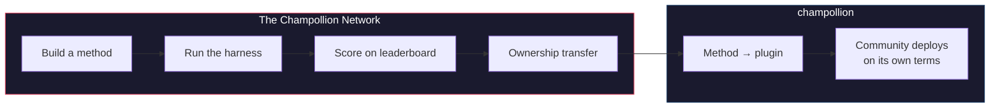

# The Champollion Network

> **บทสรุปผู้บริหาร** The Champollion Network คือโครงสร้างพื้นฐานแบบเปิดเพื่อ*สร้างและเชื่อถือ*ชุดทดสอบการแปลสำหรับคู่ภาษาให้ได้มากที่สุดเท่าที่จะเป็นไปได้ — สร้างขึ้น*ร่วมกับ*ผู้เชี่ยวชาญและชุมชน โดยไม่ได้มาจากการดึงข้อมูล (scrape) จากพวกเขา — และเพื่อให้สามารถสำรวจภาพรวมของสายงานนี้ได้ทั้งหมด: ใครสามารถแปลอะไรได้บ้าง แต่ละวิธีมีประสิทธิภาพดีแค่ไหนในข้อความแต่ละประเภท และมีช่องโหว่อยู่ตรงไหน ทุกวิธีล้วนเป็นที่ยอมรับ ไม่ว่าจะเป็นมนุษย์หรือเครื่องจักร คุณยังสามารถสร้างและส่งวิธีการแปลของคุณ เพื่อดูว่าได้คะแนนเท่าใดเมื่อเทียบกับคลังข้อมูล (corpora) จริง สำหรับภาษาที่ชุมชนเป็นผู้จัดเตรียมข้อมูลให้ อำนาจอธิปไตยเหนือข้อมูลเป็นสิ่งที่ไม่อาจต่อรองได้: ผู้ที่จัดเตรียมคลังข้อมูลจะเป็นผู้ถือกุญแจควบคุมข้อมูลนั้น รวมถึงทุกสิ่งที่ถูกนำมาวัดผลกับข้อมูลดังกล่าว

ส่วนนี้คือหน้าหลักของแผนที่ หน้าต่างๆ ภายใต้ส่วนนี้จะอธิบายว่า
เครือข่ายของคู่ภาษาที่ถูกวัดผลนั้นสร้างขึ้นมาได้อย่างไร ([How the Network
Works](/docs/network/how-it-works)) ทำไมคิวงานสาธารณะถึงจัดอันดับตามที่เป็นอยู่ ([Why the Queue](/docs/network/perspectives/why-the-queue) และ
[Queue Construction spec](/docs/network/specifications/queue-construction))
และความแข็งแกร่งของการเชื่อมต่อถูกคำนวณอย่างไร
([Connection Strength](/docs/network/specifications/connection-strength))
หากคุณกำลังตัดสินใจว่าจะเชื่อถือโปรเจกต์นี้หรือไม่ ให้เริ่มต้นที่
[Honest Limitations](/docs/network/honest-limitations) หากคุณรู้แล้วว่า
ต้องการสร้างอะไร คุณสามารถเริ่มต้นได้ที่
[What Champollion Is](/docs/what-is-champollion)

**ระบบทำงานบนเกณฑ์มาตรฐาน (benchmark) สองประเภท** *Public benchmarks* ใช้ชุดข้อมูลแบบเปิดเพื่อจัดทำแผนที่และจัดอันดับทุกวิธีอย่างเปิดเผยและมีต้นทุนต่ำ — ซึ่งเป็นระดับพื้นฐานที่ใช้ข้อมูลแบบเปิด/ข้อมูลที่ดึงมา โดยมีการระบุความเสี่ยงของการปนเปื้อนข้อมูล (contamination risk) ไว้ *Sovereign benchmarks* คือมาตรฐานระดับทอง (gold standard): เป็นชุดทดสอบลับที่ชุมชนเจ้าของภาษาสร้างขึ้น เป็นเจ้าของ และควบคุม โดยที่ Champollion **จะไม่มีวันได้เห็น** — ประเมินผลแบบปกปิด (blind) และจะทำได้ก็ต่อเมื่อชุมชนอนุญาตเท่านั้น ตัวโครงสร้างพื้นฐานเองนั้นเปิดเผยซอร์สโค้ด (source-available) และได้รับการดูแลโดยผู้ดูแลเพียงรายเดียว สิ่งที่เป็นของชุมชนคือชุดทดสอบสำหรับภาษาของพวกเขาและวิธีการแปลที่สร้างขึ้นสำหรับภาษานั้น

:::info[Launch/seed stage]
เครือข่ายนี้ยังใหม่อยู่แต่เปิดใช้งานจริงแล้ว: กระดานผู้นำ (leaderboard) แสดงผลการรันที่เผยแพร่จริง
และเปิดรับการส่งผลงานจากทุกคน สำหรับสิ่งที่เราทำและยังไม่ได้
กล่าวอ้างอย่างชัดเจน — การตรวจสอบความถูกต้อง, การตรวจสอบโดยชุมชน, การประเมินผลแบบแยกข้อมูลทดสอบ (held-out evaluation) — โปรดดูที่
**[Honest Limitations](/docs/network/honest-limitations)**
:::

---

## ปัญหา

บริการ Cloud Translation ของ Google มีรายชื่อภาษา 194 ภาษา ([Google's published list](https://docs.cloud.google.com/translate/docs/languages)) NLLB-200 ของ Meta ครอบคลุม 200 ภาษา และ OMT-1600 (มีนาคม 2026) อ้างว่าครอบคลุม 1,600 ภาษา แต่มีภาษาพูดบนโลกมากกว่า 7,000 ภาษา สำหรับภาษาประมาณ 1,200 ภาษาที่อยู่ในกลุ่มส่วนน้อย (long tail) ของ OMT-1600 — ตามการคำนวณของเรา: 1,600 ภาษาที่ครอบคลุม ลบด้วย 400+ ภาษาที่ผู้เขียนรายงานว่าโมเดล "เข้าใจได้ดีเพียงพอ" — น้ำหนักของโมเดล (model weights) ไม่เปิดให้ใช้งาน คุณภาพต่ำกว่าเกณฑ์ที่ใช้งานได้ และการประเมินผลใช้ข้อความในโดเมนคัมภีร์ไบเบิลร่วมกับตัวชี้วัดของเครื่องจักรแบบมาตรฐาน — ไม่มีการตรวจสอบความถูกต้องทางสัณฐานวิทยา (morphological validation) ไม่มีการทดสอบอิสระ และไม่มีการกำกับดูแลโดยชุมชน สำหรับภาษาที่เหลืออีกประมาณ 5,400 ภาษา ไม่มีโมเดลที่ผ่านการฝึกสอนล่วงหน้า (pretrained model) ใดที่สามารถสร้างผลลัพธ์ออกมาได้เลย

ปัจจุบันบริษัทเทคโนโลยีขนาดใหญ่ (Big Tech) กำลังลงทุนในการครอบคลุมภาษาที่มีทรัพยากรน้อย (LRL) — แต่การครอบคลุมที่ปราศจากการตรวจสอบคุณภาพอย่างอิสระ การตรวจสอบความถูกต้องทางสัณฐานวิทยา หรือการกำกับดูแลโดยชุมชน คือการครอบคลุมที่ปราศจากความไว้วางใจ ผู้พูดที่ต้องการเครื่องมือแปลภาษามากที่สุดกลับเป็นชุมชนกลุ่มเดียวกันที่มีโอกาสน้อยที่สุดที่จะได้รับการสร้างเครื่องมือเหล่านี้ให้

**เครือข่ายนี้มีอยู่เพื่อเปลี่ยนแปลงสิ่งนั้น** โดยจัดเตรียมโครงสร้างพื้นฐานเพื่อสร้างชุดทดสอบ ประเมินวิธีการใดๆ กับชุดทดสอบเหล่านั้น — ไม่ว่าจะเป็นมนุษย์หรือเครื่องจักร — และจัดทำแผนที่ผลลัพธ์สำหรับภาษาใดๆ ด้วยการให้คะแนนที่สามารถทำซ้ำได้ (reproducible) การส่งผลงานแบบเปิด และการกำกับดูแลโดยชุมชนว่าใครเป็นผู้ควบคุมข้อมูลและผลลัพธ์

ข้อมูลภาษาคือ *ข้อมูลชีวภาพ (biodata)* เช่นเดียวกับข้อมูลทางพันธุกรรมหรือข้อมูลสุขภาพ ภาษาเป็นสิ่งที่นำพาอัตลักษณ์และความสัมพันธ์ของผู้คนที่พูดภาษานั้น และไม่สามารถทำให้เป็นนิรนาม (anonymized) ได้อย่างแท้จริง — ดังนั้นผู้ที่จัดเตรียมคลังข้อมูลจึงเป็นผู้ถือกุญแจควบคุมข้อมูลนั้น รวมถึงทุกสิ่งที่ถูกนำมาวัดผลกับข้อมูลดังกล่าว อำนาจอธิปไตยไม่ใช่ฟีเจอร์ที่ถูกนำมาแปะเพิ่มในภายหลัง แต่เป็นรากฐานที่ใช้สร้างสิ่งอื่นๆ ทั้งหมด

---

## วิธีการทำงาน

1. **คุณสร้างวิธีการแปล** — LLM ที่ได้รับการโค้ช, โมเดลที่ผ่านการปรับแต่ง (fine-tuned), ไปป์ไลน์แบบ FST-gated หรือสิ่งอื่นใดที่สร้างคำแปลได้
2. **ระบบทดสอบ (harness) จะทำการวัดผล (benchmark)** — ด้วยตัวชี้วัดมาตรฐาน (chrF++, exact match, FST acceptance) โดยมีการประทับลายนิ้วมือ (fingerprint) ไปยัง Git commit ที่ระบุ
3. **ผลลัพธ์จะปรากฏบนกระดานผู้นำ** — แสดงผลแบบเรียลไทม์และเปิดรับการส่งผลงาน ทุกการรันที่เผยแพร่สามารถทำซ้ำและเปรียบเทียบได้
4. **เมื่อวิธีการนั้นใช้งานได้ กรรมสิทธิ์จะถูกโอนย้าย** — สำหรับภาษาพื้นเมือง โค้ดของวิธีการนั้นจะถูกโอนไปยังองค์กรกำกับดูแลของชุมชน
5. **ชุมชนนำไปใช้งาน — หากพวกเขาเลือกที่จะทำและตามวิธีที่พวกเขาเลือก** วิธีการนี้สามารถส่งออกเป็นปลั๊กอินของ [champollion](https://champollion.dev) และสามารถรันบนโครงสร้างพื้นฐานของชุมชนได้ทั้งหมด Champollion จะไม่ขอรับส่วนแบ่งใดๆ จากรายได้ที่เกิดขึ้นที่นั่น

**สร้างที่นี่ นำไปใช้งานที่นั่น**

:::tip[Crack a language, win, give it back]
นี่คือปฏิบัติการวัดผล ML อย่างตั้งใจ — การแข่งขันคือวิธีที่คู่ภาษาที่ยากๆ
จะได้รับการแก้ไข เราขอเชิญนักวิจัย ML และนักพัฒนาที่มีความสามารถทุกคนมาสร้างวิธีการ
ที่ดีที่สุดสำหรับคู่ภาษาที่ยากโดยเฉพาะ **รับเงินรางวัลเมื่อมีการเปิดรับ** *และ*ส่งมอบ
วิธีการที่ได้ให้กับองค์กรอธิปไตยที่เป็นเจ้าของภาษานั้น พลังแห่งการแข่งขัน
มีอยู่จริง มันมุ่งเป้าไปที่ภารกิจ ไม่ใช่แค่การไต่อันดับบนกระดานผู้นำ
เพียงเพื่อความสำเร็จส่วนตัว ดูที่ [Prize Specification](/docs/network/specifications/prizes)
:::

---

## สิ่งนี้เหมาะสำหรับใคร

| หากคุณคือ... | เครือข่ายจะมอบสิ่งนี้ให้คุณ... |
|---|---|
| **วิศวกร / นักวิจัย ML** | เกณฑ์มาตรฐานที่เป็นมาตรฐาน, การให้คะแนนที่ทำซ้ำได้, คลังข้อมูลที่ใช้ร่วมกันเพื่อทดสอบ |
| **นักภาษาศาสตร์** | เฟรมเวิร์กสำหรับเปลี่ยนกฎไวยากรณ์และพจนานุกรมให้เป็นวิธีการที่ทดสอบได้ |
| **นักแปลมืออาชีพ / มนุษย์** | พื้นที่สำหรับลงทะเบียนบริการของคุณและให้ผู้คนค้นพบ — การแปลโดยมนุษย์ถือเป็นวิธีการระดับเฟิร์สคลาสที่นี่ ซึ่งจะถูกแสดงรายการและวัดผลเคียงข้างกับเครื่องจักร ไม่ใช่สิ่งที่ถูกนึกถึงในภายหลัง |
| **สมาชิกชุมชนภาษา** | อำนาจในการกำกับดูแลว่าวิธีการสำหรับภาษาของคุณจะถูกพัฒนาและนำไปใช้งานอย่างไร |
| **ผู้ให้ทุน / ผู้พิจารณาทุน** | ตัวชี้วัดที่โปร่งใสและทำซ้ำได้ เพื่อประเมินข้อเสนอโครงการวิจัยด้านการแปล |
| **นักศึกษา** | คำเชิญแบบเปิดกว้างที่สร้างผลกระทบได้จริง — สร้างวิธีการ และร่วมส่งผลลัพธ์ของคุณ |

---

## คลังข้อมูลอ้างอิงที่รองรับ

**กระดานเปิดใช้งานจริงแล้วและยังอยู่ในช่วงเริ่มต้น** — การรันชุดแรกถูกเผยแพร่แล้วและ
จะมีเพิ่มขึ้นเรื่อยๆ เมื่อผู้ร่วมสมทบ (contributors) รันรายการในคิว สิ่งที่แสดงต่อไปนี้ไม่ใช่
กระดานผู้นำ แต่เป็นชุดของคลังข้อมูลอ้างอิงสาธารณะที่ผลงานที่ส่งเข้ามาสามารถนำมา
ให้คะแนนได้ในปัจจุบัน คลังข้อมูลจะไม่ถูกโฮสต์ไว้ที่นี่: ระบบทดสอบจะดึงข้อมูลอ้างอิงจาก
แหล่งที่มาต้นทางในขณะรันไทม์ (run time) และให้คะแนนเทียบกับข้อมูลที่เพิ่งดึงมาใหม่

### Global Voices (OPUS) — โดเมนข่าว
- **ความครอบคลุม:** 493 คู่ภาษาที่จัดทำแคตตาล็อกและสามารถรันได้ (เช่น `eval-amh-fra-globalvoices-test-v1`, Amharic → French)
- **สัญญาอนุญาต:** CC BY 3.0
- **แหล่งที่มา:** [Global Voices via OPUS](https://opus.nlpl.eu/)

### Tatoeba — โดเมนสนทนา / ผสม
- **ความครอบคลุม:** 874 คู่ภาษาที่จัดทำแคตตาล็อกและสามารถรันได้ (เช่น `eval-afr-eng-tatoeba-dev-v1`, Afrikaans → English)
- **สัญญาอนุญาต:** CC BY 2.0
- **แหล่งที่มา:** [Tatoeba community](https://tatoeba.org)

:::note[EdTeKLA is research-only — not a ranking benchmark]
คลังข้อมูล EdTeKLA Plains Cree (*Cree: Language of the Plains*) ใช้
[**modified** CC BY-NC-SA ของ EdTeKLA](https://github.com/EdTeKLA/IndigenousLanguages_Corpora)
— ซึ่งเป็นเงื่อนไขที่ไม่ใช่เพื่อการค้าและอยู่ภายใต้ขอบเขตของอำนาจอธิปไตย (หนังสือเรียนต้นฉบับใช้ CC
BY-NC-ND 4.0) คลังข้อมูลนี้ **ถูกแยกออกจากการจัดอันดับทั้งหมด** — ไม่มีสิทธิ์เข้าร่วม
กระดานผู้นำ รางวัลใดๆ หรือช่องทาง API/เชิงพาณิชย์ — และการประเมินผลผ่าน
model-API ระยะไกลนั้น **ต้องได้รับความยินยอม (consent-gated)**: ระบบทดสอบจะปฏิเสธการส่ง
ข้อความไปยัง API ของโมเดลบุคคลที่สาม เว้นแต่จะมีการบันทึกการอนุญาตอย่างชัดแจ้ง
จากผู้ถือสิทธิ์ (ยังคงสามารถประเมินผลแบบโลคัลได้)

FLORES+ **ถูก**เชื่อมต่อและสามารถรันได้ที่นี่ (870 คู่ภาษาที่จัดทำแคตตาล็อก เช่น
`eval-flores-devtest-v1-amh-fra`) แต่มันมี **การปนเปื้อนสูง (HIGH-contamination)** — เป็นข้อมูล
การประเมินผลสาธารณะที่รวบรวมจากเว็บ (web-crawled) ซึ่งโมเดลระดับแนวหน้า (frontier models) มีแนวโน้มสูงมากที่จะเคยเห็นมาแล้ว
ดังนั้นจึงเป็นแบบ **สัมพัทธ์เท่านั้น (relative-only)**: สามารถใช้เปรียบเทียบวิธีการแบบตัวต่อตัวได้ แต่
**จะไม่ถูกรายงานเป็นเกณฑ์มาตรฐานคุณภาพสัมบูรณ์ (absolute-quality benchmark)** และมีไว้เพื่อ **การทดสอบ /
ภาพประกอบเท่านั้น** ผลลัพธ์จาก FLORES+ จะไม่ถูกจัดอันดับเป็นคะแนนคุณภาพ และ
จะไม่ถูกใช้เป็นเส้นเชื่อม (chain edge) บน [translation map](https://champollion.dev)
ดูที่ [Honest Limitations](/docs/network/honest-limitations) สำหรับสิ่งที่เรา
กล่าวอ้างและไม่ได้กล่าวอ้างอย่างชัดเจน
:::

---

## กฎข้อเดียว

:::danger[Do not train on evaluation data]
วิธีการที่สัมผัสกับชุดข้อมูลเกณฑ์มาตรฐาน — ไม่ว่าจะเป็นข้อมูลสำหรับฝึกสอน (training data), ตัวอย่างแบบ few-shot, รายการในพจนานุกรม หรือเนื้อหาในพรอมต์ — จะถูก **ตัดสิทธิ์ (disqualified)** คุณสามารถปรับแต่ง (fine-tune) กับอะไรก็ได้ที่คุณต้องการ เพียงแต่ต้องไม่ใช่ชุดทดสอบ
:::

---

## ขั้นตอนต่อไป

- **[Submit a Method](/docs/network/getting-started/submit-a-method)** — วิธีส่งการรันเกณฑ์มาตรฐานครั้งแรกของคุณ
- **[Benchmark Specification](/docs/network/specifications/benchmark)** — โปรโตคอลการทดลองฉบับเต็ม
- **[Leaderboard Rules](/docs/network/leaderboard/rules)** — เกณฑ์การส่งผลงานและนโยบายป้องกันการโกง (anti-gaming)
- **[Data Stewardship](/docs/network/sovereignty/data-sovereignty)** — คลังข้อมูลจะยังคงอยู่กับผู้ดูแล สัญญาอนุญาตทุกฉบับจะได้รับการเคารพ
- **[How the Work Is Funded](/docs/network/sovereignty/economic-model)** — ไม่ใช่เชิงพาณิชย์และปัจจุบันใช้ทุนส่วนตัว ต้องการผู้ให้ทุน และปลายทางของเงินทุกดอลลาร์จะถูกเผยแพร่

**[→ ดูกระดานผู้นำ](https://champollion.dev/leaderboard)**
