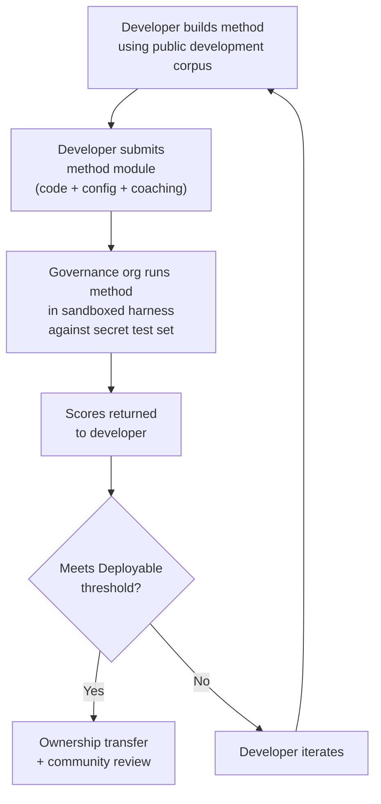

# ข้อกำหนดการประเมินผล (Benchmark Specification)

> **บทสรุปผู้บริหาร** เอกสารนี้กำหนดโปรโตคอลการประเมินสำหรับระบบนิเวศการประเมิน MT ของ Champollion: รูปแบบคลังข้อมูล (§2), สคีมาของ run card (§3), โปรโตคอลการวัดประสิทธิภาพ (§6), ข้อกำหนดการตรวจสอบความถูกต้องโดยมนุษย์ (§7), กลไกอธิปไตย (§8), กระดานผู้นำและโมเดลการส่งผลงาน (§9), กรอบการทำงานด้านต้นทุน (§10) และความสามารถในการขยายไปยังภาษาใหม่ (§11) สำหรับคำจำกัดความของเมตริก, น้ำหนักการให้คะแนนแบบผสม, เกณฑ์ระดับคุณภาพ และสูตรเมตริกต้นทุน/ความเร็ว โปรดดู `SCORING_SPEC.md` — ซึ่งเป็นแหล่งข้อมูลความจริงเพียงหนึ่งเดียวสำหรับตรรกะการให้คะแนนทั้งหมด เอกสารนี้อ้างอิง SCORING_SPEC สำหรับรายละเอียดเหล่านั้นแทนที่จะทำซ้ำ


---

## 1. หลักการ

### 1.1 ภาษาคือข้อมูลชีวภาพ

ภาษาไม่ใช่วัสดุทดสอบที่เป็นกลาง เช่นเดียวกับข้อมูลทางพันธุกรรมหรือข้อมูลสุขภาพ ข้อมูลภาษาคือ **ข้อมูลชีวภาพ (biodata)**: มันบรรจุอัตลักษณ์ ความสัมพันธ์ทางเครือญาติ และความสัมพันธ์ของผู้คนที่พูดภาษานั้น และไม่สามารถทำให้ไม่ระบุตัวตนได้อย่างมีความหมาย — แม้จะลบข้อมูลเมตาออก ภาษาก็ยังคงเข้ารหัสว่าผู้คนเหล่านั้นเป็นใคร ผลที่ตามมาสำหรับข้อกำหนดนี้มีความเป็นรูปธรรม: ผู้ที่จัดทำคอร์ปัสถือกุญแจสำหรับคอร์ปัสนั้น และสำหรับทุกสิ่งที่วัดเทียบกับมัน ดังนั้น อธิปไตย (§8) จึงไม่ใช่ส่วนเสริมของโปรโตคอล แต่เป็นเงื่อนไขเบื้องต้น และหลักการอื่นๆ ทั้งหมดด้านล่างนี้ดำเนินการภายใต้มัน

### 1.2 เมตริกอัตโนมัติคือตัวแทน

เมตริกทุกตัวที่กำหนดในเอกสารนี้คำนวณโดยเครื่อง chrF++, การยอมรับ FST, ความแม่นยำทางสัณฐานวิทยา, ความคล้ายคลึงทางความหมาย — ทั้งหมดเป็นตัวแทนอัตโนมัติสำหรับคุณภาพการแปล มีประโยชน์สำหรับการวนซ้ำอย่างรวดเร็ว การเปรียบเทียบอย่างเป็นระบบ และการตรวจจับการถดถอย แต่ **ไม่ใช่สิ่งทดแทนการตัดสินของมนุษย์**

ลำดับชั้นการประเมิน:

```
Automated metrics (run cards, benchmarks)
    ↓ proxy for
Human review (bilingual speakers validate output)
    ↓ proxy for
Actual utility (does this help a language community?)
```

ไม่มีคะแนนอัตโนมัติใด ไม่ว่าจะสูงเพียงใด สามารถแทนที่ผู้พูดที่คล่องแคล่วที่อ่านผลลัพธ์และยืนยันว่าถูกต้อง เป็นธรรมชาติ และเหมาะสมทางวัฒนธรรมได้ ระดับคุณภาพที่กำหนดใน §5 เป็นป้ายกำกับฮิวริสติกบนคะแนนรวมอัตโนมัติ — มีประโยชน์สำหรับการติดตามความคืบหน้า แต่ไม่เพียงพอด้วยตัวเองเลย

### 1.3 วิธีการ ไม่ใช่โมเดล

เราประเมิน **วิธีการ** ไม่ใช่โมเดล โมเดลคือส่วนประกอบหนึ่ง วิธีการคือสูตรทั้งหมด: การเลือกโมเดล การออกแบบ prompt การใช้เครื่องมือ การประมวลผลก่อน/หลัง ข้อมูลการฝึกสอน กลยุทธ์การลองใหม่ ทุกอย่าง ทีมสองทีมที่ใช้โมเดลเดียวกันด้วยวิธีการที่ต่างกันจะได้คะแนนที่ต่างกัน นั่นคือจุดประสงค์

### 1.4 ความสามารถในการทำซ้ำ

ผลลัพธ์ benchmark ทุกรายการต้องสามารถทำซ้ำได้ run card (§3) บันทึกการกำหนดค่าที่สมบูรณ์ของการทดลอง fingerprint (§3.5) ระบุการตั้งค่าการทดลอง run card hash (§3.6) ตรวจสอบความสมบูรณ์ของผลลัพธ์ ใครก็ตามที่มีวิธีการ คอร์ปัส และการกำหนดค่าเดียวกันควรได้คะแนนภายใน ±2% (คำนึงถึงความไม่แน่นอนของการสุ่มตัวอย่าง LLM ที่อุณหภูมิ > 0)

### 1.5 ไม่มีข้อมูลการประเมินสังเคราะห์

**โครงการนี้ไม่สร้าง ใช้ หรือรับรองข้อมูลการประเมินสังเคราะห์** คอร์ปัสทั้งหมดต้องมาจากข้อความที่มนุษย์เขียนจริง — การแปลที่ตีพิมพ์ ตำราเรียน เอกสารสองภาษา หรือการแปลที่ได้รับจากผู้พูดที่คล่องแคล่ว

LLM อาจช่วยในเรื่อง:
- การจัดแนวประโยค (การค้นหาข้อความคู่ขนานในข้อความสองภาษาที่มีอยู่)
- การแปลงรูปแบบ (การแปลงวัสดุที่ตีพิมพ์เป็นสคีมาคอร์ปัส)
- การเพิ่มข้อมูลเมตา (การแนะนำระดับความยาก ป้ายกำกับทะเบียน)
- การเสนอประโยคต้นฉบับสำหรับการแปลโดยมนุษย์ (§11.3 — ขั้นตอนการแปลเป็นของมนุษย์เสมอ)

LLM **ต้องไม่** สร้างการแปลอ้างอิงหรือคู่การประเมิน

**เราเป็นกลางในการพัฒนาเกี่ยวกับข้อมูลการฝึก** หากนักพัฒนาวิธีการใช้ข้อมูลการฝึกสังเคราะห์ การแปลกลับ หรือการเพิ่มข้อมูลในวิธีการของตน นั่นเป็นทางเลือกของพวกเขา — เราประเมินผลลัพธ์ ไม่ใช่กระบวนการฝึก OMT-1600 ของ Meta ใช้ประโยคคู่ขนานสังเคราะห์ประมาณ 270 ล้านประโยคที่สร้างผ่านการแปลกลับ เราไม่มีข้อโต้แย้งต่อวิธีการที่ฝึกด้วยวิธีนี้ เราทดสอบบนการดูแลโดยมนุษย์เท่านั้น

> **ทำไมไม่ใช้ข้อความพระคัมภีร์สำหรับการประเมิน?** OMT-1600 ประเมิน 1,560 จาก 1,600 ภาษาบนข้อความโดเมนพระคัมภีร์ (Meta AI, *Omnilingual MT*, arXiv:2603.16309, 2026) การแปลพระคัมภีร์มีทะเบียนโบราณ คำศัพท์พิธีกรรม และโครงสร้างประโยคแบบสูตร คอร์ปัสการประเมินของเราได้มาจากข้อความที่ดูแลโดยชุมชน หลากหลายโดเมน — สุขภาพ กฎหมาย การศึกษา รัฐบาล การสนทนา และโดเมนเทคนิค (ดู §2.7) นี่เป็นการเลือกออกแบบโดยเจตนา ชุมชนต้องการการแปลสำหรับโดเมนที่พวกเขาใช้ชีวิตและทำงานจริง ไม่ใช่ทะเบียนทางศาสนาเดียว วิธีการที่ได้คะแนนดีใน Genesis 1:1 แทบไม่บอกอะไรเกี่ยวกับประสิทธิภาพในวาระการประชุมสภาชนเผ่าหรือแบบฟอร์มรับผู้ป่วยของคลินิก

---

## 2. สคีมาคอร์ปัส

คอร์ปัสคือชุดคู่ข้อความคู่ขนานที่ดูแลแล้วพร้อมข้อมูลเมตาที่มีโครงสร้าง เป็นความจริงพื้นฐานที่วิธีการทั้งหมดถูกวัดเทียบกับมัน

### 2.1 Dataset Envelope

โครงสร้างระดับบนสุดของไฟล์คอร์ปัส:

```json
{
  "dataset": {
    "id": "edtekla-dev-v1",
    "version": "1.0",
    "language_pair": "EN→CRK",
    "source_language": "en",
    "target_language": "crk",
    "created": "2026-05-01",
    "license": "LicenseRef-EdTeKLA-Modified-CC-BY-NC-SA-4.0",
    "provenance": ["gold_standard", "textbook"]
  },
  "entries": [ ... ]
}
```

| ฟิลด์ | ประเภท | จำเป็น | คำอธิบาย |
|-------|------|----------|-------------|
| `id` | string | ✅ | ตัวระบุชุดข้อมูลที่ไม่ซ้ำกัน ใช้ใน run card และ leaderboard |
| `version` | string | ✅ | Semantic version การเพิ่มค่าจะทำให้การเปรียบเทียบ run card ก่อนหน้าไม่ถูกต้อง |
| `language_pair` | string | ✅ | ป้ายกำกับแสดงผล (เช่น `EN→CRK`) |
| `source_language` | string | ✅ | รหัสภาษาต้นฉบับ BCP 47 |
| `target_language` | string | ✅ | รหัสภาษาเป้าหมาย BCP 47 |
| `created` | string | ✅ | วันที่สร้าง ISO 8601 |
| `license` | string | ✅ | ตัวระบุใบอนุญาต SPDX |
| `provenance` | string[] | ✅ | รายการแท็กที่มาที่ใช้ในรายการต่างๆ |

### 2.2 สคีมารายการ

แต่ละรายการในคอร์ปัสแสดงถึงความท้าทายการแปลหนึ่งรายการ:

```json
{
  "id": 42,
  "source": "I see the dog",
  "reference": "niwâpamâw atim",
  "segment": "gold_standard",
  "difficulty": 2,
  "provenance": "gold_standard",
  "register": "conversational",
  "context": "declaration",
  "morphological_analysis": "ni-wâpam-âw atim | 1sg-see.TA-3sg.DIR dog.AN",
  "notes": "Animate noun (atim); direct form because speaker is proximate",
  "variant_class": "simple-ta-direct"
}
```

| ฟิลด์ | ประเภท | จำเป็น | คำอธิบาย |
|-------|------|----------|-------------|
| `id` | integer | ✅ | ตัวระบุที่ไม่ซ้ำกันภายในคอร์ปัส |
| `source` | string | ✅ | ข้อความต้นฉบับในภาษาต้นทาง |
| `reference` | string | ✅ | การแปลอ้างอิงมาตรฐานทองในภาษาเป้าหมาย |
| `segment` | string | 📎 | พาร์ติชันคอร์ปัส: `gold_standard`, `held_out`, `development`, หรือ `diagnostic` |
| `difficulty` | integer | 📎 | การให้คะแนนความยาก 1–5 (ดู §2.4) |
| `provenance` | string | 📎 | ที่มาของรายการนี้ (ดู §2.5) |
| `register` | string | 📎 | ระดับทะเบียน/ความเป็นทางการ (ดู §2.6) |
| `context` | string | 📎 | หน้าที่การสื่อสาร (ดู §2.6) |
| `domain` | string | 📎 | โดเมนกรณีการใช้งานจากอนุกรมวิธาน 16 รหัส (ดู §2.7) ต้องเป็นหนึ่งใน: `conv`, `ecommerce`, `edu`, `financial`, `gov`, `legal`, `literary`, `marketing`, `medical`, `news`, `religious`, `scientific`, `subtitles`, `support`, `tech`, `ui` ตรวจสอบความถูกต้องในขณะสร้าง |

> **📎 = แนะนำ** harness จัดการฟิลด์ที่ไม่บังคับที่หายไปอย่างสง่างามผ่านค่าเริ่มต้น คอร์ปัสของบุคคลที่สามต้องระบุเพียง `id`, `source`, และ `reference` ต่อรายการ
| `morphological_analysis` | string | ❌ | การแยกสัณฐานวิทยามาตรฐานทอง |
| `notes` | string | ❌ | หมายเหตุผู้แปล ตัวแปรภาษาถิ่น แฟล็กความกำกวม |
| `variant_class` | string | ❌ | ป้ายกำกับคลาสที่จัดกลุ่มตัวแปรการแปลที่ยอมรับได้ |


### 2.3 เซกเมนต์คอร์ปัส

คอร์ปัสแบ่งออกเป็นเซกเมนต์ที่มีระดับการเข้าถึงต่างกัน:

| เซกเมนต์ | วัตถุประสงค์ | การเข้าถึง | ขนาดขั้นต่ำ |
|---------|---------|--------|-------------|
| `development` | การพัฒนาและวนซ้ำวิธีการ นักพัฒนาใช้ได้อย่างอิสระ | **สาธารณะ** | 30 รายการ |
| `diagnostic` | การทดสอบเป้าหมายสำหรับปรากฏการณ์ทางภาษาเฉพาะ | **สาธารณะ** | 10 รายการ |
| `gold_standard` | การประเมิน benchmark อย่างเป็นทางการ คะแนน leaderboard มาจากที่นี่ | **ลับ** — ถือครองโดยองค์กรกำกับดูแล | 50 รายการ |
| `held_out` | สำรองสำหรับการประเมินในอนาคต ไม่ใช้จนกว่าจะเปิดใช้งาน | **ลับ** — ถือครองโดยองค์กรกำกับดูแล | 10 รายการ |

> **สถานะปัจจุบัน:** มีเพียงเซกเมนต์ `development` เท่านั้นที่มีอยู่ในชุดข้อมูลที่จัดส่ง เซกเมนต์ `diagnostic`, `gold_standard`, และ `held_out` ถูกกำหนดไว้สำหรับการใช้งานในอนาคตเมื่อคอร์ปัสเติบโตขึ้น

เซกเมนต์ `gold_standard` และ `held_out` เป็นความลับอย่างสมบูรณ์ ทั้งประโยคต้นฉบับและการแปลอ้างอิงถูกเก็บไว้บนโครงสร้างพื้นฐานที่ควบคุมโดยการกำกับดูแล นักพัฒนาวิธีการไม่เคยเห็นคำถามหรือคำตอบ ดู §8 สำหรับกลไกอธิปไตย

### 2.4 ระดับความยาก

| ระดับ | คำอธิบาย | ตัวอย่าง |
|------|-------------|----------|
| 1 — คำศัพท์พื้นฐาน | คำเดี่ยว คำทักทายทั่วไป ตัวเลข | "hello" → "tânisi", "dog" → "atim" |
| 2 — ประโยคง่าย | ประธาน-กริยา หรือ SVO กาลปัจจุบัน | "I see the dog" → "niwâpamâw atim" |
| 3 — ความซับซ้อนปานกลาง | กาลอดีต/อนาคต การครอบครอง ความมีชีวิต | "I saw his dog yesterday" |
| 4 — สัณฐานวิทยาซับซ้อน | Obviation, passive voice, conjunct order, อนุประโยคสัมพันธ์ | "the woman whose son went to the store" |
| 5 — ขั้นสูง | หลายอนุประโยค ทะเบียนทางการ พิธีกรรม สำนวน | ย่อหน้าเต็มพร้อมน้ำเสียงที่เหมาะสมกับทะเบียน |

คอร์ปัสที่สร้างขึ้นอย่างดีควรมีรายการครอบคลุมระดับความยากทั้งห้าระดับ โดยเน้นที่ระดับ 2–4 ซึ่งเป็นที่ที่ความท้าทายการแปลในโลกจริงส่วนใหญ่อยู่

### 2.5 แท็กที่มา

ทุกรายการต้องระบุที่มา:

| แท็ก | ความหมาย |
|-----|---------|
| `gold_standard` | ตรวจสอบโดยผู้พูดที่คล่องแคล่ว |
| `textbook` | จากวัสดุการศึกษาที่ตีพิมพ์ |
| `elicited` | ผลิตผ่านเซสชันการดึงข้อมูลที่มีโครงสร้าง |
| `corpus` | ดึงมาจากคอร์ปัสคู่ขนาน |

> **หมายเหตุ:** ในทางปฏิบัติ ค่าที่มาเป็นสตริงอิสระ แท็กข้างต้นเป็นแบบแผน ไม่ใช่ enum ที่ตรวจสอบแล้ว — ชุดข้อมูลอาจใช้สตริงที่มาเชิงพรรณนาอื่นๆ

### 2.6 ทะเบียนและบริบท

**ทะเบียน** อธิบายความเป็นทางการและบริบททางสังคม:

| ทะเบียน | คำอธิบาย |
|----------|-------------|
| `conversational` | การพูดในชีวิตประจำวันระหว่างผู้เท่าเทียมกัน |
| `formal` | ภาษาทางการหรือสถาบัน |
| `technical` | คำศัพท์เฉพาะโดเมน |
| `ceremonial` | การใช้ภาษาแบบดั้งเดิมหรือศักดิ์สิทธิ์ |
| `educational` | วัสดุการสอนภาษา |

**บริบท** อธิบายหน้าที่การสื่อสาร:

> 🔲 **วางแผนไว้** ฟิลด์ `context` ถูกกำหนดในสคีมาแต่ยังไม่ได้ใส่ข้อมูลในชุดข้อมูลปัจจุบัน สำรองไว้สำหรับการเพิ่มคอร์ปัสในอนาคต

| บริบท | คำอธิบาย |
|---------|-------------|
| `greeting` | การทักทายหรือการลาทางสังคม |
| `declaration` | การระบุข้อเท็จจริง |
| `question` | ประโยคคำถาม |
| `instruction` | คำสั่งหรือคำสั่งการ |
| `narrative` | การเล่าเรื่องหรือการบรรยาย |
| `label` | ป้ายกำกับ UI ข้อความปุ่ม หรือหัวข้อ |
| `error` | ข้อความแสดงข้อผิดพลาดหรือคำเตือน |

### 2.7 โดเมน {#27-domain}

**โดเมน** อธิบายกรณีการใช้งานในโลกจริง — ประเภทของเนื้อหาที่กำลังแปล ซึ่งตั้งฉากกับทะเบียนและบริบท:

- **ทะเบียน** ตอบคำถาม: *สิ่งนี้เป็นทางการแค่ไหน?*
- **บริบท** ตอบคำถาม: *ประโยคนี้กำลังทำอะไร?*
- **โดเมน** ตอบคำถาม: *อุตสาหกรรม/กรณีการใช้งานนี้คืออะไร?*

สัญญาทางกฎหมาย (โดเมน: `legal`) อาจเป็นทางการ (ทะเบียน: `formal`) และมีการประกาศ (บริบท: `declaration`) บทสนทนา chatbot ทางกฎหมาย (โดเมน: `legal`) อาจเป็นการสนทนา (ทะเบียน: `conversational`) และมีคำถาม (บริบท: `question`) โดเมนเดียวกัน ทะเบียนและบริบทต่างกัน

| รหัสโดเมน | คำอธิบาย | ผู้บริโภคทั่วไป |
|-------------|-------------|-------------------|
| `ui` | สตริงอินเทอร์เฟซซอฟต์แวร์ | นักพัฒนาแอป ทีม localization |
| `legal` | สัญญา กฎหมาย การยื่นศาล เอกสารการย้ายถิ่น | สำนักงานกฎหมาย ศาล ทีมปฏิบัติตามกฎระเบียบ ทนายความทรัพย์สินทางปัญญา |
| `medical` | บันทึกทางคลินิก ฉลากยา การสื่อสารกับผู้ป่วย โปรโตคอลการทดลอง | โรงพยาบาล บริษัทยา การทดลองทางคลินิก พอร์ทัลผู้ป่วย |
| `financial` | การธนาคาร ประกันภัย การยื่นกำกับดูแล รายงานการตรวจสอบ | ธนาคาร บริษัทประกัน หน่วยงานกำกับดูแล ผู้ตรวจสอบ |
| `edu` | ตำราเรียน หลักสูตร แผนการสอน วัสดุวิชาการ | โรงเรียน มหาวิทยาลัย สำนักพิมพ์ตำราเรียน |
| `ecommerce` | คำอธิบายสินค้า รีวิว รายการตลาด | ผู้ค้าปลีกออนไลน์ ผู้ขายในตลาด |
| `marketing` | ข้อความโฆษณา ข้อความแบรนด์ แคมเปญ สโลแกน | เอเจนซีโฆษณา ทีมแบรนด์ |
| `gov` | เอกสารนโยบาย กฎระเบียบ ประกาศสาธารณะ กฎหมาย | หน่วยงานรัฐบาล ทีมปฏิบัติตามกฎระเบียบ |
| `scientific` | บทความวิจัย บทคัดย่อ วิธีการ ข้อเสนอทุน | นักวิจัย วารสาร หน่วยงานทุน |
| `religious` | พระคัมภีร์ ข้อความพิธีกรรม คำอธิบายเทววิทยา | ชุมชนศรัทธา สำนักพิมพ์พิธีกรรม |
| `support` | FAQ ข้อความแสดงข้อผิดพลาด คู่มือการแก้ปัญหา สคริปต์ chatbot | บริษัท SaaS ฝ่ายช่วยเหลือ |
| `subtitles` | บทสนทนาภาพยนตร์ ทีวี สตรีมมิ่ง และเกม | แพลตฟอร์มสตรีมมิ่ง สตูดิโอ บริษัทเกม |
| `news` | วารสารศาสตร์ รายงานข่าว บทบรรณาธิการ ข่าวประชาสัมพันธ์ | องค์กรสื่อ บริการข่าว |
| `literary` | นิยาย บทกวี เรื่องเล่า ข้อความวัฒนธรรม | สำนักพิมพ์ องค์กรอนุรักษ์วัฒนธรรม |
| `conv` | การสนทนาไม่เป็นทางการ โซเชียลมีเดีย การส่งข้อความ | แอปผู้บริโภค แพลตฟอร์มโซเชียล |
| `tech` | เอกสาร API คู่มือ ข้อกำหนดวิศวกรรม คู่มือเทคนิค | ทีมเอกสาร องค์กรวิศวกรรม |

> **Benchmark เฉพาะโดเมน** benchmark ทั่วไปประเมินวิธีการในทุกโดเมน แต่ Network ยังรองรับ **benchmark ที่กรองตามโดเมน** — ซึ่งคะแนนคำนวณเฉพาะรายการที่ติดแท็กด้วยโดเมนเฉพาะ ซึ่งช่วยให้ผู้ใช้ตอบคำถามได้ว่า: "วิธีการใดดีที่สุดสำหรับการแปลเอกสารทางกฎหมายเป็นภาษาฝรั่งเศส?" เทียบกับ "วิธีการใดมีคะแนนภาษาฝรั่งเศสโดยรวมดีที่สุด?"
>
> การจัดอันดับ leaderboard ที่กรองตามโดเมนช่วยให้ผู้ใช้เปรียบเทียบวิธีการภายในกรณีการใช้งานเดียว วิธีการต่างๆ ทำงานต่างกันในแต่ละโดเมน — วิธีการที่ปรับแต่งสำหรับคำศัพท์ทางกฎหมายอาจได้คะแนนสูงกว่ามากในข้อความทางกฎหมายมากกว่าข้อความสนทนา Network ช่วยให้ผู้ใช้ค้นหาวิธีการที่เหมาะสมที่สุดสำหรับกรณีการใช้งานเฉพาะของตน

> **อนาคต: Network assistant** ผู้ช่วยสนทนาที่ช่วยให้ผู้ใช้อธิบายกรณีการใช้งาน MT ของตน (โดเมน คู่ภาษา ข้อกำหนดคุณภาพ) และแสดงวิธีการที่ผ่านการตรวจสอบโดยชุมชนจาก leaderboard — ตัวอย่างเช่น "วิธีการใดได้คะแนนสูงสุดใน benchmark EN→JA โดเมนการแพทย์?" — เป็นเครื่องมือช่วยนำทางที่เรากำลังพิจารณา โดยขึ้นอยู่กับข้อมูลการประเมินที่ติดแท็กตามโดเมนและความหลากหลายของวิธีการที่เพียงพอ

---

## 3. สคีมา Run Card {#3-run-card-schema}

run card คือหน่วยอะตอมของการประเมิน เป็นเอกสาร JSON ที่มีตัวเองครบถ้วนซึ่งบันทึกการกำหนดค่าและผลลัพธ์ที่สมบูรณ์ของการรันการประเมินครั้งเดียว: วิธีการหนึ่ง โมเดลหนึ่ง การกำหนดค่าหนึ่ง ชุดข้อมูลหนึ่ง

run card ทุกรายการบันทึกสามมิติ:
- **คุณภาพ** — การแปลดีแค่ไหน?
- **ต้นทุน** — ใช้ต้นทุนเท่าไรในการผลิต?
- **ความเร็ว** — ใช้เวลานานแค่ไหน?

### 3.1 ฟิลด์ระดับบนสุด

| ฟิลด์ | ประเภท | คำอธิบาย |
|-------|------|-------------|
| `run_id` | string | UUID v4 ที่สร้างขึ้นเมื่อเริ่มต้นการรัน |
| `harness_version` | string | Semantic version ของ harness (เช่น `2.0`) |
| `timestamp` | string | Timestamp UTC ISO 8601 เมื่อการรันเริ่มต้น |
| `elapsed_seconds` | number | ระยะเวลา wall-clock ของการรันทั้งหมด |

### 3.2 การกำหนดค่าวิธีการ

ฟิลด์เหล่านี้กำหนดการตั้งค่าการทดลอง — สิ่งที่ทดสอบและอย่างไร

| ฟิลด์ | ประเภท | จำเป็น | คำอธิบาย |
|-------|------|----------|-------------|
| `model_slug` | string | ✅ | ตัวระบุโมเดล (เช่น `google/gemini-2.5-flash`) |
| `model_id` | string | ❌ | ตัวระบุโมเดลที่แก้ไขแล้วที่ API ส่งคืน |
| `condition` | string | ✅ | ป้ายกำกับการทดลอง (เช่น `baseline`, `coached-v3`, `few-shot`) |
| `temperature` | number | ✅ | อุณหภูมิการสุ่มตัวอย่าง |
| `system_prompt_sha256` | string | ✅ | แฮช SHA-256 ของ system prompt เต็ม |
| `system_prompt_used` | string | ✅ | ข้อความ system prompt เต็ม |
| `coaching_data_sha256` | string | ❌ | แฮช SHA-256 ของไฟล์ข้อมูลการฝึกสอน หากใช้ |
| `fst_version` | string | ❌ | เวอร์ชันของ FST analyzer หากใช้ |
| `tools_enabled` | string[] | ❌ | รายการเครื่องมือที่วิธีการสามารถใช้ได้ |
| `batch_size` | number | ❌ | รายการต่อ API batch พร้อมกัน |
| `max_retries` | number | ❌ | จำนวนการลองใหม่สูงสุดสำหรับการปฏิเสธ FST หากมี |

:::info[Run Card ที่เผยแพร่แล้วจะมี method_config รวมอยู่ด้วย]
เมื่อ run card ถูกเผยแพร่ไปยัง leaderboard (ผ่าน `mt-eval publish`) จะมีบล็อก `method_config` รวมอยู่ด้วย ซึ่งประกอบด้วย MethodConfig แบบ canonical 8 ฟิลด์ (`model`, `temperature`, `batchSize`, `register`, `coachingFile`, `coachingPrompt`, `promptContext`, `qualityTier` — ทั้งหมดเป็น camelCase) ซึ่งช่วยให้นำเข้าได้โดยไม่ต้องสร้างข้อมูลใหม่: `champollion leaderboard --install` อ่าน `method_config` โดยตรงและเขียนเป็น plugin manifest ฟิลด์ telemetry ข้างต้น (§3.2) บันทึกสิ่งที่ harness สังเกตได้ ส่วน `method_config` บันทึกสิ่งที่นักพัฒนาตั้งใจไว้
:::

### 3.3 การอ้างอิงชุดข้อมูล

| ฟิลด์ | ประเภท | คำอธิบาย |
|-------|------|-------------|
| `dataset.id` | string | ตัวระบุชุดข้อมูล |
| `dataset.version` | string | เวอร์ชันชุดข้อมูล |
| `dataset.language_pair` | string | ป้ายกำกับแสดงผล |
| `dataset.sha256` | string | แฮช SHA-256 ของเนื้อหาไฟล์ชุดข้อมูล |
| `dataset.entry_count` | number | จำนวนรายการที่ประเมิน |

แฮช SHA-256 ของชุดข้อมูลยึด run card กับเวอร์ชันเฉพาะของข้อมูล หากชุดข้อมูลเปลี่ยนแปลง run card เก่าจะไม่สามารถเปรียบเทียบได้

### 3.4 คะแนน (คุณภาพ)

เมตริกรวมสำหรับการรันทั้งหมด เมตริกคุณภาพทั้งหมดเป็น **อัตโนมัติ** — ดู §1.2

| ฟิลด์ | ประเภท | คำอธิบาย |
|-------|------|-------------|
| `scores.total` | number | รายการทั้งหมดที่ประเมิน |
| `scores.exact_matches` | number | รายการที่ผลลัพธ์ตรงกับอ้างอิงทุกประการ |
| `scores.exact_match_rate` | number | 0.0–1.0 |
| `scores.equivalent_matches` | number | รายการที่ตรงกับตัวแปรที่ยอมรับได้ |
| `scores.equivalent_match_rate` | number | 0.0–1.0 |
| `scores.fst_accepted` | number | รายการที่ FST analyzer ยอมรับ |
| `scores.fst_acceptance_rate` | number | 0.0–1.0, `null` หากไม่ได้กำหนดค่า FST |
| `scores.morphological_accuracy` | number | 0.0–1.0, FST-derived (lemma-matched), `null` หากไม่มี FST / ไม่มีคำที่ lemma-matched ที่ปรึกษาจนกว่าจะเปิดใช้งาน — ดู Scoring Spec §2.2 |
| `scores.morph_coverage` | number | 0.0–1.0, สัดส่วนของคำที่คาดการณ์ที่วิเคราะห์ได้ซึ่ง lemma-matched กับอ้างอิง (เปิดเผยว่า `morphological_accuracy` เบาบางแค่ไหน) |
| `scores.chrf_plus_plus` | number | คะแนน chrF++ ระดับคอร์ปัส (0–100) |
| `scores.semantic_score` | number | ความคล้ายคลึงทางความหมายแบบ embedding (0.0–1.0) |
| `scores.ter` | number | Translation Edit Rate (0–∞ ยิ่งต่ำยิ่งดี) |
| `scores.length_ratio` | number | avg(len(predicted)/len(reference)) ค่าอุดมคติ = 1.0 |
| `scores.code_switching_rate` | number | 0.0–1.0, สัดส่วนรายการที่มีการรั่วไหลของภาษาต้นทาง |
| `scores.hallucination_rate` | number | 0.0–1.0, สัดส่วนรายการที่มีเนื้อหาที่สร้างขึ้นเอง |
| `scores.terminology_adherence` | number | 0.0–1.0, การปฏิบัติตามคำศัพท์ glossary (`null` หากไม่มี glossary) |
| `scores.tokens_per_second` | number | total_tokens / elapsed_seconds |
| `scores.entries_per_minute` | number | รายการที่แปลต่อนาที |
| `scores.composite` | number | คะแนนรวมถ่วงน้ำหนัก (0.0–1.0) ดู SCORING_SPEC §4 |
| `scores.errors` | number | รายการที่ล้มเหลว (API error, timeout ฯลฯ) |
| `scores.by_difficulty` | object | คะแนนแยกตามระดับความยาก |
| `scores.by_provenance` | object | คะแนนแยกตามแท็กที่มา |
| `scores.by_domain` | object | ✅ ดำเนินการแล้ว — คะแนนแยกตามโดเมน (§2.7) เปิดใช้งานการจัดอันดับ leaderboard ที่กรองตามโดเมน คำนวณโดย tester.py และส่งผ่าน publish.py |

### 3.5 ยอดรวม (ต้นทุน)

| ฟิลด์ | ประเภท | คำอธิบาย |
|-------|------|-------------|
| `totals.prompt_tokens` | number | token input ทั้งหมดในทุก API call |
| `totals.completion_tokens` | number | token output ทั้งหมด |
| `totals.reasoning_tokens` | number | token ที่ใช้สำหรับ chain-of-thought (0 สำหรับโมเดลส่วนใหญ่) |
| `totals.cached_tokens` | number | token ที่ให้บริการจาก prompt cache ของผู้ให้บริการ |
| `totals.total_cost_usd` | number | ต้นทุนรวมเป็น USD |
| `totals.cost_per_entry_usd` | number | `total_cost_usd / entry_count` |
| `totals.cost_per_source_char` | number | USD ต่ออักขระต้นทาง — เปรียบเทียบได้ข้ามภาษา |

### 3.6 เวลา (ความเร็ว)

| ฟิลด์ | ประเภท | คำอธิบาย |
|-------|------|-------------|
| `elapsed_seconds` | number | ระยะเวลา wall-clock ของการรันทั้งหมด (ระดับบนสุด) |
| `scores.avg_latency_seconds` | number | เวลาตอบสนองเฉลี่ยต่อรายการ |
| `scores.median_latency_seconds` | number | เวลาตอบสนองมัธยฐานต่อรายการ |
| `scores.p95_latency_seconds` | number | เวลาตอบสนองเปอร์เซ็นไทล์ที่ 95 ต่อรายการ |

### 3.7 ผลลัพธ์ต่อรายการ

แต่ละรายการในอาร์เรย์ `results[]` บันทึกการแปลหนึ่งรายการ ข้อมูลต่อรายการถูกเก็บไว้ในตาราง `run_card_entries` (migration 005) พร้อม LYSS verdicts ที่ denormalized (migration 006)

| ฟิลด์ | ประเภท | คำอธิบาย |
|-------|------|-------------|
| `entry_id` | string | ตรงกับ `entries[].id` ในคอร์ปัส |
| `source` | string | ข้อความต้นฉบับที่แปล |
| `expected` | string | การแปลอ้างอิงมาตรฐานทอง |
| `raw_predicted` | string \| null | ผลลัพธ์โมเดลดิบก่อนการประมวลผลหลัง |
| `predicted` | string | ผลลัพธ์จริงของวิธีการ (หลังประมวลผล) |
| `segment` | string | ตัวระบุเซกเมนต์ (เช่น ดัชนีประโยค) |
| `difficulty` | string \| null | ระดับความยากจากคอร์ปัส |
| `domain` | string | แท็กโดเมนจากคอร์ปัส (§2.7) |
| `exact_match` | boolean | ผลลัพธ์ตรงกับอ้างอิงทุกประการหรือไม่ |
| `chrf_score` | number \| null | chrF++ ระดับประโยค (0–100) |
| `bleu_score` | number \| null | BLEU ระดับประโยค (0–100) |
| `latency_s` | number \| null | เวลาตอบสนองเป็นวินาที |
| `cost_usd` | number \| null | ต้นทุนเป็น USD สำหรับรายการนี้ |
| `tool_call_count` | integer | จำนวน tool call ที่ใช้ (0 หากไม่มี) |
| `error` | string \| null | ข้อความแสดงข้อผิดพลาดหากรายการนี้ล้มเหลว |
| `plugin_metrics` | object | ผลลัพธ์ plugin ต่อรายการเต็ม (JSONB) |
| `fst_valid` | boolean \| null | GiellaLT FST ยอมรับการคาดการณ์ (denormalized LYSS-fst) |
| `equivalent_match` | boolean \| null | CRK linter ยืนยันความเท่าเทียมเชิงโครงสร้าง (denormalized LYSS-eq) |
| `semantic_verdict` | string \| null | LYSS-sem verdict: `VALID`, `MISMATCH`, `UNKNOWN`, `ERROR` |
| `code_switching_detected` | boolean \| null | ตรวจพบ token ภาษาต้นทางในผลลัพธ์ |
| `hallucination_detected` | boolean \| null | ตรวจพบเนื้อหาที่สร้างขึ้นเองในผลลัพธ์ |


### 3.8 Fingerprint

ตัวระบุสำหรับการทำซ้ำ การรันสองครั้งที่มี fingerprint เหมือนกันหมายความว่าใช้การตั้งค่าการทดลองเดียวกัน

fingerprint คือแฮช SHA-256 ของการเรียงต่อกันที่เรียงลำดับของ:
- `dataset.sha256`
- `model_slug`
- `condition`
- `system_prompt_sha256`
- `temperature`
- `harness_version`
- `batch_size`
- `tools_enabled`

> **ทำไมต้อง 8 องค์ประกอบ?** ขนาด batch และการเรียก tool ส่งผลต่อคุณภาพผลลัพธ์อย่างมีนัยสำคัญและต้องรวมอยู่ในตัวตน การรันสองครั้งที่มีขนาด batch ต่างกันหรือเปิดใช้งาน tool ต่างกันเป็นการตั้งค่าการทดลองที่ต่างกัน แม้ว่าพารามิเตอร์อื่นทั้งหมดจะตรงกัน

การรันสองครั้งที่มี fingerprint เหมือนกันควรให้ผลลัพธ์ที่เปรียบเทียบได้ ความแตกต่างเกิดจากความไม่แน่นอนของ API (อุณหภูมิ > 0) หรือการอัปเดตโมเดลฝั่งผู้ให้บริการ

### 3.9 Run Card Hash

แฮช SHA-256 ของ run card JSON ทั้งหมด (โดยตั้งค่าฟิลด์ `run_card_hash` เป็น `""` ระหว่างการแฮช) นี่คือตราประทับตรวจจับการแก้ไข หากฟิลด์ใดเปลี่ยนแปลง แฮชจะเสีย

---

## 4. เมตริกอัตโนมัติ

เมตริกทั้งหมดในส่วนนี้คำนวณโดยเครื่อง ดู §1.2

### 4.1 นิยามเมตริก

| เมตริก | สถานะ | สิ่งที่วัด | ช่วง |
|--------|--------|-----------------|-------|
| **chrF++** | ✅ ดำเนินการแล้ว | F-score ของ character n-gram ทำงานในระดับอักขระ ทำให้มีความทนทานมากกว่าเมตริกระดับคำ (BLEU) สำหรับภาษาที่มีสัณฐานวิทยาสมบูรณ์ซึ่งคำยาวและผันแปรสูง คำนวณโดย sacrebleu | 0–100 (สเกลดั้งเดิม) หารด้วย 100 เมื่อใช้ในรวม |
| **อัตราการยอมรับ FST** | ✅ ดำเนินการแล้ว | สัดส่วนของคำที่คาดการณ์ที่ morphological analyzer (GiellaLT HFST) ยอมรับว่าเป็นรูปแบบที่ถูกต้องในภาษาเป้าหมาย คำที่ FST ยอมรับคือคำจริงที่มีโครงสร้างถูกต้อง — ไม่ใช่การสร้างขึ้นเอง | 0.0–1.0 |
| **การจับคู่ทุกประการ** | ✅ ดำเนินการแล้ว | สัดส่วนของการคาดการณ์ที่ตรงกับอ้างอิงทุกประการหลัง Unicode normalization เข้มงวดแต่ชัดเจน — มีประโยชน์เป็นการตรวจสอบเพดาน | 0.0–1.0 |
| **ความแม่นยำทางสัณฐานวิทยา** | 🔲 วางแผนไว้ | สำหรับรายการที่มีการวิเคราะห์สัณฐานวิทยามาตรฐานทอง: สัดส่วนของ morpheme ที่สร้างขึ้นอย่างถูกต้อง ละเอียดกว่าการยอมรับ FST — คำสามารถถูก FST ยอมรับแต่มีโครงสร้าง morpheme ผิด (รากถูก กาลผิด) | 0.0–1.0 |
| **การจับคู่เทียบเท่า** | ⚡ บางส่วน | สัดส่วนที่ตรงกับตัวแปรที่ยอมรับได้ของอ้างอิง — คำนึงถึงลำดับคำ ความแตกต่างของภาษาถิ่น และแบบแผนการสะกด ปัจจุบันดำเนินการสำหรับ CRK ผ่านมาตรฐาน eval ของ CRK `CrkLinterMetric` (ใน `eval_standards/crk/`); โหลดอัตโนมัติผ่านการประกาศ `evalMetrics` ของ language card CRK การดำเนินการทั่วไปต้องการ `variants[]` ต่อรายการในคอร์ปัส | 0.0–1.0 |
| **คะแนนความหมาย** | ⚡ บางส่วน | การรักษาความหมายโดยไม่คำนึงถึงรูปแบบพื้นผิว ปัจจุบันดำเนินการสำหรับ CRK ผ่านมาตรฐาน eval ของ CRK `CrkSemanticMetric` (ใน `eval_standards/crk/`, verdict-weighted proxy) ความคล้ายคลึง cosine แบบ embedding สากลวางแผนไว้ — ดู SCORING_SPEC §2.3 | 0.0–1.0 |

### 4.2 คะแนนรวม

คะแนนรวมคือค่าเฉลี่ยถ่วงน้ำหนักของเมตริกที่ *มีอยู่* ทั้งหมด:

```
composite = Σ (weight_i × metric_i)   for all available metrics
             ─────────────────────
             Σ weight_i              (renormalized to sum to 1.0)
```

เมื่อเมตริกไม่พร้อมใช้งาน (ไม่ได้กำหนดค่า FST ไม่ได้กำหนดคลาสตัวแปร ไม่มีโมเดล embedding) น้ำหนักของมันจะถูกกระจายตามสัดส่วนไปยังเมตริกที่เหลือ ซึ่งหมายความว่าคะแนนรวมสามารถเปรียบเทียบได้เสมอภายในภาษา — ใช้เมตริกที่มีอยู่สำหรับภาษานั้นและทำ normalize ตามนั้น

**ตารางน้ำหนัก กฎ normalization input และรายการเมตริกเต็มถูกกำหนดใน `SCORING_SPEC.md` §4** เอกสารนั้นเป็น SSOT สำหรับ:
- น้ำหนัก Profile A (ภาษาที่มีการครอบคลุม FST — 9 เมตริก เมตริกโครงสร้างมีน้ำหนัก 40%)
- น้ำหนัก Profile B (ภาษาที่ไม่มีการครอบคลุม FST — 8 เมตริก)
- กฎ normalization (chrF++ ÷ 100, การกลับค่าอัตราการสลับรหัสและการสร้างขึ้นเอง)
- เมตริกที่ไม่รวมในคะแนนรวม (BLEU, COMET, TER, อัตราส่วนความยาว, ความสอดคล้อง) และเหตุผล

โค้ด harness สะท้อนตารางเหล่านี้ใน `mt_eval_harness/scoring.py` เมื่อ SCORING_SPEC เปลี่ยนแปลง `scoring.py` จะถูกอัปเดตให้ตรงกันและ `test_scoring_ssot.py` ตรวจสอบการจัดแนว

> **ทำไมไม่ใช้ BLEU?** BLEU ทำงานในระดับคำและลงโทษความแปรปรวนทางสัณฐานวิทยา สำหรับภาษา polysynthetic คำเดียวสามารถเป็นทั้งประโยค — BLEU จะถือว่าความแตกต่างเล็กน้อยในการผันคำเป็นการพลาดทั้งหมด chrF++ จัดการสิ่งนี้ได้ดีกว่าโดยทำงานในระดับอักขระ BLEU ถูกยกเว้นจากตารางน้ำหนักทั้งสอง ดู SCORING_SPEC Appendix A สำหรับเหตุผลเต็ม


### 4.3 คะแนนปรับตามต้นทุน

สำหรับวิธีการที่ใช้ API แบบชำระเงิน เรายังรายงานการจัดอันดับรอง สูตรปรับตามต้นทุนถูกกำหนดใน `SCORING_SPEC.md` §6.3

---

## 5. ระดับคุณภาพ {#5-quality-tiers}

ระดับคุณภาพคือป้ายกำกับฮิวริสติกบนคะแนนรวมอัตโนมัติ อธิบายสิ่งที่คะแนนมักหมายถึงในทางปฏิบัติ โดยอิงจากการตรวจสอบผลลัพธ์โดยมนุษย์ในแต่ละระดับ **ไม่ใช่การตัดสินคุณภาพที่ผ่านการตรวจสอบ** — เฉพาะการตรวจสอบโดยมนุษย์ (§6) เท่านั้นที่สามารถยืนยันความสามารถในการใช้งานจริงได้

**เกณฑ์ระดับและคำอธิบายถูกกำหนดใน `SCORING_SPEC.md` §5** ระดับต่างๆ ได้แก่: Baseline (0.00–0.30), Emerging (0.30–0.50), Functional (0.50–0.70), Deployable (0.70–0.85), และ Fluent (0.85–1.00)

> [!IMPORTANT]
> **ระดับอัตโนมัติเป็นเพียงเบื้องต้น** ป้ายกำกับเหล่านี้เป็นการเสนอชื่อเพื่อตรวจสอบ ไม่ใช่การประกาศคุณภาพ วิธีการที่ถึง "Deployable" บนเมตริกอัตโนมัติเป็นผู้สมัครสำหรับการประเมินโดยชุมชน — ไม่ใช่ผลิตภัณฑ์ที่พร้อมจัดส่ง เฉพาะการตรวจสอบโดยมนุษย์ (§7) เท่านั้นที่สามารถยืนยันความสามารถในการใช้งานจริงได้ ขอบเขตระดับอาจแตกต่างกันในแต่ละภาษา

ระดับเหล่านี้เป็นเบื้องต้น จะถูกปรับเทียบใหม่เมื่อข้อมูลการตรวจสอบโดยมนุษย์สะสมและเราเรียนรู้ว่าเกณฑ์ "ผู้พูดพบว่ามีประโยชน์" ที่แท้จริงอยู่ที่ไหนสำหรับแต่ละภาษา ขอบเขตระดับอาจแตกต่างกันในแต่ละภาษา

ไม่มีวิธีการใดสามารถอ้างสิทธิ์ **Deployable** หรือสูงกว่าโดยไม่มีการตรวจสอบโดยชุมชนที่ยืนยันว่าผู้พูดสองภาษาเห็นด้วยว่าผลลัพธ์สามารถใช้งานได้

---

## 6. โปรโตคอล Benchmark

**benchmark** คือการผลิต run card อย่างเป็นระบบในพื้นที่พารามิเตอร์ที่ประกาศไว้บนชุดข้อมูลที่กำหนด ไม่ใช่การรันครั้งเดียว — แต่เป็นการสำรวจที่มีโครงสร้างว่าการกำหนดค่าต่างๆ ทำงานอย่างไร

### 6.1 สิ่งที่ Benchmark ผลิต

benchmark ผลิต **เมทริกซ์ของ run card** — หนึ่งรายการสำหรับแต่ละชุดค่าพารามิเตอร์ เมทริกซ์ช่วยให้เปรียบเทียบหลายมิติได้:

- **คุณภาพ** — คะแนนรวม การแยกเมตริกแต่ละตัว
- **ต้นทุน** — ต้นทุนรวมและต่อรายการสำหรับแต่ละการกำหนดค่า
- **ความเร็ว** — เวลา wall-clock และ latency ต่อรายการ

ไม่มี "คะแนน benchmark" เดียว benchmark คือเมทริกซ์เต็ม ผู้มีส่วนได้ส่วนเสียต่างๆ จะสนใจมิติต่างๆ: นักวิจัยเพิ่มประสิทธิภาพสำหรับคะแนนรวม วิศวกรการปรับใช้เพิ่มประสิทธิภาพสำหรับต้นทุนต่อรายการ ชุมชนตรวจสอบคุณภาพ

### 6.2 พื้นที่พารามิเตอร์

benchmark ประกาศว่าพารามิเตอร์ใดถูกสลับ:

| แกน | ค่าทั่วไป | วัตถุประสงค์ |
|------|---------------|---------|
| `model` | 4–12 โมเดล (frontier + mid-tier + budget) | ความสามารถของโมเดลสำคัญแค่ไหน? |
| `temperature` | 0.0, 0.3, 0.7 | ความสุ่มในการสุ่มตัวอย่างช่วยหรือทำให้แย่ลง? |
| `prompt_version` | 2–3 กลยุทธ์ prompt | วิธีการไวต่อการออกแบบ prompt แค่ไหน? |
| `coaching_config` | มี/ไม่มีข้อมูลการฝึกสอน | การฉีดความรู้ทางภาษาช่วยปรับปรุงผลลัพธ์หรือไม่? |
| `tool_config` | มี/ไม่มี FST, มี/ไม่มีพจนานุกรม | เครื่องมือทางภาษาช่วยปรับปรุงผลลัพธ์หรือไม่? |

พื้นที่การสลับเต็ม:
```
runs = |models| × |temperatures| × |prompts| × |coaching| × |tools|
```

benchmark เริ่มต้นทั่วไป: 12 โมเดล × 3 อุณหภูมิ × 2 prompt × 2 การฝึกสอน = 144 การรัน

### 6.3 การประเมิน Baseline เทียบกับวิธีการ

benchmark ทำหน้าที่สองวัตถุประสงค์ที่แตกต่างกัน:

**การสร้าง Baseline** — การทำแผนที่ภูมิทัศน์ด้วยแนวทางที่ไม่ซับซ้อน "โมเดลที่มีอยู่สามารถทำอะไรได้สำหรับภาษานี้โดยไม่มีวิศวกรรมเฉพาะภาษา?" นี่คือการสร้างมาตรฐาน เมทริกซ์ baseline บอกคุณว่า: โมเดลใด hallucinate น้อยที่สุด อุณหภูมิใดให้ผลลัพธ์ที่สอดคล้องกันมากที่สุด ข้อมูลการฝึกสอนช่วยได้เลยหรือไม่ ที่ที่โมเดลทั้งหมดล้มเหลวอย่างสม่ำเสมอ (ซึ่งเผยให้เห็นปัญหาทางภาษาที่ยาก)

**การประเมินวิธีการ** — การทดสอบวิธีการที่ออกแบบมาเฉพาะ "pipeline ที่ฝึกสอนด้วย FST-gated ของฉันเอาชนะ baseline ได้หรือไม่?" run card ของวิธีการถูกเปรียบเทียบกับเมทริกซ์ baseline วิธีการน่าสนใจเมื่อมันทำงานได้ดีกว่า baseline ที่ดีที่สุด — เมื่อวิศวกรรมเพิ่มคุณค่าเหนือการเรียก API แบบไม่ซับซ้อน

ทั้งสองกิจกรรมผลิต run card ด้วยสคีมาเดียวกัน ความแตกต่างอยู่ที่เจตนาและพื้นที่พารามิเตอร์: baseline สลับข้ามโมเดลและการกำหนดค่า; การประเมินวิธีการทดสอบวิธีการหนึ่งกับการกำหนดค่าที่ดีที่สุด

### 6.4 การประเมิน Dev เทียบกับมาตรฐานทอง

นักพัฒนาวิธีการวนซ้ำอย่างอิสระกับเซกเมนต์คอร์ปัส `development` และ `diagnostic` นี่เป็นแบบไม่เป็นทางการ — ไม่มีขีดจำกัด ไม่มีการส่ง ไม่มีการมีส่วนร่วมของการกำกับดูแล นักพัฒนากำลังเรียนรู้ว่าอะไรได้ผล

คะแนน leaderboard อย่างเป็นทางการมาจากการประเมิน `gold_standard` เท่านั้น นี่เป็นทางการ:
1. นักพัฒนาส่งวิธีการที่สมบูรณ์และรันได้ (โค้ด + การกำหนดค่า + ข้อมูลการฝึกสอน)
2. องค์กรกำกับดูแลรันในสภาพแวดล้อม sandbox กับชุดทดสอบลับ
3. มีเพียงคะแนนที่ส่งกลับมา

ดู §8 สำหรับกลไกอธิปไตยเต็ม

---

## 7. การตรวจสอบโดยมนุษย์ {#7-human-validation}

เมตริกอัตโนมัติคือตัวแทน การตรวจสอบโดยมนุษย์คือความจริงพื้นฐาน

### 7.1 สิ่งที่การตรวจสอบโดยมนุษย์ตรวจจับที่เมตริกพลาด

- **ถูกต้องทางสัณฐานวิทยาแต่ผิดทางความหมาย** — FST ยอมรับคำ chrF++ สูง แต่การแปลหมายความต่างออกไป
- **ไม่เหมาะสมทางวัฒนธรรม** — การแปลถูกต้องทางเทคนิคแต่ใช้ทะเบียนหรือกรอบที่ชุมชนจะปฏิเสธ
- **ความน่าเชื่อถือที่สร้างขึ้นเอง** — ผลลัพธ์ดูเหมือนภาษาเป้าหมายสำหรับผู้ที่ไม่ใช่ผู้พูด แต่เป็นภาษาที่ไม่มีความหมายสำหรับผู้พูดที่คล่องแคล่ว
- **ความแปรปรวนที่ยอมรับได้แต่ไม่ได้ทำเครื่องหมาย** — ผลลัพธ์ถูกต้องแต่เมตริกอัตโนมัติทำเครื่องหมายว่าผิดเพราะใช้ตัวแปรภาษาถิ่นที่ไม่อยู่ในอ้างอิง

### 7.2 ประตูการตรวจสอบ

ไม่มีวิธีการใดสามารถก้าวหน้าจากระดับ **Functional** ไปยัง **Deployable** โดยไม่มีการตรวจสอบโดยมนุษย์ที่ยืนยันว่าผู้พูดสองภาษาเห็นด้วยว่าผลลัพธ์สามารถใช้งานได้ นี่ไม่ใช่พิธีการ — มันคือจุดประสงค์ เมตริกอัตโนมัติมีอยู่เพื่อลดปริมาณผลลัพธ์ที่ต้องการการตรวจสอบโดยมนุษย์ ไม่สามารถแทนที่ได้

### 7.3 โปรโตคอลการตรวจสอบโดยชุมชน

> 🔲 **วางแผนไว้**: อินเทอร์เฟซการตรวจสอบโดยชุมชนยังไม่เปิดใช้งาน ส่วนนี้อธิบายกระบวนการที่ตั้งใจไว้

1. วิธีการถึงเกณฑ์ Deployable บนเมตริกอัตโนมัติ
2. ตัวอย่างผลลัพธ์ (แบ่งชั้นตามระดับความยาก) ถูกนำเสนอต่อผู้พูดสองภาษา
3. ผู้พูดให้คะแนนการแปลแต่ละรายการในระดับ: **ปฏิเสธ**, **gist** (ความหมายชัดเจนแต่การใช้ถ้อยคำผิด), **ยอมรับได้** (ถูกต้องพร้อมปัญหาเล็กน้อย), **ยอดเยี่ยม** (แยกไม่ออกจากการแปลของมนุษย์)
4. องค์กรกำกับดูแลตรวจสอบการให้คะแนนรวม
5. หากชุมชนยอมรับวิธีการ จะดำเนินการโอนความเป็นเจ้าของและการปรับใช้

การรีวิวต้องมีรูปแบบขั้นต่ำก่อนที่จะสามารถมอบระดับ **Community Validated**
ได้ (§9.4): ตัวอย่างแบบแบ่งชั้นต้องครอบคลุม **อย่างน้อย 30 รายการ**, **ผู้รีวิวอย่างน้อย 2 คน**
— ทั้งคู่ต้องผ่านคุณสมบัติตามโปรโตคอลของชุมชนนั้นเอง — และ **อย่างน้อย 70%**
ของรายการต้องผ่านเกณฑ์การยอมรับของชุมชน ระดับนี้จะมอบให้โดยการทดสอบ community runs
ด้วยตัวเองตามดุลยพินิจของชุมชน และการถอดระดับเป็นไปในทิศทางเดียวกัน: การใช้โปรโตคอลเดิมในการตรวจสอบแบบสุ่มจะถอดระดับออกอย่างเปิดเผยเช่นเดียวกับที่มอบให้

---

## 8. อธิปไตย

ชุดข้อมูลการประเมินมีความรู้ทางภาษาที่ดูแลแล้วซึ่งเป็นของชุมชนภาษา ส่วนนี้กำหนดกรอบทางเทคนิคและกฎหมายสำหรับการปกป้องข้อมูลนั้น

### 8.1 ปัญหา

benchmark ทั่วไปเผยแพร่ชุดทดสอบอย่างเปิดเผย เมื่อเผยแพร่แล้ว ข้อมูลไม่สามารถยกเลิกการเผยแพร่ได้ สำหรับชุมชนภาษาพื้นเมืองและภาษาชนกลุ่มน้อย สิ่งนี้สร้างพลวัตการสกัด — ข้อมูลทางภาษาถูกใช้โดยไม่มีความยินยอมอย่างต่อเนื่อง ตามมุมมองเชิงปฏิบัติของ Dhein เกี่ยวกับอธิปไตยข้อมูลชีวภาพ เราถือว่าข้อมูลทางภาษาเป็น "ทรัพยากรที่เปลี่ยนแปลงได้พร้อมศักยภาพที่ไม่สามารถรู้ได้" ที่ต้องการการกำกับดูแลแบบพลวัตและสัมพันธ์

### 8.2 การดำเนินการใน Sandbox

กลไกการบังคับใช้หลัก: นักพัฒนามอบโมดูลวิธีการของตน องค์กรกำกับดูแลรันกับชุดทดสอบที่เป็นความลับอย่างสมบูรณ์บนโครงสร้างพื้นฐานของตนเอง และมีเพียงคะแนนที่ส่งกลับมา นักพัฒนาไม่เคยเห็นประโยคต้นฉบับหรือการแปลอ้างอิง



ขั้นตอน:
1. **คอร์ปัสการพัฒนาเป็นสาธารณะ** ไม่มีข้อจำกัดในเซกเมนต์ `development` และ `diagnostic`
2. **ชุดทดสอบมาตรฐานทองเป็นความลับอย่างสมบูรณ์** ทั้งประโยคต้นฉบับและการแปลอ้างอิงอยู่บนโครงสร้างพื้นฐานที่ควบคุมโดยการกำกับดูแล
3. **เพื่อรับคะแนนอย่างเป็นทางการ คุณต้องมอบวิธีการของคุณ** องค์กรกำกับดูแลรันใน sandbox มีเพียงคะแนนที่ส่งกลับมา
4. **องค์กรกำกับดูแลมีวิธีการอยู่แล้ว** การส่งคือโค้ดวิธีการ หากถึงเกณฑ์ Deployable การโอนความเป็นเจ้าของกำลังดำเนินการอยู่แล้ว
5. **การส่งต้องการการยอมรับข้อกำหนด** รวมถึงข้อกำหนดการโอนความเป็นเจ้าของ (§8.3)
6. **องค์กรกำกับดูแลควบคุมการเข้าถึงอย่างสมบูรณ์** พวกเขาสามารถปฏิเสธหรือเพิกถอนการประเมินได้ตลอดเวลา ความยินยอมแบบพลวัต
7. **การเข้ารหัสที่เก็บข้อมูลคือการป้องกันเชิงลึก** การบังคับใช้หลักเป็นสถาปัตยกรรม

### 8.3 การโอนความเป็นเจ้าของ

วิธีการที่ได้คะแนนรวมที่หรือสูงกว่าเกณฑ์ Deployable (0.70) กับการประเมินมาตรฐานทอง **และ** ผ่านการตรวจสอบโดยมนุษย์ (§7) จะต้องโอนความเป็นเจ้าของ

**นักพัฒนาคงไว้ซึ่ง:**
- การระบุแหล่งที่มาและเครดิต (ชื่อยังคงอยู่บน leaderboard)
- สิทธิ์ในการเผยแพร่เกี่ยวกับวิธีการ
- สิทธิ์ในการใช้วิธีการสำหรับคู่ภาษาอื่น

**องค์กรกำกับดูแลได้รับ:**
- สิทธิ์ในการใช้ แก้ไข แจกจ่าย และสร้างรายได้จากวิธีการสำหรับภาษาของตน
- สิทธิ์ในการออกใบอนุญาตช่วง
- การครอบครองทางกายภาพของโค้ดวิธีการ (ถือครองอยู่แล้วจากการส่งเพื่อประเมิน)

### 8.4 ข้อกำหนดองค์กรกำกับดูแล

เพื่อทำหน้าที่เป็นผู้ดูแลกุญแจสำหรับ benchmark ภาษา:

1. **เป็นตัวแทนชุมชนภาษา** — ความสัมพันธ์ที่พิสูจน์ได้กับผู้พูดและผู้มีอำนาจทางวัฒนธรรม
2. **ความสามารถในการจัดการกุญแจ** — ความสามารถทางเทคนิคในการจัดการกุญแจเข้ารหัส
3. **มุ่งมั่นต่อความพร้อมใช้งานของการประเมิน** — benchmark ต้องยังคงประเมินได้
4. **เผยแพร่ข้อกำหนดการมีส่วนร่วม** — เอกสารที่ชัดเจนเกี่ยวกับสิ่งที่นักพัฒนายอมรับ
5. **ดำเนินการภายใต้หลักการอธิปไตยที่ได้รับการยอมรับ** — ความเป็นเจ้าของและการควบคุมข้อมูลภาษาโดยชุมชน, CARE หรือเทียบเท่า

### 8.5 การสนองหลักการอธิปไตยทางข้อมูลและหลักการ CARE

| หลักการ | การนำไปปฏิบัติ |
|-----------|---------------|
| **ความเป็นเจ้าของ (Ownership)** | ข้อมูลทางภาษาศาสตร์เป็นของชุมชน องค์กรกำกับดูแลควบคุมโครงสร้างพื้นฐานการประเมิน |
| **การควบคุม (Control)** | องค์กรกำกับดูแลควบคุมการประเมินผ่านการรันในแซนด์บ็อกซ์ (sandboxed execution) พวกเขาเป็นผู้ตัดสินใจว่าใครสามารถส่งผลงานได้และภายใต้เงื่อนไขใด |
| **การเข้าถึง (Access)** | ชุมชนสามารถเข้าถึงข้อมูล ผลลัพธ์ และวิธีการที่พัฒนาขึ้นจากข้อมูลของตนเองได้อย่างไม่จำกัด |
| **การครอบครอง (Possession)** | ชุดทดสอบจะไม่ถูกนำออกจากโครงสร้างพื้นฐานของการกำกับดูแล มีการเข้ารหัสข้อมูลที่พัก (encryption at rest) เป็นการสำรองข้อมูล |
| **ผลประโยชน์ร่วมกัน (Collective Benefit)** (CARE) | การโอนกรรมสิทธิ์ช่วยให้มั่นใจได้ว่าวิธีการต่างๆ จะเป็นประโยชน์ต่อชุมชน ซึ่งจะรักษาวิธีการและทุกสิ่งที่ได้รับไว้ — แพลตฟอร์มจะไม่มีส่วนแบ่งใดๆ |
| **อำนาจในการควบคุม (Authority to Control)** (CARE) | การรันในแซนด์บ็อกซ์คือการนำไปปฏิบัติทางเทคนิค |
| **ความรับผิดชอบ (Responsibility)** (CARE) | นักพัฒนายอมรับความรับผิดชอบผ่านเงื่อนไขการเข้าร่วม |
| **จริยธรรม (Ethics)** (CARE) | สิทธิของชุมชนอยู่เหนือความสะดวกของนักวิจัย |

### 8.6 คลาสการพึ่งพาและนโยบายเครือข่าย Sandbox

การดำเนินการใน sandbox (§8.2) และการโอนความเป็นเจ้าของ (§8.3) ทั้งสองขึ้นอยู่กับการรู้ว่าวิธีการต้องการอะไรในขณะรันไทม์ [ข้อกำหนด Method Interface](/docs/network/specifications/methods#method-validity-and-dependency-classes) กำหนดห้า **คลาสการพึ่งพา** — S (self-contained), O (open external), A1 (substitutable LLM inference), A2 (non-substitutable external API), X (closed) — และ dependency manifest ที่ทุกวิธีการต้องประกาศ ส่วนนี้บันทึกวิธีที่นโยบายเครือข่าย sandbox บังคับใช้

**Default-deny egress** ข้อกำหนด sandbox กำหนดให้ container วิธีการไม่มีการเข้าถึงเครือข่ายโดยค่าเริ่มต้น นี่ไม่ใช่กฎ firewall — ข้อกำหนดลบเครือข่ายออกจากสภาพแวดล้อมการดำเนินการ ดังนั้นการพึ่งพาเครือข่ายที่ไม่ได้ประกาศจะล้มเหลวในชั้นสถาปัตยกรรม ไม่ใช่ชั้นนโยบาย วิธีการคลาส S และ O รันทั้งหมดจาก artifact ที่รวมอยู่ในการส่ง (artifact คลาส O ถูกปักหมุดและสำรองไว้ในขณะส่ง)

**LLM gateway (🔲 วางแผนไว้)** วิธีการส่วนใหญ่เรียก LLM ดังนั้นข้อกำหนด sandbox กำหนดข้อยกเว้น egress หนึ่งรายการ: **LLM gateway** ที่ดำเนินการโดยโครงสร้างพื้นฐานการประเมิน gateway:

- เป็นพร็อกซีสำหรับคำขออนุมาน (inference requests) ไปยัง **รายการอนุญาตที่ระบุชัดเจนของโมเดลที่ปักหมุดไว้ (explicit allowlist of pinned models)** — ตัวระบุโมเดลที่บันทึกไว้ใน manifest ของวิธีการและ run card;
- **บันทึกทุกคำขอและการตอบกลับ** ในบันทึกการตรวจสอบแบบเพิ่มข้อมูลได้อย่างเดียวและเชื่อมโยงด้วยแฮช (append-only, hash-chained audit log) เพื่อให้สามารถตรวจสอบทราฟฟิกของเกตเวย์สำหรับความพยายามในการขโมยข้อมูล (data-exfiltration) ก่อนที่จะมีการเผยแพร่คะแนน;
- เป็นเส้นทางเครือข่าย *เพียงหนึ่งเดียว* — ไม่มีการส่งออกข้อมูลทั่วไป (general egress) ไม่มี DNS ไม่มีปลายทางอื่นๆ

นี่คือสิ่งที่ทำให้วิธีการคลาส A1 สามารถประเมินได้โดยไม่放弃การรับประกันความสามารถในการตรวจสอบของ §8.2 — แต่เป็นการแลกเปลี่ยนจริง และข้อกำหนดระบุอย่างชัดเจน: การแปลประโยคต้นฉบับลับผ่านโมเดลภายนอก **เปิดเผยประโยคต้นฉบับนั้นต่อผู้ให้บริการโมเดล** การแปลอ้างอิงไม่เคยออกไป (ถือครองโดย harness นอก container; ดู §8.2) และวิธีการเองก็ยังไม่สามารถขโมยข้อมูลอะไรนอกเหนือจากสิ่งที่การเรียก inference ที่บันทึกและอยู่ใน allowlist มี ว่าการเปิดเผยที่จำกัดนั้นยอมรับได้สำหรับคอร์ปัสที่กำหนดหรือไม่เป็นการตัดสินใจของผู้ดูแล: การอนุญาตการประเมินคลาส A1 หมายถึงการอนุญาตอย่างรู้ตัว ต่อการรัน เช่นเดียวกับการใช้ข้อมูลอื่นๆ ทุกครั้ง

**สถานะ** **แซนด์บ็อกซ์**สำหรับการรันวิธีการที่แยกเครือข่าย**ได้รับการนำไปปฏิบัติแล้ว**สำหรับการแข่งขันที่จัดโดยผู้จัดงาน (เปิดตัวเมื่อ 2026-07-08; ดู [Honest Limitations](/docs/network/honest-limitations) สำหรับสิ่งที่สร้างและไม่ได้สร้างอย่างชัดเจน) **เกตเวย์ LLM มีการระบุข้อกำหนดไว้แล้วแต่ยังไม่ได้สร้าง** จนกว่าเกตเวย์จะพร้อมใช้งาน จะมีเพียงวิธีการ Class S และ O เท่านั้นที่สามารถสร้างคะแนนมาตรฐานทองคำ (gold-standard scores) ได้; วิธีการ Class A1 ยังคงมีสิทธิ์ได้รับรางวัลในหลักการ (ดู [Prize Specification §1.6](/docs/network/specifications/prizes)) แต่ยังไม่สามารถประเมินกับเซกเมนต์ลับได้ การพึ่งพา (dependencies) ของ Class A2 ไม่สามารถเข้าสู่แซนด์บ็อกซ์ได้เลยจนกว่าผู้ถือสิทธิ์จะอนุญาต — อาร์ติแฟกต์ (artifact) จะต้องได้รับอนุญาตให้ *มีอยู่* ในแซนด์บ็อกซ์ก่อนที่จะเกิดคำถามเกี่ยวกับเครือข่ายใดๆ

---

## 9. Leaderboard และการส่งผลงาน

### 9.1 ข้อกำหนดการส่ง

การส่ง leaderboard ที่ถูกต้องต้องมี:

1. run card ที่สมบูรณ์ (§3) พร้อมฟิลด์ที่จำเป็นทั้งหมด
2. โค้ดวิธีการ — รันได้อย่างสมบูรณ์ พร้อมคำแนะนำการติดตั้ง
3. การพึ่งพาทั้งหมด — ข้อมูลการฝึกสอน พจนานุกรม ไบนารี FST prompt
4. รายงานต้นทุน
5. README ที่อธิบายแนวทางและข้อจำกัดของวิธีการ

### 9.2 เกณฑ์ความถูกต้อง

1. **ไม่มีการฝึกบนข้อมูลการประเมิน** วิธีการต้องไม่ถูกเปิดเผยต่อรายการ `gold_standard` หรือ `held_out` (บังคับใช้ทางสถาปัตยกรรม — คุณไม่สามารถฝึกบนข้อมูลที่คุณไม่เคยเห็น)
2. **ประกาศการใช้ข้อมูลการพัฒนา** การใช้รายการ `development` สำหรับ few-shot prompting ได้รับอนุญาตแต่ต้องประกาศ
3. **ความสามารถในการทำซ้ำ** องค์กรกำกับดูแลต้องสามารถรันซ้ำและได้คะแนนภายใน ±2%
4. **การทำให้เป็นนัยทั่วไป** วิธีการต้องทำงานกับรายการที่ไม่เคยเห็น ไม่ใช่แค่ตัวอย่างที่จำ

### 9.3 การป้องกันการโกง

1. **การตรวจสอบคลาสตัวแปร** — ประสิทธิภาพที่สมบูรณ์แบบอย่างน่าสงสัยในรายการที่มีตัวแปรที่รู้จักจะถูกตั้งค่าสถานะ
2. **การหมุนเวียนคอร์ปัส** — องค์กรกำกับดูแลสามารถหมุนเวียนรายการระหว่างเซกเมนต์โดยไม่แจ้งล่วงหน้า
3. **การตรวจสอบโดยชุมชน** — ประตูการตรวจสอบโดยมนุษย์ (§7) ตรวจจับวิธีการที่โกงเมตริกแต่ผลิตผลลัพธ์ที่ไม่ดี

### 9.4 ระดับการตรวจสอบ

ระดับการตรวจสอบอธิบาย **ใครตรวจสอบผลลัพธ์** — ตั้งฉากกับระดับคุณภาพ (§5) ซึ่งอธิบายความหมายของคะแนนอัตโนมัติ

| ระดับ (Tier) | ความหมาย | วิธีการบรรลุผล |
|------|---------|--------------|
| **Self-benchmarked** | นักพัฒนารันชุดทดสอบ (harness) และส่ง run card | PR หรือแฟล็ก `--publish` เทียบกับเซกเมนต์ `development` |
| **Champollion Verified** | ผู้ดูแลระบบ (Maintainers) ทำซ้ำผลลัพธ์ได้อย่างอิสระ | ส่งวิธีการเป็นปลั๊กอินที่ติดตั้งได้; ผู้ดูแลระบบรันใหม่ |
| **Community Validated** | ผู้พูดสองภาษาของภาษาเป้าหมาย ซึ่งมีคุณสมบัติตามโปรโตคอลของชุมชนเอง ได้ตรวจสอบตัวอย่างแบบแบ่งชั้นของผลลัพธ์ (≥30 รายการ, ผู้ตรวจสอบ ≥2 คน) และ ≥70% ผ่านเกณฑ์ของชุมชน มอบให้โดยการทดสอบของชุมชนเองเท่านั้น; การลดระดับโดยการสุ่มตรวจสอบ (spot-audit) เป็นแบบสมมาตร | ส่งโค้ดวิธีการไปยังองค์กรกำกับดูแล (§8.2); พวกเขารันโค้ดเทียบกับ `gold_standard` และผลลัพธ์ผ่านการตรวจสอบความถูกต้องโดยมนุษย์ (§7) |

วิธีการสามารถเป็น Self-benchmarked ในระดับคุณภาพ Functional ระดับคุณภาพและระดับการตรวจสอบเป็นแกนอิสระบน leaderboard

### 9.5 โมเดลการส่งแบบชั้น

กลไกการส่งขึ้นอยู่กับเซกเมนต์คอร์ปัสที่คุณกำลังประเมิน:

| เซกเมนต์ | เส้นทางการส่งผลงาน | การตรวจสอบยืนยัน | ต้องใช้โค้ดวิธีการหรือไม่? |
|---------|----------------|-------------|----------------------|
| `development` | บริการตนเอง: รันชุดทดสอบ (harness), ส่ง run card ผ่าน PR หรือ API | Self-benchmarked | ไม่ — คุณเก็บโค้ดของคุณไว้ |
| `development` | ผู้ดูแลระบบรันใหม่: ส่งวิธีการเป็นปลั๊กอิน | Champollion Verified | ใช่ — วิธีการต้องสามารถติดตั้งได้ |
| `gold_standard` | ส่งวิธีการไปยังองค์กรกำกับดูแล; พวกเขารันในแซนด์บ็อกซ์ | Community Validated | ใช่ — วิธีการถูกส่งและเก็บรักษาไว้ |

เส้นทาง self-serve (เซกเมนต์การพัฒนา) ไม่มีข้อจำกัด เส้นทางอธิปไตย (เซกเมนต์มาตรฐานทอง) ต้องการการส่งวิธีการเต็มเพราะ (a) นักพัฒนาไม่เคยเห็นชุดทดสอบ และ (b) วิธีการที่ถึง Deployable จะต้องโอนความเป็นเจ้าของ (§8.3)

### 9.6 คลาสวิธีการ

วิธีการถูกจัดประเภทตามประเภท enum แบบ canonical ถูกกำหนดในโค้ดฐาน harness (`VALID_METHOD_CLASSES` ใน `config.py`):

| คลาส | คำอธิบาย |
|-------|-------------|
| `raw-llm` | การเรียก LLM โดยตรงโดยไม่มีวิศวกรรมเฉพาะภาษา |
| `coached-llm` | LLM พร้อมข้อมูลการฝึกสอน (ตัวอย่าง หมายเหตุไวยากรณ์ รายการพจนานุกรม) |
| `pipeline` | Pipeline หลายขั้นตอน (เช่น แปล → ตรวจสอบ FST → ลองใหม่) |
| `custom-plugin` | plugin `TranslationMethod` แบบกำหนดเอง |
| `api` | API การแปลภายนอก (Google Translate, DeepL ฯลฯ) |
| `human` | Baseline ผู้แปลมนุษย์ |

### 9.7 ฟิลด์ Leaderboard

| ฟิลด์ | คำอธิบาย |
|-------|-------------|
| อันดับ | ตำแหน่งตามคะแนนรวม |
| ชื่อวิธีการ | ตัวระบุที่นักพัฒนาเลือก |
| คะแนนรวม | ค่าเฉลี่ยถ่วงน้ำหนักของเมตริกที่มีอยู่ (§4.2) |
| chrF++ | คะแนน character n-gram (0–100) |
| การยอมรับ FST | อัตราความถูกต้องทางสัณฐานวิทยา (0.0–1.0) |
| การจับคู่ทุกประการ | อัตราการจับคู่เข้มงวด (0.0–1.0) |
| คะแนนความหมาย | การรักษาความหมาย (0.0–1.0) — 🔲 เมื่อพร้อมใช้งาน |
| ต้นทุนต่อรายการ | USD ต่อรายการคอร์ปัส |
| ความเร็ว | Latency เฉลี่ยต่อรายการ (วินาที) |
| คะแนนปรับตามต้นทุน | การจัดอันดับรอง (§4.3) |
| คลาสวิธีการ | จาก enum §9.6 |
| โมเดล | LLM/engine ที่ใช้ |
| ระดับคุณภาพ | ช่วงคะแนนรวมอัตโนมัติ (§5) |
| ระดับการตรวจสอบ | ใครตรวจสอบ (§9.4) |
| วันที่ | เมื่อประเมิน |

> [!NOTE]
> **คะแนนทั้งหมดที่แสดงบน leaderboard เป็นการวัดตัวแทนอัตโนมัติ** บ่งชี้ประสิทธิภาพวิธีการสัมพัทธ์ภายใต้เงื่อนไขที่ควบคุม แต่ไม่ถือเป็นการรับประกันคุณภาพ วิธีการที่ผ่านการตรวจสอบโดยชุมชนถูกทำเครื่องหมายแยกต่างหากผ่านคอลัมน์ระดับการตรวจสอบ สำหรับรายละเอียดวิธีการ ดู [SCORING_SPEC.md](/docs/network/specifications/scoring)

---

## 10. กรอบต้นทุน {#10-cost-framework}

### 10.1 ต้นทุนต่อการรัน

```
run_cost = entries × api_calls_per_entry × cost_per_api_call
```

ต้นทุนต่อการรันทั่วไปสำหรับคอร์ปัส 150 รายการ:

| วิธีการ | โมเดล | ต้นทุนโดยประมาณ |
|--------|-------|---------------|
| Naive LLM | Gemini 2.5 Flash | $0.15–0.30 |
| Coached LLM | Gemini 2.5 Flash | $0.30–0.60 |
| FST-gated (3 retries) | Gemini 2.5 Flash | $0.45–1.20 |
| Naive LLM | Claude Sonnet 4 | $0.45–0.90 |
| Coached LLM | GPT-4.1 | $0.60–1.50 |

### 10.2 ต้นทุน Benchmark (Sweep)

```
sweep_cost = Σ run_cost(i)   for each parameter combination i
```

Sweep ทั่วไป: 12 โมเดล × 3 อุณหภูมิ × 2 prompt × 2 การฝึกสอน = 144 การรัน ที่ ~$0.50 เฉลี่ย = **~$72 ต่อ sweep**

### 10.3 การสร้างต่อภาษา

| องค์ประกอบ | ช่วงต้นทุน | หมายเหตุ |
|-----------|-----------|-------|
| ค่าตอบแทนผู้พูด (คอร์ปัส) | $2,500–6,000 | 50–150 รายการที่ $50–65/ชั่วโมง |
| ค่าตอบแทนผู้พูด (การตรวจสอบ) | $500–1,500 | การตรวจสอบผลลัพธ์วิธีการ |
| การคำนวณ (benchmark sweeps) | $100–500 | หลาย sweep ระหว่างการพัฒนา |
| การคำนวณ (leaderboard ต่อเนื่อง) | $50–200/ปี | การรันวิธีการที่ส่ง |
| โครงสร้างพื้นฐาน (sandbox) | $200–500/ปี | โครงสร้างพื้นฐาน eval ขององค์กรกำกับดูแล |
| **การสร้างทั้งหมด** | **$3,350–8,500** | |

### 10.4 ขนาดโปรแกรม

| ขนาด | ต้นทุนประจำปี | หมายเหตุ |
|-------|------------|-------|
| 1 ภาษา (การบำรุงรักษา) | $1,000–3,000 | หลังการสร้าง |
| 5 ภาษา (การสร้าง + การบำรุงรักษา) | $25,000–65,000 | ปีแรก |
| 10 ภาษา (สถานะคงที่) | $15,000–40,000 | ต่อปีหลังการสร้าง |

---

## 11. การขยายไปยังภาษาใหม่ {#11-extending-to-new-languages}

### 11.1 ข้อกำหนดขั้นต่ำ

1. **50+ รายการ** ในเซกเมนต์ `gold_standard`
2. **30+ รายการ** ในเซกเมนต์ `development`
3. **10+ รายการ** ในเซกเมนต์ `diagnostic` ที่กำหนดเป้าหมายปรากฏการณ์ทางภาษาเฉพาะ
4. **ที่มา** สำหรับทุกรายการ
5. **การกระจายความยาก** — อย่างน้อย 3 จาก 5 ระดับ
6. **การกระจายทะเบียน** — อย่างน้อย 2 ทะเบียน
7. **ความยินยอมของชุมชน** — ข้อตกลงที่บันทึกไว้จากชุมชนภาษา

### 11.2 ไม่บังคับแต่มีคุณค่า

- **FST morphological analyzer** — เปิดใช้งานเมตริกที่ทรงพลังที่สุดสำหรับภาษา polysynthetic
- **พจนานุกรมสองภาษา** — เปิดใช้งานวิธีการที่ใช้พจนานุกรม ลดการสร้างขึ้นเอง
- **การวิเคราะห์สัณฐานวิทยามาตรฐานทอง** — เปิดใช้งานเมตริกความแม่นยำทางสัณฐานวิทยา
- **คลาสตัวแปร** — เปิดใช้งานเมตริกการจับคู่เทียบเท่าและการตรวจสอบป้องกันการโกง
- **องค์กรกำกับดูแล** — เปิดใช้งานอธิปไตยเข้ารหัสและการโอนความเป็นเจ้าของ

### 11.3 เส้นทางที่ช่วยด้วย Agent

> 🔲 **วางแผนไว้**: การสร้างคอร์ปัสที่ช่วยด้วย agent เป็นความสามารถในอนาคต

สำหรับภาษาที่ไม่มีทรัพยากรที่มีอยู่มาก:

1. agent สร้างประโยคต้นฉบับที่เป็นผู้สมัครในระดับความยากและทะเบียนต่างๆ
2. ผู้พูดสองภาษาแปลพวกเขา (ขั้นตอนนี้เป็นของมนุษย์เสมอ)
3. agent เสนอการวิเคราะห์สัณฐานวิทยา (ตรวจสอบโดย FST หากมี มิฉะนั้นโดยผู้พูด)
4. agent จัดรูปแบบทุกอย่างเป็นสคีมาคอร์ปัส
5. นักภาษาศาสตร์หรือผู้พูดตรวจสอบคอร์ปัสสุดท้าย

สิ่งนี้ลดเวลาผู้พูดจาก ~80 ชั่วโมงเป็น ~30–40 ชั่วโมงต่อภาษา

---

*ข้อกำหนดนี้เป็นเอกสารที่มีชีวิต เมื่อเราสร้าง benchmark สำหรับภาษาเพิ่มเติม เราจะเรียนรู้สิ่งที่ได้ผลและปรับปรุงตามนั้น เป้าหมายคือเข้มงวดพอที่จะน่าเชื่อถือ ยืดหยุ่นพอที่จะมีประโยชน์ และเปิดกว้างพอที่ทุกคนสามารถมีส่วนร่วมได้ — ตามเงื่อนไขของชุมชน*
