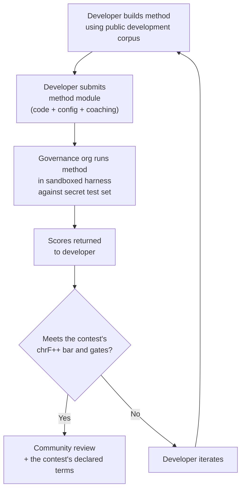

# ข้อกำหนดการประเมินผล (Benchmark Specification)

> **บทสรุปผู้บริหาร** เอกสารนี้กำหนดโพรโทคอลการประเมินสำหรับระบบนิเวศการประเมินผล MT ของ Champollion: รูปแบบคลังข้อมูล (§2), สกีมาของการ์ดการรัน (§3), โพรโทคอลการทดสอบมาตรฐาน (§6), ข้อกำหนดการตรวจสอบความถูกต้องโดยมนุษย์ (§7), กลไกอธิปไตย (§8), ลีดเดอร์บอร์ดและโมเดลการส่ง (§9), กรอบการทำงานด้านต้นทุน (§10) และการขยายไปยังภาษาใหม่ (§11) สำหรับวิธีการให้คะแนนการรัน (คะแนน chrF++ หลัก, เมตริกมาตรฐานคู่ขนาน, เมตริกวินิจฉัย) และสูตรเมตริกต้นทุน/ความเร็ว โปรดดูที่ `SCORING_SPEC.md` — แหล่งข้อมูลอ้างอิงหลักแหล่งเดียวสำหรับตรรกะการให้คะแนนทั้งหมด เอกสารนี้จะอ้างอิงถึง SCORING_SPEC สำหรับรายละเอียดเหล่านั้นแทนที่จะทำซ้ำ


---

## 1. หลักการ

### 1.1 ภาษาคือข้อมูลชีวภาพ

ภาษาไม่ใช่วัสดุทดสอบที่เป็นกลาง เช่นเดียวกับข้อมูลทางพันธุกรรมหรือข้อมูลสุขภาพ ข้อมูลภาษาคือ **ข้อมูลชีวภาพ (biodata)**: มันบรรจุอัตลักษณ์ ความสัมพันธ์ทางเครือญาติ และความสัมพันธ์ของผู้คนที่พูดภาษานั้น และไม่สามารถทำให้ไม่ระบุตัวตนได้อย่างมีความหมาย — แม้จะลบข้อมูลเมตาออก ภาษาก็ยังคงเข้ารหัสว่าผู้คนเหล่านั้นเป็นใคร ผลที่ตามมาสำหรับข้อกำหนดนี้มีความเป็นรูปธรรม: ผู้ที่จัดทำคอร์ปัสถือกุญแจสำหรับคอร์ปัสนั้น และสำหรับทุกสิ่งที่วัดเทียบกับมัน ดังนั้น อธิปไตย (§8) จึงไม่ใช่ส่วนเสริมของโปรโตคอล แต่เป็นเงื่อนไขเบื้องต้น และหลักการอื่นๆ ทั้งหมดด้านล่างนี้ดำเนินการภายใต้มัน

### 1.2 เมตริกอัตโนมัติคือตัวแทน

เมตริกทุกตัวที่กำหนดในเอกสารนี้คำนวณโดยเครื่อง chrF++, การยอมรับ FST, ความแม่นยำทางสัณฐานวิทยา, ความคล้ายคลึงทางความหมาย — ทั้งหมดเป็นตัวแทนอัตโนมัติสำหรับคุณภาพการแปล มีประโยชน์สำหรับการวนซ้ำอย่างรวดเร็ว การเปรียบเทียบอย่างเป็นระบบ และการตรวจจับการถดถอย แต่ **ไม่ใช่สิ่งทดแทนการตัดสินของมนุษย์**

ลำดับชั้นการประเมิน:

```
Automated metrics (run cards, benchmarks)
    ↓ proxy for
Human review (bilingual speakers validate output)
    ↓ proxy for
Actual utility (does this help a language community?)
```

ไม่มีคะแนนอัตโนมัติใด ไม่ว่าจะสูงเพียงใด สามารถแทนที่เจ้าของภาษาที่มีความคล่องแคล่วในการอ่านผลลัพธ์และยืนยันว่าถูกต้อง เป็นธรรมชาติ และมีความเหมาะสมทางวัฒนธรรมได้ นั่นคือเหตุผลที่ไม่มีคะแนนอัตโนมัติใดที่ติดป้ายกำกับคุณภาพ (§5): เมตริกอัตโนมัติมีประโยชน์สำหรับการติดตามความคืบหน้า แต่ไม่เคยเพียงพอด้วยตัวมันเองเพียงลำพัง

### 1.3 วิธีการ ไม่ใช่โมเดล

เราประเมิน **วิธีการ** ไม่ใช่โมเดล โมเดลคือส่วนประกอบหนึ่ง วิธีการคือสูตรทั้งหมด: การเลือกโมเดล การออกแบบ prompt การใช้เครื่องมือ การประมวลผลก่อน/หลัง ข้อมูลการฝึกสอน กลยุทธ์การลองใหม่ ทุกอย่าง ทีมสองทีมที่ใช้โมเดลเดียวกันด้วยวิธีการที่ต่างกันจะได้คะแนนที่ต่างกัน นั่นคือจุดประสงค์

### 1.4 ความสามารถในการทำซ้ำ

ผลลัพธ์ benchmark ทุกรายการต้องสามารถทำซ้ำได้ run card (§3) บันทึกการกำหนดค่าที่สมบูรณ์ของการทดลอง fingerprint (§3.5) ระบุการตั้งค่าการทดลอง run card hash (§3.6) ตรวจสอบความสมบูรณ์ของผลลัพธ์ ใครก็ตามที่มีวิธีการ คอร์ปัส และการกำหนดค่าเดียวกันควรได้คะแนนภายใน ±2% (คำนึงถึงความไม่แน่นอนของการสุ่มตัวอย่าง LLM ที่อุณหภูมิ > 0)

### 1.5 ไม่มีข้อมูลการประเมินสังเคราะห์

**โครงการนี้ไม่สร้าง ใช้ หรือรับรองข้อมูลการประเมินสังเคราะห์** คอร์ปัสทั้งหมดต้องมาจากข้อความที่มนุษย์เขียนจริง — การแปลที่ตีพิมพ์ ตำราเรียน เอกสารสองภาษา หรือการแปลที่ได้รับจากผู้พูดที่คล่องแคล่ว

LLM อาจช่วยในเรื่อง:
- การจัดแนวประโยค (การค้นหาข้อความคู่ขนานในข้อความสองภาษาที่มีอยู่)
- การแปลงรูปแบบ (การแปลงวัสดุที่ตีพิมพ์เป็นสคีมาคอร์ปัส)
- การเพิ่มข้อมูลเมตา (การแนะนำระดับความยาก ป้ายกำกับทะเบียน)
- การเสนอประโยคต้นฉบับสำหรับการแปลโดยมนุษย์ (§11.3 — ขั้นตอนการแปลเป็นของมนุษย์เสมอ)

LLM **ต้องไม่** สร้างการแปลอ้างอิงหรือคู่การประเมิน

**เราเป็นกลางในการพัฒนาเกี่ยวกับข้อมูลการฝึก** หากนักพัฒนาวิธีการใช้ข้อมูลการฝึกสังเคราะห์ การแปลกลับ หรือการเพิ่มข้อมูลในวิธีการของตน นั่นเป็นทางเลือกของพวกเขา — เราประเมินผลลัพธ์ ไม่ใช่กระบวนการฝึก OMT-1600 ของ Meta ใช้ประโยคคู่ขนานสังเคราะห์ประมาณ 270 ล้านประโยคที่สร้างผ่านการแปลกลับ เราไม่มีข้อโต้แย้งต่อวิธีการที่ฝึกด้วยวิธีนี้ เราทดสอบบนการดูแลโดยมนุษย์เท่านั้น

> **ทำไมไม่ใช้ข้อความพระคัมภีร์สำหรับการประเมิน?** OMT-1600 ประเมิน 1,560 จาก 1,600 ภาษาบนข้อความโดเมนพระคัมภีร์ (Meta AI, *Omnilingual MT*, arXiv:2603.16309, 2026) การแปลพระคัมภีร์มีทะเบียนโบราณ คำศัพท์พิธีกรรม และโครงสร้างประโยคแบบสูตร คอร์ปัสการประเมินของเราได้มาจากข้อความที่ดูแลโดยชุมชน หลากหลายโดเมน — สุขภาพ กฎหมาย การศึกษา รัฐบาล การสนทนา และโดเมนเทคนิค (ดู §2.7) นี่เป็นการเลือกออกแบบโดยเจตนา ชุมชนต้องการการแปลสำหรับโดเมนที่พวกเขาใช้ชีวิตและทำงานจริง ไม่ใช่ทะเบียนทางศาสนาเดียว วิธีการที่ได้คะแนนดีใน Genesis 1:1 แทบไม่บอกอะไรเกี่ยวกับประสิทธิภาพในวาระการประชุมสภาชนเผ่าหรือแบบฟอร์มรับผู้ป่วยของคลินิก

---

## 2. สคีมาคอร์ปัส

คอร์ปัสคือชุดคู่ข้อความคู่ขนานที่ดูแลแล้วพร้อมข้อมูลเมตาที่มีโครงสร้าง เป็นความจริงพื้นฐานที่วิธีการทั้งหมดถูกวัดเทียบกับมัน

### 2.1 Dataset Envelope

โครงสร้างระดับบนสุดของไฟล์คอร์ปัส:

```json
{
  "dataset": {
    "id": "edtekla-dev-v1",
    "version": "1.0",
    "language_pair": "EN→CRK",
    "source_language": "en",
    "target_language": "crk",
    "created": "2026-05-01",
    "license": "LicenseRef-EdTeKLA-Modified-CC-BY-NC-SA-4.0",
    "provenance": ["gold_standard", "textbook"]
  },
  "entries": [ ... ]
}
```

| ฟิลด์ | ประเภท | จำเป็น | คำอธิบาย |
|-------|------|----------|-------------|
| `id` | string | ✅ | ตัวระบุชุดข้อมูลที่ไม่ซ้ำกัน ใช้ใน run card และ leaderboard |
| `version` | string | ✅ | Semantic version การเพิ่มค่าจะทำให้การเปรียบเทียบ run card ก่อนหน้าไม่ถูกต้อง |
| `language_pair` | string | ✅ | ป้ายกำกับแสดงผล (เช่น `EN→CRK`) |
| `source_language` | string | ✅ | รหัสภาษาต้นฉบับ BCP 47 |
| `target_language` | string | ✅ | รหัสภาษาเป้าหมาย BCP 47 |
| `created` | string | ✅ | วันที่สร้าง ISO 8601 |
| `license` | string | ✅ | ตัวระบุใบอนุญาต SPDX |
| `provenance` | string[] | ✅ | รายการแท็กที่มาที่ใช้ในรายการต่างๆ |

### 2.2 สคีมารายการ

แต่ละรายการในคอร์ปัสแสดงถึงความท้าทายการแปลหนึ่งรายการ:

```json
{
  "id": 42,
  "source": "I see the dog",
  "reference": "niwâpamâw atim",
  "segment": "gold_standard",
  "difficulty": 2,
  "provenance": "gold_standard",
  "register": "conversational",
  "context": "declaration",
  "morphological_analysis": "ni-wâpam-âw atim | 1sg-see.TA-3sg.DIR dog.AN",
  "notes": "Animate noun (atim); direct form because speaker is proximate",
  "variant_class": "simple-ta-direct"
}
```

| เขตข้อมูล | ชนิดข้อมูล | จำเป็น | คำอธิบาย |
|-------|------|----------|-------------|
| `id` | integer | ✅ | ตัวระบุเฉพาะภายในคลังข้อมูล |
| `source` | string | ✅ | ข้อความต้นฉบับในภาษาต้นทาง |
| `reference` | string | ✅ | คำแปลอ้างอิงมาตรฐานทอง (gold-standard) ในภาษาปลายทาง |
| `segment` | string | 📎 | ส่วนย่อยของคลังข้อมูล: `gold_standard`, `held_out`, `development` หรือ `diagnostic` |
| `difficulty` | integer | 📎 | ระดับความยาก 1–5 (ดู §2.4) |
| `provenance` | string | 📎 | แหล่งที่มาของรายการนี้ (ดู §2.5) |
| `register` | string | 📎 | ระดับความสุภาพ/ระดับภาษา (ดู §2.6) |
| `context` | string | 📎 | ฟังก์ชันการสื่อสาร (ดู §2.6) |
| `domain` | string | 📎 | โดเมนกรณีการใช้งานจากการจำแนก 16 หมวด (ดู §2.7) ต้องเป็นหนึ่งใน: `conv`, `ecommerce`, `edu`, `financial`, `gov`, `legal`, `literary`, `marketing`, `medical`, `news`, `religious`, `scientific`, `subtitles`, `support`, `tech`, `ui` ได้รับการตรวจสอบความถูกต้อง ณ เวลาสร้าง |
| `morphological_analysis` | string | ❌ | การแจกแจงทางสัณฐานวิทยามาตรฐานทอง |
| `notes` | string | ❌ | บันทึกของผู้แปล ตัวแปรภาษาถิ่น แฟล็กความกำกวม |
| `variant_class` | string | ❌ | ป้ายกำกับคลาสที่จัดกลุ่มตัวแปรคำแปลที่ยอมรับได้ |

> **📎 = แนะนำ (RECOMMENDED)** ฮาร์เนสรองรับฟิลด์ที่ไม่บังคับซึ่งหายไปได้อย่างราบรื่นผ่านค่าเริ่มต้น คลังข้อมูลภายนอกจำเป็นต้องระบุเพียง `id`, `source` และ `reference` ต่อแต่ละรายการเท่านั้น


### 2.3 เซกเมนต์คอร์ปัส

คอร์ปัสแบ่งออกเป็นเซกเมนต์ที่มีระดับการเข้าถึงต่างกัน:

| เซกเมนต์ | วัตถุประสงค์ | การเข้าถึง | ขนาดขั้นต่ำ |
|---------|---------|--------|-------------|
| `development` | การพัฒนาและวนซ้ำวิธีการ นักพัฒนาใช้ได้อย่างอิสระ | **สาธารณะ** | 30 รายการ |
| `diagnostic` | การทดสอบเป้าหมายสำหรับปรากฏการณ์ทางภาษาเฉพาะ | **สาธารณะ** | 10 รายการ |
| `gold_standard` | การประเมิน benchmark อย่างเป็นทางการ คะแนน leaderboard มาจากที่นี่ | **ลับ** — ถือครองโดยองค์กรกำกับดูแล | 50 รายการ |
| `held_out` | สำรองสำหรับการประเมินในอนาคต ไม่ใช้จนกว่าจะเปิดใช้งาน | **ลับ** — ถือครองโดยองค์กรกำกับดูแล | 10 รายการ |

> **สถานะปัจจุบัน:** มีเพียงเซกเมนต์ `development` เท่านั้นที่มีอยู่ในชุดข้อมูลที่จัดส่ง เซกเมนต์ `diagnostic`, `gold_standard`, และ `held_out` ถูกกำหนดไว้สำหรับการใช้งานในอนาคตเมื่อคอร์ปัสเติบโตขึ้น

เซกเมนต์ `gold_standard` และ `held_out` เป็นความลับอย่างสมบูรณ์ ทั้งประโยคต้นฉบับและการแปลอ้างอิงถูกเก็บไว้บนโครงสร้างพื้นฐานที่ควบคุมโดยการกำกับดูแล นักพัฒนาวิธีการไม่เคยเห็นคำถามหรือคำตอบ ดู §8 สำหรับกลไกอธิปไตย

### 2.4 ระดับความยาก

| ระดับ | คำอธิบาย | ตัวอย่าง |
|------|-------------|----------|
| 1 — คำศัพท์พื้นฐาน | คำเดี่ยว คำทักทายทั่วไป ตัวเลข | "hello" → "tânisi", "dog" → "atim" |
| 2 — ประโยคง่าย | ประธาน-กริยา หรือ SVO กาลปัจจุบัน | "I see the dog" → "niwâpamâw atim" |
| 3 — ความซับซ้อนปานกลาง | กาลอดีต/อนาคต การครอบครอง ความมีชีวิต | "I saw his dog yesterday" |
| 4 — สัณฐานวิทยาซับซ้อน | Obviation, passive voice, conjunct order, อนุประโยคสัมพันธ์ | "the woman whose son went to the store" |
| 5 — ขั้นสูง | หลายอนุประโยค ทะเบียนทางการ พิธีกรรม สำนวน | ย่อหน้าเต็มพร้อมน้ำเสียงที่เหมาะสมกับทะเบียน |

คอร์ปัสที่สร้างขึ้นอย่างดีควรมีรายการครอบคลุมระดับความยากทั้งห้าระดับ โดยเน้นที่ระดับ 2–4 ซึ่งเป็นที่ที่ความท้าทายการแปลในโลกจริงส่วนใหญ่อยู่

### 2.5 แท็กที่มา

ทุกรายการต้องระบุที่มา:

| แท็ก | ความหมาย |
|-----|---------|
| `gold_standard` | ตรวจสอบโดยผู้พูดที่คล่องแคล่ว |
| `textbook` | จากวัสดุการศึกษาที่ตีพิมพ์ |
| `elicited` | ผลิตผ่านเซสชันการดึงข้อมูลที่มีโครงสร้าง |
| `corpus` | ดึงมาจากคอร์ปัสคู่ขนาน |

> **หมายเหตุ:** ในทางปฏิบัติ ค่าที่มาเป็นสตริงอิสระ แท็กข้างต้นเป็นแบบแผน ไม่ใช่ enum ที่ตรวจสอบแล้ว — ชุดข้อมูลอาจใช้สตริงที่มาเชิงพรรณนาอื่นๆ

### 2.6 ทะเบียนและบริบท

**ทะเบียน** อธิบายความเป็นทางการและบริบททางสังคม:

| ทะเบียน | คำอธิบาย |
|----------|-------------|
| `conversational` | การพูดในชีวิตประจำวันระหว่างผู้เท่าเทียมกัน |
| `formal` | ภาษาทางการหรือสถาบัน |
| `technical` | คำศัพท์เฉพาะโดเมน |
| `ceremonial` | การใช้ภาษาแบบดั้งเดิมหรือศักดิ์สิทธิ์ |
| `educational` | วัสดุการสอนภาษา |

**บริบท** อธิบายหน้าที่การสื่อสาร:

> 🔲 **วางแผนไว้** ฟิลด์ `context` ถูกกำหนดในสคีมาแต่ยังไม่ได้ใส่ข้อมูลในชุดข้อมูลปัจจุบัน สำรองไว้สำหรับการเพิ่มคอร์ปัสในอนาคต

| บริบท | คำอธิบาย |
|---------|-------------|
| `greeting` | การทักทายหรือการลาทางสังคม |
| `declaration` | การระบุข้อเท็จจริง |
| `question` | ประโยคคำถาม |
| `instruction` | คำสั่งหรือคำสั่งการ |
| `narrative` | การเล่าเรื่องหรือการบรรยาย |
| `label` | ป้ายกำกับ UI ข้อความปุ่ม หรือหัวข้อ |
| `error` | ข้อความแสดงข้อผิดพลาดหรือคำเตือน |

### 2.7 โดเมน {#27-domain}

**โดเมน** อธิบายกรณีการใช้งานในโลกจริง — ประเภทของเนื้อหาที่กำลังแปล ซึ่งตั้งฉากกับทะเบียนและบริบท:

- **ทะเบียน** ตอบคำถาม: *สิ่งนี้เป็นทางการแค่ไหน?*
- **บริบท** ตอบคำถาม: *ประโยคนี้กำลังทำอะไร?*
- **โดเมน** ตอบคำถาม: *อุตสาหกรรม/กรณีการใช้งานนี้คืออะไร?*

สัญญาทางกฎหมาย (โดเมน: `legal`) อาจเป็นทางการ (ทะเบียน: `formal`) และมีการประกาศ (บริบท: `declaration`) บทสนทนา chatbot ทางกฎหมาย (โดเมน: `legal`) อาจเป็นการสนทนา (ทะเบียน: `conversational`) และมีคำถาม (บริบท: `question`) โดเมนเดียวกัน ทะเบียนและบริบทต่างกัน

| รหัสโดเมน | คำอธิบาย | ผู้บริโภคทั่วไป |
|-------------|-------------|-------------------|
| `ui` | สตริงอินเทอร์เฟซซอฟต์แวร์ | นักพัฒนาแอป ทีม localization |
| `legal` | สัญญา กฎหมาย การยื่นศาล เอกสารการย้ายถิ่น | สำนักงานกฎหมาย ศาล ทีมปฏิบัติตามกฎระเบียบ ทนายความทรัพย์สินทางปัญญา |
| `medical` | บันทึกทางคลินิก ฉลากยา การสื่อสารกับผู้ป่วย โปรโตคอลการทดลอง | โรงพยาบาล บริษัทยา การทดลองทางคลินิก พอร์ทัลผู้ป่วย |
| `financial` | การธนาคาร ประกันภัย การยื่นกำกับดูแล รายงานการตรวจสอบ | ธนาคาร บริษัทประกัน หน่วยงานกำกับดูแล ผู้ตรวจสอบ |
| `edu` | ตำราเรียน หลักสูตร แผนการสอน วัสดุวิชาการ | โรงเรียน มหาวิทยาลัย สำนักพิมพ์ตำราเรียน |
| `ecommerce` | คำอธิบายสินค้า รีวิว รายการตลาด | ผู้ค้าปลีกออนไลน์ ผู้ขายในตลาด |
| `marketing` | ข้อความโฆษณา ข้อความแบรนด์ แคมเปญ สโลแกน | เอเจนซีโฆษณา ทีมแบรนด์ |
| `gov` | เอกสารนโยบาย กฎระเบียบ ประกาศสาธารณะ กฎหมาย | หน่วยงานรัฐบาล ทีมปฏิบัติตามกฎระเบียบ |
| `scientific` | บทความวิจัย บทคัดย่อ วิธีการ ข้อเสนอทุน | นักวิจัย วารสาร หน่วยงานทุน |
| `religious` | พระคัมภีร์ ข้อความพิธีกรรม คำอธิบายเทววิทยา | ชุมชนศรัทธา สำนักพิมพ์พิธีกรรม |
| `support` | FAQ ข้อความแสดงข้อผิดพลาด คู่มือการแก้ปัญหา สคริปต์ chatbot | บริษัท SaaS ฝ่ายช่วยเหลือ |
| `subtitles` | บทสนทนาภาพยนตร์ ทีวี สตรีมมิ่ง และเกม | แพลตฟอร์มสตรีมมิ่ง สตูดิโอ บริษัทเกม |
| `news` | วารสารศาสตร์ รายงานข่าว บทบรรณาธิการ ข่าวประชาสัมพันธ์ | องค์กรสื่อ บริการข่าว |
| `literary` | นิยาย บทกวี เรื่องเล่า ข้อความวัฒนธรรม | สำนักพิมพ์ องค์กรอนุรักษ์วัฒนธรรม |
| `conv` | การสนทนาไม่เป็นทางการ โซเชียลมีเดีย การส่งข้อความ | แอปผู้บริโภค แพลตฟอร์มโซเชียล |
| `tech` | เอกสาร API คู่มือ ข้อกำหนดวิศวกรรม คู่มือเทคนิค | ทีมเอกสาร องค์กรวิศวกรรม |

> **Benchmark เฉพาะโดเมน** benchmark ทั่วไปประเมินวิธีการในทุกโดเมน แต่ Network ยังรองรับ **benchmark ที่กรองตามโดเมน** — ซึ่งคะแนนคำนวณเฉพาะรายการที่ติดแท็กด้วยโดเมนเฉพาะ ซึ่งช่วยให้ผู้ใช้ตอบคำถามได้ว่า: "วิธีการใดดีที่สุดสำหรับการแปลเอกสารทางกฎหมายเป็นภาษาฝรั่งเศส?" เทียบกับ "วิธีการใดมีคะแนนภาษาฝรั่งเศสโดยรวมดีที่สุด?"
>
> การจัดอันดับ leaderboard ที่กรองตามโดเมนช่วยให้ผู้ใช้เปรียบเทียบวิธีการภายในกรณีการใช้งานเดียว วิธีการต่างๆ ทำงานต่างกันในแต่ละโดเมน — วิธีการที่ปรับแต่งสำหรับคำศัพท์ทางกฎหมายอาจได้คะแนนสูงกว่ามากในข้อความทางกฎหมายมากกว่าข้อความสนทนา Network ช่วยให้ผู้ใช้ค้นหาวิธีการที่เหมาะสมที่สุดสำหรับกรณีการใช้งานเฉพาะของตน

> **อนาคต: Network assistant** ผู้ช่วยสนทนาที่ช่วยให้ผู้ใช้อธิบายกรณีการใช้งาน MT ของตน (โดเมน คู่ภาษา ข้อกำหนดคุณภาพ) และแสดงวิธีการที่ผ่านการตรวจสอบโดยชุมชนจาก leaderboard — ตัวอย่างเช่น "วิธีการใดได้คะแนนสูงสุดใน benchmark EN→JA โดเมนการแพทย์?" — เป็นเครื่องมือช่วยนำทางที่เรากำลังพิจารณา โดยขึ้นอยู่กับข้อมูลการประเมินที่ติดแท็กตามโดเมนและความหลากหลายของวิธีการที่เพียงพอ

---

## 3. สคีมา Run Card {#3-run-card-schema}

run card คือหน่วยอะตอมของการประเมิน เป็นเอกสาร JSON ที่มีตัวเองครบถ้วนซึ่งบันทึกการกำหนดค่าและผลลัพธ์ที่สมบูรณ์ของการรันการประเมินครั้งเดียว: วิธีการหนึ่ง โมเดลหนึ่ง การกำหนดค่าหนึ่ง ชุดข้อมูลหนึ่ง

run card ทุกรายการบันทึกสามมิติ:
- **คุณภาพ** — การแปลดีแค่ไหน?
- **ต้นทุน** — ใช้ต้นทุนเท่าไรในการผลิต?
- **ความเร็ว** — ใช้เวลานานแค่ไหน?

### 3.1 ฟิลด์ระดับบนสุด

| เขตข้อมูล | ชนิดข้อมูล | คำอธิบาย |
|-------|------|-------------|
| `run_id` | string | UUID v4 ที่สร้างขึ้นเมื่อเริ่มการรัน |
| `harness_version` | string | เวอร์ชันตามหลัก Semantic Versioning ของฮาร์เนส (เช่น `2.0`) |
| `timestamp` | string | การประทับเวลาแบบ ISO 8601 UTC เมื่อการรันเริ่มต้นขึ้น |
| `elapsed_seconds` | number | ระยะเวลาตามนาฬิกาจริง (wall-clock) ของการรันทั้งหมด |
| `score_caveats` | array | มีอยู่เฉพาะเมื่อมีสิ่งที่เป็นเงื่อนไขประกอบคะแนน: รายการของออบเจกต์ `{kind, source, severity, message, …}` เช่น ชุดทดสอบที่มีแถวซึ่งมีคู่แฝดเกือบเหมือนกันในข้อมูลการฝึกสอน, ผลลัพธ์ที่ยาวหรือสั้นกว่าการอ้างอิงมากเกินไป, ผลลัพธ์ที่คัดลอกต้นทางมา หรือผลลัพธ์เดียวกันที่ถูกแสดงสำหรับต้นทางที่ต่างกันจำนวนมาก มีไว้เพื่อให้ข้อมูล: ไม่เคยเปลี่ยนคะแนน และจะแสดงอยู่ข้างคะแนน chrF++ หลักไม่ว่าคะแนนจะแสดงที่ใดก็ตาม ดู [ข้อกำหนดการ์ดการรัน](/docs/network/specifications/run-card#score_caveats) |

### 3.2 การกำหนดค่าวิธีการ

ฟิลด์เหล่านี้กำหนดการตั้งค่าการทดลอง — สิ่งที่ทดสอบและอย่างไร

| ฟิลด์ | ประเภท | จำเป็น | คำอธิบาย |
|-------|------|----------|-------------|
| `model_slug` | string | ✅ | ตัวระบุโมเดล (เช่น `google/gemini-2.5-flash`) |
| `model_id` | string | ❌ | ตัวระบุโมเดลที่แก้ไขแล้วที่ API ส่งคืน |
| `condition` | string | ✅ | ป้ายกำกับการทดลอง (เช่น `baseline`, `coached-v3`, `few-shot`) |
| `temperature` | number | ✅ | อุณหภูมิการสุ่มตัวอย่าง |
| `system_prompt_sha256` | string | ✅ | แฮช SHA-256 ของ system prompt เต็ม |
| `system_prompt_used` | string | ✅ | ข้อความ system prompt เต็ม |
| `coaching_data_sha256` | string | ❌ | แฮช SHA-256 ของไฟล์ข้อมูลการฝึกสอน หากใช้ |
| `fst_version` | string | ❌ | เวอร์ชันของ FST analyzer หากใช้ |
| `tools_enabled` | string[] | ❌ | รายการเครื่องมือที่วิธีการสามารถใช้ได้ |
| `batch_size` | number | ❌ | รายการต่อ API batch พร้อมกัน |
| `max_retries` | number | ❌ | จำนวนการลองใหม่สูงสุดสำหรับการปฏิเสธ FST หากมี |

:::info[การ์ดการรันที่เผยแพร่จะรวม method_config]
เมื่อการ์ดการรันถูกเผยแพร่ไปยังลีดเดอร์บอร์ด (ผ่าน `mt-eval publish`) จะรวมบล็อก `method_config` ที่มี MethodConfig ตามรูปแบบมาตรฐาน 8 เขตข้อมูลไว้ด้วย (`model`, `temperature`, `batchSize`, `register`, `coachingFile`, `coachingPrompt`, `promptContext`, `qualityTier` — ทั้งหมดเป็น camelCase; `qualityTier` จะเป็นค่า null เสมอบนการ์ดใหม่ เนื่องจากระดับคุณภาพถูกยกเลิกการใช้งานแล้ว) สิ่งนี้ช่วยให้สามารถนำเข้าได้โดยไม่ต้องสร้างใหม่ (zero-reconstruction import): `champollion leaderboard --install` จะอ่าน `method_config` โดยตรงและเขียนออกมาเป็นไฟล์กำกับของปลั๊กอิน เขตข้อมูลการวัดและส่งข้อมูลทางไกลด้านบน (§3.2) บันทึกสิ่งที่ฮาร์เนสสังเกตพบ ส่วน `method_config` จะบันทึกสิ่งที่นักพัฒนาตั้งใจไว้
:::

### 3.3 การอ้างอิงชุดข้อมูล

| ฟิลด์ | ประเภท | คำอธิบาย |
|-------|------|-------------|
| `dataset.id` | string | ตัวระบุชุดข้อมูล |
| `dataset.version` | string | เวอร์ชันชุดข้อมูล |
| `dataset.language_pair` | string | ป้ายกำกับแสดงผล |
| `dataset.sha256` | string | แฮช SHA-256 ของเนื้อหาไฟล์ชุดข้อมูล |
| `dataset.entry_count` | number | จำนวนรายการที่ประเมิน |

แฮช SHA-256 ของชุดข้อมูลยึด run card กับเวอร์ชันเฉพาะของข้อมูล หากชุดข้อมูลเปลี่ยนแปลง run card เก่าจะไม่สามารถเปรียบเทียบได้

### 3.4 คะแนน (คุณภาพ)

เมตริกรวมสำหรับการรันทั้งหมด เมตริกคุณภาพทั้งหมดเป็น **อัตโนมัติ** — ดู §1.2

| เขตข้อมูล | ชนิดข้อมูล | คำอธิบาย |
|-------|------|-------------|
| `scores.total` | number | รายการทั้งหมดที่ประเมิน |
| `scores.exact_matches` | number | รายการที่ผลลัพธ์ตรงกับข้อมูลอ้างอิงทุกประการ |
| `scores.exact_match_rate` | number | 0.0–1.0 |
| `scores.equivalent_matches` | number | รายการที่ตรงกับตัวแปรที่ยอมรับได้ |
| `scores.equivalent_match_rate` | number | 0.0–1.0 |
| `scores.fst_accepted` | number | คำในผลลัพธ์ที่ตัววิเคราะห์ FST ยอมรับ โดยรวมจากทุกรายการ (เป็นจำนวนคำ ไม่ใช่จำนวนรายการ) |
| `scores.fst_acceptance_rate` | number | 0.0–1.0, ค่าเฉลี่ยของอัตราการยอมรับต่อรายการ (คำที่ยอมรับในแต่ละรายการ ÷ คำทั้งหมดในรายการ); `null` หากไม่มีการกำหนดค่า FST |
| `scores.morphological_accuracy` | number | 0.0–1.0, มาจาก FST (จับคู่ตามรูปคำพื้นฐาน), `null` หากไม่มี FST / ไม่มีคำที่จับคู่ตามรูปคำพื้นฐานได้ ให้คำแนะนำจนกว่าจะเปิดใช้งาน — ดู Scoring Spec §2.2 |
| `scores.morph_coverage` | number | 0.0–1.0, สัดส่วนของคำทำนายที่วิเคราะห์ได้ซึ่งจับคู่ตามรูปคำพื้นฐานกับการอ้างอิง (เผยให้เห็นว่า `morphological_accuracy` มีความเบาบางเพียงใด) |
| `scores.chrf_plus_plus` | number | **เมตริกหลักและเมตริกการจัดอันดับ:** chrF++ ระดับคลังข้อมูล (0–100) ช่วงความเชื่อมั่นแบบบูตสแตรป 95% คือ `scores.confidence_intervals.corpus_chrf` และลายเซ็น sacreBLEU คือ `scores.sacrebleu_signatures.chrf` |
| `scores.scoring_standard` | string | `"standard/1"` บนทุกการ์ดใหม่ จะไม่มีอยู่ในการ์ดที่เผยแพร่ก่อนมีมาตรฐาน ซึ่งจะอ่านค่าเป็น `legacy-composite` |
| `scores.primary_metric` | string | `"chrf_plus_plus"` |
| `scores.spbleu` | number | spBLEU (FLORES-200 SentencePiece) แสดงคู่ขนานกับ chrF++ |
| `scores.sacrebleu_signatures` | object | ลายเซ็นของทุกเมตริก sacreBLEU ที่คำนวณ (`chrf`, `chrf_plain`, `bleu`, `spbleu`, `ter`) |
| `scores.semantic_score` | number | ความคล้ายคลึงกันทางความหมายโดยอิงการฝังเวกเตอร์ (0.0–1.0) |
| `scores.ter` | number | Translation Edit Rate (0–∞ ค่ายิ่งต่ำยิ่งดี) |
| `scores.length_ratio` | number | avg(len(predicted)/len(reference)) ค่าที่เหมาะสมคือ 1.0 |
| `scores.code_switching_rate` | number | 0.0–1.0, สัดส่วนของรายการที่มีการรั่วไหลของภาษาต้นทาง |
| `scores.hallucination_rate` | number | 0.0–1.0, สัดส่วนของรายการที่มีเนื้อหาหลอน |
| `scores.terminology_adherence` | number | 0.0–1.0, การปฏิบัติตามคำศัพท์ในอภิธานศัพท์ (`null` หากไม่มีอภิธานศัพท์) |
| `scores.tokens_per_second` | number | total_tokens / elapsed_seconds |
| `scores.entries_per_minute` | number | รายการที่แปลต่อนาที |
| `scores.composite` | number \| null | **ยกเลิกการใช้งานแล้ว** `null` บนทุกการ์ดใหม่ การ์ดรุ่นเก่าจะยังคงเก็บค่าคะแนนรวมที่บันทึกไว้ ซึ่งแสดงเป็น "legacy composite (retired)" ดู SCORING_SPEC §4 |
| `scores.quality_tier` | string \| null | **ยกเลิกการใช้งานแล้ว** `null` บนทุกการ์ดใหม่ ดู SCORING_SPEC §5 |
| `scores.cost_adjusted` | number \| null | **ยกเลิกการใช้งานแล้ว** พร้อมกับคะแนนรวม; `null` บนทุกการ์ดใหม่ |
| `scores.errors` | number | รายการที่ล้มเหลว (ข้อผิดพลาดของ API, หมดเวลา ฯลฯ) |
| `scores.by_difficulty` | object | คะแนนแยกตามระดับความยาก |
| `scores.by_provenance` | object | คะแนนแยกตามแท็กแหล่งที่มา |
| `scores.by_domain` | object | ✅ ใช้งานได้แล้ว — คะแนนแยกตามโดเมน (§2.7) ช่วยให้สามารถจัดอันดับลีดเดอร์บอร์ดแบบกรองตามโดเมนได้ คำนวณโดย tester.py และส่งผ่าน publish.py |

### 3.5 ยอดรวม (ต้นทุน)

| ฟิลด์ | ประเภท | คำอธิบาย |
|-------|------|-------------|
| `totals.prompt_tokens` | number | token input ทั้งหมดในทุก API call |
| `totals.completion_tokens` | number | token output ทั้งหมด |
| `totals.reasoning_tokens` | number | token ที่ใช้สำหรับ chain-of-thought (0 สำหรับโมเดลส่วนใหญ่) |
| `totals.cached_tokens` | number | token ที่ให้บริการจาก prompt cache ของผู้ให้บริการ |
| `totals.total_cost_usd` | number | ต้นทุนรวมเป็น USD |
| `totals.cost_per_entry_usd` | number | `total_cost_usd / entry_count` |
| `totals.cost_per_source_char` | number | USD ต่ออักขระต้นทาง — เปรียบเทียบได้ข้ามภาษา |

### 3.6 เวลา (ความเร็ว)

| ฟิลด์ | ประเภท | คำอธิบาย |
|-------|------|-------------|
| `elapsed_seconds` | number | ระยะเวลา wall-clock ของการรันทั้งหมด (ระดับบนสุด) |
| `scores.avg_latency_seconds` | number | เวลาตอบสนองเฉลี่ยต่อรายการ |
| `scores.median_latency_seconds` | number | เวลาตอบสนองมัธยฐานต่อรายการ |
| `scores.p95_latency_seconds` | number | เวลาตอบสนองเปอร์เซ็นไทล์ที่ 95 ต่อรายการ |

### 3.7 ผลลัพธ์ต่อรายการ

แต่ละรายการในอาร์เรย์ `results[]` บันทึกการแปลหนึ่งรายการ ข้อมูลต่อรายการถูกเก็บไว้ในตาราง `run_card_entries` (migration 005) พร้อม LYSS verdicts ที่ denormalized (migration 006)

| ฟิลด์ | ประเภท | คำอธิบาย |
|-------|------|-------------|
| `entry_id` | string | ตรงกับ `entries[].id` ในคอร์ปัส |
| `source` | string | ข้อความต้นฉบับที่แปล |
| `expected` | string | การแปลอ้างอิงมาตรฐานทอง |
| `raw_predicted` | string \| null | ผลลัพธ์โมเดลดิบก่อนการประมวลผลหลัง |
| `predicted` | string | ผลลัพธ์จริงของวิธีการ (หลังประมวลผล) |
| `segment` | string | ตัวระบุเซกเมนต์ (เช่น ดัชนีประโยค) |
| `difficulty` | string \| null | ระดับความยากจากคอร์ปัส |
| `domain` | string | แท็กโดเมนจากคอร์ปัส (§2.7) |
| `exact_match` | boolean | ผลลัพธ์ตรงกับอ้างอิงทุกประการหรือไม่ |
| `chrf_score` | number \| null | chrF++ ระดับประโยค (0–100) |
| `bleu_score` | number \| null | BLEU ระดับประโยค (0–100) |
| `latency_s` | number \| null | เวลาตอบสนองเป็นวินาที |
| `cost_usd` | number \| null | ต้นทุนเป็น USD สำหรับรายการนี้ |
| `tool_call_count` | integer | จำนวน tool call ที่ใช้ (0 หากไม่มี) |
| `error` | string \| null | ข้อความแสดงข้อผิดพลาดหากรายการนี้ล้มเหลว |
| `plugin_metrics` | object | ผลลัพธ์ plugin ต่อรายการเต็ม (JSONB) |
| `fst_valid` | boolean \| null | GiellaLT FST ยอมรับการคาดการณ์ (denormalized LYSS-fst) |
| `equivalent_match` | boolean \| null | CRK linter ยืนยันความเท่าเทียมเชิงโครงสร้าง (denormalized LYSS-eq) |
| `semantic_verdict` | string \| null | LYSS-sem verdict: `VALID`, `MISMATCH`, `UNKNOWN`, `ERROR` |
| `code_switching_detected` | boolean \| null | ตรวจพบ token ภาษาต้นทางในผลลัพธ์ |
| `hallucination_detected` | boolean \| null | ตรวจพบเนื้อหาที่สร้างขึ้นเองในผลลัพธ์ |


### 3.8 Fingerprint

ตัวระบุสำหรับการทำซ้ำ การรันสองครั้งที่มี fingerprint เหมือนกันหมายความว่าใช้การตั้งค่าการทดลองเดียวกัน

ลายนิ้วมือ (fingerprint) คือแฮชแบบ SHA-256 ของ JSON ตามรูปแบบมาตรฐาน (เรียงลำดับคีย์) ของ:
- `dataset.sha256`
- `model_slug`
- `condition`
- `system_prompt_sha256`
- `temperature`
- `harness_version`
- `batch_size`
- `tools_enabled`

> **ทำไมต้อง 8 องค์ประกอบ?** ขนาด batch และการเรียก tool ส่งผลต่อคุณภาพผลลัพธ์อย่างมีนัยสำคัญและต้องรวมอยู่ในตัวตน การรันสองครั้งที่มีขนาด batch ต่างกันหรือเปิดใช้งาน tool ต่างกันเป็นการตั้งค่าการทดลองที่ต่างกัน แม้ว่าพารามิเตอร์อื่นทั้งหมดจะตรงกัน

**เวอร์ชัน 2 (ฮาร์เนส 0.2.0 ขึ้นไป)** เพิ่มส่วนประกอบห้าส่วน:
- `api_provider`: แชนเนลที่ข้อความส่งผ่าน (OpenRouter, API ของผู้ให้บริการเอง, เอนด์พอยต์ในเครื่อง; รหัสของเอนจิน MT; สำหรับปลั๊กอินเมธอด คือ `local` ภายใต้ `--attest-local-transport` ไม่เช่นนั้นจะเป็น `method-plugin`) บันทึกการรันของปลั๊กอินและเอนจินที่เขียนขึ้นก่อนที่จะมีการแก้ไขปัญหานี้ระบุว่า `openrouter` ซึ่งเป็นค่าเริ่มต้นที่ไม่เคยถูกส่งผ่าน publish จะบันทึกค่าที่แก้ไขแล้วสำหรับรายการเหล่านี้ด้วย ซึ่งจะเปลี่ยนเอกลักษณ์เวอร์ชัน 2 ของรายการดังกล่าว — โดยตั้งใจ เนื่องจากค่าเดิมนั้นไม่ถูกต้อง
- `endpoint_host_sha256`: SHA-256 ของโฮสต์ของเอนด์พอยต์ โดยไม่ใช้ URL ดิบ ซึ่งอาจมีชื่อโฮสต์ภายในหรือข้อมูลรับรองอยู่
- `max_tokens`
- `method_version`: เวอร์ชันของการ์ดเมธอด ไม่เช่นนั้นจะเป็นเวอร์ชันที่ `method.json` ของปลั๊กอินเมธอดประกาศไว้
- `method_sha256`: แฮชของบันเดิลที่เรียกใช้งาน สำหรับเมธอดที่โหนดการแข่งขันรัน ไม่เช่นนั้นจะเป็นแฮชของไฟล์ของปลั๊กอินเมธอด (`method.json` และไฟล์ `.py` ของไฟล์นั้น)

การรัน **ปลั๊กอินเมธอด** (`mt-eval run --method <plugin dir>`) จะเพิ่มอีกสองส่วน:
- `method_model`: โมเดลที่ส่งมอบให้ปลั๊กอินด้วย `-m/--model` (ปลั๊กอินจะอ่านค่านั้นเป็น `config.method_model`) หรือ `null` เมื่อไม่ได้ระบุ
- `method_dependencies_sha256`: SHA-256 ของรายการ `dependencies` ที่ `method.json` ของปลั๊กอินประกาศไว้ (JSON ตามรูปแบบมาตรฐาน) หรือ `null` เมื่อไม่ได้ประกาศ

หากไม่มีสิ่งเหล่านี้ ปลั๊กอินตัวเดียวกันที่รันบนสองโมเดลที่แตกต่างกันจะใช้เอกลักษณ์ร่วมกัน ฮาร์เนส 0.2.0 เพิ่มสิ่งเหล่านี้เข้ามาก่อนการเปิดตัว ดังนั้นเอกลักษณ์ของการรันปลั๊กอินจึงเปลี่ยนเพียงครั้งเดียวตรงนี้ โดยไม่มีการรันชนิดอื่นที่ได้รับผลกระทบ

การรันเอนจิน MT ที่รันโมเดลที่**ได้รับมา** (`mt-eval run --method local-model -m <model>`) จะเพิ่มอีกสองส่วนเช่นกัน:
- `method_model`: โมเดลที่โหลด — Hugging Face ID หรือชื่อไดเรกทอรีของโมเดล
- `method_model_sha256`: สำหรับไดเรกทอรี คือ SHA-256 ของรายการไฟล์ในรูปแบบ `sha256sum` (บรรทัด `<sha256>  <relative path>` หนึ่งบรรทัดต่อหนึ่งไฟล์ เรียงตามพาธ โดยตัดไดเรกทอรีที่ขึ้นต้นด้วยจุดออก); สำหรับ Hugging Face ID คือ revision ที่โหลดมา

สองโมเดลที่ส่งผ่านเอนจินเดียวกันถือเป็นการทดลองสองครั้ง บันทึกการรัน `local-model` ที่ไม่ระบุชื่อโมเดล (บิลด์ 0.2.0 รุ่นแรกๆ ไม่ได้ส่ง `-m` ไปยังเอนจิน ซึ่งทำให้รันโมเดลสำรองคือ `Helsinki-NLP/opus-mt-en-es`) ไม่สามารถระบุได้ว่าอะไรเป็นตัวสร้างตัวเลขเหล่านั้น: `mt-eval publish` จะปฏิเสธ และ `contest qualify` จะไม่ออกใบเสร็จจากบันทึกนั้น

ภายใต้เวอร์ชัน 1 โมเดลเดียวกันที่เรียกใช้ผ่านสองแชนเนลที่ต่างกันจะใช้เอกลักษณ์เดียวกัน และเนื่องจากการ์ดที่เผยแพร่แล้วไม่สามารถเปลี่ยนแปลงได้ การเรียกใช้ครั้งที่สองจึงถูกปฏิเสธว่าเป็นรายการซ้ำ การ์ดการรันจะบันทึก `fingerprint.version` บันทึกการรันจากฮาร์เนสเวอร์ชันก่อนหน้าจะยังคงเป็นเวอร์ชัน 1 ดังนั้นการเผยแพร่ซ้ำจึงสร้างเอกลักษณ์ดั้งเดิมของมันออกมาเหมือนเดิม

การรันสองครั้งที่มี fingerprint เหมือนกันควรให้ผลลัพธ์ที่เปรียบเทียบได้ ความแตกต่างเกิดจากความไม่แน่นอนของ API (อุณหภูมิ > 0) หรือการอัปเดตโมเดลฝั่งผู้ให้บริการ

### 3.9 Run Card Hash

แฮช SHA-256 ของ run card JSON ทั้งหมด (โดยตั้งค่าฟิลด์ `run_card_hash` เป็น `""` ระหว่างการแฮช) นี่คือตราประทับตรวจจับการแก้ไข หากฟิลด์ใดเปลี่ยนแปลง แฮชจะเสีย

---

## 4. เมตริกอัตโนมัติ

เมตริกทั้งหมดในส่วนนี้คำนวณโดยเครื่อง ดู §1.2

### 4.1 นิยามเมตริก

| เมตริก | สถานะ | สิ่งที่วัด | ช่วงคะแนน |
|--------|--------|-----------------|-------|
| **chrF++** | ✅ ใช้งานได้แล้ว | Character n-gram F-score ทำงานในระดับตัวอักษร ทำให้มีความทนทานมากกว่าเมตริกระดับคำ (BLEU) สำหรับภาษาที่มีการผันคำทางสัณฐานวิทยาอย่างเข้มข้น ซึ่งคำจะยาวและมีการผันรูปอย่างมาก คำนวณโดย sacrebleu | 0–100 (สเกลมาตรฐาน) **เมตริกหลักและเมตริกการจัดอันดับ** เผยแพร่พร้อมช่วงความเชื่อมั่น 95% และลายเซ็น sacreBLEU |
| **FST acceptance rate** | ✅ ใช้งานได้แล้ว (วินิจฉัย) | สัดส่วนของคำทำนายที่ตัววิเคราะห์ทางสัณฐานวิทยา (GiellaLT HFST) ยอมรับว่าเป็นรูปแบบที่ถูกต้องในภาษาปลายทาง คำที่ FST ยอมรับคือคำที่มีอยู่จริงและมีโครงสร้างถูกต้อง — ไม่ใช่ภาพหลอน | 0.0–1.0 |
| **Exact match** | ✅ ใช้งานได้แล้ว (วินิจฉัย) | สัดส่วนของการทำนายที่ตรงกับการอ้างอิงทุกประการหลังจากการทำ Unicode normalization เข้มงวดแต่ชัดเจน — มีประโยชน์ในการตรวจสอบเพดานคะแนน | 0.0–1.0 |
| **Morphological accuracy** | ✅ ใช้งานได้แล้ว (วินิจฉัย) | มาจาก FST และจับคู่ตามรูปคำพื้นฐาน: สำหรับแต่ละคำทำนายที่รากศัพท์ปรากฏในการอ้างอิง การผันรูปของคำนั้นตรงกันหรือไม่ มีความละเอียดกว่าการยอมรับของ FST — คำคำหนึ่งอาจถูกต้องตาม FST แต่มีการผันรูปผิด (รากศัพท์ถูก แต่กาลผิด) ต้องใช้ตัววิเคราะห์ FST ไม่ใช่ตัวยอมรับตรวจคำสะกด ดู SCORING_SPEC §2.2 | 0.0–1.0 |
| **Equivalent match** | ⚡ บางส่วน (วินิจฉัย) | สัดส่วนที่ตรงกับตัวแปรที่ยอมรับได้ของการอ้างอิง — โดยคำนึงถึงลำดับคำ ความแตกต่างของภาษาถิ่น และแบบแผนการสะกดคำ ปัจจุบันมีการใช้งานสำหรับ CRK ผ่าน `CrkLinterMetric` ของมาตรฐานการประเมิน CRK (ใน `eval_standards/crk/`) ซึ่งโหลดโดยอัตโนมัติผ่านการประกาศ `evalMetrics` ของการ์ดภาษา CRK สำหรับการใช้งานทั่วไปจำเป็นต้องมี `variants[]` ต่อรายการในคลังข้อมูล | 0.0–1.0 |
| **Semantic score** | ⚡ บางส่วน (วินิจฉัย) | การรักษาความหมายโดยไม่คำนึงถึงรูปแบบภายนอก ปัจจุบันมีการใช้งานสำหรับ CRK ผ่าน `CrkSemanticMetric` ของมาตรฐานการประเมิน CRK (ใน `eval_standards/crk/` พร็อกซีที่ถ่วงน้ำหนักตามคำตัดสิน) มีแผนจะใช้ความคล้ายคลึงกันทางโคไซน์โดยอิงการฝังเวกเตอร์แบบสากล — ดู SCORING_SPEC §2.3 | 0.0–1.0 |

### 4.2 เมตริกหลักและเมตริกมาตรฐานคู่ขนาน

การรันจะได้รับการให้คะแนนภายใต้มาตรฐานการให้คะแนน `standard/1` เช่นเดียวกับวิธีที่ WMT, FLORES-200 และภารกิจร่วม AmericasNLP รายงานการประเมินผล MT:

- **หนึ่งเมตริกหลักและเมตริกการจัดอันดับ:** chrF++ ระดับคลังข้อมูลพร้อมช่วงความเชื่อมั่นแบบบูตสแตรป 95% และลายเซ็น sacreBLEU เขียนว่า `chrF++ 47.5 [45.9, 49.0]`
- **เมตริกมาตรฐานอื่นๆ แสดงคู่ขนานกัน โดยไม่นำมาผสมกัน:** BLEU, spBLEU, TER และ COMET เมื่อมีการคำนวณ (พร้อมระบุรหัสโมเดล)
- **เมตริกวินิจฉัยที่รายงานแยกต่างหาก:** การจับคู่ตรงทุกประการ, การยอมรับของ FST, ความแม่นยำทางสัณฐานวิทยา, การจับคู่ตัวแปรที่เทียบเท่า, คะแนนความหมาย, การสลับภาษา, ภาพหลอน, คำศัพท์เฉพาะ, รูปแบบการเขียน และเงื่อนไขประกอบคะแนนทุกรายการ เมตริกเหล่านี้มีไว้เพื่ออธิบายคะแนน และไม่ได้เป็นคะแนนเสียเอง
- **"ดีกว่า" ตัดสินโดยการทดสอบนัยสำคัญแบบจับคู่** บน chrF++ ([นัยสำคัญ](/docs/network/specifications/significance)) ไม่ใช่การเปรียบเทียบตัวเลขสองตัว

**คำนิยามฉบับเต็มอยู่ใน `SCORING_SPEC.md`** ([วิธีการให้คะแนนการรัน](/docs/network/specifications/scoring#how-runs-are-scored)) โค้ดของฮาร์เนสสะท้อนคำนิยามนี้ใน `mt_eval_harness/scoring.py`

> **ทำไมไม่ใช้ BLEU เป็นเมตริกหลัก?** BLEU ทำงานในระดับคำและลงโทษความแปรผันทางสัณฐานวิทยา สำหรับภาษาที่มีการสร้างคำแบบรวมหน่วยคำหลายหน่วย คำเดี่ยวคำหนึ่งอาจเทียบเท่ากับทั้งอนุประโยค — BLEU จะถือว่าความแตกต่างเล็กน้อยในการผันคำคือความผิดพลาดทั้งหมด chrF++ จัดการเรื่องนี้ได้ดีกว่าโดยทำงานในระดับตัวอักษร โดยมี BLEU รายงานคู่ขนานกัน ดู SCORING_SPEC ภาคผนวก A

### 4.3 คะแนนรวมที่ยกเลิกการใช้งานแล้ว

ก่อนที่จะมีมาตรฐาน การรันได้รับการจัดอันดับโดยคะแนนรวมถ่วงน้ำหนักของ chrF++, การจับคู่ตรงทุกประการ, การยอมรับของ FST, ความแม่นยำทางสัณฐานวิทยา และเมตริกเชิงพฤติกรรม ระบบนี้ถูก**ยกเลิกการใช้งานแล้ว**: การ์ดใหม่จะเผยแพร่ `composite: null` และ `cost_adjusted: null` คะแนนรวมดังกล่าวสามารถถูกหลอกได้ — โมเดลที่ไม่ผ่านการฝึกสอนซึ่งพิมพ์ประโยคภาษานอร์เทิร์นซามีที่ถูกต้องประโยคเดิมซ้ำๆ สำหรับทุกอินพุต ได้คะแนน 0.6244 โดยมี chrF++ เพียง 5.5 — และการนำสัญญาณที่สื่อความหมายต่างกันในแต่ละภาษามาผสมรวมกันนั้นไม่สามารถตีความได้ การ์ดรุ่นเก่ายังคงเก็บคะแนนรวมเดิมไว้และยังตรวจสอบได้ ดูที่ [SCORING_SPEC §4](/docs/network/specifications/scoring#4-composite-score)

---

## 5. ระดับคุณภาพ (ยกเลิกการใช้งานแล้ว) {#5-quality-tiers}

**ไม่มีคะแนนอัตโนมัติใดที่ติดป้ายกำกับคุณภาพ** ระดับคุณภาพ (Baseline, Emerging, Functional, Deployable, Fluent) ที่เคยอ่านค่าจากคะแนนรวมได้ถูกยกเลิกไปพร้อมกัน: การ์ดใหม่จะเผยแพร่ `quality_tier: null` และไม่มีเอาต์พุตใดที่พิมพ์ระดับคุณภาพออกมา ป้ายกำกับเช่น "functional" บนคะแนนอัตโนมัติเป็นการอ้างอิงสิ่งที่ผู้พูดภาษานั้นเท่านั้นที่จะยืนยันได้ — และระดับคุณภาพที่ถูกยกเลิกไปเคยเรียกโมเดลที่พิมพ์ประโยคซ้ำประโยคเดิมสำหรับทุกอินพุตว่า "functional" คุณภาพจะได้รับการรับรองผ่านการตรวจสอบความถูกต้องโดยมนุษย์เท่านั้น (§7) การ์ดรุ่นเก่ายังคงบันทึกระดับคุณภาพไว้อยู่ โดย [SCORING_SPEC §5](/docs/network/specifications/scoring#5-quality-tiers) เก็บเกณฑ์เดิมไว้เพื่อให้ยังสามารถอ่านการ์ดเหล่านั้นได้เท่านั้น

---

## 6. โปรโตคอล Benchmark

**benchmark** คือการผลิต run card อย่างเป็นระบบในพื้นที่พารามิเตอร์ที่ประกาศไว้บนชุดข้อมูลที่กำหนด ไม่ใช่การรันครั้งเดียว — แต่เป็นการสำรวจที่มีโครงสร้างว่าการกำหนดค่าต่างๆ ทำงานอย่างไร

### 6.1 สิ่งที่ Benchmark ผลิต

benchmark ผลิต **เมทริกซ์ของ run card** — หนึ่งรายการสำหรับแต่ละชุดค่าพารามิเตอร์ เมทริกซ์ช่วยให้เปรียบเทียบหลายมิติได้:

- **คุณภาพ** — chrF++ พร้อม CI, เมตริกมาตรฐานอื่นๆ และเมตริกวินิจฉัย
- **ต้นทุน** — ต้นทุนรวมและต้นทุนต่อรายการสำหรับการกำหนดค่าแต่ละแบบ
- **ความเร็ว** — เวลาตามนาฬิกาจริงและความหน่วงต่อรายการ

ไม่มี "คะแนนการทดสอบมาตรฐาน" เพียงคะแนนเดียว การทดสอบมาตรฐานคือตารางเมทริกซ์เต็มรูปแบบ ผู้มีส่วนได้ส่วนเสียแต่ละกลุ่มจะให้ความสำคัญกับแง่มุมที่ต่างกัน: นักวิจัยมองหาการปรับปรุง chrF++ อย่างมีนัยสำคัญ วิศวกรฝ่ายนำไปใช้งานจะเพิ่มประสิทธิภาพต้นทุนต่อรายการ และชุมชนจะตรวจสอบด้านคุณภาพ

### 6.2 พื้นที่พารามิเตอร์

benchmark ประกาศว่าพารามิเตอร์ใดถูกสลับ:

| แกน | ค่าทั่วไป | วัตถุประสงค์ |
|------|---------------|---------|
| `model` | 4–12 โมเดล (frontier + mid-tier + budget) | ความสามารถของโมเดลสำคัญแค่ไหน? |
| `temperature` | 0.0, 0.3, 0.7 | ความสุ่มในการสุ่มตัวอย่างช่วยหรือทำให้แย่ลง? |
| `prompt_version` | 2–3 กลยุทธ์ prompt | วิธีการไวต่อการออกแบบ prompt แค่ไหน? |
| `coaching_config` | มี/ไม่มีข้อมูลการฝึกสอน | การฉีดความรู้ทางภาษาช่วยปรับปรุงผลลัพธ์หรือไม่? |
| `tool_config` | มี/ไม่มี FST, มี/ไม่มีพจนานุกรม | เครื่องมือทางภาษาช่วยปรับปรุงผลลัพธ์หรือไม่? |

พื้นที่การสลับเต็ม:
```
runs = |models| × |temperatures| × |prompts| × |coaching| × |tools|
```

benchmark เริ่มต้นทั่วไป: 12 โมเดล × 3 อุณหภูมิ × 2 prompt × 2 การฝึกสอน = 144 การรัน

### 6.3 การประเมิน Baseline เทียบกับวิธีการ

benchmark ทำหน้าที่สองวัตถุประสงค์ที่แตกต่างกัน:

**การสร้าง Baseline** — การทำแผนที่ภูมิทัศน์ด้วยแนวทางที่ไม่ซับซ้อน "โมเดลที่มีอยู่สามารถทำอะไรได้สำหรับภาษานี้โดยไม่มีวิศวกรรมเฉพาะภาษา?" นี่คือการสร้างมาตรฐาน เมทริกซ์ baseline บอกคุณว่า: โมเดลใด hallucinate น้อยที่สุด อุณหภูมิใดให้ผลลัพธ์ที่สอดคล้องกันมากที่สุด ข้อมูลการฝึกสอนช่วยได้เลยหรือไม่ ที่ที่โมเดลทั้งหมดล้มเหลวอย่างสม่ำเสมอ (ซึ่งเผยให้เห็นปัญหาทางภาษาที่ยาก)

**การประเมินวิธีการ** — การทดสอบวิธีการที่ออกแบบมาเฉพาะ "pipeline ที่ฝึกสอนด้วย FST-gated ของฉันเอาชนะ baseline ได้หรือไม่?" run card ของวิธีการถูกเปรียบเทียบกับเมทริกซ์ baseline วิธีการน่าสนใจเมื่อมันทำงานได้ดีกว่า baseline ที่ดีที่สุด — เมื่อวิศวกรรมเพิ่มคุณค่าเหนือการเรียก API แบบไม่ซับซ้อน

ทั้งสองกิจกรรมผลิต run card ด้วยสคีมาเดียวกัน ความแตกต่างอยู่ที่เจตนาและพื้นที่พารามิเตอร์: baseline สลับข้ามโมเดลและการกำหนดค่า; การประเมินวิธีการทดสอบวิธีการหนึ่งกับการกำหนดค่าที่ดีที่สุด

### 6.4 การประเมิน Dev เทียบกับมาตรฐานทอง

นักพัฒนาวิธีการวนซ้ำอย่างอิสระกับเซกเมนต์คอร์ปัส `development` และ `diagnostic` นี่เป็นแบบไม่เป็นทางการ — ไม่มีขีดจำกัด ไม่มีการส่ง ไม่มีการมีส่วนร่วมของการกำกับดูแล นักพัฒนากำลังเรียนรู้ว่าอะไรได้ผล

คะแนน leaderboard อย่างเป็นทางการมาจากการประเมิน `gold_standard` เท่านั้น นี่เป็นทางการ:
1. นักพัฒนาส่งวิธีการที่สมบูรณ์และรันได้ (โค้ด + การกำหนดค่า + ข้อมูลการฝึกสอน)
2. องค์กรกำกับดูแลรันในสภาพแวดล้อม sandbox กับชุดทดสอบลับ
3. มีเพียงคะแนนที่ส่งกลับมา

ดู §8 สำหรับกลไกอธิปไตยเต็ม

---

## 7. การตรวจสอบโดยมนุษย์ {#7-human-validation}

เมตริกอัตโนมัติคือตัวแทน การตรวจสอบโดยมนุษย์คือความจริงพื้นฐาน

### 7.1 สิ่งที่การตรวจสอบโดยมนุษย์ตรวจจับที่เมตริกพลาด

- **ถูกต้องทางสัณฐานวิทยาแต่ผิดทางความหมาย** — FST ยอมรับคำ chrF++ สูง แต่การแปลหมายความต่างออกไป
- **ไม่เหมาะสมทางวัฒนธรรม** — การแปลถูกต้องทางเทคนิคแต่ใช้ทะเบียนหรือกรอบที่ชุมชนจะปฏิเสธ
- **ความน่าเชื่อถือที่สร้างขึ้นเอง** — ผลลัพธ์ดูเหมือนภาษาเป้าหมายสำหรับผู้ที่ไม่ใช่ผู้พูด แต่เป็นภาษาที่ไม่มีความหมายสำหรับผู้พูดที่คล่องแคล่ว
- **ความแปรปรวนที่ยอมรับได้แต่ไม่ได้ทำเครื่องหมาย** — ผลลัพธ์ถูกต้องแต่เมตริกอัตโนมัติทำเครื่องหมายว่าผิดเพราะใช้ตัวแปรภาษาถิ่นที่ไม่อยู่ในอ้างอิง

### 7.2 ประตูการตรวจสอบ

ไม่มีเมธอดใดสามารถเรียกได้ว่าพร้อมใช้งานหากปราศจากการตรวจสอบความถูกต้องโดยมนุษย์ที่ยืนยันว่าผู้พูดสองภาษาเห็นพ้องต้องกันว่าผลลัพธ์นั้นใช้งานได้จริง นี่ไม่ใช่แค่เรื่องของขั้นตอนตามพิธีการ — แต่นี่คือหัวใจสำคัญ เมตริกอัตโนมัติมีไว้เพื่อลดปริมาณผลลัพธ์ที่ต้องให้มนุษย์ตรวจสอบ แต่ไม่สามารถแทนที่มนุษย์ได้

### 7.3 โปรโตคอลการตรวจสอบโดยชุมชน

> 🔲 **วางแผนไว้**: อินเทอร์เฟซการตรวจสอบโดยชุมชนยังไม่เปิดใช้งาน ส่วนนี้อธิบายกระบวนการที่ตั้งใจไว้

1. เมธอดถูกเสนอเพื่อรับการตรวจสอบ — โดยนักพัฒนาเอง หรือเนื่องจากผ่านเกณฑ์อัตโนมัติของการแข่งขัน (เกณฑ์ขั้นต่ำ chrF++ และเกณฑ์การวินิจฉัยใดๆ ที่การแข่งขันประกาศไว้)
2. ตัวอย่างผลลัพธ์ (สุ่มแบบแบ่งชั้นตามระดับความยาก) จะถูกนำเสนอแก่ผู้พูดสองภาษา
3. ผู้พูดให้คะแนนคำแปลแต่ละรายการตามระดับ: **reject** (ปฏิเสธ), **gist** (เข้าใจใจความสำคัญแต่สำนวนไม่ถูกต้อง), **acceptable** (ยอมรับได้ มีข้อผิดพลาดเล็กน้อย), **excellent** (ยอดเยี่ยม แยกไม่ออกจากคำแปลของมนุษย์)
4. องค์กรกำกับดูแลจะตรวจสอบคะแนนรวม
5. หากชุมชนยอมรับเมธอด เมธอดจะดำเนินต่อไปตามเงื่อนไขรางวัลที่การแข่งขันประกาศไว้ (§8.3) และมุ่งสู่การนำไปใช้งานจริง

การรีวิวต้องมีรูปแบบขั้นต่ำก่อนที่จะสามารถมอบระดับ **Community Validated**
ได้ (§9.4): ตัวอย่างแบบแบ่งชั้นต้องครอบคลุม **อย่างน้อย 30 รายการ**, **ผู้รีวิวอย่างน้อย 2 คน**
— ทั้งคู่ต้องผ่านคุณสมบัติตามโปรโตคอลของชุมชนนั้นเอง — และ **อย่างน้อย 70%**
ของรายการต้องผ่านเกณฑ์การยอมรับของชุมชน ระดับนี้จะมอบให้โดยการทดสอบ community runs
ด้วยตัวเองตามดุลยพินิจของชุมชน และการถอดระดับเป็นไปในทิศทางเดียวกัน: การใช้โปรโตคอลเดิมในการตรวจสอบแบบสุ่มจะถอดระดับออกอย่างเปิดเผยเช่นเดียวกับที่มอบให้

---

## 8. อธิปไตย

ชุดข้อมูลการประเมินมีความรู้ทางภาษาที่ดูแลแล้วซึ่งเป็นของชุมชนภาษา ส่วนนี้กำหนดกรอบทางเทคนิคและกฎหมายสำหรับการปกป้องข้อมูลนั้น

### 8.1 ปัญหา

benchmark ทั่วไปเผยแพร่ชุดทดสอบอย่างเปิดเผย เมื่อเผยแพร่แล้ว ข้อมูลไม่สามารถยกเลิกการเผยแพร่ได้ สำหรับชุมชนภาษาพื้นเมืองและภาษาชนกลุ่มน้อย สิ่งนี้สร้างพลวัตการสกัด — ข้อมูลทางภาษาถูกใช้โดยไม่มีความยินยอมอย่างต่อเนื่อง ตามมุมมองเชิงปฏิบัติของ Dhein เกี่ยวกับอธิปไตยข้อมูลชีวภาพ เราถือว่าข้อมูลทางภาษาเป็น "ทรัพยากรที่เปลี่ยนแปลงได้พร้อมศักยภาพที่ไม่สามารถรู้ได้" ที่ต้องการการกำกับดูแลแบบพลวัตและสัมพันธ์

### 8.2 การดำเนินการใน Sandbox

กลไกการบังคับใช้หลัก: นักพัฒนามอบโมดูลวิธีการของตน องค์กรกำกับดูแลรันกับชุดทดสอบที่เป็นความลับอย่างสมบูรณ์บนโครงสร้างพื้นฐานของตนเอง และมีเพียงคะแนนที่ส่งกลับมา นักพัฒนาไม่เคยเห็นประโยคต้นฉบับหรือการแปลอ้างอิง


```mermaid
graph TD
    A["Developer builds method\nusing public development corpus"] --> B["Developer submits\nmethod module\n(code + config + coaching)"]
    B --> C["Governance org runs method\nin sandboxed harness\nagainst secret test set"]
    C --> D["Scores returned\nto developer"]
    D --> E{"Meets the contest's\nchrF++ bar and gates?"}
    E -->|Yes| F["Community review\n+ the contest's declared terms"]
    E -->|No| G["Developer iterates"]
    G --> A
```

ลำดับขั้นตอน:
1. **คลังข้อมูลสำหรับการพัฒนาเป็นแบบสาธารณะ** ไม่จำกัดการเข้าถึงส่วน `development` และ `diagnostic`
2. **ชุดทดสอบมาตรฐานทองถูกเก็บเป็นความลับอย่างสมบูรณ์** ทั้งประโยคต้นฉบับและคำแปลอ้างอิงจะอยู่บนโครงสร้างพื้นฐานที่ควบคุมโดยองค์กรกำกับดูแล
3. **ในการรับคะแนนอย่างเป็นทางการ คุณต้องส่งมอบเมธอดของคุณ** องค์กรกำกับดูแลจะรันเมธอดในแซนด์บ็อกซ์ โดยมีเพียงคะแนนเท่านั้นที่ส่งกลับมา
4. **องค์กรกำกับดูแลถือครองเมธอดอยู่แล้ว** สิ่งที่ส่งเข้ามาคือตัวโมเดลหรือตัวเมธอดเอง การถือครองคือสิ่งที่ทำให้การให้คะแนนแบบอธิปไตยเกิดขึ้นได้ตั้งแต่แรก สิ่งที่จะเกิดขึ้นกับเมธอดหลังจากนั้นจะเป็นไปตามเงื่อนไขรางวัลที่การแข่งขันประกาศไว้ (§8.3)
5. **การส่งผลงานต้องยอมรับข้อกำหนด** ข้อกำหนดการส่งเมธอดเสมอ และ — เมื่อการแข่งขันมีการประกาศเงื่อนไขรางวัล — จะต้องมีการยอมรับเงื่อนไขเหล่านั้นอย่างชัดเจนตามค่าแฮช (§8.3)
6. **องค์กรกำกับดูแลควบคุมการเข้าถึงอย่างสมบูรณ์** สามารถปฏิเสธหรือเพิกถอนการประเมินได้ตลอดเวลา ซึ่งเป็นการยินยอมแบบพลวัต
7. **การเข้ารหัสข้อมูลขณะพักคือการป้องกันเชิงลึก** การบังคับใช้หลักขึ้นอยู่กับสถาปัตยกรรมระบบ

### 8.3 สิ่งที่จะเกิดขึ้นกับเมธอดหลังจากนั้น {#8-3-method-transfer}

สิ่งหนึ่งที่เป็นโครงสร้างและไม่สามารถต่อรองได้คือ: การประเมินผลแบบอธิปไตยหมายความว่าองค์กรกำกับดูแลมี**การถือครองทางกายภาพของสิ่งที่ตนรัน** — โมเดลหรือเมธอดต้องไปถึงโหนดขององค์กรเพื่อให้สามารถให้คะแนนได้ตั้งแต่แรก สิ่งอื่นใดนอกเหนือจากการถือครองนั้นคือ**เงื่อนไขรางวัลที่ประกาศของการแข่งขัน** ซึ่งผู้จัดเป็นผู้เลือกและเผยแพร่ก่อนที่ใครจะเข้าร่วม

เงื่อนไขดังกล่าวจะเป็นหนึ่งในสามตัวเลือก ซึ่งประกาศตามแต่ละการแข่งขัน: `pass_to_holders` (เมธอดจะถูกส่งมอบให้แก่ผู้ถือครองการทดสอบมาตรฐานอธิปไตย ซึ่งจะให้คะแนนและเก็บรักษาไว้โดยไม่มีข้อยกเว้น), `retain_ip` (นักพัฒนายังคงเป็นเจ้าของ ผู้จัดจะเก็บสำเนาที่ปิดผนึกไว้อย่างมากที่สุดเพื่อการตรวจสอบ) หรือ `release_open` (นักพัฒนายังคงเป็นเจ้าของแต่ต้องเผยแพร่เมธอดภายใต้สัญญาอนุญาตแบบเปิด และการเผยแพร่นั้นเป็นเงื่อนไขในการรับรางวัล) ความหมายในรายละเอียดของแต่ละตัวเลือก — อะไรที่ถูกเก็บรักษาไว้ มีการโอนสิทธิ์หรือไม่ ผู้จัดสามารถนำไปใช้ทำอะไรได้บ้าง และการเผยแพร่จะมีกำหนดเมื่อใด — จะสืบเนื่องมาจากตัวเลือกนั้นๆ และวิธีการตรวจสอบแต่ละข้อก่อนการจ่ายเงินรางวัลจะระบุไว้ใน [ข้อกำหนดรางวัล §1.3](/docs/network/specifications/prizes#1-3-declared-terms) การแข่งขันที่ไม่ได้ประกาศเงื่อนไขรางวัลจะไม่มีรางวัล และจะไม่มีการโอนสิทธิ์ใดๆ ในผลงานที่ส่งเข้าประกวด

**ไม่ว่าในกรณีใด นักพัฒนายังคงได้รับ:**
- การระบุแหล่งที่มาและเครดิต (ชื่อยังคงอยู่บนลีดเดอร์บอร์ด)
- สิทธิ์ในการตีพิมพ์เผยแพร่เกี่ยวกับเมธอด
- สิทธิ์ในการใช้เมธอดสำหรับคู่ภาษาอื่นๆ

**สิ่งที่องค์กรกำกับดูแลได้รับ** จะเป็นไปตามที่เงื่อนไขที่ตนประกาศไว้อย่างแท้จริง — ตั้งแต่ "ไม่มีเลย อาร์ทิแฟกต์ถูกลบหลังจากการให้คะแนน" ไปจนถึงการโอนสิทธิ์เต็มรูปแบบพร้อมสิทธิ์ในการใช้ ดัดแปลง เผยแพร่ สร้างรายได้ และให้สัญญาอนุญาตช่วงสำหรับเมธอดในภาษาของตน การผ่านเกณฑ์ที่ประกาศของการแข่งขัน (เกณฑ์ขั้นต่ำ chrF++ และเกณฑ์การวินิจฉัยใดๆ) ในการประเมินผลมาตรฐานทอง และผ่านการตรวจสอบความถูกต้องโดยมนุษย์ (§7) คือสิ่งที่ทำให้เมธอดมี*สิทธิ์รับรางวัล* แต่มิได้เป็นการโอนสิทธิ์ใดๆ โดยตัวมันเอง

### 8.4 ข้อกำหนดองค์กรกำกับดูแล

เพื่อทำหน้าที่เป็นผู้ดูแลกุญแจสำหรับ benchmark ภาษา:

1. **เป็นตัวแทนของชุมชนภาษา** — มีความสัมพันธ์ที่พิสูจน์ได้กับผู้พูดและหน่วยงานทางวัฒนธรรม
2. **ความสามารถในการจัดการคีย์** — มีความสามารถทางเทคนิคในการจัดการคีย์การเข้ารหัส
3. **ความมุ่งมั่นต่อความพร้อมในการประเมิน** — การทดสอบมาตรฐานต้องยังคงสามารถประเมินผลได้เสมอ
4. **เผยแพร่ข้อกำหนดการเข้าร่วม** — มีเอกสารที่ชัดเจนว่านักพัฒนาต้องยอมรับข้อตกลงใดบ้าง
5. **ดำเนินงานภายใต้หลักการอธิปไตยของข้อมูลที่เป็นที่ยอมรับ** — ความเป็นเจ้าของและการควบคุมข้อมูลภาษาของชุมชน, CARE หรือเทียบเท่า

### 8.5 การตอบสนองต่อหลักการอธิปไตยของข้อมูลและหลักการ CARE

**สิ่งที่ชุมชนถือครอง** ข้อมูลภาษาเป็นของชุมชน และองค์กรกำกับดูแลเป็นผู้ดำเนินงานโครงสร้างพื้นฐานการประเมินที่ใช้วัดผลข้อมูลนั้น องค์กรนั้นจะตัดสินว่าใครสามารถส่งผลงานได้และอยู่ภายใต้เงื่อนไขใด และการประมวลผลในแซนด์บ็อกซ์คือวิธีที่คำตัดสินนั้นถูก*บังคับใช้*จริงมากกว่าแค่การระบุไว้เป็นลายลักษณ์อักษร ชุมชนมีสิทธิ์เข้าถึงข้อมูลของตนเอง ผลลัพธ์ และเมธอดที่พัฒนาขึ้นสำหรับภาษานั้นได้อย่างไม่จำกัด ชุดทดสอบที่ปิดผนึกไว้จะไม่หลุดออกจากโครงสร้างพื้นฐานขององค์กรกำกับดูแลเอง การเข้ารหัสข้อมูลขณะพักคือแนวป้องกันชั้นที่สองถัดจากนั้น

**หลักการ CARE**

| หลักการ | การนำไปปฏิบัติ |
|-----------|---------------|
| **Collective Benefit (ผลประโยชน์ร่วมกัน)** | ผู้จัดเป็นผู้กำหนดเงื่อนไขรางวัล ดังนั้นชุมชนที่ต้องการให้ผลงานส่งผลประโยชน์ต่อตนเองจึงสามารถกำหนดข้อกำหนดนั้นได้ตรงตามต้องการ — และเก็บรักษาเมธอดรวมถึงทุกสิ่งที่สร้างขึ้น แพลตฟอร์มจะไม่หักส่วนแบ่งไม่ว่าในกรณีใด |
| **Authority to Control (อำนาจในการควบคุม)** | การประมวลผลในแซนด์บ็อกซ์คือการนำไปปฏิบัติในทางเทคนิค |
| **Responsibility (ความรับผิดชอบ)** | นักพัฒนายอมรับความรับผิดชอบผ่านข้อกำหนดการเข้าร่วม |
| **Ethics (จริยธรรม)** | สิทธิของชุมชนอยู่เหนือความสะดวกของนักวิจัย |

### 8.6 คลาสการพึ่งพาและนโยบายเครือข่าย Sandbox

การดำเนินการใน sandbox (§8.2) และการโอนความเป็นเจ้าของ (§8.3) ทั้งสองขึ้นอยู่กับการรู้ว่าวิธีการต้องการอะไรในขณะรันไทม์ [ข้อกำหนด Method Interface](/docs/network/specifications/methods#method-validity-and-dependency-classes) กำหนดห้า **คลาสการพึ่งพา** — S (self-contained), O (open external), A1 (substitutable LLM inference), A2 (non-substitutable external API), X (closed) — และ dependency manifest ที่ทุกวิธีการต้องประกาศ ส่วนนี้บันทึกวิธีที่นโยบายเครือข่าย sandbox บังคับใช้

**Default-deny egress** ข้อกำหนด sandbox กำหนดให้ container วิธีการไม่มีการเข้าถึงเครือข่ายโดยค่าเริ่มต้น นี่ไม่ใช่กฎ firewall — ข้อกำหนดลบเครือข่ายออกจากสภาพแวดล้อมการดำเนินการ ดังนั้นการพึ่งพาเครือข่ายที่ไม่ได้ประกาศจะล้มเหลวในชั้นสถาปัตยกรรม ไม่ใช่ชั้นนโยบาย วิธีการคลาส S และ O รันทั้งหมดจาก artifact ที่รวมอยู่ในการส่ง (artifact คลาส O ถูกปักหมุดและสำรองไว้ในขณะส่ง)

**LLM gateway (🔲 วางแผนไว้)** วิธีการส่วนใหญ่เรียก LLM ดังนั้นข้อกำหนด sandbox กำหนดข้อยกเว้น egress หนึ่งรายการ: **LLM gateway** ที่ดำเนินการโดยโครงสร้างพื้นฐานการประเมิน gateway:

- พร็อกซีคำขอการอนุมานไปยัง **รายการอนุญาตที่ระบุไว้อย่างชัดเจนของโมเดลที่ปักหมุดไว้** — ตัวระบุโมเดลที่บันทึกไว้ใน manifest ของเมธอดและการ์ดการรัน
- **บันทึกทุกคำขอและการตอบกลับ** ในบันทึกการตรวจสอบที่เพิ่มข้อมูลได้อย่างเดียวแบบเชื่อมโยงแฮช เพื่อให้สามารถตรวจสอบทราฟฟิกของเกตเวย์เพื่อหาความพยายามในการลักลอบนำข้อมูลออกไปก่อนที่จะปล่อยคะแนน
- เป็นเส้นทางเครือข่าย*เพียงเส้นทางเดียว* — ไม่มีการส่งข้อมูลขาออกทั่วไป ไม่มี DNS และไม่มีเอนด์พอยต์อื่นๆ

นี่คือสิ่งที่ทำให้วิธีการคลาส A1 สามารถประเมินได้โดยไม่放弃การรับประกันความสามารถในการตรวจสอบของ §8.2 — แต่เป็นการแลกเปลี่ยนจริง และข้อกำหนดระบุอย่างชัดเจน: การแปลประโยคต้นฉบับลับผ่านโมเดลภายนอก **เปิดเผยประโยคต้นฉบับนั้นต่อผู้ให้บริการโมเดล** การแปลอ้างอิงไม่เคยออกไป (ถือครองโดย harness นอก container; ดู §8.2) และวิธีการเองก็ยังไม่สามารถขโมยข้อมูลอะไรนอกเหนือจากสิ่งที่การเรียก inference ที่บันทึกและอยู่ใน allowlist มี ว่าการเปิดเผยที่จำกัดนั้นยอมรับได้สำหรับคอร์ปัสที่กำหนดหรือไม่เป็นการตัดสินใจของผู้ดูแล: การอนุญาตการประเมินคลาส A1 หมายถึงการอนุญาตอย่างรู้ตัว ต่อการรัน เช่นเดียวกับการใช้ข้อมูลอื่นๆ ทุกครั้ง

**สถานะ** **แซนด์บ็อกซ์**สำหรับการรันเมธอดที่แยกการเชื่อมต่อเครือข่าย**ได้รับการพัฒนาแล้ว**สำหรับการแข่งขันที่ผู้จัดเป็นผู้ดำเนินการ (เผยแพร่เมื่อ 2026-07-08; โปรดดูที่ [ข้อจำกัดตามจริง](/docs/network/honest-limitations) สำหรับสิ่งที่สร้างขึ้นและยังไม่ได้สร้างอย่างละเอียด) ส่วน **LLM gateway ได้รับการกำหนดสเปกไว้แล้วแต่ยังไม่ได้สร้าง** จนกว่าเกตเวย์จะพร้อมใช้งาน จะมีเพียงเมธอด Class S และ O เท่านั้นที่สามารถสร้างคะแนนมาตรฐานทองได้ เมธอด Class A1 ยังคงมีสิทธิ์รับรางวัลในหลักการ (ดู [ข้อกำหนดรางวัล §1.6](/docs/network/specifications/prizes)) แต่ยังไม่สามารถประเมินผลเทียบกับส่วนที่เป็นความลับได้ การขึ้นต่อกันของ Class A2 ไม่สามารถเข้าสู่แซนด์บ็อกซ์ได้เลยจนกว่าผู้ถือสิทธิ์จะอนุญาต — อาร์ทิแฟกต์ต้องได้รับอนุญาตให้*มีอยู่*ในแซนด์บ็อกซ์เสียก่อน ก่อนที่จะเกิดคำถามเรื่องเครือข่าย

---

## 9. Leaderboard และการส่งผลงาน

### 9.1 ข้อกำหนดการส่ง

การส่งผลงานสำหรับ**ลีดเดอร์บอร์ด**ที่ถูกต้องคือการ์ดการรันที่สมบูรณ์ (§3) พร้อมเขตข้อมูลที่จำเป็นทั้งหมดและการอ้างอิงชุดข้อมูลที่สามารถระบุตำแหน่งได้ นั่นคือทุกสิ่งที่ `mt-eval publish` ส่ง และโค้ดของคุณจะยังคงเป็นของคุณ

ผลงานที่ส่งแบบ**อธิปไตย** (`gold_standard`) เป็นสิ่งที่ต่างออกไป — นั่นคือตัวโมเดลหรือตัวเมธอดเอง และต้องประกอบด้วย:

1. โค้ดของเมธอด — สามารถรันได้จริง พร้อมคำแนะนำในการติดตั้ง — หรือตัวโมเดลในรูปของค่าน้ำหนักเชิงประกาศ
2. การขึ้นต่อกันทั้งหมดที่รวมมาในตัว — ข้อมูลการฝึกสอน, พจนานุกรม, ไบนารี FST, พรอมต์
3. รายงานต้นทุน
4. คำอธิบายแนวทางและข้อจำกัดของเมธอด

ดู §9.5 และ [คู่มือการแข่งขันแบบอธิปไตย](/docs/network/sovereignty/run-a-sovereign-contest)

### 9.2 เกณฑ์ความถูกต้อง

1. **ไม่มีการฝึกบนข้อมูลการประเมิน** วิธีการต้องไม่ถูกเปิดเผยต่อรายการ `gold_standard` หรือ `held_out` (บังคับใช้ทางสถาปัตยกรรม — คุณไม่สามารถฝึกบนข้อมูลที่คุณไม่เคยเห็น)
2. **ประกาศการใช้ข้อมูลการพัฒนา** การใช้รายการ `development` สำหรับ few-shot prompting ได้รับอนุญาตแต่ต้องประกาศ
3. **ความสามารถในการทำซ้ำ** องค์กรกำกับดูแลต้องสามารถรันซ้ำและได้คะแนนภายใน ±2%
4. **การทำให้เป็นนัยทั่วไป** วิธีการต้องทำงานกับรายการที่ไม่เคยเห็น ไม่ใช่แค่ตัวอย่างที่จำ

### 9.3 การป้องกันการโกง

1. **การตรวจสอบคลาสตัวแปร** — ประสิทธิภาพที่สมบูรณ์แบบอย่างน่าสงสัยในรายการที่มีตัวแปรที่รู้จักจะถูกตั้งค่าสถานะ
2. **การหมุนเวียนคอร์ปัส** — องค์กรกำกับดูแลสามารถหมุนเวียนรายการระหว่างเซกเมนต์โดยไม่แจ้งล่วงหน้า
3. **การตรวจสอบโดยชุมชน** — ประตูการตรวจสอบโดยมนุษย์ (§7) ตรวจจับวิธีการที่โกงเมตริกแต่ผลิตผลลัพธ์ที่ไม่ดี

### 9.4 ระดับการตรวจสอบ

ระดับการตรวจสอบยืนยันจะอธิบายว่า**ใครเป็นผู้ตรวจสอบความถูกต้องของผลลัพธ์** (ซึ่งไม่เกี่ยวข้องกับระดับคุณภาพที่ถูกยกเลิกการใช้งานแล้ว ใน §5)

| ระดับ | ความหมาย | วิธีการที่ได้รับ |
|------|---------|--------------|
| **Self-benchmarked** | นักพัฒนารันฮาร์เนสและส่งการ์ดการรัน | `mt-eval publish` เทียบกับส่วน `development` |
| **Champollion Verified** | โครงการได้คำนวณคะแนนผลลัพธ์ที่คุณส่งมาใหม่เทียบกับคลังข้อมูลอ้างอิงที่ปักหมุดด้วยค่า SHA และสร้างคะแนนซ้ำได้ตรงกับของคุณ | เผยแพร่การ์ดการรัน; แบทช์การคำนวณคะแนนใหม่ของผู้ดูแลจะเลื่อนระดับให้เมื่อสามารถสร้างผลลัพธ์ซ้ำได้ การ*รัน*เมธอดซ้ำเป็นอีกเลเยอร์หนึ่งที่ยังไม่ได้สร้างขึ้น |
| **Community Validated** | ผู้พูดสองภาษาของภาษาปลายทางที่มีคุณสมบัติตามโพรโทคอลของชุมชนเอง ได้ตรวจสอบตัวอย่างผลลัพธ์แบบสุ่มแบ่งชั้น (≥30 รายการ, ผู้ตรวจสอบ ≥2 คน) และ ≥70% ผ่านเกณฑ์ของชุมชน ได้รับการรับรองจากการทดสอบของชุมชนเองเท่านั้น; การลดระดับโดยการสุ่มตรวจสอบก็มีผลในลักษณะเดียวกัน | ส่งโค้ดของเมธอดไปยังองค์กรกำกับดูแล (§8.2); องค์กรจะรันเมธอดเทียบกับ `gold_standard` และผลลัพธ์ผ่านการตรวจสอบความถูกต้องโดยมนุษย์ (§7) |


### 9.5 โมเดลการส่งแบบชั้น

กลไกการส่งขึ้นอยู่กับเซกเมนต์คอร์ปัสที่คุณกำลังประเมิน:

| ส่วน | เส้นทางการส่ง | การตรวจสอบยืนยัน | ต้องใช้โค้ดเมธอดหรือไม่? |
|---------|----------------|-------------|----------------------|
| `development` | บริการตนเอง: รันฮาร์เนส, เผยแพร่การ์ดการรันด้วย `mt-eval publish` | Self-benchmarked | ไม่ต้อง — คุณเก็บโค้ดของคุณไว้ |
| `development` | แบทช์การคำนวณคะแนนใหม่ของผู้ดูแลจะคำนวณคะแนนของคุณใหม่จากผลลัพธ์ที่คุณส่งมาเทียบกับคลังข้อมูลที่ปักหมุดค่า SHA | Champollion Verified | ไม่ต้อง — มีการให้คะแนนผลลัพธ์ใหม่ แต่ไม่มีการรันเมธอดใหม่ |
| `gold_standard` | ส่งมอบโมเดลหรือเมธอดให้กับองค์กรกำกับดูแล โหนดของพวกเขาจะเป็นผู้รัน | Champollion Verified (โหนดเป็นผู้ให้คะแนน) จะเป็น **Community Validated** ก็ต่อเมื่อชุมชนดำเนินการตรวจสอบของตนเองหลังจากนั้น (§7) — ซึ่งยังไม่มีการตรวจสอบดังกล่าวเกิดขึ้น | ต้องใช้ — ผลงานจะถูกส่งและถือครองไว้เพื่อการรัน |

เส้นทางบริการตนเอง (ส่วนพัฒนา) ไม่มีข้อจำกัดใดๆ ส่วนเส้นทางอธิปไตย (ส่วนมาตรฐานทอง) จำเป็นต้องส่งเมธอดฉบับเต็มเนื่องจากนักพัฒนาจะไม่เห็นชุดทดสอบ: วิธีเดียวที่จะได้รับคะแนนคือโหนดขององค์กรกำกับดูแลต้องเป็นผู้รันเมธอดเอง สิ่งที่องค์กรสามารถทำกับเมธอดหลังจากนั้นจะถูกกำหนดโดยเงื่อนไขรางวัลที่ประกาศของการแข่งขัน (§8.3)

### 9.6 คลาสวิธีการ

วิธีการถูกจัดประเภทตามประเภท enum แบบ canonical ถูกกำหนดในโค้ดฐาน harness (`VALID_METHOD_CLASSES` ใน `config.py`):

| คลาส | คำอธิบาย |
|-------|-------------|
| `raw-llm` | การเรียก LLM โดยตรงโดยไม่มีวิศวกรรมเฉพาะภาษา |
| `coached-llm` | LLM พร้อมข้อมูลการฝึกสอน (ตัวอย่าง หมายเหตุไวยากรณ์ รายการพจนานุกรม) |
| `pipeline` | Pipeline หลายขั้นตอน (เช่น แปล → ตรวจสอบ FST → ลองใหม่) |
| `custom-plugin` | plugin `TranslationMethod` แบบกำหนดเอง |
| `api` | API การแปลภายนอก (Google Translate, DeepL ฯลฯ) |
| `human` | Baseline ผู้แปลมนุษย์ |

### 9.7 ฟิลด์ Leaderboard

| เขตข้อมูล | คำอธิบาย |
|-------|-------------|
| อันดับ | ลำดับตาม chrF++ ในชุดการประเมินนั้น |
| ชื่อเมธอด | ตัวระบุที่นักพัฒนาเลือก |
| chrF++ | คะแนนหลัก: chrF++ ระดับคลังข้อมูล (0–100) พร้อมช่วงความเชื่อมั่น 95% และลายเซ็น sacreBLEU (§4.2) |
| BLEU / spBLEU / TER / COMET | เมตริกมาตรฐานคู่ขนานกับคะแนนหลัก (COMET เมื่อมีการคำนวณ พร้อมรหัสโมเดล) |
| FST acceptance | วินิจฉัย: อัตราความถูกต้องทางสัณฐานวิทยา (0.0–1.0) |
| Exact match | วินิจฉัย: อัตราการตรงกันทุกประการแบบเข้มงวด (0.0–1.0) |
| Semantic score | วินิจฉัย: การรักษาความหมาย (0.0–1.0) — 🔲 เมื่อพร้อมใช้งาน |
| Score caveats | แสดงคู่ขนานกับคะแนนหลักเมื่อมีการแจ้งเตือนเงื่อนไขใดๆ |
| ต้นทุนต่อรายการ | USD ต่อรายการในคลังข้อมูล |
| ความเร็ว | ความหน่วงเฉลี่ยต่อรายการ (วินาที) |
| คลาสของเมธอด | จาก enum ใน §9.6 |
| โมเดล | LLM/เอนจินที่ใช้ |
| ระดับการตรวจสอบยืนยัน | ใครเป็นผู้ตรวจสอบความถูกต้อง (§9.4) |
| วันที่ | เวลาที่ประเมินผล |

> [!NOTE]
> **คะแนนทั้งหมดที่แสดงบน leaderboard เป็นการวัดตัวแทนอัตโนมัติ** บ่งชี้ประสิทธิภาพวิธีการสัมพัทธ์ภายใต้เงื่อนไขที่ควบคุม แต่ไม่ถือเป็นการรับประกันคุณภาพ วิธีการที่ผ่านการตรวจสอบโดยชุมชนถูกทำเครื่องหมายแยกต่างหากผ่านคอลัมน์ระดับการตรวจสอบ สำหรับรายละเอียดวิธีการ ดู [SCORING_SPEC.md](/docs/network/specifications/scoring)

---

## 10. กรอบต้นทุน {#10-cost-framework}

### 10.1 ต้นทุนต่อการรัน

```
run_cost = entries × api_calls_per_entry × cost_per_api_call
```

ต้นทุนต่อการรันทั่วไปสำหรับคอร์ปัส 150 รายการ:

| วิธีการ | โมเดล | ต้นทุนโดยประมาณ |
|--------|-------|---------------|
| Naive LLM | Gemini 2.5 Flash | $0.15–0.30 |
| Coached LLM | Gemini 2.5 Flash | $0.30–0.60 |
| FST-gated (3 retries) | Gemini 2.5 Flash | $0.45–1.20 |
| Naive LLM | Claude Sonnet 4 | $0.45–0.90 |
| Coached LLM | GPT-4.1 | $0.60–1.50 |

### 10.2 ต้นทุน Benchmark (Sweep)

```
sweep_cost = Σ run_cost(i)   for each parameter combination i
```

Sweep ทั่วไป: 12 โมเดล × 3 อุณหภูมิ × 2 prompt × 2 การฝึกสอน = 144 การรัน ที่ ~$0.50 เฉลี่ย = **~$72 ต่อ sweep**

### 10.3 การสร้างต่อภาษา

| องค์ประกอบ | ช่วงต้นทุน | หมายเหตุ |
|-----------|-----------|-------|
| ค่าตอบแทนผู้พูด (คอร์ปัส) | $2,500–6,000 | 50–150 รายการที่ $50–65/ชั่วโมง |
| ค่าตอบแทนผู้พูด (การตรวจสอบ) | $500–1,500 | การตรวจสอบผลลัพธ์วิธีการ |
| การคำนวณ (benchmark sweeps) | $100–500 | หลาย sweep ระหว่างการพัฒนา |
| การคำนวณ (leaderboard ต่อเนื่อง) | $50–200/ปี | การรันวิธีการที่ส่ง |
| โครงสร้างพื้นฐาน (sandbox) | $200–500/ปี | โครงสร้างพื้นฐาน eval ขององค์กรกำกับดูแล |
| **การสร้างทั้งหมด** | **$3,350–8,500** | |

### 10.4 ขนาดโปรแกรม

| ขนาด | ต้นทุนประจำปี | หมายเหตุ |
|-------|------------|-------|
| 1 ภาษา (การบำรุงรักษา) | $1,000–3,000 | หลังการสร้าง |
| 5 ภาษา (การสร้าง + การบำรุงรักษา) | $25,000–65,000 | ปีแรก |
| 10 ภาษา (สถานะคงที่) | $15,000–40,000 | ต่อปีหลังการสร้าง |

---

## 11. การขยายไปยังภาษาใหม่ {#11-extending-to-new-languages}

### 11.1 ข้อกำหนดขั้นต่ำ

1. **50+ รายการ** ในเซกเมนต์ `gold_standard`
2. **30+ รายการ** ในเซกเมนต์ `development`
3. **10+ รายการ** ในเซกเมนต์ `diagnostic` ที่กำหนดเป้าหมายปรากฏการณ์ทางภาษาเฉพาะ
4. **ที่มา** สำหรับทุกรายการ
5. **การกระจายความยาก** — อย่างน้อย 3 จาก 5 ระดับ
6. **การกระจายทะเบียน** — อย่างน้อย 2 ทะเบียน
7. **ความยินยอมของชุมชน** — ข้อตกลงที่บันทึกไว้จากชุมชนภาษา

### 11.2 ไม่บังคับแต่มีคุณค่า

- **ตัววิเคราะห์ทางสัณฐานวิทยา FST** — เปิดใช้งานเมตริกที่ทรงพลังที่สุดสำหรับภาษาที่มีการสร้างคำแบบรวมหน่วยคำหลายหน่วย
- **พจนานุกรมสองภาษา** — เปิดใช้งานเมธอดที่ใช้พจนานุกรม ช่วยลดอาการหลอน
- **การวิเคราะห์ทางสัณฐานวิทยามาตรฐานทอง** — เปิดใช้งานเมตริกความแม่นยำทางสัณฐานวิทยา
- **คลาสของตัวแปร** — เปิดใช้งานเมตริกการจับคู่ตัวแปรที่เทียบเท่าและการตรวจสอบเพื่อป้องกันการหลอกคะแนน
- **องค์กรกำกับดูแล** — เปิดใช้งานอธิปไตยทางวิทยาการเข้ารหัส และเป็นผู้ประกาศเงื่อนไขรางวัล

### 11.3 เส้นทางที่ช่วยด้วย Agent

> 🔲 **วางแผนไว้**: การสร้างคอร์ปัสที่ช่วยด้วย agent เป็นความสามารถในอนาคต

สำหรับภาษาที่ไม่มีทรัพยากรที่มีอยู่มาก:

1. agent สร้างประโยคต้นฉบับที่เป็นผู้สมัครในระดับความยากและทะเบียนต่างๆ
2. ผู้พูดสองภาษาแปลพวกเขา (ขั้นตอนนี้เป็นของมนุษย์เสมอ)
3. agent เสนอการวิเคราะห์สัณฐานวิทยา (ตรวจสอบโดย FST หากมี มิฉะนั้นโดยผู้พูด)
4. agent จัดรูปแบบทุกอย่างเป็นสคีมาคอร์ปัส
5. นักภาษาศาสตร์หรือผู้พูดตรวจสอบคอร์ปัสสุดท้าย

สิ่งนี้ลดเวลาผู้พูดจาก ~80 ชั่วโมงเป็น ~30–40 ชั่วโมงต่อภาษา

---

*ข้อกำหนดนี้เป็นเอกสารที่มีชีวิต เมื่อเราสร้าง benchmark สำหรับภาษาเพิ่มเติม เราจะเรียนรู้สิ่งที่ได้ผลและปรับปรุงตามนั้น เป้าหมายคือเข้มงวดพอที่จะน่าเชื่อถือ ยืดหยุ่นพอที่จะมีประโยชน์ และเปิดกว้างพอที่ทุกคนสามารถมีส่วนร่วมได้ — ตามเงื่อนไขของชุมชน*
