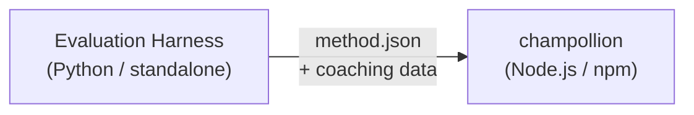

# ข้อกำหนด Method Plugin

> **เวอร์ชัน**: 1.1
> **กลุ่มเป้าหมาย**: นักพัฒนา Plugin
> **Canonical Schema**: [`shared/schemas/champollion-plugin.schema.json`](https://github.com/gamedaysuits/Champollion/blob/main/cli/shared/schemas/champollion-plugin.schema.json)

## ภาพรวม

champollion ใช้ **ระบบ method แบบ pluggable** คู่ภาษาแต่ละคู่สามารถใช้ method การแปลที่แตกต่างกันได้ (LLM, coached, script-converter ฯลฯ) Method ต่างๆ ถูกลงทะเบียนใน `lib/translate.js` และถูก resolve ต่อคู่ผ่าน `lib/pairs.js`

หน้าที่ของ eval harness คือ **พัฒนา ทดสอบ และ export** method การแปล ส่วนหน้าที่ของ champollion คือ **นำไปใช้และประมวลผล** Plugin เป็น **ข้อมูลเท่านั้น** — ได้แก่ การกำหนดค่า เนื้อหา coaching และผลลัพธ์ benchmark ไม่มีโค้ด Python และไม่มี dependency ของ harness

### Data Flow



harness พัฒนาและทดสอบ method ใน Python เมื่อ method พร้อมสำหรับการ deploy แล้ว harness จะ export manifest `method.json` และไฟล์ข้อมูล coaching ที่เป็น optional Champollion จะติดตั้งและประมวลผล method โดยใช้การ implement method ในตัวของตัวเอง

---

## รูปแบบ Method Plugin

Method plugin คือไฟล์ JSON ไฟล์เดียว (`method.json`) พร้อมไฟล์ข้อมูล coaching ที่เป็น optional

### `method.json` — จำเป็น

```json
{
  "name": "french-formal-v1",
  "type": "llm-coached",
  "version": "1.0.0",
  "description": "Formally-tuned French with terminology enforcement and grammar coaching",
  "author": "Plugin Author",

  "config": {
    "model": "google/gemini-3.5-flash",
    "temperature": 0.2,
    "batchSize": 80,
    "register": "formal",
    "coachingFile": null,
    "coachingPrompt": null,
    "promptContext": null,
    "qualityTier": null
  },

  "locales": ["fr"],

  "benchmarks": {
    "fr": {
      "date": "2026-05-11T00:00:00Z",
      "corpus_size": 500,
      "exact_match_rate": 0.42,
      "corpus_chrf": 72.3,
      "corpus_bleu": 45.1,
      "model": "google/gemini-3.5-flash",
      "harness_version": "1.0.0"
    }
  },

  "provenance": {
    "resources": [],
    "commercialReady": false,
    "flags": ["license-unclear"]
  },

  "coaching": {
    "dir": "coaching"
  }
}
```

### อ้างอิง Field

| Field | ประเภท | จำเป็น | คำอธิบาย |
|-------|--------|---------|-----------|
| `name` | string | ✅ | ตัวระบุ method ที่ไม่ซ้ำกัน (kebab-case) |
| `type` | string | ✅ | ประเภท method ของ Champollion: `llm`, `llm-coached`, `api`, `google-translate`, `deepl`, `microsoft-translator`, `libretranslate`, `openai`, `anthropic`, `gemini` |
| `version` | string | ✅ | เวอร์ชัน Semver (เช่น `1.0.0`) |
| `locales` | string[] | ✅ | รหัส locale ที่ method นี้รองรับ (อย่างน้อย 1 รายการ) |
| `description` | string | — | คำอธิบายที่มนุษย์อ่านได้ |
| `author` | string | — | ผู้พัฒนา/ทดสอบ method นี้ |
| `config.model` | string | — | ตัวระบุ model ของ OpenRouter |
| `config.temperature` | number | — | อุณหภูมิ LLM (0.0–2.0, ค่าเริ่มต้น: 0.3) |
| `config.batchSize` | number | — | จำนวน key ต่อ API batch (1–200, ค่าเริ่มต้น: 80) |
| `config.register` | string \| null | — | ระดับภาษา/โทนของภาษาเป้าหมาย (preset key หรือข้อความอิสระ) |
| `config.coachingFile` | string \| null | — | path ไปยังไฟล์ coaching prompt แบบข้อความอิสระ (relative จาก project root) |
| `config.coachingPrompt` | string \| null | — | ข้อความ coaching prompt ที่ถูก resolve แล้ว (อ่านจาก `coachingFile` ขณะ runtime) |
| `config.promptContext` | string \| null | — | บริบทของแอปพลิเคชันที่ inject เข้า system prompt (เช่น "E-commerce product descriptions") |
| `config.qualityTier` | string \| null | — | ระดับคุณภาพจากการประเมิน benchmark (`standard`, `high`, `research`, `verified`) |
| `benchmarks` | object | — | ผลลัพธ์ benchmark ต่อ locale จาก eval harness |
| `provenance` | object | — | ข้อมูล licensing และ resource dependency |
| `coaching.dir` | string | — | path relative ไปยังไดเรกทอรีข้อมูล coaching |

:::info[รูปแบบ MethodConfig แบบ Canonical]
บล็อก `config` ใช้ **canonical MethodConfig schema** — 8 field เดียวกันที่ใช้ใน `champollion.config.json`, harness run cards, `mt-eval export-config` และการ publish/install บน leaderboard ทุก field จะมีอยู่เสมอ ค่าที่ไม่ได้ใช้จะเป็น `null` ซึ่งช่วยให้การ round-trip ระหว่างการประเมินและ production เป็นไปอย่างราบรื่น
:::

### Benchmark Object (ต่อ locale)

| Field | ประเภท | จำเป็น | คำอธิบาย |
|-------|--------|---------|-----------|
| `date` | string | ✅ | timestamp รูปแบบ ISO 8601 ของการรัน benchmark |
| `corpus_size` | number | ✅ | จำนวน entry ที่ประเมิน |
| `exact_match_rate` | number | ✅ | 0.0–1.0 สัดส่วนของการจับคู่แบบตรงทั้งหมด |
| `corpus_chrf` | number | — | คะแนน chrF++ (0–100) |
| `corpus_bleu` | number | — | คะแนน BLEU (0–100) |
| `model` | string | ✅ | Model ที่ใช้ระหว่างการประเมิน |
| `harness_version` | string | ✅ | เวอร์ชันของ evaluation harness ที่ใช้ |

:::info[metric ใดที่แสดงผล?]
คำสั่ง `champollion status` แสดง **chrF++** และ **exact match rate** จากบล็อก benchmark `corpus_bleu` ถูกรับในไฟล์ manifest แต่ปัจจุบันยังไม่ถูกแสดงหรือใช้งานโดยคำสั่ง champollion ใดๆ [Method Leaderboard](/leaderboard) ติดตาม chrF++, exact match และ FST acceptance rate
:::

---

### Provenance Object

บล็อก provenance สื่อสารสถานะ licensing ของ resource ที่รวมอยู่ใน plugin

| Field | ประเภท | ค่าเริ่มต้น | คำอธิบาย |
|-------|--------|------------|-----------|
| `resources` | object[] | `[]` | รายการ resource ที่รวมอยู่พร้อม `name`, `license` และ `type` |
| `commercialReady` | boolean | `false` | plugin ได้รับการอนุมัติสำหรับการเผยแพร่เชิงพาณิชย์หรือไม่ |
| `flags` | string[] | `["license-unclear"]` | flag สถานะที่เครื่องอ่านได้ |

**สถานะเริ่มต้น** — plugin ที่ export ออกมาจะมาพร้อมกับ `commercialReady: false` และ `flags: ["license-unclear"]`

**สถานะที่ผ่านการตรวจสอบ** — เมื่อยืนยัน licensing แล้ว: ตั้งค่า `commercialReady: true` และล้าง flag ออก

---

## รูปแบบข้อมูล Coaching

หาก `type` เป็น `llm-coached` plugin ควรรวมไฟล์ข้อมูล coaching ไว้ในไดเรกทอรีย่อย `coaching/`

### `coaching/<locale>.json`

```json
{
  "grammar_rules": [
    "French adjectives agree in gender and number with the noun they modify",
    "Use 'vous' for formal contexts, 'tu' for informal"
  ],
  "dictionary": {
    "dashboard": "tableau de bord",
    "deployment": "déploiement",
    "settings": "paramètres"
  },
  "style_notes": "Prefer active voice. Avoid anglicisms where a native French term exists."
}
```

| Field | ประเภท | จำเป็น | คำอธิบาย |
|-------|--------|---------|-----------|
| `grammar_rules` | string[] | — | กฎที่ inject เข้า LLM prompt ทุกรายการสำหรับ locale นี้ |
| `dictionary` | object | — | แผนที่ term → การแปล term ที่ตรงกันจะถูก inject เป็น terminology ที่กำหนด |
| `style_notes` | string | — | คำแนะนำด้านสไตล์แบบอิสระที่ต่อท้าย prompt |

---

## โครงสร้างไดเรกทอรี

```
french-formal-v1/
  method.json                 # Method manifest with benchmarks
  coaching/
    fr.json                   # Coaching data for French
```

สำหรับ method ที่รองรับหลาย locale:

```
european-formal-v2/
  method.json                 # locales: ["fr", "de", "es", "it"]
  coaching/
    fr.json
    de.json
    es.json
    it.json
```

---

## วิธีที่ Champollion ใช้งาน Plugin

### การติดตั้ง

```bash
champollion plugin install ./french-formal-v1/
```

บันทึกไปยัง `.champollion/methods/french-formal-v1/`

### การกำหนดค่า

```json title="champollion.config.json"
{
  "pairs": {
    "en:fr": {
      "methodPlugin": "french-formal-v1"
    }
  }
}
```

:::info[Merge semantics]
Plugin กำหนด *method* ที่จะใช้ (`type`) ส่วน pair config ปรับแต่ง *วิธีการ* รัน (`model`, `register`, `batchSize`) หาก pair ตั้งค่า `model` จะ override ค่าเริ่มต้นของ plugin
:::

### Runtime

1. Champollion อ่าน `method.json` จาก `.champollion/methods/french-formal-v1/`
2. field `type` ของ plugin กำหนด method การแปล (เช่น `llm-coached`)
3. โหลดข้อมูล coaching จากไดเรกทอรี `coaching/` ของ plugin
4. ใช้บล็อก `config` เพื่อเติมช่องว่างใน model/register/temperature
5. บล็อก `benchmarks` จะแสดงในผลลัพธ์ `champollion status`
6. บล็อก `provenance` จะถูกตรวจสอบโดย `champollion provenance` สำหรับ licensing flag

---

## Schema Validation

Plugin manifest จะถูกตรวจสอบความถูกต้องตอนติดตั้งโดยเทียบกับ [`shared/schemas/champollion-plugin.schema.json`](https://github.com/gamedaysuits/Champollion/blob/main/cli/shared/schemas/champollion-plugin.schema.json)

อ้างอิง schema ใน `method.json` ของคุณเพื่อเปิดใช้งาน IDE autocompletion:

```json
{
  "$schema": "./node_modules/champollion/shared/schemas/champollion-plugin.schema.json",
  "name": "my-method-v1"
}
```

---

## สิ่งที่ไม่ควรรวมไว้

- ❌ ไม่มีโค้ด Python หรือ dependency ของ harness
- ❌ ไม่มีข้อมูล corpus ดิบหรือ run log
- ❌ ไม่มี API key หรือ credential
- ❌ ไม่มีการกำหนดค่า harness
- ❌ ไม่มี prompt template ภายใน (สิ่งเหล่านั้นอยู่ใน method implementation ของ champollion)

Plugin เป็น **ข้อมูลเท่านั้น**: การกำหนดค่า เนื้อหา coaching และผลลัพธ์ benchmark

---

## ดูเพิ่มเติม

- [Translation Methods](/docs/guides/translation-methods) — วิธีการทำงานของแต่ละ method ในตัว
- [Configuration](/docs/getting-started/configuration) — การกำหนดค่าต่อคู่และต่อภาษา
- [Serving a Method via API](/docs/guides/serving-a-method) — การ host method เป็น HTTP service
- [Cookbook: FST-Gated Pipeline](/docs/network/tutorials/fst-gated-pipeline) — การสร้างและ package pipeline
- [MT Evaluation](/docs/network/leaderboard/rules) — การ benchmark method สำหรับการส่งเข้า leaderboard
- [Support a Low-Resource Language](/docs/network/community/low-resource-languages) — use case สำหรับ community plugin
