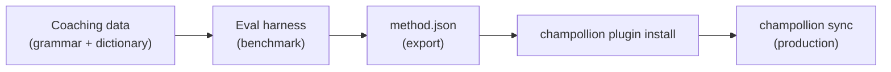

# บทช่วยสอน: สร้าง Translation Plugin

สร้างวิธีการแปลแบบกำหนดเองตั้งแต่ต้น ทดสอบประสิทธิภาพ และเผยแพร่เป็น champollion plugin นี่คือขั้นตอนการทำงานที่สมบูรณ์สำหรับการเพิ่มคู่ภาษาใหม่ที่ API สำเร็จรูปไม่รองรับ

**สิ่งที่คุณจะสร้าง:** Translation plugin แบบ coached สำหรับภาษาฝรั่งเศสทางการ พร้อมการบังคับใช้คำศัพท์เฉพาะ กฎไวยากรณ์ และคะแนน benchmark

**เวลา:** 30–45 นาที

**ข้อกำหนดเบื้องต้น:**
- ติดตั้ง champollion แล้ว (`npm install --save-dev champollion`)
- API key ของ OpenRouter (`OPENROUTER_API_KEY`)
- Python 3.10+ (สำหรับ eval harness)

---

## ขั้นตอนที่ 1: ระบุปัญหา

คุณกำลังแปล SaaS dashboard เป็นภาษาฝรั่งเศส วิธีการ `llm` เริ่มต้นให้ผลการแปลที่ถูกต้องแต่ไม่สม่ำเสมอ:

- บางครั้ง "dashboard" แปลเป็น "tableau de bord" บางครั้งเป็น "panneau de contrôle"
- ระดับภาษาสลับไปมาระหว่างรูปแบบ `tu` และ `vous`
- คำศัพท์ทางเทคนิคถูกทำให้เป็นภาษาอังกฤษอย่างไม่สม่ำเสมอ

คุณต้องการ **การบังคับใช้คำศัพท์เฉพาะ** และ **การควบคุมระดับภาษา** ที่ prompt LLM ทั่วไปไม่สามารถให้ได้

## ขั้นตอนที่ 2: สร้างข้อมูล Coaching

สร้างไฟล์ coaching ที่เข้ารหัสข้อกำหนดทางภาษาของคุณ:

```bash
mkdir -p .champollion/coaching
```

```json title=".champollion/coaching/fr.json"
{
  "grammar_rules": [
    "Always use the 'vous' form for formal register",
    "French adjectives agree in gender and number with their noun",
    "Use the present tense for UI instructions, not the imperative",
    "Preserve sentence-final punctuation style from the source"
  ],
  "dictionary": {
    "dashboard": "tableau de bord",
    "deployment": "déploiement",
    "settings": "paramètres",
    "environment variable": "variable d'environnement",
    "webhook": "webhook",
    "API key": "clé API",
    "sign in": "se connecter",
    "sign out": "se déconnecter",
    "repository": "dépôt",
    "pull request": "demande de tirage"
  },
  "style_notes": "Formal technical French. Prefer native French terms over anglicisms where established equivalents exist. Keep UI labels concise — 3 words maximum where possible."
}
```

**สิ่งที่แต่ละฟิลด์ทำ:**
- **`grammar_rules`** — ถูกแทรกเข้าไปใน system prompt ของ LLM เป็นข้อจำกัดที่ชัดเจน
- **`dictionary`** — จับคู่กับ source key; เมื่อคำในพจนานุกรมปรากฏขึ้น จะถูกแทรกเป็น "required terminology" ใน prompt
- **`style_notes`** — ต่อท้าย system prompt เป็นคำแนะนำสไตล์ทั่วไป

## ขั้นตอนที่ 3: กำหนดค่าคู่ภาษา

บอก champollion ให้ใช้ `llm-coached` สำหรับภาษาฝรั่งเศส:

```json title="champollion.config.json"
{
  "version": 3,
  "inputLocale": "en",
  "localesDir": "./locales",
  "pairs": {
    "en:fr": {
      "method": "llm-coached",
      "model": "google/gemini-3.5-flash",
      "temperature": 0.2
    }
  },
  "languages": {
    "fr": {
      "register": "Formal technical French (vous-form)",
      "name": "French"
    }
  }
}
```

## ขั้นตอนที่ 4: ทดสอบ

```bash
npx champollion sync --dry
```

ตรวจสอบผลลัพธ์ dry-run ตรวจสอบว่า:
- ✅ คำในพจนานุกรมถูกใช้อย่างสม่ำเสมอ ("tableau de bord" ไม่ใช่ "panneau de contrôle")
- ✅ ใช้รูปแบบ `vous` ตลอดทั้งเอกสาร
- ✅ คำศัพท์ทางเทคนิคตรงกับพจนานุกรมของคุณ

จากนั้นรัน sync จริง:

```bash
npx champollion sync
```

## ขั้นตอนที่ 5: ทดสอบประสิทธิภาพด้วย Eval Harness (ไม่บังคับ)

หากคุณต้องการคะแนนคุณภาพ — และคุณควรต้องการ เพราะ plugin จะมาพร้อมข้อมูล benchmark — ให้ใช้ eval harness ที่มาคู่กัน

### ติดตั้ง Harness

```bash
pip install mt-eval-harness
```

### สร้าง Reference Corpus

สร้างไฟล์ที่มี source string และการแปลที่ถูกต้องที่ทราบแล้ว:

```json title="corpus/french-formal.json"
[
  {
    "source": "Dashboard",
    "reference": "Tableau de bord"
  },
  {
    "source": "Sign in to your account",
    "reference": "Connectez-vous à votre compte"
  },
  {
    "source": "Your deployment is ready",
    "reference": "Votre déploiement est prêt"
  },
  {
    "source": "Environment variables",
    "reference": "Variables d'environnement"
  }
]
```

### รัน Benchmark

```bash
mt-eval test \
  --corpus corpus/french-formal.json \
  --source en \
  --target fr \
  --model google/gemini-3.5-flash \
  --temperature 0.2 \
  --champollion-config champollion.config.json
```

harness แสดงผลลัพธ์:
- **chrF++** — คะแนน F ระดับอักขระ (0–100) มากกว่า 70 ถือว่าดีมาก
- **BLEU** — ความทับซ้อนของ N-gram (0–100) มากกว่า 40 ถือว่าดีสำหรับ coached translation
- **Exact match rate** — สัดส่วนของการแปลที่ตรงกับ reference ทุกประการ
- **COMET** — เมตริกคุณภาพแบบ neural (หากติดตั้งผ่าน `mt-eval setup --comet`)

:::tip[ทดสอบสิ่งที่คุณจะเผยแพร่]
การใช้ `--champollion-config` จะนำเข้า model สำหรับ production, register, temperature และข้อมูล coaching โดยตรงจาก `champollion.config.json` ของคุณ ซึ่งช่วยให้มั่นใจว่าคุณกำลัง benchmark วิธีการที่แน่นอนที่จะนำไปใช้งานจริง
:::

### ส่งออก Plugin

เมื่อคุณพอใจกับคะแนนแล้ว:

```bash
mt-eval export \
  --name french-formal-v1 \
  --report eval/logs/harness/run_report.json \
  --output ./french-formal-v1/
```

สิ่งนี้จะสร้าง:

```
french-formal-v1/
├── method.json          # Manifest with config + benchmarks
└── coaching/
    └── fr.json          # Your coaching data
```

## ขั้นตอนที่ 6: ติดตั้ง Plugin ใน Champollion

```bash
npx champollion plugin install ./french-formal-v1/
```

ขั้นตอนนี้จะคัดลอก plugin ไปยัง `.champollion/methods/french-formal-v1/`

อัปเดต config ของคุณเพื่อใช้งาน:

```json title="champollion.config.json"
{
  "pairs": {
    "en:fr": {
      "methodPlugin": "french-formal-v1"
    }
  }
}
```

## ขั้นตอนที่ 7: ตรวจสอบ

```bash
# Check plugin is installed and shows benchmark scores
npx champollion status

# Run a sync with the plugin
npx champollion sync

# Audit licensing status
npx champollion provenance
```

ผลลัพธ์ `status` จะแสดง:

```
en → fr
  Method:    french-formal-v1 (llm-coached)
  Model:     google/gemini-3.5-flash
  Quality:   high
  chrF++:    74.2
  BLEU:      46.8
  Exact:     42%
```

## สิ่งที่คุณได้สร้าง



ตอนนี้คุณมี:
1. **ข้อมูล Coaching** — กฎไวยากรณ์และคำศัพท์เฉพาะที่บังคับใช้ความสม่ำเสมอ
2. **คะแนน Benchmark** — คุณภาพที่วัดได้เป็นตัวเลขซึ่งมาพร้อมกับ plugin
3. **Plugin แบบพกพา** — `method.json` + ข้อมูล coaching ที่ติดตั้งได้บนเครื่องใดก็ได้
4. **การใช้งานใน Production** — ผสานรวมเข้ากับ sync pipeline ของคุณ

## ขั้นตอนต่อไป

- **[ข้อกำหนด Plugin](/docs/reference/plugin-spec)** — เอกสารอ้างอิงรูปแบบ manifest ฉบับสมบูรณ์
- **[Translation Methods](/docs/guides/translation-methods)** — เปรียบเทียบวิธีการทั้งสี่
- **[ภาษาที่มีทรัพยากรน้อย](/docs/network/community/low-resource-languages)** — นำรูปแบบนี้ไปใช้กับภาษาที่ไม่มี API รองรับ
- **[แปล 30 ภาษา](/docs/tutorials/translate-30-languages)** — ขยายโปรเจกต์ของคุณสู่ผู้ชมทั่วโลก
