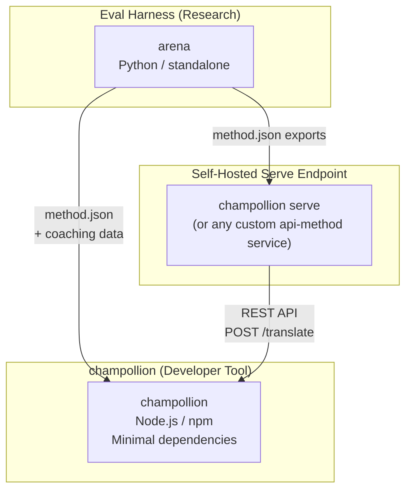
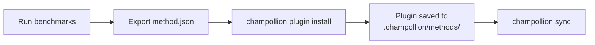
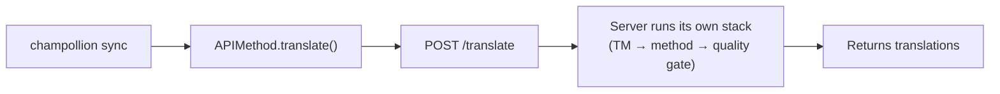
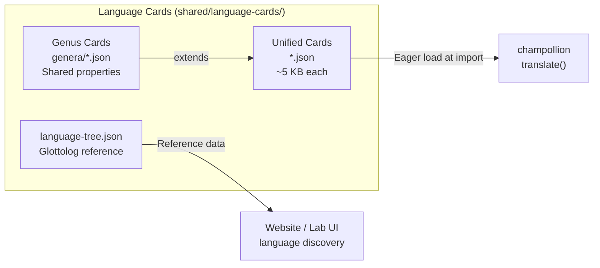

# Kiến trúc

Hệ sinh thái dịch thuật Champollion gồm ba công cụ độc lập hoạt động cùng nhau thông qua các giao ước được định nghĩa rõ ràng. Không công cụ nào phụ thuộc vào nhau tại thời điểm build. Chúng giao tiếp thông qua một **định dạng plugin phương thức (method plugin format)** chung và một **giao ước REST API**.

## Ba thành phần



### champollion (dự án này)

Công cụ dành cho nhà phát triển có sẵn mã nguồn (miễn phí cho mục đích phi thương mại). Dịch các tệp locale bằng các phương thức dạng plugin. Ít phụ thuộc, cấu hình tùy chọn, hoạt động ngay lập tức.

**Các phương thức tích hợp sẵn:**
- `llm` → OpenRouter / bất kỳ LLM nào (hơn 200 mô hình)
- `llm-coached` → LLM + hướng dẫn ngữ pháp/từ điển (coaching)
- `openai` → API OpenAI trực tiếp (GPT-4o, GPT-4o-mini)
- `anthropic` → API Anthropic trực tiếp (Claude Sonnet, Haiku, Opus)
- `gemini` → API Google Gemini trực tiếp (Flash, Pro — có gói miễn phí)
- `google-translate` → Google Cloud Translation API v2
- `deepl` → DeepL API hỗ trợ bảng thuật ngữ (glossary)
- `microsoft-translator` → Azure Cognitive Services Translator
- `libretranslate` → LibreTranslate tự lưu trữ (self-hosted) (AGPL, miễn phí)
- `api` → Đường truyền mỏng (thin pipe) đến bất kỳ endpoint REST từ xa nào

### Eval Harness (dự án đồng hành)

Một công cụ nghiên cứu để phát triển, thử nghiệm và đánh giá hiệu năng (benchmark) các phương thức dịch thuật. Khi một phương thức đạt chất lượng chấp nhận được, harness sẽ xuất ra một **method plugin** — gồm một tệp manifest `method.json` và các tệp dữ liệu hướng dẫn (coaching) tùy chọn.

Harness không bao giờ chạy bên trong champollion. Nó là một công cụ riêng biệt tạo ra đầu ra tĩnh (các tệp JSON). Champollion chỉ đọc các tệp đó.

[→ Eval Harness trên GitHub](https://github.com/gamedaysuits/Champollion)

### Điểm cuối phục vụ tự lưu trữ (`champollion serve`)

Bất kỳ dự án champollion nào cũng có thể phục vụ stack dịch thuật đã được cấu hình của riêng nó qua HTTP chỉ bằng một lệnh — [`champollion serve`](/docs/guides/serving-a-method#the-zero-code-path-champollion-serve) — và bất kỳ dự án nào khác cũng có thể tiêu thụ nó thông qua phương thức `api`. Các prompt, dữ liệu coaching, Bộ nhớ dịch (Translation Memory), và khóa của nhà cung cấp vẫn nằm trên hạ tầng của chủ sở hữu; người tiêu thụ chỉ gửi các chuỗi nguồn và nhận lại các bản dịch. Các pipeline nằm hoàn toàn bên ngoài champollion (một chuỗi FST, một hệ thống nghiên cứu) có thể triển khai cùng một hợp đồng như một [dịch vụ tùy chỉnh](/docs/guides/serving-a-method). Không có dịch vụ Champollion được lưu trữ sẵn (hosted) — việc phục vụ luôn là tự lưu trữ (self-hosted), theo đúng thiết kế.

## Cách chúng kết nối với nhau

### Eval Harness → champollion (xuất một chiều)



**Giao ước**: [Đặc tả Plugin](/docs/reference/plugin-spec)

### Điểm cuối phục vụ → champollion (API lúc chạy)



Phương thức `APIMethod` của Champollion là một **đường truyền đơn giản (dumb pipe)**. Nó gửi các khóa (keys) đi và nhận lại bản dịch. Nó không chứa logic dịch thuật và không chứa nội dung độc quyền nào.

## Những gì mỗi thành phần biết về các thành phần khác

| Công cụ | Biết về champollion không? | Biết về điểm cuối phục vụ không? | Biết về harness không? |
|------|---------------------|-------------------------------|---------------------|
| **champollion** | *(chính là champollion)* | Có — phương thức `api` gọi nó | Không — chỉ đọc các export của plugin |
| **Điểm cuối phục vụ** | Có — phục vụ các yêu cầu của nó | *(chính là điểm cuối phục vụ)* | Không — cài đặt các phương thức được export như bất kỳ dự án nào |
| **Eval Harness** | Có — export định dạng plugin | Không — các phương thức được triển khai riêng biệt | *(chính là harness)* |

## Các kịch bản người dùng

### Kịch bản 1: Miễn phí, không cần cấu hình (hầu hết người dùng)

```bash
export OPENROUTER_API_KEY=sk-...
npx champollion sync
```

Sử dụng phương thức `llm` tích hợp sẵn. Không có plugin, không có máy chủ, không có harness.

### Kịch bản 2: Bản dịch cơ sở từ Google Translate

```bash
export GOOGLE_TRANSLATE_API_KEY=AIza...
npx champollion sync
```

Sử dụng phương thức `google-translate` tích hợp sẵn. Không cần plugin.

### Kịch bản 3: Plugin mở đi kèm dữ liệu hướng dẫn (coaching)

```bash
champollion plugin install ./french-formal-v1/
champollion sync
```

Plugin có `type: "llm-coached"` → champollion sử dụng khóa OpenRouter của chính người dùng. Dữ liệu hướng dẫn được lưu cục bộ (không gọi máy chủ).

### Kịch bản 4: Tự thiết lập hướng dẫn (không plugin, không harness)

```json title="champollion.config.json"
{
  "pairs": {
    "en:fr": { "method": "llm-coached" }
  }
}
```

Người dùng tự duy trì các quy tắc ngữ pháp và từ điển của riêng họ trong `.champollion/coaching/fr.json`.

### Kịch bản 5: Tiêu thụ stack được phục vụ của một dự án khác

```bash
champollion plugin install ./their-project-serve/   # manifest from `champollion serve --emit-manifest`
CHAMPOLLION_API_KEY=<their bearer token> champollion sync
```

Phương thức `api` của cặp ngôn ngữ này sẽ POST các chuỗi nguồn tới điểm cuối [`champollion serve`](/docs/guides/serving-a-method#the-zero-code-path-champollion-serve) tự lưu trữ của họ; stack của họ (coaching, TM, quality gate) sẽ thực hiện việc dịch thuật.

## Thẻ ngôn ngữ (Language Cards)

Mỗi ngôn ngữ trong champollion được cấu hình thông qua một **Thẻ ngôn ngữ (Language Card)** — một tệp JSON thống nhất chứa các thiết lập sẵn về văn phong (register presets), quy tắc trang trọng (formality rules), cờ hỗ trợ phương thức, quy ước trình bày văn bản (typography), phân loại phả hệ ngôn ngữ và dữ liệu tham chiếu ngôn ngữ học.



Các thẻ được tải chủ động (eagerly) khi import. Mỗi thẻ chứa tất cả siêu dữ liệu (metadata) mà công cụ dịch thuật và tài liệu dành cho nhà phát triển cần — không có tầng tham chiếu riêng biệt. Các thẻ được tạo từ các nguồn uy tín (IANA, CLDR, [Glottolog](https://glottolog.org), [WALS](https://wals.info)) bằng cách sử dụng `scripts/generate-language-card.mjs` và `scripts/build-language-tree.mjs`, sau đó được con người kiểm duyệt để đảm bảo độ chính xác về mặt ngôn ngữ học.

## Nguyên tắc Thiết kế

1. **Không có phụ thuộc vòng.** Các cầu nối đều là một chiều.
2. **Champollion là lõi gọn nhẹ.** Ít phụ thuộc, cấu hình tùy chọn. Các plugin và API là các thành phần bổ sung.
3. **Bảo vệ sở hữu trí tuệ (IP) mang tính kiến trúc.** Các kỹ thuật độc quyền được giữ ở phía phục vụ — bất kỳ ai chạy điểm cuối đều giữ lại các prompt, coaching và khóa của họ. Gói npm không chứa bất kỳ thứ gì độc quyền.
4. **Định dạng plugin là hợp đồng.** Mọi thứ đều chảy qua `method.json`.
5. **Mỗi công cụ có một nhiệm vụ.** Harness → phát triển các phương thức. `champollion serve` → lưu trữ (host) các phương thức. Champollion → dịch các tệp.

---

## Xem thêm

- [Phương thức dịch thuật](/docs/guides/translation-methods) — cách hoạt động của từng phương thức tích hợp sẵn
- [Đặc tả Plugin](/docs/reference/plugin-spec) — định dạng manifest method.json
- [Eval Harness](/docs/network/specifications/harness) — công cụ nghiên cứu đồng hành
- [Cung cấp phương thức qua API](/docs/guides/serving-a-method) — lưu trữ các quy trình dịch thuật tùy chỉnh
- [Hỗ trợ ngôn ngữ ít tài nguyên](/docs/network/community/low-resource-languages) — trường hợp sử dụng đã thúc đẩy kiến trúc này
