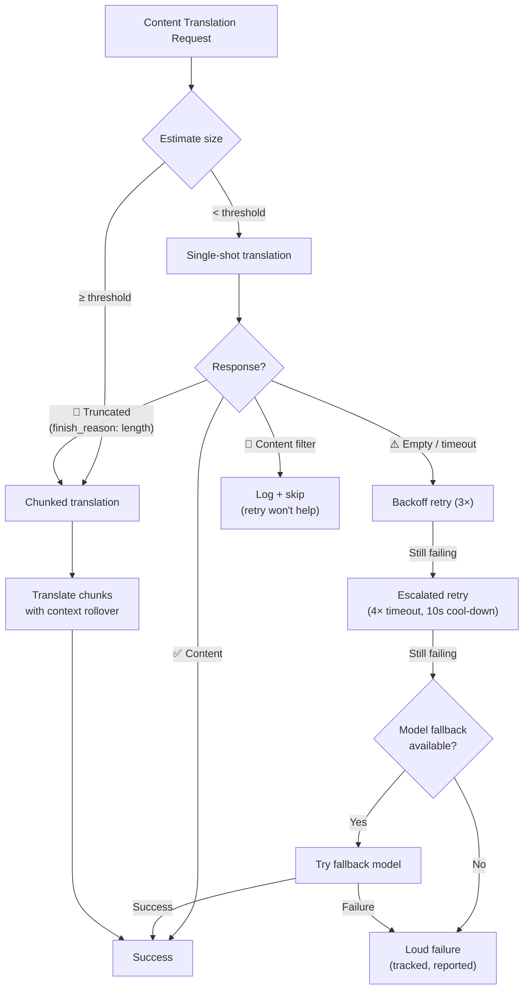

# Khả năng phục hồi dịch thuật nội dung

Pipeline dịch thuật nội dung của Champollion (tài liệu Markdown/MDX) sử dụng hệ thống phục hồi nhiều lớp để xử lý các lỗi một cách mượt mà. Không giống như dịch thuật key-value — nơi mỗi batch đều nhỏ và việc thử lại rất ít tốn kém — dịch thuật nội dung liên quan đến các prompt lớn và đầu ra dài, vốn có thể thất bại vì các lý do cấu trúc chứ không chỉ là các lỗi tạm thời.

## Vấn đề

Dịch thuật nội dung có các chế độ lỗi (failure mode) khác biệt cơ bản so với dịch thuật key-value:

| Chế độ lỗi | Key-Value | Nội dung |
|---|---|---|
| Giới hạn lượt yêu cầu (Rate limit - 429) | Phổ biến, tạm thời | Phổ biến, tạm thời |
| Quá thời gian chờ (Timeout) | Hiếm gặp (batch nhỏ) | Phổ biến (đầu ra dài) |
| Phản hồi trống | Hiếm gặp | Phổ biến (giới hạn đầu ra, bộ lọc) |
| Cắt ngắn đầu ra (Output truncation) | Không áp dụng (đã xác thực JSON) | Xảy ra trong âm thầm |
| Bộ lọc nội dung | Cực kỳ hiếm gặp | Có thể xảy ra (tài liệu CLI, tài liệu bảo mật) |
| Giới hạn của mô hình | Thử lại sẽ khắc phục được | Thử lại sẽ không khắc phục được |

Nhận thức cốt lõi: **thử lại cùng một yêu cầu bị lỗi không phải là dự phòng, đó là sự cố chấp.** Một hệ thống phục hồi thích hợp sẽ xác định *tại sao* lỗi xảy ra và thay đổi cách tiếp cận tương ứng.

## Tổng quan kiến trúc



## Lớp 1: Thử lại ưu tiên chẩn đoán (Diagnostic-First Retry)

Trước khi quyết định *cách* thử lại, hệ thống sẽ kiểm tra phản hồi API để hiểu *điều gì* đã thất bại.

### Phân tích lý do kết thúc (Finish Reason)

Mỗi API LLM đều trả về một `finish_reason` cùng với văn bản được tạo ra. Champollion sử dụng thông tin này để đưa ra quyết định thử lại một cách thông minh:

| `finish_reason` | Ý nghĩa | Hành động |
|---|---|---|
| `stop` + content | Mô hình hoàn thành bình thường | ✅ Chấp nhận kết quả |
| `stop` + empty | Mô hình không tạo ra gì | ⚠️ Thử lại cùng một yêu cầu (lỗi tạm thời) |
| `length` | Đầu ra đạt giới hạn token | 🔶 Tự động chia nhỏ tài liệu (Auto-chunk) |
| `content_filter` | Bộ lọc an toàn đã chặn đầu ra | 🔴 Ghi log và bỏ qua (thử lại cũng không giải quyết được) |
| `null` / missing | Phản hồi sai định dạng | ⚠️ Thử lại cùng một yêu cầu (lỗi tạm thời) |

Điều này thay thế cách tiếp cận hiện tại là xử lý mọi lỗi giống hệt nhau bằng các lần thử lại giãn cách (backoff retry).

### Ngân sách thử lại (Retry Budget)

Ngân sách thử lại tiêu chuẩn cho các lỗi tạm thời:

| Vòng | Số lần thử | Thời gian chờ | Thời gian giãn cách |
|---|---|---|---|
| Tiêu chuẩn | 4 (0→3) | 60s | 1s → 2s → 4s |
| Leo thang | 4 (0→3) | 120s | 1s → 2s → 4s |
| **Tổng cộng** | **8** | — | **~3.5 phút trong trường hợp xấu nhất** |

Giữa các vòng, thời gian hạ nhiệt (cool-down) 10 giây cho phép các sự cố tạm thời được giải quyết.

## Lớp 2: Chia nhỏ nội dung (Content Chunking)

Khi một tài liệu vượt quá ngưỡng kích thước — hoặc khi Lớp 1 báo hiệu đầu ra bị cắt ngắn — hệ thống sẽ chia tài liệu thành các phần nhỏ (chunk) có kích thước phù hợp để dịch.

Xem [Context Rollover](/docs/concepts/context-rollover#content-chunking) để biết cấu hình chia nhỏ chi tiết. Các điểm chính:

### Chiến lược chia nhỏ

1. **Ranh giới tiêu đề (Heading boundaries)** — `##` và `###` là các ranh giới đơn vị dịch tự nhiên. Mỗi phần đủ độc lập để dịch riêng lẻ.
2. **Dự phòng theo đoạn văn (Paragraph fallback)** — nếu một phần tiêu đề đơn lẻ vượt quá kích thước chunk, hãy chia tại các vị trí xuống dòng kép.
3. **Chia cứng (Hard split)** — giải pháp cuối cùng cho các đoạn văn cực kỳ dài (ví dụ: bảng). Chia tại ranh giới câu.

### Ngữ cảnh giữa các Chunk

Mỗi chunk nhận được 2-3 đoạn văn cuối cùng của *bản dịch của chunk trước đó* làm ngữ cảnh. Điều này ngăn chặn:
- **Lệch thuật ngữ (Terminology drift)** — mô hình nhìn thấy những gì nó đã gọi là "tableau de bord" trong chunk trước đó
- **Xác định đại từ (Pronoun resolution)** — các từ đứng trước từ phần trước được chuyển tiếp
- **Nhất quán về văn phong (Register consistency)** — giọng điệu được thiết lập trong chunk 1 sẽ được duy trì xuyên suốt đến chunk N

### Tác nhân kích hoạt tự động chia nhỏ (Auto-Chunking Triggers)

| Tác nhân kích hoạt | Hành vi |
|---|---|
| `contentChunkSize` được thiết lập trong cấu hình | Luôn chia nhỏ các tài liệu vượt quá kích thước đó |
| `finish_reason: "length"` được trả về | Tự động chia nhỏ như một phương án dự phòng (ngay cả khi không có cấu hình) |
| Đầu vào > ~12KB (tự động phát hiện) | Ghi log gợi ý, nhưng không bắt buộc |

## Lớp 3: Chuỗi mô hình dự phòng (Model Fallback Chain)

Khi mô hình được cấu hình liên tục thất bại — không phải tạm thời mà là do cấu trúc — hệ thống sẽ thử các mô hình thay thế. Các mô hình khác nhau có cửa sổ ngữ cảnh, giới hạn đầu ra, bộ lọc an toàn và thế mạnh đa ngôn ngữ khác nhau.

### Chuỗi dự phòng mặc định

```json title="champollion.config.json"
{
  "contentFallbackChain": [
    "google/gemini-2.5-flash",
    "anthropic/claude-sonnet-4"
  ]
}
```

Mô hình được cấu hình luôn được thử trước tiên. Các mô hình dự phòng chỉ được sử dụng sau khi tất cả các vòng thử lại (tiêu chuẩn + leo thang) đã cạn kiệt.

### Tại sao cần nhiều kiến trúc

| Kịch bản | Mô hình chính thất bại | Mô hình dự phòng thành công |
|---|---|---|
| Tài liệu CLI tiếng Việt | Gemini trả về kết quả trống | Claude xử lý tốt |
| Nội dung bị lọc an toàn | OpenAI chặn nó | Gemini có các ngưỡng lọc khác nhau |
| Các bảng cấu trúc dài | Mô hình A cắt ngắn | Mô hình B có cửa sổ đầu ra lớn hơn |

Giá trị của phương án dự phòng là sự đa dạng về kiến trúc — các họ mô hình khác nhau có các chế độ lỗi khác nhau. Một lỗi mang tính cấu trúc đối với mô hình này có thể là chuyện nhỏ đối với mô hình khác.

### Phạm vi

> Mô hình dự phòng **chỉ áp dụng cho nội dung (content-only)**. Các batch key-value rất nhỏ và hầu như không bao giờ thất bại về mặt cấu trúc. Việc thêm sự phức tạp của mô hình dự phòng ở đó sẽ là thiết kế quá mức (over-engineering).

## Lớp 4: Ghi nhận lỗi (Failure Accounting)

Khi xảy ra lỗi, hệ thống sẽ theo dõi và báo cáo chúng một cách thích hợp thay vì tiếp tục trong im lặng.

### Trong quá trình đồng bộ (Sync)

- Các mục bị lỗi sẽ hiển thị `[FAIL]` trong đầu ra tiến trình
- Mỗi lỗi sẽ ghi log lý do cụ thể (timeout, phản hồi trống, bộ lọc nội dung, cắt ngắn)
- Các mục đã hoàn thành được lưu vào manifest ngay lập tức (lưu trữ tăng dần - incremental persistence)

### Sau khi đồng bộ (Sync)

Bản tóm tắt lỗi sẽ được in ở cuối:

```
  ┌─ Content Translation Failures ─────────────────────────────────────┐
  │                                                                     │
  │  2 of 24 content translations failed:                              │
  │                                                                     │
  │  ✗ docs/reference/cli.md → vi                                      │
  │    Reason: empty response after 8 attempts + 1 fallback model      │
  │    Models tried: google/gemini-3.1-pro-preview, gemini-2.5-flash   │
  │                                                                     │
  │  ✗ docs/guides/troubleshooting.md → ar                             │
  │    Reason: content_filter (no retry — blocked by safety filter)    │
  │                                                                     │
  │  Re-run: npx champollion@latest sync                              │
  │  (22 completed translations are cached and won't re-run)           │
  └─────────────────────────────────────────────────────────────────────┘
```

### Manifest thử lại (Retry Manifest)

Các tệp bị lỗi được ghi vào `.champollion-retry.json`:

```json
{
  "failedAt": "2026-05-27T21:45:00Z",
  "files": [
    {
      "source": "docs/reference/cli.md",
      "locale": "vi",
      "reason": "empty_response",
      "attempts": 8,
      "modelsTried": ["google/gemini-3.1-pro-preview", "google/gemini-2.5-flash"]
    }
  ]
}
```

Trong lần chạy `sync` tiếp theo, chỉ những tệp này mới được xử lý lại. Các tệp đã hoàn thành được bảo toàn thông qua manifest hash nội dung (`.champollion-content.lock`).

### Mã thoát (Exit Codes)

| Mã | Ý nghĩa |
|---|---|
| 0 | Tất cả các bản dịch đều thành công |
| 1 | Lỗi cấu hình, thiếu API key, v.v. |
| 2 | Thất bại một phần — một số bản dịch nội dung bị lỗi |

## Cấu hình

```json title="champollion.config.json"
{
  "contentChunkSize": 4000,
  "contentOverlap": 200,
  "contentFallbackChain": [
    "google/gemini-2.5-flash",
    "anthropic/claude-sonnet-4"
  ]
}
```

| Trường | Kiểu dữ liệu | Mặc định | Mô tả |
|---|---|---|---|
| `contentChunkSize` | `number \| null` | `null` | Số token tối đa cho mỗi chunk nội dung. `null` = không chia nhỏ (chỉ tự động chia nhỏ khi bị cắt ngắn) |
| `contentOverlap` | `number` | `200` | Các token chồng lấp (overlap) giữa các chunk nội dung để đảm bảo tính liên tục của ngữ cảnh |
| `contentFallbackChain` | `string[]` | `[]` | Các mô hình dự phòng cần thử khi mô hình được cấu hình thất bại về mặt cấu trúc |

## Trạng thái triển khai

| Tính năng | Trạng thái |
|---|---|
| Thử lại ưu tiên chẩn đoán (phân tích finish_reason) | 🔲 Đã lên kế hoạch |
| Chia nhỏ nội dung (chia theo tiêu đề/đoạn văn) | 🔲 Đã lên kế hoạch |
| Chuyển tiếp ngữ cảnh giữa các chunk | 🔲 Đã lên kế hoạch |
| Chuỗi mô hình dự phòng | 🔲 Đã lên kế hoạch |
| Báo cáo tóm tắt lỗi | 🔲 Đã lên kế hoạch |
| Manifest thử lại (.champollion-retry.json) | 🔲 Đã lên kế hoạch |
| Mã thoát 2 cho các thất bại một phần | 🔲 Đã lên kế hoạch |
| Thử lại leo thang (kéo dài thời gian chờ) | ✅ Đã triển khai (v3.3.3) |
| Thông báo thử lại có đánh số lần thử | ✅ Đã triển khai (v3.3.3) |
| Báo lỗi rõ ràng khi gặp lỗi nội dung | ✅ Đã triển khai (v3.3.3) |

## Xem thêm

- [Context Rollover](/docs/concepts/context-rollover) — tính nhất quán của batch và cấu hình chia nhỏ nội dung
- [How Sync Works](/docs/concepts/how-sync-works) — toàn bộ pipeline đồng bộ
- [Translation Methods](/docs/guides/translation-methods) — các phương thức khả dụng và đặc điểm của chúng
