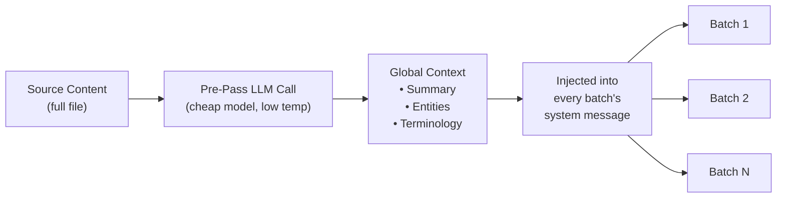

# Gom nhóm Chuyển tiếp Ngữ cảnh

Chuyển tiếp ngữ cảnh (Context rollover) là một tính năng đảm bảo tính nhất quán của bản dịch ở cấp độ tài liệu, giúp chuyển tiếp một phần các bản dịch trước đó vào các nhóm (batch) tiếp theo, mang lại cho LLM "trí nhớ ngắn hạn" qua ranh giới giữa các nhóm.

## Lý do Tính năng này Tồn tại

Khi dịch các tệp lớn (hơn 100 khóa hoặc tài liệu Markdown dài), Champollion sẽ chia nhỏ công việc thành các nhóm. Nếu không có tính năng chuyển tiếp, mỗi nhóm sẽ được dịch độc lập — LLM không có ký ức về những gì nó đã dịch ở nhóm trước đó. Điều này dẫn đến:

- **Trôi lệch thuật ngữ (Terminology drift)**: Cùng một thuật ngữ tiếng Anh bị dịch khác nhau giữa các nhóm (ví dụ: "dashboard" → "tableau de bord" ở nhóm 1, nhưng lại thành "panneau" ở nhóm 3)
- **Lỗi tham chiếu chéo (Coreference failure)**: Các đại từ và tham chiếu vượt qua ranh giới nhóm bị mất đi từ đứng trước (antecedent)
- **Không nhất quán về văn phong (Register inconsistency)**: Giọng điệu có thể bị thay đổi giữa các nhóm (trang trọng → thân mật → trang trọng)

Đây là một vấn đề đã được ghi nhận rõ ràng trong các tài liệu về dịch máy (MT). Phương pháp cửa sổ trượt (sliding window) đã được xác thực bởi các nghiên cứu về dịch máy cấp độ tài liệu (các hội thảo ACL, WMT).

## Cách Thức Hoạt Động

### Cửa sổ Trượt (The Sliding Window)

Khi `contextRollover` được bật, quy trình dịch thuật sẽ duy trì một cửa sổ chứa các cặp khóa-giá trị vừa được dịch gần đây. Sau khi mỗi nhóm hoàn thành, một phần kết quả đầu ra của nó (mặc định: 20% của `batchSize`) sẽ được chuyển tiếp vào prompt của nhóm tiếp theo dưới dạng "bản dịch tham chiếu".

```
Batch 1: Translate keys 1-80         → LLM sees: system prompt + keys 1-80
Batch 2: Translate keys 81-160       → LLM sees: system prompt + [16 reference translations from batch 1] + keys 81-160
Batch 3: Translate keys 161-240      → LLM sees: system prompt + [16 reference translations from batch 2] + keys 161-240
```

Các bản dịch tham chiếu được chèn vào tin nhắn của người dùng (user message) với một nhãn rõ ràng:

```
--- Previous translations for context (do NOT re-translate these) ---
"nav.dashboard": "Tableau de bord"
"nav.settings": "Paramètres"
"header.welcome": "Bienvenue sur la plateforme"
---

{
  "content.main_heading": "Getting Started with Your Dashboard",
  ...
}
```

### Chiến lược Lựa chọn

Hai chế độ để chọn bản dịch nào sẽ được chuyển tiếp:

| Chiến lược | Hành vi | Phù hợp nhất cho |
|----------|----------|----------|
| `tail` (mặc định) | N bản dịch cuối cùng từ nhóm trước | Tài liệu tuần tự, nội dung Markdown |
| `diverse` | Chọn các mục bao gồm các loại khóa khác nhau (nút, tiêu đề, mô tả) | Các tệp JSON lớn chứa nhiều loại thành phần giao diện (UI) hỗn hợp |

### Giới hạn Token (Token Budget)

Cửa sổ chuyển tiếp sẽ tiêu tốn token đầu vào. Champollion tính toán chi phí token ước tính và đưa ra cảnh báo nếu cửa sổ này vượt quá 15% cửa sổ ngữ cảnh ước tính của mô hình. Cảnh báo sẽ bao gồm một đề xuất giảm bớt:

```
[WARN] Rollover window is ~2400 tokens (18% of model context).
       Consider reducing rolloverSize to 0.15 or lowering batchSize.
```

## Phân tích Ngữ cảnh Toàn cục Trước (Global Context Pre-Pass)

Một lượt gọi LLM phân tích trước tùy chọn được thực hiện **trước khi** quá trình dịch bắt đầu. LLM sẽ phân tích toàn bộ nội dung nguồn và tạo ra:

1. **Tóm tắt Tài liệu (Document Summary)** — Mô tả từ 2-3 câu về nội dung đang được dịch
2. **Thực thể có tên (Named Entities)** — Tên sản phẩm, thuật ngữ kỹ thuật và danh từ riêng kèm theo cách xử lý đề xuất
3. **Danh sách Nhất quán Thuật ngữ (Terminology Consistency List)** — Các thuật ngữ chính mà LLM xác định là cần dịch nhất quán

Ngữ cảnh toàn cục này được chèn vào **tin nhắn hệ thống (system message)** của mọi nhóm, giúp mỗi nhóm nhận biết được toàn bộ tài liệu mặc dù nó chỉ nhìn thấy một phần.



### Mô hình Phân tích Trước (Pre-Pass Model)

Việc trích xuất ngữ cảnh toàn cục sử dụng một lượt gọi LLM riêng biệt, chi phí thấp (mặc định: `google/gemini-3.5-flash` với temperature 0.1) bất kể mô hình dịch được cấu hình của người dùng là gì. Đây là một tác vụ trích xuất siêu dữ liệu (metadata), không phải tác vụ dịch thuật — tốc độ và chi phí quan trọng hơn kết quả sáng tạo.

## Chia nhỏ Nội dung {#content-chunking}

Đối với các tài liệu Markdown dài (dịch thuật nội dung), phần thân tài liệu có thể vượt quá cửa sổ ngữ cảnh hiệu dụng của LLM, hoặc mô hình có thể cắt bớt kết quả đầu ra. Tính năng chia nhỏ nội dung sẽ chia tài liệu thành các phân đoạn chồng lấp, mỗi phân đoạn được dịch độc lập, sau đó được lắp ghép lại.

### Chiến lược Chia nhỏ

Việc chia nhỏ tuân theo một quy trình ưu tiên phân cấp — nó sẽ thử điểm chia nhỏ có ý nghĩa nhất về mặt ngữ nghĩa trước:

1. **Ranh giới tiêu đề (Heading boundaries)** — Các ký hiệu `##` và `###` tạo ra các đơn vị dịch tự nhiên. Mỗi phần đủ độc lập để dịch riêng biệt, và các tiêu đề cung cấp cho LLM ngữ cảnh cấu trúc về nội dung mà nó đang dịch.
2. **Ranh giới đoạn văn (Paragraph boundaries)** — nếu một phần tiêu đề vượt quá kích thước phân đoạn, hệ thống sẽ chia nhỏ tại các dòng trống kép (`\n\n`). Đoạn văn là ranh giới tốt thứ hai vì chúng đại diện cho các ý nghĩ hoàn chỉnh.
3. **Ranh giới câu (Sentence boundaries)** — giải pháp cuối cùng cho các đoạn văn cực kỳ dài (ví dụ: bảng lớn, văn bản dày đặc). Chia nhỏ tại ranh giới dấu chấm kèm khoảng trắng trong khi vẫn tôn trọng các từ viết tắt.

Các khối được bảo vệ (khối mã, shortcode — xem [Cách thức Đồng bộ Hoạt động](/docs/concepts/how-sync-works)) không bao giờ bị chia cắt giữa các phân đoạn. Nếu một khối được bảo vệ có nguy cơ bị cắt, điểm chia nhỏ sẽ được di chuyển lên trước hoặc ra sau khối đó.

### Trình kích hoạt Tự động Chia nhỏ

Việc chia nhỏ được kích hoạt theo hai cách:

| Trình kích hoạt | Hành vi |
|---------|----------|
| `contentChunkSize` được thiết lập trong cấu hình | Chủ động chia nhỏ tất cả các tài liệu vượt quá số lượng token đó |
| Mô hình trả về `finish_reason: "length"` | Tự động chia nhỏ như một phương án dự phòng, ngay cả khi không có cấu hình |

Trình kích hoạt dự phòng có nghĩa là việc chia nhỏ hoạt động như một lưới an toàn ngay cả khi bạn không cấu hình nó — nếu mô hình cắt bớt nội dung, Champollion sẽ tự động thử lại bằng các phân đoạn.

### Cấu hình

- **`contentChunkSize`**: Số lượng token tối đa cho mỗi phân đoạn (mặc định: null = gửi toàn bộ nội dung; thiết lập ví dụ: 4000 cho các tài liệu dài)
- **`contentOverlap`**: Số lượng token chồng lấp giữa các phân đoạn (mặc định: 200). Sự chồng lấp này đảm bảo quá trình chuyển tiếp mượt mà tại ranh giới phân đoạn.

Khi tính năng chia nhỏ được kích hoạt, việc chuyển tiếp ngữ cảnh sẽ tự động áp dụng giữa các phân đoạn — kết quả dịch của đoạn văn cuối cùng trong phân đoạn trước sẽ được thêm vào trước prompt của phân đoạn tiếp theo.

```json title="champollion.config.json"
{
  "contentChunkSize": 4000,
  "contentOverlap": 200
}
```

> Để biết thêm chi tiết về hệ thống phục hồi dịch thuật nội dung đầy đủ (thử lại chẩn đoán, mô hình dự phòng, thống kê lỗi), hãy xem [Khả năng Phục hồi Nội dung](/docs/concepts/content-resilience).

## Cấu hình

### Bắt đầu Nhanh

```json title="champollion.config.json"
{
  "contextRollover": true,
  "globalContext": true,
  "contentChunkSize": 4000,
  "contentOverlap": 200
}
```

### Tùy chọn Đầy đủ

```json title="champollion.config.json (advanced)"
{
  "contextRollover": {
    "size": 0.2,
    "strategy": "tail",
    "maxTokens": null
  },
  "globalContext": {
    "model": "google/gemini-3.5-flash",
    "maxEntities": 20,
    "temperature": 0.1
  },
  "contentChunkSize": 4000,
  "contentOverlap": 200,
  "contentFallbackChain": [
    "google/gemini-2.5-flash",
    "anthropic/claude-sonnet-4"
  ]
}
```

| Trường | Kiểu dữ liệu | Mặc định | Mô tả |
|-------|------|---------|-------------|
| `contextRollover` | `boolean \| object` | `false` | Bật tính năng chuyển tiếp cửa sổ trượt |
| `contextRollover.size` | `number` | `0.2` | Tỷ lệ của `batchSize` được chuyển tiếp (0.0–1.0) |
| `contextRollover.strategy` | `string` | `"tail"` | Chiến lược lựa chọn: `"tail"` hoặc `"diverse"` |
| `contextRollover.maxTokens` | `number \| null` | `null` | Giới hạn cứng cho ngân sách token chuyển tiếp |
| `globalContext` | `boolean \| object` | `false` | Bật phân tích ngữ cảnh toàn cục trước |
| `globalContext.model` | `string` | `"google/gemini-3.5-flash"` | Mô hình cho lượt gọi phân tích trước |
| `globalContext.maxEntities` | `number` | `20` | Số lượng thực thể có tên tối đa cần trích xuất |
| `globalContext.temperature` | `number` | `0.1` | Temperature cho lượt gọi phân tích trước |
| `contentChunkSize` | `number \| null` | `null` | Số token tối đa cho mỗi phân đoạn nội dung (null = không chia nhỏ) |
| `contentOverlap` | `number` | `200` | Số token chồng lấp giữa các phân đoạn nội dung |
| `contentFallbackChain` | `string[]` | `[]` | Các mô hình dự phòng cho dịch thuật nội dung khi mô hình được cấu hình gặp lỗi cấu trúc |

## Khi nào nên Sử dụng

| Kịch bản | Khuyến nghị |
|----------|---------------|
| Các tệp JSON nhỏ (< 50 khóa) | Không cần thiết — chỉ một nhóm duy nhất, không có vấn đề về ranh giới |
| Các tệp JSON lớn (hơn 100 khóa) | Bật `contextRollover` để đảm bảo tính nhất quán của thuật ngữ |
| Tài liệu Markdown dài | Bật `contextRollover` + `contentChunkSize` + `globalContext` |
| Tài liệu kỹ thuật | Bật `globalContext` để trích xuất thực thể |
| Các chuỗi giao diện (UI) có văn phong hỗn hợp | Sử dụng `contextRollover` với `strategy: "diverse"` |

## Trạng thái Triển khai

| Tính năng | Trạng thái |
|---------|--------|
| Chuyển tiếp cửa sổ trượt (khóa-giá trị) | 🔲 Đã lên kế hoạch |
| Chuyển tiếp cửa sổ trượt (nội dung) | 🔲 Đã lên kế hoạch |
| Phân tích ngữ cảnh toàn cục trước | 🔲 Đã lên kế hoạch |
| Chia nhỏ nội dung | 🔲 Đã lên kế hoạch |
| Tự động chia nhỏ khi bị cắt bớt | 🔲 Đã lên kế hoạch |
| Chiến lược lựa chọn `diverse` | 🔲 Đã lên kế hoạch |

## Tài liệu Tham khảo

Tính năng này được xây dựng dựa trên các nghiên cứu đã công bố về dịch máy cấp độ tài liệu:

- **Phương pháp cửa sổ trượt (Sliding window approach)**: Đã được xác thực giúp cải thiện điểm số BLEU, chrF và COMET khi sử dụng LLM để dịch thuật (các hội thảo ACL 2023–2025 về dịch máy cấp độ tài liệu)
- **Hợp nhất đa tri thức (Multi-knowledge fusion)**: Việc chèn các bản tóm tắt tài liệu và danh sách thực thể dưới dạng ngữ cảnh toàn cục giúp cải thiện tính nhất quán của thuật ngữ trên các tài liệu dài
- **Prompt Nhận biết Ngữ cảnh (Context-Aware Prompting - CAP)**: Lựa chọn ngữ cảnh liên quan thông qua điểm số chú ý (attention scores) hoặc độ tương đồng ngữ nghĩa để phục vụ cho việc học trong ngữ cảnh (in-context learning)

## Xem thêm

- [Khả năng Phục hồi Nội dung](/docs/concepts/content-resilience) — thử lại chẩn đoán, mô hình dự phòng và thống kê lỗi
- [Cách thức Đồng bộ Hoạt động](/docs/concepts/how-sync-works) — quy trình xử lý theo nhóm mà tính năng chuyển tiếp bổ trợ
- [Dữ liệu Huấn luyện (Coaching Data)](/docs/concepts/coaching-data) — tính năng bổ sung để chèn ngữ pháp/từ điển
- [Bộ nhớ Dịch thuật (Translation Memory)](/docs/concepts/translation-memory) — bộ nhớ đệm TM hoạt động song song với tính năng chuyển tiếp
