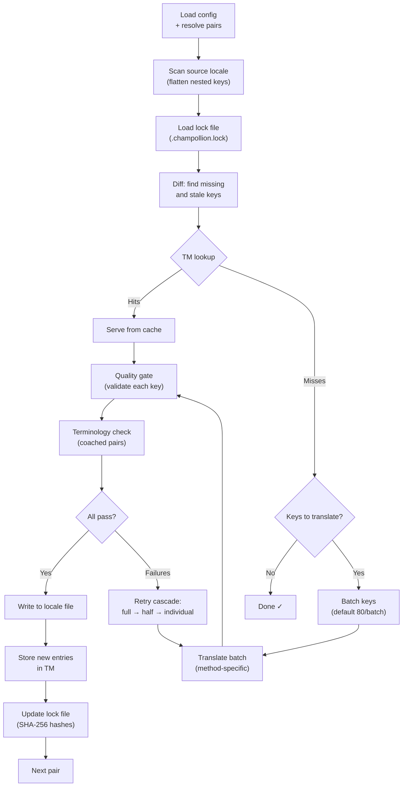

# Cơ chế hoạt động của Sync

Lệnh `sync` là hoạt động cốt lõi của Champollion. Dưới đây là những gì xảy ra khi bạn chạy `npx champollion sync`.

## Tổng quan về Pipeline



## Các bước thực hiện

### 1. Phân giải cấu hình

Champollion tải `champollion.config.json` (hoặc tự động phát hiện các thiết lập). Nó sẽ phân giải:
- Locale nguồn và các locale đích
- Đồ thị cặp (các tổ hợp nguồn→đích cần xử lý)
- Các thiết lập về phương thức, mô hình và chất lượng cho từng cặp

Trước khi quét các tệp, Champollion sẽ in ra một tiêu đề khởi động:

```
champollion v0.1.0

[INFO] Detected format: json (auto)
[INFO] Detected framework: Hugo
```

- **Banner phiên bản**: Hiển thị phiên bản đã cài đặt để phục vụ việc gỡ lỗi và báo cáo lỗi.
- **Phát hiện định dạng**: Báo cáo định dạng tệp và cho biết định dạng đó được tự động phát hiện `(auto)` hay được cấu hình rõ ràng `(config)`. Hỗ trợ `json`, `toml`, và `yaml`.
- **Phát hiện framework**: Khi `contentDir` được thiết lập, xác định framework (`Hugo`) để xác nhận tính năng đồng bộ nội dung đang hoạt động.

### 2. Quét nguồn

Tệp locale nguồn được tải và chuyển đổi thành một bản đồ phẳng (flattened) dạng key→value:

```json
// Input (nested)
{ "hero": { "title": "Welcome", "subtitle": "Build" } }

// Flattened
{ "hero.title": "Welcome", "hero.subtitle": "Build" }
```

### 3. Phát hiện thay đổi

Champollion đọc `.champollion.lock`, nơi lưu trữ các mã băm SHA-256 của các giá trị nguồn đã được dịch trước đó. Đối với mỗi key, nó sẽ kiểm tra:

| Điều kiện | Hành động |
|-----------|--------|
| Thiếu key ở locale đích | **Dịch** |
| Mã băm nguồn đã thay đổi kể từ lần đồng bộ trước | **Dịch lại** (hết hạn) |
| Giá trị đích bắt đầu bằng `[EN]` | **Dịch lại** (nhãn fallback cũ) |
| Mã băm nguồn không đổi, key đã tồn tại | **Bỏ qua** |

Đây là lý do tại sao Champollion chỉ dịch những gì thay đổi — nó không dịch lại toàn bộ tệp của bạn trong mỗi lần đồng bộ.

### 4. Gom nhóm (Batching)

Các key được gom nhóm thành các lô (mặc định: 80 keys/lô đối với LLM, 128 đối với Google Translate). Việc gom nhóm giúp giảm số lượng yêu cầu API (round trips) trong khi vẫn giữ cho các prompt ở mức dễ quản lý.

Trong quá trình dịch, Champollion hiển thị một thanh tiến trình nội dòng (inline progress bar) được cập nhật sau khi mỗi lô hoàn thành:

```
[INFO] fr.json — 2,847 missing
     ████████████████░░░░░░░░░░░░░░░░ 1,440/2,847 keys
```

Thanh tiến trình được hiển thị bằng cách sử dụng ký tự về đầu dòng (carriage return) `\r` để cập nhật tại chỗ — không bị cuộn màn hình. Tính năng này bị tắt trong các chế độ `--quiet` và `--json`.

### 4b. Bộ nhớ dịch thuật (Translation Memory)

Trước khi gom nhóm, Champollion sẽ kiểm tra bộ nhớ đệm của Bộ nhớ dịch thuật (`.champollion/tm.json`). Các key có văn bản nguồn + locale + phương thức khớp với bản dịch trước đó sẽ được trả về ngay lập tức từ bộ nhớ đệm — không cần gọi API.

```
  [TM] 142 key(s) served from cache
  Translating 3 key(s) to French (llm)... [OK]
```

TM là cơ chế tiết kiệm chi phí chính. Việc chạy lại lệnh sync sau khi thay đổi một key duy nhất sẽ chỉ dịch đúng key đó chứ không dịch lại toàn bộ tệp. Xem [Bộ nhớ dịch thuật](/docs/concepts/translation-memory) để biết thêm chi tiết.

Để bỏ qua bộ nhớ đệm trong một lần chạy duy nhất: `champollion sync --no-tm`

### 5. Dịch thuật

Mỗi lô được gửi đến phương thức dịch đã được cấu hình:

- **`llm`**: Prompt có cấu trúc gửi đến OpenRouter kèm theo các hướng dẫn về văn phong (register) và giới tính (gender guidance)
- **`llm-coached`**: Tương tự, nhưng được chèn thêm các quy tắc ngữ pháp, từ điển và ghi chú phong cách
- **`google-translate`**: Yêu cầu dịch hàng loạt (batch request) qua Google Cloud Translation API v2
- **`api`**: Gửi yêu cầu HTTP POST đến một endpoint từ xa

Thông điệp hệ thống (văn phong, hướng dẫn giới tính, quy tắc) là giống nhau giữa các lô đối với một locale nhất định, cho phép **prompt caching** — các nhà cung cấp như Anthropic và Google sẽ lưu bộ nhớ đệm cho các thông điệp hệ thống lặp lại, giúp giảm chi phí token.

### 6. Cổng kiểm soát chất lượng (Quality Gate)

Mọi bản dịch đều được xác thực trước khi ghi vào đĩa. Năm bước kiểm tra sẽ được thực hiện:

| Kiểm tra | Lỗi phát hiện | Ví dụ |
|-------|----------------|---------|
| **Trống/rỗng** | Mô hình không trả về kết quả | `""` |
| **Lặp lại nguồn** | Mô hình trả về nguyên văn đầu vào tiếng Anh | `"Welcome"` cho tiếng Nhật |
| **Vòng lặp ảo tưởng** | Các trigram lặp đi lặp lại | `"Qo' Qo' Qo' Qo'"` |
| **Phình to độ dài** | Kết quả đầu ra dài gấp 4 lần trở lên so với nguồn | Nguồn 10 ký tự → Đầu ra 50 ký tự |
| **Tuân thủ hệ chữ viết** | Sai hệ chữ viết cho locale đó | Chữ Latin cho locale tiếng Ả Rập |

Các lỗi thất bại được ghi log với tiền tố `[GATE]`. Không có cơ chế tự động bỏ qua trong im lặng (silent fallback).

Xem [Cổng kiểm soát chất lượng](/docs/concepts/quality-gate) để biết thêm chi tiết.

### 6b. Xác minh thuật ngữ

Đối với các cặp ngôn ngữ có hướng dẫn (coached pairs) kèm từ điển, Champollion sẽ kiểm tra xem LLM có thực sự sử dụng thuật ngữ bắt buộc sau khi dịch hay không. Các trường hợp vi phạm sẽ được ghi log dưới dạng cảnh báo `[TERM]`:

```
[TERM] en→fr: 2 term violation(s)
  • "dashboard" → expected "tableau de bord" but got "panneau"
```

Đây chỉ là các cảnh báo, không phải lỗi chặn (blocking errors) — bản dịch vẫn sẽ được ghi.

### 7. Thử lại phân tầng (Retry Cascade)

Khi xảy ra lỗi phân tích cú pháp JSON hoặc lỗi ở cấp độ lô, Champollion sẽ thử lại với các lô nhỏ dần:

```
Full batch (80 keys) → Failed
  └→ Half batch (40 keys) → 1 failure
      └→ Individual keys (1 each) → Isolates the problem key
```

Giới hạn số lần thử lại được kiểm soát bởi `maxRetries` (mặc định: 3) để ngăn chặn việc tiêu tốn token ngoài tầm kiểm soát.

### 8. Ghi & Khóa (Write & Lock)

Các bản dịch đạt yêu cầu sẽ được ghi vào tệp locale đích, bảo toàn cấu trúc lồng nhau ban đầu. Tệp khóa (lock file) sẽ được cập nhật với các mã băm SHA-256 mới.

### 9. Xác minh

Sau khi tất cả các cặp được xử lý, Champollion sẽ đọc lại các tệp locale đã ghi từ đĩa và chạy một lượt xác minh (trừ khi `--no-verify` được thiết lập). Việc này giúp phát hiện khoảng cách giữa việc lệnh sync báo cáo thành công và việc các key thực tế bị sai:

- **Sự tương đồng về key (Key parity)** — tất cả các key nguồn đều có mặt trong mỗi locale đích
- **Các nhãn fallback `[EN]`** — các nhãn cũ từ những lần chạy trước
- **Bản dịch trống** — các giá trị trống bị lọt qua
- **Tuân thủ hệ chữ viết** — các locale không dùng chữ Latin nhưng lại có bản dịch chỉ chứa ký tự ASCII
- **Bảo toàn trình giữ chỗ (Placeholder)** — các trình giữ chỗ ICU khớp với nguồn
- **Vấn đề mã hóa** — các nhãn BOM, ký tự ẩn

Tính năng này cũng khả dụng dưới dạng một lệnh `champollion verify` độc lập cho các cổng CI (CI gates).

## Dịch thuật nội dung (Giai đoạn 2)

Đối với các dự án Docusaurus và Hugo, `sync` sẽ chạy giai đoạn thứ hai sau khi dịch các key JSON. Giai đoạn này dịch các tệp Markdown và MDX (tài liệu, bài viết blog, hướng dẫn) bằng cách sử dụng cùng các phương thức và cổng kiểm soát chất lượng.

### Cách thức hoạt động

1. Champollion tìm kiếm tất cả các tệp nội dung nguồn (`.md`, `.mdx`) bằng cách duyệt qua thư mục content/docs
2. Đối với mỗi cặp tệp × locale, nó sẽ kiểm tra một tệp khóa nội dung riêng biệt (`.champollion-content.lock`) để xem có sự thay đổi mã băm SHA-256 hay không
3. Các tệp bị thay đổi hoặc bị thiếu sẽ được thu thập vào một nhóm công việc phẳng (flat work-item pool)
4. Nhóm công việc này được xử lý với **khả năng đồng thời song song** (mặc định: 12 cuộc gọi API đồng thời)

```
Phase 2: content (79 translations to process, 341 skipped, concurrency: 48)

    [1/79] (1%)  docs/concepts/security.md → ja [RE-TRANSLATE] (~3328s left)
    [2/79] (3%)  docs/concepts/security.md → th [RE-TRANSLATE] (~1821s left)
    ...
    [79/79] (100%) blog/v3-2-quality.md → de [OK]

  [OK] Created 79 content file(s), 341 unchanged
```

### Tính song song (Parallelism)

Cả Giai đoạn 1 (các key JSON) và Giai đoạn 2 (nội dung) hiện đều chạy song song:

- **Giai đoạn 1**: Tất cả các bản dịch locale được kích hoạt đồng thời (mặc định: 50 locale đồng thời). Trong mỗi locale, các lô API cũng chạy song song (4 lô đồng thời). Quá trình đồng bộ 12 locale với 120 key hoàn thành trong khoảng ~1 phút thay vì ~15 phút.
- **Giai đoạn 2**: Tất cả các tổ hợp tệp×locale được dịch dưới dạng một nhóm phẳng (mặc định: 12 cuộc gọi API đồng thời). Các tệp khác nhau và các locale khác nhau được dịch đồng thời.

Kiểm soát tính song song bằng `--json-concurrency`, `--content-concurrency`, hoặc `--concurrency` (thiết lập cả hai):

```bash
# Faster JSON sync (more parallel locale translations)
npx champollion sync --json-concurrency 30

# Faster content sync (more parallel API calls)
npx champollion sync --content-concurrency 20

# Slower (gentler on rate limits)
npx champollion sync --concurrency 4
```

### Bảo vệ nội dung

Trong quá trình dịch, Champollion sẽ bảo vệ các nội dung không thể dịch:

- **Các khối mã (Code blocks)** (dạng rào chắn và thụt lề) được thay thế bằng các trình giữ chỗ (placeholders)
- Các trường **Frontmatter** không nằm trong danh sách `translatableFields` được giữ nguyên trạng
- **Các liên kết (Links)**, đường dẫn hình ảnh và các thẻ HTML được bảo vệ
- **Shortcodes** và các biến nội suy (ví dụ: `{count}`, `{{.Params.title}}`) được che chắn

Sau khi dịch, tất cả các trình giữ chỗ sẽ được khôi phục và xác thực. Nếu bất kỳ trình giữ chỗ nào bị thiếu hoặc bị hỏng, bản dịch sẽ bị từ chối và thực hiện lại.

## Thành công một phần

Một lô bị lỗi không làm chặn các lô còn lại. Nếu 9 trong số 10 lô thành công, 9 lô đó sẽ được ghi. Lô bị lỗi sẽ được ghi log và bạn có thể chạy lại `sync` để thử lại.

## Chạy thử (Dry Run)

Xem trước những gì sẽ thay đổi mà không cần ghi bất kỳ tệp nào:

```bash
npx champollion sync --dry-run
```

## Bắt buộc dịch lại (Force Re-translate)

Bắt buộc các key cụ thể phải được dịch lại ngay cả khi không có thay đổi:

```bash
npx champollion sync --force-keys "hero.title,nav.about"
```

## Ước tính chi phí

Trước khi dịch, Champollion sẽ tạo một **báo cáo chi phí trước khi đồng bộ (pre-sync cost report)** hiển thị chi phí ước tính cho mỗi cặp. Báo cáo này tự động chạy trong mỗi lần `sync` — bạn sẽ thấy nó trước khi bất kỳ cuộc gọi API nào được thực hiện.

```
╔══════════════════════════════════════════════════════════╗
║  Cost Estimate                                          ║
╠════════════╦═══════╦════════════╦════════════════════════╣
║ Pair       ║ Keys  ║ Est. Cost  ║ Method                 ║
╠════════════╬═══════╬════════════╬════════════════════════╣
║ en → fr    ║   142 ║ $0.07      ║ google-translate       ║
║ en → ja    ║    38 ║   —        ║ llm (model-dependent)  ║
║ en → crk   ║    38 ║   —        ║ llm-coached            ║
╚════════════╩═══════╩════════════╩════════════════════════╝
```

### Những gì được ước tính

Mỗi phương thức dịch cung cấp ước tính chi phí riêng:

| Phương thức | Cơ sở tính chi phí | Độ chính xác |
|--------|-----------|-----------|
| `google-translate` | Mức giá công bố của Google ($20/triệu ký tự) | Chính xác |
| `llm` | Thay đổi tùy theo mô hình OpenRouter | Phụ thuộc vào mô hình — kiểm tra [bảng giá OpenRouter](https://openrouter.ai/models) |
| `llm-coached` | Tương tự như `llm` cộng với các token ngữ cảnh hướng dẫn (coaching context) | Phụ thuộc vào mô hình |
| `api` | Do máy chủ quyết định | Không xác định — không thể ước tính nếu không truy vấn endpoint |

Khi một phương thức không thể xác định chi phí (các phương thức LLM, API từ xa), Champollion sẽ báo cáo `—` thay vì tự đoán. Sử dụng `--dry` để xem ước tính chi phí mà không thực sự thực hiện dịch.

---

## Xem thêm

- [Tài liệu tham khảo CLI — sync](/docs/reference/cli#sync) — các cờ lệnh và tùy chọn
- [Bộ nhớ dịch thuật](/docs/concepts/translation-memory) — bộ nhớ đệm và tiết kiệm chi phí
- [Cổng kiểm soát chất lượng](/docs/concepts/quality-gate) — cách các bản dịch được xác thực
- [Phương thức dịch thuật](/docs/guides/translation-methods) — cách thức hoạt động của từng phương thức
- [Làm việc với biên dịch viên chuyên nghiệp](/docs/guides/professional-translators) — quy trình làm việc với XLIFF
- [Cấu hình](/docs/getting-started/configuration) — tài liệu tham khảo cấu hình
- [Hướng dẫn CI/CD](/docs/guides/ci-cd) — tự động hóa việc đồng bộ trong pipeline của bạn
