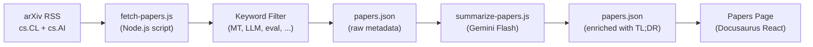

# Nguồn cấp Bài báo Nghiên cứu

Champollion duy trì một nguồn cấp được chọn lọc gồm các bài báo nghiên cứu về dịch máy và NLP từ arXiv, được lọc và tóm tắt dành cho những người thực hành. Nguồn cấp này hoạt động bán tự động: các bài báo được tải về và lọc hàng ngày, được tóm tắt bằng AI và xuất bản lên trang web.

## Lý do Tồn tại

Pipeline dịch thuật của Champollion được xây dựng dựa trên các kỹ thuật từ các nghiên cứu đã công bố — register-steered prompting, coaching data injection, context rollover, quality gates. Nguồn cấp Bài báo phục vụ ba mục đích:

1. **Tính minh bạch**: Người dùng có thể thấy nghiên cứu đứng sau hỗ trợ cho từng tính năng
2. **Khám phá**: Các kỹ thuật mới được công bố trên arXiv có thể gợi ý cho các tính năng tương lai hoặc cấu hình của người dùng
3. **Cộng đồng**: Định vị Champollion là một công cụ dựa trên nghiên cứu khoa học, chứ không chỉ là một trình bao bọc API (API wrapper) khác

## Kiến trúc



### Các bước trong Pipeline

#### 1. Tải về (Hàng ngày)

`scripts/fetch-papers.js` truy vấn arXiv Atom API để tìm các bài báo gần đây trong:
- `cs.CL` (Tính toán và Ngôn ngữ)
- `cs.AI` (Trí tuệ Nhân tạo)

Kết quả trả về: tiêu đề (title), tác giả (authors), tóm tắt (abstract), arXiv ID, liên kết PDF, ngày xuất bản, các danh mục (categories).

#### 2. Lọc

Các bài báo được lọc theo mức độ liên quan của từ khóa. Một bài báo phải khớp với ít nhất một từ khóa chính:

**Từ khóa chính** (phải khớp ≥1):
- `machine translation`, `neural machine translation`, `NMT`
- `LLM`, `large language model`
- `multilingual`, `cross-lingual`
- `document-level translation`
- `low-resource language`, `endangered language`
- `translation evaluation`, `BLEU`, `COMET`, `chrF`
- `tokenization`, `morphology`, `polysynthetic`
- `context window`, `sliding window`
- `prompt engineering` (trong ngữ cảnh dịch thuật)

**Từ khóa tăng cường** (tăng điểm liên quan):
- `i18n`, `internationalization`, `localization`
- `few-shot`, `in-context learning`
- `terminology`, `glossary`, `consistency`
- `quality estimation`, `hallucination`

#### 3. Tóm tắt (Hỗ trợ bởi AI)

`scripts/summarize-papers.js` xử lý các bài báo mới (chưa được tóm tắt):

Đối với mỗi bài báo, gửi bản tóm tắt (abstract) đến Gemini 3.5 Flash với:
```
Read this ML research abstract and produce:
1. A 2-sentence TL;DR accessible to a software developer (not a researcher)
2. A single bullet: "Why this matters for MT" — how could this technique
   improve machine translation quality, cost, or speed in production?

Abstract: {abstract}
```

Kết quả đầu ra được lưu lại vào `papers.json` cùng với siêu dữ liệu (metadata) thô.

#### 4. Xuất bản

Trang Bài báo của Docusaurus (`website/src/pages/papers.js`) hiển thị `papers.json` dưới dạng một lưới thẻ (card grid) có thể lọc và phân trang.

Mỗi thẻ hiển thị:
- **Tiêu đề** (liên kết đến arXiv)
- **Tác giả** (3 tác giả đầu tiên + "et al.")
- **Ngày** (ngày xuất bản hoặc cập nhật gần nhất)
- **TL;DR** (do AI tạo)
- **Lý do quan trọng** (do AI tạo)
- **Danh mục** (các thẻ arXiv)
- **Liên kết PDF**

### Tự động hóa

Một workflow GitHub Actions chạy pipeline này hàng ngày:

```yaml title=".github/workflows/fetch-papers.yml"
name: Fetch MT Research Papers
on:
  schedule:
    - cron: '0 6 * * *'  # 06:00 UTC daily
  workflow_dispatch: {}   # Manual trigger

jobs:
  fetch:
    runs-on: ubuntu-latest
    steps:
      - uses: actions/checkout@v4
      - uses: actions/setup-node@v4
        with:
          node-version: 20
      - run: node scripts/fetch-papers.js
      - run: node scripts/summarize-papers.js
        env:
          GEMINI_API_KEY: ${{ secrets.GEMINI_API_KEY }}
      - name: Commit if changed
        run: |
          git config user.name "github-actions[bot]"
          git config user.email "github-actions[bot]@users.noreply.github.com"
          git add website/src/data/papers.json
          git diff --cached --quiet || git commit -m "chore: update research papers feed"
          git push
```

## Sơ đồ Dữ liệu (Data Schema)

```typescript
interface Paper {
  id: string;           // arXiv ID (e.g., "2406.12345")
  title: string;
  authors: string[];
  abstract: string;
  published: string;    // ISO date
  updated: string;      // ISO date
  pdfUrl: string;
  categories: string[];
  primaryCategory: string;

  // Computed by filter
  relevanceScore: number;
  matchedKeywords: string[];

  // Computed by summarizer (null until processed)
  tldr: string | null;
  whyItMatters: string | null;
  summarizedAt: string | null;
}
```

## Vị trí Tệp

| Tệp | Mục đích |
|------|---------|
| `scripts/fetch-papers.js` | Bộ tải RSS arXiv và bộ lọc từ khóa |
| `scripts/summarize-papers.js` | Tóm tắt bằng AI qua Gemini |
| `website/src/data/papers.json` | Dữ liệu bài báo (được commit vào repo) |
| `website/src/pages/papers.js` | Component trang Docusaurus |
| `website/src/pages/papers.module.css` | Style của trang |
| `.github/workflows/fetch-papers.yml` | Tự động hóa hàng ngày |

## Trạng thái Triển khai

| Tính năng | Trạng thái |
|---------|--------|
| `fetch-papers.js` (tải arXiv + lọc) | 🔲 Đã lên kế hoạch |
| `summarize-papers.js` (tóm tắt bằng AI) | 🔲 Đã lên kế hoạch |
| Trang Bài báo (React component) | 🔲 Đã lên kế hoạch |
| Workflow GitHub Actions | 🔲 Đã lên kế hoạch |
| Lọc theo danh mục/từ khóa trên trang | 🔲 Đã lên kế hoạch |
| Phân trang | 🔲 Đã lên kế hoạch |

## Xem thêm

- [Kiến trúc](/docs/concepts/architecture) — cách các thành phần của Champollion liên kết với nhau
- [Chuyển tiếp ngữ cảnh (Context Rollover)](/docs/concepts/context-rollover) — một tính năng được gợi ý trực tiếp từ nguồn cấp nghiên cứu này
