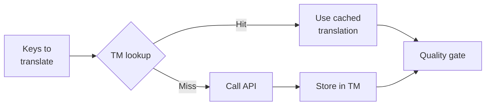

# Translation Memory

Translation Memory (TM) là lớp lưu trữ đệm (caching layer) được tích hợp sẵn của Champollion. Nó lưu trữ mọi bản dịch được định khóa bằng văn bản gốc + ngôn ngữ (locale) + phương thức dịch (method), nhờ đó việc chạy lại `sync` chỉ gọi API cho các khóa thực sự thay đổi.

## Tại sao cần có TM

Nếu không có TM, mỗi lần `sync` sẽ dịch lại mọi khóa bị thay đổi — ngay cả khi bạn đã dịch chính xác cùng một văn bản tiếng Anh đó cho cùng một ngôn ngữ ở lần chạy trước. Các kịch bản phổ biến gây lãng phí chi phí:

| Kịch bản | Khi không có TM | Khi có TM |
|----------|-----------|---------|
| Chạy lại sync sau khi thay đổi 1 khóa (500 khóa × 10 ngôn ngữ) | 5.000 lượt gọi API | 10 lượt gọi API |
| Khôi phục một khóa về giá trị tiếng Anh trước đó | Gọi API đầy đủ | Trùng khớp cache tức thì |
| Cùng một cụm từ xuất hiện trong 3 tệp ngôn ngữ | 3 × lượt gọi API | 1 lượt gọi API + 2 lần trùng khớp cache |
| Dry-run → sync thực tế | Gọi API đầy đủ cho cả hai | Lần chạy đầu tiên lưu cache, lần thứ hai tái sử dụng |

TM được **bật theo mặc định** và không yêu cầu cấu hình. Các bản dịch được tự động lưu vào cache trong mỗi lần `sync` và được cung cấp cho các lần chạy tiếp theo.

## Cách thức hoạt động

### Khóa Cache

Mỗi mục TM được định khóa bằng một mã băm SHA-256 của ba giá trị:

```
SHA-256( sourceValue + '\x00' + locale + '\x00' + method )
```

| Thành phần | Lý do nằm trong khóa |
|-----------|-------------------|
| `sourceValue` | Văn bản tiếng Anh khác nhau → bản dịch khác nhau |
| `locale` | "Hello" được dịch khác nhau sang tiếng Pháp so với tiếng Nhật |
| `method` | Kết quả của Google Translate ≠ kết quả của GPT-4o |

Ký tự phân tách byte rỗng (`\x00`) giúp ngăn chặn sự trùng lặp giữa `"ab" + "c"` và `"a" + "bc"`.

### Trong quá trình Sync



1. Trước khi gọi API dịch thuật, Champollion phân chia các khóa thành **TM hits** (trùng khớp TM) và **TM misses** (bỏ lỡ TM)
2. Các lượt trùng khớp (Hits) được cung cấp tức thì từ cache — không gọi API, không có độ trễ, không tốn chi phí
3. Các lượt bỏ lỡ (Misses) sẽ đi qua quy trình dịch thuật thông thường
4. Các bản dịch mới từ API được lưu trữ vào TM cho các lần chạy trong tương lai
5. Tất cả các bản dịch (được lưu trong cache + bản dịch mới) đều đi qua cổng kiểm định chất lượng (quality gate)

### Lưu trữ

TM được lưu trữ tại `.champollion/tm.json` trong thư mục gốc của dự án của bạn. Tệp này sử dụng định dạng JSON rút gọn (không định dạng đẹp) để giữ kích thước ở mức tối thiểu. Mỗi mục lưu trữ:

| Trường | Mô tả |
|-------|-------------|
| `t` | Văn bản đã được dịch |
| `ts` | Dấu thời gian ISO-8601 khi mục này được lưu vào cache |
| `l` | Mã ngôn ngữ đích (để thống kê/lọc) |
| `m` | Tên phương thức dịch (để thống kê/lọc) |

Với 50 ngôn ngữ × 500 khóa = 25.000 mục, kích thước tệp sẽ vào khoảng ~2-3 MB.

## Quản lý Cache

### Xem số liệu thống kê

```bash
champollion tm stats
```

Hiển thị số lượng mục, kích thước tệp và bảng phân tích chi tiết theo từng ngôn ngữ:

```
  Translation Memory — .champollion/tm.json

  Entries:      2,847
  File size:    1.2 MB
  Created:      2026-05-20
  Last entry:   2026-05-24

  By locale:
    fr       482 entries  (llm: 380, llm-coached: 102)
    de       471 entries  (llm: 471)
    ja       465 entries  (llm: 465)
```

### Xóa Cache

```bash
# Clear everything (with confirmation prompt)
champollion tm clear

# Clear without prompt (CI environments)
champollion tm clear --yes

# Clear only one locale
champollion tm clear --locale fr
```

### Bỏ qua TM trong một lần chạy

```bash
# Force fresh API calls for all keys (useful when switching providers)
champollion sync --no-tm
```

Thao tác này không xóa cache — nó chỉ bỏ qua cache trong lần chạy này và không lưu trữ các kết quả mới.

## Khi nào TM không có tác dụng

TM sẽ không tạo ra lượt trùng khớp cache khi:

- **Văn bản gốc thay đổi** — mã băm thay đổi, dẫn đến việc bỏ lỡ cache
- **Phương thức dịch thay đổi** — việc chuyển từ `llm` sang `google-translate` đồng nghĩa với việc các khóa cache sẽ khác nhau
- **Lần chạy đầu tiên** — khởi động nguội (cold start), chưa có mục nào được lưu
- **Cờ `--no-tm`** — bỏ qua cache một cách rõ ràng

## Bạn có nên commit `.champollion/tm.json` không?

**Thông thường là không.** TM là một tối ưu hóa cục bộ dành cho nhà phát triển. Nó được tự động điền dữ liệu trong quá trình đồng bộ hóa và chỉ có ích khi chạy lại quá trình đồng bộ hóa trên cùng một máy. Tuy nhiên, bạn có thể cân nhắc commit nó nếu:

- Đội ngũ của bạn chia sẻ một CI runner duy nhất để đồng bộ hóa các bản dịch
- Bạn muốn các bản build có thể tái lập mà không cần gọi API
- Bạn đang lưu trữ các bản dịch để phục vụ cho việc tuân thủ quy định

Thêm `.champollion/tm.json` vào `.gitignore` đối với cách sử dụng thông thường.

---

## Xem thêm

- [Cách thức hoạt động của Sync](/docs/concepts/how-sync-works) — vị trí của TM trong quy trình
- [Tài liệu tham khảo CLI — tm](/docs/reference/cli#tm) — tài liệu tham khảo lệnh
- [Tài liệu tham khảo CLI — sync --no-tm](/docs/reference/cli#sync) — bỏ qua TM
