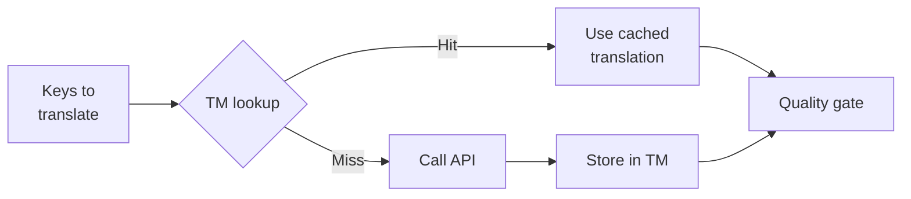

# Translation Memory

Translation Memory (TM) là lớp lưu trữ đệm (caching layer) được tích hợp sẵn của Champollion. Nó lưu trữ mọi bản dịch được định khóa bằng văn bản gốc + ngôn ngữ (locale) + phương thức dịch (method), nhờ đó việc chạy lại `sync` chỉ gọi API cho các khóa thực sự thay đổi.

## Tại sao cần có TM

Nếu không có TM, mỗi lần `sync` sẽ dịch lại mọi khóa bị thay đổi — ngay cả khi bạn đã dịch chính xác cùng một văn bản tiếng Anh đó cho cùng một ngôn ngữ ở lần chạy trước. Các kịch bản phổ biến gây lãng phí chi phí:

| Kịch bản | Khi không có TM | Khi có TM |
|----------|-----------|---------|
| Chạy lại sync sau khi thay đổi 1 khóa (500 khóa × 10 ngôn ngữ) | 5.000 lượt gọi API | 10 lượt gọi API |
| Khôi phục một khóa về giá trị tiếng Anh trước đó | Gọi API đầy đủ | Trùng khớp cache tức thì |
| Cùng một cụm từ xuất hiện trong 3 tệp ngôn ngữ | 3 × lượt gọi API | 1 lượt gọi API + 2 lần trùng khớp cache |
| Dry-run → sync thực tế | Gọi API đầy đủ cho cả hai | Lần chạy đầu tiên lưu cache, lần thứ hai tái sử dụng |

TM được **bật theo mặc định** và không yêu cầu cấu hình. Các bản dịch được tự động lưu vào cache trong mỗi lần `sync` và được cung cấp cho các lần chạy tiếp theo.

## Cách thức hoạt động

### Khóa Cache

Mỗi mục TM được định khóa bằng một mã băm SHA-256 của ba giá trị:

```
SHA-256( sourceValue + '\x00' + locale + '\x00' + method )
```

| Thành phần | Lý do nằm trong khóa |
|-----------|-------------------|
| `sourceValue` | Văn bản tiếng Anh khác nhau → bản dịch khác nhau |
| `locale` | "Hello" được dịch khác nhau sang tiếng Pháp so với tiếng Nhật |
| `method` | Kết quả của Google Translate ≠ kết quả của GPT-4o |

Ký tự phân tách byte rỗng (`\x00`) giúp ngăn chặn sự trùng lặp giữa `"ab" + "c"` và `"a" + "bc"`.

`sourceValue` là văn bản nguồn mà khóa được dịch từ đó, cùng với mọi yếu tố giúp phân biệt hai đoạn văn bản giống hệt nhau được kết hợp vào:

- **Ngữ cảnh gettext.** Mục có `msgctxt` được lưu vào cache cùng với ngữ cảnh của nó: "Open" dạng động từ và "Open" dạng tính từ là hai mục riêng biệt.
- **Các dạng số nhiều mà ngôn ngữ nguồn không có.** i18next lưu trữ số nhiều dưới dạng các khóa có hậu tố, và ngôn ngữ đích có thể có những dạng mà ngôn ngữ nguồn còn thiếu: tiếng Pháp và tiếng Tây Ban Nha thêm `count_many`, được dịch từ văn bản `count_other` trong tiếng Anh. Hai khóa gửi cùng một văn bản, nhưng mô hình được yêu cầu cung cấp các dạng khác nhau (`"2 recettes"` và `"1 000 000 de recettes"`), do đó mỗi dạng có mục riêng: `count_other` giữ mục cơ bản, còn `count_many` được lưu cache dưới văn bản cộng với dạng của nó. Điều tương tự cũng áp dụng cho mọi dạng được dịch từ văn bản của một phân loại khác (tiếng Ả Rập `_zero`, `_two`, `_few`, `_many`; tiếng Nga `_few`, `_many`; các dạng số thứ tự).
- **`msgid_plural` của gettext và số nhiều ARB / ICU** là một thông điệp trên mỗi khóa (mọi dạng nằm trong một giá trị), vì vậy chúng là một mục duy nhất, giống như trước đây.

Trước phiên bản 0.4.0, một dạng mượn dùng chung mục với dạng mà nó được dịch từ đó, và mục này giữ câu trả lời nào được lưu gần nhất, do đó `--redo all` có thể ghi cùng một dạng vào cả hai khóa. Cache từ thời điểm đó sẽ được sửa chữa khi sử dụng. Khi mục dùng chung chứa văn bản của dạng mượn, nó sẽ được chuyển sang mục riêng của dạng đó, và dạng còn lại sẽ được dịch lại vào lần tiếp theo được đưa vào hàng đợi. Nếu không, mục đó vẫn thuộc về dạng mà nó mượn, và dạng mượn sẽ được gửi tới mô hình một lần, vào lần đầu tiên nó được xếp vào hàng đợi (lần chạy sẽ thông báo điều này). `champollion verify` sẽ cảnh báo khi một dạng mượn chứa chính xác văn bản của dạng mà nó mượn và cache không cho thấy mô hình đã viết như vậy. Một số ngôn ngữ viết hai dạng giống hệt nhau, vì vậy đây chỉ là một cảnh báo; `--redo keys:<key>` sẽ yêu cầu dịch lại.

### Trong quá trình Sync


```mermaid
flowchart LR
    A["Keys to\ntranslate"] --> B{"TM lookup"}
    B -->|Hit| C["Use cached\ntranslation"]
    B -->|Miss| D["Call API"]
    D --> E["Store in TM"]
    C --> F["Quality gate"]
    E --> F
```

1. Trước khi gọi API dịch thuật, Champollion phân chia các khóa thành **TM hits** (trùng khớp TM) và **TM misses** (bỏ lỡ TM)
2. Các lượt trùng khớp (Hits) được cung cấp tức thì từ cache — không gọi API, không có độ trễ, không tốn chi phí
3. Các lượt bỏ lỡ (Misses) sẽ đi qua quy trình dịch thuật thông thường
4. Các bản dịch mới từ API được lưu trữ vào TM cho các lần chạy trong tương lai
5. Tất cả các bản dịch (được lưu trong cache + bản dịch mới) đều đi qua cổng kiểm định chất lượng (quality gate)

### Lưu trữ

TM được lưu trữ tại `.champollion/tm.json` trong thư mục gốc của dự án của bạn. Tệp này sử dụng định dạng JSON rút gọn (không định dạng đẹp) để giữ kích thước ở mức tối thiểu. Mỗi mục lưu trữ:

| Trường | Mô tả |
|-------|-------------|
| `t` | Văn bản đã được dịch |
| `ts` | Dấu thời gian ISO-8601 khi mục này được lưu vào cache |
| `l` | Mã ngôn ngữ đích (để thống kê/lọc) |
| `m` | Tên phương thức dịch (để thống kê/lọc) |

Với 50 ngôn ngữ × 500 khóa = 25.000 mục, kích thước tệp sẽ vào khoảng ~2-3 MB.

## Quản lý Cache

### Xem số liệu thống kê

```bash
champollion tm stats
```

Hiển thị số lượng mục, kích thước tệp và bảng phân tích chi tiết theo từng ngôn ngữ:

```
  Translation Memory — .champollion/tm.json

  Entries:      2,847
  File size:    1.2 MB
  Created:      2026-05-20 09:14 MDT
  Last entry:   2026-05-24 17:52 MDT

  By locale:
    fr       482 entries
               380  llm · model google/gemini-3.8-flash · register formal-vous
               102  llm-coached · model google/gemini-3.8-flash · register formal-vous · coaching 3f2a9c1b
    de       471 entries
               471  llm · model google/gemini-3.8-flash · register formal-Sie
    ja       465 entries
               465  llm · model google/gemini-3.8-flash · register polite
```

Các mốc thời gian hiển thị theo giờ địa phương của máy này, kèm theo tên múi giờ (`--json`
cũng chứa các dấu thời gian UTC đã lưu dưới dạng `createdAt` và `lastEntryAt`).
Mỗi dòng bên dưới một locale cho biết những gì đã tạo ra các mục đó: phương pháp, mô hình và
văn phong (cùng mã nhận dạng của văn bản chỉ dẫn, đối với mọi phương pháp có
prompt mang văn bản này: `llm`, `local`, `openai`, `anthropic`, `gemini`,
`llm-coached`; `coachingFile` riêng của cặp ngôn ngữ, của ngôn ngữ hoặc dự phòng sẽ được đọc
cho việc này, và nội dung văn bản chứ không phải đường dẫn của nó mới có giá trị). Việc xuất hiện hai
mô hình dưới một locale thường biểu thị việc chuyển đổi mô hình; `champollion status`
sẽ cho biết các tệp locale hiện có đang trộn lẫn văn bản từ cả hai mô hình hay không.

### Xóa Cache

```bash
# Clear everything (with confirmation prompt)
champollion tm clear

# Clear without prompt (CI environments)
champollion tm clear --yes

# Clear only one locale
champollion tm clear --locale fr
```

### Bỏ qua TM trong một lần chạy

```bash
# Fresh API calls for everything queued (useful when debugging quality)
champollion sync --redo all --fresh     # --fresh = --no-tm
```

Thao tác này không xóa cache và không đọc cache trong lần chạy này — nhưng những gì lần chạy này dịch (và phải trả phí) vẫn được lưu lại, do đó lần chạy tiếp theo sẽ lại được lưu cache.

## Chuyển đổi mô hình

**Cách chuyển đổi.** Mô hình là một cài đặt trong `champollion.config.json`: chỉnh sửa `"model"` (và `"defaultMethod"` khi phương pháp cũng thay đổi), hoặc `"model"` riêng của cặp ngôn ngữ trong `"pairs"`. Lệnh `champollion sync` tiếp theo sẽ sử dụng cài đặt này.

`sync --model <name>` (và `--method <name>`) chỉ định một mô hình **chỉ cho một lần chạy**: tệp không bị thay đổi, sync sẽ thông báo điều đó, và lệnh `sync` thông thường tiếp theo sẽ dùng lại mô hình đã cấu hình. Những gì lần chạy đó đã dịch vẫn nằm trong các tệp. Một lệnh sync thông thường sau đó sẽ cho biết những bản dịch nào do mô hình khác tạo ra, kèm theo cả hai hướng xử lý: giữ lại chúng bằng cách đặt mô hình đó làm mô hình được cấu hình (đặt `"model"` thành mô hình đó — không có gì được gửi đi), hoặc để mô hình đã cấu hình dịch lại chúng (lệnh redo mà nó in ra, kèm theo chi phí). `champollion status` cũng thông báo tương tự. Bạn không cần chạy lại `champollion init` để chuyển đổi; `init --force` chỉ ghi lại những gì các cờ của nó chỉ định, và giữ nguyên mọi cài đặt khác ([Tham chiếu CLI](/docs/reference/cli#init)).

Việc thay đổi mô hình không xóa bỏ cache của bạn. Khi một chuỗi chưa có mục nào dưới mô hình mới, sync sẽ tái sử dụng bản dịch được tạo từ mô hình trước đó, miễn là phương pháp, văn phong và chỉ dẫn không thay đổi. Các mục được tái sử dụng vẫn trải qua các bước kiểm tra chất lượng như bất kỳ lượt trúng cache (cache hit) nào khác. Trước phần ước tính chi phí, sync sẽ cho biết nó sẽ tái sử dụng bao nhiêu bản dịch và mô hình nào đã viết chúng — chế độ chạy thử (dry run) cũng vậy, và ngay cả sau khi quá trình chuyển đổi hoàn tất: một chuỗi được khôi phục về văn bản mà chỉ mô hình trước đó từng dịch sẽ được cung cấp bản dịch của mô hình đó, và lần chạy sẽ thông báo điều này trước phần ước tính.

Để yêu cầu mô hình mới dịch lại các chuỗi đó (lệnh này gửi các khóa mà mô hình
trước đó đã dịch; những gì mô hình mới đã dịch vẫn được lấy từ
cache):

```bash
champollion sync --redo all --fresh-on-model-change
```

Đứng độc lập, `--fresh-on-model-change` chỉ ảnh hưởng đến các khóa mà lần chạy dù sao cũng
sẽ dịch (các khóa mới hoặc đã thay đổi). Sau khi dịch lại toàn bộ, sync sẽ ngừng
thông báo về việc thay đổi mô hình cho ngôn ngữ đó. Các khóa mà câu trả lời của mô hình mới
bị thất bại sẽ được ghi nhận là **pending** (đang chờ) trong `.champollion.lock`: lệnh
`champollion sync` tiếp theo sẽ yêu cầu mô hình mới xử lý lại chúng (chứ không lấy từ cache), và
quá trình chuyển đổi sẽ hoàn tất khi chúng được xử lý xong. `champollion status` liệt kê các khóa
đang chờ và thông báo khi các tệp chứa văn bản từ mô hình trước đó — dù trộn lẫn với mô hình
hiện tại hay toàn bộ ([Quality Gate](/docs/concepts/quality-gate#a-redo-that-could-not-finish)).
Lệnh biết mô hình nào đã viết từng giá trị vì sync ghi lại điều đó trong
`.champollion.lock` (mô hình đã phản hồi, hoặc mô hình có bản dịch trong cache được
phục vụ). Đối với các giá trị được viết trước phiên bản 0.4.0, lệnh sẽ dùng lại
cache và báo "model unknown" (không rõ mô hình) khi hai mô hình cùng lưu cache một văn bản. Một lệnh
`champollion sync` thông thường không có gì để dịch sẽ thông báo, trên một dòng cho mỗi ngôn ngữ,
khi các tệp được viết bởi một mô hình khác với mô hình đã cấu hình, kèm theo lệnh
ở trên.
Một thao tác làm lại hàng loạt (bulk redo) không bao giờ thay thế bản dịch do con người chỉnh sửa trong tệp
([Chỉnh sửa bản dịch](/docs/guides/professional-translators#editing-key-value-files)).

Việc thay đổi phương pháp, văn phong hoặc chỉ dẫn vẫn tạo ra các bản dịch mới tinh, bởi các thay đổi này nhằm mục đích thu về văn bản khác. Khi các khóa được gửi tới mô hình mặc dù cache có lưu bản dịch của cùng văn bản đó được tạo theo cách khác (chẳng hạn sau khi chuyển đổi `local` → `llm`), sync sẽ thông báo điều này một lần cho mỗi ngôn ngữ, nêu rõ những gì đã tạo ra chúng — đó là lý do tại sao lần chạy hiển thị không có nội dung nào được phục vụ từ cache.

Bản thân việc thay đổi phương pháp, văn phong hoặc chỉ dẫn sẽ không tự động dịch lại bất cứ thứ gì: một lệnh sync thông thường (hoặc chạy thử) không có nội dung mới nào cần dịch sẽ giữ nguyên các tệp. Lệnh sẽ thông báo điều đó theo từng ngôn ngữ: có bao nhiêu giá trị được viết bởi phương pháp khác, lệnh redo để thay thế chúng (`champollion sync --pair en:fr --redo all`), và chi phí ước tính cho việc đó.

## Khi nào TM không có tác dụng

TM sẽ không tạo ra lượt trùng khớp cache khi:

- **Văn bản nguồn đã thay đổi** — giá trị băm (hash) thay đổi, nên đây là một lần trượt cache (cache miss)
- **Phương pháp đã thay đổi** — việc chuyển từ `llm` sang `google-translate` đồng nghĩa với các khóa cache khác nhau
- **Văn phong hoặc chỉ dẫn đã thay đổi** — khóa cache bao gồm cả chúng (nếu chỉ đổi riêng mô hình thì bản dịch vẫn được tái sử dụng; xem ở trên). Dự phòng của một cặp ngôn ngữ có khóa riêng (phương pháp, mô hình, văn phong, chỉ dẫn): sau khi thay đổi nó, `sync` và `status` sẽ liệt kê các giá trị mà thiết lập trước đó đã tạo và lệnh redo (`--redo all`; cùng `--fresh-on-model-change` nếu chỉ đổi riêng mô hình). Cache được ghi trước phiên bản 0.4.0 chỉ gắn khóa chỉ dẫn cho `llm-coached`; trong lần chạy đầu tiên, các mục được tạo bằng chỉ dẫn hiện có của cặp ngôn ngữ sẽ được giữ lại
- **Không thuộc khóa cache:** bảng thuật ngữ (glossary), cùng các quy tắc ngữ pháp và ghi chú phong cách của `llm-coached` — việc chỉnh sửa chúng không dịch lại bất kỳ nội dung nào đã lưu cache (`--redo keys:… --fresh` sẽ yêu cầu dịch lại)
- **`--retranslate <glob>`** — các tệp nội dung được chỉ định sẽ được dịch mới có chủ đích
- **Lần chạy đầu tiên** — khởi động nguội (cold start), chưa có mục nào
- **`--no-tm` / `--fresh`** — bỏ qua cache một cách rõ ràng
- **Khóa đang chờ (pending)** — khóa mà lệnh redo chưa hoàn thành sẽ được yêu cầu mô hình dịch lại, chứ không lấy từ cache

Cache không bao giờ quyết định việc một khóa có được *xếp vào hàng đợi* hay không: một khóa không đổi đã có bản dịch trong tệp sẽ bị bỏ qua trước bất kỳ thao tác tra cứu nào (nó không được tính là một lượt trúng cache). Và một khóa bị quality gate từ chối từ một mô hình sẽ không được gửi lại tới mô hình đó trong một lần sync thông thường — việc này sẽ chỉ làm phát sinh chi phí cho cùng một câu trả lời ([bị giữ lại](/docs/concepts/quality-gate#refused-keys-are-held-back)); cache vẫn được đọc đối với khóa này.

## Bạn có nên commit `.champollion/tm.json` không?

**Thông thường là không.** TM là một tối ưu hóa cục bộ dành cho nhà phát triển. Nó được tự động điền dữ liệu trong quá trình đồng bộ hóa và chỉ có ích khi chạy lại quá trình đồng bộ hóa trên cùng một máy. Tuy nhiên, bạn có thể cân nhắc commit nó nếu:

- Đội ngũ của bạn chia sẻ một CI runner duy nhất để đồng bộ hóa các bản dịch
- Bạn muốn các bản build có thể tái lập mà không cần gọi API
- Bạn đang lưu trữ các bản dịch để phục vụ cho việc tuân thủ quy định

Thêm `.champollion/tm.json` vào `.gitignore` đối với cách sử dụng thông thường.

---

## Xem thêm

- [Cách thức hoạt động của Sync](/docs/concepts/how-sync-works) — vị trí của TM trong quy trình
- [Tài liệu tham khảo CLI — tm](/docs/reference/cli#tm) — tài liệu tham khảo lệnh
- [Tài liệu tham khảo CLI — sync --no-tm](/docs/reference/cli#sync) — bỏ qua TM
