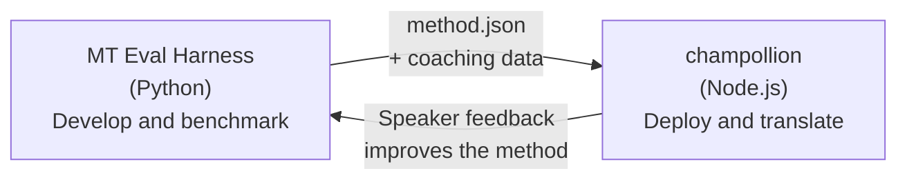

# Cầu nối Eval Harness

champollion và MT Eval Harness là hai công cụ riêng biệt tạo nên một hệ sinh thái thống nhất. Harness là nơi các phương pháp dịch thuật được **kiểm chứng**. Champollion là nơi các phương pháp đã được kiểm chứng được **triển khai**. Chúng kết nối với nhau thông qua một định dạng plugin chung.



## Quy trình: Nghiên cứu → Production

### 1. Xây dựng phương pháp trong harness

Bất kỳ class Python nào triển khai `async translate(entries, config) → [{id, predicted}]` đều có thể tích hợp vào harness. Harness không quan tâm đến những gì xảy ra bên trong — LLM được prompt, mô hình được huấn luyện tùy chỉnh, các quy tắc tất định (deterministic rules), hay bất kỳ thứ gì khác.

### 2. Đánh giá hiệu năng (Benchmark)

Harness sẽ chấm điểm phương pháp của bạn dựa trên một tập dữ liệu chuẩn (corpus) với các chỉ số có thể tái lập: chrF++, độ chấp nhận FST (đối với các ngôn ngữ phong phú về hình thái), độ chính xác hình thái học, và điểm số ngữ nghĩa.

### 3. Xuất bản dưới dạng plugin

Khi phương pháp của bạn đạt chất lượng chấp nhận được, hãy đóng gói nó thành một plugin champollion — một tệp manifest `method.json` đi kèm dữ liệu coaching tùy chọn.

:::info[CLI Export đang được lên kế hoạch]
Hiện tại, bạn tạo tệp manifest method.json một cách thủ công. Lệnh `mt-eval export` sẽ tự động hóa việc này. Xem [Giao diện Phương thức](/docs/network/specifications/methods) để biết định dạng plugin đầy đủ.
:::

### 4. Cài đặt trong champollion

```bash
champollion plugin install ./my-method-plugin/
```

### 5. Dịch nội dung thực tế

```bash
champollion sync
```

Phương pháp đã qua đo kiểm của bạn giờ đây đang tạo ra các bản dịch thực tế trên môi trường production.

## Quy trình: Production → Nghiên cứu

Các bản dịch đã triển khai sẽ được xem xét bởi những người nói song ngữ. Phản hồi của họ giúp xác định các lỗi mang tính hệ thống (sai cấu trúc thì, thiếu từ vựng, diễn đạt không tự nhiên). Nhà nghiên cứu sẽ cập nhật phương pháp trong harness, đánh giá lại (re-benchmark), xuất bản lại và tái triển khai. Hệ thống sẽ tự học hỏi từ quá trình sử dụng.

## Định dạng Plugin

Tệp manifest `method.json` là bản giao ước (contract) giữa hai công cụ:

```json
{
  "name": "crk-coached-v3",
  "type": "llm-coached",
  "version": "3.0.0",
  "description": "Coached LLM translation for Plains Cree",
  "locales": ["crk"],
  "config": {
    "model": "google/gemini-3.5-flash",
    "temperature": 0.3
  },
  "benchmarks": {
    "crk": {
      "composite_score": 0.67,
      "fst_acceptance": 0.82,
      "corpus_size": 150
    }
  }
}
```

Xem [Thông số kỹ thuật Plugin](/docs/reference/plugin-spec) để biết định dạng đầy đủ.

## Những gì đã hoàn thành so với Kế hoạch

| Thành phần | Trạng thái |
|-----------|--------|
| Giao thức TranslationMethod | ✅ Đã hoàn thành |
| Trình chạy benchmark của Harness | ✅ Đã hoàn thành |
| Định dạng plugin method.json | ✅ Đã hoàn thành |
| `champollion plugin install/remove/list` | ✅ Đã hoàn thành |
| Tải dữ liệu coaching | ✅ Đã hoàn thành |
| CLI `mt-eval export` | 🔲 Đang lên kế hoạch |
| Giao diện đánh giá cộng đồng | 🔲 Đang lên kế hoạch |
| Đánh giá tập kiểm thử bằng mật mã | 🔲 Đang lên kế hoạch |

## Đọc thêm

- [Các phương pháp dịch thuật](/docs/guides/translation-methods) — tất cả các phương pháp hiện có và cách chúng hoạt động
- [Đặc tả Plugin](/docs/reference/plugin-spec) — định dạng method.json
- [Cung cấp phương pháp qua API](/docs/guides/serving-a-method) — lưu trữ phương pháp ở phía máy chủ
- [Chủ quyền dữ liệu](/docs/network/sovereignty/data-sovereignty) — chủ quyền dữ liệu, CARE và bảo vệ bằng mật mã
- [Dành cho nhà nghiên cứu MT](/docs/network/leaderboard/rules) — tài liệu về eval harness
