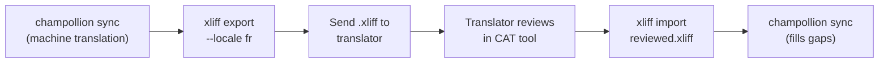

# Làm việc với Biên dịch viên Chuyên nghiệp

Champollion tạo ra các bản dịch máy, nhưng một số dự án cần có sự kiểm duyệt của con người — chẳng hạn như nội dung pháp lý, văn bản nhạy cảm với thương hiệu hoặc giao diện người dùng (UI) quan trọng. Quy trình làm việc với XLIFF cho phép bạn xuất các bản dịch để biên dịch viên chuyên nghiệp kiểm duyệt và nhập lại chúng một cách liền mạch.

## XLIFF là gì?

XLIFF (XML Localization Interchange File Format) là định dạng trao đổi tiêu chuẩn công nghiệp dành cho các công cụ dịch thuật. Mọi công cụ CAT (Computer-Assisted Translation - Dịch thuật có sự hỗ trợ của máy tính) chuyên nghiệp đều hỗ trợ định dạng này:

- **memoQ** — nhập XLIFF, kiểm duyệt theo ngữ cảnh, xuất tệp đã kiểm duyệt
- **SDL Trados Studio** — hỗ trợ XLIFF gốc
- **Phrase (Memsource)** — tải lên các công việc XLIFF cho đội ngũ biên dịch
- **Smartling** — quy trình tiếp nhận XLIFF
- **OmegaT** — công cụ CAT miễn phí/nguồn mở có hỗ trợ XLIFF

Champollion tạo ra XLIFF 1.2 (phiên bản được hỗ trợ rộng rãi nhất) thay vì 2.0+ để đảm bảo khả năng tương thích tối đa với các công cụ.

## Quy trình làm việc



### Bước 1: Tạo bản dịch máy

Chạy `sync` trước để có bản dịch máy cơ sở:

```bash
champollion sync
```

### Bước 2: Xuất XLIFF

Xuất cặp ngôn ngữ nguồn + đích dưới dạng XLIFF:

```bash
champollion xliff export --locale fr
```

Lệnh này sẽ ghi tệp `.champollion/xliff/fr.xliff` chứa:
- Mỗi khóa nguồn đi kèm với giá trị tiếng Anh tương ứng
- Bản dịch máy hiện tại (nếu có) dưới dạng `<target>`
- Các khóa chưa có bản dịch được đánh dấu là `state="new"`

```xml
<trans-unit id="hero.title" xml:space="preserve">
  <source>Welcome to our platform</source>
  <target state="translated">Bienvenue sur notre plateforme</target>
</trans-unit>
```

### Bước 3: Gửi cho Biên dịch viên

Gửi tệp `.xliff` cho biên dịch viên của bạn hoặc tải tệp lên nền tảng CAT. Biên dịch viên sẽ nhìn thấy ngôn ngữ nguồn và đích song song với nhau, và có thể:

- Chỉnh sửa bản dịch máy
- Điền các bản dịch còn thiếu
- Đánh dấu các vấn đề về chất lượng
- Áp dụng bộ nhớ dịch thuật (translation memory) và thuật ngữ (termbase) của riêng họ

### Bước 4: Nhập tệp đã kiểm duyệt

Khi biên dịch viên gửi lại tệp `.xliff` đã kiểm duyệt, hãy nhập tệp đó:

```bash
# Preview what will change
champollion xliff import .champollion/xliff/fr.xliff --dry

# Apply changes
champollion xliff import .champollion/xliff/fr.xliff
```

Kết quả đầu ra:
```
  ✓ Imported 142 translations for fr
    Updated:    23 (changed from existing)
    Added:      0 (new keys)
    Unchanged:  119
    Written to: locales/fr.json
```

### Bước 5: Điền các khoảng trống

Nếu các khóa mới được thêm vào sau khi xuất XLIFF, hãy chạy `sync` để dịch chúng:

```bash
champollion sync
```

Champollion chỉ dịch những khóa còn thiếu — các bản dịch đã được kiểm duyệt từ việc nhập XLIFF sẽ được giữ nguyên.

## Mẹo

### Xuất các đường dẫn tùy chỉnh

```bash
# Export to a specific directory
champollion xliff export --locale ja --out ./for-review/

# Export with a specific filename
champollion xliff export --locale de --out ./review/german.xliff
```

### Nhiều ngôn ngữ (Locales)

Xuất riêng từng ngôn ngữ:

```bash
for locale in fr de ja ko; do
  champollion xliff export --locale $locale
done
```

### Quản lý phiên bản (Version Control)

Thêm `.champollion/xliff/` vào `.gitignore` — các tệp XLIFF là các tệp tạm thời, không phải là mã nguồn của dự án:

```gitignore
.champollion/xliff/
```

### Khi nào nên dùng XLIFF so với chỉ dùng `sync`

| Kịch bản | Khuyến nghị |
|----------|---------------|
| Ứng dụng nội bộ, chất lượng trên 90% là chấp nhận được | Chỉ cần `sync` — dịch máy là đủ |
| Văn bản marketing hướng đến người dùng | Xuất XLIFF để con người kiểm duyệt |
| Nội dung pháp lý/quy định | Xuất XLIFF — bắt buộc phải có con người kiểm duyệt |
| Hơn 50 ngôn ngữ, thời hạn gấp | Chạy `sync` trước, chỉ xuất XLIFF cho 5 ngôn ngữ hàng đầu |
| Biên dịch viên đã sử dụng công cụ CAT | XLIFF là định dạng bàn giao tự nhiên nhất |

---

## Xem thêm

- [Tài liệu tham khảo CLI — xliff](/docs/reference/cli#xliff) — tài liệu tham khảo lệnh
- [Bộ nhớ dịch thuật (Translation Memory)](/docs/concepts/translation-memory) — lưu bộ nhớ đệm các bản dịch đã kiểm duyệt
- [Phương thức dịch thuật](/docs/guides/translation-methods) — các tùy chọn dịch máy
