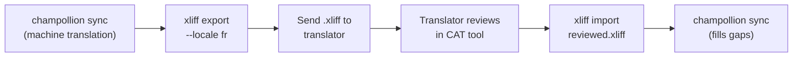

# Làm việc với Biên dịch viên Chuyên nghiệp

Champollion tạo ra các bản dịch máy, nhưng một số dự án cần có sự kiểm duyệt của con người — chẳng hạn như nội dung pháp lý, văn bản nhạy cảm với thương hiệu hoặc giao diện người dùng (UI) quan trọng. Quy trình làm việc với XLIFF cho phép bạn xuất các bản dịch để biên dịch viên chuyên nghiệp kiểm duyệt và nhập lại chúng một cách liền mạch.

XLIFF áp dụng cho các **tệp chuỗi** (khóa và giá trị) trong ứng dụng của bạn. **Markdown** đã dịch (bản tin, bài viết blog, trang tài liệu) được xét duyệt theo cách khác: người xét duyệt chỉnh sửa trực tiếp tệp `.md` đã dịch, và quá trình đồng bộ sẽ giữ lại những chỉnh sửa đó. Xem phần [Xét duyệt Markdown đã dịch](#reviewing-translated-markdown) bên dưới.

## XLIFF là gì?

XLIFF (XML Localization Interchange File Format) là định dạng trao đổi tiêu chuẩn công nghiệp dành cho các công cụ dịch thuật. Mọi công cụ CAT (Computer-Assisted Translation - Dịch thuật có sự hỗ trợ của máy tính) chuyên nghiệp đều hỗ trợ định dạng này:

- **memoQ** — nhập XLIFF, kiểm duyệt theo ngữ cảnh, xuất tệp đã kiểm duyệt
- **SDL Trados Studio** — hỗ trợ XLIFF gốc
- **Phrase (Memsource)** — tải lên các công việc XLIFF cho đội ngũ biên dịch
- **Smartling** — quy trình tiếp nhận XLIFF
- **OmegaT** — công cụ CAT miễn phí/nguồn mở có hỗ trợ XLIFF

Champollion tạo ra XLIFF 1.2 (phiên bản được hỗ trợ rộng rãi nhất) thay vì 2.0+ để đảm bảo khả năng tương thích tối đa với các công cụ.

## Quy trình làm việc


```mermaid
flowchart LR
    A["champollion sync\n(machine translation)"] --> B["xliff export\n--locale fr"]
    B --> C["Send .xliff to\ntranslator"]
    C --> D["Translator reviews\nin CAT tool"]
    D --> E["xliff import\nreviewed.xliff"]
    E --> F["champollion sync\n(fills gaps)"]
```

### Bước 1: Tạo bản dịch máy

Chạy `sync` trước để có bản dịch máy cơ sở:

```bash
champollion sync
```

### Bước 2: Xuất XLIFF

Xuất cặp ngôn ngữ nguồn + đích dưới dạng XLIFF:

```bash
champollion xliff export --locale fr
```

Lệnh này sẽ ghi tệp `.champollion/xliff/fr.xliff` chứa:
- Mỗi khóa nguồn đi kèm với giá trị tiếng Anh tương ứng
- Bản dịch máy hiện tại (nếu có) dưới dạng `<target>`
- Các khóa chưa có bản dịch được đánh dấu là `state="new"`

```xml
<trans-unit id="hero.title" xml:space="preserve">
  <source>Welcome to our platform</source>
  <target state="translated">Bienvenue sur notre plateforme</target>
</trans-unit>
```

### Bước 3: Gửi cho Biên dịch viên

Gửi tệp `.xliff` cho biên dịch viên của bạn hoặc tải tệp lên nền tảng CAT. Biên dịch viên sẽ nhìn thấy ngôn ngữ nguồn và đích song song với nhau, và có thể:

- Chỉnh sửa bản dịch máy
- Điền các bản dịch còn thiếu
- Đánh dấu các vấn đề về chất lượng
- Áp dụng bộ nhớ dịch thuật (translation memory) và thuật ngữ (termbase) của riêng họ

### Bước 4: Nhập tệp đã kiểm duyệt

Khi biên dịch viên gửi lại tệp `.xliff` đã kiểm duyệt, hãy nhập tệp đó:

```bash
# Preview what will change
champollion xliff import .champollion/xliff/fr.xliff --dry

# Apply changes
champollion xliff import .champollion/xliff/fr.xliff
```

Kết quả đầu ra:
```
  ✓ Imported 142 translations for fr
    Updated:    23 (changed from existing)
    Added:      0 (new keys)
    Unchanged:  119
    Written to: locales/fr.json
```

### Bước 5: Điền các khoảng trống

Nếu các khóa mới được thêm vào sau khi xuất XLIFF, hãy chạy `sync` để dịch chúng:

```bash
champollion sync
```

Champollion chỉ dịch những khóa còn thiếu — các bản dịch đã được kiểm duyệt từ việc nhập XLIFF sẽ được giữ nguyên.

## Mẹo

### Xuất các đường dẫn tùy chỉnh

```bash
# Export to a specific directory
champollion xliff export --locale ja --out ./for-review/

# Export with a specific filename
champollion xliff export --locale de --out ./review/german.xliff
```

### Nhiều ngôn ngữ (Locales)

Xuất riêng từng ngôn ngữ:

```bash
for locale in fr de ja ko; do
  champollion xliff export --locale $locale
done
```

### Quản lý phiên bản (Version Control)

Thêm `.champollion/xliff/` vào `.gitignore` — các tệp XLIFF là các tệp tạm thời, không phải là mã nguồn của dự án:

```gitignore
.champollion/xliff/
```

### Khi nào nên dùng XLIFF so với chỉ dùng `sync`

| Kịch bản | Khuyến nghị |
|----------|---------------|
| Ứng dụng nội bộ, chất lượng trên 90% là chấp nhận được | Chỉ cần `sync` — dịch máy là đủ |
| Văn bản marketing hướng đến người dùng | Xuất XLIFF để con người kiểm duyệt |
| Nội dung pháp lý/quy định | Xuất XLIFF — bắt buộc phải có con người kiểm duyệt |
| Hơn 50 ngôn ngữ, thời hạn gấp | Chạy `sync` trước, chỉ xuất XLIFF cho 5 ngôn ngữ hàng đầu |
| Biên dịch viên đã sử dụng công cụ CAT | XLIFF là định dạng bàn giao tự nhiên nhất |

## Chỉnh sửa bản dịch trong các tệp ngôn ngữ {#editing-key-value-files}

Người xét duyệt cũng có thể sửa bản dịch trực tiếp trong tệp ngôn ngữ (`messages/fr.json`, `locale/fr/LC_MESSAGES/django.po`, `app_fr.arb`, …) và commit thay đổi đó. Champollion ghi lại vào `.champollion.lock` một mã định danh (fingerprint) cho mỗi giá trị mà nó ghi. Giá trị không còn khớp nữa tức là đã được một người chỉnh sửa, và quá trình đồng bộ sẽ coi đó là nội dung của họ:

| Lệnh chạy | Điều gì xảy ra với giá trị đã chỉnh sửa |
|-----------|----------------------------------|
| Lệnh `sync` thông thường, nguồn tiếng Anh không đổi | Giữ nguyên (như trước). |
| `sync --redo all` / `--force`, chuyển đổi mô hình (`--redo all --fresh-on-model-change`), hoặc thử lại các khóa mà thao tác làm lại trước đó đang để chờ | **Được giữ lại.** Lượt chạy sẽ thông báo số lượng và danh sách khóa được giữ lại, cũng như cách thay thế một khóa: `--redo keys:<key>`. |
| `sync --redo keys:<key>` chỉ định đích danh khóa đó | Bị thay thế — vì bạn đã yêu cầu đích danh khóa đó. Cách diễn đạt đã chỉnh sửa sẽ được in ra trước. |
| **Nguồn tiếng Anh của khóa đó thay đổi** | Được dịch lại (bản chỉnh sửa vốn dành cho văn bản cũ). Cách diễn đạt đã chỉnh sửa sẽ được in ra để bạn có thể áp dụng lại, và được nối vào `.champollion-replaced-edits.jsonl` ở thư mục gốc của dự án. |

`.champollion-replaced-edits.jsonl` là một tệp được theo dõi nằm cạnh tệp lock (thư mục bộ nhớ đệm `.champollion/` hoạt động theo từng máy và được git bỏ qua): mỗi dòng JSON tương ứng với một chỉnh sửa bị thay thế, chứa thông tin về ngôn ngữ, tệp, khóa, cách diễn đạt đã chỉnh sửa, lý do bị thay thế và văn bản nguồn mới. Hãy commit tệp này cùng với tệp lock — đây là bản sao duy nhất của cách diễn đạt đó. `champollion status` sẽ cho biết tệp đang chứa bao nhiêu mục.

Các giá trị được ghi trước khi bản ghi này tồn tại, hoặc do một công cụ khác tạo ra, sẽ không có fingerprint. Một giá trị như vậy chỉ được tính là của Champollion khi bộ nhớ đệm dịch thuật lưu chính xác văn bản đó cho khóa tương ứng; nếu không, nó sẽ được coi là của con người và được giữ lại trong các lần làm lại hàng loạt (lượt chạy sẽ liệt kê chúng là các giá trị không có bản ghi đã ghi). Các giá trị được nhập bằng `champollion xliff import` là công sức của con người và cũng được giữ lại theo cách tương tự.

## Xét duyệt Markdown đã dịch {#reviewing-translated-markdown}

Các tệp nội dung từ một `contentDir` (ví dụ `newsletters/2026-10.md` → `newsletters/2026-10.crk.md`) không hỗ trợ xuất XLIFF. Người xét duyệt sẽ làm việc trực tiếp trên chính tệp đã dịch:

1. Chạy `champollion sync` và commit các bản dịch cùng với `.champollion-content.lock`.
2. Người xét duyệt chỉnh sửa tệp đã dịch, có thể là một đoạn văn hoặc một trường front-matter đã dịch như `title`, rồi commit thay đổi.
3. Trong các lần đồng bộ tiếp theo, các chỉnh sửa này sẽ được giữ lại. Nếu nguồn tiếng Anh thay đổi ở các đoạn văn khác, các đoạn văn của người xét duyệt vẫn được giữ nguyên từng từ và chỉ những đoạn văn có thay đổi mới được dịch lại. Lượt chạy sẽ in ra `kept the edits made by hand to …`.

Có hai trường hợp ngoại lệ, và quá trình đồng bộ sẽ cảnh báo về cả hai. Nếu đoạn văn tiếng Anh mà người xét duyệt đã sửa cũng thay đổi, đoạn văn đó sẽ được dịch lại và cách diễn đạt của người xét duyệt sẽ được in ra để có thể áp dụng lại. Nếu người xét duyệt đã thêm hoặc xóa các đoạn văn và sau đó nguồn thay đổi, tệp sẽ được giữ nguyên hiện trạng và được liệt kê trong mỗi lần đồng bộ cho đến khi có người cập nhật thủ công.

Để hủy bỏ các chỉnh sửa và quay lại bản dịch máy, hãy chỉ định tên tệp: `champollion sync --redo files:2026-10.md`. Toàn bộ quy tắc được nêu chi tiết trong [Dịch nội dung](/docs/guides/content-translation#reviewing-and-editing-translations).

---

## Xem thêm

- [Tài liệu tham khảo CLI — xliff](/docs/reference/cli#xliff) — tài liệu tham khảo về các lệnh
- [Bộ nhớ dịch thuật](/docs/concepts/translation-memory) — lưu bộ nhớ đệm các bản dịch đã được xét duyệt
- [Phương thức dịch thuật](/docs/guides/translation-methods) — các tùy chọn dịch máy
- [Dịch nội dung](/docs/guides/content-translation) — dịch Markdown và cách giữ lại các chỉnh sửa của người xét duyệt
- [Cổng kiểm soát chất lượng](/docs/concepts/quality-gate#refused-keys-are-held-back) — các khóa bị cổng từ chối và các khóa mà thao tác làm lại đang để chờ
