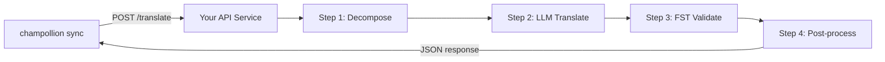

# Cung cấp Phương thức Tùy chỉnh dưới dạng API

Phương thức **`api`** của champollion cho phép bạn trỏ bất kỳ cặp dịch thuật nào đến một endpoint HTTP bên ngoài. Đây là cách bạn tích hợp các quy trình xử lý (pipeline) quá phức tạp đối với một prompt LLM đơn lẻ — chẳng hạn như các bộ phân tích hình thái học, bộ chuyển đổi trạng thái hữu hạn (FST), chuỗi LLM nhiều bước, hoặc bất kỳ phương thức nghiên cứu tùy chỉnh nào bạn đã xây dựng.

Có hai cách để thiết lập một endpoint như vậy:

1. **`champollion serve`** — một lệnh duy nhất để phục vụ stack đã được cấu hình của dự án champollion hiện tại của bạn (method, registers, coaching, Translation Memory, quality gate) đằng sau contract này. Không cần mã nguồn máy chủ. Xem [phương pháp không cần mã (zero-code)](#the-zero-code-path-champollion-serve).
2. **Một dịch vụ tùy chỉnh (custom service)** — tự viết máy chủ HTTP của riêng bạn triển khai contract này, dành cho các pipeline nằm hoàn toàn bên ngoài champollion.

## Tại sao nên dùng Dịch vụ API?

Một số quy trình dịch thuật không thể chạy trong một chu kỳ yêu cầu-phản hồi (prompt-response) đơn giản:

| Bước trong quy trình | Ví dụ |
|---|---|
| **Phân tích hình thái học** | Tách các từ đa tổng hợp thành các hình vị trước khi dịch |
| **Xác thực FST** | Từ chối các kết quả đầu ra vi phạm các quy tắc ngữ âm hoặc hình thái học |
| **Chuỗi LLM nhiều bước** | Các chu kỳ Tạo → Xác thực → Sửa lỗi với các mô hình khác nhau |
| **Tra cứu từ điển** | Tham chiếu chéo với một từ điển song ngữ được biên soạn kỹ lưỡng ở giữa quy trình |
| **Có sự tham gia của con người (Human-in-the-loop)** | Đưa các bản dịch chưa chắc chắn vào hàng đợi để chuyên gia xem xét |

Phương thức `api` coi quy trình của bạn như một hộp đen — champollion gửi các chuỗi nguồn, dịch vụ của bạn trả về các bản dịch. Những gì xảy ra bên trong hoàn toàn do bạn quyết định.

## Kiến trúc



## Phương pháp không cần mã (Zero-Code): `champollion serve`

Nếu pipeline của bạn đã là một dự án champollion — một method đã được cấu hình (LLM, coached, hoặc một engine), registers, các tệp coaching, Translation Memory, và quality gate tất định — bạn hoàn toàn không cần phải viết một máy chủ. `champollion serve` thiết lập **stack đã được cấu hình của riêng bạn** đằng sau chính xác contract được mô tả dưới đây:

```bash
# Owner side — run from the project whose champollion.config.json defines the stack
CHAMPOLLION_SERVE_TOKEN=$(openssl rand -hex 24) npx champollion serve
# [OK] champollion serve listening on http://127.0.0.1:1822/translate
```

Mọi yêu cầu đều chạy qua cùng một pipeline mà `champollion sync` sử dụng:

- **Translation Memory** — các chuỗi mà TM đã lưu giữ sẽ được phục vụ miễn phí từ bộ nhớ cache, mà không cần gọi đến nhà cung cấp upstream của bạn. Các kết quả API đã được xác thực qua gate sẽ được lưu vào cache cho yêu cầu tiếp theo.
- **Quality gate** — mọi phản hồi đều được xác thực một cách tất định (sự lặp lại, tỷ lệ độ dài, tuân thủ hệ thống chữ viết, lặp lại bản gốc). Các lỗi sẽ được trả về dưới dạng lỗi có cấu trúc theo từng khóa (HTTP 207/422) — không bao giờ là đầu ra bị suy giảm chất lượng một cách âm thầm.
- **Cost guard** — `--max-cost-per-request` và `--max-session-cost` từ chối các yêu cầu có chi phí upstream *ước tính* vượt quá giới hạn của bạn, trước khi bất kỳ lệnh gọi nhà cung cấp nào được thực hiện. Các method có mức giá không xác định cũng bị từ chối nếu có giới hạn: không xác định không có nghĩa là miễn phí. Các yêu cầu được TM bao phủ có chi phí xác định là $0 và luôn được thông qua.

Máy chủ liên kết với `127.0.0.1` theo mặc định: bất kỳ ai có thể truy cập cổng này đều có thể tiêu tốn ngân sách API upstream của bạn, vì vậy việc phơi bày nó là một quyết định rõ ràng — `--bind 0.0.0.0` cộng với một bearer token mạnh. `--no-auth` chỉ được chấp nhận cùng với một liên kết loopback. Giới hạn tốc độ (rate limit) theo IP và giới hạn kích thước yêu cầu được bật theo mặc định; xem `champollion serve --help`.

### Trỏ một Consumer vào đó

Xuất plugin manifest mà các consumer sẽ cài đặt (một lệnh ở mỗi bên):

```bash
# Owner side
champollion serve --emit-manifest --endpoint https://translate.example.org
# [OK] Wrote ./my-project-serve/method.json
```

```bash
# Consumer side
champollion plugin install ./my-project-serve
```

```json title="champollion.config.json (consumer)"
{
  "pairs": {
    "en:crk": { "methodPlugin": "my-project-serve" }
  }
}
```

```bash
CHAMPOLLION_API_KEY=<the server's bearer token> champollion sync
```

Method `api` của consumer sẽ POST các chuỗi nguồn đến máy chủ của bạn; stack của bạn sẽ dịch, kiểm tra qua gate và lưu cache; `qualityTier` của manifest là một sự chuyển tiếp trung thực các cặp ngôn ngữ đã cấu hình của bạn (mức độ bảo thủ nhất khi chúng khác nhau). Các prompt, dữ liệu coaching và khóa của nhà cung cấp của bạn không bao giờ rời khỏi máy của bạn.

Phần còn lại của hướng dẫn này đề cập đến việc viết một dịch vụ **tùy chỉnh (custom)** — hữu ích khi pipeline của bạn không phải là một dự án champollion (một chuỗi Python FST, một hệ thống nghiên cứu chuyên biệt). Wire contract là hoàn toàn giống nhau trong cả hai trường hợp.

## Thiết lập Dịch vụ của bạn

Dịch vụ API của bạn phải triển khai một endpoint duy nhất chấp nhận và trả về JSON:

### Định dạng Yêu cầu

Champollion gửi body JSON chính xác này (xem [api.js](https://github.com/gamedaysuits/Champollion/blob/main/cli/lib/methods/api.js)):

```json
POST /translate
Content-Type: application/json
Authorization: Bearer <CHAMPOLLION_API_KEY>

{
  "source_locale": "en",
  "target_locale": "crk",
  "method": "crk-coached-v1",
  "keys": {
    "greeting": "Hello, welcome to our app",
    "farewell": "Goodbye and thanks"
  }
}
```

| Trường | Kiểu | Mô tả |
|-------|------|-------------|
| `source_locale` | string | Mã ngôn ngữ nguồn BCP 47 |
| `target_locale` | string | Mã ngôn ngữ đích BCP 47 |
| `method` | string | Tên plugin hoặc `"default"` |
| `keys` | object | Bản đồ chứa key → chuỗi nguồn cần dịch |
```

### Response Format

Your service must return a `translations` object. An optional `meta` object can include cost and diagnostic info:

```json
{
  "translations": {
    "greeting": "tânisi, pê-kîwêw ôta",
    "farewell": "ekosi mâka, kinanâskomitin"
  },
  "meta": {
    "model": "my-custom-pipeline/v1",
    "cost_usd": 0.0042,
    "method": "decompose-translate-validate"
  }
}
```

| Field | Type | Required | Description |
|-------|------|----------|-------------|
| `translations` | object | ✅ | Map of key → translated string |
| `meta` | object | — | Optional metadata |
| `meta.cost_usd` | number | — | If present, displayed in champollion's output |
| `errors` | object | — | For partial success (HTTP 207): map of key → `{ message }` |

### Minimal Express Server

```javascript
import express from 'express';

const app = express();
app.use(express.json());

/**
 * Hợp đồng API champollion:
 *
 * Yêu cầu:  { source_locale, target_locale, method, keys: { "key": "source" } }
 * Phản hồi: { translations: { "key": "translated" }, meta: { ... } }
 */
app.post('/translate', async (req, res) => {
  const { source_locale, target_locale, method, keys } = req.body;

  const translations = {};

  for (const [key, source] of Object.entries(keys)) {
    // --- Quy trình của bạn ở đây ---
    // Bước 1: Phân tích hình thái học
    const morphemes = await decompose(source, source_locale);

    // Bước 2: Dịch bằng LLM kèm ngữ cảnh
    const draft = await llmTranslate(morphemes, target_locale);

    // Bước 3: Xác thực FST
    const validated = await fstValidate(draft, target_locale);

    // Bước 4: Hậu xử lý (chuẩn hóa chính tả, v.v.)
    translations[key] = await postProcess(validated);
  }

  res.json({
    translations,
    meta: {
      model: 'my-custom-pipeline/v1',
      method: 'decompose-translate-validate',
    },
  });
});

app.listen(3001, () => {
  console.log('Translation API running on http://localhost:3001');
});
```

## Configuring champollion

Point a translation pair at your running service in `champollion.config.json`:

```json
{
  "inputLocale": "en",
  "pairs": {
    "en:crk": {
      "method": "api",
      "endpoint": "http://localhost:3001/translate",
      "register": "Formal Plains Cree. Use SRO orthography."
    }
  }
}
```

Then run sync as usual:

```bash
npx champollion sync
```

champollion will POST your source strings to the endpoint and write the returned translations to `crk.json`.

## Case Study: Plains Cree Pipeline

:::info[Under Development]
The Plains Cree pipeline described below is **under active development** and is not yet running in production. Details here reflect the current design direction and may change as the project evolves.
:::

The **arena** project demonstrates this pattern. Its Plains Cree pipeline uses:

1. **Morphological decomposition** — Break polysynthetic Cree words into translatable morpheme chains
2. **LLM translation** — Context-enriched GPT-4o translation with coaching data (SRO orthography rules, register instructions)
3. **FST validation** — Finite-state transducer checks that outputs conform to Cree phonological rules
4. **Confidence scoring** — Each translation gets a confidence score based on FST pass rate and dictionary coverage

The entire pipeline runs as a single HTTP endpoint that champollion calls via the `api` method.

### Running Evaluations

After translating, you can evaluate output quality using the harness directly:

```bash
# Clone harness
git clone https://github.com/gamedaysuits/Champollion.git
cd Champollion/arena
pip install -e .

# Chạy đánh giá trên một ngữ liệu thực tế, không được đóng gói sẵn
mt-eval run --corpus eval-amh-fra-globalvoices-test-v1 --model gemini-pro --yes
```

This produces structured evaluation records with chrF++, BLEU, and exact match scores that can be used as regression baselines.

## Authentication

If your API requires authentication, set the `apiKey` field or use an environment variable:

```json
{
  "pairs": {
    "en:crk": {
      "method": "api",
      "endpoint": "https://my-mt-service.example.com/translate",
      "apiKey": "${CRK_API_KEY}"
    }
  }
}
```

## Data Sovereignty

The `api` method is particularly important for **Indigenous language communities**. By self-hosting the translation pipeline, a community keeps full control over:

- **Proprietary coaching data** — register instructions, orthography rules, and domain glossaries never leave community infrastructure.
- **Linguistic resources** — curated dictionaries, FST grammars, and elder-verified translations remain under community ownership.
- **Access policies** — the community decides who can call the endpoint and under what terms.

This design follows the direction of [Indigenous data-sovereignty principles](/docs/network/community/low-resource-languages#data-sovereignty-principles) — community ownership and control of language data: sensitive language data stays governed by the community rather than a third-party platform.

:::tip
Combine the `api` method with a private deployment (e.g., a community-hosted VM or on-prem server) for the strongest data-sovereignty posture. `champollion serve` gives a community exactly this self-hosting posture without writing any server code — coaching data, provider keys, and the Translation Memory all stay on community infrastructure. See [Support a Low-Resource Language](/docs/network/community/low-resource-languages) for a full walkthrough.
:::

## Cost Estimation

The `api` method returns `null` for cost estimation by default — your service controls pricing. If you want to provide cost transparency, have your API return a `cost` field in the metadata:

```json
{
  "translations": { "...": "..." },
  "metadata": {
    "cost": {
      "estimatedCost": 0.0042,
      "currency": "USD",
      "source": "my-service-pricing"
    }
  }
}
```

## Thực tiễn Tốt nhất

1. **Trả về chuỗi rỗng khi thất bại** — Đừng trả về chuỗi nguồn như một "bản dịch". Hãy trả về `""` và cổng kiểm soát chất lượng của champollion sẽ phát hiện ra. Khóa đó sẽ bị bỏ qua và thử lại trong lần đồng bộ tiếp theo.
2. **Bao gồm điểm số độ tin cậy** — Nếu quy trình của bạn có thể ước lượng chất lượng, hãy trả về giá trị đó trong metadata. Điều này giúp ích cho việc kiểm định chất lượng.
3. **Triển khai kiểm tra sức khỏe (health check)** — Thêm một endpoint `GET /health` để champollion có thể xác minh kết nối trước khi bắt đầu một đợt đồng bộ lớn.
4. **Giới hạn tốc độ (rate limit) một cách khéo léo** — Nếu quy trình của bạn có giới hạn về băng thông, hãy trả về mã trạng thái `429`. Hệ thống xử lý theo lô của champollion sẽ tự động giãn cách thời gian gửi lại.
5. **Ghi nhật ký (log) mọi thứ** — Các quy trình nhiều bước có thể thất bại trong im lặng. Hãy ghi nhật ký đầu vào/đầu ra của từng bước để phục vụ việc gỡ lỗi.

## Bản quyền

Mẫu phương thức `api` hoàn toàn mở — không có hạn chế về bản quyền đối với việc đóng gói quy trình dịch thuật của riêng bạn thành một dịch vụ HTTP. Bộ khung đánh giá `arena` được cấp phép theo AGPL-3.0-or-later (với ngoại lệ §7 eval-standard-plugin); bạn có thể nghiên cứu và xây dựng dựa trên đó theo các điều khoản này.

## Xem thêm

- [Translation Methods](/docs/guides/translation-methods) — tổng quan về mọi method được tích hợp sẵn (`openai`, `google`, `api`, v.v.)
- [Plugin Specification](/docs/reference/plugin-spec) — lược đồ đầy đủ cho `champollion.config.json` bao gồm các trường method `api`
- [Support a Low-Resource Language](/docs/network/community/low-resource-languages) — hướng dẫn toàn diện cho các ngôn ngữ ít tài nguyên, bao gồm các nguyên tắc chủ quyền dữ liệu
- [Architecture](/docs/concepts/architecture) — cách thức hoạt động của vòng lặp đồng bộ (sync loop), xử lý hàng loạt (batching) và điều phối method (method dispatch) của champollion
- [MT Evaluation](/docs/network/leaderboard/rules) — phương pháp đánh giá, các số liệu và quy trình gửi lên bảng xếp hạng (leaderboard)
- [Method Leaderboard](/leaderboard) — bảng xếp hạng chất lượng trực tiếp trên các method và các cặp ngôn ngữ

