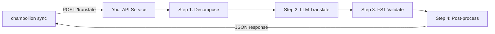

# Cung cấp Phương thức Tùy chỉnh dưới dạng API

Phương thức **`api`** của champollion cho phép bạn trỏ bất kỳ cặp dịch thuật nào đến một endpoint HTTP bên ngoài. Đây là cách bạn tích hợp các quy trình xử lý (pipeline) quá phức tạp đối với một prompt LLM đơn lẻ — chẳng hạn như các bộ phân tích hình thái học, bộ chuyển đổi trạng thái hữu hạn (FST), chuỗi LLM nhiều bước, hoặc bất kỳ phương thức nghiên cứu tùy chỉnh nào bạn đã xây dựng.

Có hai cách để thiết lập một endpoint như vậy:

1. **`champollion serve`** — một lệnh duy nhất để phục vụ stack đã cấu hình trong dự án champollion hiện tại của bạn (phương thức, văn phong, huấn luyện, Translation Memory, cổng chất lượng) đằng sau hợp đồng này. Không cần viết mã máy chủ. Xem [con đường không cần viết mã](#the-zero-code-path-champollion-serve).
2. **Một dịch vụ tùy chỉnh** — tự viết máy chủ HTTP của riêng bạn triển khai hợp đồng này, dành cho các pipeline hoàn toàn nằm ngoài champollion.

## Tại sao nên dùng Dịch vụ API?

Một số quy trình dịch thuật không thể chạy trong một chu kỳ yêu cầu-phản hồi (prompt-response) đơn giản:

| Bước trong quy trình | Ví dụ |
|---|---|
| **Phân tích hình thái học** | Tách các từ đa tổng hợp thành các hình vị trước khi dịch |
| **Xác thực FST** | Từ chối các kết quả đầu ra vi phạm các quy tắc ngữ âm hoặc hình thái học |
| **Chuỗi LLM nhiều bước** | Các chu kỳ Tạo → Xác thực → Sửa lỗi với các mô hình khác nhau |
| **Tra cứu từ điển** | Tham chiếu chéo với một từ điển song ngữ được biên soạn kỹ lưỡng ở giữa quy trình |
| **Có sự tham gia của con người (Human-in-the-loop)** | Đưa các bản dịch chưa chắc chắn vào hàng đợi để chuyên gia xem xét |

Phương thức `api` coi quy trình của bạn như một hộp đen — champollion gửi các chuỗi nguồn, dịch vụ của bạn trả về các bản dịch. Những gì xảy ra bên trong hoàn toàn do bạn quyết định.

## Kiến trúc


```mermaid
graph LR
    A[champollion sync] -->|POST /translate| B[Your API Service]
    B --> C[Step 1: Decompose]
    C --> D[Step 2: LLM Translate]
    D --> E[Step 3: FST Validate]
    E --> F[Step 4: Post-process]
    F -->|JSON response| A
```

## Con đường không cần viết mã: `champollion serve`

Nếu pipeline của bạn đã là một dự án champollion — một phương thức đã cấu hình (LLM, có huấn luyện, hoặc một engine), các văn phong, tệp huấn luyện, Translation Memory, và cổng chất lượng tất định — bạn hoàn toàn không cần viết máy chủ. `champollion serve` sẽ thiết lập **chính stack đã cấu hình của bạn** đằng sau đúng hợp đồng được mô tả dưới đây:

```bash
# Owner side — run from the project whose champollion.config.json defines the stack
CHAMPOLLION_SERVE_TOKEN=$(openssl rand -hex 24) npx champollion serve
# [OK] champollion serve listening on http://127.0.0.1:1822/translate
```

Mọi yêu cầu đều chạy qua cùng một pipeline mà `champollion sync` sử dụng:

- **Translation Memory** — các chuỗi mà TM đã lưu trữ sẽ được phân phát miễn phí từ bộ nhớ đệm mà không cần gọi đến nhà cung cấp thượng nguồn của bạn. Kết quả API đã được cổng kiểm định sẽ được lưu vào bộ nhớ đệm cho yêu cầu tiếp theo.
- **Cổng chất lượng** — mọi phản hồi đều được xác thực một cách tất định (lặp lại, tỷ lệ độ dài, tuân thủ hệ chữ viết, lặp lại chuỗi nguồn). Các lỗi thất bại được trả về dưới dạng lỗi có cấu trúc theo từng khóa (HTTP 207/422) — tuyệt đối không âm thầm trả về kết quả bị suy giảm chất lượng.
- **Bảo vệ chi phí** — `--max-cost-per-request` và `--max-session-cost` từ chối các yêu cầu có chi phí thượng nguồn *ước tính* vượt quá giới hạn tối đa của bạn, trước khi bất kỳ lệnh gọi nào đến nhà cung cấp được thực hiện. Các phương thức không rõ giá cước cũng bị từ chối nếu có đặt giới hạn: không rõ giá không có nghĩa là miễn phí. Các yêu cầu đã có trong TM có chi phí xác định là 0$ và luôn được thông qua.

Theo mặc định, máy chủ liên kết với `127.0.0.1`: bất kỳ ai có thể truy cập cổng này đều có thể tiêu hao ngân sách API thượng nguồn của bạn, vì vậy việc mở cổng ra bên ngoài phải là một quyết định rõ ràng — `--bind 0.0.0.0` kết hợp với một bearer token mạnh. `--no-auth` chỉ được chấp nhận khi đi cùng với một liên kết loopback. Giới hạn tốc độ theo IP và giới hạn kích thước yêu cầu được bật theo mặc định; xem `champollion serve --help`.

### Trỏ Consumer đến dịch vụ

Xuất tệp manifest của plugin mà các consumer sẽ cài đặt (một lệnh ở mỗi bên):

```bash
# Owner side
champollion serve --emit-manifest --endpoint https://translate.example.org
# [OK] Wrote ./my-project-serve/method.json
```

```bash
# Consumer side
champollion plugin install ./my-project-serve
```

```json title="champollion.config.json (consumer)"
{
  "pairs": {
    "en:crk": { "methodPlugin": "my-project-serve" }
  }
}
```

```bash
CHAMPOLLION_API_KEY=<the server's bearer token> champollion sync
```

Phương thức `api` của consumer sẽ gửi yêu cầu POST chứa các chuỗi nguồn đến máy chủ của bạn; stack của bạn sẽ dịch, kiểm định qua cổng và lưu vào bộ nhớ đệm; mục `qualityTier` trong manifest là bản chuyển tiếp trung thực của các cặp đã cấu hình của bạn (tầng bảo thủ nhất khi chúng khác nhau). Prompt, dữ liệu huấn luyện và khóa nhà cung cấp của bạn không bao giờ rời khỏi máy của bạn.

Phần còn lại của hướng dẫn này sẽ đề cập đến việc viết một dịch vụ **tùy chỉnh** — hữu ích khi pipeline của bạn không phải là một dự án champollion (một chuỗi Python FST, một hệ thống nghiên cứu chuyên biệt). Dù theo cách nào, hợp đồng truyền nhận qua mạng (wire contract) cũng hoàn toàn giống nhau.

## Thiết lập Dịch vụ của bạn

Dịch vụ API của bạn phải triển khai một endpoint duy nhất chấp nhận và trả về JSON:

### Định dạng Yêu cầu

Champollion gửi body JSON chính xác này (xem [api.js](https://github.com/gamedaysuits/Champollion/blob/main/cli/lib/methods/api.js)):

```json
POST /translate
Content-Type: application/json
Authorization: Bearer <CHAMPOLLION_API_KEY>

{
  "source_locale": "en",
  "target_locale": "crk",
  "method": "my-project-serve",
  "keys": {
    "greeting": "Hello, welcome to our app",
    "farewell": "Goodbye and thanks"
  }
}
```

| Trường | Kiểu | Mô tả |
|-------|------|-------------|
| `source_locale` | chuỗi | Mã ngôn ngữ nguồn BCP 47 |
| `target_locale` | chuỗi | Mã ngôn ngữ đích BCP 47 |
| `method` | chuỗi | Tên plugin hoặc `"default"` |
| `keys` | đối tượng | Bảng ánh xạ khóa → chuỗi nguồn cần dịch |
| `instructions` | đối tượng | Chỉ khi endpoint khai báo `"acceptsInstructions": true`: khóa → ghi chú theo từng khóa (các dạng số nhiều mà thông điệp cần, phản hồi thử lại của cổng chất lượng) |
| `text_format` | chuỗi | `"markdown"` đối với văn bản tài liệu Markdown (xem bên dưới); không có đối với chuỗi ứng dụng |

### Định dạng phản hồi

Dịch vụ của bạn phải trả về một đối tượng `translations`. Đối tượng `meta` tùy chọn có thể bao gồm chi phí và thông tin chẩn đoán:

```json
{
  "translations": {
    "greeting": "<the greeting, translated>",
    "farewell": "<the farewell, translated>"
  },
  "meta": {
    "model": "my-custom-pipeline/v1",
    "cost_usd": 0.0042,
    "method": "decompose-translate-validate"
  }
}
```

| Trường | Kiểu | Bắt buộc | Mô tả |
|-------|------|----------|-------------|
| `translations` | đối tượng | ✅ | Bảng ánh xạ khóa → chuỗi đã dịch |
| `meta` | đối tượng | — | Siêu dữ liệu tùy chọn |
| `meta.cost_usd` | số | — | Nếu có, sẽ được hiển thị trong kết quả đầu ra của champollion |
| `errors` | đối tượng | — | Đối với thành công một phần (HTTP 207): bảng ánh xạ khóa → `{ message }` |

### Máy chủ Express tối thiểu

```javascript
import express from 'express';

const app = express();
app.use(express.json());

/**
 * champollion API contract:
 *
 * Request:  { source_locale, target_locale, method, keys: { "key": "source" } }
 * Response: { translations: { "key": "translated" }, meta: { ... } }
 */
app.post('/translate', async (req, res) => {
  const { source_locale, target_locale, method, keys } = req.body;

  const translations = {};

  for (const [key, source] of Object.entries(keys)) {
    // --- Your pipeline goes here ---
    // Step 1: Morphological decomposition
    const morphemes = await decompose(source, source_locale);

    // Step 2: LLM translation with context
    const draft = await llmTranslate(morphemes, target_locale);

    // Step 3: FST validation
    const validated = await fstValidate(draft, target_locale);

    // Step 4: Post-processing (orthography normalization, etc.)
    translations[key] = await postProcess(validated);
  }

  res.json({
    translations,
    meta: {
      model: 'my-custom-pipeline/v1',
      method: 'decompose-translate-validate',
    },
  });
});

app.listen(3001, () => {
  console.log('Translation API running on http://localhost:3001');
});
```

## Cấu hình champollion

Trỏ một cặp dịch đến dịch vụ đang chạy của bạn trong `champollion.config.json`:

```json
{
  "inputLocale": "en",
  "pairs": {
    "en:crk": {
      "method": "api",
      "endpoint": "http://localhost:3001/translate",
      "register": "Formal Plains Cree. Use SRO orthography."
    }
  }
}
```

Sau đó chạy lệnh sync như thường lệ:

```bash
npx champollion sync
```

champollion sẽ gửi POST các chuỗi nguồn của bạn đến endpoint và ghi các bản dịch nhận được vào `crk.json`.

### Endpoint của bạn có tuân theo hướng dẫn không?

Khai báo điều này bằng `"acceptsInstructions"` trên cặp dịch (hoặc ở cấp cao nhất của `method.json` trong plugin):

- **`false`** — một mô hình NMT đã huấn luyện, chẳng hạn như mô hình được cung cấp bởi `nmt-forge serve`, chỉ dịch văn bản và không làm gì khác; hỏi hai lần nó sẽ trả lời như nhau. Khi cổng chất lượng từ chối một trong các câu trả lời của nó, champollion sẽ **không** hỏi lại (vì đó sẽ là lệnh gọi lãng phí); nó đánh giá câu trả lời đầu tiên như cách một câu trả lời thứ hai được đánh giá (tên riêng giữ nguyên như bản gốc được chấp nhận) và gửi phần còn lại đến `fallback` của cặp dịch.
- **`true`** — một LLM đằng sau endpoint của bạn có thể sử dụng các ghi chú theo từng khóa: các yêu cầu mang theo một đối tượng `instructions`, và một khóa bị từ chối sẽ được hỏi lại kèm theo phản hồi của cổng.
- **chưa thiết lập** — champollion không thể biết được. Một khóa bị từ chối sẽ được hỏi lại một lần nữa mà không có phản hồi, và quá trình chạy sẽ thông báo rằng endpoint có thể bỏ qua phản hồi đó.

```json
{
  "pairs": {
    "en:crk": {
      "method": "api",
      "endpoint": "http://127.0.0.1:8378/translate",
      "acceptsInstructions": false,
      "fallback": { "method": "llm-coached" }
    }
  }
}
```

Phương thức dự phòng ở đây là một mô hình được lưu trữ trên đám mây (hosted model). Để giữ mọi thứ trên máy này, hãy sử dụng `"fallback": { "method": "local", "model": "<your local model>" }` thay thế (xem [Phương thức dự phòng](/docs/getting-started/configuration#fallback) để biết khi nào nên dùng phương thức nào).

## Nghiên cứu tình huống: Pipeline tiếng Plains Cree

:::info[Đang trong quá trình phát triển]
Pipeline tiếng Plains Cree được mô tả dưới đây **đang được tích cực phát triển** và hiện chưa chạy trong môi trường production. Các chi tiết tại đây phản ánh định hướng thiết kế hiện tại và có thể thay đổi khi dự án phát triển tiếp.
:::

Dự án **arena** minh họa cho mô hình này. Pipeline tiếng Plains Cree của dự án sử dụng:

1. **Phân tích hình thái học** — Phân tách các từ đa tổng hợp (polysynthetic) của tiếng Cree thành chuỗi hình vị có thể dịch được
2. **Dịch bằng LLM** — Bản dịch GPT-4o được làm giàu ngữ cảnh với dữ liệu huấn luyện (các quy tắc chính tả SRO, hướng dẫn văn phong)
3. **Xác thực FST** — Bộ chuyển đổi trạng thái hữu hạn (FST) kiểm tra xem kết quả đầu ra có tuân thủ các quy tắc âm vị học tiếng Cree hay không
4. **Chấm điểm độ tin cậy** — Mỗi bản dịch nhận một điểm tin cậy dựa trên tỷ lệ vượt qua FST và độ bao phủ của từ điển

Toàn bộ pipeline chạy dưới dạng một endpoint HTTP duy nhất mà champollion gọi thông qua phương thức `api`.

### Chạy đánh giá

Sau khi dịch, bạn có thể đánh giá chất lượng đầu ra bằng cách sử dụng trực tiếp bộ khung đánh giá (harness):

```bash
# Clone the harness
git clone https://github.com/gamedaysuits/Champollion.git
cd Champollion/arena
python3 -m pip install -e .

# Run the evaluation against a real, non-bundled corpus
mt-eval run --corpus eval-amh-fra-globalvoices-test-v1 --model google/gemini-3.1-pro-preview --yes
```

Lệnh này tạo ra các bản ghi đánh giá có cấu trúc kèm theo điểm số chrF++, BLEU và khớp chính xác (exact match) có thể dùng làm mốc so chuẩn cho kiểm thử hồi quy (regression baseline).

## Xác thực

Nếu API của bạn yêu cầu xác thực, hãy đặt tên biến môi trường chứa
token của nó trên cặp dịch (`"${VAR}"`, được đọc từ môi trường hoặc `.env.local`),
hoặc đặt `CHAMPOLLION_API_KEY`. Champollion chỉ gửi duy nhất token đó đến
endpoint — không bao giờ gửi khóa của một nhà cung cấp khác. Một endpoint loopback (`nmt-forge
serve`, `champollion serve`) thì không cần token nào.

```json
{
  "pairs": {
    "en:crk": {
      "method": "api",
      "endpoint": "https://my-mt-service.example.com/translate",
      "apiKey": "${CRK_API_KEY}"
    }
  }
}
```

Nội dung (phần thân Markdown) tuân theo cùng một hợp đồng: mỗi khối là một khóa
(`segment.<N>`, hoặc `body` cho toàn bộ trang) và yêu cầu mang theo
`"text_format": "markdown"`, nhờ đó máy chủ có thể phân biệt văn bản tài liệu với các chuỗi ứng
dụng. Các máy chủ không nhận biết trường này có thể bỏ qua nó.

## Chủ quyền dữ liệu

Phương thức `api` đặc biệt quan trọng đối với **các cộng đồng ngôn ngữ bản địa**. Bằng cách tự lưu trữ (self-host) pipeline dịch thuật, một cộng đồng giữ quyền kiểm soát hoàn toàn đối với:

- **Dữ liệu huấn luyện độc quyền** — các hướng dẫn văn phong, quy tắc chính tả và bảng thuật ngữ chuyên ngành không bao giờ rời khỏi cơ sở hạ tầng của cộng đồng.
- **Tài nguyên ngôn ngữ** — các từ điển tuyển chọn, ngữ pháp FST và các bản dịch đã được người lớn tuổi/trưởng lão (elder) xác thực vẫn thuộc quyền sở hữu của cộng đồng.
- **Chính sách truy cập** — cộng đồng quyết định ai có thể gọi endpoint và theo những điều khoản nào.

Thiết kế này tuân theo định hướng của [các nguyên tắc chủ quyền dữ liệu bản địa](/docs/network/community/low-resource-languages#data-sovereignty-principles) — quyền sở hữu và kiểm soát của cộng đồng đối với dữ liệu ngôn ngữ: dữ liệu ngôn ngữ nhạy cảm luôn do cộng đồng quản trị thay vì một nền tảng bên thứ ba.

:::tip
Kết hợp phương thức `api` với việc triển khai riêng tư (ví dụ: máy ảo do cộng đồng tự lưu trữ hoặc máy chủ on-prem) để có vị thế chủ quyền dữ liệu mạnh mẽ nhất. `champollion serve` mang lại cho cộng đồng chính xác vị thế tự lưu trữ này mà không cần viết bất kỳ mã máy chủ nào — dữ liệu huấn luyện, khóa nhà cung cấp và Translation Memory đều nằm lại trên cơ sở hạ tầng của cộng đồng. Xem [Hỗ trợ một ngôn ngữ ít tài nguyên](/docs/network/community/low-resource-languages) để xem hướng dẫn đầy đủ.
:::

## Ước tính chi phí

Phương thức `api` mặc định trả về `null` cho ước tính chi phí — dịch vụ của bạn kiểm soát giá cả. Nếu bạn muốn cung cấp tính minh bạch về chi phí, hãy để API của bạn trả về trường `cost` trong siêu dữ liệu:

```json
{
  "translations": { "...": "..." },
  "metadata": {
    "cost": {
      "estimatedCost": 0.0042,
      "currency": "USD",
      "source": "my-service-pricing"
    }
  }
}
```

## Thực tiễn Tốt nhất

1. **Không trả về bản dịch khi thất bại** — Đừng trả về chuỗi nguồn dưới dạng một "bản dịch". Hãy bỏ khóa đó ra khỏi `translations` (hoặc báo cáo khóa đó trong `errors` với mã HTTP 207): khóa sẽ bị bỏ qua và được yêu cầu lại trong lần sync tiếp theo. Câu trả lời bị cổng chất lượng từ chối — chuỗi rỗng, lặp lại chuỗi nguồn — sẽ được ghi nhớ, và một lệnh sync thông thường sẽ không gửi lại khóa đó đến endpoint của bạn cho đến khi có ai đó chỉ định rõ nó bằng `--redo keys:` (nếu gửi lại sẽ bị tính phí cho cùng một câu trả lời).
2. **Bao gồm điểm tin cậy** — Nếu pipeline của bạn có thể ước tính chất lượng, hãy trả về điểm này trong metadata. Điều này hỗ trợ việc kiểm tra chất lượng.
3. **Triển khai kiểm tra tình trạng (health check)** — Thêm một endpoint `GET /health` để champollion có thể xác minh khả năng kết nối trước khi bắt đầu một lượt sync lớn.
4. **Giới hạn tốc độ một cách mềm dẻo** — Nếu pipeline của bạn có giới hạn thông lượng, hãy trả về mã trạng thái `429`. Hệ thống xử lý theo đợt của champollion sẽ tự động giãn thời gian gọi lại (back off).
5. **Ghi log mọi thứ** — Các pipeline nhiều bước có thể gặp lỗi âm thầm. Hãy ghi log đầu vào/đầu ra của từng bước để phục vụ việc debug.

## Bản quyền

Mẫu phương thức `api` hoàn toàn mở — không có hạn chế về bản quyền đối với việc đóng gói quy trình dịch thuật của riêng bạn thành một dịch vụ HTTP. Bộ khung đánh giá `arena` được cấp phép theo AGPL-3.0-or-later (với ngoại lệ §7 eval-standard-plugin); bạn có thể nghiên cứu và xây dựng dựa trên đó theo các điều khoản này.

## Xem thêm

- [Phương thức dịch thuật](/docs/guides/translation-methods) — tổng quan về mọi phương thức tích hợp sẵn (`openai`, `google`, `api`, v.v.)
- [Đặc tả plugin](/docs/reference/plugin-spec) — lược đồ đầy đủ cho `champollion.config.json` bao gồm các trường phương thức `api`
- [Hỗ trợ một ngôn ngữ ít tài nguyên](/docs/network/community/low-resource-languages) — hướng dẫn toàn diện cho các ngôn ngữ ít tài nguyên, bao gồm các nguyên tắc chủ quyền dữ liệu
- [Kiến trúc](/docs/concepts/architecture) — cách hoạt động của vòng lặp sync, xử lý theo đợt và điều phối phương thức trong champollion
- [Đánh giá MT](/docs/network/leaderboard/rules) — phương pháp đánh giá, các chỉ số và quy trình gửi bài lên bảng xếp hạng
- [Bảng xếp hạng phương thức](/leaderboard) — bảng xếp hạng chất lượng trực tiếp giữa các phương thức và cặp ngôn ngữ
