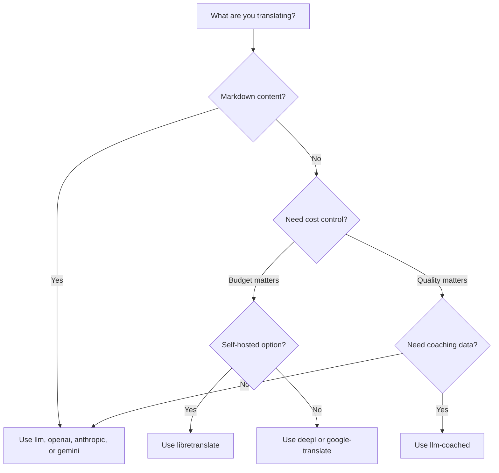

# Phương thức Dịch thuật

Champollion hỗ trợ nhiều phương thức dịch thuật. Mỗi cặp ngôn ngữ có thể sử dụng một phương thức khác nhau — bạn không bị khóa vào một cách tiếp cận duy nhất cho toàn bộ dự án của mình.

## So sánh các Phương thức

### Nhà cung cấp LLM

Tập trung vào chất lượng, nhận biết Markdown, tương thích với huấn luyện (coaching). Tốt nhất cho các dự án có nhiều nội dung.

| Phương thức | Khóa | Chức năng |
|--------|-----|-------------|
| `llm` (mặc định) | `OPENROUTER_API_KEY` | LLM qua OpenRouter — hơn 200 mô hình, tự động định tuyến |
| `llm-coached` | `OPENROUTER_API_KEY` | LLM + quy tắc ngữ pháp, từ điển, lưu ý về văn phong |
| `openai` | `OPENAI_API_KEY` | API OpenAI trực tiếp (gpt-4o, gpt-4o-mini) |
| `anthropic` | `ANTHROPIC_API_KEY` | API Anthropic trực tiếp (Claude Sonnet, Haiku, Opus) |
| `gemini` | `GEMINI_API_KEY` | API Google Gemini trực tiếp (Flash, Pro) — có gói miễn phí |

### Dịch máy (MT) truyền thống

Tập trung vào tốc độ và chi phí. Tốt nhất cho các cặp khóa-giá trị (key-value) số lượng lớn.

| Phương thức | Khóa | Chức năng |
|--------|-----|-------------|
| `google-translate` | `GOOGLE_TRANSLATE_API_KEY` | Google Cloud Translation API v2 (194 ngôn ngữ) |
| `deepl` | `DEEPL_API_KEY` | DeepL API có hỗ trợ bảng thuật ngữ (33 ngôn ngữ) |
| `microsoft-translator` | `MICROSOFT_TRANSLATOR_API_KEY` | Azure Cognitive Services Translator (135 ngôn ngữ) |
| `libretranslate` | *(tự lưu trữ)* | LibreTranslate tự lưu trữ (AGPL, miễn phí) |
| `tilde` | `TILDE_API_KEY` | Tilde MT — Các engine do EU phát triển, mạnh về các ngôn ngữ Baltic và châu Âu |
| `translated` | `LARA_ACCESS_KEY_ID` + `LARA_ACCESS_KEY_SECRET` | Translated's Lara — MT thích ứng chuyên nghiệp (200 ngôn ngữ) |

### Cơ sở hạ tầng

| Phương thức | Khóa | Chức năng |
|--------|-----|-------------|
| `api` | *(theo nhà cung cấp)* | HTTP client tinh gọn cho bất kỳ endpoint dịch thuật REST nào |

## Sơ đồ quyết định



---

## `llm` — Dịch thuật bằng LLM (Mặc định)

Dịch thuật thông qua bất kỳ LLM nào trên [OpenRouter](https://openrouter.ai). Đây là phương thức mặc định và linh hoạt nhất.

**Cách thức hoạt động:**
1. Gom nhóm các khóa (mặc định 80 khóa/nhóm) kèm theo các hướng dẫn về văn phong và ngữ cảnh
2. Gửi đến OpenRouter dưới dạng một prompt có cấu trúc
3. Phân tích cú pháp phản hồi JSON
4. Xác thực từng bản dịch thông qua [cổng kiểm soát chất lượng (quality gate)](/docs/concepts/quality-gate)
5. Ghi các bản dịch đạt yêu cầu, thử lại hoặc từ chối các bản dịch lỗi

**Khi nào nên dùng:** Hầu hết các dự án. Đặc biệt là các trang web có nhiều nội dung bằng Markdown, nơi các khối mã (code block) và shortcode cần được bảo vệ không bị dịch.

**Cấu hình:**

```json
{
  "defaultMethod": "llm",
  "model": "google/gemini-3.5-flash"
}
```

## `llm-coached` — Dịch thuật LLM có Huấn luyện (Coached)

Tương tự như `llm`, nhưng có thêm các quy tắc ngữ pháp, từ điển thuật ngữ và lưu ý về văn phong được đưa vào mỗi prompt.

**Cách thức hoạt động:**
1. Tải dữ liệu huấn luyện từ `.champollion/coaching/<locale>.json` hoặc thư mục `coaching/` của một plugin
2. Đưa các quy tắc ngữ pháp, thuật ngữ từ điển và lưu ý văn phong vào system prompt
3. Các thuật ngữ trong từ điển khớp với khóa nguồn sẽ được đưa vào dưới dạng thuật ngữ bắt buộc
4. Quá trình dịch thuật diễn ra tương tự như `llm`, với dữ liệu huấn luyện giúp tăng độ chính xác

**Khi nào nên dùng:** Các ngôn ngữ ít tài nguyên (low-resource), thuật ngữ chuyên ngành (pháp lý, y tế), văn phong trang trọng, hoặc bất kỳ trường hợp nào mà kết quả LLM thông thường không đủ chính xác.

**Định dạng dữ liệu huấn luyện:**

```json title=".champollion/coaching/fr.json"
{
  "grammar_rules": [
    "French adjectives agree in gender and number with the noun they modify",
    "Use 'vous' for formal contexts, 'tu' for informal"
  ],
  "dictionary": {
    "dashboard": "tableau de bord",
    "deployment": "déploiement",
    "settings": "paramètres"
  },
  "style_notes": "Prefer active voice. Avoid anglicisms where a native French term exists."
}
```

Xem thêm: [Hướng dẫn về Ngôn ngữ ít tài nguyên](/docs/network/community/low-resource-languages)

---

## `openai` — API OpenAI Trực tiếp

Dịch trực tiếp qua OpenAI Chat Completions API. Không qua trung gian OpenRouter — khóa của bạn, tài khoản của bạn, bảng điều khiển sử dụng của bạn.

**Các mô hình:** `gpt-4o` (mặc định), `gpt-4o-mini`

**Tính năng:**
- ✅ Nhận biết Markdown (dịch nội dung)
- ✅ Hỗ trợ huấn luyện (quy tắc ngữ pháp, ghi đè từ điển, lưu ý văn phong)
- ✅ Chế độ JSON cho đầu ra khóa-giá trị có cấu trúc
- ✅ Tự động thử lại với thời gian chờ tăng dần (exponential backoff)

**Cấu hình:**

```json
{
  "pairs": {
    "en:fr": { "method": "openai", "model": "gpt-4o-mini" }
  }
}
```

```bash
export OPENAI_API_KEY=sk-proj-...
```

Lấy khóa của bạn tại [platform.openai.com/api-keys](https://platform.openai.com/api-keys).

## `anthropic` — API Anthropic Trực tiếp

Dịch trực tiếp qua Anthropic Messages API. Sử dụng tham số `system` cho dữ liệu huấn luyện, cho phép sử dụng tính năng lưu bộ nhớ đệm prompt (prompt caching) của Anthropic.

**Các mô hình:** `claude-sonnet-4-6` (mặc định), `claude-haiku-4-5`, `claude-opus-4-7`

**Tính năng:**
- ✅ Nhận biết Markdown (dịch nội dung)
- ✅ Hỗ trợ huấn luyện (quy tắc ngữ pháp, ghi đè từ điển, lưu ý văn phong)
- ✅ Lưu bộ nhớ đệm system prompt (giảm chi phí huấn luyện trên các nhóm bản dịch)
- ✅ Tự động thử lại với thời gian chờ tăng dần (exponential backoff)

**Cấu hình:**

```json
{
  "pairs": {
    "en:ja": { "method": "anthropic", "model": "claude-haiku-4-5" }
  }
}
```

```bash
export ANTHROPIC_API_KEY=sk-ant-...
```

Lấy khóa của bạn tại [console.anthropic.com](https://console.anthropic.com/settings/keys).

## `gemini` — API Google Gemini Trực tiếp

Dịch trực tiếp qua Google Gemini `generateContent` API. **Có sẵn gói miễn phí** — điểm khởi đầu tốt nhất với chi phí bằng không.

**Các mô hình:** `gemini-2.5-flash` (mặc định), `gemini-2.5-pro`

**Tính năng:**
- ✅ Nhận biết Markdown (dịch nội dung)
- ✅ Hỗ trợ huấn luyện (quy tắc ngữ pháp, ghi đè từ điển, lưu ý văn phong)
- ✅ Chế độ phản hồi JSON qua `responseMimeType`
- ✅ Gói miễn phí (hạn mức hàng ngày rộng rãi)
- ✅ Tự động thử lại với thời gian chờ tăng dần (exponential backoff)

**Cấu hình:**

```json
{
  "pairs": {
    "en:ko": { "method": "gemini", "model": "gemini-2.5-pro" }
  }
}
```

```bash
export GEMINI_API_KEY=AI...
```

Lấy khóa của bạn tại [aistudio.google.com/apikey](https://aistudio.google.com/apikey).

### Xác thực Mô hình {#model-validation}

Các nhà cung cấp LLM trực tiếp (`openai`, `anthropic`, `gemini`) sẽ xác thực chuỗi mô hình của bạn trong lần sử dụng đầu tiên. Việc này giúp phát hiện ba nhóm lỗi sau:

**Sai định dạng phương thức** — Sử dụng đường dẫn mô hình kiểu OpenRouter với một nhà cung cấp trực tiếp:

```
[WARN] OpenAI: model "google/gemini-3.5-flash" looks like an OpenRouter path.
       Direct providers use bare model names (e.g., "gpt-4o").
       To use OpenRouter models, set method to 'llm' instead.
```

**Sai nhà cung cấp** — Sử dụng mô hình của một nhà cung cấp hoàn toàn khác:

```
[WARN] Gemini: model "claude-sonnet-4-6" is an Anthropic model.
       This provider (gemini) cannot serve Anthropic models.
       Use --method anthropic or set "method": "anthropic" in config.
```

**Mô hình không còn hỗ trợ hoặc viết sai chính tả** — Trong lần gọi API đầu tiên, champollion sẽ lấy danh sách mô hình thực tế của nhà cung cấp và đối chiếu mô hình của bạn với danh sách đó:

```
[WARN] Gemini: model "gemini-1.5-flash" not found in available models.
       Similar models: gemini-2.0-flash, gemini-2.5-flash, gemini-2.5-pro
       The API call will proceed — the provider will give the final verdict.
```

:::note[Đây là cảnh báo, không phải lỗi]
Quá trình xác thực mô hình sẽ ghi nhận cảnh báo nhưng không chặn cuộc gọi API. API của nhà cung cấp sẽ đưa ra quyết định cuối cùng — tên mô hình trong tương lai có thể khớp với một mẫu khác, và chúng tôi không muốn chặn dựa trên các phương pháp phỏng đoán (heuristics).
:::

---

## `google-translate` — Google Cloud Translation API

Tích hợp trực tiếp với Google Cloud Translation API v2. Sử dụng REST API — không cần SDK, không cần tài khoản dịch vụ (service account). Chỉ cần API key.

**Khi nào nên sử dụng:** Các cặp chuỗi khóa-giá trị (key-value) số lượng lớn, nơi tốc độ và chi phí quan trọng hơn sắc thái ngữ nghĩa. Hỗ trợ sẵn 194 ngôn ngữ ([danh sách công bố của Google](https://docs.cloud.google.com/translate/docs/languages)).

**Hạn chế:**
- ⚠️ **Không nhận biết Markdown.** Sẽ làm hỏng các khối mã, shortcode và các biến nội suy (interpolation variables).
- Không kiểm soát được văn phong/tông giọng
- Không áp dụng được huấn luyện hoặc thuật ngữ bắt buộc

```bash
npx champollion sync --method google-translate
```

:::tip[Tự động phát hiện]
Nếu chỉ có `GOOGLE_TRANSLATE_API_KEY` được thiết lập (không có khóa OpenRouter), champollion sẽ tự động chuyển sang Google Translate. Không cần thay đổi cấu hình.
:::

## `deepl` — DeepL API

Tích hợp trực tiếp với API dịch thuật DeepL. Hỗ trợ bảng thuật ngữ để đảm bảo tính nhất quán của thuật ngữ.

**Khi nào nên dùng:** Các ngôn ngữ châu Âu mà DeepL vượt trội (tiếng Đức, tiếng Pháp, tiếng Tây Ban Nha, tiếng Hà Lan, tiếng Ba Lan, v.v.). Hỗ trợ bảng thuật ngữ giúp áp dụng thuật ngữ nhất quán mà không cần dữ liệu huấn luyện.

**Tính năng:**
- ✅ Tự động phát hiện endpoint miễn phí/trả phí (hậu tố `:fx` trên các khóa miễn phí)
- ✅ Tạo và quản lý bảng thuật ngữ
- ✅ Kiểm soát mức độ trang trọng (formality)
- ⚠️ **Không nhận biết Markdown** — chỉ dành cho các cặp khóa-giá trị

**Cấu hình:**

```json
{
  "pairs": {
    "en:de": { "method": "deepl" }
  }
}
```

```bash
export DEEPL_API_KEY=your-key-here
```

Lấy khóa của bạn tại [deepl.com/pro-api](https://www.deepl.com/pro-api).

## `microsoft-translator` — Azure Cognitive Services

Tích hợp trực tiếp với Microsoft Translator Text API v3.

**Khi nào nên sử dụng:** Môi trường doanh nghiệp đã có sẵn hạ tầng Azure. Hỗ trợ 135 ngôn ngữ, bao gồm một số ngôn ngữ mà Google Translate không bao phủ (tiếng Tây Tạng, tiếng Faroe, tiếng Inuktitut và các ngôn ngữ khác).

**Tính năng:**
- ✅ Lên đến 100 phân đoạn mỗi yêu cầu (thông lượng cao)
- ✅ Tham số khu vực tùy chọn để tối ưu hóa độ trễ
- ⚠️ **Không nhận biết Markdown** — chỉ dành cho các cặp khóa-giá trị
- ⚠️ **Không dịch nội dung** — chỉ dành cho các cặp khóa-giá trị

**Cấu hình:**

```json
{
  "pairs": {
    "en:ar": { "method": "microsoft-translator" }
  }
}
```

```bash
export MICROSOFT_TRANSLATOR_API_KEY=your-key
export MICROSOFT_TRANSLATOR_REGION=global  # optional
```

Lấy khóa của bạn từ [Azure Portal](https://portal.azure.com) → Cognitive Services → Translator.

## `libretranslate` — Dịch thuật Tự lưu trữ (Self-Hosted)

Dịch thuật mã nguồn mở tự lưu trữ sử dụng LibreTranslate. Chạy cục bộ hoặc trên cơ sở hạ tầng của riêng bạn — không tốn chi phí API, chủ quyền dữ liệu hoàn toàn được đảm bảo.

**Khi nào nên dùng:** Các dự án yêu cầu dịch thuật ngoại tuyến, tuân thủ quyền riêng tư dữ liệu (GDPR) hoặc vận hành với chi phí bằng không. Đặc biệt hữu ích cho các pipeline CI không muốn phụ thuộc vào các API bên ngoài.

**Tính năng:**
- ✅ Tự lưu trữ — không gọi API bên ngoài
- ✅ Miễn phí và mã nguồn mở (AGPL-3.0)
- ✅ Có sẵn triển khai Docker
- ⚠️ **Không nhận biết Markdown** — chỉ dành cho các cặp khóa-giá trị
- ⚠️ **Không dịch nội dung** — chỉ dành cho các cặp khóa-giá trị
- ⚠️ Chất lượng khác nhau tùy theo cặp ngôn ngữ

**Thiết lập:**

```bash
# Run LibreTranslate locally with Docker
docker run -d -p 5000:5000 libretranslate/libretranslate

# Configure (optional — defaults to localhost:5000)
export LIBRETRANSLATE_API_URL=http://localhost:5000/translate
```

```json
{
  "pairs": {
    "en:es": { "method": "libretranslate" }
  }
}
```

---

## `api` — API Dịch thuật Từ xa

Một HTTP client tinh gọn dành cho các endpoint dịch thuật do cộng đồng lưu trữ hoặc được bảo vệ bằng IP. Champollion gửi các khóa đi và nhận lại các bản dịch — nó không chứa logic dịch thuật nào.

**Khi nào nên dùng:** Khi các phương thức dịch thuật được lưu trữ ở phía máy chủ (ví dụ: dữ liệu huấn luyện độc quyền, các mô hình đã được tinh chỉnh, các pipeline FST không thể phân phối công khai).

```json
{
  "pairs": {
    "en:crk": {
      "method": "api",
      "endpoint": "https://api.example.com/v1/translate",
      "apiKey": "your-key"
    }
  }
}
```

:::note[Dịch thuật do cộng đồng kiểm soát (hướng tới chủ quyền dữ liệu)]
Phương thức `api` là cầu nối đến **dịch thuật do cộng đồng lưu trữ dưới sự kiểm soát của cộng đồng (hướng tới chủ quyền dữ liệu)**. Các cộng đồng ngôn ngữ bản địa và thiểu số có thể tự lưu trữ các endpoint dịch thuật của riêng họ — giữ cho dữ liệu huấn luyện, các mô hình tinh chỉnh và tài sản trí tuệ (IP) ngôn ngữ dưới sự kiểm soát của cộng đồng — trong khi Champollion kết nối với chúng như một thin client.

Xem [Hỗ trợ Ngôn ngữ ít tài nguyên](/docs/network/community/low-resource-languages) để biết toàn bộ quy trình lưu trữ cộng đồng, và [Cung cấp Phương thức qua API](/docs/guides/serving-a-method) để biết các yêu cầu đối với endpoint.
:::

---

## Cấu hình theo từng cặp ngôn ngữ

Sức mạnh thực sự nằm ở việc kết hợp các phương thức cho từng cặp ngôn ngữ:

```json title="champollion.config.json"
{
  "version": 3,
  "pairs": {
    "en:fr": { "method": "deepl" },
    "en:ja": { "method": "openai", "model": "gpt-4o" },
    "en:ko": { "method": "gemini" },
    "en:ar": { "method": "microsoft-translator" },
    "en:crk": { "methodPlugin": "crk-coached-v1" }
  }
}
```

Cấu hình này dịch tiếng Pháp qua DeepL (hỗ trợ bảng thuật ngữ), tiếng Nhật qua OpenAI (chất lượng), tiếng Hàn qua Gemini (gói miễn phí), tiếng Ả Rập qua Microsoft Translator (độ bao phủ) và tiếng Plains Cree qua một plugin có huấn luyện (chuyên biệt).

## Plugin

Plugin là các công thức dịch thuật được đóng gói sẵn cho các cặp ngôn ngữ cụ thể. Chúng là các tệp khai báo JSON — không phải mã nguồn — để chỉ dẫn cho champollion biết nên sử dụng phương thức nào, với cài đặt ra sao và chất lượng đã được đánh giá chuẩn (benchmark) như thế nào.

:::tip[Từ eval harness đến production chỉ với một lệnh]
Các plugin được phát triển và chứng minh hiệu quả trong [eval harness](/docs/network/specifications/harness) có thể được cài đặt trực tiếp — phương thức bạn xác thực ở đó sẽ được triển khai tại đây chỉ với một lệnh `plugin install` duy nhất. Xem [Đánh giá dịch máy (MT Evaluation)](/docs/network/leaderboard/rules) để biết quy trình đánh giá đầy đủ.
:::

```bash
champollion plugin install ./french-formal-v1/
champollion plugin list
champollion plugin remove french-formal-v1
```

Xem [Thông số kỹ thuật Plugin](/docs/reference/plugin-spec) để biết định dạng manifest đầy đủ.

---

## Chuyển đổi Nhà cung cấp

Bạn muốn chuyển đổi giữa các phương thức? Định dạng mô hình và biến môi trường (env var) sẽ thay đổi — dưới đây là bản đồ chuyển đổi:

### OpenRouter → Nhà cung cấp Trực tiếp

```diff title="champollion.config.json"
 {
   "pairs": {
     "en:fr": {
-      "method": "llm",
-      "model": "openai/gpt-4o"
+      "method": "openai",
+      "model": "gpt-4o"
     }
   }
 }
```

```diff title="Environment variables"
- export OPENROUTER_API_KEY=sk-or-v1-...
+ export OPENAI_API_KEY=sk-proj-...
```

**Các điểm khác biệt chính:**
- OpenRouter sử dụng định dạng `provider/model` (ví dụ: `openai/gpt-4o`). Các nhà cung cấp trực tiếp sử dụng tên mô hình trần (ví dụ: `gpt-4o`).
- Mỗi nhà cung cấp trực tiếp có biến môi trường riêng (`OPENAI_API_KEY`, `ANTHROPIC_API_KEY`, `GEMINI_API_KEY`).
- Nếu bạn sử dụng sai định dạng mô hình, champollion sẽ cảnh báo bạn — xem [Xác thực Mô hình](#model-validation).

### Nhà cung cấp Trực tiếp → OpenRouter

```diff title="champollion.config.json"
 {
   "pairs": {
     "en:ja": {
-      "method": "anthropic",
-      "model": "claude-sonnet-4-6"
+      "method": "llm",
+      "model": "anthropic/claude-sonnet-4-6"
     }
   }
 }
```

:::tip[Khi nào nên dùng OpenRouter so với Trực tiếp]
**Sử dụng OpenRouter** khi bạn muốn chuyển đổi giữa các mô hình mà không cần thay đổi biến môi trường (env vars), hoặc khi bạn muốn truy cập hơn 200 mô hình chỉ từ một khóa duy nhất. **Sử dụng trực tiếp nhà cung cấp** khi bạn muốn thanh toán đơn giản hơn, độ trễ thấp hơn (không qua trung gian), hoặc truy cập vào các tính năng đặc thù của nhà cung cấp như tính năng lưu tạm bộ nhớ đệm prompt (prompt caching) của Anthropic.
:::

---

## So sánh Chi phí

Chi phí ước tính trên 1.000 khóa được dịch (giả định khoảng 10 token mỗi khóa, 80 khóa mỗi nhóm):

| Phương thức | Chi phí / 1K Khóa | Tốc độ | Chất lượng | Phù hợp nhất cho |
|--------|----------------|-------|---------|----------|
| `gemini` (Flash) | **Miễn phí** (trong hạn mức) | Nhanh | Tốt | Bắt đầu, dự án cá nhân |
| `google-translate` | ~$0.02 | Nhanh nhất | Đủ dùng | Số lượng lớn, các ngôn ngữ châu Âu |
| `deepl` | ~$0.02 | Nhanh | Tốt | Các ngôn ngữ châu Âu, thuật ngữ |
| `microsoft-translator` | ~$0.01 | Nhanh | Đủ dùng | Hệ thống Azure, độ bao phủ ngôn ngữ rộng |
| `libretranslate` | **Miễn phí** (tự lưu trữ) | Thay đổi | Khá | Môi trường offline, GDPR, pipeline CI |
| `gemini` (Pro) | ~$0.07 | Trung bình | Rất tốt | Cần chất lượng cao, tận dụng hạn mức miễn phí |
| `openai` (GPT-4o-mini) | ~$0.01 | Nhanh | Tốt | LLM tiết kiệm chi phí |
| `openai` (GPT-4o) | ~$0.10 | Trung bình | Rất tốt | Cần chất lượng cao |
| `anthropic` (Haiku) | ~$0.01 | Nhanh | Tốt | LLM tiết kiệm chi phí |
| `anthropic` (Sonnet) | ~$0.10 | Trung bình | Rất tốt | Cần chất lượng cao |
| `anthropic` (Opus) | ~$0.50 | Chậm | Xuất sắc | Chất lượng tối đa |
| `llm` (OpenRouter) | Thay đổi theo mô hình | Thay đổi | Thay đổi | So sánh mô hình, thử nghiệm |

:::note[Đây là các mức chi phí ước tính]
Chi phí thực tế phụ thuộc vào độ dài văn bản nguồn, kích thước lô (batch size) và các thay đổi về giá của nhà cung cấp. Hãy kiểm tra trang bảng giá hiện tại của từng nhà cung cấp để biết mức phí chính xác.
:::

---

## Xem thêm

- [Các ngôn ngữ được hỗ trợ](/docs/reference/supported-languages)
- [Dữ liệu huấn luyện](/docs/concepts/coaching-data)
- [Hỗ trợ Ngôn ngữ ít tài nguyên](/docs/network/community/low-resource-languages)
- [Thông số kỹ thuật Plugin](/docs/reference/plugin-spec)
- [Cung cấp Phương thức qua API](/docs/guides/serving-a-method)
- [Cổng kiểm soát chất lượng](/docs/concepts/quality-gate)
- [Kiến trúc](/docs/concepts/architecture)
- [Xử lý sự cố](/docs/guides/troubleshooting) — lỗi mô hình, sự cố API


