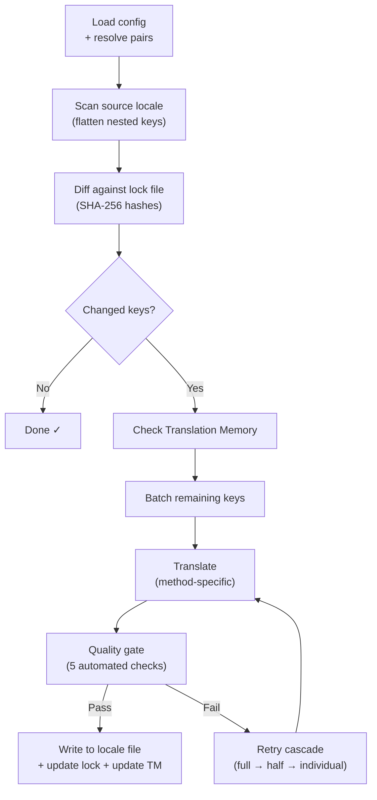

# Cách champollion hoạt động

champollion dịch các tệp ngôn ngữ (locale) của ứng dụng chỉ bằng một lệnh duy nhất. Dưới đây là những gì diễn ra bên dưới hệ thống.

## Quy trình xử lý (Pipeline)

Khi bạn chạy `npx champollion sync`, champollion sẽ thực thi một quy trình xử lý gồm sáu giai đoạn:



**Các quyết định thiết kế cốt lõi:**

- **Phát hiện thay đổi qua mã băm SHA-256.** Champollion theo dõi từng giá trị nguồn bằng một mã băm trong `.champollion.lock`. Khi bạn cập nhật một chuỗi tiếng Anh, chỉ có khóa (key) đó được dịch lại. Đây là lý do tại sao `sync` chạy rất nhanh trong các lần chạy tiếp theo — nó thực hiện lượng công việc tối thiểu.

- **Bộ nhớ đệm Bộ nhớ dịch (Translation Memory caching).** Trước khi thực hiện bất kỳ lệnh gọi API nào, champollion sẽ kiểm tra `.champollion/tm.json` để tìm các bản dịch đã được lưu vào bộ nhớ đệm (được định danh bằng văn bản nguồn + ngôn ngữ + phương thức). Trong một lần đồng bộ lại thông thường sau khi thay đổi một khóa, 142 khóa sẽ được lấy từ bộ nhớ đệm và chỉ có 1 khóa cần gọi API.

- **Cổng kiểm soát chất lượng trước khi ghi (Quality gate).** Mỗi bản dịch đều phải vượt qua năm bước kiểm tra tự động (trống, lặp lại nguồn, vòng lặp ảo tưởng, phình to độ dài, tuân thủ hệ chữ viết) trước khi được ghi vào tệp của bạn. Các lỗi thất bại sẽ được ghi nhật ký (log) chứ không bao giờ được chấp nhận một cách âm thầm.

- **Thử lại phân cấp khi thất bại (Retry cascade).** Nếu một loạt (batch) bị lỗi (lỗi phân tích cú pháp JSON, hết thời gian chờ API), champollion sẽ thử lại với các loạt nhỏ dần: toàn bộ → một nửa → từng khóa đơn lẻ. Điều này giúp cô lập khóa gặp sự cố mà không làm nghẽn các khóa còn lại.

## Các phương thức dịch

Champollion hỗ trợ nhiều phương pháp dịch thuật, mỗi phương pháp phù hợp với các tình huống khác nhau. Các phương pháp cốt lõi bao gồm:

| Phương thức | Cách hoạt động | Phù hợp nhất cho |
|--------|-------------|----------|
| **`llm`** | Prompt có cấu trúc gửi tới bất kỳ mô hình OpenRouter nào | Các ngôn ngữ có tài nguyên phong phú |
| **`llm-coached`** | Prompt tương tự + quy tắc ngữ pháp, từ điển và lưu ý về phong cách | Các ngôn ngữ mà LLM thường mắc lỗi có thể dự đoán được |
| **`google-translate`** | Yêu cầu hàng loạt (batch request) qua Google Cloud Translation API | Các ngôn ngữ tài nguyên cao có sự hỗ trợ tốt từ Google Translate |
| **`api`** | HTTP POST tới endpoint của riêng bạn | Quy trình xử lý tùy chỉnh, các mô hình do cộng đồng kiểm soát |

Các phương thức được cấu hình theo từng cặp ngôn ngữ. Bạn có thể sử dụng `google-translate` cho tiếng Pháp nhưng lại dùng `llm-coached` cho tiếng Plains Cree — mỗi cặp ngôn ngữ sẽ nhận phương thức hoạt động tốt nhất cho nó.

## Dữ liệu huấn luyện (Coaching Data)

Đối với các cặp `llm-coached`, dữ liệu huấn luyện cung cấp cho LLM kiến thức ngôn ngữ rõ ràng: quy tắc ngữ pháp, thuật ngữ bắt buộc và tùy chọn phong cách. Thông tin này được đưa vào mỗi prompt dưới dạng ngữ cảnh có cấu trúc.

```json title="coaching/crk.json"
{
  "grammar_rules": ["Animate nouns take different plural forms than inanimate nouns"],
  "dictionary": {"welcome": "ᑕᓂᓯ", "settings": "ᐃᑕᐢᑌᐘᐃᓇ"},
  "style_notes": "Use Standard Roman Orthography (SRO) unless explicitly configured otherwise."
}
```

Dữ liệu huấn luyện là cơ chế chính để cải thiện chất lượng dịch thuật mà không cần tinh chỉnh (fine-tune) mô hình. Thay đổi quy tắc → chạy lại đồng bộ (sync) → xem kết quả có cải thiện không. Quá trình lặp lại diễn ra tức thì.

## Plugin

Plugin là các công thức dịch thuật được đóng gói sẵn cho các cặp ngôn ngữ cụ thể. Chúng là các tệp khai báo JSON — không phải mã nguồn — để chỉ dẫn cho champollion biết nên sử dụng phương thức nào, với cài đặt ra sao và chất lượng đã được đánh giá chuẩn (benchmark) như thế nào.

```bash
champollion plugin install ./crk-coached-v3/
champollion sync   # uses the installed plugin for en→crk
```

Plugin thu hẹp khoảng cách giữa nghiên cứu và thực tế triển khai: một phương thức đạt điểm cao trong [Mạng lưới (Network)](/arena) có thể được đóng gói thành một plugin và triển khai tại đây.

## Bức tranh toàn cảnh

champollion là một nửa của hệ sinh thái gồm hai phần:

- **[Mạng lưới (Network)](/arena)** — nơi các phương thức dịch thuật được **phát triển và chứng minh** bằng các đánh giá chuẩn (benchmarking) có thể tái lập
- **champollion** — nơi các phương thức đã được chứng minh được **triển khai** để dịch nội dung thực tế

Cầu nối [Eval Harness Bridge](/docs/guides/bridge) sẽ kết nối cả hai. Một phương thức chứng minh được hiệu quả trong Mạng lưới sẽ được triển khai tại đây. Phản hồi từ người bản xứ trong môi trường thực tế sẽ giúp cải thiện phiên bản tiếp theo.

---

## Tìm hiểu sâu hơn

- [Cách hoạt động của Sync](/docs/concepts/how-sync-works) — hướng dẫn chi tiết từng bước về quy trình xử lý
- [Cổng kiểm soát chất lượng (Quality Gate)](/docs/concepts/quality-gate) — năm bước kiểm tra tự động
- [Bộ nhớ dịch (Translation Memory)](/docs/concepts/translation-memory) — lưu bộ nhớ đệm và tiết kiệm chi phí
- [Các phương thức dịch](/docs/guides/translation-methods) — so sánh chi tiết các phương thức
- [Kiến trúc](/docs/concepts/architecture) — tổng quan về thiết kế hệ thống
