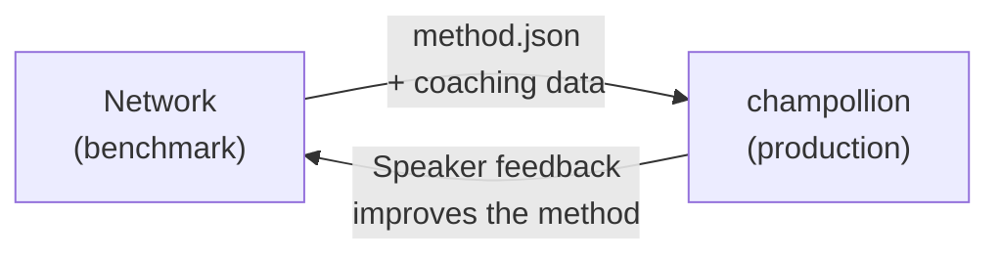

# Triển khai lên Production

Bạn đã chứng minh nó hoạt động hiệu quả trong Network. Giờ là lúc triển khai nó.

Network được dùng cho R&D — xây dựng, đo kiểm (benchmarking) và so sánh các phương pháp dịch thuật. **Triển khai lên production** được thực hiện thông qua [champollion](https://champollion.dev), CLI dịch thuật dành cho nhà phát triển. Chúng kết nối với nhau thông qua một định dạng plugin chung.



---

## Quy trình triển khai

### 1. Xuất phương pháp của bạn dưới dạng Plugin

Tạo một manifest `method.json` để đóng gói các kết quả đo kiểm của bạn:

```json
{
  "name": "crk-coached-v3",
  "type": "llm-coached",
  "version": "3.0.0",
  "description": "Coached LLM translation for Plains Cree",
  "locales": ["crk"],
  "config": {
    "model": "google/gemini-2.5-flash",
    "temperature": 0.3
  },
  "benchmarks": {
    "crk": {
      "composite_score": 0.67,
      "fst_acceptance": 0.82,
      "corpus_size": 150
    }
  }
}
```

Đính kèm mọi dữ liệu huấn luyện (quy tắc ngữ pháp, từ điển) cùng với manifest.

### 2. Cài đặt trong Champollion

```bash
champollion plugin install ./my-method-plugin/
```

### 3. Cấu hình cặp ngôn ngữ của bạn

```json title="champollion.config.json"
{
  "pairs": {
    "en-crk": { "method": "plugin", "plugin": "crk-coached-v3" }
  }
}
```

### 4. Dịch nội dung thực tế

```bash
npx champollion sync
```

Phương pháp đã qua đo kiểm của bạn giờ đây đang tạo ra các bản dịch thực tế trên môi trường production.

---

## Đối với các ngôn ngữ bản địa

Các phương pháp phục vụ các cộng đồng ngôn ngữ bản địa cần có **sự đồng thuận của cộng đồng** trước khi triển khai production. Các nguyên tắc chủ quyền dữ liệu bản địa — quyền sở hữu và kiểm soát dữ liệu ngôn ngữ thuộc về cộng đồng — quy định cách thức các phương pháp dịch thuật được phát triển, đánh giá và triển khai.

Một phương pháp đạt đến cấp độ Có thể triển khai (Deployable tier - 0.70+) sẽ không tự động được triển khai — nó chỉ được triển khai **nếu và khi** cơ quan quản lý của cộng đồng ngôn ngữ đó đưa ra sự đồng thuận.

Xem [Chủ quyền dữ liệu](/docs/network/sovereignty/data-sovereignty) và [Chuyển giao quyền sở hữu](/docs/network/sovereignty/ownership-transfer) để biết thêm chi tiết về khung quản trị đầy đủ.

---

## Xem thêm

- [The Eval Harness Bridge](https://champollion.dev/docs/guides/bridge) — hướng dẫn chi tiết về quy trình Network→champollion
- [Plugin Specification](https://champollion.dev/docs/reference/plugin-spec) — định dạng manifest method.json
- [champollion Agent Guide](https://champollion.dev/docs/guides/agent-guide) — cách sử dụng champollion để dịch thuật

