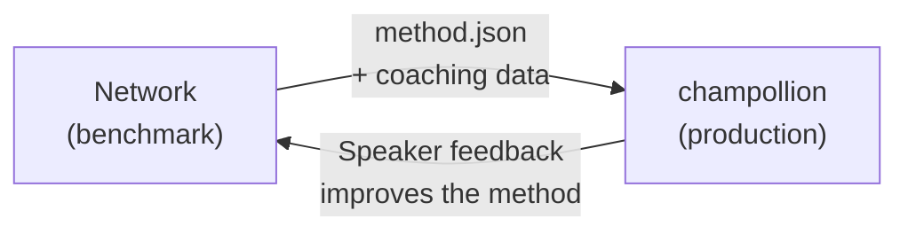

# Triển khai lên Production

Bạn đã chứng minh nó hoạt động hiệu quả trong Network. Giờ là lúc triển khai nó.

Network được dùng cho R&D — xây dựng, đo kiểm (benchmarking) và so sánh các phương pháp dịch thuật. **Triển khai lên production** được thực hiện thông qua [champollion](https://champollion.dev), CLI dịch thuật dành cho nhà phát triển. Chúng kết nối với nhau thông qua một định dạng plugin chung.


```mermaid
graph LR
    A["Network\n(benchmark)"] -->|"method.json\n+ coaching data"| B["champollion\n(production)"]
    B -->|"Speaker feedback\nimproves the method"| A
```

---

## Quy trình triển khai

### 1. Xuất phương pháp của bạn dưới dạng Plugin

Tạo một manifest `method.json` để đóng gói các kết quả đo kiểm của bạn:

```json
{
  "name": "french-formal-v1",
  "type": "llm-coached",
  "version": "1.0.0",
  "description": "Formal-register French (example manifest; the benchmark values are illustrative)",
  "locales": ["fr"],
  "config": {
    "model": "google/gemini-2.5-flash",
    "temperature": 0.3
  },
  "benchmarks": {
    "fr": {
      "corpus_chrf": 72.3,
      "exact_match_rate": 0.42,
      "corpus_size": 500
    }
  }
}
```

Đính kèm mọi dữ liệu huấn luyện (quy tắc ngữ pháp, từ điển) cùng với manifest.

### 2. Cài đặt trong Champollion

```bash
champollion plugin install ./french-formal-v1/
```

### 3. Cấu hình cặp ngôn ngữ của bạn

```json title="champollion.config.json"
{
  "pairs": {
    "en:fr": { "methodPlugin": "french-formal-v1" }
  }
}
```

### 4. Dịch nội dung thực tế

```bash
npx champollion sync
```

Phương pháp đã qua đo kiểm của bạn giờ đây đang tạo ra các bản dịch thực tế trên môi trường production.

---

## Đối với các ngôn ngữ bản địa

Các phương pháp phục vụ các cộng đồng ngôn ngữ bản địa yêu cầu **sự đồng thuận của cộng đồng** trước khi triển khai lên production. Các nguyên tắc về chủ quyền dữ liệu bản địa — quyền sở hữu và kiểm soát dữ liệu ngôn ngữ của cộng đồng — chi phối cách thức các phương pháp dịch thuật được phát triển, đánh giá và triển khai.

Không có điểm số nào làm cho một phương pháp có thể triển khai — kể cả điểm chrF++ cao hay ngưỡng giải thưởng. Phương pháp này chỉ được triển khai **nếu và khi** cơ quan quản trị của cộng đồng ngôn ngữ đồng thuận, sau khi những người nói ngôn ngữ đó đã đánh giá kết quả đầu ra.

Xem [Chủ quyền dữ liệu](/docs/network/sovereignty/data-sovereignty) và [Chuyển giao quyền sở hữu](/docs/network/sovereignty/ownership-transfer) để biết thêm chi tiết về khung quản trị đầy đủ.

---

## Xem thêm

- [The Eval Harness Bridge](https://champollion.dev/docs/guides/bridge) — hướng dẫn chi tiết về quy trình Network→champollion
- [Plugin Specification](https://champollion.dev/docs/reference/plugin-spec) — định dạng manifest method.json
- [champollion Agent Guide](https://champollion.dev/docs/guides/agent-guide) — cách sử dụng champollion để dịch thuật
