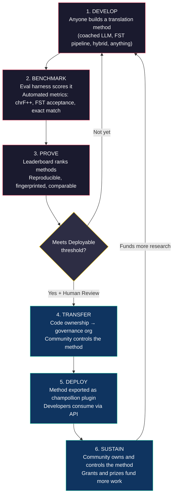
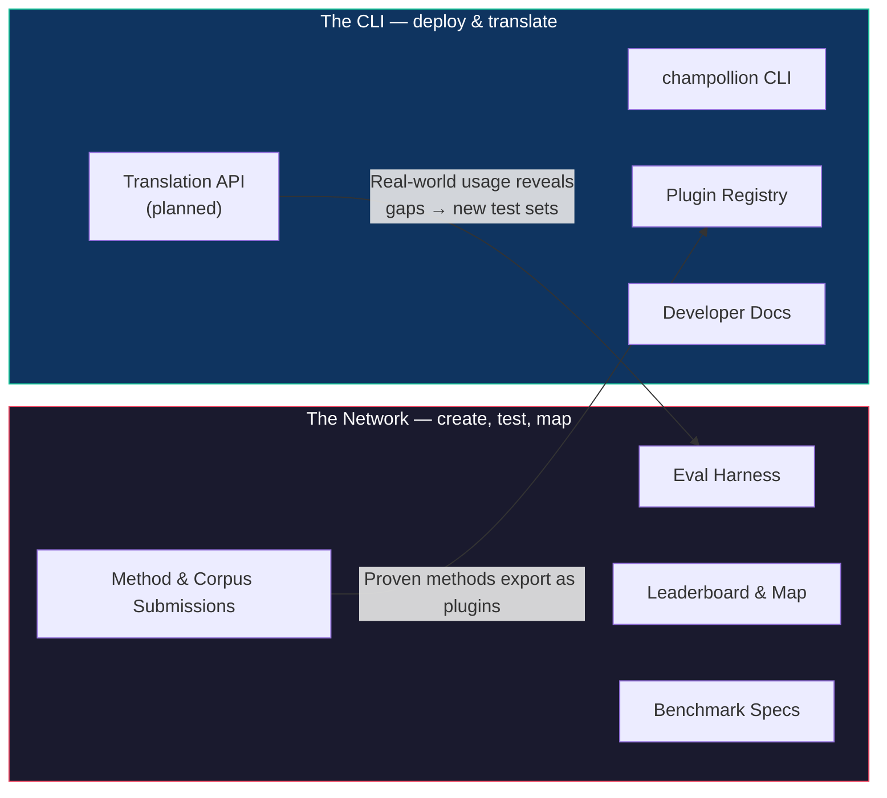
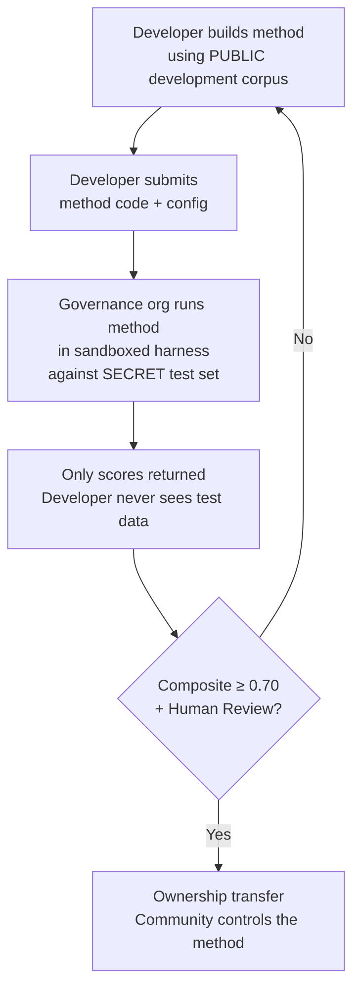

# Cách thức hoạt động của Mạng lưới: Xây dựng, Kiểm thử, Phát triển, Triển khai

> **Tóm tắt nội dung.** Dịch máy cho các ngôn ngữ ít được hỗ trợ trên thế giới không phải là vấn đề huấn luyện mô hình — đó là vấn đề về *cơ sở hạ tầng*. Không một mô hình, phòng thí nghiệm hay công ty đơn lẻ nào có thể giải quyết được. Tài liệu này mô tả một kiến trúc nền tảng biến cộng đồng kỹ sư ML, nhà ngôn ngữ học và người bản ngữ toàn cầu thành một phòng thí nghiệm nghiên cứu phân tán: bất kỳ ai cũng có thể xây dựng một phương pháp dịch thuật, mạng lưới sẽ kiểm thử xem nó có hoạt động hay không — bao gồm cả việc đối chiếu với dữ liệu đánh giá do cộng đồng nắm giữ mà nền tảng không bao giờ nhìn thấy — và các phương pháp hiệu quả sẽ trở thành tài sản thuộc sở hữu của chính cộng đồng sử dụng ngôn ngữ đó. Cơ chế này là sự phát triển phương pháp hợp tác, mở, kết hợp với các điều khoản linh hoạt do người quản lý thiết lập — một sự kết hợp vẫn còn hiếm trong thực tế, và là điều chúng tôi cho rằng vấn đề này đang đòi hỏi.

---

> [!IMPORTANT]
> **Phạm vi.** Nền tảng này đánh giá **bản dịch văn bản viết trang trọng** — tài liệu, tài liệu giáo dục, thông tin liên lạc chính thức, chuỗi giao diện người dùng (UI). Đây không phải là chatbot, trình thông dịch thời gian thực hay hệ thống hội thoại không giới hạn miền. Bảng xếp hạng đánh giá các phương pháp dịch thuật dựa trên các tập ngữ liệu song song được tuyển chọn trong các miền văn bản cụ thể (xem [Benchmark Specification §2.7](/docs/network/specifications/benchmark#27-domain) để biết phân loại miền). Dịch máy (MT) là cơ sở hạ tầng cho việc phục hồi ngôn ngữ, không phải là sự thay thế cho nó. Trẻ em học ngôn ngữ từ con người, không phải từ máy móc.

### Mức độ bao phủ miền hiện tại

Bảng xếp hạng đang **hoạt động và liên tục cập nhật** — các lượt chạy được xuất bản lên đó liên tục và bất kỳ ai cũng có thể thêm mới. Bảng dưới đây cho thấy các tập ngữ liệu tham chiếu công khai nào được *hỗ trợ* theo từng miền; [bảng xếp hạng](/leaderboard) có các thứ hạng trực tiếp.
Các tập ngữ liệu được lấy từ nguồn tại thời điểm chạy, không bao giờ được lưu trữ tại đây.

| Miền | Ngữ liệu tham chiếu | Trạng thái | Ghi chú |
|--------|------------------|--------|-------|
| Tin tức / báo chí | Global Voices (OPUS) | Đã hỗ trợ — mở cho các lượt gửi | 493 cặp ngôn ngữ, CC BY 3.0 |
| Hàng ngày / hỗn hợp (văn bản viết) | Tatoeba | Đã hỗ trợ — mở cho các lượt gửi | 874 cặp ngôn ngữ, CC BY 2.0 |
| Giáo dục / sách giáo khoa | EdTeKLA (Plains Cree) | Chỉ dành cho nghiên cứu — **không xếp hạng**; việc đánh giá API mô hình từ xa cần có sự đồng ý | Giấy phép CC BY-NC-SA sửa đổi của EdTeKLA (phạm vi chủ quyền, phi thương mại); được tách khỏi bảng xếp hạng, giải thưởng và các luồng API/thương mại |
| Tự sự / văn học | — | Đã lên kế hoạch | Chưa có tập ngữ liệu nào có thể chạy được kết nối |
| Tôn giáo / kinh thánh | FLORES+ (Miền Kinh thánh) | Đã kết nối, chỉ mang tính tương đối | Tập ngữ liệu có thể chạy; độ ô nhiễm CAO, vì vậy chỉ mang tính tương đối — không bao giờ được sử dụng để tính điểm chính thức |
| Tiếng nói / thời gian thực | — | Ngoài phạm vi | Hệ thống này đánh giá văn bản viết, không phải tiếng nói |
| Kỹ thuật / khoa học | — | Tương lai | Yêu cầu xác thực thuật ngữ theo miền cụ thể |

## Mục đích của Mạng lưới

Trước khi nói về cơ chế, hãy nói về sứ mệnh. Mạng lưới Champollion dựa trên bốn cam kết:

1. **Tạo ra và tin tưởng các tập kiểm thử dịch thuật.** Đối với hầu hết các ngôn ngữ, thứ khan hiếm và có giá trị không phải là một mô hình khác — mà là một tập kiểm thử *đáng tin cậy*: do con người tạo ra, trung thực với miền và được ghim phiên bản. Mạng lưới tồn tại để tạo ra các tập kiểm thử đó và làm cho chúng trở nên đáng tin cậy.
2. **Làm cho lĩnh vực này dễ điều hướng.** Ai có thể dịch cái gì, mỗi phương pháp tốt đến mức nào trên từng loại văn bản và những khoảng trống nằm ở đâu — được hiển thị như một bản đồ công khai, chứ không bị chôn vùi trong các bài báo và tệp PDF rải rác.
3. **Mọi phương pháp đều được chào đón — con người và máy móc.** Chúng tôi là những người thực dụng với thiên hướng tìm kiếm giải pháp. Một dịch giả chuyên nghiệp, một hệ thống dựa trên quy tắc, một LLM được huấn luyện (coached LLM), một mô hình tinh chỉnh (fine-tuned model) — tất cả đều được coi trọng như nhau. Chúng tôi quan tâm đến việc các ngôn ngữ được dịch, chứ không phải công cụ nào giành chiến thắng.
4. **Được xây dựng *cùng với* cộng đồng, không bao giờ cào dữ liệu (scraped) — và chủ quyền là điều không thể thương lượng.** Dữ liệu ngôn ngữ là dữ liệu sinh học (biodata); những người cung cấp tập ngữ liệu nắm giữ chìa khóa của nó và của bất kỳ thứ gì được đo lường dựa trên nó.

Mọi thứ dưới đây — vòng lặp, bộ công cụ đánh giá, bảng xếp hạng, cầu nối triển khai — đều phục vụ cho bốn cam kết đó.

---

## 1. Vấn đề: Dịch máy ≠ Học máy

Dịch máy cho các ngôn ngữ ít tài nguyên (LRLs) thường được định hình như một vấn đề học máy: thu thập dữ liệu, huấn luyện mô hình, triển khai. Cách định hình này là sai lầm và sai lầm này để lại hậu quả — nó hướng nguồn tài trợ, nhân tài và cơ sở hạ tầng vào một cách tiếp cận mà về mặt cấu trúc không thể hoạt động cho phần lớn các ngôn ngữ trên thế giới.

### 1.1 Tại sao cách định hình ML lại thất bại

Đường ống ML tiêu chuẩn cho MT yêu cầu ba điều: các tập ngữ liệu song song lớn, các tiêu chuẩn đánh giá đã được xác thực và một lộ trình triển khai. Đối với 194 ngôn ngữ trong danh sách Cloud Translation của Google và 200 ngôn ngữ được NLLB-200 bao phủ, cả ba điều này đều tồn tại. Đối với khoảng 1.200 ngôn ngữ trong phần đuôi dài của OMT-1600 — theo tính toán của chúng tôi: 1.600 ngôn ngữ mà nó bao phủ trừ đi hơn 400 ngôn ngữ mà các tác giả báo cáo là mô hình "hiểu đủ tốt" — dữ liệu đánh giá có tồn tại nhưng chất lượng hầu hết dưới ngưỡng có thể sử dụng, trọng số mô hình không được công khai và không có đường ống triển khai. Đối với khoảng hơn 5.400 ngôn ngữ còn lại, không có điều nào trong số này tồn tại.

| Yêu cầu | Ngôn ngữ giàu tài nguyên | Phần đuôi dài của OMT-1600 (~1.200 LRLs) | ~5.400 ngôn ngữ còn lại |
|-------------|------------------------|-------------------------------|---------------------------|
| **Ngữ liệu song song** | Hàng triệu cặp câu (Europarl, UN Corpus, OpenSubtitles) | Văn bản song ngữ miền Kinh thánh, dữ liệu cào từ web, dịch ngược tổng hợp. Không có dữ liệu do cộng đồng tuyển chọn. | Hàng trăm đến vài nghìn, nếu có |
| **Tiêu chuẩn đánh giá** | WMT, FLORES, NTREX — được tiêu chuẩn hóa, có thể tái tạo | BOUQuET (miền Kinh thánh), met-BOUQuET. Không có xác thực hình thái học. Không có đánh giá độc lập. | Không có tiêu chuẩn chuẩn; đánh giá đặc tả (ad hoc) |
| **Lộ trình triển khai** | Google Translate, DeepL, Azure — các API thương mại | Trọng số mô hình không được phát hành. Không có CLI, không có hệ thống plugin, không có API do cộng đồng triển khai. | Không có gì. Không API, không sản phẩm, không thị trường. |

Cách tiếp cận ML hoạt động khi có sẵn dữ liệu để huấn luyện và có thị trường để triển khai. OMT-1600 đã mở rộng điều kiện đầu tiên một cách đáng kể — nhưng sự mở rộng mà không có xác minh chất lượng độc lập, xác thực hình thái học hoặc sự quản trị của cộng đồng là sự mở rộng không có niềm tin. Vấn đề không chỉ là "chúng ta cần một mô hình tốt hơn" — mà là "chúng ta cần cơ sở hạ tầng chứng minh mô hình hoạt động hiệu quả, theo các điều khoản do cộng đồng kiểm soát."

### 1.2 MT cho LRLs thực sự yêu cầu điều gì

Dịch thuật cho các ngôn ngữ ít được hỗ trợ không chủ yếu là vấn đề huấn luyện. Đó là một vấn đề về **kỹ nghệ phương pháp** — thách thức trong việc lắp ráp các tài nguyên sẵn có (LLM, công cụ hình thái học, kiến thức cộng đồng, quy tắc ngôn ngữ học) thành các đường ống dịch thuật hoạt động được, sau đó chứng minh chúng hoạt động hiệu quả bằng các đánh giá nghiêm ngặt.

Sự khác biệt này rất quan trọng:

| Khía cạnh | Cách tiếp cận ML | Cách tiếp cận Kỹ nghệ phương pháp |
|-----------|------------|---------------------------|
| **Hoạt động cốt lõi** | Huấn luyện mô hình trên dữ liệu | Kết hợp các công cụ, prompt và kiến thức ngôn ngữ học thành một đường ống |
| **Nút thắt cổ chai** | Khối lượng dữ liệu song song | Sự sáng tạo kỹ thuật + cơ sở hạ tầng đánh giá |
| **Ai có thể đóng góp** | Các nhóm có cụm GPU và tập dữ liệu | Bất kỳ ai có khóa API, từ điển và một ý tưởng |
| **Đánh giá** | BLEU/chrF trên các tập kiểm thử được giữ lại | Xác thực hình thái học + đánh giá của con người + các số liệu tự động |
| **Triển khai** | Phục vụ mô hình | Đóng gói phương pháp thành một plugin |

Các LLM hiện đại đã chứa đựng kiến thức tiềm ẩn về nhiều ngôn ngữ ít tài nguyên — đủ để tạo ra đầu ra *trông có vẻ* hợp lý. Vấn đề là đầu ra này thường không hợp lệ về mặt hình thái học (mô hình ảo giác ra các dạng từ không tồn tại trong ngôn ngữ đó). Thách thức kỹ thuật là: làm thế nào bạn trích xuất được những gì LLM biết, xác thực nó với thực tế ngôn ngữ học và đóng gói kết quả để sử dụng trong môi trường sản xuất?

Đây là lý do tại sao chúng tôi đánh giá chuẩn (benchmark) các **phương pháp**, chứ không phải mô hình. Một phương pháp là toàn bộ công thức: lựa chọn mô hình + kỹ nghệ prompt + sử dụng công cụ + tiền/hậu xử lý + dữ liệu huấn luyện (coaching data) + chiến lược thử lại. Hai nhóm sử dụng cùng một mô hình với các phương pháp khác nhau sẽ nhận được điểm số khác nhau. Đó chính là mấu chốt.

### 1.3 Tại sao các ngôn ngữ đa tổng hợp lại phá vỡ mọi thứ

Nhiều ngôn ngữ ít được hỗ trợ nhất trên thế giới là ngôn ngữ **đa tổng hợp** — chúng mã hóa toàn bộ câu thành các từ đơn lẻ thông qua các quá trình hình thái học sinh sản. Hãy xem xét từ trong tiếng Plains Cree:

> **ê-kî-nitawi-kîskinwahamâkosiyân**
> *"khi tôi đã đến trường"*

Chỉ một từ. Nó mã hóa thì (quá khứ), hướng (đi đến), gốc từ (học), thể (bị động/phản thân) và ngôi (thứ nhất số ít). Tiếng Anh cần sáu từ cho những gì tiếng Cree diễn đạt chỉ trong một từ.

Điều này phá vỡ MT tiêu chuẩn ở mọi cấp độ:

- **Token hóa (Tokenization)** — BPE và SentencePiece băm nhỏ các từ đa tổng hợp thành những mảnh vô nghĩa, bởi vì chúng được thiết kế cho hình thái học chắp dính (concatenative morphology).
- **Ảo giác (Hallucination)** — Các LLM tạo ra các chuỗi trông có vẻ hợp lý nhưng không phải là từ hợp lệ. Một người không nói ngôn ngữ đó không thể nhận ra sự khác biệt. Nếu không có xác thực hình thái học, các ảo giác này sẽ trở nên vô hình.
- **Đánh giá (Evaluation)** — Các số liệu cấp độ từ (BLEU) trừng phạt sự biến đổi biến tố tự nhiên vốn là nền tảng cho cách các ngôn ngữ này hoạt động. Các số liệu cấp độ ký tự (chrF++) tốt hơn nhưng vẫn không đủ nếu không có xác thực cấu trúc.

Giải pháp không phải là một mô hình lớn hơn hay nhiều dữ liệu huấn luyện hơn. Đó là **cơ sở hạ tầng bắt lỗi ảo giác trước khi chúng tiếp cận người dùng** — các bộ phân tích hình thái học (FST) có thể khẳng định chắc chắn "đây không phải là một từ trong ngôn ngữ này."

---

## 2. Tại sao các cách tiếp cận hiện tại không hiệu quả

### 2.1 MT Thương mại

Các dịch vụ dịch thuật thương mại trong lịch sử đã tối ưu hóa cho khối lượng thị trường. OMT-1600 của Meta (tháng 3 năm 2026) thể hiện một sự thay đổi đáng kể — 1.600 ngôn ngữ trong một hệ thống. Nhưng đối với khoảng 1.200 ngôn ngữ trong phần đuôi dài của nó (theo tính toán của chúng tôi: 1.600 trừ đi hơn 400 ngôn ngữ mà các tác giả báo cáo là mô hình "hiểu đủ tốt"), chất lượng dưới ngưỡng có thể sử dụng, trọng số mô hình không có sẵn và không có đường ống triển khai. Vấn đề về động lực cấu trúc đã tiến hóa: Big Tech hiện có thể xây dựng các mô hình cho LRLs, nhưng nếu không có đánh giá độc lập, xác thực hình thái học hoặc quản trị cộng đồng, thì chỉ riêng độ bao phủ không giải quyết được vấn đề.

### 2.2 Nghiên cứu học thuật

Nghiên cứu MT học thuật tập trung áp đảo vào các cặp ngôn ngữ giàu tài nguyên vì đó là nơi có dữ liệu huấn luyện, các tác vụ chia sẻ (shared tasks) và các diễn đàn xuất bản. Các nhà nghiên cứu làm việc trên các cặp ngôn ngữ ít tài nguyên gặp khó khăn trong việc xuất bản, khó khăn trong việc tài trợ cho tính toán và khó khăn trong việc triển khai — bởi vì cơ sở hạ tầng triển khai cho LRLs không tồn tại.

### 2.3 Các cuộc thi một lần

Bạn có thể tổ chức một cuộc thi trên Kaggle: "Tiếng Anh→Plains Cree, điểm chrF++ cao nhất sẽ giành được 10.000 đô la." Đây là những gì sẽ xảy ra:

1. Ai đó chiến thắng, nộp một notebook, nhận giải thưởng, đi về nhà.
2. Notebook đó mục nát trong kho lưu trữ của Kaggle. Không ai triển khai nó. Không ai bảo trì nó.
3. Tập kiểm thử cuối cùng cũng được công bố — bị ô nhiễm vĩnh viễn.
4. Tổ chức quản trị đã tải dữ liệu ngôn ngữ học của họ lên cơ sở hạ tầng của Google theo điều khoản dịch vụ của Google, mà không có quyền kiểm soát thực sự đối với vòng đời của dữ liệu.
5. Không có cầu nối triển khai. Một notebook chiến thắng không phải là một API hoạt động được.

Một khoản tiền thưởng một lần sẽ thu hút những thợ săn tiền thưởng. Một bảng xếp hạng liên tục với sự quản trị của cộng đồng sẽ tạo ra sự gắn kết bền vững.

### 2.4 Tinh chỉnh (Fine-Tuning)

Tinh chỉnh một mô hình mở trên văn bản song song là cách tiếp cận ML hiển nhiên. Nhưng đối với hầu hết các LRLs, tập ngữ liệu song song cần thiết cho việc tinh chỉnh chính xác là dữ liệu không tồn tại — và việc tạo ra nó đòi hỏi chính những người nói song ngữ và sự tham gia của cộng đồng mà việc tinh chỉnh vốn dĩ nhằm mục đích thay thế. Bạn không thể tự thoát khỏi vấn đề khan hiếm dữ liệu bằng một kỹ thuật đòi hỏi phải có dữ liệu.

---

## 3. Giải pháp: Phát triển phương pháp hợp tác với Đánh giá có chủ quyền

Nền tảng này đảo ngược cách tiếp cận truyền thống: thay vì một nhóm xây dựng một mô hình, **cộng đồng toàn cầu cùng nhau xây dựng và kiểm thử các phương pháp dịch thuật**, mạng lưới xác minh những gì hoạt động hiệu quả, và các phương pháp hiệu quả sẽ được triển khai vào sản xuất với cộng đồng ngôn ngữ giữ quyền sở hữu và kiểm soát.

### 3.1 Toàn bộ vòng lặp

Mỗi giai đoạn có một chức năng cụ thể:

| Giai đoạn | Điều gì xảy ra | Ai được hưởng lợi |
|-------|-------------|--------------|
| **Phát triển** | Một nhà nghiên cứu, sinh viên hoặc người đam mê xây dựng một phương pháp dịch thuật bằng bất kỳ công cụ nào họ muốn — prompting LLM, đường ống FST, từ điển, mô hình tinh chỉnh, hệ thống dựa trên quy tắc hoặc kết hợp | Người đóng góp học hỏi, thử nghiệm, xuất bản |
| **Đánh giá chuẩn** | Bộ công cụ đánh giá chấm điểm phương pháp dựa trên một tập ngữ liệu được tiêu chuẩn hóa với các số liệu có thể tái tạo. Mỗi lượt chạy tạo ra một [thẻ chạy](/docs/network/specifications/benchmark#3-run-card-schema) — một bản ghi hoàn chỉnh về những gì đã được kiểm thử và hiệu suất của nó | Các nhà nghiên cứu nhận được kết quả có thể tái tạo, có thể so sánh được |
| **Chứng minh** | Kết quả xuất hiện trên bảng xếp hạng công khai. Các phương pháp được xếp hạng, so sánh và xem xét kỹ lưỡng. Cộng đồng thấy được những gì hiệu quả và những gì không | Mọi người đều có cái nhìn rõ ràng về các công nghệ tiên tiến nhất (state of the art) |
| **Chuyển giao** | Đối với các ngôn ngữ bản địa, các phương pháp đạt ngưỡng Có thể triển khai (điểm tổng hợp ≥ 0.70) VÀ vượt qua sự xác thực của con người sẽ được chuyển giao quyền sở hữu mã nguồn cho tổ chức quản trị của cộng đồng ngôn ngữ đó | Cộng đồng hoàn toàn sở hữu phương pháp — mã nguồn, trọng số và các quyết định triển khai |
| **Triển khai** | Phương pháp được xuất dưới dạng một plugin [champollion](https://github.com/gamedaysuits/Champollion) mà cộng đồng có thể chạy trên cơ sở hạ tầng của riêng họ. Các nhà phát triển tiêu thụ các bản dịch mà không cần phải hiểu phương pháp cơ bản | Các nhà phát triển có được bản dịch cho các ngôn ngữ mà các API thương mại không phục vụ |
| **Duy trì** | Nguồn tài trợ và các giải thưởng được tài trợ — mà dự án đang tích cực tìm kiếm; hiện tại dự án đang tự tài trợ — chi trả cho nhiều tập ngữ liệu hơn, sự xác thực của người bản ngữ và nghiên cứu. Champollion là phi thương mại và không lấy bất kỳ phần nào từ những gì cộng đồng kiếm được từ tài sản mà họ sở hữu | Công việc làm ngữ liệu được trả công và các phương pháp thuộc sở hữu của cộng đồng tồn tại lâu hơn bất kỳ khoản tài trợ đơn lẻ nào |

### 3.2 Tại sao Hợp tác mở lại hiệu quả

Sự tham gia mở không phải là ngẫu nhiên — nó chính là cơ chế. Đây là lý do tại sao:

**Sự đa dạng của các cách tiếp cận.** Phương pháp tốt nhất cho Tiếng Anh→Plains Cree có thể là một LLM được huấn luyện có cổng FST (FST-gated coached LLM). Phương pháp tốt nhất cho Tiếng Anh→Quechua có thể là một đường ống tăng cường từ điển. Phương pháp tốt nhất cho Tiếng Anh→Inuktitut có thể là một mô hình tinh chỉnh được khởi động từ tập ngữ liệu Nunavut Hansard. Không một nhóm hay cách tiếp cận đơn lẻ nào sẽ thống trị trên tất cả các ngôn ngữ. Bảng xếp hạng tiết lộ *loại* cách tiếp cận nào hoạt động hiệu quả cho *loại* ngôn ngữ nào — một siêu kết quả (meta-result) mà bản thân nó đã là một đóng góp nghiên cứu.

**Sự gắn kết bền vững.** Một bảng xếp hạng không bao giờ kết thúc. Luôn có một phương pháp tốt hơn để xây dựng. Mỗi lượt gửi đều đóng góp tài nguyên tính toán và nỗ lực trí tuệ cho vấn đề này. Không giống như một khoản tài trợ một lần, quá trình mở, liên tục này tạo ra sự đầu tư nghiên cứu bền vững từ cộng đồng toàn cầu.

**Rào cản gia nhập thấp.** Bạn cần một khóa API, một từ điển và một ý tưởng. Bộ công cụ đánh giá là mã nguồn mở. Định dạng tập ngữ liệu là JSON đơn giản. Một sinh viên ngôn ngữ học có thể sánh ngang với một phòng thí nghiệm được trang bị tốt — và đôi khi làm tốt hơn, bởi vì kiến thức chuyên ngành (hiểu biết về ngôn ngữ) có thể vượt trội hơn tài nguyên tính toán.

**Cầu nối triển khai.** Cùng một phương pháp đạt điểm cao trong bộ công cụ đánh giá sẽ được triển khai vào sản xuất chỉ với một thay đổi cấu hình. "Chứng minh ở đây, triển khai ở đó." Đây là khoảng trống mà Kaggle, các tác vụ chia sẻ của WMT và các ấn phẩm học thuật không thu hẹp được.

### 3.3 Kiến trúc nền tảng

champollion.dev là **một trung tâm với hai bộ mặt**. Cùng một trang web lưu trữ Mạng lưới — nơi các tập kiểm thử được tạo ra, các phương pháp được đánh giá và kết quả được lập bản đồ — và CLI, nơi các phương pháp đã được chứng minh được triển khai vào các dự án thực tế. Chúng chia sẻ một tên miền, một bộ tài liệu và một lớp dữ liệu; các nhãn bên dưới mô tả hai *vai trò*, không phải hai trang web.

**[Mạng lưới](/docs/network/)** là bãi thử nghiệm. Đối tượng của nó là các dịch giả, nhà ngôn ngữ học, cộng đồng và nhà nghiên cứu. Mọi thứ ở đây đều xoay quanh việc tạo ra các tập kiểm thử, đánh giá các phương pháp dựa trên chúng — dù là con người hay máy móc — và lập bản đồ những khoảng trống đang nằm ở đâu.

**[CLI](https://champollion.dev)** là khía cạnh triển khai. Đối tượng của nó là các nhà phát triển cần dịch thuật cho ứng dụng của họ. Họ không cần phải hiểu cách một phương pháp hoạt động — họ chỉ cần gọi nó.

Cầu nối giữa hai bộ mặt này là **phương pháp**: được tạo ra và tin tưởng trên Mạng lưới, được đóng gói để triển khai thông qua CLI, và — đối với các ngôn ngữ cộng đồng — thuộc sở hữu của cộng đồng.

---

## 4. Đánh giá có chủ quyền: Tại sao Cơ sở hạ tầng lại quan trọng

Cơ sở hạ tầng đánh giá không phải là một chi tiết kỹ thuật — nó là cốt lõi của mô hình chủ quyền. Đánh giá tiêu chuẩn (tải tập kiểm thử của bạn lên một nền tảng dùng chung) không hoạt động đối với các ngôn ngữ bản địa vì nó từ bỏ quyền kiểm soát đối với dữ liệu ngôn ngữ học.

### 4.1 Cơ chế Chủ quyền

Nhà phát triển không bao giờ nhìn thấy dữ liệu đánh giá tiêu chuẩn vàng. Họ phát triển dựa trên một tập ngữ liệu phát triển công khai, sau đó gửi mã phương pháp của họ cho tổ chức quản trị, tổ chức này sẽ chạy nó trong một hộp cát (sandbox) đối chiếu với tập kiểm thử bí mật. Chỉ có điểm số được trả về. Đây không chỉ là vấn đề bảo mật — nó được xây dựng để phù hợp với **các nguyên tắc chủ quyền dữ liệu của First Nations** — quyền sở hữu, kiểm soát, truy cập và chiếm hữu dữ liệu thuộc về cộng đồng — mà quản trị dữ liệu bản địa yêu cầu. Việc nó có đáp ứng được các nguyên tắc đó hay không không phải do chúng tôi quyết định: quyền quyết định thuộc về các cộng đồng liên quan.

### 4.2 Tại sao điều này không thể chạy trên nền tảng của người khác

Trên Kaggle, tổ chức quản trị tải dữ liệu ngôn ngữ học của họ lên cơ sở hạ tầng của Google theo điều khoản dịch vụ của Google. Họ không thể thu hồi quyền truy cập theo mốc thời gian của riêng họ. Họ không thể đính kèm các điều khoản pháp lý tùy chỉnh (như chuyển giao quyền sở hữu) vào các bài nộp. Họ không có sự đảm bảo bằng mật mã rằng dữ liệu sẽ không được sử dụng cho các mục đích khác. Chủ quyền dữ liệu có nghĩa là cộng đồng kiểm soát điểm cuối đánh giá, nắm giữ các khóa và có thể đóng cửa nó.

---

## 5. Triết lý Đánh giá: Microeval và LYSS

Các số liệu MT tiêu chuẩn (BLEU, chrF++, COMET) được thiết kế để khái quát hóa trên nhiều ngôn ngữ. Tính khái quát đó là điểm mạnh của chúng — và cũng là điểm mù của chúng. Đối với các ngôn ngữ đa tổng hợp, một từ không hợp lệ về mặt hình thái học nhưng chia sẻ các n-gram ký tự với tham chiếu sẽ đạt điểm cao trên chrF++ nhưng sẽ bị bất kỳ người bản ngữ nào nhận ra là vô nghĩa.

**Phát triển Microeval** có nghĩa là xây dựng các số liệu đánh giá được điều chỉnh cho các ngôn ngữ cụ thể bằng cách sử dụng các công cụ ngôn ngữ học tốt nhất hiện có. Khung này được gọi là **LYSS** (Linguistically-informed Yield & Structural Scoring - Chấm điểm Cấu trúc & Sản lượng dựa trên Ngôn ngữ học):

| Thành phần | Những gì nó đo lường | Công cụ | Trạng thái |
|-----------|-----------------|------|--------|
| **LYSS-fst** | Tính hợp lệ hình thái học | Bộ chuyển đổi trạng thái hữu hạn (Finite-state transducer) | ✅ Đã triển khai (Plains Cree) |
| **LYSS-eq** | Sự tương đương ngôn ngữ học | Các quy tắc biến thể do nhà ngôn ngữ học tuyển chọn | ✅ Đã triển khai (Plains Cree) |
| **LYSS-sem** | Bảo toàn ngữ nghĩa | Các mô hình ngữ nghĩa dành riêng cho ngôn ngữ | ✅ Đã triển khai (Plains Cree) |

Các số liệu phổ quát (chrF++, BLEU) đóng vai trò là đường cơ sở và là tín hiệu chính cho các ngôn ngữ không có công cụ LYSS. Bất cứ nơi nào có các công cụ dành riêng cho ngôn ngữ, các thành phần LYSS sẽ mang trọng số chấm điểm — bởi vì những điều quan trọng nhất đối với mỗi ngôn ngữ là những điều mà chỉ các công cụ dành riêng cho ngôn ngữ đó mới có thể đo lường được.

Để biết toàn bộ đặc tả LYSS và logic tính điểm tổng hợp, hãy xem [SCORING_SPEC.md §4](/docs/network/specifications/scoring#4-composite-score).

> [!WARNING]
> **Khả năng so sánh giữa các lượt chạy.** Khi so sánh các lượt chạy có sự sẵn có của các số liệu khác nhau (ví dụ: một lượt chạy có điểm FST, lượt chạy khác thì không), các điểm số tổng hợp không thể so sánh trực tiếp. Điểm tổng hợp chuẩn hóa theo các số liệu có sẵn, nhưng một lượt chạy được đánh giá trên 5 số liệu mang nhiều thông tin hơn một lượt chạy được đánh giá trên 2 số liệu. Bảng xếp hạng cho biết mức độ bao phủ số liệu cho mỗi mục nhập.

---

## 6. Nền tảng này phục vụ ai

### Dành cho Kỹ sư ML & Nhà nghiên cứu

Một bảng xếp hạng mở với các tiêu chuẩn được chuẩn hóa cho các cặp ngôn ngữ mà không có tác vụ chia sẻ nào bao phủ. Tái tạo bất kỳ kết quả nào bằng bộ công cụ đánh giá. Xuất bản phương pháp của bạn. Đánh bại điểm số cao nhất. Mỗi lượt gửi đều được lấy dấu vân tay (fingerprinted) cho một cấu hình và phiên bản tập dữ liệu cụ thể — không có sự mơ hồ về những gì đã được kiểm thử.

### Dành cho Cộng đồng Ngôn ngữ

Quyền sở hữu và kiểm soát đối với công nghệ dịch thuật được xây dựng cho ngôn ngữ của bạn. Động lực cạnh tranh có nghĩa là nhiều nhóm đang làm việc trên ngôn ngữ của bạn cùng một lúc — bạn được hưởng lợi từ tất cả họ và sở hữu kết quả. Lợi ích chảy qua quyền sở hữu, sự ghi nhận, năng lực và các điều khoản dữ liệu mà cộng đồng quản lý — không bao giờ là chia sẻ doanh thu: Champollion là phi thương mại và không lấy bất kỳ phần nào từ những gì cộng đồng kiếm được từ tài sản mà họ sở hữu.

### Dành cho Nhà tài trợ & Người đánh giá tài trợ

Các số liệu minh bạch, có thể tái tạo để đánh giá các đề xuất nghiên cứu dịch thuật. Các kết quả có thể đo lường được vượt ra ngoài các ấn phẩm: số liệu chất lượng theo thời gian, độ bao phủ ngôn ngữ, các tập ngữ liệu được xây dựng và đăng ký dưới sự kiểm soát của người quản lý, số giờ làm việc được trả công của người bản ngữ mang lại cho cộng đồng. Một phương pháp thành công trở thành tài sản thuộc sở hữu của cộng đồng chạy trên cơ sở hạ tầng đánh giá mở — tác động của khoản tài trợ được nhân lên thông qua các phương pháp có thể tái sử dụng và các tiêu chuẩn công khai thay vì kết thúc khi nguồn tài trợ cạn kiệt.

### Dành cho Nhà phát triển

Dịch thuật cho các ngôn ngữ mà không có API thương mại nào phục vụ. Một lệnh CLI (`npx champollion sync`) dịch các tệp ngôn ngữ (locale files) của bạn bằng các phương pháp đã được cộng đồng chứng minh. Sử dụng Google Translate cho tiếng Pháp, một LLM được huấn luyện cho tiếng Plains Cree và một API cộng đồng cho tiếng Quechua — tất cả trong cùng một dự án, tất cả với cùng một giao diện.

### Dành cho Sinh viên

Một thử thách mở với tác động thực tế. Xây dựng một phương pháp dịch thuật cho một ngôn ngữ ít được hỗ trợ, đánh giá chuẩn nó và xuất bản kết quả của bạn. Cơ sở hạ tầng là miễn phí, các tập dữ liệu là mở và bảng xếp hạng không quan tâm liệu bạn đang ở một trường đại học top 10 hay đang làm việc từ một máy tính ở thư viện.

---

## 7. Bối cảnh Xã hội và Kỹ thuật

### 7.1 Sự phục hồi ngôn ngữ đang tăng tốc

Các nỗ lực phục hồi ngôn ngữ đang phát triển trên toàn thế giới. Các trường học hòa nhập, các tổ ấm ngôn ngữ cộng đồng và các dự án lưu trữ kỹ thuật số đang mở rộng khắp các cộng đồng bản địa ở Canada, Hoa Kỳ, Úc, New Zealand và Bắc Âu. Những nỗ lực này cần công nghệ — cụ thể là công nghệ dịch thuật tôn trọng chủ quyền của cộng đồng đối với dữ liệu ngôn ngữ học.

### 7.2 Các LLM đã thay đổi đường cơ sở

Trước năm 2023, việc xây dựng bất kỳ khả năng MT nào cho một ngôn ngữ đa tổng hợp đều đòi hỏi chuyên môn NLP đáng kể, huấn luyện mô hình tùy chỉnh và ngân sách tính toán lớn. Các LLM hiện đại đã thay đổi đường cơ sở: một prompt được soạn thảo kỹ lưỡng với dữ liệu huấn luyện và xác thực hình thái học có thể tạo ra các bản dịch có thể sử dụng được cho một số cặp ngôn ngữ — không cần huấn luyện. Điều này làm giảm đáng kể rào cản gia nhập đối với việc phát triển phương pháp. Vấn đề đã chuyển từ "làm thế nào chúng ta xây dựng một mô hình?" sang "làm thế nào chúng ta xây dựng một đường ống xác thực và sửa chữa những gì mô hình tạo ra?"

### 7.3 Đo lường mở, có thể tái tạo

Đánh giá công khai, được chia sẻ đã định hình lại cách lĩnh vực này tìm hiểu xem điều gì hiệu quả. Chatbot Arena, LMSYS và Hugging Face Open LLM Leaderboard đã cho thấy rằng đo lường mở, có thể tái tạo — bất kỳ ai cũng có thể chạy nó, bất kỳ ai cũng có thể kiểm tra nó — làm nổi bật tiến bộ thực sự nhanh hơn so với các tuyên bố tự báo cáo, khép kín. Chúng tôi lấy bài học đó, chứ không phải văn hóa giải đấu, và hướng nó vào việc dịch thuật cho hàng ngàn ngôn ngữ mà MT thương mại không tồn tại hoặc chưa được xác minh độc lập. Mục tiêu là một bản đồ được chia sẻ, có thể kiểm tra về những gì hoạt động hiệu quả cho những ngôn ngữ nào và những loại văn bản nào — chứ không phải là bảng xếp hạng ai đánh bại ai.

### 7.4 Chủ quyền Dữ liệu Bản địa là điều không thể thương lượng

Các nguyên tắc chủ quyền dữ liệu của First Nations (quyền sở hữu, kiểm soát, truy cập và chiếm hữu dữ liệu thuộc về cộng đồng), các nguyên tắc CARE (Lợi ích tập thể, Thẩm quyền kiểm soát, Trách nhiệm, Đạo đức) và các khuôn khổ như Te Mana Raraunga (Chủ quyền Dữ liệu Māori) không phải là các tiện ích bổ sung tùy chọn — chúng là các yêu cầu cấu trúc đối với bất kỳ công nghệ nào chạm đến các tài nguyên ngôn ngữ học bản địa. Cơ sở hạ tầng đánh giá của chúng tôi được xây dựng để phù hợp với các nguyên tắc này về mặt kiến trúc, chứ không chỉ trong các tuyên bố chính sách — và việc nó có đáp ứng được chúng hay không là quyết định thuộc về các cộng đồng, không phải chúng tôi.

---

## 8. Những căng thẳng và Hạn chế {#8-tensions-and-limitations}

Dự án này sử dụng một cơ chế phương Tây — đánh giá chuẩn cạnh tranh — để phục vụ các hệ thống kiến thức thường mang tính cộng đồng, quan hệ và được hướng dẫn bởi các Trưởng lão. Sự căng thẳng đó là có thật và phải được gọi tên, chứ không thể được giải quyết bằng những lời khẳng định.

**Đánh giá chuẩn so với kiến thức cộng đồng.** Bảng xếp hạng xếp hạng các cá nhân và tối ưu hóa điểm số bằng số. Các truyền thống kiến thức bản địa nhấn mạnh thẩm quyền quan hệ, sự sửa chữa của cộng đồng và tính hợp pháp dựa trên mối quan hệ. Chúng tôi không thể tuyên bố phục vụ các hệ thống kiến thức này trong khi xây dựng một nền tảng mà cơ chế cốt lõi của nó là tối ưu hóa cạnh tranh cá nhân. Kiến trúc chủ quyền (§4) — nơi các cộng đồng sở hữu các phương pháp, kiểm soát việc đánh giá và quyết định những gì được triển khai — là phản ứng mang tính cấu trúc của chúng tôi, nhưng nó không làm tan biến sự căng thẳng. Một bảng xếp hạng vẫn là một bảng xếp hạng.

**Những gì chúng tôi đang làm về vấn đề này.** Nền tảng hỗ trợ các bài nộp của nhóm và cộng đồng bên cạnh các bài nộp cá nhân. Bảng xếp hạng định hình kết quả là "công nghệ tiên tiến nhất hiện tại" thay vì "ai đang chiến thắng". Tổ chức quản trị — không phải điểm số trên bảng xếp hạng — quyết định những gì được triển khai. Không có điểm số tự động nào mang lại cho nhà phát triển quyền lợi đối với bất cứ điều gì; cộng đồng mới là người quyết định. Và chúng tôi duy trì một vòng lặp phản hồi tư vấn liên tục với các cộng đồng đối tác về việc liệu cách định hình và cấu trúc khuyến khích của nền tảng có phục vụ họ hay không. Nếu không, chúng tôi sẽ thay đổi nó.

**MT không phải là sự phục hồi.** Dịch thuật chuyển đổi văn bản giữa các ngôn ngữ. Sự phục hồi tạo ra những người nói mới. Một hệ thống MT hoàn hảo không giải quyết được vấn đề truyền đạt, vấn đề uy tín hay vấn đề sư phạm. Nó thậm chí có thể tạo ra ảo tưởng rằng "máy tính có thể nói được ngôn ngữ đó", làm suy yếu tính cấp bách của việc truyền đạt giữa con người với con người. Chúng tôi xây dựng MT như một cơ sở hạ tầng — bản dịch nháp để hậu biên tập, các công cụ hình thái học cho các ứng dụng học ngôn ngữ, đòn bẩy chính trị cho các cộng đồng yêu cầu các dịch vụ bằng ngôn ngữ của họ — chứ không phải là sự thay thế cho việc truyền đạt giữa các thế hệ. Cộng đồng kiểm soát việc công nghệ được triển khai có hay không, khi nào và như thế nào.

Phần này tồn tại vì những căng thẳng này đã được xác định trong một bài phê bình được mời (tháng 5 năm 2026) và chúng tôi cam kết sẽ gọi tên chúng một cách công khai thay vì chôn vùi chúng trong các tài liệu nội bộ.

> [!NOTE]
> **Điểm số trên bảng xếp hạng là các đại diện tự động.** Tất cả các điểm số hiển thị trên bảng xếp hạng là các phép đo tự động được tính toán bởi bộ công cụ đánh giá trong các điều kiện được kiểm soát. Chúng chỉ ra hiệu suất tương đối của phương pháp nhưng không cấu thành sự đảm bảo về chất lượng. Các phương pháp được cộng đồng xác thực được đánh dấu riêng. Không có điểm số tự động nào mang lại cho nhà phát triển quyền được triển khai — tổ chức quản trị sẽ đưa ra quyết định đó.

---

## 9. Trạng thái hiện tại

### Những gì đang có hiện nay

- **champollion** — công cụ CLI. Nhiều phương pháp dịch thuật, cấu hình theo từng cặp, cổng chất lượng và hỗ trợ cho các định dạng tệp ngôn ngữ phổ biến.
- **MT Eval Harness** — Khung đánh giá đang hoạt động. Các số liệu chrF++, chấp nhận FST và khớp chính xác (exact match) đã được triển khai. Lược đồ thẻ chạy đã được hoàn thiện. Việc lấy dấu vân tay và xác minh tính toàn vẹn đang hoạt động.
- **EDTeKLA Dev v1** — Tập ngữ liệu đánh giá tiếng Plains Cree (Giấy phép CC BY-NC-SA sửa đổi của EdTeKLA — phạm vi chủ quyền, phi thương mại), có nguồn gốc từ nhóm nghiên cứu EdTeKLA của Đại học Alberta. Được tách khỏi bảng xếp hạng, giải thưởng và lộ trình API/thương mại (giấy phép phi thương mại); số lượng mục nhập được nêu một lần trên [trang Tập dữ liệu Đánh giá](/docs/network/leaderboard/datasets#edtekla-development-set-v1).
- **FLORES+ Devtest** — 1.012 câu × 870 cặp ngôn ngữ được lập danh mục (CC BY-SA 4.0).
- **Trang web Mạng lưới** — Trang web tài liệu dựa trên Docusaurus với bảng xếp hạng, thông số kỹ thuật, hướng dẫn và khuôn khổ chủ quyền.
- **Benchmark Specification** — [Đặc tả chuẩn](/docs/network/specifications/benchmark) xác định lược đồ tập ngữ liệu, định dạng thẻ chạy và giao thức đánh giá. Để biết định nghĩa số liệu, trọng số tổng hợp và các cấp chất lượng, hãy xem [SCORING_SPEC.md](/docs/network/specifications/scoring).

### Bước tiếp theo

| Giai đoạn | Nội dung | Trạng thái |
|-------|------|--------|
| Quét đường cơ sở | 12 mô hình × 3 nhiệt độ × 2 cấu hình huấn luyện trên EDTeKLA | ⏸ Cần có sự đồng ý — chờ sự cho phép được ghi lại của chủ sở hữu quyền đối với việc đánh giá API mô hình từ xa |
| Điểm tổng hợp | Triển khai số liệu có trọng số trong bộ công cụ | ✅ Hoàn tất |
| Điểm ngữ nghĩa | Điểm số có trọng số phán quyết từ CrkSemanticMetric (tiêu chuẩn đánh giá) | ✅ Hoàn tất |
| Độ chính xác hình thái học | Chấm điểm theo từng hình vị so với phân tích tiêu chuẩn vàng | 🔲 Đã lên kế hoạch |
| Khớp tương đương | Khớp lớp biến thể thông qua CrkLinterMetric (tiêu chuẩn đánh giá) | ✅ Hoàn tất |
| API Champollion | API cho các phương pháp thuộc sở hữu của cộng đồng | 🔲 Đã lên kế hoạch |
| Ngôn ngữ thứ hai | Mở rộng sang cặp ngôn ngữ thứ hai (Inuktitut, Quechua hoặc Sámi) | 🔲 Đã lên kế hoạch |

---

## 10. Bắt đầu

**Xây dựng một phương pháp:** Sao chép (clone) [bộ công cụ đánh giá](https://github.com/gamedaysuits/Champollion), chạy một thử nghiệm cơ sở và xem bạn đứng ở đâu trên bảng xếp hạng.

**Đóng góp một tập ngữ liệu:** Nếu bạn nói một ngôn ngữ ít được hỗ trợ, thậm chí 50 cặp bản dịch được tuyển chọn cũng đủ để mở một đường đua mới trên bảng xếp hạng. Xem [Dành cho Cộng đồng Ngôn ngữ](/docs/network/community/for-language-communities).

**Triển khai các bản dịch:** Cài đặt [champollion](https://github.com/gamedaysuits/Champollion) và dịch ứng dụng của bạn bằng `npx champollion sync`.

**Tài trợ cho nỗ lực này:** Xem [Mô hình Kinh tế](/docs/network/sovereignty/economic-model) để biết các khuôn khổ chi phí và dự phóng tính bền vững.

---

## Xem thêm

- **[Benchmark Specification](/docs/network/specifications/benchmark)** — định dạng tập ngữ liệu, lược đồ thẻ chạy, giao thức đánh giá, chủ quyền
- **[Scoring Specification](/docs/network/specifications/scoring)** — số liệu, trọng số tổng hợp, cấp chất lượng, công thức chi phí/tốc độ
- **[Mạng lưới](/arena)** — bãi thử nghiệm R&D
- **[champollion](https://github.com/gamedaysuits/Champollion)** — nền tảng triển khai
- **[Hỗ trợ Ngôn ngữ ít tài nguyên](/docs/network/community/low-resource-languages)** — đi sâu vào các thách thức và cách tiếp cận MT đa tổng hợp

---

*Tài liệu này là điểm khởi đầu cho bất kỳ ai tiếp cận dự án lần đầu tiên. Để biết toàn bộ thông số kỹ thuật, hãy xem [BENCHMARK_SPEC.md](/docs/network/specifications/benchmark) (giao thức) và [SCORING_SPEC.md](/docs/network/specifications/scoring) (số liệu).*

