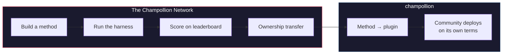

# Mạng lưới Champollion

> **Tóm tắt nội dung.** Mạng lưới Champollion là cơ sở hạ tầng mở để *tạo ra và tin tưởng* các tập dữ liệu kiểm thử dịch thuật cho càng nhiều cặp ngôn ngữ càng tốt — được xây dựng *cùng với* các chuyên gia và cộng đồng, không bao giờ thu thập trái phép từ họ — và để làm cho toàn bộ lĩnh vực này trở nên dễ định hướng: ai có thể dịch gì, mỗi phương pháp tốt đến mức nào trên từng loại văn bản, và những khoảng trống nằm ở đâu. Mọi phương pháp đều được chào đón, dù là con người hay máy móc. Bạn cũng có thể xây dựng và gửi một phương pháp, sau đó xem điểm số của nó so với các ngữ liệu thực tế. Đối với các ngôn ngữ mà cộng đồng cung cấp dữ liệu, quyền tối thượng là không thể thương lượng: những người cung cấp ngữ liệu sẽ nắm giữ chìa khóa của ngữ liệu đó và của bất kỳ thứ gì được đo lường dựa trên nó.

Phần này là trang chủ của bản đồ. Các trang bên dưới giải thích cách
mạng lưới các cặp ngôn ngữ được đo lường được xây dựng ([Cách Mạng lưới
Hoạt động](/docs/network/how-it-works)), tại sao hàng đợi công việc công khai lại xếp hạng những gì nó
xếp hạng ([Tại sao lại có Hàng đợi](/docs/network/perspectives/why-the-queue) và
[Đặc tả Xây dựng Hàng đợi](/docs/network/specifications/queue-construction)),
và cách tính toán độ mạnh của một kết nối
([Độ mạnh Kết nối](/docs/network/specifications/connection-strength)).
Nếu bạn đang quyết định xem có nên tin tưởng dự án này hay không, hãy bắt đầu với
[Những Hạn chế Thực tế](/docs/network/honest-limitations); nếu bạn đã biết
mình muốn xây dựng gì, cánh cửa dành cho bạn nằm ở
[Champollion Là Gì](/docs/what-is-champollion).

**Hệ thống chạy trên hai loại benchmark (điểm chuẩn).** *Benchmark công khai* sử dụng các tập dữ liệu mở để lập bản đồ và xếp hạng mọi phương pháp một cách công khai và ít tốn kém — cấp độ cơ sở dữ liệu mở/được thu thập, với rủi ro ô nhiễm dữ liệu được ghi chú rõ. *Benchmark có chủ quyền* là tiêu chuẩn vàng: các tập dữ liệu kiểm thử bí mật do cộng đồng ngôn ngữ tạo ra, sở hữu và kiểm soát, và Champollion **không bao giờ nhìn thấy** — được đánh giá mù, và chỉ khi cộng đồng cho phép. Bản thân cơ sở hạ tầng này có sẵn mã nguồn và được quản lý tập trung; những gì thuộc về cộng đồng là các tập dữ liệu kiểm thử cho ngôn ngữ của họ và các phương pháp được xây dựng cho ngôn ngữ đó.

:::info[Giai đoạn ra mắt/khởi đầu]
Mạng lưới này còn mới nhưng đã đi vào hoạt động: bảng xếp hạng chứa các lượt chạy thực tế đã được công bố
và mở cửa cho bất kỳ ai gửi kết quả. Để biết chính xác những gì chúng tôi tuyên bố và chưa
tuyên bố — xác minh, xác nhận từ cộng đồng, đánh giá trên dữ liệu giữ lại (held-out evaluation) — hãy xem
**[Những Hạn chế Thực tế](/docs/network/honest-limitations)**.
:::

---

## Vấn đề

Dịch vụ Cloud Translation của Google liệt kê 194 ngôn ngữ ([Danh sách công bố của Google](https://docs.cloud.google.com/translate/docs/languages)). NLLB-200 của Meta bao phủ 200 ngôn ngữ, và OMT-1600 (Tháng 3 năm 2026) tuyên bố hỗ trợ 1.600 ngôn ngữ. Có hơn 7.000 ngôn ngữ được sử dụng trên Trái Đất. Đối với khoảng 1.200 ngôn ngữ ở phần đuôi dài (long tail) của OMT-1600 — theo tính toán của chúng tôi: 1.600 ngôn ngữ mà nó bao phủ trừ đi hơn 400 ngôn ngữ mà các tác giả báo cáo là mô hình "hiểu đủ tốt" — trọng số mô hình không có sẵn, chất lượng dưới ngưỡng có thể sử dụng, và việc đánh giá sử dụng văn bản thuộc miền Kinh Thánh với các số liệu máy móc tiêu chuẩn — không có xác thực hình thái học, không có kiểm thử độc lập, không có sự quản trị của cộng đồng. Đối với khoảng 5.400 ngôn ngữ còn lại, không có mô hình huấn luyện trước nào tạo ra được bất kỳ kết quả đầu ra nào.

Các công ty công nghệ lớn (Big Tech) hiện đang đầu tư vào độ phủ ngôn ngữ ít tài nguyên (LRL) — nhưng độ phủ mà không có xác minh chất lượng độc lập, xác thực hình thái học, hoặc quản trị cộng đồng là độ phủ không đáng tin cậy. Những người nói các ngôn ngữ cần công cụ dịch thuật nhất lại chính là những cộng đồng ít có khả năng được xây dựng các công cụ đó nhất.

**Mạng lưới tồn tại để thay đổi điều đó.** Nó cung cấp cơ sở hạ tầng để tạo ra các tập dữ liệu kiểm thử, đánh giá bất kỳ phương pháp nào dựa trên chúng — dù là con người hay máy móc — và lập bản đồ kết quả, cho bất kỳ ngôn ngữ nào, với khả năng chấm điểm có thể tái tạo, gửi kết quả công khai, và sự quản trị của cộng đồng đối với việc ai kiểm soát dữ liệu và kết quả.

Dữ liệu ngôn ngữ là *dữ liệu sinh học (biodata)*. Giống như dữ liệu di truyền hoặc sức khỏe, một ngôn ngữ mang bản sắc và các mối quan hệ của những người nói nó, và nó không thể được ẩn danh một cách có ý nghĩa — vì vậy những người cung cấp ngữ liệu sẽ nắm giữ chìa khóa của ngữ liệu đó, và của bất kỳ thứ gì được đo lường dựa trên nó. Quyền tối thượng không phải là một tính năng được đắp thêm vào đây; nó là nền tảng để xây dựng những phần còn lại.

---

## Cách thức Hoạt động

1. **Bạn xây dựng một phương pháp dịch thuật** — LLM được hướng dẫn (coached LLM), mô hình tinh chỉnh (fine-tuned model), luồng xử lý có cổng FST (FST-gated pipeline), hoặc bất kỳ thứ gì khác tạo ra bản dịch.
2. **Hệ thống kiểm thử (harness) sẽ đánh giá nó** — các số liệu tiêu chuẩn hóa (chrF++, khớp chính xác, chấp nhận FST), được gắn dấu vân tay (fingerprinted) với một Git commit cụ thể.
3. **Kết quả xuất hiện trên bảng xếp hạng** — trực tiếp và mở cho các lượt gửi; mọi lượt chạy được công bố đều có thể tái tạo và so sánh được.
4. **Khi một phương pháp hoạt động hiệu quả, quyền sở hữu sẽ được chuyển giao** — đối với các ngôn ngữ bản địa, mã nguồn của phương pháp sẽ được chuyển giao cho tổ chức quản trị cộng đồng.
5. **Cộng đồng triển khai nó — nếu và theo cách họ chọn.** Phương pháp này được xuất dưới dạng một plugin [champollion](https://champollion.dev) và có thể chạy hoàn toàn trên cơ sở hạ tầng của cộng đồng. Champollion không lấy bất kỳ phần chia nào từ những gì nó kiếm được ở đó.

**Xây dựng ở đây. Triển khai ở đó.**

:::tip[Giải mã một ngôn ngữ, chiến thắng, trao trả lại]
Đây là một hoạt động benchmark ML có chủ đích — cạnh tranh là cách để các cặp ngôn ngữ khó
được giải quyết. Chúng tôi mời các nhà nghiên cứu ML và bất kỳ nhà phát triển có năng lực nào xây dựng phương pháp
tốt nhất cho một cặp ngôn ngữ khó cụ thể, **giành tiền thưởng khi có chương trình mở**, *và* trao
phương pháp thu được cho tổ chức có quyền tối thượng sở hữu ngôn ngữ đó. Năng lượng
cạnh tranh là có thật; nó hướng tới sứ mệnh, chứ không phải để leo lên
bảng xếp hạng vì mục đích cá nhân. Xem [Đặc tả Giải thưởng](/docs/network/specifications/prizes).
:::

---

## Dành cho Ai

| Bạn là... | Mạng lưới mang đến cho bạn... |
|---|---|
| **Kỹ sư / nhà nghiên cứu ML** | Các benchmark tiêu chuẩn hóa, chấm điểm có thể tái tạo, một ngữ liệu dùng chung để kiểm thử |
| **Nhà ngôn ngữ học** | Một framework để biến các quy tắc ngữ pháp và từ điển thành các phương pháp có thể kiểm thử |
| **Dịch giả chuyên nghiệp / con người** | Một nơi để đăng ký dịch vụ của bạn và được tìm thấy — dịch thuật bởi con người là một phương pháp hạng nhất ở đây, được liệt kê và đánh giá song song với máy móc, chứ không phải là một ý tưởng thêm thắt |
| **Thành viên cộng đồng ngôn ngữ** | Quyền quản trị đối với cách các phương pháp cho ngôn ngữ của bạn được phát triển và triển khai |
| **Nhà tài trợ / người xét duyệt tài trợ** | Các số liệu minh bạch, có thể tái tạo để đánh giá các đề xuất nghiên cứu dịch thuật |
| **Sinh viên** | Một lời mời mở với tác động thực tế — xây dựng một phương pháp, đóng góp kết quả của bạn |

---

## Các ngữ liệu tham chiếu được hỗ trợ

**Bảng xếp hạng đang hoạt động và vẫn ở giai đoạn đầu** — các đợt quét đầu tiên đã được công bố và
sẽ có thêm nhiều kết quả khi những người đóng góp chạy các mục trong hàng đợi. Những gì dưới đây không phải là một
bảng xếp hạng; nó là tập hợp các ngữ liệu tham chiếu công khai mà một bài gửi có thể được
chấm điểm dựa trên đó vào lúc này. Các ngữ liệu không bao giờ được lưu trữ ở đây: hệ thống kiểm thử (harness) lấy các tham chiếu từ
nguồn gốc (upstream source) tại thời điểm chạy và chấm điểm dựa trên dữ liệu vừa được lấy về.

### Global Voices (OPUS) — miền tin tức
- **Độ phủ:** 493 cặp ngôn ngữ được lập danh mục và có thể chạy (ví dụ: `eval-amh-fra-globalvoices-test-v1`, Tiếng Amharic → Tiếng Pháp)
- **Giấy phép:** CC BY 3.0
- **Nguồn:** [Global Voices thông qua OPUS](https://opus.nlpl.eu/)

### Tatoeba — miền hội thoại / hỗn hợp
- **Độ phủ:** 874 cặp ngôn ngữ được lập danh mục và có thể chạy (ví dụ: `eval-afr-eng-tatoeba-dev-v1`, Tiếng Afrikaans → Tiếng Anh)
- **Giấy phép:** CC BY 2.0
- **Nguồn:** [Cộng đồng Tatoeba](https://tatoeba.org)

:::note[EdTeKLA chỉ dành cho nghiên cứu — không phải là benchmark xếp hạng]
Ngữ liệu EdTeKLA Plains Cree (*Cree: Language of the Plains*) mang
[giấy phép CC BY-NC-SA **đã sửa đổi** của EdTeKLA](https://github.com/EdTeKLA/IndigenousLanguages_Corpora)
— các điều khoản phi thương mại, trong phạm vi quyền tối thượng (bản thân sách giáo khoa gốc là CC
BY-NC-ND 4.0). Nó được **loại ra khỏi mọi bảng xếp hạng** — nó không đủ điều kiện cho
bảng xếp hạng, bất kỳ giải thưởng nào, hoặc các luồng API/thương mại — và việc đánh giá
API mô hình từ xa đối với nó bị **kiểm soát bằng sự đồng thuận (consent-gated)**: hệ thống kiểm thử từ chối gửi
văn bản của nó tới các API mô hình của bên thứ ba trừ khi sự cho phép rõ ràng của người giữ bản quyền
được ghi nhận (việc đánh giá cục bộ vẫn có thể thực hiện).

FLORES+ **được** kết nối và có thể chạy ở đây (870 cặp được lập danh mục, ví dụ:
`eval-flores-devtest-v1-amh-fra`), nhưng nó có **độ ô nhiễm CAO** — dữ liệu đánh giá công khai,
được thu thập từ web mà các mô hình tiên tiến (frontier models) rất có thể đã nhìn thấy.
Do đó, nó **chỉ mang tính tương đối**: có thể sử dụng để so sánh trực tiếp các phương pháp, nhưng
**không bao giờ được báo cáo như một benchmark chất lượng tuyệt đối**, và nó **chỉ dành cho kiểm thử /
minh họa**. Kết quả FLORES+ không bao giờ được xếp hạng như một điểm số chất lượng và
không bao giờ được sử dụng làm cạnh chuỗi (chain edge) trên [bản đồ dịch thuật](https://champollion.dev).
Xem [Những Hạn chế Thực tế](/docs/network/honest-limitations) để biết chính xác những gì chúng tôi
tuyên bố và không tuyên bố.
:::

---

## Quy tắc Duy nhất

:::danger[Không huấn luyện trên dữ liệu đánh giá]
Các phương pháp tiếp xúc với tập dữ liệu benchmark — dưới dạng dữ liệu huấn luyện, ví dụ few-shot, mục từ điển, hoặc tài liệu prompt — sẽ bị **loại**. Bạn có thể tinh chỉnh trên bất cứ thứ gì bạn muốn. Chỉ là không được dùng tập dữ liệu kiểm thử.
:::

---

## Các bước Tiếp theo

- **[Gửi một Phương pháp](/docs/network/getting-started/submit-a-method)** — cách gửi lượt chạy benchmark đầu tiên của bạn
- **[Đặc tả Benchmark](/docs/network/specifications/benchmark)** — toàn bộ giao thức thử nghiệm
- **[Quy tắc Bảng xếp hạng](/docs/network/leaderboard/rules)** — tiêu chí gửi và các chính sách chống gian lận
- **[Quản lý Dữ liệu](/docs/network/sovereignty/data-sovereignty)** — ngữ liệu ở lại với người quản lý của chúng; mọi giấy phép đều được tôn trọng
- **[Cách thức Tài trợ cho Công việc](/docs/network/sovereignty/economic-model)** — phi thương mại và hiện đang tự tài trợ; đang tìm kiếm nhà tài trợ, và đích đến của từng đồng đô la đều được công bố

**[→ Xem Bảng xếp hạng](https://champollion.dev/leaderboard)**
