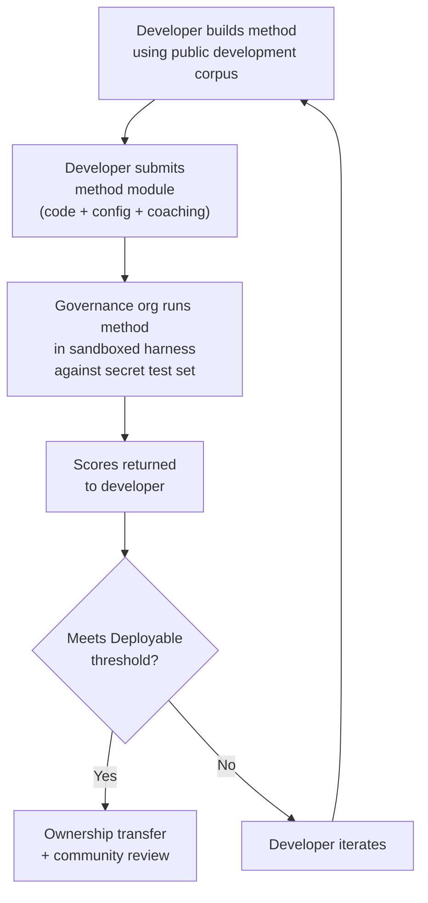

# Đặc tả Benchmark (Benchmark Specification)

> **Tóm tắt nội dung.** Tài liệu này định nghĩa giao thức đánh giá cho hệ sinh thái đánh giá dịch máy (MT) của Champollion: định dạng ngữ liệu (§2), lược đồ thẻ chạy (run card) (§3), giao thức benchmark (§6), yêu cầu xác thực từ con người (§7), cơ chế chủ quyền (§8), bảng xếp hạng và mô hình gửi bài (§9), khung chi phí (§10), và khả năng mở rộng sang các ngôn ngữ mới (§11). Để biết định nghĩa các chỉ số, trọng số điểm tổng hợp, ngưỡng cấp độ chất lượng, và công thức tính chỉ số chi phí/tốc độ, hãy xem `SCORING_SPEC.md` — nguồn chân lý duy nhất cho toàn bộ logic tính điểm. Tài liệu này tham chiếu đến SCORING_SPEC cho các chi tiết đó thay vì lặp lại chúng.


---

## 1. Nguyên tắc

### 1.1 Ngôn ngữ là Dữ liệu sinh học (Biodata)

Một ngôn ngữ không phải là tài liệu kiểm thử trung lập. Giống như dữ liệu di truyền hoặc sức khỏe, dữ liệu ngôn ngữ là **dữ liệu sinh học**: nó mang bản sắc, mối quan hệ huyết thống và các mối quan hệ của những người nói ngôn ngữ đó, và nó không thể được ẩn danh hóa một cách có ý nghĩa — loại bỏ siêu dữ liệu đi thì ngôn ngữ vẫn mã hóa việc những người đó là ai. Hệ quả đối với đặc tả này là rất cụ thể: những người cung cấp ngữ liệu nắm giữ chìa khóa của nó, và của bất kỳ thứ gì được đo lường dựa trên nó. Do đó, Chủ quyền (§8) không phải là một phần bổ sung cho giao thức; nó là một điều kiện tiên quyết của giao thức, và mọi nguyên tắc khác dưới đây đều hoạt động bên trong nó.

### 1.2 Chỉ số Tự động là các Chỉ số Đại diện (Proxies)

Mọi chỉ số được định nghĩa trong tài liệu này đều được tính toán bằng máy. chrF++, tỷ lệ chấp nhận FST, độ chính xác hình thái, độ tương đồng ngữ nghĩa — tất cả đều là các đại diện tự động cho chất lượng dịch thuật. Chúng hữu ích cho việc lặp lại nhanh chóng, so sánh hệ thống và phát hiện lỗi suy thoái (regressions). Chúng **không thay thế cho đánh giá của con người**.

Hệ thống phân cấp đánh giá:

```
Automated metrics (run cards, benchmarks)
    ↓ proxy for
Human review (bilingual speakers validate output)
    ↓ proxy for
Actual utility (does this help a language community?)
```

Không có điểm số tự động nào, dù cao đến đâu, có thể thay thế một người nói lưu loát đọc bản dịch đầu ra và xác nhận rằng nó chính xác, tự nhiên và phù hợp về mặt văn hóa. Các tầng chất lượng được định nghĩa trong §5 là các nhãn heuristic trên điểm số tổng hợp tự động — hữu ích cho việc theo dõi tiến trình, nhưng không bao giờ tự thân chúng là đủ.

### 1.3 Phương pháp, Không phải Mô hình

Chúng tôi benchmark **phương pháp**, không phải mô hình. Một mô hình chỉ là một thành phần. Một phương pháp là toàn bộ công thức: lựa chọn mô hình, thiết kế prompt, sử dụng công cụ, tiền/hậu xử lý, dữ liệu huấn luyện (coaching data), chiến lược thử lại, mọi thứ. Hai đội sử dụng cùng một mô hình với các phương pháp khác nhau sẽ nhận được điểm số khác nhau. Đó chính là mấu chốt.

### 1.4 Khả năng tái lập

Mọi kết quả benchmark phải có khả năng tái lập. Thẻ chạy (§3) ghi lại cấu hình hoàn chỉnh của một thử nghiệm. Dấu vân tay (§3.5) xác định thiết lập thử nghiệm. Mã băm thẻ chạy (§3.6) xác minh tính toàn vẹn của kết quả. Bất kỳ ai có cùng phương pháp, ngữ liệu và cấu hình đều phải đạt được điểm số trong khoảng ±2% (có tính đến tính không xác định khi lấy mẫu của LLM ở nhiệt độ temperature > 0).

### 1.5 Không sử dụng dữ liệu đánh giá tổng hợp

**Dự án này không tạo ra, sử dụng hoặc ủng hộ dữ liệu đánh giá tổng hợp.** Tất cả các ngữ liệu phải được lấy nguồn từ văn bản thực tế do con người viết — các bản dịch đã xuất bản, sách giáo khoa, tài liệu song ngữ hoặc các bản dịch được thu thập từ những người nói lưu loát.

LLM có thể hỗ trợ:
- Căn chỉnh câu (tìm các đoạn song song trong các văn bản song ngữ hiện có)
- Chuyển đổi định dạng (chuyển đổi tài liệu đã xuất bản sang schema ngữ liệu)
- Làm phong phú siêu dữ liệu (gợi ý các tầng độ khó, nhãn văn phong)
- Đề xuất các câu nguồn cho con người dịch (§11.3 — bước dịch luôn do con người thực hiện)

LLM **không bao giờ** được tạo ra các bản dịch tham chiếu hoặc các cặp đánh giá.

**Chúng tôi trung lập về mặt phát triển đối với dữ liệu huấn luyện.** Nếu một nhà phát triển phương pháp sử dụng dữ liệu huấn luyện tổng hợp, dịch ngược (backtranslation) hoặc tăng cường dữ liệu trong phương pháp của họ, đó là lựa chọn của họ — chúng tôi đánh giá kết quả đầu ra, không phải quá trình huấn luyện. Dự án OMT-1600 của Meta sử dụng khoảng 270 triệu câu song song tổng hợp được tạo ra thông qua dịch ngược. Chúng tôi không phản đối các phương pháp được huấn luyện theo cách này. Chúng tôi chỉ kiểm thử trên dữ liệu do con người tuyển chọn.

> **Tại sao không dùng văn bản Kinh Thánh để đánh giá?** OMT-1600 đánh giá 1.560 trong số 1.600 ngôn ngữ trên văn bản thuộc lĩnh vực Kinh Thánh (Meta AI, *Omnilingual MT*, arXiv:2603.16309, 2026). Các bản dịch Kinh Thánh có văn phong cổ xưa, từ vựng phụng vụ và cấu trúc câu theo công thức. Các ngữ liệu đánh giá của chúng tôi được lấy nguồn từ văn bản đa dạng về lĩnh vực, do cộng đồng tuyển chọn — các lĩnh vực y tế, pháp lý, giáo dục, chính phủ, hội thoại và kỹ thuật (xem §2.7). Đây là một lựa chọn thiết kế có chủ ý. Các cộng đồng cần dịch thuật cho các lĩnh vực mà họ thực sự sinh sống và làm việc, chứ không phải một văn phong tôn giáo duy nhất. Một phương pháp đạt điểm cao trên Sáng thế ký 1:1 hầu như không nói lên điều gì về hiệu suất của nó trên một chương trình nghị sự của hội đồng bộ tộc hoặc một biểu mẫu tiếp nhận của phòng khám.

---

## 2. Schema Ngữ liệu

Một ngữ liệu là một tập hợp được tuyển chọn gồm các cặp văn bản song song với siêu dữ liệu có cấu trúc. Đó là chân lý nền tảng (ground truth) để đo lường tất cả các phương pháp.

### 2.1 Dataset Envelope

Cấu trúc cấp cao nhất của một tệp ngữ liệu:

```json
{
  "dataset": {
    "id": "edtekla-dev-v1",
    "version": "1.0",
    "language_pair": "EN→CRK",
    "source_language": "en",
    "target_language": "crk",
    "created": "2026-05-01",
    "license": "LicenseRef-EdTeKLA-Modified-CC-BY-NC-SA-4.0",
    "provenance": ["gold_standard", "textbook"]
  },
  "entries": [ ... ]
}
```

| Trường | Kiểu | Bắt buộc | Mô tả |
|-------|------|----------|-------------|
| `id` | string | ✅ | Mã định danh tập dữ liệu duy nhất, được sử dụng trong thẻ chạy và bảng xếp hạng |
| `version` | string | ✅ | Phiên bản ngữ nghĩa. Việc tăng phiên bản sẽ làm mất hiệu lực các so sánh thẻ chạy trước đó |
| `language_pair` | string | ✅ | Nhãn hiển thị (ví dụ: `EN→CRK`) |
| `source_language` | string | ✅ | Mã ngôn ngữ nguồn BCP 47 |
| `target_language` | string | ✅ | Mã ngôn ngữ đích BCP 47 |
| `created` | string | ✅ | Ngày tạo ISO 8601 |
| `license` | string | ✅ | Mã định danh giấy phép SPDX |
| `provenance` | string[] | ✅ | Danh sách các thẻ nguồn gốc được sử dụng trên các mục nhập |

### 2.2 Schema Mục nhập (Entry Schema)

Mỗi mục nhập trong ngữ liệu đại diện cho một thử thách dịch thuật:

```json
{
  "id": 42,
  "source": "I see the dog",
  "reference": "niwâpamâw atim",
  "segment": "gold_standard",
  "difficulty": 2,
  "provenance": "gold_standard",
  "register": "conversational",
  "context": "declaration",
  "morphological_analysis": "ni-wâpam-âw atim | 1sg-see.TA-3sg.DIR dog.AN",
  "notes": "Animate noun (atim); direct form because speaker is proximate",
  "variant_class": "simple-ta-direct"
}
```

| Trường | Kiểu | Bắt buộc | Mô tả |
|-------|------|----------|-------------|
| `id` | integer | ✅ | Mã định danh duy nhất trong ngữ liệu |
| `source` | string | ✅ | Văn bản nguồn bằng ngôn ngữ nguồn |
| `reference` | string | ✅ | Bản dịch tham chiếu chuẩn vàng (gold-standard) bằng ngôn ngữ đích |
| `segment` | string | 📎 | Phân vùng ngữ liệu: `gold_standard`, `held_out`, `development`, hoặc `diagnostic` |
| `difficulty` | integer | 📎 | Đánh giá độ khó 1–5 (xem §2.4) |
| `provenance` | string | 📎 | Nguồn gốc của mục nhập này (xem §2.5) |
| `register` | string | 📎 | Văn phong/mức độ trang trọng (xem §2.6) |
| `context` | string | 📎 | Chức năng giao tiếp (xem §2.6) |
| `domain` | string | 📎 | Lĩnh vực sử dụng từ phân loại 16 mã (xem §2.7). Phải là một trong: `conv`, `ecommerce`, `edu`, `financial`, `gov`, `legal`, `literary`, `marketing`, `medical`, `news`, `religious`, `scientific`, `subtitles`, `support`, `tech`, `ui`. Được xác thực tại thời điểm xây dựng. |

> **📎 = KHUYẾN NGHỊ.** Bộ khung xử lý các trường tùy chọn bị thiếu một cách mượt mà thông qua các giá trị mặc định. Các ngữ liệu của bên thứ ba chỉ cần cung cấp `id`, `source`, và `reference` cho mỗi mục nhập.
| `morphological_analysis` | string | ❌ | Phân tích hình thái chuẩn vàng |
| `notes` | string | ❌ | Ghi chú của người dịch, các biến thể phương ngôn, cờ mơ hồ |
| `variant_class` | string | ❌ | Nhãn lớp nhóm các biến thể dịch thuật được chấp nhận |


### 2.3 Các phân đoạn ngữ liệu (Corpus Segments)

Ngữ liệu được chia thành các phân đoạn với các mức độ truy cập khác nhau:

| Phân đoạn | Mục đích | Truy cập | Kích thước tối thiểu |
|---------|---------|--------|-------------|
| `development` | Phát triển và lặp lại phương pháp. Các nhà phát triển sử dụng những thứ này một cách tự do. | **Công khai** | 30 mục nhập |
| `diagnostic` | Các bài kiểm thử có mục tiêu cho các hiện tượng ngôn ngữ cụ thể. | **Công khai** | 10 mục nhập |
| `gold_standard` | Đánh giá benchmark chính thức. Điểm số trên bảng xếp hạng đến từ đây. | **Bí mật** — do tổ chức quản trị nắm giữ | 50 mục nhập |
| `held_out` | Dành riêng cho đánh giá trong tương lai. Không bao giờ được sử dụng cho đến khi được kích hoạt. | **Bí mật** — do tổ chức quản trị nắm giữ | 10 mục nhập |

> **Trạng thái hiện tại:** Chỉ có phân đoạn `development` tồn tại trong các tập dữ liệu được phân phối. Các phân đoạn `diagnostic`, `gold_standard`, và `held_out` được định nghĩa cho việc sử dụng trong tương lai khi các ngữ liệu phát triển.

Các phân đoạn `gold_standard` và `held_out` hoàn toàn bí mật. Cả câu nguồn và bản dịch tham chiếu đều được lưu trữ trên cơ sở hạ tầng do tổ chức quản trị kiểm soát. Các nhà phát triển phương pháp không bao giờ nhìn thấy câu hỏi hoặc câu trả lời. Xem §8 để biết cơ chế chủ quyền.

### 2.4 Các tầng độ khó (Difficulty Tiers)

| Tầng | Mô tả | Ví dụ |
|------|-------------|----------|
| 1 — Từ vựng cơ bản | Từ đơn, lời chào thông thường, số đếm | "hello" → "tânisi", "dog" → "atim" |
| 2 — Câu đơn giản | Chủ ngữ-động từ hoặc SVO, thì hiện tại | "I see the dog" → "niwâpamâw atim" |
| 3 — Độ phức tạp trung bình | Thì quá khứ/tương lai, sở hữu cách, tính hoạt tính (animacy) | "I saw his dog yesterday" |
| 4 — Hình thái phức tạp | Sự chuyển dịch ngôi (obviation), thể bị động, conjunct order, mệnh đề quan hệ | "the woman whose son went to the store" |
| 5 — Nâng cao | Nhiều mệnh đề, văn phong trang trọng, nghi lễ, thành ngữ | Đoạn văn đầy đủ với giọng điệu phù hợp với văn phong |

Một ngữ liệu được xây dựng tốt nên bao gồm các mục nhập trên cả năm tầng độ khó, tập trung nhiều vào các tầng 2–4 nơi hầu hết các thử thách dịch thuật thực tế xuất hiện.

### 2.5 Thẻ nguồn gốc (Provenance Tags)

Mỗi mục nhập phải chỉ ra nguồn gốc của nó:

| Thẻ | Ý nghĩa |
|-----|---------|
| `gold_standard` | Được xác minh bởi những người nói lưu loát |
| `textbook` | Từ các tài liệu giáo dục đã xuất bản |
| `elicited` | Được tạo ra thông qua các phiên thu thập có cấu trúc |
| `corpus` | Được trích xuất từ một ngữ liệu song song |

> **Lưu ý:** Trong thực tế, các giá trị nguồn gốc là các chuỗi tự do. Các thẻ ở trên là các quy ước, không phải là một enum được xác thực — các tập dữ liệu có thể sử dụng các chuỗi nguồn gốc mô tả khác.

### 2.6 Văn phong và Ngữ cảnh

**Văn phong (Register)** mô tả mức độ trang trọng và ngữ cảnh xã hội:

| Văn phong | Mô tả |
|----------|-------------|
| `conversational` | Giao tiếp hàng ngày giữa những người ngang hàng |
| `formal` | Ngôn ngữ chính thức hoặc thể chế |
| `technical` | Từ vựng chuyên ngành |
| `ceremonial` | Sử dụng ngôn ngữ truyền thống hoặc thiêng liêng |
| `educational` | Tài liệu giảng dạy ngôn ngữ |

**Ngữ cảnh (Context)** mô tả chức năng giao tiếp:

> 🔲 **Đang lên kế hoạch.** Trường `context` được định nghĩa trong schema nhưng chưa được điền dữ liệu trong các tập dữ liệu hiện tại. Nó được dành riêng cho việc làm phong phú ngữ liệu trong tương lai.

| Ngữ cảnh | Mô tả |
|---------|-------------|
| `greeting` | Chào hỏi xã giao hoặc tạm biệt |
| `declaration` | Tuyên bố thực tế |
| `question` | Câu hỏi |
| `instruction` | Mệnh lệnh hoặc chỉ thị |
| `narrative` | Kể chuyện hoặc mô tả |
| `label` | Nhãn giao diện người dùng, văn bản nút hoặc tiêu đề |
| `error` | Thông báo lỗi hoặc cảnh báo |

### 2.7 Lĩnh vực (Domain) {#27-domain}

**Lĩnh vực** mô tả trường hợp sử dụng thực tế — loại nội dung đang được dịch. Điều này độc lập với văn phong và ngữ cảnh:

- **Văn phong** trả lời: *Mức độ trang trọng của câu này như thế nào?*
- **Ngữ cảnh** trả lời: *Câu này đang thực hiện chức năng gì?*
- **Lĩnh vực** trả lời: *Câu này dành cho ngành nghề/trường hợp sử dụng nào?*

Một hợp đồng pháp lý (lĩnh vực: `legal`) có thể trang trọng (văn phong: `formal`) và chứa một tuyên bố (ngữ cảnh: `declaration`). Một bản ghi trò chuyện của chatbot pháp lý (lĩnh vực: `legal`) có thể mang tính hội thoại (văn phong: `conversational`) và chứa các câu hỏi (ngữ cảnh: `question`). Cùng một lĩnh vực, nhưng văn phong và ngữ cảnh khác nhau.

| Mã lĩnh vực | Mô tả | Đối tượng tiêu dùng điển hình |
|-------------|-------------|-------------------|
| `ui` | Các chuỗi giao diện phần mềm | Nhà phát triển ứng dụng, đội ngũ bản địa hóa |
| `legal` | Hợp đồng, điều lệ, hồ sơ tòa án, tài liệu nhập cư | Công ty luật, tòa án, đội ngũ tuân thủ, luật sư sở hữu trí tuệ |
| `medical` | Ghi chú lâm sàng, nhãn thuốc, giao tiếp với bệnh nhân, đề cương thử nghiệm | Bệnh viện, công ty dược phẩm, thử nghiệm lâm sàng, cổng thông tin bệnh nhân |
| `financial` | Ngân hàng, bảo hiểm, hồ sơ quản lý, báo cáo kiểm toán | Ngân hàng, công ty bảo hiểm, cơ quan quản lý, kiểm toán viên |
| `edu` | Sách giáo khoa, chương trình giảng dạy, giáo án, tài liệu học thuật | Trường học, trường đại học, nhà xuất bản sách giáo khoa |
| `ecommerce` | Mô tả sản phẩm, đánh giá, danh sách chợ trực tuyến | Nhà bán lẻ trực tuyến, người bán trên chợ trực tuyến |
| `marketing` | Bản sao quảng cáo, thông điệp thương hiệu, chiến dịch, khẩu hiệu | Công ty quảng cáo, đội ngũ thương hiệu |
| `gov` | Tài liệu chính sách, quy định, thông báo công cộng, luật pháp | Cơ quan chính phủ, đội ngũ tuân thủ |
| `scientific` | Bài báo nghiên cứu, tóm tắt, phương pháp luận, đề xuất tài trợ | Nhà nghiên cứu, tạp chí, cơ quan tài trợ |
| `religious` | Kinh thánh, văn bản phụng vụ, bình luận thần học | Cộng đồng đức tin, nhà xuất bản phụng vụ |
| `support` | Câu hỏi thường gặp, thông báo lỗi, hướng dẫn khắc phục sự cố, kịch bản chatbot | Công ty SaaS, bàn trợ giúp |
| `subtitles` | Đối thoại trong phim, truyền hình, phát trực tuyến và trò chơi | Nền tảng phát trực tuyến, studio, công ty trò chơi |
| `news` | Báo chí, báo cáo thông tấn, xã luận, thông cáo báo chí | Tổ chức truyền thông, hãng thông tấn |
| `literary` | Viễn tưởng, thơ ca, tự sự, văn bản văn hóa | Nhà xuất bản, tổ chức bảo tồn văn hóa |
| `conv` | Hội thoại thân mật, mạng xã hội, nhắn tin | Ứng dụng tiêu dùng, nền tảng xã hội |
| `tech` | Tài liệu API, hướng dẫn sử dụng, đặc tả kỹ thuật, hướng dẫn kỹ thuật | Đội ngũ tài liệu, tổ chức kỹ thuật |

> **Các benchmark theo lĩnh vực cụ thể.** Benchmark chung đánh giá một phương pháp trên tất cả các lĩnh vực. Nhưng Mạng lưới cũng hỗ trợ **các benchmark được lọc theo lĩnh vực** — nơi điểm số chỉ được tính trên các mục nhập được gắn thẻ với một lĩnh vực cụ thể. Điều này giúp người dùng trả lời: "Phương pháp nào tốt nhất để dịch tài liệu pháp lý sang tiếng Pháp?" so với "Phương pháp nào có điểm tiếng Pháp tổng thể tốt nhất?"
>
> Bảng xếp hạng được lọc theo lĩnh vực cho phép người dùng so sánh các phương pháp trong một trường hợp sử dụng duy nhất. Các phương pháp khác nhau hoạt động khác nhau trên các lĩnh vực — một phương pháp được tinh chỉnh trên thuật ngữ pháp lý có thể đạt điểm cao hơn nhiều trên văn bản pháp lý so với văn bản hội thoại. Mạng lưới giúp người dùng tìm thấy phương pháp hoạt động tốt nhất cho trường hợp sử dụng cụ thể của họ.

> **Tương lai: Trợ lý Mạng lưới.** Một trợ lý hội thoại giúp người dùng mô tả trường hợp sử dụng MT của họ (lĩnh vực, cặp ngôn ngữ, yêu cầu chất lượng) và hiển thị các phương pháp có liên quan đã được cộng đồng xác thực từ bảng xếp hạng — ví dụ: "phương pháp nào đạt điểm cao nhất trên các benchmark EN→JA thuộc lĩnh vực y tế?" — là một công cụ hỗ trợ điều hướng mà chúng tôi đang xem xét, phụ thuộc vào việc có đủ dữ liệu đánh giá được gắn thẻ lĩnh vực và sự đa dạng của phương pháp.

---

## 3. Schema Thẻ chạy (Run Card Schema) {#3-run-card-schema}

Thẻ chạy là đơn vị đánh giá nguyên tử. Nó là một tài liệu JSON độc lập ghi lại cấu hình và kết quả hoàn chỉnh của một lượt chạy đánh giá duy nhất: một phương pháp, một mô hình, một cấu hình, một tập dữ liệu.

Mỗi thẻ chạy ghi lại ba khía cạnh:
- **Chất lượng** — các bản dịch tốt đến mức nào?
- **Chi phí** — chi phí để tạo ra chúng là bao nhiêu?
- **Tốc độ** — mất bao lâu để thực hiện?

### 3.1 Các trường cấp cao nhất

| Trường | Kiểu | Mô tả |
|-------|------|-------------|
| `run_id` | string | UUID v4 được tạo khi bắt đầu lượt chạy |
| `harness_version` | string | Phiên bản ngữ nghĩa của bộ khung (ví dụ: `2.0`) |
| `timestamp` | string | Dấu thời gian UTC ISO 8601 khi lượt chạy bắt đầu |
| `elapsed_seconds` | number | Thời gian thực tế (wall-clock duration) của toàn bộ lượt chạy |

### 3.2 Cấu hình phương pháp (Method Configuration)

Các trường này định nghĩa thiết lập thử nghiệm — những gì đã được kiểm thử và cách thức thực hiện.

| Trường | Kiểu | Bắt buộc | Mô tả |
|-------|------|----------|-------------|
| `model_slug` | string | ✅ | Mã định danh mô hình (ví dụ: `google/gemini-2.5-flash`) |
| `model_id` | string | ❌ | Mã định danh mô hình đã phân giải được trả về bởi API |
| `condition` | string | ✅ | Nhãn thử nghiệm (ví dụ: `baseline`, `coached-v3`, `few-shot`) |
| `temperature` | number | ✅ | Nhiệt độ lấy mẫu (sampling temperature) |
| `system_prompt_sha256` | string | ✅ | Mã băm SHA-256 của toàn bộ system prompt |
| `system_prompt_used` | string | ✅ | Toàn bộ văn bản system prompt |
| `coaching_data_sha256` | string | ❌ | Mã băm SHA-256 của tệp dữ liệu huấn luyện (coaching data), nếu được sử dụng |
| `fst_version` | string | ❌ | Phiên bản của bộ phân tích FST, nếu được sử dụng |
| `tools_enabled` | string[] | ❌ | Danh sách các công cụ có sẵn cho phương pháp |
| `batch_size` | number | ❌ | Số lượng mục nhập trên mỗi lô API đồng thời |
| `max_retries` | number | ❌ | Số lần thử lại tối đa cho việc từ chối FST, nếu áp dụng |

:::info[Run Card đã xuất bản bao gồm method_config]
Khi một run card được xuất bản lên bảng xếp hạng (thông qua `mt-eval publish`), nó cũng bao gồm một khối `method_config` chứa MethodConfig 8 trường chuẩn (canonical) (`model`, `temperature`, `batchSize`, `register`, `coachingFile`, `coachingPrompt`, `promptContext`, `qualityTier` — tất cả đều ở dạng camelCase). Điều này cho phép nhập khẩu không cần tái cấu trúc (zero-reconstruction import): `champollion leaderboard --install` đọc trực tiếp `method_config` và ghi nó dưới dạng một manifest của plugin. Các trường đo lường từ xa (telemetry) ở trên (§3.2) ghi lại những gì harness đã ghi nhận; `method_config` ghi lại những gì nhà phát triển đã dự định.
:::

### 3.3 Tham chiếu tập dữ liệu (Dataset Reference)

| Trường | Kiểu | Mô tả |
|-------|------|-------------|
| `dataset.id` | string | Mã định danh tập dữ liệu |
| `dataset.version` | string | Phiên bản tập dữ liệu |
| `dataset.language_pair` | string | Nhãn hiển thị |
| `dataset.sha256` | string | Mã băm SHA-256 của nội dung tệp tập dữ liệu |
| `dataset.entry_count` | number | Số lượng mục nhập được đánh giá |

Mã băm SHA-256 của tập dữ liệu ghim kết quả vào một phiên bản dữ liệu cụ thể. Nếu tập dữ liệu thay đổi, các thẻ chạy cũ sẽ không thể so sánh được.

### 3.4 Điểm số (Chất lượng)

Các chỉ số tổng hợp cho toàn bộ lượt chạy. Tất cả các chỉ số chất lượng đều được **tính toán tự động** — xem §1.2.

| Trường | Kiểu | Mô tả |
|-------|------|-------------|
| `scores.total` | number | Tổng số mục nhập được đánh giá |
| `scores.exact_matches` | number | Các mục nhập có kết quả đầu ra khớp chính xác với bản dịch tham chiếu |
| `scores.exact_match_rate` | number | 0.0–1.0 |
| `scores.equivalent_matches` | number | Các mục nhập khớp với một biến thể được chấp nhận |
| `scores.equivalent_match_rate` | number | 0.0–1.0 |
| `scores.fst_accepted` | number | Các mục nhập được chấp nhận bởi bộ phân tích FST |
| `scores.fst_acceptance_rate` | number | 0.0–1.0, `null` nếu không có FST nào được cấu hình |
| `scores.morphological_accuracy` | number | 0.0–1.0, dựa trên FST (khớp bổ đề), `null` nếu không có FST / không có từ khớp bổ đề. Mang tính chất tham khảo cho đến khi được kích hoạt — xem Scoring Spec §2.2 |
| `scores.morph_coverage` | number | 0.0–1.0, tỷ lệ các từ dự đoán có thể phân tích được khớp bổ đề với bản dịch tham chiếu (tiết lộ mức độ thưa thớt của `morphological_accuracy`) |
| `scores.chrf_plus_plus` | number | Điểm chrF++ cấp độ ngữ liệu (0–100) |
| `scores.semantic_score` | number | Độ tương đồng ngữ nghĩa dựa trên embedding (0.0–1.0) |
| `scores.ter` | number | Tỷ lệ lỗi chỉnh sửa dịch thuật (Translation Edit Rate) (0–∞, càng thấp càng tốt) |
| `scores.length_ratio` | number | avg(len(predicted)/len(reference)), lý tưởng = 1.0 |
| `scores.code_switching_rate` | number | 0.0–1.0, tỷ lệ các mục nhập bị rò rỉ ngôn ngữ nguồn |
| `scores.hallucination_rate` | number | 0.0–1.0, tỷ lệ các mục nhập có nội dung ảo tưởng (hallucinated) |
| `scores.terminology_adherence` | number | 0.0–1.0, mức độ tuân thủ các thuật ngữ trong bảng thuật ngữ (glossary) (`null` nếu không có bảng thuật ngữ) |
| `scores.tokens_per_second` | number | total_tokens / elapsed_seconds |
| `scores.entries_per_minute` | number | số mục nhập được dịch mỗi phút |
| `scores.composite` | number | Điểm tổng hợp có trọng số (0.0–1.0). Xem SCORING_SPEC §4 |
| `scores.errors` | number | Các mục nhập bị lỗi (lỗi API, hết thời gian chờ, v.v.) |
| `scores.by_difficulty` | object | Điểm số được chia nhỏ theo tầng độ khó |
| `scores.by_provenance` | object | Điểm số được chia nhỏ theo thẻ nguồn gốc |
| `scores.by_domain` | object | ✅ Đã triển khai — Điểm số được chia nhỏ theo lĩnh vực (§2.7). Cho phép xếp hạng bảng xếp hạng được lọc theo lĩnh vực. Được tính toán bởi tester.py và truyền qua publish.py. |

### 3.5 Tổng số (Chi phí)

| Trường | Kiểu | Mô tả |
|-------|------|-------------|
| `totals.prompt_tokens` | number | Tổng số token đầu vào trên tất cả các cuộc gọi API |
| `totals.completion_tokens` | number | Tổng số token đầu ra |
| `totals.reasoning_tokens` | number | Token được sử dụng cho chuỗi suy nghĩ (chain-of-thought) (0 đối với hầu hết các mô hình) |
| `totals.cached_tokens` | number | Token được phục vụ từ bộ nhớ đệm prompt của nhà cung cấp |
| `totals.total_cost_usd` | number | Tổng chi phí tính bằng USD |
| `totals.cost_per_entry_usd` | number | `total_cost_usd / entry_count` |
| `totals.cost_per_source_char` | number | USD trên mỗi ký tự nguồn — có thể so sánh giữa các ngôn ngữ |

### 3.6 Thời gian (Tốc độ)

| Trường | Kiểu | Mô tả |
|-------|------|-------------|
| `elapsed_seconds` | number | Thời gian thực tế của toàn bộ lượt chạy (cấp cao nhất) |
| `scores.avg_latency_seconds` | number | Thời gian phản hồi trung bình (mean) cho mỗi mục nhập |
| `scores.median_latency_seconds` | number | Thời gian phản hồi trung vị (median) cho mỗi mục nhập |
| `scores.p95_latency_seconds` | number | Thời gian phản hồi ở phân vị thứ 95 cho mỗi mục nhập |

### 3.7 Kết quả theo từng mục nhập (Per-Entry Results)

Mỗi mục nhập trong mảng `results[]` ghi lại một bản dịch. Dữ liệu theo từng mục nhập được lưu trữ trong bảng `run_card_entries` (migration 005) với các phán quyết LYSS phi chuẩn hóa (migration 006).

| Trường | Kiểu | Mô tả |
|-------|------|-------------|
| `entry_id` | string | Khớp với `entries[].id` trong ngữ liệu |
| `source` | string | Văn bản nguồn đã được dịch |
| `expected` | string | Bản dịch tham chiếu chuẩn vàng |
| `raw_predicted` | string \| null | Đầu ra thô của mô hình trước khi hậu xử lý |
| `predicted` | string | Đầu ra thực tế của phương pháp (đã qua hậu xử lý) |
| `segment` | string | Mã định danh phân đoạn (ví dụ: chỉ mục câu) |
| `difficulty` | string \| null | Tầng độ khó từ ngữ liệu |
| `domain` | string | Thẻ lĩnh vực từ ngữ liệu (§2.7) |
| `exact_match` | boolean | Liệu đầu ra có khớp chính xác với bản dịch tham chiếu hay không |
| `chrf_score` | number \| null | chrF++ cấp độ câu (0–100) |
| `bleu_score` | number \| null | BLEU cấp độ câu (0–100) |
| `latency_s` | number \| null | Thời gian phản hồi tính bằng giây |
| `cost_usd` | number \| null | Chi phí tính bằng USD cho mục nhập này |
| `tool_call_count` | integer | Số lượng cuộc gọi công cụ được sử dụng (0 nếu không có) |
| `error` | string \| null | Thông báo lỗi nếu mục nhập này bị lỗi |
| `plugin_metrics` | object | Đầu ra plugin đầy đủ cho mỗi mục nhập (JSONB) |
| `fst_valid` | boolean \| null | GiellaLT FST đã chấp nhận dự đoán (LYSS-fst phi chuẩn hóa) |
| `equivalent_match` | boolean \| null | Bộ linter CRK đã xác nhận tính tương đương cấu trúc (LYSS-eq phi chuẩn hóa) |
| `semantic_verdict` | string \| null | Phán quyết LYSS-sem: `VALID`, `MISMATCH`, `UNKNOWN`, `ERROR` |
| `code_switching_detected` | boolean \| null | Phát hiện các token ngôn ngữ nguồn trong đầu ra |
| `hallucination_detected` | boolean \| null | Phát hiện nội dung bịa đặt trong đầu ra |


### 3.8 Dấu vân tay (Fingerprint)

Một định danh cho khả năng tái lập. Hai lượt chạy có fingerprint giống hệt nhau nghĩa là đã sử dụng cùng một thiết lập thử nghiệm.

Dấu vân tay là mã băm SHA-256 của chuỗi nối đã được sắp xếp của:
- `dataset.sha256`
- `model_slug`
- `condition`
- `system_prompt_sha256`
- `temperature`
- `harness_version`
- `batch_size`
- `tools_enabled`

> **Tại sao lại là 8 thành phần?** Kích thước lô và việc gọi công cụ ảnh hưởng đáng kể đến chất lượng đầu ra và phải được đưa vào định danh. Hai lượt chạy có kích thước lô khác nhau hoặc các công cụ được kích hoạt khác nhau là các thiết lập thử nghiệm khác nhau, ngay cả khi tất cả các tham số khác đều khớp.

Hai lượt chạy có dấu vân tay giống hệt nhau sẽ tạo ra các kết quả có thể so sánh được. Sự khác biệt là do tính không xác định của API (nhiệt độ temperature > 0) hoặc các cập nhật mô hình từ phía nhà cung cấp.

### 3.9 Mã băm thẻ chạy (Run Card Hash)

Mã băm SHA-256 của toàn bộ tệp JSON thẻ chạy (với chính trường `run_card_hash` được đặt thành `""` trong quá trình băm). Đây là niêm phong phát hiện giả mạo. Nếu bất kỳ trường nào thay đổi, mã băm sẽ bị hỏng.

---

## 4. Các chỉ số tự động

Tất cả các chỉ số trong phần này đều được tính toán bằng máy. Xem §1.2.

### 4.1 Định nghĩa chỉ số

| Chỉ số | Trạng thái | Đo lường cái gì | Phạm vi |
|--------|--------|-----------------|-------|
| **chrF++** | ✅ Đã triển khai | Điểm F-score của n-gram ký tự. Hoạt động ở cấp độ ký tự, giúp nó mạnh mẽ hơn các chỉ số cấp độ từ (BLEU) đối với các ngôn ngữ giàu hình thái, nơi các từ dài và bị biến đổi cao. Được tính toán bởi sacrebleu. | 0–100 (thang đo gốc). Chia cho 100 khi sử dụng trong điểm tổng hợp. |
| **Tỷ lệ chấp nhận FST** | ✅ Đã triển khai | Tỷ lệ các từ dự đoán được chấp nhận bởi bộ phân tích hình thái (GiellaLT HFST) dưới dạng các dạng hợp lệ trong ngôn ngữ đích. Một từ được FST chấp nhận là một từ thực tế, có cấu trúc hợp lệ — không phải là một sự ảo tưởng. | 0.0–1.0 |
| **Khớp chính xác** | ✅ Đã triển khai | Tỷ lệ các dự đoán khớp chính xác với bản dịch tham chiếu sau khi chuẩn hóa Unicode. Nghiêm ngặt nhưng không mơ hồ — hữu ích như một bước kiểm tra trần (ceiling check). | 0.0–1.0 |
| **Độ chính xác hình thái** | 🔲 Đang lên kế hoạch | Đối với các mục nhập có phân tích hình thái chuẩn vàng: tỷ lệ các hình vị (morphemes) được tạo ra chính xác. Chi tiết hơn tỷ lệ chấp nhận FST — một từ có thể hợp lệ về mặt FST nhưng có cấu trúc hình vị sai (đúng gốc từ, sai thì). | 0.0–1.0 |
| **Khớp tương đương** | ⚡ Một phần | Tỷ lệ khớp với một biến thể được chấp nhận của bản dịch tham chiếu — tính đến trật tự từ, sự khác biệt về phương ngôn và các quy ước chính tả. Hiện tại được triển khai cho CRK thông qua `CrkLinterMetric` của tiêu chuẩn đánh giá CRK (trong `eval_standards/crk/`); được tải tự động thông qua khai báo `evalMetrics` của thẻ ngôn ngữ CRK. Triển khai chung yêu cầu `variants[]` cho từng mục nhập trong ngữ liệu. | 0.0–1.0 |
| **Điểm ngữ nghĩa** | ⚡ Một phần | Sự bảo toàn ý nghĩa bất kể hình thức bề mặt. Hiện tại được triển khai cho CRK thông qua `CrkSemanticMetric` của tiêu chuẩn đánh giá CRK (trong `eval_standards/crk/`, đại diện có trọng số phán quyết). Độ tương đồng cosine dựa trên embedding phổ quát đang được lên kế hoạch — xem SCORING_SPEC §2.3. | 0.0–1.0 |

### 4.2 Điểm tổng hợp (Composite Score)

Điểm tổng hợp là trung bình cộng có trọng số của tất cả các chỉ số *hiện có*:

```
composite = Σ (weight_i × metric_i)   for all available metrics
             ─────────────────────
             Σ weight_i              (renormalized to sum to 1.0)
```

Khi một chỉ số không khả dụng (không có FST nào được cấu hình, không có lớp biến thể nào được định nghĩa, không có mô hình embedding), trọng số của nó sẽ được phân phối lại theo tỷ lệ trên các chỉ số còn lại. Điều này có nghĩa là điểm tổng hợp luôn có thể so sánh được trong phạm vi một ngôn ngữ — nó sử dụng bất kỳ chỉ số nào khả dụng cho ngôn ngữ đó và chuẩn hóa tương ứng.

**Các bảng trọng số, quy tắc chuẩn hóa đầu vào và danh mục chỉ số đầy đủ được định nghĩa trong `SCORING_SPEC.md` §4.** Tài liệu đó là SSOT cho:
- Trọng số Profile A (các ngôn ngữ có hỗ trợ FST — 9 chỉ số, các chỉ số cấu trúc chiếm 40%)
- Trọng số Profile B (các ngôn ngữ không có hỗ trợ FST — 8 chỉ số)
- Quy tắc chuẩn hóa (chrF++ ÷ 100, đảo ngược tỷ lệ chuyển đổi mã và ảo tưởng)
- Các chỉ số bị loại trừ khỏi điểm tổng hợp (BLEU, COMET, TER, tỷ lệ độ dài, tính nhất quán) và lý do tại sao

Mã nguồn của bộ khung phản ánh các bảng này trong `mt_eval_harness/scoring.py`. Khi SCORING_SPEC thay đổi, `scoring.py` được cập nhật để khớp và `test_scoring_ssot.py` xác minh sự căn chỉnh.

> **Tại sao không dùng BLEU?** BLEU hoạt động ở cấp độ từ và phạt các biến thể hình thái. Đối với các ngôn ngữ đa tổng hợp (polysynthetic), một từ duy nhất có thể là cả một mệnh đề — BLEU sẽ coi các khác biệt nhỏ về biến hình là các lỗi hoàn toàn. chrF++ xử lý điều này tốt hơn bằng cách hoạt động ở cấp độ ký tự. BLEU bị loại trừ khỏi cả hai bảng trọng số. Xem SCORING_SPEC Phụ lục A để biết lý do đầy đủ.


### 4.3 Điểm số điều chỉnh theo chi phí (Cost-Adjusted Score)

Đối với các phương pháp sử dụng API trả phí, chúng tôi cũng báo cáo một bảng xếp hạng phụ. Công thức điều chỉnh theo chi phí được định nghĩa trong `SCORING_SPEC.md` §6.3.

---

## 5. Phân hạng Chất lượng (Quality Tiers) {#5-quality-tiers}

Các tầng chất lượng là các nhãn heuristic trên điểm số tổng hợp tự động. Chúng mô tả ý nghĩa của các điểm số trong thực tế, dựa trên đánh giá của con người đối với các kết quả đầu ra ở từng cấp độ. **Chúng không phải là các đánh giá chất lượng đã được xác thực** — chỉ có đánh giá của con người (§6) mới có thể xác nhận khả năng sử dụng thực tế.

**Các ngưỡng và mô tả tầng được định nghĩa trong `SCORING_SPEC.md` §5.** Các tầng gồm có: Cơ bản (Baseline) (0.00–0.30), Mới nổi (Emerging) (0.30–0.50), Khả dụng (Functional) (0.50–0.70), Có thể triển khai (Deployable) (0.70–0.85), và Lưu loát (Fluent) (0.85–1.00).

> [!IMPORTANT]
> **Các tầng tự động chỉ mang tính tạm thời.** Các nhãn này là các đề cử để đánh giá, không phải là các tuyên bố chất lượng. Một phương pháp đạt đến mức "Có thể triển khai" trên các chỉ số tự động là một ứng viên cho việc đánh giá của cộng đồng — chứ không phải là một sản phẩm để phát hành. Chỉ có đánh giá của con người (§7) mới có thể xác nhận khả năng sử dụng thực tế. Ranh giới các tầng có thể khác nhau giữa các ngôn ngữ.

Các tầng này mang tính tạm thời. Chúng sẽ được hiệu chuẩn lại khi dữ liệu xác thực của con người tích lũy và chúng tôi tìm hiểu xem ngưỡng thực tế "một người nói thấy điều này hữu ích" nằm ở đâu cho từng ngôn ngữ. Ranh giới các tầng có thể khác nhau giữa các ngôn ngữ.

Không phương pháp nào có thể tuyên bố đạt mức **Có thể triển khai** trở lên mà không có đánh giá của cộng đồng xác nhận rằng những người nói song ngữ đồng ý rằng kết quả đầu ra là có thể sử dụng được.

---

## 6. Giao thức Benchmark

Một **benchmark** là việc sản xuất một cách hệ thống các thẻ chạy trên một không gian tham số được khai báo trên một tập dữ liệu nhất định. Nó không phải là một lượt chạy đơn lẻ — nó là một sự khám phá có cấu trúc về cách các cấu hình khác nhau hoạt động.

### 6.1 Những gì một Benchmark tạo ra

Một benchmark tạo ra một **ma trận các thẻ chạy** — một thẻ cho mỗi sự kết hợp của các giá trị tham số. Ma trận này cho phép so sánh đa chiều trên các khía cạnh:

- **Chất lượng** — điểm tổng hợp, phân tích chi tiết từng chỉ số
- **Chi phí** — tổng chi phí và chi phí cho mỗi mục nhập cho từng cấu hình
- **Tốc độ** — thời gian thực tế và độ trễ cho mỗi mục nhập

Không có một "điểm số benchmark" duy nhất. Benchmark là toàn bộ ma trận. Các bên liên quan khác nhau sẽ quan tâm đến các khía cạnh khác nhau: một nhà nghiên cứu tối ưu hóa cho điểm tổng hợp, một kỹ sư triển khai tối ưu hóa cho chi phí trên mỗi mục nhập, một cộng đồng đánh giá chất lượng.

### 6.2 Không gian tham số

Một benchmark khai báo các tham số nào được hoán vị:

| Trục | Các giá trị điển hình | Mục đích |
|------|---------------|---------|
| `model` | 4–12 mô hình (tiên phong + tầm trung + giá rẻ) | Khả năng của mô hình quan trọng như thế nào? |
| `temperature` | 0.0, 0.3, 0.7 | Tính ngẫu nhiên khi lấy mẫu giúp ích hay gây hại? |
| `prompt_version` | 2–3 chiến lược prompt | Phương pháp nhạy cảm thế nào với thiết kế prompt? |
| `coaching_config` | có/không có dữ liệu huấn luyện | Việc đưa kiến thức ngôn ngữ vào có cải thiện đầu ra không? |
| `tool_config` | có/không có FST, có/không có từ điển | Các công cụ ngôn ngữ có cải thiện đầu ra không? |

Không gian hoán vị đầy đủ:
```
runs = |models| × |temperatures| × |prompts| × |coaching| × |tools|
```

Một benchmark ban đầu điển hình: 12 mô hình × 3 nhiệt độ × 2 prompt × 2 dữ liệu huấn luyện = 144 lượt chạy.

### 6.3 Đánh giá Baseline so với Phương pháp

Một benchmark phục vụ hai mục đích riêng biệt:

**Thiết lập Baseline** — lập bản đồ bối cảnh với các phương pháp tiếp cận ngây thơ (naive). "Các mô hình hiện tại có thể làm gì cho ngôn ngữ này mà không cần bất kỳ kỹ thuật đặc thù ngôn ngữ nào?" Điều này thiết lập tiêu chuẩn. Ma trận baseline cho bạn biết: mô hình nào ít ảo tưởng nhất, nhiệt độ nào tạo ra đầu ra nhất quán nhất, liệu dữ liệu huấn luyện có giúp ích gì không, nơi tất cả các mô hình đều thất bại đồng loạt (điều này tiết lộ các vấn đề ngôn ngữ khó).

**Đánh giá phương pháp** — kiểm thử một phương pháp kỹ thuật cụ thể. "Liệu pipeline được huấn luyện và kiểm soát bằng FST của tôi có đánh bại các baseline không?" Thẻ chạy của phương pháp được so sánh với ma trận baseline. Một phương pháp trở nên thú vị khi nó vượt trội hơn baseline tốt nhất — khi kỹ thuật mang lại giá trị gia tăng so với các cuộc gọi mô hình ngây thơ.

Cả hai hoạt động đều tạo ra các thẻ chạy với cùng một schema. Sự khác biệt nằm ở mục đích và không gian tham số: các baseline hoán vị trên các mô hình và cấu hình; đánh giá phương pháp kiểm thử một phương pháp cụ thể đối với các cấu hình tốt nhất.

### 6.4 Đánh giá Dev so với Chuẩn vàng (Gold-Standard)

Các nhà phát triển phương pháp lặp lại tự do trên các phân đoạn ngữ liệu `development` và `diagnostic`. Điều này mang tính không chính thức — không có giới hạn, không cần gửi bài, không có sự tham gia của tổ chức quản trị. Nhà phát triển đang tìm hiểu những gì hoạt động hiệu quả.

Điểm số bảng xếp hạng chính thức chỉ đến từ đánh giá `gold_standard`. Điều này mang tính chính thức:
1. Nhà phát triển gửi phương pháp hoàn chỉnh, có thể chạy được của họ (mã nguồn + cấu hình + dữ liệu huấn luyện)
2. Tổ chức quản trị chạy nó trong một bộ khung sandbox đối với tập kiểm thử bí mật
3. Chỉ có điểm số được trả về

Xem §8 để biết cơ chế chủ quyền đầy đủ.

---

## 7. Xác thực của con người (Human Validation) {#7-human-validation}

Các chỉ số tự động là các đại diện. Xác thực của con người là chân lý nền tảng.

### 7.1 Những gì đánh giá của con người phát hiện ra mà các chỉ số bỏ sót

- **Hợp lệ về mặt hình thái nhưng sai về mặt ngữ nghĩa** — FST chấp nhận từ đó, chrF++ cao, nhưng bản dịch lại mang ý nghĩa khác
- **Không phù hợp về mặt văn hóa** — bản dịch chính xác về mặt kỹ thuật nhưng sử dụng văn phong hoặc cách diễn đạt mà cộng đồng sẽ từ chối
- **Sự ảo tưởng có vẻ hợp lý** — đầu ra trông giống như ngôn ngữ đích đối với người không biết tiếng nhưng lại là vô nghĩa đối với người nói lưu loát
- **Biến thể được chấp nhận nhưng không được đánh dấu** — đầu ra là chính xác nhưng các chỉ số tự động đánh dấu nó là sai vì nó sử dụng một biến thể phương ngôn không có trong bản dịch tham chiếu

### 7.2 Cổng xác thực (The Validation Gate)

Không phương pháp nào có thể tiến từ tầng **Khả dụng** lên tầng **Có thể triển khai** mà không có xác thực của con người xác nhận rằng những người nói song ngữ đồng ý rằng kết quả đầu ra là có thể sử dụng được. Đây không phải là một thủ tục hình thức — đó là mấu chốt. Các chỉ số tự động tồn tại để giảm bớt khối lượng đầu ra cần con người đánh giá. Chúng không thể thay thế nó.

### 7.3 Giao thức đánh giá của cộng đồng

> 🔲 **Đang lên kế hoạch**: Giao diện đánh giá của cộng đồng chưa hoạt động. Phần này mô tả quy trình dự kiến.

1. Một phương pháp đạt đến ngưỡng Có thể triển khai trên các chỉ số tự động
2. Một mẫu đầu ra (được phân tầng theo tầng độ khó) được trình bày cho những người nói song ngữ
3. Người nói xếp hạng từng bản dịch theo thang điểm: **từ chối (reject)**, **hiểu ý (gist)** (ý nghĩa rõ ràng nhưng cách diễn đạt sai), **chấp nhận được (acceptable)** (chính xác với các lỗi nhỏ), **xuất sắc (excellent)** (không thể phân biệt được với bản dịch của con người)
4. Tổ chức quản trị xem xét các xếp hạng tổng hợp
5. Nếu cộng đồng chấp nhận phương pháp, nó sẽ tiến hành chuyển giao quyền sở hữu và triển khai

Quy trình đánh giá phải đáp ứng một khuôn mẫu tối thiểu trước khi có thể trao hạng **Community Validated** (§9.4): mẫu phân tầng (stratified sample) phải bao gồm **ít nhất 30 mục**, **ít nhất 2 người đánh giá** — cả hai đều đủ điều kiện theo quy trình riêng của cộng đồng — và **ít nhất 70%** số mục phải đáp ứng tiêu chuẩn chấp nhận của cộng đồng. Hạng này chỉ được trao thông qua việc cộng đồng tự kiểm thử các lượt chạy, theo quyết định của riêng họ, và việc hạ hạng là đối xứng: cùng một quy trình được thực hiện dưới dạng kiểm tra đột xuất (spot-audit) sẽ gỡ bỏ hạng này một cách công khai tương tự như khi nó được trao.

---

## 8. Chủ quyền (Sovereignty)

Các tập dữ liệu đánh giá chứa đựng kiến thức ngôn ngữ được tuyển chọn thuộc về cộng đồng ngôn ngữ. Phần này định nghĩa khung kỹ thuật và pháp lý để bảo vệ dữ liệu đó.

### 8.1 Vấn đề

Các benchmark thông thường công bố các tập kiểm thử một cách công khai. Một khi đã công bố, dữ liệu không thể bị rút lại. Đối với các cộng đồng ngôn ngữ bản địa và thiểu số, điều này tạo ra một động lực mang tính khai thác — dữ liệu ngôn ngữ bị sử dụng mà không có sự đồng ý liên tục. Theo quan điểm thực tế của Dhein về chủ quyền dữ liệu sinh học, chúng tôi coi dữ liệu ngôn ngữ là một "tài nguyên biến đổi với tiềm năng không thể biết trước" đòi hỏi sự quản trị năng động và mang tính quan hệ.

### 8.2 Thực thi trong Sandbox (Sandboxed Execution)

Cơ chế thực thi chính: nhà phát triển bàn giao mô-đun phương pháp của họ, tổ chức quản trị chạy nó đối với tập kiểm thử hoàn toàn bí mật trên cơ sở hạ tầng của riêng họ, và chỉ có điểm số được trả về. Nhà phát triển không bao giờ nhìn thấy các câu nguồn hoặc các bản dịch tham chiếu.



Quy trình:
1. **Ngữ liệu phát triển là công khai.** Không có hạn chế đối với các phân đoạn `development` và `diagnostic`.
2. **Tập kiểm thử chuẩn vàng là hoàn toàn bí mật.** Cả câu nguồn và bản dịch tham chiếu đều nằm trên cơ sở hạ tầng do tổ chức quản trị kiểm soát.
3. **Để có được điểm số chính thức, bạn phải bàn giao phương pháp của mình.** Tổ chức quản trị chạy nó trong một sandbox. Chỉ có điểm số được trả về.
4. **Tổ chức quản trị đã có phương pháp.** Bản gửi bài CHÍNH LÀ mã nguồn phương pháp. Nếu nó đạt đến ngưỡng Có thể triển khai, việc chuyển giao quyền sở hữu đã được tiến hành.
5. **Việc gửi bài yêu cầu đồng ý với các điều khoản.** Bao gồm điều khoản chuyển giao quyền sở hữu (§8.3).
6. **Tổ chức quản trị kiểm soát hoàn toàn quyền truy cập.** Họ có thể từ chối hoặc thu hồi việc đánh giá bất kỳ lúc nào. Sự đồng ý năng động.
7. **Mã hóa khi lưu trữ là biện pháp phòng thủ chuyên sâu.** Việc thực thi chính là ở cấp độ kiến trúc.

### 8.3 Chuyển giao quyền sở hữu (Ownership Transfer)

Các phương pháp đạt được điểm tổng hợp bằng hoặc cao hơn ngưỡng Có thể triển khai (0.70) đối với đánh giá chuẩn vàng, **và** vượt qua xác thực của con người (§7), sẽ phải thực hiện chuyển giao quyền sở hữu.

**Nhà phát triển giữ lại:**
- Ghi nhận công lao và đóng góp (tên vẫn còn trên bảng xếp hạng)
- Quyền xuất bản về phương pháp
- Quyền sử dụng phương pháp cho các cặp ngôn ngữ khác

**Tổ chức quản trị có được:**
- Quyền sử dụng, sửa đổi, phân phối và thương mại hóa phương pháp cho ngôn ngữ của họ
- Quyền cấp phép thứ cấp
- Quyền sở hữu vật lý đối với mã nguồn phương pháp (đã được nắm giữ từ việc gửi bài đánh giá)

### 8.4 Yêu cầu đối với Tổ chức quản trị

Để đóng vai trò là người giám hộ khóa cho một benchmark ngôn ngữ:

1. **Đại diện cho cộng đồng ngôn ngữ** — có mối quan hệ rõ ràng với những người nói và các cơ quan quản lý văn hóa
2. **Năng lực quản lý khóa** — khả năng kỹ thuật để quản lý các khóa mật mã
3. **Cam kết về tính khả dụng của đánh giá** — benchmark phải luôn có thể đánh giá được
4. **Công bố các điều khoản tham gia** — tài liệu rõ ràng về những gì các nhà phát triển đồng ý
5. **Hoạt động theo các nguyên tắc chủ quyền được công nhận** — quyền sở hữu và kiểm soát dữ liệu ngôn ngữ thuộc về cộng đồng, CARE, hoặc tương đương

### 8.5 Phục vụ các Nguyên tắc Chủ quyền Dữ liệu và CARE

| Nguyên tắc | Triển khai |
|-----------|---------------|
| **Quyền sở hữu** | Dữ liệu ngôn ngữ thuộc về cộng đồng. Tổ chức quản trị kiểm soát hạ tầng đánh giá. |
| **Quyền kiểm soát** | Tổ chức quản trị kiểm soát việc đánh giá thông qua thực thi trong môi trường hộp cát (sandbox). Họ quyết định ai được gửi bài và với các điều khoản nào. |
| **Quyền truy cập** | Cộng đồng có quyền truy cập không hạn chế vào dữ liệu, kết quả và các phương pháp của chính họ được phát triển dựa trên đó. |
| **Quyền chiếm hữu** | Tập kiểm thử không bao giờ rời khỏi hạ tầng quản trị. Mã hóa dữ liệu ở trạng thái nghỉ (encryption at rest) như một biện pháp dự phòng. |
| **Lợi ích tập thể** (CARE) | Việc chuyển giao quyền sở hữu đảm bảo các phương pháp mang lại lợi ích cho cộng đồng, cộng đồng giữ lại phương pháp và mọi thứ mà nó kiếm được — nền tảng không lấy bất kỳ phần chia nào. |
| **Thẩm quyền kiểm soát** (CARE) | Thực thi trong môi trường hộp cát là cách triển khai kỹ thuật. |
| **Trách nhiệm** (CARE) | Các nhà phát triển chấp nhận trách nhiệm thông qua các điều khoản tham gia. |
| **Đạo đức** (CARE) | Quyền của cộng đồng được đặt lên trên sự tiện lợi của nhà nghiên cứu. |

### 8.6 Các lớp phụ thuộc và Chính sách mạng Sandbox

Việc thực thi trong sandbox (§8.2) và chuyển giao quyền sở hữu (§8.3) đều phụ thuộc vào việc biết chính xác một phương pháp cần gì khi chạy. Tài liệu [Đặc tả Giao diện Phương pháp](/docs/network/specifications/methods#method-validity-and-dependency-classes) định nghĩa năm **lớp phụ thuộc** — S (tự chứa), O (mở bên ngoài), A1 (suy luận LLM có thể thay thế), A2 (API bên ngoài không thể thay thế), X (đóng) — và manifest phụ thuộc mà mọi phương pháp phải khai báo. Phần phụ này ghi lại cách chính sách mạng sandbox thực thi chúng.

**Mặc định từ chối lưu lượng ra (Default-deny egress).** Đặc tả sandbox yêu cầu các container phương pháp không có quyền truy cập mạng theo mặc định. Đây không phải là một quy tắc tường lửa — đặc tả loại bỏ mạng khỏi môi trường thực thi, vì vậy một phụ thuộc mạng không được khai báo sẽ thất bại ở lớp kiến trúc, chứ không phải lớp chính sách. Các phương pháp Lớp S và O chạy hoàn toàn từ các artifact được tích hợp sẵn trong bản gửi bài (các artifact Lớp O được ghim và sao lưu tại thời điểm gửi bài).

**Cổng LLM (LLM gateway) (🔲 đang lên kế hoạch).** Hầu hết các phương pháp đều gọi LLM, vì vậy đặc tả sandbox định nghĩa chính xác một ngoại lệ lưu lượng ra: một **cổng LLM** được vận hành bởi cơ sở hạ tầng đánh giá. Cổng này:

- làm proxy cho các yêu cầu suy luận (inference requests) tới một **danh sách cho phép rõ ràng gồm các mô hình đã được ghim (pinned models)** — các định danh mô hình được ghi lại trong tệp manifest và thẻ chạy của phương pháp;
- **ghi nhật ký mọi yêu cầu và phản hồi** trong nhật ký kiểm toán dạng chuỗi băm (hash-chained), chỉ cho phép nối thêm (append-only), để lưu lượng cổng kết nối (gateway) có thể được xem xét nhằm phát hiện các nỗ lực đánh cắp dữ liệu trước khi điểm số được công bố;
- là đường dẫn mạng *duy nhất* — không có đường ra (egress) chung, không có DNS, không có các endpoint nào khác.

Đây là những gì làm cho các phương pháp Lớp A1 có thể đánh giá được mà không từ bỏ các đảm bảo xác minh của §8.2 — nhưng đó là một sự đánh đổi thực sự, và đặc tả nêu rõ điều đó: việc dịch một câu nguồn bí mật thông qua một mô hình bên ngoài **sẽ tiết lộ câu nguồn đó cho nhà cung cấp mô hình**. Các bản dịch tham chiếu không bao giờ rời đi (chúng được giữ bởi bộ khung, bên ngoài container; xem §8.2), và chính phương pháp đó vẫn không thể rò rỉ bất kỳ thứ gì vượt quá những gì các cuộc gọi suy luận được ghi nhật ký và cho phép chứa đựng. Việc tiết lộ có giới hạn đó có chấp nhận được đối với một ngữ liệu cụ thể hay không là quyết định của người quản lý: việc ủy quyền đánh giá Lớp A1 có nghĩa là ủy quyền nó một cách có hiểu biết, cho mỗi lượt chạy, giống như mọi hoạt động sử dụng dữ liệu khác.

**Trạng thái.** **Hộp cát (sandbox) thực thi phương pháp** cách ly mạng **đã được triển khai** cho các cuộc thi do ban tổ chức điều hành (phát hành ngày 08-07-2026; xem [Các hạn chế thực tế](/docs/network/honest-limitations) để biết chính xác những gì đã và chưa được xây dựng). **Cổng kết nối (gateway) LLM đã được đặc tả nhưng chưa được xây dựng.** Cho đến khi cổng kết nối đi vào hoạt động, chỉ các phương pháp Lớp S và O mới có thể tạo ra điểm số tiêu chuẩn vàng (gold-standard); các phương pháp Lớp A1 về nguyên tắc vẫn đủ điều kiện nhận giải (xem [Đặc tả giải thưởng §1.6](/docs/network/specifications/prizes)) nhưng chưa thể được đánh giá dựa trên các phân đoạn bí mật. Các phần phụ thuộc Lớp A2 hoàn toàn không thể đưa vào hộp cát cho đến khi chủ sở hữu bản quyền cấp phép — tạo tác (artifact) phải được phép *tồn tại* trong hộp cát trước khi bất kỳ vấn đề mạng nào phát sinh.

---

## 9. Bảng xếp hạng & Gửi bài

### 9.1 Yêu cầu gửi bài

Một bài gửi bảng xếp hạng hợp lệ phải bao gồm:

1. Một thẻ chạy hoàn chỉnh (§3) với tất cả các trường bắt buộc
2. Mã nguồn phương pháp — hoàn toàn có thể chạy được, kèm theo hướng dẫn cài đặt
3. Tất cả các phụ thuộc — dữ liệu huấn luyện, từ điển, file nhị phân FST, prompt
4. Một báo cáo chi phí
5. Một tệp README mô tả cách tiếp cận và các hạn chế của phương pháp

### 9.2 Tiêu chí tính hợp lệ (Legitimacy Criteria)

1. **Không huấn luyện trên dữ liệu đánh giá.** Các phương pháp không được tiếp xúc với các mục nhập `gold_standard` hoặc `held_out`. (Được thực thi bằng kiến trúc — bạn không thể huấn luyện trên dữ liệu bạn chưa từng thấy.)
2. **Khai báo việc sử dụng dữ liệu phát triển.** Việc sử dụng các mục nhập `development` cho few-shot prompting được cho phép nhưng phải được khai báo.
3. **Khả năng tái lập.** Tổ chức quản trị phải có thể chạy lại và đạt được điểm số trong khoảng ±2%.
4. **Khả năng tổng quát hóa.** Các phương pháp phải hoạt động trên các mục nhập chưa từng thấy, không chỉ các ví dụ đã ghi nhớ.

### 9.3 Chống gian lận (Anti-Gaming)

1. **Kiểm tra lớp biến thể (Variant-class linting)** — hiệu suất hoàn hảo một cách đáng ngờ trên các mục nhập có các biến thể đã biết sẽ bị gắn cờ
2. **Xoay vòng ngữ liệu** — tổ chức quản trị có thể xoay vòng các mục nhập giữa các phân đoạn mà không cần thông báo trước
3. **Đánh giá của cộng đồng** — cổng xác thực của con người (§7) phát hiện các phương pháp gian lận chỉ số nhưng tạo ra đầu ra kém chất lượng

### 9.4 Các tầng xác minh (Verification Tiers)

Các tầng xác minh mô tả **ai đã xác thực kết quả** — độc lập với các tầng chất lượng (§5), vốn mô tả ý nghĩa của điểm số tự động.

| Cấp độ | Ý nghĩa | Cách đạt được |
|------|---------|--------------|
| **Tự benchmark** | Nhà phát triển đã chạy công cụ kiểm thử (harness) và gửi thẻ chạy | PR hoặc cờ `--publish` đối với phân đoạn `development` |
| **Đã xác minh bởi Champollion** | Các maintainer đã tái tạo kết quả một cách độc lập | Gửi phương pháp dưới dạng plugin có thể cài đặt; các maintainer chạy lại |
| **Đã xác thực bởi cộng đồng** | Những người nói song ngữ của ngôn ngữ đích, đủ điều kiện theo giao thức riêng của cộng đồng, đã đánh giá một mẫu phân tầng của đầu ra (≥30 mục, ≥2 người đánh giá) và ≥70% đáp ứng tiêu chuẩn của cộng đồng. Chỉ được cấp thông qua thử nghiệm riêng của cộng đồng; việc giáng cấp bằng kiểm toán đột xuất (spot-audit) có tính đối xứng | Gửi mã phương pháp cho tổ chức quản trị (§8.2); họ chạy nó với `gold_standard` và đầu ra vượt qua bước xác thực từ con người (§7) |

Một phương pháp có thể ở trạng thái Tự benchmark tại tầng chất lượng Khả dụng. Tầng chất lượng và tầng xác minh là các trục độc lập trên bảng xếp hạng.

### 9.5 Mô hình gửi bài phân lớp (Layered Submission Model)

Cơ chế gửi bài phụ thuộc vào phân đoạn ngữ liệu mà bạn đang đánh giá:

| Phân đoạn | Đường dẫn gửi bài | Xác minh | Yêu cầu mã phương pháp? |
|---------|----------------|-------------|----------------------|
| `development` | Tự phục vụ: chạy công cụ kiểm thử (harness), gửi thẻ chạy qua PR hoặc API | Tự benchmark | Không — bạn giữ mã của mình |
| `development` | Maintainer chạy lại: gửi phương pháp dưới dạng plugin | Đã xác minh bởi Champollion | Có — phương pháp phải có thể cài đặt được |
| `gold_standard` | Gửi phương pháp cho tổ chức quản trị; họ chạy trong hộp cát | Đã xác thực bởi cộng đồng | Có — phương pháp được gửi và lưu giữ |

Đường dẫn tự phục vụ (phân đoạn phát triển) không có hạn chế. Đường dẫn chủ quyền (phân đoạn chuẩn vàng) yêu cầu gửi toàn bộ phương pháp vì (a) nhà phát triển không bao giờ nhìn thấy tập kiểm thử, và (b) các phương pháp đạt đến mức Có thể triển khai sẽ phải chuyển giao quyền sở hữu (§8.3).

### 9.6 Các lớp phương pháp (Method Classes)

Các phương pháp được phân loại theo kiểu. Enum chuẩn được định nghĩa trong mã nguồn bộ khung (`VALID_METHOD_CLASSES` trong `config.py`):

| Lớp | Mô tả |
|-------|-------------|
| `raw-llm` | Gọi LLM trực tiếp không có kỹ thuật đặc thù ngôn ngữ |
| `coached-llm` | LLM với dữ liệu huấn luyện (ví dụ, ghi chú ngữ pháp, mục từ điển) |
| `pipeline` | Pipeline nhiều bước (ví dụ: dịch → xác thực FST → thử lại) |
| `custom-plugin` | Plugin `TranslationMethod` tùy chỉnh |
| `api` | API dịch thuật bên ngoài (Google Translate, DeepL, v.v.) |
| `human` | Baseline dịch giả con người |

### 9.7 Các trường trên bảng xếp hạng

| Trường | Mô tả |
|-------|-------------|
| Hạng (Rank) | Vị trí theo điểm tổng hợp |
| Tên phương pháp | Mã định danh do nhà phát triển chọn |
| Điểm tổng hợp | Trung bình cộng có trọng số của các chỉ số khả dụng (§4.2) |
| chrF++ | Điểm n-gram ký tự (0–100) |
| Chấp nhận FST | Tỷ lệ hợp lệ về mặt hình thái (0.0–1.0) |
| Khớp chính xác | Tỷ lệ khớp nghiêm ngặt (0.0–1.0) |
| Điểm ngữ nghĩa | Sự bảo toàn ý nghĩa (0.0–1.0) — 🔲 khi khả dụng |
| Chi phí mỗi mục nhập | USD cho mỗi mục nhập ngữ liệu |
| Tốc độ | Độ trễ trung bình cho mỗi mục nhập (giây) |
| Điểm điều chỉnh theo chi phí | Xếp hạng phụ (§4.3) |
| Lớp phương pháp | Từ enum §9.6 |
| Mô hình | LLM/công cụ được sử dụng |
| Tầng chất lượng | Phạm vi tổng hợp tự động (§5) |
| Tầng xác minh | Ai đã xác thực (§9.4) |
| Ngày | Thời điểm đánh giá |

> [!NOTE]
> **Tất cả điểm số hiển thị trên bảng xếp hạng đều là các phép đo đại diện tự động.** Chúng chỉ ra hiệu suất tương đối của phương pháp trong các điều kiện được kiểm soát nhưng không cấu thành các đảm bảo chất lượng. Các phương pháp được cộng đồng xác thực được đánh dấu riêng biệt thông qua cột Tầng xác minh. Để biết chi tiết về phương pháp luận, xem [SCORING_SPEC.md](/docs/network/specifications/scoring).

---

## 10. Khung chi phí (Cost Framework) {#10-cost-framework}

### 10.1 Chi phí cho mỗi lượt chạy

```
run_cost = entries × api_calls_per_entry × cost_per_api_call
```

Chi phí ước tính cho mỗi lượt chạy đối với ngữ liệu 150 mục nhập:

| Phương pháp | Mô hình | Chi phí ước tính |
|--------|-------|---------------|
| LLM ngây thơ | Gemini 2.5 Flash | $0.15–0.30 |
| LLM có huấn luyện | Gemini 2.5 Flash | $0.30–0.60 |
| Kiểm soát bằng FST (3 lần thử lại) | Gemini 2.5 Flash | $0.45–1.20 |
| LLM ngây thơ | Claude Sonnet 4 | $0.45–0.90 |
| LLM có huấn luyện | GPT-4.1 | $0.60–1.50 |

### 10.2 Chi phí Benchmark (Sweep)

```
sweep_cost = Σ run_cost(i)   for each parameter combination i
```

Một lượt quét (sweep) điển hình: 12 mô hình × 3 nhiệt độ × 2 prompt × 2 dữ liệu huấn luyện = 144 lượt chạy với chi phí trung bình ~$0.50 = **~$72 mỗi lượt quét**.

### 10.3 Thiết lập cho mỗi ngôn ngữ (Per-Language Establishment)

| Thành phần | Khoảng chi phí | Ghi chú |
|-----------|-----------|-------|
| Bồi thường cho người nói (ngữ liệu) | $2,500–6,000 | 50–150 mục nhập ở mức $50–65/giờ |
| Bồi thường cho người nói (đánh giá) | $500–1,500 | Đánh giá kết quả đầu ra của phương pháp |
| Tính toán (các lượt quét benchmark) | $100–500 | Nhiều lượt quét trong quá trình phát triển |
| Tính toán (bảng xếp hạng liên tục) | $50–200/năm | Chạy các phương pháp được gửi |
| Cơ sở hạ tầng (sandbox) | $200–500/năm | Cơ sở hạ tầng đánh giá của tổ chức quản trị |
| **Tổng chi phí thiết lập** | **$3,350–8,500** | |

### 10.4 Quy mô chương trình

| Quy mô | Chi phí hàng năm | Ghi chú |
|-------|------------|-------|
| 1 ngôn ngữ (duy trì) | $1,000–3,000 | Sau khi thiết lập |
| 5 ngôn ngữ (thiết lập + duy trì) | $25,000–65,000 | Năm đầu tiên |
| 10 ngôn ngữ (trạng thái ổn định) | $15,000–40,000 | Mỗi năm sau khi thiết lập |

---

## 11. Mở rộng sang các ngôn ngữ mới {#11-extending-to-new-languages}

### 11.1 Yêu cầu tối thiểu

1. **50+ mục nhập** trong phân đoạn `gold_standard`
2. **30+ mục nhập** trong phân đoạn `development`
3. **10+ mục nhập** trong phân đoạn `diagnostic` nhắm vào các hiện tượng ngôn ngữ cụ thể
4. **Nguồn gốc (Provenance)** cho mọi mục nhập
5. **Phân phối độ khó** — ít nhất 3 trong số 5 tầng
6. **Phân phối văn phong** — ít nhất 2 văn phong
7. **Sự đồng ý của cộng đồng** — thỏa thuận bằng văn bản từ cộng đồng ngôn ngữ

### 11.2 Tùy chọn nhưng có giá trị lớn

- **Bộ phân tích hình thái FST** — cho phép chỉ số mạnh mẽ nhất đối với các ngôn ngữ đa tổng hợp
- **Từ điển song ngữ** — cho phép các phương pháp dựa trên từ điển, giảm ảo tưởng
- **Phân tích hình thái chuẩn vàng** — cho phép chỉ số độ chính xác hình thái
- **Các lớp biến thể** — cho phép chỉ số khớp tương đương và kiểm tra chống gian lận
- **Tổ chức quản trị** — cho phép chủ quyền mật mã và chuyển giao quyền sở hữu

### 11.3 Con đường hỗ trợ bởi Agent (The Agent-Assisted Path)

> 🔲 **Đang lên kế hoạch**: Tạo ngữ liệu có sự hỗ trợ của agent là một khả năng trong tương lai.

Đối với các ngôn ngữ không có tài nguyên hiện có phong phú:

1. Một agent tạo ra các câu nguồn ứng viên trên các tầng độ khó và văn phong khác nhau
2. Một người nói song ngữ dịch chúng (bước này luôn do con người thực hiện)
3. Agent đề xuất phân tích hình thái (được xác thực bởi FST nếu có, nếu không thì bởi người nói)
4. Agent định dạng mọi thứ vào schema ngữ liệu
5. Một nhà ngôn ngữ học hoặc người nói xem xét ngữ liệu cuối cùng

Điều này giảm thời gian của người nói từ ~80 giờ xuống còn ~30–40 giờ cho mỗi ngôn ngữ.

---

*Tài liệu đặc tả này là một tài liệu sống. Khi chúng tôi thiết lập benchmark cho nhiều ngôn ngữ hơn, chúng tôi sẽ học hỏi những gì hoạt động hiệu quả và tinh chỉnh tương ứng. Mục tiêu là đủ nghiêm ngặt để đáng tin cậy, đủ linh hoạt để hữu ích, và đủ mở để bất kỳ ai cũng có thể tham gia — theo các điều khoản của cộng đồng.*

