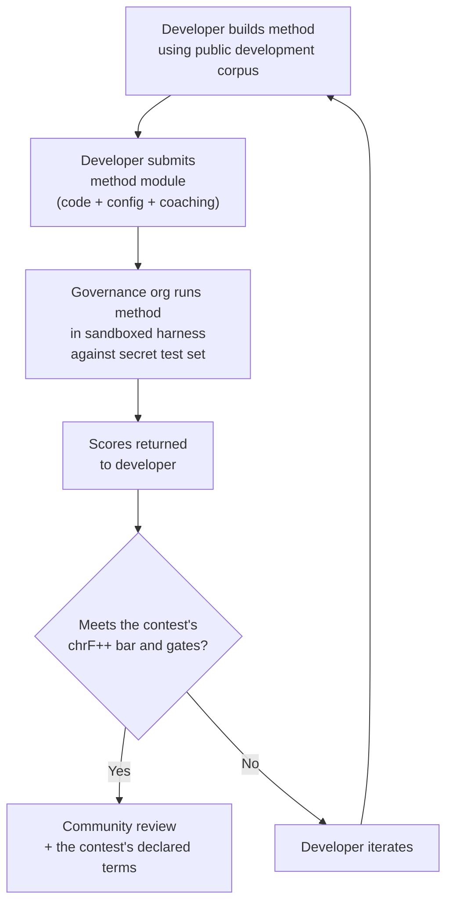

# Đặc tả Benchmark (Benchmark Specification)

> **Tóm tắt tổng quan.** Tài liệu này xác định giao thức đánh giá cho hệ sinh thái đánh giá MT của Champollion: định dạng ngữ liệu (§2), schema run card (§3), giao thức benchmark (§6), các yêu cầu xác thực bởi con người (§7), cơ chế chủ quyền (§8), bảng xếp hạng và mô hình gửi bài (§9), khung chi phí (§10), cùng khả năng mở rộng sang các ngôn ngữ mới (§11). Để biết cách chấm điểm các lượt chạy (chỉ số tiêu đề chrF++, các chỉ số tiêu chuẩn bên cạnh, các chỉ số chẩn đoán) và công thức tính chỉ số chi phí/tốc độ, hãy xem `SCORING_SPEC.md` — nguồn chân lý duy nhất cho toàn bộ logic chấm điểm. Tài liệu này tham chiếu đến SCORING_SPEC cho các chi tiết đó thay vì lặp lại chúng.


---

## 1. Nguyên tắc

### 1.1 Ngôn ngữ là Dữ liệu sinh học (Biodata)

Một ngôn ngữ không phải là tài liệu kiểm thử trung lập. Giống như dữ liệu di truyền hoặc sức khỏe, dữ liệu ngôn ngữ là **dữ liệu sinh học**: nó mang bản sắc, mối quan hệ huyết thống và các mối quan hệ của những người nói ngôn ngữ đó, và nó không thể được ẩn danh hóa một cách có ý nghĩa — loại bỏ siêu dữ liệu đi thì ngôn ngữ vẫn mã hóa việc những người đó là ai. Hệ quả đối với đặc tả này là rất cụ thể: những người cung cấp ngữ liệu nắm giữ chìa khóa của nó, và của bất kỳ thứ gì được đo lường dựa trên nó. Do đó, Chủ quyền (§8) không phải là một phần bổ sung cho giao thức; nó là một điều kiện tiên quyết của giao thức, và mọi nguyên tắc khác dưới đây đều hoạt động bên trong nó.

### 1.2 Chỉ số Tự động là các Chỉ số Đại diện (Proxies)

Mọi chỉ số được định nghĩa trong tài liệu này đều được tính toán bằng máy. chrF++, tỷ lệ chấp nhận FST, độ chính xác hình thái, độ tương đồng ngữ nghĩa — tất cả đều là các đại diện tự động cho chất lượng dịch thuật. Chúng hữu ích cho việc lặp lại nhanh chóng, so sánh hệ thống và phát hiện lỗi suy thoái (regressions). Chúng **không thay thế cho đánh giá của con người**.

Hệ thống phân cấp đánh giá:

```
Automated metrics (run cards, benchmarks)
    ↓ proxy for
Human review (bilingual speakers validate output)
    ↓ proxy for
Actual utility (does this help a language community?)
```

Không có điểm số tự động nào, dù cao đến đâu, có thể thay thế một người bản ngữ thông thạo trực tiếp đọc kết quả và xác nhận rằng nó chính xác, tự nhiên và phù hợp về mặt văn hóa. Đó là lý do tại sao không có điểm số tự động nào đi kèm nhãn chất lượng (§5): các chỉ số tự động hữu ích cho việc theo dõi tiến độ, nhưng bản thân chúng không bao giờ là đủ.

### 1.3 Phương pháp, Không phải Mô hình

Chúng tôi benchmark **phương pháp**, không phải mô hình. Một mô hình chỉ là một thành phần. Một phương pháp là toàn bộ công thức: lựa chọn mô hình, thiết kế prompt, sử dụng công cụ, tiền/hậu xử lý, dữ liệu huấn luyện (coaching data), chiến lược thử lại, mọi thứ. Hai đội sử dụng cùng một mô hình với các phương pháp khác nhau sẽ nhận được điểm số khác nhau. Đó chính là mấu chốt.

### 1.4 Khả năng tái lập

Mọi kết quả benchmark phải có khả năng tái lập. Thẻ chạy (§3) ghi lại cấu hình hoàn chỉnh của một thử nghiệm. Dấu vân tay (§3.5) xác định thiết lập thử nghiệm. Mã băm thẻ chạy (§3.6) xác minh tính toàn vẹn của kết quả. Bất kỳ ai có cùng phương pháp, ngữ liệu và cấu hình đều phải đạt được điểm số trong khoảng ±2% (có tính đến tính không xác định khi lấy mẫu của LLM ở nhiệt độ temperature > 0).

### 1.5 Không sử dụng dữ liệu đánh giá tổng hợp

**Dự án này không tạo ra, sử dụng hoặc ủng hộ dữ liệu đánh giá tổng hợp.** Tất cả các ngữ liệu phải được lấy nguồn từ văn bản thực tế do con người viết — các bản dịch đã xuất bản, sách giáo khoa, tài liệu song ngữ hoặc các bản dịch được thu thập từ những người nói lưu loát.

LLM có thể hỗ trợ:
- Căn chỉnh câu (tìm các đoạn song song trong các văn bản song ngữ hiện có)
- Chuyển đổi định dạng (chuyển đổi tài liệu đã xuất bản sang schema ngữ liệu)
- Làm phong phú siêu dữ liệu (gợi ý các tầng độ khó, nhãn văn phong)
- Đề xuất các câu nguồn cho con người dịch (§11.3 — bước dịch luôn do con người thực hiện)

LLM **không bao giờ** được tạo ra các bản dịch tham chiếu hoặc các cặp đánh giá.

**Chúng tôi trung lập về mặt phát triển đối với dữ liệu huấn luyện.** Nếu một nhà phát triển phương pháp sử dụng dữ liệu huấn luyện tổng hợp, dịch ngược (backtranslation) hoặc tăng cường dữ liệu trong phương pháp của họ, đó là lựa chọn của họ — chúng tôi đánh giá kết quả đầu ra, không phải quá trình huấn luyện. Dự án OMT-1600 của Meta sử dụng khoảng 270 triệu câu song song tổng hợp được tạo ra thông qua dịch ngược. Chúng tôi không phản đối các phương pháp được huấn luyện theo cách này. Chúng tôi chỉ kiểm thử trên dữ liệu do con người tuyển chọn.

> **Tại sao không dùng văn bản Kinh Thánh để đánh giá?** OMT-1600 đánh giá 1.560 trong số 1.600 ngôn ngữ trên văn bản thuộc lĩnh vực Kinh Thánh (Meta AI, *Omnilingual MT*, arXiv:2603.16309, 2026). Các bản dịch Kinh Thánh có văn phong cổ xưa, từ vựng phụng vụ và cấu trúc câu theo công thức. Các ngữ liệu đánh giá của chúng tôi được lấy nguồn từ văn bản đa dạng về lĩnh vực, do cộng đồng tuyển chọn — các lĩnh vực y tế, pháp lý, giáo dục, chính phủ, hội thoại và kỹ thuật (xem §2.7). Đây là một lựa chọn thiết kế có chủ ý. Các cộng đồng cần dịch thuật cho các lĩnh vực mà họ thực sự sinh sống và làm việc, chứ không phải một văn phong tôn giáo duy nhất. Một phương pháp đạt điểm cao trên Sáng thế ký 1:1 hầu như không nói lên điều gì về hiệu suất của nó trên một chương trình nghị sự của hội đồng bộ tộc hoặc một biểu mẫu tiếp nhận của phòng khám.

---

## 2. Schema Ngữ liệu

Một ngữ liệu là một tập hợp được tuyển chọn gồm các cặp văn bản song song với siêu dữ liệu có cấu trúc. Đó là chân lý nền tảng (ground truth) để đo lường tất cả các phương pháp.

### 2.1 Dataset Envelope

Cấu trúc cấp cao nhất của một tệp ngữ liệu:

```json
{
  "dataset": {
    "id": "edtekla-dev-v1",
    "version": "1.0",
    "language_pair": "EN→CRK",
    "source_language": "en",
    "target_language": "crk",
    "created": "2026-05-01",
    "license": "LicenseRef-EdTeKLA-Modified-CC-BY-NC-SA-4.0",
    "provenance": ["gold_standard", "textbook"]
  },
  "entries": [ ... ]
}
```

| Trường | Kiểu | Bắt buộc | Mô tả |
|-------|------|----------|-------------|
| `id` | string | ✅ | Mã định danh tập dữ liệu duy nhất, được sử dụng trong thẻ chạy và bảng xếp hạng |
| `version` | string | ✅ | Phiên bản ngữ nghĩa. Việc tăng phiên bản sẽ làm mất hiệu lực các so sánh thẻ chạy trước đó |
| `language_pair` | string | ✅ | Nhãn hiển thị (ví dụ: `EN→CRK`) |
| `source_language` | string | ✅ | Mã ngôn ngữ nguồn BCP 47 |
| `target_language` | string | ✅ | Mã ngôn ngữ đích BCP 47 |
| `created` | string | ✅ | Ngày tạo ISO 8601 |
| `license` | string | ✅ | Mã định danh giấy phép SPDX |
| `provenance` | string[] | ✅ | Danh sách các thẻ nguồn gốc được sử dụng trên các mục nhập |

### 2.2 Schema Mục nhập (Entry Schema)

Mỗi mục nhập trong ngữ liệu đại diện cho một thử thách dịch thuật:

```json
{
  "id": 42,
  "source": "I see the dog",
  "reference": "niwâpamâw atim",
  "segment": "gold_standard",
  "difficulty": 2,
  "provenance": "gold_standard",
  "register": "conversational",
  "context": "declaration",
  "morphological_analysis": "ni-wâpam-âw atim | 1sg-see.TA-3sg.DIR dog.AN",
  "notes": "Animate noun (atim); direct form because speaker is proximate",
  "variant_class": "simple-ta-direct"
}
```

| Trường | Kiểu | Bắt buộc | Mô tả |
|-------|------|----------|-------------|
| `id` | integer | ✅ | Mã định danh duy nhất trong ngữ liệu |
| `source` | string | ✅ | Văn bản nguồn bằng ngôn ngữ nguồn |
| `reference` | string | ✅ | Bản dịch tham chiếu chuẩn vàng (gold-standard) bằng ngôn ngữ đích |
| `segment` | string | 📎 | Phân vùng ngữ liệu: `gold_standard`, `held_out`, `development`, hoặc `diagnostic` |
| `difficulty` | integer | 📎 | Đánh giá độ khó 1–5 (xem §2.4) |
| `provenance` | string | 📎 | Nguồn gốc của mục này (xem §2.5) |
| `register` | string | 📎 | Cấp độ văn phong/độ trang trọng (xem §2.6) |
| `context` | string | 📎 | Chức năng giao tiếp (xem §2.6) |
| `domain` | string | 📎 | Miền trường hợp sử dụng từ hệ thống phân loại 16 mã (xem §2.7). Phải là một trong: `conv`, `ecommerce`, `edu`, `financial`, `gov`, `legal`, `literary`, `marketing`, `medical`, `news`, `religious`, `scientific`, `subtitles`, `support`, `tech`, `ui`. Được xác thực tại thời điểm khởi tạo. |
| `morphological_analysis` | string | ❌ | Phân tích hình thái chuẩn vàng (gold-standard) |
| `notes` | string | ❌ | Ghi chú của dịch giả, biến thể phương ngữ, cờ cảnh báo mơ hồ |
| `variant_class` | string | ❌ | Nhãn lớp nhóm các biến thể dịch thuật được chấp nhận |

> **📎 = KHUYẾN NGHỊ.** Bộ kiểm thử (harness) xử lý khéo léo các trường tùy chọn bị thiếu thông qua giá trị mặc định. Ngữ liệu của bên thứ ba chỉ cần cung cấp `id`, `source`, và `reference` cho mỗi mục.


### 2.3 Các phân đoạn ngữ liệu (Corpus Segments)

Ngữ liệu được chia thành các phân đoạn với các mức độ truy cập khác nhau:

| Phân đoạn | Mục đích | Truy cập | Kích thước tối thiểu |
|---------|---------|--------|-------------|
| `development` | Phát triển và lặp lại phương pháp. Các nhà phát triển sử dụng những thứ này một cách tự do. | **Công khai** | 30 mục nhập |
| `diagnostic` | Các bài kiểm thử có mục tiêu cho các hiện tượng ngôn ngữ cụ thể. | **Công khai** | 10 mục nhập |
| `gold_standard` | Đánh giá benchmark chính thức. Điểm số trên bảng xếp hạng đến từ đây. | **Bí mật** — do tổ chức quản trị nắm giữ | 50 mục nhập |
| `held_out` | Dành riêng cho đánh giá trong tương lai. Không bao giờ được sử dụng cho đến khi được kích hoạt. | **Bí mật** — do tổ chức quản trị nắm giữ | 10 mục nhập |

> **Trạng thái hiện tại:** Chỉ có phân đoạn `development` tồn tại trong các tập dữ liệu được phân phối. Các phân đoạn `diagnostic`, `gold_standard`, và `held_out` được định nghĩa cho việc sử dụng trong tương lai khi các ngữ liệu phát triển.

Các phân đoạn `gold_standard` và `held_out` hoàn toàn bí mật. Cả câu nguồn và bản dịch tham chiếu đều được lưu trữ trên cơ sở hạ tầng do tổ chức quản trị kiểm soát. Các nhà phát triển phương pháp không bao giờ nhìn thấy câu hỏi hoặc câu trả lời. Xem §8 để biết cơ chế chủ quyền.

### 2.4 Các tầng độ khó (Difficulty Tiers)

| Tầng | Mô tả | Ví dụ |
|------|-------------|----------|
| 1 — Từ vựng cơ bản | Từ đơn, lời chào thông thường, số đếm | "hello" → "tânisi", "dog" → "atim" |
| 2 — Câu đơn giản | Chủ ngữ-động từ hoặc SVO, thì hiện tại | "I see the dog" → "niwâpamâw atim" |
| 3 — Độ phức tạp trung bình | Thì quá khứ/tương lai, sở hữu cách, tính hoạt tính (animacy) | "I saw his dog yesterday" |
| 4 — Hình thái phức tạp | Sự chuyển dịch ngôi (obviation), thể bị động, conjunct order, mệnh đề quan hệ | "the woman whose son went to the store" |
| 5 — Nâng cao | Nhiều mệnh đề, văn phong trang trọng, nghi lễ, thành ngữ | Đoạn văn đầy đủ với giọng điệu phù hợp với văn phong |

Một ngữ liệu được xây dựng tốt nên bao gồm các mục nhập trên cả năm tầng độ khó, tập trung nhiều vào các tầng 2–4 nơi hầu hết các thử thách dịch thuật thực tế xuất hiện.

### 2.5 Thẻ nguồn gốc (Provenance Tags)

Mỗi mục nhập phải chỉ ra nguồn gốc của nó:

| Thẻ | Ý nghĩa |
|-----|---------|
| `gold_standard` | Được xác minh bởi những người nói lưu loát |
| `textbook` | Từ các tài liệu giáo dục đã xuất bản |
| `elicited` | Được tạo ra thông qua các phiên thu thập có cấu trúc |
| `corpus` | Được trích xuất từ một ngữ liệu song song |

> **Lưu ý:** Trong thực tế, các giá trị nguồn gốc là các chuỗi tự do. Các thẻ ở trên là các quy ước, không phải là một enum được xác thực — các tập dữ liệu có thể sử dụng các chuỗi nguồn gốc mô tả khác.

### 2.6 Văn phong và Ngữ cảnh

**Văn phong (Register)** mô tả mức độ trang trọng và ngữ cảnh xã hội:

| Văn phong | Mô tả |
|----------|-------------|
| `conversational` | Giao tiếp hàng ngày giữa những người ngang hàng |
| `formal` | Ngôn ngữ chính thức hoặc thể chế |
| `technical` | Từ vựng chuyên ngành |
| `ceremonial` | Sử dụng ngôn ngữ truyền thống hoặc thiêng liêng |
| `educational` | Tài liệu giảng dạy ngôn ngữ |

**Ngữ cảnh (Context)** mô tả chức năng giao tiếp:

> 🔲 **Đang lên kế hoạch.** Trường `context` được định nghĩa trong schema nhưng chưa được điền dữ liệu trong các tập dữ liệu hiện tại. Nó được dành riêng cho việc làm phong phú ngữ liệu trong tương lai.

| Ngữ cảnh | Mô tả |
|---------|-------------|
| `greeting` | Chào hỏi xã giao hoặc tạm biệt |
| `declaration` | Tuyên bố thực tế |
| `question` | Câu hỏi |
| `instruction` | Mệnh lệnh hoặc chỉ thị |
| `narrative` | Kể chuyện hoặc mô tả |
| `label` | Nhãn giao diện người dùng, văn bản nút hoặc tiêu đề |
| `error` | Thông báo lỗi hoặc cảnh báo |

### 2.7 Lĩnh vực (Domain) {#27-domain}

**Lĩnh vực** mô tả trường hợp sử dụng thực tế — loại nội dung đang được dịch. Điều này độc lập với văn phong và ngữ cảnh:

- **Văn phong** trả lời: *Mức độ trang trọng của câu này như thế nào?*
- **Ngữ cảnh** trả lời: *Câu này đang thực hiện chức năng gì?*
- **Lĩnh vực** trả lời: *Câu này dành cho ngành nghề/trường hợp sử dụng nào?*

Một hợp đồng pháp lý (lĩnh vực: `legal`) có thể trang trọng (văn phong: `formal`) và chứa một tuyên bố (ngữ cảnh: `declaration`). Một bản ghi trò chuyện của chatbot pháp lý (lĩnh vực: `legal`) có thể mang tính hội thoại (văn phong: `conversational`) và chứa các câu hỏi (ngữ cảnh: `question`). Cùng một lĩnh vực, nhưng văn phong và ngữ cảnh khác nhau.

| Mã lĩnh vực | Mô tả | Đối tượng tiêu dùng điển hình |
|-------------|-------------|-------------------|
| `ui` | Các chuỗi giao diện phần mềm | Nhà phát triển ứng dụng, đội ngũ bản địa hóa |
| `legal` | Hợp đồng, điều lệ, hồ sơ tòa án, tài liệu nhập cư | Công ty luật, tòa án, đội ngũ tuân thủ, luật sư sở hữu trí tuệ |
| `medical` | Ghi chú lâm sàng, nhãn thuốc, giao tiếp với bệnh nhân, đề cương thử nghiệm | Bệnh viện, công ty dược phẩm, thử nghiệm lâm sàng, cổng thông tin bệnh nhân |
| `financial` | Ngân hàng, bảo hiểm, hồ sơ quản lý, báo cáo kiểm toán | Ngân hàng, công ty bảo hiểm, cơ quan quản lý, kiểm toán viên |
| `edu` | Sách giáo khoa, chương trình giảng dạy, giáo án, tài liệu học thuật | Trường học, trường đại học, nhà xuất bản sách giáo khoa |
| `ecommerce` | Mô tả sản phẩm, đánh giá, danh sách chợ trực tuyến | Nhà bán lẻ trực tuyến, người bán trên chợ trực tuyến |
| `marketing` | Bản sao quảng cáo, thông điệp thương hiệu, chiến dịch, khẩu hiệu | Công ty quảng cáo, đội ngũ thương hiệu |
| `gov` | Tài liệu chính sách, quy định, thông báo công cộng, luật pháp | Cơ quan chính phủ, đội ngũ tuân thủ |
| `scientific` | Bài báo nghiên cứu, tóm tắt, phương pháp luận, đề xuất tài trợ | Nhà nghiên cứu, tạp chí, cơ quan tài trợ |
| `religious` | Kinh thánh, văn bản phụng vụ, bình luận thần học | Cộng đồng đức tin, nhà xuất bản phụng vụ |
| `support` | Câu hỏi thường gặp, thông báo lỗi, hướng dẫn khắc phục sự cố, kịch bản chatbot | Công ty SaaS, bàn trợ giúp |
| `subtitles` | Đối thoại trong phim, truyền hình, phát trực tuyến và trò chơi | Nền tảng phát trực tuyến, studio, công ty trò chơi |
| `news` | Báo chí, báo cáo thông tấn, xã luận, thông cáo báo chí | Tổ chức truyền thông, hãng thông tấn |
| `literary` | Viễn tưởng, thơ ca, tự sự, văn bản văn hóa | Nhà xuất bản, tổ chức bảo tồn văn hóa |
| `conv` | Hội thoại thân mật, mạng xã hội, nhắn tin | Ứng dụng tiêu dùng, nền tảng xã hội |
| `tech` | Tài liệu API, hướng dẫn sử dụng, đặc tả kỹ thuật, hướng dẫn kỹ thuật | Đội ngũ tài liệu, tổ chức kỹ thuật |

> **Các benchmark theo lĩnh vực cụ thể.** Benchmark chung đánh giá một phương pháp trên tất cả các lĩnh vực. Nhưng Mạng lưới cũng hỗ trợ **các benchmark được lọc theo lĩnh vực** — nơi điểm số chỉ được tính trên các mục nhập được gắn thẻ với một lĩnh vực cụ thể. Điều này giúp người dùng trả lời: "Phương pháp nào tốt nhất để dịch tài liệu pháp lý sang tiếng Pháp?" so với "Phương pháp nào có điểm tiếng Pháp tổng thể tốt nhất?"
>
> Bảng xếp hạng được lọc theo lĩnh vực cho phép người dùng so sánh các phương pháp trong một trường hợp sử dụng duy nhất. Các phương pháp khác nhau hoạt động khác nhau trên các lĩnh vực — một phương pháp được tinh chỉnh trên thuật ngữ pháp lý có thể đạt điểm cao hơn nhiều trên văn bản pháp lý so với văn bản hội thoại. Mạng lưới giúp người dùng tìm thấy phương pháp hoạt động tốt nhất cho trường hợp sử dụng cụ thể của họ.

> **Tương lai: Trợ lý Mạng lưới.** Một trợ lý hội thoại giúp người dùng mô tả trường hợp sử dụng MT của họ (lĩnh vực, cặp ngôn ngữ, yêu cầu chất lượng) và hiển thị các phương pháp có liên quan đã được cộng đồng xác thực từ bảng xếp hạng — ví dụ: "phương pháp nào đạt điểm cao nhất trên các benchmark EN→JA thuộc lĩnh vực y tế?" — là một công cụ hỗ trợ điều hướng mà chúng tôi đang xem xét, phụ thuộc vào việc có đủ dữ liệu đánh giá được gắn thẻ lĩnh vực và sự đa dạng của phương pháp.

---

## 3. Schema Thẻ chạy (Run Card Schema) {#3-run-card-schema}

Thẻ chạy là đơn vị đánh giá nguyên tử. Nó là một tài liệu JSON độc lập ghi lại cấu hình và kết quả hoàn chỉnh của một lượt chạy đánh giá duy nhất: một phương pháp, một mô hình, một cấu hình, một tập dữ liệu.

Mỗi thẻ chạy ghi lại ba khía cạnh:
- **Chất lượng** — các bản dịch tốt đến mức nào?
- **Chi phí** — chi phí để tạo ra chúng là bao nhiêu?
- **Tốc độ** — mất bao lâu để thực hiện?

### 3.1 Các trường cấp cao nhất

| Trường | Kiểu | Mô tả |
|-------|------|-------------|
| `run_id` | string | UUID v4 được tạo khi bắt đầu lượt chạy |
| `harness_version` | string | Phiên bản ngữ nghĩa (semantic version) của harness (ví dụ: `2.0`) |
| `timestamp` | string | Dấu thời gian ISO 8601 UTC khi lượt chạy bắt đầu |
| `elapsed_seconds` | number | Thời gian thực thi thực tế (wall-clock) của toàn bộ lượt chạy |
| `score_caveats` | array | Chỉ xuất hiện khi có yếu tố ảnh hưởng đến điểm số: một danh sách các đối tượng `{kind, source, severity, message, …}`, ví dụ: tập kiểm thử có các hàng gần như trùng khớp hoàn toàn với dữ liệu huấn luyện, kết quả đầu ra dài hơn hoặc ngắn hơn nhiều so với bản tham chiếu, kết quả sao chép lại nguồn, hoặc một kết quả đầu ra duy nhất được đưa ra cho nhiều nguồn khác nhau. Mang tính thông tin: nó không bao giờ thay đổi điểm số, và được hiển thị bên cạnh tiêu đề chrF++ ở bất cứ nơi nào có điểm số. Xem [Đặc tả Run Card](/docs/network/specifications/run-card#score_caveats) |

### 3.2 Cấu hình phương pháp (Method Configuration)

Các trường này định nghĩa thiết lập thử nghiệm — những gì đã được kiểm thử và cách thức thực hiện.

| Trường | Kiểu | Bắt buộc | Mô tả |
|-------|------|----------|-------------|
| `model_slug` | string | ✅ | Mã định danh mô hình (ví dụ: `google/gemini-2.5-flash`) |
| `model_id` | string | ❌ | Mã định danh mô hình đã phân giải được trả về bởi API |
| `condition` | string | ✅ | Nhãn thử nghiệm (ví dụ: `baseline`, `coached-v3`, `few-shot`) |
| `temperature` | number | ✅ | Nhiệt độ lấy mẫu (sampling temperature) |
| `system_prompt_sha256` | string | ✅ | Mã băm SHA-256 của toàn bộ system prompt |
| `system_prompt_used` | string | ✅ | Toàn bộ văn bản system prompt |
| `coaching_data_sha256` | string | ❌ | Mã băm SHA-256 của tệp dữ liệu huấn luyện (coaching data), nếu được sử dụng |
| `fst_version` | string | ❌ | Phiên bản của bộ phân tích FST, nếu được sử dụng |
| `tools_enabled` | string[] | ❌ | Danh sách các công cụ có sẵn cho phương pháp |
| `batch_size` | number | ❌ | Số lượng mục nhập trên mỗi lô API đồng thời |
| `max_retries` | number | ❌ | Số lần thử lại tối đa cho việc từ chối FST, nếu áp dụng |

:::info[Run Card đã xuất bản bao gồm method_config]
Khi một run card được xuất bản lên bảng xếp hạng (thông qua `mt-eval publish`), nó cũng bao gồm một khối `method_config` chứa MethodConfig 8 trường chuẩn mực (`model`, `temperature`, `batchSize`, `register`, `coachingFile`, `coachingPrompt`, `promptContext`, `qualityTier` — tất cả đều ở dạng camelCase; `qualityTier` luôn là null trên thẻ mới, do các tầng chất lượng đã ngừng sử dụng). Điều này cho phép nhập không cần tái cấu trúc: `champollion leaderboard --install` đọc trực tiếp `method_config` và ghi ra dưới dạng manifest plugin. Các trường đo đạc từ xa ở trên (§3.2) ghi lại những gì harness đã quan sát; `method_config` ghi lại những gì nhà phát triển dự định.
:::

### 3.3 Tham chiếu tập dữ liệu (Dataset Reference)

| Trường | Kiểu | Mô tả |
|-------|------|-------------|
| `dataset.id` | string | Mã định danh tập dữ liệu |
| `dataset.version` | string | Phiên bản tập dữ liệu |
| `dataset.language_pair` | string | Nhãn hiển thị |
| `dataset.sha256` | string | Mã băm SHA-256 của nội dung tệp tập dữ liệu |
| `dataset.entry_count` | number | Số lượng mục nhập được đánh giá |

Mã băm SHA-256 của tập dữ liệu ghim kết quả vào một phiên bản dữ liệu cụ thể. Nếu tập dữ liệu thay đổi, các thẻ chạy cũ sẽ không thể so sánh được.

### 3.4 Điểm số (Chất lượng)

Các chỉ số tổng hợp cho toàn bộ lượt chạy. Tất cả các chỉ số chất lượng đều được **tính toán tự động** — xem §1.2.

| Trường | Kiểu | Mô tả |
|-------|------|-------------|
| `scores.total` | number | Tổng số mục được đánh giá |
| `scores.exact_matches` | number | Các mục có kết quả đầu ra khớp hoàn toàn với bản tham chiếu |
| `scores.exact_match_rate` | number | 0.0–1.0 |
| `scores.equivalent_matches` | number | Các mục khớp với một biến thể được chấp nhận |
| `scores.equivalent_match_rate` | number | 0.0–1.0 |
| `scores.fst_accepted` | number | Số từ đầu ra mà bộ phân tích FST chấp nhận, tính tổng trên tất cả các mục (đếm theo số từ, không phải số mục) |
| `scores.fst_acceptance_rate` | number | 0.0–1.0, trung bình tỷ lệ chấp nhận trên mỗi mục (số từ được chấp nhận của mỗi mục ÷ tổng số từ của mục đó); `null` nếu không cấu hình FST |
| `scores.morphological_accuracy` | number | 0.0–1.0, bắt nguồn từ FST (khớp lemma), `null` nếu không có FST / không có từ nào khớp lemma. Chỉ mang tính tham vấn cho đến khi được kích hoạt — xem Đặc tả Chấm điểm §2.2 |
| `scores.morph_coverage` | number | 0.0–1.0, tỷ lệ các từ dự đoán có thể phân tích được khớp lemma với bản tham chiếu (cho biết mức độ thưa thớt của `morphological_accuracy`) |
| `scores.chrf_plus_plus` | number | **Chỉ số tiêu đề và xếp hạng:** chrF++ cấp ngữ liệu (0–100). Khoảng tin cậy bootstrap 95% của nó là `scores.confidence_intervals.corpus_chrf` và chữ ký sacreBLEU của nó là `scores.sacrebleu_signatures.chrf` |
| `scores.scoring_standard` | string | `"standard/1"` trên mỗi thẻ mới. Không có trên các thẻ được xuất bản trước tiêu chuẩn, những thẻ này được đọc là `legacy-composite` |
| `scores.primary_metric` | string | `"chrf_plus_plus"` |
| `scores.spbleu` | number | spBLEU (FLORES-200 SentencePiece), hiển thị bên cạnh chrF++ |
| `scores.sacrebleu_signatures` | object | Chữ ký của mọi chỉ số sacreBLEU được tính toán (`chrf`, `chrf_plain`, `bleu`, `spbleu`, `ter`) |
| `scores.semantic_score` | number | Độ tương đồng ngữ nghĩa dựa trên embedding (0.0–1.0) |
| `scores.ter` | number | Translation Edit Rate (0–∞, càng thấp càng tốt) |
| `scores.length_ratio` | number | avg(len(dự đoán)/len(tham chiếu)), lý tưởng = 1.0 |
| `scores.code_switching_rate` | number | 0.0–1.0, tỷ lệ các mục bị rò rỉ ngôn ngữ nguồn |
| `scores.hallucination_rate` | number | 0.0–1.0, tỷ lệ các mục có nội dung ảo giác (hallucination) |
| `scores.terminology_adherence` | number | 0.0–1.0, mức độ tuân thủ các thuật ngữ trong bảng thuật ngữ (`null` nếu không có bảng thuật ngữ) |
| `scores.tokens_per_second` | number | tổng_số_token / số_giây_đã_qua |
| `scores.entries_per_minute` | number | số mục được dịch mỗi phút |
| `scores.composite` | number \| null | **Đã ngừng sử dụng.** `null` trên mỗi thẻ mới; thẻ cũ vẫn giữ điểm tổng hợp đã lưu của nó, hiển thị dưới dạng "điểm tổng hợp cũ (đã ngừng sử dụng)". Xem SCORING_SPEC §4 |
| `scores.quality_tier` | string \| null | **Đã ngừng sử dụng.** `null` trên mỗi thẻ mới. Xem SCORING_SPEC §5 |
| `scores.cost_adjusted` | number \| null | **Đã ngừng sử dụng** cùng với điểm tổng hợp; `null` trên mỗi thẻ mới |
| `scores.errors` | number | Các mục bị lỗi (lỗi API, quá thời gian chờ, v.v.) |
| `scores.by_difficulty` | object | Điểm số được chia nhỏ theo bậc độ khó |
| `scores.by_provenance` | object | Điểm số được chia nhỏ theo thẻ nguồn gốc |
| `scores.by_domain` | object | ✅ Đã triển khai — Điểm số được chia nhỏ theo miền (§2.7). Cho phép xếp hạng bảng xếp hạng được lọc theo miền. Được tính toán bởi tester.py và truyền qua publish.py. |

### 3.5 Tổng số (Chi phí)

| Trường | Kiểu | Mô tả |
|-------|------|-------------|
| `totals.prompt_tokens` | number | Tổng số token đầu vào trên tất cả các cuộc gọi API |
| `totals.completion_tokens` | number | Tổng số token đầu ra |
| `totals.reasoning_tokens` | number | Token được sử dụng cho chuỗi suy nghĩ (chain-of-thought) (0 đối với hầu hết các mô hình) |
| `totals.cached_tokens` | number | Token được phục vụ từ bộ nhớ đệm prompt của nhà cung cấp |
| `totals.total_cost_usd` | number | Tổng chi phí tính bằng USD |
| `totals.cost_per_entry_usd` | number | `total_cost_usd / entry_count` |
| `totals.cost_per_source_char` | number | USD trên mỗi ký tự nguồn — có thể so sánh giữa các ngôn ngữ |

### 3.6 Thời gian (Tốc độ)

| Trường | Kiểu | Mô tả |
|-------|------|-------------|
| `elapsed_seconds` | number | Thời gian thực tế của toàn bộ lượt chạy (cấp cao nhất) |
| `scores.avg_latency_seconds` | number | Thời gian phản hồi trung bình (mean) cho mỗi mục nhập |
| `scores.median_latency_seconds` | number | Thời gian phản hồi trung vị (median) cho mỗi mục nhập |
| `scores.p95_latency_seconds` | number | Thời gian phản hồi ở phân vị thứ 95 cho mỗi mục nhập |

### 3.7 Kết quả theo từng mục nhập (Per-Entry Results)

Mỗi mục nhập trong mảng `results[]` ghi lại một bản dịch. Dữ liệu theo từng mục nhập được lưu trữ trong bảng `run_card_entries` (migration 005) với các phán quyết LYSS phi chuẩn hóa (migration 006).

| Trường | Kiểu | Mô tả |
|-------|------|-------------|
| `entry_id` | string | Khớp với `entries[].id` trong ngữ liệu |
| `source` | string | Văn bản nguồn đã được dịch |
| `expected` | string | Bản dịch tham chiếu chuẩn vàng |
| `raw_predicted` | string \| null | Đầu ra thô của mô hình trước khi hậu xử lý |
| `predicted` | string | Đầu ra thực tế của phương pháp (đã qua hậu xử lý) |
| `segment` | string | Mã định danh phân đoạn (ví dụ: chỉ mục câu) |
| `difficulty` | string \| null | Tầng độ khó từ ngữ liệu |
| `domain` | string | Thẻ lĩnh vực từ ngữ liệu (§2.7) |
| `exact_match` | boolean | Liệu đầu ra có khớp chính xác với bản dịch tham chiếu hay không |
| `chrf_score` | number \| null | chrF++ cấp độ câu (0–100) |
| `bleu_score` | number \| null | BLEU cấp độ câu (0–100) |
| `latency_s` | number \| null | Thời gian phản hồi tính bằng giây |
| `cost_usd` | number \| null | Chi phí tính bằng USD cho mục nhập này |
| `tool_call_count` | integer | Số lượng cuộc gọi công cụ được sử dụng (0 nếu không có) |
| `error` | string \| null | Thông báo lỗi nếu mục nhập này bị lỗi |
| `plugin_metrics` | object | Đầu ra plugin đầy đủ cho mỗi mục nhập (JSONB) |
| `fst_valid` | boolean \| null | GiellaLT FST đã chấp nhận dự đoán (LYSS-fst phi chuẩn hóa) |
| `equivalent_match` | boolean \| null | Bộ linter CRK đã xác nhận tính tương đương cấu trúc (LYSS-eq phi chuẩn hóa) |
| `semantic_verdict` | string \| null | Phán quyết LYSS-sem: `VALID`, `MISMATCH`, `UNKNOWN`, `ERROR` |
| `code_switching_detected` | boolean \| null | Phát hiện các token ngôn ngữ nguồn trong đầu ra |
| `hallucination_detected` | boolean \| null | Phát hiện nội dung bịa đặt trong đầu ra |


### 3.8 Dấu vân tay (Fingerprint)

Một định danh cho khả năng tái lập. Hai lượt chạy có fingerprint giống hệt nhau nghĩa là đã sử dụng cùng một thiết lập thử nghiệm.

Dấu vân tay (fingerprint) là mã băm SHA-256 của JSON chuẩn tắc (các khóa đã sắp xếp) của:
- `dataset.sha256`
- `model_slug`
- `condition`
- `system_prompt_sha256`
- `temperature`
- `harness_version`
- `batch_size`
- `tools_enabled`

> **Tại sao lại là 8 thành phần?** Kích thước lô và việc gọi công cụ ảnh hưởng đáng kể đến chất lượng đầu ra và phải được đưa vào định danh. Hai lượt chạy có kích thước lô khác nhau hoặc các công cụ được kích hoạt khác nhau là các thiết lập thử nghiệm khác nhau, ngay cả khi tất cả các tham số khác đều khớp.

**Phiên bản 2 (harness 0.2.0 trở lên)** bổ sung năm thành phần:
- `api_provider`: kênh mà văn bản đi qua (OpenRouter, API riêng của nhà cung cấp, endpoint cục bộ; id của engine MT; đối với plugin phương thức, `local` dưới `--attest-local-transport`, nếu không thì là `method-plugin`). Nhật ký chạy của plugin và engine được ghi trước khi điều này được khắc phục hiển thị `openrouter`, một giá trị mặc định mà chúng chưa từng được gửi qua; lệnh publish cũng ghi lại giá trị đã sửa cho chúng, điều này làm thay đổi danh tính phiên bản 2 của chúng — có chủ đích, vì giá trị cũ là không đúng
- `endpoint_host_sha256`: SHA-256 của host thuộc endpoint, không bao giờ là URL thô vì có thể chứa hostname nội bộ hoặc thông tin xác thực
- `max_tokens`
- `method_version`: phiên bản của thẻ phương thức, nếu không thì là phiên bản mà `method.json` của plugin phương thức khai báo
- `method_sha256`: mã băm của bundle đã thực thi, đối với phương thức mà một contest node đã chạy, nếu không thì là mã băm trên các tệp của plugin phương thức (`method.json` và các tệp `.py` của nó)

Một lượt chạy **plugin phương thức** (`mt-eval run --method <plugin dir>`) bổ sung thêm hai thành phần:
- `method_model`: mô hình được giao cho plugin cùng với `-m/--model` (plugin đọc nó dưới dạng `config.method_model`), hoặc `null` khi không có mô hình nào được cung cấp
- `method_dependencies_sha256`: SHA-256 của danh sách `dependencies` mà `method.json` của plugin khai báo (JSON chuẩn tắc), hoặc `null` khi nó không khai báo danh sách nào

Nếu không có những thành phần này, cùng một plugin chạy trên hai mô hình khác nhau sẽ dùng chung một danh tính. Harness 0.2.0 bổ sung chúng trước khi phát hành, do đó danh tính của lượt chạy plugin chỉ thay đổi một lần tại đây; không loại lượt chạy nào khác bị ảnh hưởng.

Một lượt chạy của engine MT chạy mô hình mà nó được **cung cấp** (`mt-eval run --method local-model -m <model>`) cũng bổ sung thêm hai thành phần:
- `method_model`: mô hình đã được tải — id Hugging Face của nó, hoặc tên của thư mục mô hình
- `method_model_sha256`: đối với một thư mục, là SHA-256 trên danh sách các tệp của nó theo định dạng `sha256sum` (mỗi tệp một dòng `<sha256>  <relative path>`, được sắp xếp theo đường dẫn, bỏ qua các thư mục bắt đầu bằng dấu chấm); đối với id Hugging Face, là revision đã được tải

Hai mô hình đi qua cùng một engine là hai thử nghiệm khác nhau. Một nhật ký chạy `local-model` không nêu tên mô hình (các bản dựng 0.2.0 trước đó không truyền `-m` tới engine, sau đó engine đã chạy một mô hình dự phòng, `Helsinki-NLP/opus-mt-en-es`) sẽ không thể xác định điều gì đã tạo ra các con số của nó: `mt-eval publish` từ chối nó và `contest qualify` sẽ không tạo biên lai từ nó.

Theo phiên bản 1, cùng một mô hình được gọi qua hai kênh khác nhau sẽ dùng chung một danh tính, và vì một thẻ đã xuất bản là bất biến, thẻ thứ hai trong số hai thẻ đó đã bị từ chối do trùng lặp. Run card ghi lại `fingerprint.version`. Nhật ký chạy từ harness cũ hơn vẫn giữ phiên bản 1, vì vậy việc xuất bản lại sẽ tái tạo danh tính ban đầu của nó.

Hai lượt chạy có dấu vân tay giống hệt nhau sẽ tạo ra các kết quả có thể so sánh được. Sự khác biệt là do tính không xác định của API (nhiệt độ temperature > 0) hoặc các cập nhật mô hình từ phía nhà cung cấp.

### 3.9 Mã băm thẻ chạy (Run Card Hash)

Mã băm SHA-256 của toàn bộ tệp JSON thẻ chạy (với chính trường `run_card_hash` được đặt thành `""` trong quá trình băm). Đây là niêm phong phát hiện giả mạo. Nếu bất kỳ trường nào thay đổi, mã băm sẽ bị hỏng.

---

## 4. Các chỉ số tự động

Tất cả các chỉ số trong phần này đều được tính toán bằng máy. Xem §1.2.

### 4.1 Định nghĩa chỉ số

| Chỉ số | Trạng thái | Đo lường điều gì | Phạm vi |
|--------|--------|-----------------|-------|
| **chrF++** | ✅ Đã triển khai | F-score của character n-gram. Hoạt động ở cấp độ ký tự, giúp chỉ số này ổn định hơn các chỉ số cấp độ từ (BLEU) đối với các ngôn ngữ có hình thái phong phú, nơi các từ thường dài và biến hình cao. Được tính toán bởi sacrebleu. | 0–100 (thang đo gốc). **Chỉ số tiêu đề và xếp hạng**, được xuất bản cùng với khoảng tin cậy 95% và chữ ký sacreBLEU. |
| **Tỷ lệ chấp nhận FST** | ✅ Đã triển khai (chẩn đoán) | Tỷ lệ các từ dự đoán được bộ phân tích hình thái (GiellaLT HFST) chấp nhận là dạng hợp lệ trong ngôn ngữ đích. Một từ được FST chấp nhận là một từ có thật, hợp lệ về mặt cấu trúc — không phải ảo giác. | 0.0–1.0 |
| **Khớp chính xác** | ✅ Đã triển khai (chẩn đoán) | Tỷ lệ các dự đoán khớp chính xác với bản tham chiếu sau khi chuẩn hóa Unicode. Nghiêm ngặt nhưng rõ ràng — hữu ích như một phép kiểm tra trần (ceiling check). | 0.0–1.0 |
| **Độ chính xác hình thái** | ✅ Đã triển khai (chẩn đoán) | Bắt nguồn từ FST và khớp lemma: đối với mỗi từ dự đoán có từ gốc xuất hiện trong bản tham chiếu, kiểm tra xem biến hình của nó có khớp hay không. Chi tiết hơn tỷ lệ chấp nhận FST — một từ có thể hợp lệ với FST nhưng có biến hình sai (đúng từ gốc, sai thì). Cần một bộ phân tích FST, không phải bộ chấp nhận kiểm tra chính tả; xem SCORING_SPEC §2.2. | 0.0–1.0 |
| **Khớp tương đương** | ⚡ Một phần (chẩn đoán) | Tỷ lệ khớp với một biến thể được chấp nhận của bản tham chiếu — có tính đến trật tự từ, sự khác biệt phương ngữ và quy ước chính tả. Hiện được triển khai cho CRK thông qua `CrkLinterMetric` của tiêu chuẩn đánh giá CRK (trong `eval_standards/crk/`); được tải tự động thông qua khai báo `evalMetrics` của thẻ ngôn ngữ CRK. Việc triển khai chung yêu cầu `variants[]` cho từng mục trong ngữ liệu. | 0.0–1.0 |
| **Điểm ngữ nghĩa** | ⚡ Một phần (chẩn đoán) | Khả năng bảo toàn ý nghĩa bất kể hình thức bề mặt. Hiện được triển khai cho CRK thông qua `CrkSemanticMetric` của tiêu chuẩn đánh giá CRK (trong `eval_standards/crk/`, đại diện có trọng số phán quyết). Độ tương đồng cosine dựa trên embedding phổ quát đang được lên kế hoạch — xem SCORING_SPEC §2.3. | 0.0–1.0 |

### 4.2 Chỉ số tiêu đề và tiêu chuẩn bên cạnh

Các lượt chạy được chấm điểm theo tiêu chuẩn chấm điểm `standard/1`, theo cách mà WMT, FLORES-200 và các nhiệm vụ chung của AmericasNLP báo cáo đánh giá MT:

- **Một chỉ số tiêu đề và xếp hạng:** chrF++ của ngữ liệu cùng với khoảng tin cậy bootstrap 95% và chữ ký sacreBLEU của nó, được viết là `chrF++ 47.5 [45.9, 49.0]`.
- **Các chỉ số tiêu chuẩn khác bên cạnh, không bao giờ pha trộn:** BLEU, spBLEU, TER, và COMET khi được tính toán (kèm theo id mô hình của nó).
- **Các chỉ số chẩn đoán được báo cáo riêng biệt:** khớp chính xác, chấp nhận FST, độ chính xác hình thái, khớp tương đương, điểm ngữ nghĩa, chuyển mã (code-switching), ảo giác, thuật ngữ, phong cách viết, và mọi lưu ý về điểm số. Chúng giải thích cho một điểm số; chúng không bao giờ là bản thân điểm số đó.
- **"Tốt hơn" được quyết định bởi một kiểm định ý nghĩa thống kê theo cặp** trên chrF++ ([Ý nghĩa thống kê](/docs/network/specifications/significance)), không phải bằng cách so sánh hai con số.

**Định nghĩa đầy đủ nằm trong `SCORING_SPEC.md`** ([Cách chấm điểm các lượt chạy](/docs/network/specifications/scoring#how-runs-are-scored)). Mã harness phản ánh điều này trong `mt_eval_harness/scoring.py`.

> **Tại sao không dùng BLEU làm chỉ số tiêu đề?** BLEU hoạt động ở cấp độ từ và phạt các biến thể hình thái. Đối với các ngôn ngữ đa tổng hợp (polysynthetic), một từ duy nhất có thể là cả một mệnh đề — BLEU sẽ coi những khác biệt nhỏ về biến hình là hoàn toàn không khớp. chrF++ xử lý điều này tốt hơn bằng cách hoạt động ở cấp độ ký tự. BLEU được báo cáo bên cạnh nó. Xem SCORING_SPEC Phụ lục A.

### 4.3 Điểm tổng hợp đã ngừng sử dụng

Trước khi có tiêu chuẩn, các lượt chạy được xếp hạng theo một điểm tổng hợp có trọng số gồm chrF++, khớp chính xác, chấp nhận FST, độ chính xác hình thái và các chỉ số hành vi. Nó **đã ngừng sử dụng**: các thẻ mới xuất bản `composite: null` và `cost_adjusted: null`. Nó có thể bị thao túng — một mô hình chưa qua huấn luyện lặp lại một câu tiếng Northern Sámi hợp lệ cho mọi đầu vào đạt 0.6244 với chrF++ 5.5 — và việc pha trộn các tín hiệu mang ý nghĩa khác nhau cho các ngôn ngữ khác nhau là không thể đọc hiểu được. Các thẻ cũ vẫn giữ điểm tổng hợp đã lưu của chúng và duy trì khả năng xác minh; xem [SCORING_SPEC §4](/docs/network/specifications/scoring#4-composite-score).

---

## 5. Tầng chất lượng (đã ngừng sử dụng) {#5-quality-tiers}

**Không có điểm số tự động nào mang nhãn chất lượng.** Các tầng chất lượng (Baseline, Emerging, Functional, Deployable, Fluent) từng được diễn giải từ điểm tổng hợp nay đã ngừng sử dụng cùng với nó: các thẻ mới xuất bản `quality_tier: null`, và không có đầu ra nào in ra tầng chất lượng. Một nhãn như "functional" (dùng được) trên một điểm số tự động tuyên bố một điều mà chỉ người bản ngữ mới có thể xác nhận — và các tầng đã ngừng sử dụng từng gọi một hệ thống lặp lại một câu cho mọi đầu vào là "functional". Chất lượng được chứng nhận bởi sự xác thực của con người (§7). Các thẻ cũ vẫn lưu trữ một tầng; [SCORING_SPEC §5](/docs/network/specifications/scoring#5-quality-tiers) chỉ giữ lại các ngưỡng cũ để những thẻ đó có thể đọc được.

---

## 6. Giao thức Benchmark

Một **benchmark** là việc sản xuất một cách hệ thống các thẻ chạy trên một không gian tham số được khai báo trên một tập dữ liệu nhất định. Nó không phải là một lượt chạy đơn lẻ — nó là một sự khám phá có cấu trúc về cách các cấu hình khác nhau hoạt động.

### 6.1 Những gì một Benchmark tạo ra

Một benchmark tạo ra một **ma trận các thẻ chạy** — một thẻ cho mỗi sự kết hợp của các giá trị tham số. Ma trận này cho phép so sánh đa chiều trên các khía cạnh:

- **Chất lượng** — chrF++ kèm theo khoảng tin cậy của nó, các chỉ số tiêu chuẩn khác, và các chỉ số chẩn đoán
- **Chi phí** — tổng chi phí và chi phí cho mỗi mục đối với từng cấu hình
- **Tốc độ** — thời gian thực tế (wall-clock) và độ trễ trên mỗi mục

Không có một "điểm benchmark" duy nhất nào. Benchmark là toàn bộ ma trận. Các bên liên quan khác nhau sẽ quan tâm đến các khía cạnh khác nhau: một nhà nghiên cứu tìm kiếm sự cải thiện đáng kể của chrF++, một kỹ sư triển khai tối ưu hóa chi phí trên mỗi mục, một cộng đồng đánh giá chất lượng.

### 6.2 Không gian tham số

Một benchmark khai báo các tham số nào được hoán vị:

| Trục | Các giá trị điển hình | Mục đích |
|------|---------------|---------|
| `model` | 4–12 mô hình (tiên phong + tầm trung + giá rẻ) | Khả năng của mô hình quan trọng như thế nào? |
| `temperature` | 0.0, 0.3, 0.7 | Tính ngẫu nhiên khi lấy mẫu giúp ích hay gây hại? |
| `prompt_version` | 2–3 chiến lược prompt | Phương pháp nhạy cảm thế nào với thiết kế prompt? |
| `coaching_config` | có/không có dữ liệu huấn luyện | Việc đưa kiến thức ngôn ngữ vào có cải thiện đầu ra không? |
| `tool_config` | có/không có FST, có/không có từ điển | Các công cụ ngôn ngữ có cải thiện đầu ra không? |

Không gian hoán vị đầy đủ:
```
runs = |models| × |temperatures| × |prompts| × |coaching| × |tools|
```

Một benchmark ban đầu điển hình: 12 mô hình × 3 nhiệt độ × 2 prompt × 2 dữ liệu huấn luyện = 144 lượt chạy.

### 6.3 Đánh giá Baseline so với Phương pháp

Một benchmark phục vụ hai mục đích riêng biệt:

**Thiết lập Baseline** — lập bản đồ bối cảnh với các phương pháp tiếp cận ngây thơ (naive). "Các mô hình hiện tại có thể làm gì cho ngôn ngữ này mà không cần bất kỳ kỹ thuật đặc thù ngôn ngữ nào?" Điều này thiết lập tiêu chuẩn. Ma trận baseline cho bạn biết: mô hình nào ít ảo tưởng nhất, nhiệt độ nào tạo ra đầu ra nhất quán nhất, liệu dữ liệu huấn luyện có giúp ích gì không, nơi tất cả các mô hình đều thất bại đồng loạt (điều này tiết lộ các vấn đề ngôn ngữ khó).

**Đánh giá phương pháp** — kiểm thử một phương pháp kỹ thuật cụ thể. "Liệu pipeline được huấn luyện và kiểm soát bằng FST của tôi có đánh bại các baseline không?" Thẻ chạy của phương pháp được so sánh với ma trận baseline. Một phương pháp trở nên thú vị khi nó vượt trội hơn baseline tốt nhất — khi kỹ thuật mang lại giá trị gia tăng so với các cuộc gọi mô hình ngây thơ.

Cả hai hoạt động đều tạo ra các thẻ chạy với cùng một schema. Sự khác biệt nằm ở mục đích và không gian tham số: các baseline hoán vị trên các mô hình và cấu hình; đánh giá phương pháp kiểm thử một phương pháp cụ thể đối với các cấu hình tốt nhất.

### 6.4 Đánh giá Dev so với Chuẩn vàng (Gold-Standard)

Các nhà phát triển phương pháp lặp lại tự do trên các phân đoạn ngữ liệu `development` và `diagnostic`. Điều này mang tính không chính thức — không có giới hạn, không cần gửi bài, không có sự tham gia của tổ chức quản trị. Nhà phát triển đang tìm hiểu những gì hoạt động hiệu quả.

Điểm số bảng xếp hạng chính thức chỉ đến từ đánh giá `gold_standard`. Điều này mang tính chính thức:
1. Nhà phát triển gửi phương pháp hoàn chỉnh, có thể chạy được của họ (mã nguồn + cấu hình + dữ liệu huấn luyện)
2. Tổ chức quản trị chạy nó trong một bộ khung sandbox đối với tập kiểm thử bí mật
3. Chỉ có điểm số được trả về

Xem §8 để biết cơ chế chủ quyền đầy đủ.

---

## 7. Xác thực của con người (Human Validation) {#7-human-validation}

Các chỉ số tự động là các đại diện. Xác thực của con người là chân lý nền tảng.

### 7.1 Những gì đánh giá của con người phát hiện ra mà các chỉ số bỏ sót

- **Hợp lệ về mặt hình thái nhưng sai về mặt ngữ nghĩa** — FST chấp nhận từ đó, chrF++ cao, nhưng bản dịch lại mang ý nghĩa khác
- **Không phù hợp về mặt văn hóa** — bản dịch chính xác về mặt kỹ thuật nhưng sử dụng văn phong hoặc cách diễn đạt mà cộng đồng sẽ từ chối
- **Sự ảo tưởng có vẻ hợp lý** — đầu ra trông giống như ngôn ngữ đích đối với người không biết tiếng nhưng lại là vô nghĩa đối với người nói lưu loát
- **Biến thể được chấp nhận nhưng không được đánh dấu** — đầu ra là chính xác nhưng các chỉ số tự động đánh dấu nó là sai vì nó sử dụng một biến thể phương ngôn không có trong bản dịch tham chiếu

### 7.2 Cổng xác thực (The Validation Gate)

Không một phương thức nào có thể được gọi là dùng được nếu không có sự xác thực của con người xác nhận rằng những người nói song ngữ đồng ý rằng kết quả đầu ra có thể sử dụng được. Đây không phải là một thủ tục hình thức — đây chính là trọng tâm. Các chỉ số tự động tồn tại nhằm giảm bớt khối lượng đầu ra cần con người xem xét. Chúng không thể thay thế con người.

### 7.3 Giao thức đánh giá của cộng đồng

> 🔲 **Đang lên kế hoạch**: Giao diện đánh giá của cộng đồng chưa hoạt động. Phần này mô tả quy trình dự kiến.

1. Một phương thức được đưa ra để xem xét — bởi chính nhà phát triển của nó, hoặc vì nó đạt các ngưỡng tự động của cuộc thi (mức sàn chrF++ và bất kỳ cổng chẩn đoán nào mà cuộc thi công bố)
2. Một mẫu đầu ra (được phân tầng theo bậc độ khó) được trình bày cho những người nói song ngữ
3. Người nói đánh giá từng bản dịch theo thang đo: **loại bỏ (reject)**, **nắm ý (gist)** (nghĩa rõ ràng nhưng diễn đạt sai), **chấp nhận được (acceptable)** (chính xác với các lỗi nhỏ), **xuất sắc (excellent)** (không thể phân biệt được với bản dịch của con người)
4. Tổ chức quản trị xem xét các đánh giá tổng hợp
5. Nếu cộng đồng chấp nhận phương thức đó, nó sẽ tiến tới bất kỳ điều khoản giải thưởng nào mà cuộc thi công bố (§8.3) và tiến hành triển khai

Quy trình đánh giá phải đáp ứng một khuôn mẫu tối thiểu trước khi có thể trao hạng **Community Validated** (§9.4): mẫu phân tầng (stratified sample) phải bao gồm **ít nhất 30 mục**, **ít nhất 2 người đánh giá** — cả hai đều đủ điều kiện theo quy trình riêng của cộng đồng — và **ít nhất 70%** số mục phải đáp ứng tiêu chuẩn chấp nhận của cộng đồng. Hạng này chỉ được trao thông qua việc cộng đồng tự kiểm thử các lượt chạy, theo quyết định của riêng họ, và việc hạ hạng là đối xứng: cùng một quy trình được thực hiện dưới dạng kiểm tra đột xuất (spot-audit) sẽ gỡ bỏ hạng này một cách công khai tương tự như khi nó được trao.

---

## 8. Chủ quyền (Sovereignty)

Các tập dữ liệu đánh giá chứa đựng kiến thức ngôn ngữ được tuyển chọn thuộc về cộng đồng ngôn ngữ. Phần này định nghĩa khung kỹ thuật và pháp lý để bảo vệ dữ liệu đó.

### 8.1 Vấn đề

Các benchmark thông thường công bố các tập kiểm thử một cách công khai. Một khi đã công bố, dữ liệu không thể bị rút lại. Đối với các cộng đồng ngôn ngữ bản địa và thiểu số, điều này tạo ra một động lực mang tính khai thác — dữ liệu ngôn ngữ bị sử dụng mà không có sự đồng ý liên tục. Theo quan điểm thực tế của Dhein về chủ quyền dữ liệu sinh học, chúng tôi coi dữ liệu ngôn ngữ là một "tài nguyên biến đổi với tiềm năng không thể biết trước" đòi hỏi sự quản trị năng động và mang tính quan hệ.

### 8.2 Thực thi trong Sandbox (Sandboxed Execution)

Cơ chế thực thi chính: nhà phát triển bàn giao mô-đun phương pháp của họ, tổ chức quản trị chạy nó đối với tập kiểm thử hoàn toàn bí mật trên cơ sở hạ tầng của riêng họ, và chỉ có điểm số được trả về. Nhà phát triển không bao giờ nhìn thấy các câu nguồn hoặc các bản dịch tham chiếu.


```mermaid
graph TD
    A["Developer builds method\nusing public development corpus"] --> B["Developer submits\nmethod module\n(code + config + coaching)"]
    B --> C["Governance org runs method\nin sandboxed harness\nagainst secret test set"]
    C --> D["Scores returned\nto developer"]
    D --> E{"Meets the contest's\nchrF++ bar and gates?"}
    E -->|Yes| F["Community review\n+ the contest's declared terms"]
    E -->|No| G["Developer iterates"]
    G --> A
```

Quy trình:
1. **Ngữ liệu phát triển là công khai.** Không có hạn chế đối với các phân đoạn `development` và `diagnostic`.
2. **Tập kiểm thử chuẩn vàng (gold-standard) hoàn toàn bí mật.** Cả các câu nguồn và bản dịch tham chiếu đều nằm trên hạ tầng do tổ chức quản trị kiểm soát.
3. **Để nhận điểm chính thức, bạn bàn giao phương thức của mình.** Tổ chức quản trị chạy nó trong một môi trường sandbox. Chỉ có điểm số được trả về.
4. **Tổ chức quản trị đã nắm giữ phương thức.** Bài nộp CHÍNH LÀ mô hình hoặc phương thức; việc nắm giữ này là điều kiện giúp việc chấm điểm có chủ quyền trở nên khả thi. Những gì xảy ra với nó sau đó tuân theo các điều khoản giải thưởng được công bố của cuộc thi (§8.3).
5. **Việc gửi bài yêu cầu đồng ý với các điều khoản.** Luôn phải chấp nhận các điều khoản gửi phương thức, và — khi cuộc thi công bố các điều khoản giải thưởng — phải có sự chấp nhận rõ ràng đối với các điều khoản đó, thông qua mã băm (§8.3).
6. **Tổ chức quản trị kiểm soát quyền truy cập hoàn toàn.** Họ có thể từ chối hoặc thu hồi việc đánh giá bất cứ lúc nào. Sự đồng thuận động (dynamic consent).
7. **Mã hóa khi lưu trữ (at rest) là giải pháp phòng thủ theo chiều sâu.** Việc thực thi chính nằm ở mặt kiến trúc.

### 8.3 Điều gì xảy ra với một phương thức sau đó {#8-3-method-transfer}

Có một điều mang tính cấu trúc và không thể thương lượng: một đánh giá có chủ quyền đồng nghĩa với việc tổ chức quản trị **nắm giữ vật lý những gì họ đã chạy** — mô hình hoặc phương thức đã đến node của họ để có thể được chấm điểm. Mọi thứ ngoài việc nắm giữ đó là **các điều khoản giải thưởng được công bố của cuộc thi**, do bên tổ chức lựa chọn và công bố trước khi bất kỳ ai tham gia.

Điều khoản đó là một trong ba lựa chọn, được khai báo theo từng cuộc thi: `pass_to_holders` (phương thức được chuyển giao cho các bên nắm giữ benchmark có chủ quyền, những người chấm điểm và giữ lại nó bất kể kết quả ra sao), `retain_ip` (nhà phát triển giữ quyền sở hữu; bên tổ chức giữ tối đa một bản sao niêm phong để phục vụ kiểm toán) hoặc `release_open` (nhà phát triển giữ quyền sở hữu nhưng phải xuất bản phương thức theo một giấy phép mở, và việc phát hành đó là điều kiện nhận giải thưởng). Ý nghĩa chi tiết của từng lựa chọn — những gì được giữ lại, liệu các quyền có bị chuyển giao hay không, bên tổ chức có thể sử dụng nó vào mục đích gì, khi nào việc phát hành đến hạn — được suy ra từ chính lựa chọn đó, và cách xác minh từng lựa chọn trước khi giải ngân được nêu trong [Đặc tả Giải thưởng §1.3](/docs/network/specifications/prizes#1-3-declared-terms). Một cuộc thi không công bố điều khoản giải thưởng sẽ không có giải thưởng, và không có gì về bài dự thi bị chuyển giao.

**Trong mọi trường hợp, nhà phát triển đều giữ lại:**
- Quyền ghi nhận tác giả và uy tín (tên vẫn còn trên bảng xếp hạng)
- Quyền công bố các bài viết/nghiên cứu về phương thức
- Quyền sử dụng phương thức cho các cặp ngôn ngữ khác

**Những gì tổ chức quản trị nhận được** chính xác là những gì các điều khoản do chính họ công bố quy định — từ "không có gì; cấu phần đã bị xóa sau khi chấm điểm" cho đến việc chuyển giao toàn bộ quyền sử dụng, sửa đổi, phân phối, thương mại hóa và cấp phép lại phương thức cho ngôn ngữ của họ. Việc đạt các ngưỡng do cuộc thi công bố (mức sàn chrF++ và bất kỳ cổng chẩn đoán nào) so với đánh giá chuẩn vàng và vượt qua xác thực của con người (§7) là điều kiện giúp một phương thức *đủ điều kiện nhận giải*; bản thân nó không tự động chuyển giao bất kỳ quyền nào.

### 8.4 Yêu cầu đối với Tổ chức quản trị

Để đóng vai trò là người giám hộ khóa cho một benchmark ngôn ngữ:

1. **Đại diện cho cộng đồng ngôn ngữ** — có mối quan hệ rõ ràng với người bản ngữ và các cơ quan văn hóa
2. **Năng lực quản lý khóa** — khả năng kỹ thuật để quản lý các khóa mật mã
3. **Cam kết về tính sẵn sàng đánh giá** — benchmark phải duy trì khả năng đánh giá được
4. **Công bố các điều khoản tham gia** — tài liệu rõ ràng về những gì nhà phát triển đồng ý
5. **Hoạt động theo các nguyên tắc chủ quyền dữ liệu được công nhận** — quyền sở hữu và kiểm soát của cộng đồng đối với dữ liệu ngôn ngữ, CARE, hoặc tương đương

### 8.5 Phục vụ các nguyên tắc Chủ quyền Dữ liệu và CARE

**Những gì cộng đồng nắm giữ.** Dữ liệu ngôn ngữ là của cộng đồng, và
tổ chức quản trị vận hành hạ tầng đánh giá mà dữ liệu đó được đo lường trên đó. Tổ chức đó
quyết định ai có thể gửi bài và theo những điều khoản nào, và việc thực thi trong sandbox là cách
quyết định đó được *thực thi* thay vì chỉ đơn thuần là tuyên bố. Cộng đồng có
quyền truy cập không hạn chế vào dữ liệu của chính mình, vào kết quả và vào các phương thức
được phát triển dựa trên dữ liệu đó. Tập kiểm thử niêm phong không bao giờ rời khỏi hạ tầng
của chính tổ chức quản trị; mã hóa khi lưu trữ là tuyến phòng thủ thứ hai sau đó.

**Các nguyên tắc CARE.**

| Nguyên tắc | Triển khai |
|-----------|---------------|
| **Lợi ích tập thể (Collective Benefit)** | Bên tổ chức đặt ra các điều khoản giải thưởng, vì vậy một cộng đồng muốn các bài dự thi mang lại lợi ích cho mình có thể yêu cầu chính xác điều đó — và giữ lại phương thức cùng mọi thứ mà nó kiếm được; nền tảng không lấy bất kỳ phần chia nào trong mọi trường hợp. |
| **Thẩm quyền kiểm soát (Authority to Control)** | Việc thực thi trong môi trường sandbox là giải pháp kỹ thuật triển khai nguyên tắc này. |
| **Trách nhiệm (Responsibility)** | Các nhà phát triển chấp nhận trách nhiệm thông qua các điều khoản tham gia. |
| **Đạo đức (Ethics)** | Quyền lợi của cộng đồng được ưu tiên hơn sự thuận tiện của nhà nghiên cứu. |

### 8.6 Các lớp phụ thuộc và Chính sách mạng Sandbox

Việc thực thi trong sandbox (§8.2) và chuyển giao quyền sở hữu (§8.3) đều phụ thuộc vào việc biết chính xác một phương pháp cần gì khi chạy. Tài liệu [Đặc tả Giao diện Phương pháp](/docs/network/specifications/methods#method-validity-and-dependency-classes) định nghĩa năm **lớp phụ thuộc** — S (tự chứa), O (mở bên ngoài), A1 (suy luận LLM có thể thay thế), A2 (API bên ngoài không thể thay thế), X (đóng) — và manifest phụ thuộc mà mọi phương pháp phải khai báo. Phần phụ này ghi lại cách chính sách mạng sandbox thực thi chúng.

**Mặc định từ chối lưu lượng ra (Default-deny egress).** Đặc tả sandbox yêu cầu các container phương pháp không có quyền truy cập mạng theo mặc định. Đây không phải là một quy tắc tường lửa — đặc tả loại bỏ mạng khỏi môi trường thực thi, vì vậy một phụ thuộc mạng không được khai báo sẽ thất bại ở lớp kiến trúc, chứ không phải lớp chính sách. Các phương pháp Lớp S và O chạy hoàn toàn từ các artifact được tích hợp sẵn trong bản gửi bài (các artifact Lớp O được ghim và sao lưu tại thời điểm gửi bài).

**Cổng LLM (LLM gateway) (🔲 đang lên kế hoạch).** Hầu hết các phương pháp đều gọi LLM, vì vậy đặc tả sandbox định nghĩa chính xác một ngoại lệ lưu lượng ra: một **cổng LLM** được vận hành bởi cơ sở hạ tầng đánh giá. Cổng này:

- proxy các yêu cầu suy luận đến một **danh sách cho phép rõ ràng gồm các mô hình được ghim** — các mã định danh mô hình được ghi lại trong manifest và run card của phương thức;
- **ghi nhật ký mọi yêu cầu và phản hồi** trong nhật ký kiểm toán chỉ thêm (append-only), chuỗi băm (hash-chained), để lưu lượng truy cập gateway có thể được xem xét nhằm phát hiện các nỗ lực trích xuất dữ liệu trước khi điểm số được công bố;
- là đường dẫn mạng *duy nhất* — không có đường ra (egress) thông thường, không có DNS, không có các endpoint khác.

Đây là những gì làm cho các phương pháp Lớp A1 có thể đánh giá được mà không từ bỏ các đảm bảo xác minh của §8.2 — nhưng đó là một sự đánh đổi thực sự, và đặc tả nêu rõ điều đó: việc dịch một câu nguồn bí mật thông qua một mô hình bên ngoài **sẽ tiết lộ câu nguồn đó cho nhà cung cấp mô hình**. Các bản dịch tham chiếu không bao giờ rời đi (chúng được giữ bởi bộ khung, bên ngoài container; xem §8.2), và chính phương pháp đó vẫn không thể rò rỉ bất kỳ thứ gì vượt quá những gì các cuộc gọi suy luận được ghi nhật ký và cho phép chứa đựng. Việc tiết lộ có giới hạn đó có chấp nhận được đối với một ngữ liệu cụ thể hay không là quyết định của người quản lý: việc ủy quyền đánh giá Lớp A1 có nghĩa là ủy quyền nó một cách có hiểu biết, cho mỗi lượt chạy, giống như mọi hoạt động sử dụng dữ liệu khác.

**Trạng thái.** Môi trường **sandbox thực thi phương thức cách ly mạng đã được triển khai** cho các cuộc thi do ban tổ chức điều hành (phát hành ngày 2026-07-08; xem [Những hạn chế trung thực](/docs/network/honest-limitations) để biết chính xác những gì đã và chưa được xây dựng). **LLM gateway đã được đặc tả nhưng chưa được xây dựng.** Cho đến khi gateway đi vào hoạt động, chỉ các phương thức Lớp S và O mới có thể tạo ra điểm số chuẩn vàng; các phương thức Lớp A1 về nguyên tắc vẫn đủ điều kiện nhận giải (xem [Đặc tả Giải thưởng §1.6](/docs/network/specifications/prizes)) nhưng hiện chưa thể đánh giá dựa trên các phân đoạn bí mật. Các phần phụ thuộc Lớp A2 hoàn toàn không thể đưa vào sandbox cho đến khi chủ sở hữu quyền cấp phép — cấu phần phải được phép *tồn tại* trong sandbox trước khi bất kỳ vấn đề mạng nào phát sinh.

---

## 9. Bảng xếp hạng & Gửi bài

### 9.1 Yêu cầu gửi bài

Một bài nộp **bảng xếp hạng** hợp lệ là một run card hoàn chỉnh (§3) với tất cả
các trường bắt buộc và một tham chiếu bộ dữ liệu có thể phân giải được. Đó là tất cả những gì
`mt-eval publish` gửi, và mã nguồn của bạn vẫn thuộc về bạn.

Một mục dự thi **có chủ quyền** (`gold_standard`) là một thứ khác — nó chính là mô hình
hoặc bản thân phương thức, và nó phải bao gồm:

1. Mã nguồn phương thức — có thể chạy hoàn chỉnh, kèm theo hướng dẫn cài đặt — hoặc mô hình, dưới dạng trọng số có tính khai báo
2. Tất cả các phần phụ thuộc, được nhúng sẵn (vendored) — dữ liệu huấn luyện/kèm cặp (coaching data), từ điển, tệp nhị phân FST, prompt
3. Một báo cáo chi phí
4. Bản mô tả cách tiếp cận và các hạn chế của phương thức

Xem §9.5 và [hướng dẫn cuộc thi có chủ quyền](/docs/network/sovereignty/run-a-sovereign-contest).

### 9.2 Tiêu chí tính hợp lệ (Legitimacy Criteria)

1. **Không huấn luyện trên dữ liệu đánh giá.** Các phương pháp không được tiếp xúc với các mục nhập `gold_standard` hoặc `held_out`. (Được thực thi bằng kiến trúc — bạn không thể huấn luyện trên dữ liệu bạn chưa từng thấy.)
2. **Khai báo việc sử dụng dữ liệu phát triển.** Việc sử dụng các mục nhập `development` cho few-shot prompting được cho phép nhưng phải được khai báo.
3. **Khả năng tái lập.** Tổ chức quản trị phải có thể chạy lại và đạt được điểm số trong khoảng ±2%.
4. **Khả năng tổng quát hóa.** Các phương pháp phải hoạt động trên các mục nhập chưa từng thấy, không chỉ các ví dụ đã ghi nhớ.

### 9.3 Chống gian lận (Anti-Gaming)

1. **Kiểm tra lớp biến thể (Variant-class linting)** — hiệu suất hoàn hảo một cách đáng ngờ trên các mục nhập có các biến thể đã biết sẽ bị gắn cờ
2. **Xoay vòng ngữ liệu** — tổ chức quản trị có thể xoay vòng các mục nhập giữa các phân đoạn mà không cần thông báo trước
3. **Đánh giá của cộng đồng** — cổng xác thực của con người (§7) phát hiện các phương pháp gian lận chỉ số nhưng tạo ra đầu ra kém chất lượng

### 9.4 Các tầng xác minh (Verification Tiers)

Các tầng xác minh mô tả **ai đã xác thực kết quả**. (Chúng không liên quan đến các tầng chất lượng đã ngừng sử dụng, §5.)

| Tầng | Ý nghĩa | Cách đạt được |
|------|---------|--------------|
| **Tự benchmark (Self-benchmarked)** | Nhà phát triển đã tự chạy harness và gửi run card | `mt-eval publish` đối với phân đoạn `development` |
| **Được Champollion xác minh (Champollion Verified)** | Dự án đã chấm điểm lại các kết quả đầu ra bạn gửi dựa trên ngữ liệu tham chiếu được ghim mã băm (sha-pinned) và tái tạo lại điểm số của bạn | Xuất bản một run card; tiến trình chấm điểm lại hàng loạt của nhóm bảo trì sẽ nâng hạng nó khi kết quả tái tạo thành công. Việc chạy *lại* phương thức là một lớp riêng biệt chưa được xây dựng |
| **Được cộng đồng xác thực (Community Validated)** | Những người nói song ngữ của ngôn ngữ đích, đủ tiêu chuẩn theo giao thức riêng của cộng đồng, đã xem xét một mẫu phân tầng của đầu ra (≥30 mục, ≥2 người đánh giá) và ≥70% đạt chuẩn của cộng đồng. Chỉ được trao thông qua thử nghiệm riêng của cộng đồng; việc hạ cấp thông qua kiểm toán đột xuất diễn ra tương tự | Gửi mã phương thức cho tổ chức quản trị (§8.2); họ chạy nó trên `gold_standard` và đầu ra vượt qua xác thực của con người (§7) |


### 9.5 Mô hình gửi bài phân lớp (Layered Submission Model)

Cơ chế gửi bài phụ thuộc vào phân đoạn ngữ liệu mà bạn đang đánh giá:

| Phân đoạn | Lộ trình gửi | Xác minh | Yêu cầu mã phương thức? |
|---------|----------------|-------------|----------------------|
| `development` | Tự phục vụ: chạy harness, xuất bản run card với `mt-eval publish` | Tự benchmark | Không — bạn giữ mã nguồn của mình |
| `development` | Tiến trình chấm điểm lại hàng loạt của nhóm bảo trì tính toán lại điểm của bạn từ các kết quả đầu ra đã gửi dựa trên ngữ liệu được ghim sha | Được Champollion xác minh | Không — các kết quả đầu ra được chấm điểm lại, phương thức không bị chạy lại |
| `gold_standard` | Bàn giao mô hình hoặc phương thức cho tổ chức quản trị; node của họ sẽ chạy | Được Champollion xác minh (node đã chấm điểm). **Được cộng đồng xác thực** chỉ khi cộng đồng sau đó thực hiện quy trình đánh giá riêng của họ (§7) — hiện chưa có đánh giá nào như vậy được thực hiện | Có — mục dự thi được gửi và giữ lại cho lượt chạy |

Lộ trình tự phục vụ (phân đoạn phát triển) không có hạn chế. Lộ trình có chủ quyền (phân đoạn chuẩn vàng) yêu cầu gửi toàn bộ phương thức vì nhà phát triển không bao giờ nhìn thấy tập kiểm thử: cách duy nhất để có điểm số là node của chính tổ chức quản trị phải chạy phương thức đó. Những gì tổ chức sau đó có thể làm với nó được quy định bởi các điều khoản giải thưởng đã công bố của cuộc thi (§8.3).

### 9.6 Các lớp phương pháp (Method Classes)

Các phương pháp được phân loại theo kiểu. Enum chuẩn được định nghĩa trong mã nguồn bộ khung (`VALID_METHOD_CLASSES` trong `config.py`):

| Lớp | Mô tả |
|-------|-------------|
| `raw-llm` | Gọi LLM trực tiếp không có kỹ thuật đặc thù ngôn ngữ |
| `coached-llm` | LLM với dữ liệu huấn luyện (ví dụ, ghi chú ngữ pháp, mục từ điển) |
| `pipeline` | Pipeline nhiều bước (ví dụ: dịch → xác thực FST → thử lại) |
| `custom-plugin` | Plugin `TranslationMethod` tùy chỉnh |
| `api` | API dịch thuật bên ngoài (Google Translate, DeepL, v.v.) |
| `human` | Baseline dịch giả con người |

### 9.7 Các trường trên bảng xếp hạng

| Trường | Mô tả |
|-------|-------------|
| Thứ hạng | Vị trí theo chrF++ trên tập đánh giá đó |
| Tên phương thức | Mã định danh do nhà phát triển chọn |
| chrF++ | Tiêu đề: chrF++ của ngữ liệu (0–100) kèm theo CI 95% và chữ ký sacreBLEU của nó (§4.2) |
| BLEU / spBLEU / TER / COMET | Các chỉ số tiêu chuẩn bên cạnh tiêu đề (COMET khi được tính toán, kèm theo id mô hình của nó) |
| Chấp nhận FST | Chẩn đoán: tỷ lệ hợp lệ về mặt hình thái (0.0–1.0) |
| Khớp chính xác | Chẩn đoán: tỷ lệ khớp nghiêm ngặt (0.0–1.0) |
| Điểm ngữ nghĩa | Chẩn đoán: khả năng bảo toàn ý nghĩa (0.0–1.0) — 🔲 khi khả dụng |
| Lưu ý về điểm số | Hiển thị bên cạnh tiêu đề khi có bất kỳ cảnh báo nào được kích hoạt |
| Chi phí trên mỗi mục | USD trên mỗi mục ngữ liệu |
| Tốc độ | Độ trễ trung bình trên mỗi mục (giây) |
| Lớp phương thức | Từ enum ở §9.6 |
| Mô hình | LLM/engine được sử dụng |
| Tầng xác minh | Ai đã xác thực (§9.4) |
| Ngày | Thời điểm đánh giá |

> [!NOTE]
> **Tất cả điểm số hiển thị trên bảng xếp hạng đều là các phép đo đại diện tự động.** Chúng chỉ ra hiệu suất tương đối của phương pháp trong các điều kiện được kiểm soát nhưng không cấu thành các đảm bảo chất lượng. Các phương pháp được cộng đồng xác thực được đánh dấu riêng biệt thông qua cột Tầng xác minh. Để biết chi tiết về phương pháp luận, xem [SCORING_SPEC.md](/docs/network/specifications/scoring).

---

## 10. Khung chi phí (Cost Framework) {#10-cost-framework}

### 10.1 Chi phí cho mỗi lượt chạy

```
run_cost = entries × api_calls_per_entry × cost_per_api_call
```

Chi phí ước tính cho mỗi lượt chạy đối với ngữ liệu 150 mục nhập:

| Phương pháp | Mô hình | Chi phí ước tính |
|--------|-------|---------------|
| LLM ngây thơ | Gemini 2.5 Flash | $0.15–0.30 |
| LLM có huấn luyện | Gemini 2.5 Flash | $0.30–0.60 |
| Kiểm soát bằng FST (3 lần thử lại) | Gemini 2.5 Flash | $0.45–1.20 |
| LLM ngây thơ | Claude Sonnet 4 | $0.45–0.90 |
| LLM có huấn luyện | GPT-4.1 | $0.60–1.50 |

### 10.2 Chi phí Benchmark (Sweep)

```
sweep_cost = Σ run_cost(i)   for each parameter combination i
```

Một lượt quét (sweep) điển hình: 12 mô hình × 3 nhiệt độ × 2 prompt × 2 dữ liệu huấn luyện = 144 lượt chạy với chi phí trung bình ~$0.50 = **~$72 mỗi lượt quét**.

### 10.3 Thiết lập cho mỗi ngôn ngữ (Per-Language Establishment)

| Thành phần | Khoảng chi phí | Ghi chú |
|-----------|-----------|-------|
| Bồi thường cho người nói (ngữ liệu) | $2,500–6,000 | 50–150 mục nhập ở mức $50–65/giờ |
| Bồi thường cho người nói (đánh giá) | $500–1,500 | Đánh giá kết quả đầu ra của phương pháp |
| Tính toán (các lượt quét benchmark) | $100–500 | Nhiều lượt quét trong quá trình phát triển |
| Tính toán (bảng xếp hạng liên tục) | $50–200/năm | Chạy các phương pháp được gửi |
| Cơ sở hạ tầng (sandbox) | $200–500/năm | Cơ sở hạ tầng đánh giá của tổ chức quản trị |
| **Tổng chi phí thiết lập** | **$3,350–8,500** | |

### 10.4 Quy mô chương trình

| Quy mô | Chi phí hàng năm | Ghi chú |
|-------|------------|-------|
| 1 ngôn ngữ (duy trì) | $1,000–3,000 | Sau khi thiết lập |
| 5 ngôn ngữ (thiết lập + duy trì) | $25,000–65,000 | Năm đầu tiên |
| 10 ngôn ngữ (trạng thái ổn định) | $15,000–40,000 | Mỗi năm sau khi thiết lập |

---

## 11. Mở rộng sang các ngôn ngữ mới {#11-extending-to-new-languages}

### 11.1 Yêu cầu tối thiểu

1. **50+ mục nhập** trong phân đoạn `gold_standard`
2. **30+ mục nhập** trong phân đoạn `development`
3. **10+ mục nhập** trong phân đoạn `diagnostic` nhắm vào các hiện tượng ngôn ngữ cụ thể
4. **Nguồn gốc (Provenance)** cho mọi mục nhập
5. **Phân phối độ khó** — ít nhất 3 trong số 5 tầng
6. **Phân phối văn phong** — ít nhất 2 văn phong
7. **Sự đồng ý của cộng đồng** — thỏa thuận bằng văn bản từ cộng đồng ngôn ngữ

### 11.2 Tùy chọn nhưng có giá trị lớn

- **Bộ phân tích hình thái FST** — hỗ trợ chỉ số mạnh mẽ nhất cho các ngôn ngữ đa tổng hợp
- **Từ điển song ngữ** — hỗ trợ các phương thức dựa trên từ điển, giảm thiểu ảo giác
- **Phân tích hình thái chuẩn vàng** — hỗ trợ chỉ số độ chính xác hình thái
- **Các lớp biến thể** — hỗ trợ chỉ số khớp tương đương và kiểm tra (linting) chống gian lận
- **Tổ chức quản trị** — hỗ trợ chủ quyền mật mã, và là bên công bố các điều khoản giải thưởng

### 11.3 Con đường hỗ trợ bởi Agent (The Agent-Assisted Path)

> 🔲 **Đang lên kế hoạch**: Tạo ngữ liệu có sự hỗ trợ của agent là một khả năng trong tương lai.

Đối với các ngôn ngữ không có tài nguyên hiện có phong phú:

1. Một agent tạo ra các câu nguồn ứng viên trên các tầng độ khó và văn phong khác nhau
2. Một người nói song ngữ dịch chúng (bước này luôn do con người thực hiện)
3. Agent đề xuất phân tích hình thái (được xác thực bởi FST nếu có, nếu không thì bởi người nói)
4. Agent định dạng mọi thứ vào schema ngữ liệu
5. Một nhà ngôn ngữ học hoặc người nói xem xét ngữ liệu cuối cùng

Điều này giảm thời gian của người nói từ ~80 giờ xuống còn ~30–40 giờ cho mỗi ngôn ngữ.

---

*Tài liệu đặc tả này là một tài liệu sống. Khi chúng tôi thiết lập benchmark cho nhiều ngôn ngữ hơn, chúng tôi sẽ học hỏi những gì hoạt động hiệu quả và tinh chỉnh tương ứng. Mục tiêu là đủ nghiêm ngặt để đáng tin cậy, đủ linh hoạt để hữu ích, và đủ mở để bất kỳ ai cũng có thể tham gia — theo các điều khoản của cộng đồng.*
