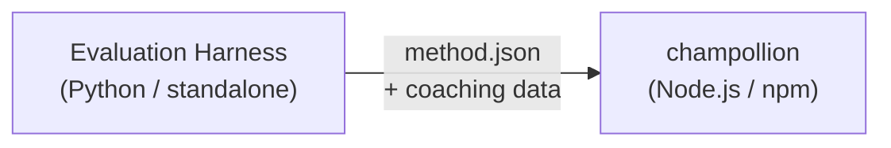

# Đặc tả Plugin Phương thức

> **Phiên bản**: 1.1  
> **Đối tượng**: Nhà phát triển plugin  
> **Schema chuẩn**: [`shared/schemas/champollion-plugin.schema.json`](https://github.com/gamedaysuits/Champollion/blob/main/cli/shared/schemas/champollion-plugin.schema.json)

## Tổng quan

champollion sử dụng một **hệ thống phương thức có thể cắm (pluggable)**. Mỗi cặp ngôn ngữ có thể sử dụng một phương thức dịch khác nhau (LLM, coached, script-converter, v.v.). Các phương thức được đăng ký trong `lib/translate.js` và được phân giải cho từng cặp thông qua `lib/pairs.js`.

Nhiệm vụ của bộ khung đánh giá (eval harness) là **phát triển, kiểm thử và xuất** các phương thức dịch. Nhiệm vụ của champollion là **tiêu thụ và thực thi** chúng. Plugin **chỉ chứa dữ liệu** — cấu hình, nội dung huấn luyện (coaching) và kết quả benchmark. Không có mã Python, không có phụ thuộc vào bộ khung đánh giá.

### Luồng dữ liệu



Bộ khung đánh giá phát triển và kiểm thử các phương thức bằng Python. Khi một phương thức đã sẵn sàng để triển khai, bộ khung sẽ xuất ra một tệp manifest `method.json` và các tệp dữ liệu huấn luyện tùy chọn. Champollion cài đặt và thực thi phương thức đó bằng cách sử dụng các triển khai phương thức tích hợp sẵn của riêng mình.

---

## Định dạng Plugin Phương thức

Một plugin phương thức là một tệp JSON duy nhất (`method.json`) đi kèm với các tệp dữ liệu huấn luyện tùy chọn.

### `method.json` — Bắt buộc

```json
{
  "name": "french-formal-v1",
  "type": "llm-coached",
  "version": "1.0.0",
  "description": "Formally-tuned French with terminology enforcement and grammar coaching",
  "author": "Plugin Author",

  "config": {
    "model": "google/gemini-3.5-flash",
    "temperature": 0.2,
    "batchSize": 80,
    "register": "formal",
    "coachingFile": null,
    "coachingPrompt": null,
    "promptContext": null,
    "qualityTier": null
  },

  "locales": ["fr"],

  "benchmarks": {
    "fr": {
      "date": "2026-05-11T00:00:00Z",
      "corpus_size": 500,
      "exact_match_rate": 0.42,
      "corpus_chrf": 72.3,
      "corpus_bleu": 45.1,
      "model": "google/gemini-3.5-flash",
      "harness_version": "1.0.0"
    }
  },

  "provenance": {
    "resources": [],
    "commercialReady": false,
    "flags": ["license-unclear"]
  },

  "coaching": {
    "dir": "coaching"
  }
}
```

### Tham chiếu trường

| Trường | Kiểu dữ liệu | Bắt buộc | Mô tả |
|-------|------|----------|-------------|
| `name` | string | ✅ | Định danh phương thức duy nhất (kebab-case) |
| `type` | string | ✅ | Loại phương thức Champollion: `llm`, `llm-coached`, `api`, `google-translate`, `deepl`, `microsoft-translator`, `libretranslate`, `openai`, `anthropic`, `gemini` |
| `version` | string | ✅ | Phiên bản Semver (ví dụ: `1.0.0`) |
| `locales` | string[] | ✅ | Mã locale mà phương thức này nhắm tới (tối thiểu 1) |
| `description` | string | — | Mô tả dễ đọc cho con người |
| `author` | string | — | Người đã phát triển/kiểm thử phương thức này |
| `config.model` | string | — | Định danh mô hình OpenRouter |
| `config.temperature` | number | — | Nhiệt độ (temperature) LLM (0.0–2.0, mặc định: 0.3) |
| `config.batchSize` | number | — | Số lượng khóa trên mỗi batch API (1–200, mặc định: 80) |
| `config.register` | string \| null | — | Văn phong/tông giọng của ngôn ngữ đích (khóa thiết lập sẵn hoặc văn bản tự do) |
| `config.coachingFile` | string \| null | — | Đường dẫn đến tệp prompt huấn luyện dạng văn bản tự do (tương đối so với thư mục gốc của dự án) |
| `config.coachingPrompt` | string \| null | — | Văn bản prompt huấn luyện đã được phân giải (đọc từ `coachingFile` khi chạy) |
| `config.promptContext` | string \| null | — | Ngữ cảnh ứng dụng được chèn vào system prompt (ví dụ: "Mô tả sản phẩm thương mại điện tử") |
| `config.qualityTier` | string \| null | — | Phân hạng chất lượng từ đánh giá benchmark (`standard`, `high`, `research`, `verified`) |
| `benchmarks` | object | — | Kết quả benchmark theo từng locale từ bộ khung đánh giá |
| `provenance` | object | — | Bản quyền và các phụ thuộc tài nguyên |
| `coaching.dir` | string | — | Đường dẫn tương đối đến thư mục dữ liệu huấn luyện |

:::info[Cấu trúc MethodConfig chuẩn]
Khối `config` sử dụng **schema MethodConfig chuẩn** — cùng 8 trường được sử dụng trên `champollion.config.json`, thẻ chạy của bộ khung đánh giá (harness run cards), `mt-eval export-config`, và việc xuất bản/cài đặt bảng xếp hạng (leaderboard). Tất cả các trường luôn luôn xuất hiện; các giá trị không sử dụng sẽ là `null`. Điều này đảm bảo quá trình chuyển đổi qua lại không gặp trở ngại giữa môi trường đánh giá và môi trường sản xuất.
:::

### Đối tượng Benchmark (theo từng locale)

| Trường | Kiểu dữ liệu | Bắt buộc | Mô tả |
|-------|------|----------|-------------|
| `date` | string | ✅ | Nhãn thời gian ISO 8601 của lượt chạy benchmark |
| `corpus_size` | number | ✅ | Số lượng mục được đánh giá |
| `exact_match_rate` | number | ✅ | 0.0–1.0, tỷ lệ khớp chính xác |
| `corpus_chrf` | number | — | Điểm số chrF++ (0–100) |
| `corpus_bleu` | number | — | Điểm số BLEU (0–100) |
| `model` | string | ✅ | Mô hình được sử dụng trong quá trình đánh giá |
| `harness_version` | string | ✅ | Phiên bản của bộ khung đánh giá được sử dụng |

:::info[Những chỉ số nào được hiển thị?]
Lệnh `champollion status` hiển thị **chrF++** và **tỷ lệ khớp chính xác (exact match rate)** từ khối benchmark. `corpus_bleu` được chấp nhận trong manifest nhưng hiện tại không được hiển thị hoặc sử dụng bởi bất kỳ lệnh champollion nào. [Bảng xếp hạng Phương thức](/leaderboard) theo dõi chrF++, khớp chính xác và tỷ lệ chấp nhận FST.
:::

---

### Đối tượng Nguồn gốc (Provenance)

Khối nguồn gốc truyền đạt trạng thái bản quyền của các tài nguyên đi kèm trong plugin.

| Trường | Kiểu dữ liệu | Mặc định | Mô tả |
|-------|------|---------|-------------|
| `resources` | object[] | `[]` | Danh sách các tài nguyên đi kèm với `name`, `license`, và `type` |
| `commercialReady` | boolean | `false` | Cho biết plugin có được phép phân phối thương mại hay không |
| `flags` | string[] | `["license-unclear"]` | Các cờ trạng thái có thể đọc được bằng máy |

**Trạng thái mặc định** — các plugin được xuất đi kèm với `commercialReady: false` và `flags: ["license-unclear"]`.

**Trạng thái đã xác minh** — khi bản quyền đã được xác minh: đặt `commercialReady: true` và xóa các cờ.

---

## Định dạng Dữ liệu Huấn luyện

Nếu `type` là `llm-coached`, plugin nên bao gồm các tệp dữ liệu huấn luyện trong thư mục con `coaching/`.

### `coaching/<locale>.json`

```json
{
  "grammar_rules": [
    "French adjectives agree in gender and number with the noun they modify",
    "Use 'vous' for formal contexts, 'tu' for informal"
  ],
  "dictionary": {
    "dashboard": "tableau de bord",
    "deployment": "déploiement",
    "settings": "paramètres"
  },
  "style_notes": "Prefer active voice. Avoid anglicisms where a native French term exists."
}
```

| Trường | Kiểu dữ liệu | Bắt buộc | Mô tả |
|-------|------|----------|-------------|
| `grammar_rules` | string[] | — | Các quy tắc được chèn vào mọi prompt LLM cho locale này |
| `dictionary` | object | — | Bản đồ Thuật ngữ → Bản dịch. Các thuật ngữ khớp sẽ được chèn vào dưới dạng thuật ngữ bắt buộc. |
| `style_notes` | string | — | Các hướng dẫn phong cách tự do được thêm vào cuối prompt |

---

## Cấu trúc Thư mục

```
french-formal-v1/
  method.json                 # Method manifest with benchmarks
  coaching/
    fr.json                   # Coaching data for French
```

Đối với các phương thức đa locale:

```
european-formal-v2/
  method.json                 # locales: ["fr", "de", "es", "it"]
  coaching/
    fr.json
    de.json
    es.json
    it.json
```

---

## Cách Champollion Tiêu thụ Plugin

### Cài đặt

```bash
champollion plugin install ./french-formal-v1/
```

Lưu vào `.champollion/methods/french-formal-v1/`.

### Cấu hình

```json title="champollion.config.json"
{
  "pairs": {
    "en:fr": {
      "methodPlugin": "french-formal-v1"
    }
  }
}
```

:::info[Ngữ nghĩa hợp nhất]
Plugin định nghĩa phương thức *nào* được sử dụng (`type`). Cấu hình cặp (pair config) tinh chỉnh cách chạy phương thức đó *như thế nào* (`model`, `register`, `batchSize`). Nếu cặp thiết lập `model`, nó sẽ ghi đè lên giá trị mặc định của plugin.
:::

### Lúc chạy (Runtime)

1. Champollion đọc `method.json` từ `.champollion/methods/french-formal-v1/`
2. Trường `type` của plugin thiết lập phương thức dịch (ví dụ: `llm-coached`)
3. Tải dữ liệu huấn luyện từ thư mục `coaching/` của plugin
4. Sử dụng khối `config` để điền vào các khoảng trống về model/register/temperature
5. Khối `benchmarks` được hiển thị trong đầu ra của `champollion status`
6. Khối `provenance` được kiểm tra bởi `champollion provenance` để tìm các cờ bản quyền

---

## Xác thực Schema

Các tệp manifest của plugin được xác thực tại thời điểm cài đặt dựa trên [`shared/schemas/champollion-plugin.schema.json`](https://github.com/gamedaysuits/Champollion/blob/main/cli/shared/schemas/champollion-plugin.schema.json).

Tham chiếu schema trong `method.json` của bạn để tự động hoàn thành mã (autocompletion) trong IDE:

```json
{
  "$schema": "./node_modules/champollion/shared/schemas/champollion-plugin.schema.json",
  "name": "my-method-v1"
}
```

---

## Những gì KHÔNG nên bao gồm

- ❌ Không có mã Python hoặc phụ thuộc vào bộ khung đánh giá
- ❌ Không có dữ liệu kho ngữ liệu (corpus) thô hoặc nhật ký chạy (run logs)
- ❌ Không có khóa API hoặc thông tin xác thực
- ❌ Không có cấu hình bộ khung đánh giá
- ❌ Không có các mẫu prompt nội bộ (những mẫu này nằm trong các triển khai phương thức của champollion)

Plugin **chỉ chứa dữ liệu**: cấu hình, nội dung huấn luyện và kết quả benchmark.

---

## Xem thêm

- [Phương thức Dịch](/docs/guides/translation-methods) — cách hoạt động của từng phương thức tích hợp sẵn
- [Cấu hình](/docs/getting-started/configuration) — cấu hình theo từng cặp và từng ngôn ngữ
- [Cung cấp Phương thức qua API](/docs/guides/serving-a-method) — lưu trữ các phương thức dưới dạng dịch vụ HTTP
- [Cookbook: FST-Gated Pipeline](/docs/network/tutorials/fst-gated-pipeline) — xây dựng và đóng gói một pipeline
- [Đánh giá MT](/docs/network/leaderboard/rules) — đánh giá benchmark các phương thức để gửi lên bảng xếp hạng
- [Hỗ trợ Ngôn ngữ Ít Tài nguyên](/docs/network/community/low-resource-languages) — trường hợp sử dụng cho các plugin cộng đồng
