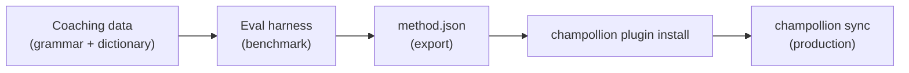

# Hướng dẫn: Xây dựng Plugin dịch thuật

Xây dựng một phương thức dịch thuật tùy chỉnh từ đầu, đánh giá hiệu năng (benchmark) và triển khai nó dưới dạng một plugin Champollion. Đây là quy trình hoàn chỉnh để thêm một cặp ngôn ngữ mới mà không có API sẵn có nào hỗ trợ.

**Những gì bạn sẽ xây dựng:** Một plugin dịch thuật có huấn luyện (coached translation) cho tiếng Pháp trang trọng với thuật ngữ bắt buộc, quy tắc ngữ pháp và điểm số đánh giá hiệu năng.

**Thời gian:** 30–45 phút

**Điều kiện tiên quyết:**
- Đã cài đặt Champollion (`npm install --save-dev champollion`)
- Một API key của OpenRouter (`OPENROUTER_API_KEY`)
- Python 3.10+ (dành cho bộ công cụ đánh giá - eval harness)

---

## Bước 1: Xác định vấn đề

Bạn đang dịch một trang quản trị (dashboard) SaaS sang tiếng Pháp. Phương thức `llm` mặc định tạo ra các bản dịch chính xác nhưng không nhất quán:

- Đôi khi "dashboard" được dịch thành "tableau de bord", lúc khác lại là "panneau de contrôle"
- Tông giọng luân phiên giữa các dạng `tu` và `vous`
- Các thuật ngữ kỹ thuật bị Anh hóa một cách không nhất quán

Bạn cần **áp dụng thuật ngữ bắt buộc** và **kiểm soát văn phong (register control)** mà prompt LLM thông thường không cung cấp được.

## Bước 2: Tạo dữ liệu huấn luyện (Coaching Data)

Tạo một tệp huấn luyện (coaching file) để mã hóa các yêu cầu ngôn ngữ của bạn:

```bash
mkdir -p .champollion/coaching
```

```json title=".champollion/coaching/fr.json"
{
  "grammar_rules": [
    "Always use the 'vous' form for formal register",
    "French adjectives agree in gender and number with their noun",
    "Use the present tense for UI instructions, not the imperative",
    "Preserve sentence-final punctuation style from the source"
  ],
  "dictionary": {
    "dashboard": "tableau de bord",
    "deployment": "déploiement",
    "settings": "paramètres",
    "environment variable": "variable d'environnement",
    "webhook": "webhook",
    "API key": "clé API",
    "sign in": "se connecter",
    "sign out": "se déconnecter",
    "repository": "dépôt",
    "pull request": "demande de tirage"
  },
  "style_notes": "Formal technical French. Prefer native French terms over anglicisms where established equivalents exist. Keep UI labels concise — 3 words maximum where possible."
}
```

**Chức năng của từng trường:**
- **`grammar_rules`** — Được đưa vào system prompt của LLM dưới dạng các ràng buộc rõ ràng
- **`dictionary`** — Được so khớp với các khóa nguồn; khi một thuật ngữ trong từ điển xuất hiện, nó sẽ được đưa vào prompt dưới dạng "thuật ngữ bắt buộc"
- **`style_notes`** — Được thêm vào cuối system prompt dưới dạng hướng dẫn phong cách chung

## Bước 3: Cấu hình cặp ngôn ngữ

Yêu cầu Champollion sử dụng `llm-coached` cho tiếng Pháp:

```json title="champollion.config.json"
{
  "version": 3,
  "inputLocale": "en",
  "localesDir": "./locales",
  "pairs": {
    "en:fr": {
      "method": "llm-coached",
      "model": "google/gemini-3.5-flash",
      "temperature": 0.2
    }
  },
  "languages": {
    "fr": {
      "register": "Formal technical French (vous-form)",
      "name": "French"
    }
  }
}
```

## Bước 4: Kiểm thử

```bash
npx champollion sync --dry
```

Xem lại kết quả chạy thử (dry-run). Kiểm tra xem:
- ✅ Các thuật ngữ trong từ điển được sử dụng nhất quán ("tableau de bord", không phải "panneau de contrôle")
- ✅ Dạng `vous` được sử dụng xuyên suốt
- ✅ Các thuật ngữ kỹ thuật khớp với từ điển của bạn

Sau đó chạy đồng bộ hóa thực tế:

```bash
npx champollion sync
```

## Bước 5: Đánh giá hiệu năng với Eval Harness (Tùy chọn)

Nếu bạn muốn có điểm số chất lượng — và chắc chắn bạn muốn, vì các plugin thường đi kèm với dữ liệu đánh giá hiệu năng — hãy sử dụng bộ công cụ đánh giá (eval harness) đi kèm.

### Cài đặt bộ công cụ đánh giá

```bash
pip install mt-eval-harness
```

### Tạo một kho ngữ liệu tham chiếu (Reference Corpus)

Tạo một tệp chứa các chuỗi nguồn và các bản dịch chuẩn đã biết:

```json title="corpus/french-formal.json"
[
  {
    "source": "Dashboard",
    "reference": "Tableau de bord"
  },
  {
    "source": "Sign in to your account",
    "reference": "Connectez-vous à votre compte"
  },
  {
    "source": "Your deployment is ready",
    "reference": "Votre déploiement est prêt"
  },
  {
    "source": "Environment variables",
    "reference": "Variables d'environnement"
  }
]
```

### Chạy đánh giá hiệu năng

```bash
mt-eval test \
  --corpus corpus/french-formal.json \
  --source en \
  --target fr \
  --model google/gemini-3.5-flash \
  --temperature 0.2 \
  --champollion-config champollion.config.json
```

Bộ công cụ sẽ xuất ra:
- **chrF++** — Điểm F-score ở cấp độ ký tự (0–100). Trên 70 là rất tốt.
- **BLEU** — Độ trùng lặp N-gram (0–100). Trên 40 là mức ổn định đối với dịch thuật có huấn luyện.
- **Exact match rate** — Tỷ lệ các bản dịch khớp hoàn toàn với bản dịch tham chiếu.
- **COMET** — Chỉ số chất lượng dựa trên mạng neural (nếu được cài đặt qua `mt-eval setup --comet`).

:::tip[Kiểm thử những gì bạn triển khai]
Sử dụng `--champollion-config` sẽ nhập trực tiếp mô hình production, văn phong (register), nhiệt độ (temperature) và dữ liệu huấn luyện từ `champollion.config.json` của bạn. Điều này đảm bảo bạn đang đánh giá hiệu năng của chính xác phương thức mà bạn sẽ triển khai.
:::

### Xuất Plugin

Khi bạn đã hài lòng với điểm số:

```bash
mt-eval export \
  --name french-formal-v1 \
  --report eval/logs/harness/run_report.json \
  --output ./french-formal-v1/
```

Lệnh này sẽ tạo ra:

```
french-formal-v1/
├── method.json          # Manifest with config + benchmarks
└── coaching/
    └── fr.json          # Your coaching data
```

## Bước 6: Cài đặt Plugin vào Champollion

```bash
npx champollion plugin install ./french-formal-v1/
```

Thao tác này sẽ sao chép plugin vào `.champollion/methods/french-formal-v1/`.

Cập nhật cấu hình của bạn để sử dụng nó:

```json title="champollion.config.json"
{
  "pairs": {
    "en:fr": {
      "methodPlugin": "french-formal-v1"
    }
  }
}
```

## Bước 7: Xác minh

```bash
# Check plugin is installed and shows benchmark scores
npx champollion status

# Run a sync with the plugin
npx champollion sync

# Audit licensing status
npx champollion provenance
```

Kết quả đầu ra của `status` sẽ hiển thị:

```
en → fr
  Method:    french-formal-v1 (llm-coached)
  Model:     google/gemini-3.5-flash
  Quality:   high
  chrF++:    74.2
  BLEU:      46.8
  Exact:     42%
```

## Những gì bạn đã xây dựng



Giờ đây bạn đã có:
1. **Dữ liệu huấn luyện (Coaching data)** — Các quy tắc ngữ pháp và thuật ngữ giúp đảm bảo tính nhất quán
2. **Điểm số đánh giá hiệu năng** — Chất lượng được định lượng đi kèm với plugin
3. **Một plugin di động** — `method.json` + dữ liệu huấn luyện, có thể cài đặt trên bất kỳ máy nào
4. **Triển khai production** — Được tích hợp vào quy trình đồng bộ hóa (sync pipeline) của bạn

## Các bước Tiếp theo

- **[Đặc tả Plugin](/docs/reference/plugin-spec)** — Tài liệu tham khảo đầy đủ về định dạng manifest
- **[Phương thức dịch thuật](/docs/guides/translation-methods)** — So sánh cả bốn phương thức
- **[Ngôn ngữ ít tài nguyên](/docs/network/community/low-resource-languages)** — Áp dụng mô hình này cho các ngôn ngữ không được API hỗ trợ
- **[Dịch 30 ngôn ngữ](/docs/tutorials/translate-30-languages)** — Mở rộng dự án của bạn ra quy mô toàn cầu
